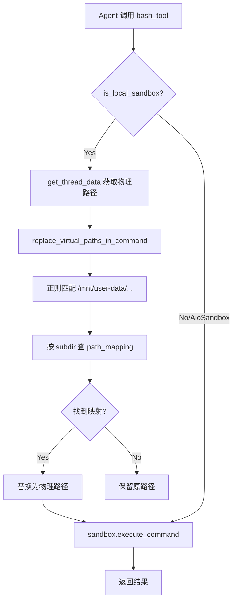
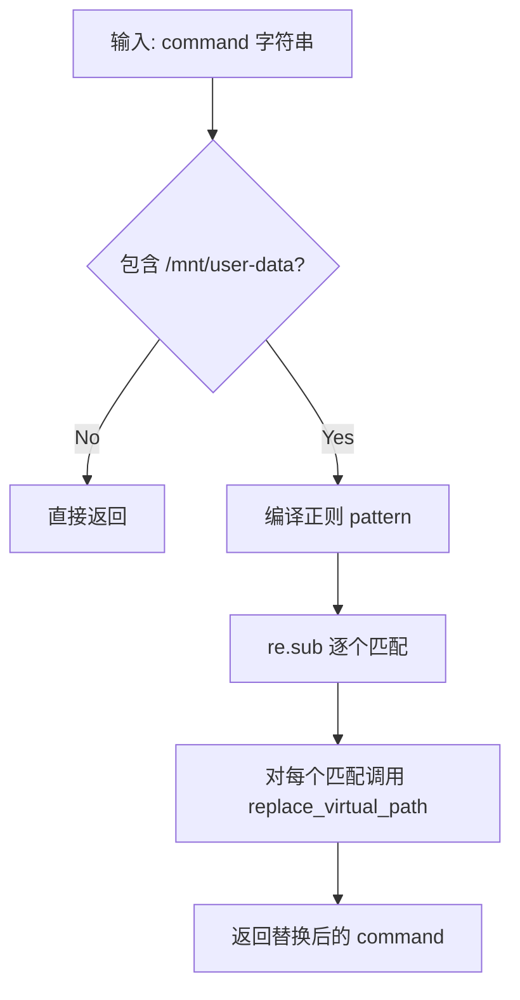
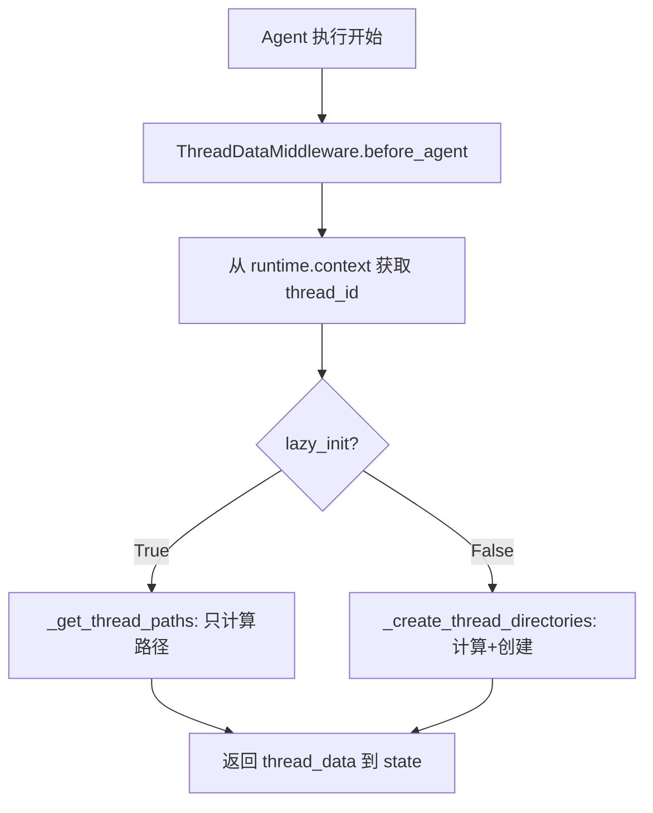

# PD-64.01 DeerFlow — 虚拟路径映射与线程目录隔离

> 文档编号：PD-64.01
> 来源：DeerFlow `backend/src/sandbox/tools.py`, `backend/src/sandbox/consts.py`, `backend/src/agents/middlewares/thread_data_middleware.py`
> GitHub：https://github.com/bytedance/deer-flow
> 问题域：PD-64 虚拟文件系统 Virtual Filesystem
> 状态：可复用方案

---

## 第 1 章 问题与动机（≥ 30 行）

### 1.1 核心问题

Agent 系统需要让 LLM 操作文件（读写、执行命令），但面临三个矛盾：

1. **路径不可预知**：物理路径因部署环境而异（本地 macOS vs Docker 容器 vs K8s Pod），LLM 无法硬编码路径
2. **多租户隔离**：多个对话线程并发运行，必须防止线程 A 读写线程 B 的文件
3. **双后端统一**：本地开发用 subprocess 直接执行，生产环境用 Docker 容器，Agent 的 prompt 和工具调用不应因后端切换而改变

如果不解决这些问题，Agent 要么只能在单一环境运行，要么需要在 prompt 中注入大量环境特定信息，增加上下文消耗和出错概率。

### 1.2 DeerFlow 的解法概述

DeerFlow 设计了一套三层虚拟文件系统方案：

1. **虚拟路径常量**：Agent 始终看到 `/mnt/user-data/{workspace,uploads,outputs}` 和 `/mnt/skills/` 两组虚拟路径（`backend/src/sandbox/consts.py:4`）
2. **中间件注入物理路径**：`ThreadDataMiddleware` 在 Agent 执行前计算线程专属的物理路径并注入 state（`backend/src/agents/middlewares/thread_data_middleware.py:78`）
3. **工具层透明替换**：每个沙箱工具（bash/ls/read_file/write_file/str_replace）在执行前调用 `replace_virtual_path()` 将虚拟路径转为物理路径（`backend/src/sandbox/tools.py:17-61`）
4. **双向路径映射**：LocalSandbox 不仅正向解析（虚拟→物理），还反向解析（物理→虚拟），确保命令输出中的路径对 Agent 一致（`backend/src/sandbox/local/local_sandbox.py:45-67`）
5. **Gateway 层安全解析**：HTTP API 端点通过 `resolve_thread_virtual_path()` 解析虚拟路径并做路径遍历防护（`backend/src/gateway/path_utils.py:14-44`）

### 1.3 设计思想

| 设计原则 | 具体实现 | 理由 | 替代方案 |
|----------|----------|------|----------|
| 虚拟路径抽象 | `/mnt/user-data/` 常量前缀 | Agent prompt 不依赖部署环境 | 每次注入物理路径到 prompt（浪费 token） |
| 中间件注入 | ThreadDataMiddleware.before_agent() | 路径计算与 Agent 逻辑解耦 | 在每个工具内部计算路径（重复代码） |
| 工具层透明替换 | replace_virtual_path() + 正则批量替换 | Agent 无感知，工具调用不变 | 要求 Agent 自己做路径转换（不可靠） |
| 双向映射 | _resolve_path() + _reverse_resolve_path() | 命令输出中的路径也保持虚拟化 | 只做正向映射（Agent 看到物理路径会困惑） |
| 懒初始化 | lazy_init=True 延迟创建目录 | 不使用文件系统的线程不浪费 I/O | 预创建所有目录（浪费资源） |
| 路径遍历防护 | resolve() + startswith() 检查 | 防止 `../../etc/passwd` 攻击 | 无防护（安全漏洞） |

---

## 第 2 章 源码实现分析（≥ 60 行，核心章节）

### 2.1 架构概览

DeerFlow 的虚拟文件系统分为四层，从 Agent 视角到物理存储逐层转换：

```
┌─────────────────────────────────────────────────────────────┐
│  Agent Prompt 层                                             │
│  Agent 看到: /mnt/user-data/uploads/data.csv                │
│              /mnt/skills/public/my-skill/SKILL.md           │
├─────────────────────────────────────────────────────────────┤
│  Middleware 层 (ThreadDataMiddleware)                        │
│  before_agent() → 注入 thread_data:                         │
│    workspace_path: .deer-flow/threads/{tid}/user-data/workspace │
│    uploads_path:   .deer-flow/threads/{tid}/user-data/uploads   │
│    outputs_path:   .deer-flow/threads/{tid}/user-data/outputs   │
├─────────────────────────────────────────────────────────────┤
│  Tool 层 (sandbox/tools.py)                                 │
│  bash_tool / ls_tool / read_file_tool / write_file_tool     │
│  → is_local_sandbox() ? replace_virtual_path() : 直通       │
├─────────────────────────────────────────────────────────────┤
│  Sandbox 层                                                  │
│  LocalSandbox: subprocess + path_mappings (双向映射)         │
│  AioSandbox:   HTTP → Docker 容器 (已挂载 /mnt/user-data)   │
└─────────────────────────────────────────────────────────────┘
```

关键设计：本地模式需要两层路径替换（tools.py 的 user-data 替换 + LocalSandbox 的 skills 替换），容器模式通过 Docker volume mount 直接映射，无需替换。

### 2.2 核心实现

#### 2.2.1 虚拟路径替换引擎



对应源码 `backend/src/sandbox/tools.py:17-61`：

```python
def replace_virtual_path(path: str, thread_data: ThreadDataState | None) -> str:
    """Replace virtual /mnt/user-data paths with actual thread data paths.

    Mapping:
        /mnt/user-data/workspace/* -> thread_data['workspace_path']/*
        /mnt/user-data/uploads/* -> thread_data['uploads_path']/*
        /mnt/user-data/outputs/* -> thread_data['outputs_path']/*
    """
    if not path.startswith(VIRTUAL_PATH_PREFIX):
        return path
    if thread_data is None:
        return path

    path_mapping = {
        "workspace": thread_data.get("workspace_path"),
        "uploads": thread_data.get("uploads_path"),
        "outputs": thread_data.get("outputs_path"),
    }

    relative_path = path[len(VIRTUAL_PATH_PREFIX):].lstrip("/")
    if not relative_path:
        return path

    parts = relative_path.split("/", 1)
    subdir = parts[0]
    rest = parts[1] if len(parts) > 1 else ""

    actual_base = path_mapping.get(subdir)
    if actual_base is None:
        return path

    if rest:
        return f"{actual_base}/{rest}"
    return actual_base
```

该函数的设计要点：
- 前缀检查 fast-path：非虚拟路径直接返回，零开销（`tools.py:32`）
- 三子目录映射：workspace/uploads/outputs 各有独立物理路径（`tools.py:39-43`）
- 安全降级：thread_data 为 None 或子目录未知时返回原路径（`tools.py:35-36, 56-57`）

#### 2.2.2 命令字符串批量替换



对应源码 `backend/src/sandbox/tools.py:64-87`：

```python
def replace_virtual_paths_in_command(command: str, thread_data: ThreadDataState | None) -> str:
    if VIRTUAL_PATH_PREFIX not in command:
        return command
    if thread_data is None:
        return command

    # Pattern to match /mnt/user-data followed by path characters
    pattern = re.compile(rf"{re.escape(VIRTUAL_PATH_PREFIX)}(/[^\s\"';&|<>()]*)?")

    def replace_match(match: re.Match) -> str:
        full_path = match.group(0)
        return replace_virtual_path(full_path, thread_data)

    return pattern.sub(replace_match, command)
```

正则 `(/[^\s"';&|<>()]*)?` 精确匹配路径字符，排除 shell 元字符（分号、管道、重定向等），避免误替换。

#### 2.2.3 ThreadDataMiddleware 路径注入



对应源码 `backend/src/agents/middlewares/thread_data_middleware.py:47-95`：

```python
def _get_thread_paths(self, thread_id: str) -> dict[str, str]:
    thread_dir = Path(self._base_dir) / THREAD_DATA_BASE_DIR / thread_id / "user-data"
    return {
        "workspace_path": str(thread_dir / "workspace"),
        "uploads_path": str(thread_dir / "uploads"),
        "outputs_path": str(thread_dir / "outputs"),
    }

@override
def before_agent(self, state: ThreadDataMiddlewareState, runtime: Runtime) -> dict | None:
    thread_id = runtime.context.get("thread_id")
    if thread_id is None:
        raise ValueError("Thread ID is required in the context")

    if self._lazy_init:
        paths = self._get_thread_paths(thread_id)
    else:
        paths = self._create_thread_directories(thread_id)

    return {"thread_data": {**paths}}
```

目录结构：`.deer-flow/threads/{thread_id}/user-data/{workspace,uploads,outputs}`

### 2.3 实现细节

#### 双后端路径策略差异

| 特性 | LocalSandbox | AioSandbox (Docker) |
|------|-------------|---------------------|
| user-data 路径替换 | tools.py 中 replace_virtual_path() | Docker volume mount 直接映射 |
| skills 路径替换 | LocalSandbox._resolve_path() via path_mappings | Docker volume mount (read-only) |
| 输出路径反向映射 | _reverse_resolve_paths_in_output() | 不需要（容器内路径即虚拟路径） |
| 目录创建 | ensure_thread_directories_exist() 懒创建 | _get_thread_mounts() 创建后挂载 |

#### AioSandbox 的 Docker 挂载

`AioSandboxProvider._get_thread_mounts()` (`backend/src/community/aio_sandbox/aio_sandbox_provider.py:201-218`) 将物理目录挂载到容器的 `/mnt/user-data/` 下：

```python
@staticmethod
def _get_thread_mounts(thread_id: str) -> list[tuple[str, str, bool]]:
    base_dir = os.getcwd()
    thread_dir = Path(base_dir) / THREAD_DATA_BASE_DIR / thread_id / "user-data"
    mounts = [
        (str(thread_dir / "workspace"), f"{VIRTUAL_PATH_PREFIX}/workspace", False),
        (str(thread_dir / "uploads"), f"{VIRTUAL_PATH_PREFIX}/uploads", False),
        (str(thread_dir / "outputs"), f"{VIRTUAL_PATH_PREFIX}/outputs", False),
    ]
    for host_path, _, _ in mounts:
        os.makedirs(host_path, exist_ok=True)
    return mounts
```

#### Gateway 层路径安全

`path_utils.py:14-44` 的 `resolve_thread_virtual_path()` 在 HTTP API 层做路径遍历防护：

```python
def resolve_thread_virtual_path(thread_id: str, virtual_path: str) -> Path:
    virtual_path = virtual_path.lstrip("/")
    if not virtual_path.startswith(VIRTUAL_PATH_PREFIX):
        raise HTTPException(status_code=400, detail=f"Path must start with /{VIRTUAL_PATH_PREFIX}")
    relative_path = virtual_path[len(VIRTUAL_PATH_PREFIX):].lstrip("/")
    base_dir = Path(os.getcwd()) / THREAD_DATA_BASE_DIR / thread_id / "user-data"
    actual_path = base_dir / relative_path
    try:
        actual_path = actual_path.resolve()
        base_resolved = base_dir.resolve()
        if not str(actual_path).startswith(str(base_resolved)):
            raise HTTPException(status_code=403, detail="Access denied: path traversal detected")
    except (ValueError, RuntimeError):
        raise HTTPException(status_code=400, detail="Invalid path")
    return actual_path
```

关键防护：`resolve()` 消除 `..` 后检查是否仍在 base_dir 下，阻止路径遍历攻击。

---

## 第 3 章 迁移指南（≥ 40 行）

### 3.1 迁移清单

**阶段 1：定义虚拟路径常量**
- [ ] 定义虚拟路径前缀常量（如 `/mnt/user-data`）
- [ ] 定义线程数据基础目录（如 `.app/threads`）
- [ ] 定义子目录映射表（workspace/uploads/outputs）

**阶段 2：实现路径替换引擎**
- [ ] 实现单路径替换函数 `replace_virtual_path()`
- [ ] 实现命令字符串批量替换函数 `replace_virtual_paths_in_command()`
- [ ] 编写正则表达式匹配路径字符（排除 shell 元字符）

**阶段 3：实现中间件注入**
- [ ] 创建 ThreadDataMiddleware，在 before_agent() 中注入路径
- [ ] 支持 lazy_init 模式（默认只计算路径，不创建目录）
- [ ] 在工具层添加 ensure_thread_directories_exist() 懒创建

**阶段 4：适配双后端**
- [ ] 本地模式：在每个工具调用前做路径替换
- [ ] 容器模式：通过 Docker volume mount 映射，跳过替换
- [ ] 实现 is_local_sandbox() 判断当前后端类型

**阶段 5：安全加固**
- [ ] Gateway 层实现路径遍历防护（resolve + startswith）
- [ ] 确保虚拟路径前缀校验在所有入口点生效

### 3.2 适配代码模板

以下是一个可直接复用的最小虚拟路径系统实现：

```python
"""virtual_fs.py — 最小可运行的虚拟路径映射系统"""
import os
import re
from pathlib import Path
from typing import TypedDict, NotRequired

# ── 常量 ──
VIRTUAL_PREFIX = "/mnt/user-data"
THREAD_BASE_DIR = ".app-data/threads"

SUBDIRS = ("workspace", "uploads", "outputs")


class ThreadPaths(TypedDict):
    workspace_path: NotRequired[str | None]
    uploads_path: NotRequired[str | None]
    outputs_path: NotRequired[str | None]


# ── 路径计算 ──
def get_thread_paths(thread_id: str, base_dir: str | None = None) -> ThreadPaths:
    """计算线程的三个物理路径（不创建目录）。"""
    base = base_dir or os.getcwd()
    thread_dir = Path(base) / THREAD_BASE_DIR / thread_id / "user-data"
    return {
        f"{subdir}_path": str(thread_dir / subdir)
        for subdir in SUBDIRS
    }


def ensure_dirs(paths: ThreadPaths) -> None:
    """懒创建目录，仅在首次文件操作时调用。"""
    for key in ("workspace_path", "uploads_path", "outputs_path"):
        p = paths.get(key)
        if p:
            os.makedirs(p, exist_ok=True)


# ── 路径替换 ──
def replace_virtual_path(path: str, paths: ThreadPaths) -> str:
    """单路径替换：/mnt/user-data/workspace/foo → 物理路径/foo"""
    if not path.startswith(VIRTUAL_PREFIX):
        return path

    mapping = {
        "workspace": paths.get("workspace_path"),
        "uploads": paths.get("uploads_path"),
        "outputs": paths.get("outputs_path"),
    }

    relative = path[len(VIRTUAL_PREFIX):].lstrip("/")
    if not relative:
        return path

    parts = relative.split("/", 1)
    actual_base = mapping.get(parts[0])
    if actual_base is None:
        return path

    rest = parts[1] if len(parts) > 1 else ""
    return f"{actual_base}/{rest}" if rest else actual_base


_PATH_PATTERN = re.compile(
    rf"{re.escape(VIRTUAL_PREFIX)}(/[^\s\"';&|<>()]*)?"
)

def replace_in_command(command: str, paths: ThreadPaths) -> str:
    """命令字符串中批量替换所有虚拟路径。"""
    if VIRTUAL_PREFIX not in command:
        return command
    return _PATH_PATTERN.sub(
        lambda m: replace_virtual_path(m.group(0), paths),
        command,
    )


# ── 安全校验（Gateway 层使用）──
def resolve_safe(thread_id: str, virtual_path: str) -> Path:
    """解析虚拟路径并防止路径遍历攻击。"""
    clean = virtual_path.lstrip("/")
    prefix_no_slash = VIRTUAL_PREFIX.lstrip("/")
    if not clean.startswith(prefix_no_slash):
        raise ValueError(f"Path must start with {VIRTUAL_PREFIX}")

    relative = clean[len(prefix_no_slash):].lstrip("/")
    base = Path(os.getcwd()) / THREAD_BASE_DIR / thread_id / "user-data"
    actual = (base / relative).resolve()

    if not str(actual).startswith(str(base.resolve())):
        raise PermissionError("Path traversal detected")
    return actual
```

### 3.3 适用场景

| 场景 | 适用度 | 说明 |
|------|--------|------|
| 多租户 Agent 平台 | ⭐⭐⭐ | 每个对话线程独立目录，天然隔离 |
| 本地+容器双模式部署 | ⭐⭐⭐ | 虚拟路径屏蔽底层差异，Agent prompt 不变 |
| 单用户本地 Agent | ⭐⭐ | 仍有价值（路径抽象），但隔离需求低 |
| 无文件操作的 Agent | ⭐ | 不需要虚拟文件系统 |
| 分布式多节点部署 | ⭐⭐ | 需额外共享存储（NFS/S3），虚拟路径层仍适用 |

---

## 第 4 章 测试用例（≥ 20 行）

```python
"""test_virtual_fs.py — 基于 DeerFlow 真实函数签名的测试"""
import os
import tempfile
import pytest
from pathlib import Path


# ── 模拟 DeerFlow 的核心函数 ──
VIRTUAL_PATH_PREFIX = "/mnt/user-data"

def replace_virtual_path(path, thread_data):
    if not path.startswith(VIRTUAL_PATH_PREFIX):
        return path
    if thread_data is None:
        return path
    mapping = {
        "workspace": thread_data.get("workspace_path"),
        "uploads": thread_data.get("uploads_path"),
        "outputs": thread_data.get("outputs_path"),
    }
    relative = path[len(VIRTUAL_PATH_PREFIX):].lstrip("/")
    if not relative:
        return path
    parts = relative.split("/", 1)
    actual_base = mapping.get(parts[0])
    if actual_base is None:
        return path
    rest = parts[1] if len(parts) > 1 else ""
    return f"{actual_base}/{rest}" if rest else actual_base


class TestReplaceVirtualPath:
    """测试虚拟路径替换核心逻辑。"""

    @pytest.fixture
    def thread_data(self, tmp_path):
        return {
            "workspace_path": str(tmp_path / "workspace"),
            "uploads_path": str(tmp_path / "uploads"),
            "outputs_path": str(tmp_path / "outputs"),
        }

    def test_workspace_path(self, thread_data, tmp_path):
        result = replace_virtual_path("/mnt/user-data/workspace/project/main.py", thread_data)
        assert result == f"{tmp_path}/workspace/project/main.py"

    def test_uploads_root(self, thread_data, tmp_path):
        result = replace_virtual_path("/mnt/user-data/uploads", thread_data)
        assert result == f"{tmp_path}/uploads"

    def test_outputs_nested(self, thread_data, tmp_path):
        result = replace_virtual_path("/mnt/user-data/outputs/report.html", thread_data)
        assert result == f"{tmp_path}/outputs/report.html"

    def test_non_virtual_path_passthrough(self, thread_data):
        result = replace_virtual_path("/home/user/file.txt", thread_data)
        assert result == "/home/user/file.txt"

    def test_none_thread_data(self):
        result = replace_virtual_path("/mnt/user-data/workspace/foo", None)
        assert result == "/mnt/user-data/workspace/foo"

    def test_unknown_subdir(self, thread_data):
        result = replace_virtual_path("/mnt/user-data/unknown/foo", thread_data)
        assert result == "/mnt/user-data/unknown/foo"

    def test_prefix_only(self, thread_data):
        result = replace_virtual_path("/mnt/user-data", thread_data)
        assert result == "/mnt/user-data"

    def test_prefix_with_slash(self, thread_data):
        result = replace_virtual_path("/mnt/user-data/", thread_data)
        assert result == "/mnt/user-data/"


class TestPathTraversalPrevention:
    """测试路径遍历防护。"""

    def test_normal_path(self, tmp_path):
        base = tmp_path / ".app/threads/t1/user-data"
        base.mkdir(parents=True)
        actual = (base / "outputs/file.txt").resolve()
        assert str(actual).startswith(str(base.resolve()))

    def test_traversal_blocked(self, tmp_path):
        base = tmp_path / ".app/threads/t1/user-data"
        base.mkdir(parents=True)
        malicious = (base / "../../etc/passwd").resolve()
        assert not str(malicious).startswith(str(base.resolve()))
```

---

## 第 5 章 跨域关联

| 关联域 | 关系类型 | 说明 |
|--------|----------|------|
| PD-05 沙箱隔离 | 强依赖 | 虚拟文件系统是沙箱隔离的文件层实现，LocalSandbox 和 AioSandbox 是执行隔离层 |
| PD-04 工具系统 | 协同 | 每个沙箱工具（bash/ls/read_file/write_file/str_replace）都内置路径替换逻辑 |
| PD-10 中间件管道 | 协同 | ThreadDataMiddleware 作为中间件注入路径，UploadsMiddleware 注入上传文件列表 |
| PD-01 上下文管理 | 协同 | 虚拟路径减少 prompt 中的环境信息注入，节省 token |
| PD-09 Human-in-the-Loop | 协同 | 用户通过 Gateway API 上传文件到 uploads 目录，Agent 通过虚拟路径读取 |

---

## 第 6 章 来源文件索引

| 文件 | 行范围 | 关键实现 |
|------|--------|----------|
| `backend/src/sandbox/consts.py` | L1-5 | 虚拟路径前缀常量 VIRTUAL_PATH_PREFIX、线程数据基础目录 |
| `backend/src/sandbox/tools.py` | L17-61 | replace_virtual_path() 单路径替换核心函数 |
| `backend/src/sandbox/tools.py` | L64-87 | replace_virtual_paths_in_command() 命令字符串批量替换 |
| `backend/src/sandbox/tools.py` | L90-112 | get_thread_data() / is_local_sandbox() 辅助函数 |
| `backend/src/sandbox/tools.py` | L141-229 | ensure_sandbox_initialized() 懒初始化 + ensure_thread_directories_exist() |
| `backend/src/sandbox/tools.py` | L232-254 | bash_tool 工具实现（含路径替换调用链） |
| `backend/src/agents/middlewares/thread_data_middleware.py` | L19-95 | ThreadDataMiddleware 完整实现（路径计算+注入） |
| `backend/src/agents/thread_state.py` | L10-13 | ThreadDataState TypedDict 定义 |
| `backend/src/sandbox/local/local_sandbox.py` | L9-184 | LocalSandbox 双向路径映射（_resolve_path + _reverse_resolve_path） |
| `backend/src/sandbox/local/local_sandbox_provider.py` | L8-61 | LocalSandboxProvider 单例模式 + skills 路径映射 |
| `backend/src/community/aio_sandbox/aio_sandbox_provider.py` | L200-218 | AioSandboxProvider._get_thread_mounts() Docker 挂载 |
| `backend/src/community/aio_sandbox/aio_sandbox_provider.py` | L220-232 | _get_skills_mount() skills 只读挂载 |
| `backend/src/gateway/path_utils.py` | L14-44 | resolve_thread_virtual_path() 路径遍历防护 |
| `backend/src/gateway/routers/artifacts.py` | L61-158 | 制品下载 API（使用虚拟路径解析） |
| `backend/src/agents/middlewares/uploads_middleware.py` | L22-221 | UploadsMiddleware 上传文件列表注入 |
| `backend/src/agents/lead_agent/prompt.py` | L238-249 | Agent prompt 中的虚拟路径说明 |
| `backend/src/config/skills_config.py` | L6-50 | SkillsConfig 容器路径配置 |
| `backend/src/sandbox/sandbox.py` | L1-73 | Sandbox 抽象基类定义 |
| `backend/src/sandbox/sandbox_provider.py` | L1-97 | SandboxProvider 抽象基类 + 单例管理 |

---

## 第 7 章 横向对比维度

```json comparison_data
{
  "project": "DeerFlow",
  "dimensions": {
    "虚拟路径方案": "固定前缀 /mnt/user-data + 三子目录映射，工具层正则批量替换",
    "目录隔离粒度": "线程级：.deer-flow/threads/{thread_id}/user-data/{workspace,uploads,outputs}",
    "双后端统一": "本地用 replace_virtual_path 软替换，Docker 用 volume mount 硬映射",
    "路径安全防护": "Gateway 层 resolve()+startswith() 防路径遍历，403 拒绝",
    "懒初始化策略": "中间件只计算路径，工具首次调用时 ensure_thread_directories_exist()",
    "双向映射": "LocalSandbox 正向解析命令输入 + 反向解析命令输出，Agent 始终看虚拟路径",
    "Skills 挂载": "/mnt/skills 独立映射，容器只读挂载，本地通过 path_mappings 字典"
  }
}
```

### 域元数据补充

```json domain_metadata
{
  "solution_summary": "DeerFlow 用固定虚拟前缀 /mnt/user-data + 工具层正则替换 + ThreadDataMiddleware 注入实现双后端透明路径映射，LocalSandbox 支持双向映射保持 Agent 视角一致",
  "description": "Agent 工具链中的路径抽象层，屏蔽本地与容器执行环境差异",
  "sub_problems": [
    "命令输出中物理路径的反向虚拟化",
    "Skills 目录的独立只读挂载",
    "Gateway API 层虚拟路径安全解析"
  ],
  "best_practices": [
    "工具层正则替换排除 shell 元字符避免误匹配",
    "中间件懒初始化只计算路径不创建目录减少 I/O",
    "LocalSandbox 双向映射确保 Agent 输入输出路径一致"
  ]
}
```
