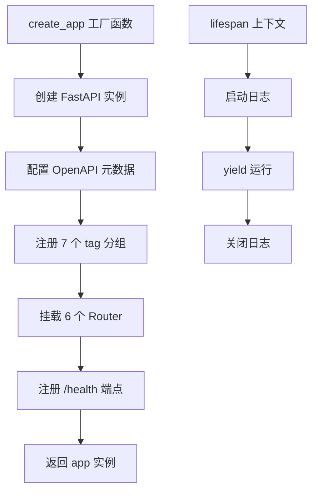
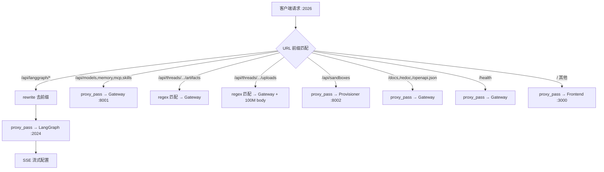

# PD-65.01 DeerFlow — FastAPI Gateway + Nginx 双层 API 网关

> 文档编号：PD-65.01
> 来源：DeerFlow `backend/src/gateway/app.py`
> GitHub：https://github.com/bytedance/deer-flow
> 问题域：PD-65 API 网关 API Gateway
> 状态：可复用方案

---

## 第 1 章 问题与动机

### 1.1 核心问题

AI Agent 系统通常由多个异构后端组成：LLM 推理服务（LangGraph Server）、自定义业务 API（模型管理、技能管理、记忆系统）、前端静态资源、沙箱管理服务等。前端需要一个统一入口来访问所有这些服务，同时需要解决：

- **路由分发**：不同 URL 前缀路由到不同后端进程
- **CORS 统一处理**：避免每个后端各自配置 CORS 导致冲突
- **SSE/流式传输**：LLM 推理需要长连接和流式响应
- **API 文档自动生成**：开发者需要 Swagger/ReDoc 文档
- **大文件上传**：用户上传 PDF/PPT 等文件需要特殊处理
- **虚拟路径映射**：沙箱环境中的虚拟路径需要映射到宿主机真实路径

### 1.2 DeerFlow 的解法概述

DeerFlow 采用 **Nginx + FastAPI Gateway 双层架构**：

1. **Nginx 作为统一入口**（端口 2026）：基于 URL 前缀做路由分发，集中处理 CORS，为 LangGraph 路由配置 SSE 流式支持（`backend/src/gateway/app.py:100`）
2. **FastAPI Gateway 作为业务 API 层**（端口 8001）：提供 6 组 RESTful API（models/mcp/memory/skills/artifacts/uploads），自动生成 OpenAPI 文档（`backend/src/gateway/app.py:42-98`）
3. **路由分离原则**：LangGraph Server 的 `/api/langgraph/*` 由 Nginx 直接代理到 LangGraph Server（端口 2024），其余 `/api/*` 路由到 Gateway（`docker/nginx/nginx.conf:61-85`）
4. **虚拟路径安全映射**：通过 `path_utils.py` 将沙箱虚拟路径 `/mnt/user-data/...` 安全映射到宿主机路径，含路径遍历防护（`backend/src/gateway/path_utils.py:14-44`）
5. **配置驱动**：Gateway 配置通过环境变量注入，支持 Docker 和本地两种部署模式（`backend/src/gateway/config.py:17-27`）

### 1.3 设计思想

| 设计原则 | 具体实现 | 理由 | 替代方案 |
|----------|----------|------|----------|
| 关注点分离 | Nginx 负责路由/CORS/流式，FastAPI 负责业务逻辑 | 各层职责清晰，Nginx 擅长反向代理，FastAPI 擅长 API 开发 | 全部用 FastAPI 处理（性能差）或全部用 Nginx+Lua（开发效率低） |
| CORS 集中管理 | Nginx 统一添加 CORS 头，隐藏上游 CORS 头 | 避免多后端各自配置 CORS 导致重复头或冲突 | 每个后端各自配置 CORS middleware |
| 路由前缀约定 | 所有 API 统一 `/api` 前缀，Router 级别声明 | 前端只需知道一个入口，路由规则清晰 | 每个服务独立端口，前端分别调用 |
| 安全边界 | path_utils 做路径遍历检测，resolve() + startswith() | 防止用户通过 `../` 访问沙箱外文件 | 无安全检查（危险） |
| 环境适配 | nginx.conf（Docker）和 nginx.local.conf（本地）两套配置 | Docker 用服务名解析，本地用 localhost | 单一配置 + 条件判断（复杂） |

---

## 第 2 章 源码实现分析

### 2.1 架构概览

DeerFlow 的 API 网关采用双层架构，Nginx 在最前端做路由分发，FastAPI Gateway 在后端提供业务 API：

```
                          ┌─────────────────────────────────────────────┐
                          │           Nginx (port 2026)                 │
                          │         统一入口 + CORS + 路由分发            │
                          └──────┬──────────┬──────────┬────────────────┘
                                 │          │          │
                    /api/langgraph/*   /api/*      /（其他）
                                 │          │          │
                                 ▼          ▼          ▼
                          ┌──────────┐ ┌──────────┐ ┌──────────┐
                          │LangGraph │ │ Gateway  │ │ Frontend │
                          │ Server   │ │ (FastAPI)│ │ (Next.js)│
                          │ :2024    │ │ :8001    │ │ :3000    │
                          └──────────┘ └────┬─────┘ └──────────┘
                                            │
                          ┌─────────────────┼─────────────────┐
                          │                 │                 │
                     ┌────┴────┐  ┌────────┴───────┐  ┌─────┴─────┐
                     │ models  │  │ skills/mcp/    │  │ artifacts │
                     │ router  │  │ memory routers │  │ /uploads  │
                     └─────────┘  └────────────────┘  └───────────┘
```

### 2.2 核心实现

#### 2.2.1 FastAPI Application Factory



对应源码 `backend/src/gateway/app.py:35-134`：

```python
def create_app() -> FastAPI:
    app = FastAPI(
        title="DeerFlow API Gateway",
        description="...",
        version="0.1.0",
        lifespan=lifespan,
        docs_url="/docs",
        redoc_url="/redoc",
        openapi_url="/openapi.json",
        openapi_tags=[
            {"name": "models", "description": "Operations for querying available AI models..."},
            {"name": "mcp", "description": "Manage Model Context Protocol..."},
            {"name": "memory", "description": "Access and manage global memory data..."},
            {"name": "skills", "description": "Manage skills and their configurations"},
            {"name": "artifacts", "description": "Access and download thread artifacts..."},
            {"name": "uploads", "description": "Upload and manage user files for threads"},
            {"name": "health", "description": "Health check and system status endpoints"},
        ],
    )
    # CORS is handled by nginx - no need for FastAPI middleware
    app.include_router(models.router)
    app.include_router(mcp.router)
    app.include_router(memory.router)
    app.include_router(skills.router)
    app.include_router(artifacts.router)
    app.include_router(uploads.router)

    @app.get("/health", tags=["health"])
    async def health_check() -> dict:
        return {"status": "healthy", "service": "deer-flow-gateway"}

    return app
```

关键设计点：
- `app.py:100` 注释明确说明 CORS 由 Nginx 处理，Gateway 不加 CORS middleware
- `app.py:26-29` lifespan 注释说明 MCP 工具初始化不在 Gateway 做，因为 Gateway 和 LangGraph Server 是独立进程
- 每个 Router 使用 `prefix="/api"` 统一前缀（`models.py:6`, `skills.py:19`, `mcp.py:11`, `memory.py:9`）

#### 2.2.2 Nginx 路由分发与 CORS 集中处理



对应源码 `docker/nginx/nginx.conf:37-220`：

```nginx
server {
    listen 2026 default_server;

    # 隐藏上游 CORS 头，防止重复
    proxy_hide_header 'Access-Control-Allow-Origin';
    proxy_hide_header 'Access-Control-Allow-Methods';
    proxy_hide_header 'Access-Control-Allow-Headers';
    proxy_hide_header 'Access-Control-Allow-Credentials';

    # Nginx 统一添加 CORS 头
    add_header 'Access-Control-Allow-Origin' '*' always;
    add_header 'Access-Control-Allow-Methods' 'GET, POST, PUT, DELETE, PATCH, OPTIONS' always;
    add_header 'Access-Control-Allow-Headers' '*' always;

    # OPTIONS 预检直接返回 204
    if ($request_method = 'OPTIONS') {
        return 204;
    }

    # LangGraph 路由：rewrite 去掉 /api/langgraph 前缀
    location /api/langgraph/ {
        rewrite ^/api/langgraph/(.*) /$1 break;
        proxy_pass http://langgraph;
        proxy_buffering off;          # SSE 必须关闭缓冲
        proxy_cache off;
        proxy_set_header X-Accel-Buffering no;
        proxy_read_timeout 600s;      # 长连接超时 10 分钟
        chunked_transfer_encoding on;
    }

    # 上传路由：允许 100M 大文件
    location ~ ^/api/threads/[^/]+/uploads {
        proxy_pass http://gateway;
        client_max_body_size 100M;
        proxy_request_buffering off;
    }
}
```

关键设计点：
- `nginx.conf:43-47` 先 `proxy_hide_header` 隐藏上游 CORS 头，再统一添加，避免重复
- `nginx.conf:62` LangGraph 路由用 `rewrite` 去掉 `/api/langgraph` 前缀，因为 LangGraph Server 自身不认识这个前缀
- `nginx.conf:74-76` SSE 流式传输三件套：`proxy_buffering off` + `proxy_cache off` + `X-Accel-Buffering no`
- `nginx.conf:147-148` 上传路由单独配置 `client_max_body_size 100M`

### 2.3 实现细节

#### 虚拟路径安全映射

`path_utils.py:14-44` 实现了沙箱虚拟路径到宿主机路径的安全映射：

```python
VIRTUAL_PATH_PREFIX = "mnt/user-data"

def resolve_thread_virtual_path(thread_id: str, virtual_path: str) -> Path:
    virtual_path = virtual_path.lstrip("/")
    if not virtual_path.startswith(VIRTUAL_PATH_PREFIX):
        raise HTTPException(status_code=400, detail=f"Path must start with /{VIRTUAL_PATH_PREFIX}")
    relative_path = virtual_path[len(VIRTUAL_PATH_PREFIX):].lstrip("/")
    base_dir = Path(os.getcwd()) / THREAD_DATA_BASE_DIR / thread_id / "user-data"
    actual_path = base_dir / relative_path
    # 路径遍历防护
    actual_path = actual_path.resolve()
    base_resolved = base_dir.resolve()
    if not str(actual_path).startswith(str(base_resolved)):
        raise HTTPException(status_code=403, detail="Access denied: path traversal detected")
    return actual_path
```

#### Router 模式：Pydantic 响应模型 + OpenAPI 文档

每个 Router 遵循统一模式（以 `models.py` 为例）：

1. 定义 Pydantic `BaseModel` 作为请求/响应模型（`models.py:9-21`）
2. 使用 `response_model` 参数自动生成 OpenAPI schema（`models.py:24-29`）
3. docstring 中包含 Example Response JSON（`models.py:39-57`）
4. 配置信息从全局单例获取（`models.py:59` → `get_app_config()`）

#### 双环境 Nginx 配置

- `nginx.conf`：Docker 模式，upstream 用服务名（`gateway:8001`），含 provisioner 路由
- `nginx.local.conf`：本地模式，upstream 用 `localhost:8001`，无 provisioner 路由
- Docker Compose 通过 `${NGINX_CONF:-nginx.local.conf}` 环境变量选择配置（`docker-compose-dev.yaml:69`）


---

## 第 3 章 迁移指南

### 3.1 迁移清单

**阶段 1：基础 Gateway 搭建**
- [ ] 创建 FastAPI 应用工厂函数 `create_app()`
- [ ] 定义 Pydantic 配置模型（host/port/cors_origins）
- [ ] 实现环境变量驱动的配置加载（单例模式）
- [ ] 注册 `/health` 健康检查端点
- [ ] 配置 OpenAPI 文档（docs_url/redoc_url/openapi_url）

**阶段 2：Router 模块化**
- [ ] 按业务域拆分 Router（每个 Router 一个文件）
- [ ] 每个 Router 使用统一 `prefix="/api"` + `tags` 分组
- [ ] 为每个端点定义 Pydantic 请求/响应模型
- [ ] 在 `app.py` 中 `include_router` 注册所有 Router

**阶段 3：Nginx 反向代理**
- [ ] 编写 Nginx 配置，定义 upstream 服务
- [ ] 配置基于 URL 前缀的路由分发规则
- [ ] 集中配置 CORS（hide upstream headers + add unified headers）
- [ ] 为 SSE/流式端点配置 `proxy_buffering off`
- [ ] 为上传端点配置 `client_max_body_size`
- [ ] 准备 Docker 和本地两套 Nginx 配置

**阶段 4：安全加固**
- [ ] 实现虚拟路径到真实路径的安全映射
- [ ] 添加路径遍历防护（resolve + startswith 检查）
- [ ] 验证文件类型和扩展名

### 3.2 适配代码模板

#### 最小可用 Gateway 模板

```python
"""Minimal API Gateway template based on DeerFlow pattern."""
import os
from collections.abc import AsyncGenerator
from contextlib import asynccontextmanager

from fastapi import APIRouter, FastAPI
from pydantic import BaseModel, Field


# --- Config ---
class GatewayConfig(BaseModel):
    host: str = Field(default="0.0.0.0")
    port: int = Field(default=8001)

_config: GatewayConfig | None = None

def get_config() -> GatewayConfig:
    global _config
    if _config is None:
        _config = GatewayConfig(
            host=os.getenv("GATEWAY_HOST", "0.0.0.0"),
            port=int(os.getenv("GATEWAY_PORT", "8001")),
        )
    return _config


# --- Router Example ---
router = APIRouter(prefix="/api", tags=["items"])

class ItemResponse(BaseModel):
    id: str
    name: str

class ItemListResponse(BaseModel):
    items: list[ItemResponse]

@router.get("/items", response_model=ItemListResponse)
async def list_items() -> ItemListResponse:
    return ItemListResponse(items=[])


# --- App Factory ---
@asynccontextmanager
async def lifespan(app: FastAPI) -> AsyncGenerator[None, None]:
    config = get_config()
    print(f"Starting gateway on {config.host}:{config.port}")
    yield
    print("Shutting down gateway")

def create_app() -> FastAPI:
    app = FastAPI(
        title="My API Gateway",
        version="0.1.0",
        lifespan=lifespan,
        docs_url="/docs",
        redoc_url="/redoc",
    )
    app.include_router(router)

    @app.get("/health", tags=["health"])
    async def health_check() -> dict:
        return {"status": "healthy"}

    return app

app = create_app()
```

#### 最小 Nginx 配置模板

```nginx
events { worker_connections 1024; }

http {
    # Upstream 定义
    upstream gateway  { server gateway:8001; }
    upstream llm_server { server llm:8000; }
    upstream frontend { server frontend:3000; }

    server {
        listen 80 default_server;

        # CORS 集中处理
        proxy_hide_header 'Access-Control-Allow-Origin';
        add_header 'Access-Control-Allow-Origin' '*' always;
        add_header 'Access-Control-Allow-Methods' 'GET, POST, PUT, DELETE, OPTIONS' always;
        add_header 'Access-Control-Allow-Headers' '*' always;

        if ($request_method = 'OPTIONS') { return 204; }

        # LLM 流式路由
        location /api/llm/ {
            rewrite ^/api/llm/(.*) /$1 break;
            proxy_pass http://llm_server;
            proxy_buffering off;
            proxy_cache off;
            proxy_set_header X-Accel-Buffering no;
            proxy_read_timeout 600s;
            chunked_transfer_encoding on;
        }

        # 业务 API 路由
        location /api/ {
            proxy_pass http://gateway;
            proxy_http_version 1.1;
            proxy_set_header Host $host;
            proxy_set_header X-Real-IP $remote_addr;
        }

        # 上传路由（大文件）
        location /api/upload {
            proxy_pass http://gateway;
            client_max_body_size 100M;
            proxy_request_buffering off;
        }

        # 前端兜底
        location / {
            proxy_pass http://frontend;
            proxy_set_header Upgrade $http_upgrade;
            proxy_set_header Connection 'upgrade';
        }
    }
}
```

### 3.3 适用场景

| 场景 | 适用度 | 说明 |
|------|--------|------|
| AI Agent 系统（多后端服务） | ⭐⭐⭐ | 完美匹配：LLM 服务 + 业务 API + 前端的典型架构 |
| 需要 SSE/流式传输的系统 | ⭐⭐⭐ | Nginx SSE 配置模板可直接复用 |
| Docker Compose 部署 | ⭐⭐⭐ | 双环境 Nginx 配置 + 服务编排模式成熟 |
| 单体 API 服务 | ⭐ | 过度设计，直接用 FastAPI + CORS middleware 即可 |
| 需要认证/限流的网关 | ⭐⭐ | 需额外添加 auth middleware 或 Nginx auth 模块 |
| 微服务网关（>10 服务） | ⭐⭐ | 建议用 Kong/APISIX 等专业网关替代手写 Nginx 配置 |

---

## 第 4 章 测试用例

```python
"""Tests for DeerFlow-style API Gateway pattern."""
import pytest
from fastapi import FastAPI
from fastapi.testclient import TestClient
from pydantic import BaseModel, Field


# --- Fixtures: 模拟 DeerFlow Gateway 结构 ---
class ModelResponse(BaseModel):
    name: str
    display_name: str | None = None

class ModelsListResponse(BaseModel):
    models: list[ModelResponse]


def create_test_app() -> FastAPI:
    from fastapi import APIRouter

    app = FastAPI(title="Test Gateway", docs_url="/docs", redoc_url="/redoc")
    router = APIRouter(prefix="/api", tags=["models"])

    @router.get("/models", response_model=ModelsListResponse)
    async def list_models():
        return ModelsListResponse(models=[
            ModelResponse(name="gpt-4", display_name="GPT-4"),
            ModelResponse(name="claude-3", display_name="Claude 3"),
        ])

    @router.get("/models/{model_name}", response_model=ModelResponse)
    async def get_model(model_name: str):
        from fastapi import HTTPException
        models = {"gpt-4": ModelResponse(name="gpt-4", display_name="GPT-4")}
        if model_name not in models:
            raise HTTPException(status_code=404, detail=f"Model '{model_name}' not found")
        return models[model_name]

    app.include_router(router)

    @app.get("/health", tags=["health"])
    async def health():
        return {"status": "healthy", "service": "test-gateway"}

    return app


@pytest.fixture
def client():
    app = create_test_app()
    return TestClient(app)


class TestHealthCheck:
    def test_health_returns_200(self, client):
        resp = client.get("/health")
        assert resp.status_code == 200
        assert resp.json()["status"] == "healthy"

    def test_health_includes_service_name(self, client):
        resp = client.get("/health")
        assert "service" in resp.json()


class TestModelsRouter:
    def test_list_models(self, client):
        resp = client.get("/api/models")
        assert resp.status_code == 200
        data = resp.json()
        assert "models" in data
        assert len(data["models"]) == 2

    def test_get_model_found(self, client):
        resp = client.get("/api/models/gpt-4")
        assert resp.status_code == 200
        assert resp.json()["name"] == "gpt-4"

    def test_get_model_not_found(self, client):
        resp = client.get("/api/models/nonexistent")
        assert resp.status_code == 404

    def test_models_response_schema(self, client):
        resp = client.get("/api/models")
        for model in resp.json()["models"]:
            assert "name" in model
            assert "display_name" in model


class TestOpenAPIDocs:
    def test_swagger_ui_available(self, client):
        resp = client.get("/docs")
        assert resp.status_code == 200

    def test_openapi_schema_available(self, client):
        resp = client.get("/openapi.json")
        assert resp.status_code == 200
        schema = resp.json()
        assert schema["info"]["title"] == "Test Gateway"
        assert "/api/models" in schema["paths"]


class TestPathTraversalPrevention:
    """Test virtual path security (based on path_utils.py pattern)."""

    def test_valid_virtual_path(self):
        from pathlib import Path
        virtual_path = "mnt/user-data/outputs/file.txt"
        prefix = "mnt/user-data"
        assert virtual_path.startswith(prefix)

    def test_reject_path_without_prefix(self):
        virtual_path = "etc/passwd"
        prefix = "mnt/user-data"
        assert not virtual_path.startswith(prefix)

    def test_detect_path_traversal(self):
        from pathlib import Path
        base = Path("/tmp/test-base")
        malicious = (base / "../../etc/passwd").resolve()
        base_resolved = base.resolve()
        assert not str(malicious).startswith(str(base_resolved))
```


---

## 第 5 章 跨域关联

| 关联域 | 关系类型 | 说明 |
|--------|----------|------|
| PD-04 工具系统 | 协同 | Gateway 的 `/api/mcp` 路由管理 MCP 服务器配置，MCP 工具在 LangGraph Server 中懒加载初始化 |
| PD-05 沙箱隔离 | 依赖 | Gateway 的 artifacts/uploads 路由依赖 `path_utils.py` 做虚拟路径映射，沙箱环境决定了路径前缀 `/mnt/user-data` |
| PD-06 记忆持久化 | 协同 | Gateway 的 `/api/memory` 路由暴露记忆系统的 CRUD 接口，记忆数据的实际读写由 `memory_updater` 模块完成 |
| PD-01 上下文管理 | 间接 | LangGraph Server 处理 LLM 推理时的上下文管理，Gateway 通过 Nginx 路由将请求转发到 LangGraph |
| PD-09 Human-in-the-Loop | 协同 | Gateway 的 `/api/skills` 提供技能启用/禁用管理，用户通过前端 UI 控制 Agent 行为 |

---

## 第 6 章 来源文件索引

| 文件 | 行范围 | 关键实现 |
|------|--------|----------|
| `backend/src/gateway/app.py` | L1-134 | FastAPI 应用工厂，Router 注册，lifespan 管理，OpenAPI 配置 |
| `backend/src/gateway/config.py` | L1-27 | Pydantic 配置模型，环境变量加载，单例模式 |
| `backend/src/gateway/path_utils.py` | L1-44 | 虚拟路径安全映射，路径遍历防护 |
| `backend/src/gateway/routers/models.py` | L1-111 | 模型管理 API（GET /api/models, GET /api/models/{name}） |
| `backend/src/gateway/routers/mcp.py` | L1-149 | MCP 服务器配置管理 API（GET/PUT /api/mcp/config） |
| `backend/src/gateway/routers/memory.py` | L1-202 | 记忆系统 API（GET /api/memory, POST /api/memory/reload, GET /api/memory/config） |
| `backend/src/gateway/routers/skills.py` | L1-443 | 技能管理 API（CRUD + install from .skill ZIP） |
| `backend/src/gateway/routers/artifacts.py` | L1-159 | 制品文件访问 API（支持 .skill ZIP 内文件提取） |
| `backend/src/gateway/routers/uploads.py` | L1-217 | 文件上传 API（支持 PDF/PPT 自动转 Markdown） |
| `docker/nginx/nginx.conf` | L1-221 | Docker 环境 Nginx 配置（4 upstream + 路由规则 + CORS + SSE） |
| `docker/nginx/nginx.local.conf` | L1-203 | 本地开发 Nginx 配置（localhost upstream） |
| `docker/docker-compose-dev.yaml` | L1-170 | Docker Compose 服务编排（nginx/frontend/gateway/langgraph/provisioner） |

---

## 第 7 章 横向对比维度

```json comparison_data
{
  "project": "DeerFlow",
  "dimensions": {
    "网关架构": "Nginx + FastAPI 双层：Nginx 做路由/CORS/流式，FastAPI 做业务 API",
    "路由策略": "URL 前缀匹配，LangGraph 路由 rewrite 去前缀后代理",
    "CORS 处理": "Nginx 集中管理：hide upstream headers + 统一 add_header",
    "流式支持": "Nginx 三件套：proxy_buffering off + cache off + X-Accel-Buffering no",
    "API 文档": "FastAPI 自动生成 OpenAPI + Swagger UI + ReDoc，Nginx 代理 /docs 路由",
    "安全机制": "path_utils 虚拟路径映射 + resolve/startswith 路径遍历防护",
    "部署适配": "双 Nginx 配置（Docker 服务名 vs 本地 localhost）+ 环境变量选择"
  }
}
```

### 域元数据补充

```json domain_metadata
{
  "solution_summary": "DeerFlow 用 Nginx 反向代理 + FastAPI Gateway 双层架构，Nginx 统一入口做路由分发/CORS/SSE 流式，FastAPI 提供 6 组 RESTful API 并自动生成 OpenAPI 文档",
  "description": "多后端异构服务的统一入口层，含流式传输和安全路径映射",
  "sub_problems": [
    "SSE/流式传输代理配置",
    "大文件上传限制与缓冲控制",
    "虚拟路径到宿主机路径的安全映射",
    "多环境部署配置适配"
  ],
  "best_practices": [
    "CORS 由 Nginx 集中管理，先 hide 上游头再统一添加，避免重复",
    "SSE 路由需关闭 proxy_buffering/cache 并设置 X-Accel-Buffering no",
    "虚拟路径映射用 resolve() + startswith() 做路径遍历防护"
  ]
}
```

