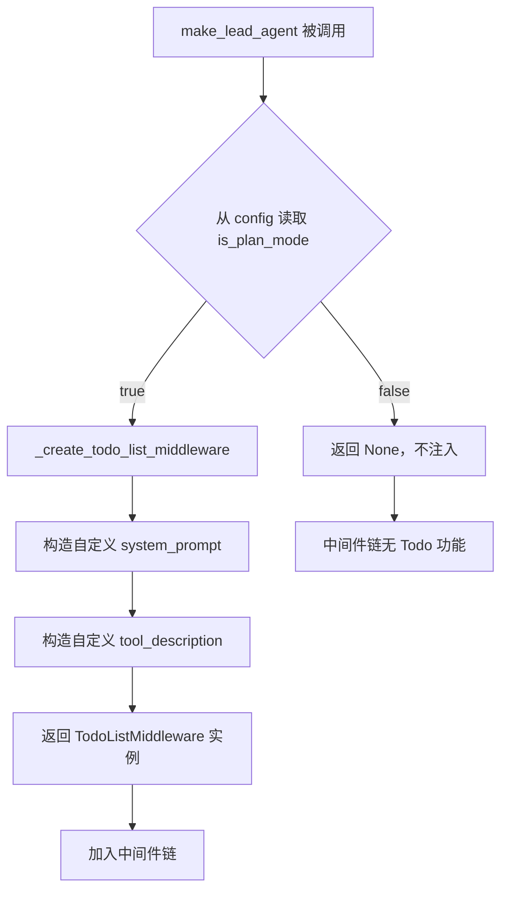
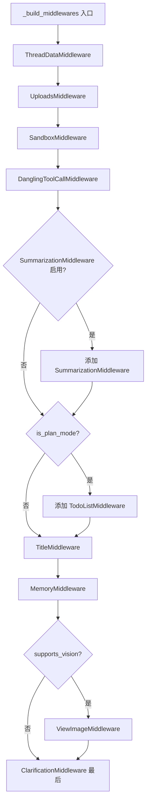

# PD-66.01 DeerFlow — TodoListMiddleware 任务规划模式

> 文档编号：PD-66.01
> 来源：DeerFlow `backend/src/agents/lead_agent/agent.py`
> GitHub：https://github.com/bytedance/deer-flow
> 问题域：PD-66 任务规划模式 Task Planning Mode
> 状态：可复用方案

---

## 第 1 章 问题与动机

### 1.1 核心问题

Agent 在执行复杂多步任务时，缺乏结构化的进度跟踪机制。用户无法实时了解 Agent 当前在做什么、已完成什么、还剩什么。同时，Agent 自身也容易在长对话中"忘记"待办事项，导致任务遗漏。

任务规划模式要解决三个关键问题：
1. **可见性**：用户需要实时看到 Agent 的工作进度
2. **结构化**：Agent 需要将模糊的复杂任务分解为可执行的步骤
3. **条件启用**：简单任务不需要规划开销，需要按需开关

### 1.2 DeerFlow 的解法概述

DeerFlow 通过 LangChain 的 `TodoListMiddleware` 中间件实现任务规划模式，核心设计要点：

1. **中间件注入**：`TodoListMiddleware` 作为中间件链的一环，自动向 Agent 注入 `write_todos` 工具和系统提示（`agent.py:62-174`）
2. **运行时开关**：通过 `RunnableConfig.configurable.is_plan_mode` 布尔值控制，每次请求可独立决定是否启用（`agent.py:203`）
3. **三态管理**：Todo 项支持 `pending` / `in_progress` / `completed` 三种状态，要求同一时刻仅一个任务处于 `in_progress`（`agent.py:80-81`）
4. **前端模式映射**：前端将用户选择的 `pro` / `ultra` 模式自动映射为 `is_plan_mode: true`（`page.tsx:191-192`）
5. **全栈状态同步**：Todo 列表通过 `ThreadState.todos` 字段在后端状态图中持久化，前端通过 SSE 流实时渲染（`thread_state.py:53`，`todo-list.tsx:13-88`）

### 1.3 设计思想

| 设计原则 | 具体实现 | 理由 | 替代方案 |
|----------|----------|------|----------|
| 中间件模式 | TodoListMiddleware 注入工具+提示 | 解耦规划逻辑与核心 Agent，可插拔 | 硬编码到 Agent prompt 中 |
| 运行时配置 | is_plan_mode 通过 RunnableConfig 传递 | 每次请求独立控制，无全局状态 | 环境变量/全局配置文件 |
| 自定义提示 | 覆盖默认 system_prompt 和 tool_description | 与 DeerFlow 整体 prompt 风格一致 | 使用 LangChain 默认提示 |
| 前端模式抽象 | pro/ultra → is_plan_mode=true | 用户无需理解底层参数 | 暴露 is_plan_mode 开关给用户 |
| 状态图持久化 | ThreadState.todos 字段 | 跨轮次保持 Todo 状态 | 内存中临时存储 |

---

## 第 2 章 源码实现分析

### 2.1 架构概览

DeerFlow 的任务规划模式涉及后端中间件、状态管理、前端渲染三层：

```
┌─────────────────────────────────────────────────────────┐
│                    Frontend (Next.js)                     │
│  ┌──────────┐   ┌──────────┐   ┌───────────────────┐    │
│  │ InputBox │──→│ mode选择  │──→│ is_plan_mode 映射  │    │
│  │ page.tsx │   │ pro/ultra │   │ threadContext      │    │
│  └──────────┘   └──────────┘   └───────────────────┘    │
│        │                              │                   │
│        ▼                              ▼                   │
│  ┌──────────────────────────────────────────────┐        │
│  │ TodoList 组件 (todo-list.tsx)                 │        │
│  │ QueueItem × N → pending/in_progress/completed │        │
│  └──────────────────────────────────────────────┘        │
├─────────────────────────────────────────────────────────┤
│                    SSE Stream (values)                    │
├─────────────────────────────────────────────────────────┤
│                    Backend (LangGraph)                    │
│  ┌──────────────────────────────────────────────┐        │
│  │ make_lead_agent(config)                       │        │
│  │   ├─ _build_middlewares(config)               │        │
│  │   │   ├─ ThreadDataMiddleware                 │        │
│  │   │   ├─ SandboxMiddleware                    │        │
│  │   │   ├─ SummarizationMiddleware              │        │
│  │   │   ├─ TodoListMiddleware ← is_plan_mode    │        │
│  │   │   ├─ TitleMiddleware                      │        │
│  │   │   ├─ MemoryMiddleware                     │        │
│  │   │   └─ ClarificationMiddleware              │        │
│  │   └─ ThreadState.todos (状态持久化)            │        │
│  └──────────────────────────────────────────────┘        │
└─────────────────────────────────────────────────────────┘
```

### 2.2 核心实现

#### 2.2.1 TodoListMiddleware 创建与条件注入



对应源码 `backend/src/agents/lead_agent/agent.py:62-174`：

```python
def _create_todo_list_middleware(is_plan_mode: bool) -> TodoListMiddleware | None:
    """Create and configure the TodoList middleware.

    Args:
        is_plan_mode: Whether to enable plan mode with TodoList middleware.

    Returns:
        TodoListMiddleware instance if plan mode is enabled, None otherwise.
    """
    if not is_plan_mode:
        return None

    # Custom prompts matching DeerFlow's style
    system_prompt = """
<todo_list_system>
You have access to the `write_todos` tool to help you manage and track complex multi-step objectives.

**CRITICAL RULES:**
- Mark todos as completed IMMEDIATELY after finishing each step - do NOT batch completions
- Keep EXACTLY ONE task as `in_progress` at any time (unless tasks can run in parallel)
- Update the todo list in REAL-TIME as you work - this gives users visibility into your progress
- DO NOT use this tool for simple tasks (< 3 steps) - just complete them directly
...
</todo_list_system>
"""
    return TodoListMiddleware(system_prompt=system_prompt, tool_description=tool_description)
```

#### 2.2.2 中间件链构建与顺序控制



对应源码 `backend/src/agents/lead_agent/agent.py:186-235`：

```python
def _build_middlewares(config: RunnableConfig):
    middlewares = [ThreadDataMiddleware(), UploadsMiddleware(), SandboxMiddleware(), DanglingToolCallMiddleware()]

    # Add summarization middleware if enabled
    summarization_middleware = _create_summarization_middleware()
    if summarization_middleware is not None:
        middlewares.append(summarization_middleware)

    # Add TodoList middleware if plan mode is enabled
    is_plan_mode = config.get("configurable", {}).get("is_plan_mode", False)
    todo_list_middleware = _create_todo_list_middleware(is_plan_mode)
    if todo_list_middleware is not None:
        middlewares.append(todo_list_middleware)

    # ... TitleMiddleware, MemoryMiddleware, ViewImageMiddleware ...

    # ClarificationMiddleware should always be last
    middlewares.append(ClarificationMiddleware())
    return middlewares
```

### 2.3 实现细节

#### 状态持久化：ThreadState.todos

Todo 列表通过 LangGraph 的 `ThreadState` 持久化到状态图中（`backend/src/agents/thread_state.py:48-55`）：

```python
class ThreadState(AgentState):
    sandbox: NotRequired[SandboxState | None]
    thread_data: NotRequired[ThreadDataState | None]
    title: NotRequired[str | None]
    artifacts: Annotated[list[str], merge_artifacts]
    todos: NotRequired[list | None]          # ← Todo 列表持久化字段
    uploaded_files: NotRequired[list[dict] | None]
    viewed_images: Annotated[dict[str, ViewedImageData], merge_viewed_images]
```

`todos` 字段类型为 `list | None`，每个元素是一个 Todo 对象，包含 `content`（任务描述）和 `status`（状态）。该字段通过 LangGraph 的状态图机制自动在轮次间持久化。

#### 前端模式映射

前端将用户可见的模式名映射为后端参数（`frontend/src/app/workspace/chats/[thread_id]/page.tsx:184-198`）：

```typescript
const handleSubmit = useSubmitThread({
    threadContext: {
      ...settings.context,
      thinking_enabled: settings.context.mode !== "flash",
      is_plan_mode:
        settings.context.mode === "pro" || settings.context.mode === "ultra",
      subagent_enabled: settings.context.mode === "ultra",
    },
});
```

映射关系：
- `flash` 模式 → `is_plan_mode: false`（快速响应，无规划）
- `thinking` 模式 → `is_plan_mode: false`（深度思考，无规划）
- `pro` 模式 → `is_plan_mode: true`（专业模式，启用规划）
- `ultra` 模式 → `is_plan_mode: true` + `subagent_enabled: true`（全能模式）

#### 前端 Todo 渲染

前端 `TodoList` 组件（`frontend/src/components/workspace/todo-list.tsx:13-88`）通过 `thread.values.todos` 实时获取 Todo 数据，使用 `QueueItem` 组件渲染每个任务项，根据 `status` 字段显示不同视觉状态：

- `pending`：默认样式
- `in_progress`：`bg-primary/70` 高亮指示器 + `text-primary/70` 文字
- `completed`：完成态勾选标记

Todo 面板固定在输入框上方，支持折叠/展开切换。

#### 工具调用 UI 识别

前端在消息流中识别 `write_todos` 工具调用并显示专用图标（`frontend/src/core/tools/utils.ts:22-23`，`frontend/src/components/workspace/messages/message-group.tsx:404-411`）：

```typescript
// utils.ts
} else if (toolCall.name === "write_todos") {
    return t.toolCalls.writeTodos;
}

// message-group.tsx
} else if (name === "write_todos") {
    return (
      <ChainOfThoughtStep key={id} label={t.toolCalls.writeTodos} icon={ListTodoIcon} />
    );
}
```

---

## 第 3 章 迁移指南

### 3.1 迁移清单

**阶段 1：核心中间件（必须）**

- [ ] 实现 `TodoListMiddleware` 或等效中间件，注入 `write_todos` 工具
- [ ] 定义 Todo 数据结构：`{ content: string, status: "pending" | "in_progress" | "completed" }`
- [ ] 在 Agent 状态中添加 `todos` 字段用于持久化
- [ ] 编写自定义 system_prompt 和 tool_description，适配项目 prompt 风格

**阶段 2：条件启用（推荐）**

- [ ] 实现运行时配置开关（如 `is_plan_mode` 参数）
- [ ] 在前端提供模式选择 UI，映射到后端参数
- [ ] 确保中间件仅在启用时注入，不影响简单任务性能

**阶段 3：前端渲染（可选）**

- [ ] 实现 Todo 列表 UI 组件，支持三态视觉区分
- [ ] 通过 SSE/WebSocket 实时同步 Todo 状态
- [ ] 在工具调用消息流中识别 `write_todos` 并显示专用图标

### 3.2 适配代码模板

#### 最小可用版本：Python + LangChain

```python
from typing import TypedDict, Literal, Optional
from langchain_core.tools import tool
from pydantic import BaseModel, Field


class TodoItem(BaseModel):
    """单个任务项"""
    content: str = Field(description="任务描述")
    status: Literal["pending", "in_progress", "completed"] = Field(
        default="pending", description="任务状态"
    )


class TodoListState(TypedDict):
    """Agent 状态中的 todos 字段"""
    todos: Optional[list[dict]]


# write_todos 工具定义
@tool
def write_todos(todos: list[TodoItem]) -> str:
    """创建或更新任务列表。仅用于 3 步以上的复杂任务。

    规则：
    - 同一时刻仅一个任务为 in_progress
    - 完成后立即标记为 completed
    - 简单任务（< 3 步）不要使用此工具
    """
    return f"已更新 {len(todos)} 个任务"


# 中间件条件注入
def build_agent_with_plan_mode(is_plan_mode: bool = False):
    """根据 is_plan_mode 决定是否注入 TodoList 功能"""
    tools = [web_search, read_file]  # 基础工具

    if is_plan_mode:
        tools.append(write_todos)
        system_prompt = BASE_PROMPT + TODO_SYSTEM_PROMPT
    else:
        system_prompt = BASE_PROMPT

    return create_agent(
        model=model,
        tools=tools,
        system_prompt=system_prompt,
    )


# 运行时按需启用
config = {"configurable": {"is_plan_mode": task_complexity >= 3}}
agent = build_agent_with_plan_mode(config["configurable"]["is_plan_mode"])
```

#### 前端 Todo 组件模板（React + TypeScript）

```typescript
interface Todo {
  content?: string;
  status?: "pending" | "in_progress" | "completed";
}

function TodoList({ todos }: { todos: Todo[] }) {
  return (
    <div className="todo-list">
      {todos.map((todo, i) => (
        <div key={i} className={`todo-item todo-${todo.status}`}>
          <span className="indicator">
            {todo.status === "completed" ? "✓" :
             todo.status === "in_progress" ? "●" : "○"}
          </span>
          <span className="content">{todo.content}</span>
        </div>
      ))}
    </div>
  );
}
```

### 3.3 适用场景

| 场景 | 适用度 | 说明 |
|------|--------|------|
| 多步骤代码重构 | ⭐⭐⭐ | 典型 3+ 步任务，需要跟踪每个文件的修改进度 |
| 研究报告生成 | ⭐⭐⭐ | 搜索→分析→撰写→审校，天然多步骤 |
| 简单问答 | ⭐ | 无需规划，启用反而增加延迟和 token 消耗 |
| 单文件编辑 | ⭐ | 步骤少于 3 步，直接执行更高效 |
| 项目初始化脚手架 | ⭐⭐⭐ | 创建多个文件/目录，适合分步跟踪 |
| 调试排错 | ⭐⭐ | 取决于问题复杂度，简单 bug 不需要 |

---

## 第 4 章 测试用例

```python
import pytest
from unittest.mock import MagicMock, patch
from langchain_core.runnables import RunnableConfig


class TestTodoListMiddlewareCreation:
    """测试 TodoListMiddleware 的条件创建"""

    def test_plan_mode_enabled_creates_middleware(self):
        """is_plan_mode=True 时应创建 TodoListMiddleware"""
        from src.agents.lead_agent.agent import _create_todo_list_middleware
        middleware = _create_todo_list_middleware(is_plan_mode=True)
        assert middleware is not None

    def test_plan_mode_disabled_returns_none(self):
        """is_plan_mode=False 时应返回 None"""
        from src.agents.lead_agent.agent import _create_todo_list_middleware
        middleware = _create_todo_list_middleware(is_plan_mode=False)
        assert middleware is None

    def test_middleware_has_custom_prompts(self):
        """创建的中间件应包含自定义提示"""
        from src.agents.lead_agent.agent import _create_todo_list_middleware
        middleware = _create_todo_list_middleware(is_plan_mode=True)
        # 验证自定义 system_prompt 包含 DeerFlow 风格的 XML 标签
        assert "<todo_list_system>" in middleware.system_prompt


class TestBuildMiddlewares:
    """测试中间件链构建"""

    @patch("src.agents.lead_agent.agent._create_summarization_middleware", return_value=None)
    def test_plan_mode_adds_todo_middleware(self, mock_sum):
        """is_plan_mode=True 时中间件链应包含 TodoListMiddleware"""
        from src.agents.lead_agent.agent import _build_middlewares
        config = RunnableConfig(configurable={"is_plan_mode": True})
        middlewares = _build_middlewares(config)
        middleware_types = [type(m).__name__ for m in middlewares]
        assert "TodoListMiddleware" in middleware_types

    @patch("src.agents.lead_agent.agent._create_summarization_middleware", return_value=None)
    def test_no_plan_mode_excludes_todo_middleware(self, mock_sum):
        """is_plan_mode=False 时中间件链不应包含 TodoListMiddleware"""
        from src.agents.lead_agent.agent import _build_middlewares
        config = RunnableConfig(configurable={"is_plan_mode": False})
        middlewares = _build_middlewares(config)
        middleware_types = [type(m).__name__ for m in middlewares]
        assert "TodoListMiddleware" not in middleware_types

    @patch("src.agents.lead_agent.agent._create_summarization_middleware", return_value=None)
    def test_clarification_middleware_always_last(self, mock_sum):
        """ClarificationMiddleware 应始终在链末尾"""
        from src.agents.lead_agent.agent import _build_middlewares
        config = RunnableConfig(configurable={"is_plan_mode": True})
        middlewares = _build_middlewares(config)
        assert type(middlewares[-1]).__name__ == "ClarificationMiddleware"


class TestTodoState:
    """测试 Todo 状态管理"""

    def test_todo_item_structure(self):
        """Todo 项应包含 content 和 status 字段"""
        todo = {"content": "分析代码结构", "status": "pending"}
        assert todo["content"] == "分析代码结构"
        assert todo["status"] in ("pending", "in_progress", "completed")

    def test_thread_state_includes_todos(self):
        """ThreadState 应包含 todos 字段"""
        from src.agents.thread_state import ThreadState
        annotations = ThreadState.__annotations__
        assert "todos" in annotations

    def test_todo_status_transitions(self):
        """验证状态转换：pending → in_progress → completed"""
        todos = [
            {"content": "任务1", "status": "pending"},
            {"content": "任务2", "status": "pending"},
        ]
        # 开始第一个任务
        todos[0]["status"] = "in_progress"
        assert todos[0]["status"] == "in_progress"
        assert todos[1]["status"] == "pending"

        # 完成第一个，开始第二个
        todos[0]["status"] = "completed"
        todos[1]["status"] = "in_progress"
        assert todos[0]["status"] == "completed"
        assert todos[1]["status"] == "in_progress"


class TestFrontendModeMapping:
    """测试前端模式到 is_plan_mode 的映射逻辑"""

    @pytest.mark.parametrize("mode,expected", [
        ("flash", False),
        ("thinking", False),
        ("pro", True),
        ("ultra", True),
    ])
    def test_mode_to_plan_mode_mapping(self, mode, expected):
        """验证各模式正确映射到 is_plan_mode"""
        is_plan_mode = mode in ("pro", "ultra")
        assert is_plan_mode == expected
```

---

## 第 5 章 跨域关联

| 关联域 | 关系类型 | 说明 |
|--------|----------|------|
| PD-01 上下文管理 | 协同 | Todo 列表占用上下文窗口，SummarizationMiddleware 在同一中间件链中负责压缩历史消息，两者需协调 |
| PD-02 多 Agent 编排 | 协同 | `ultra` 模式同时启用 `is_plan_mode` 和 `subagent_enabled`，Todo 可跟踪子代理任务分配 |
| PD-04 工具系统 | 依赖 | `write_todos` 本身是一个工具，依赖工具系统的注册和调用机制 |
| PD-09 Human-in-the-Loop | 协同 | ClarificationMiddleware 在 TodoListMiddleware 之后，Todo 可在澄清流程中更新 |
| PD-10 中间件管道 | 依赖 | TodoListMiddleware 是中间件链的一环，依赖中间件管道的顺序执行机制 |
| PD-11 可观测性 | 协同 | Todo 进度本身是一种可观测性输出，前端实时渲染提供用户可见的进度追踪 |

---

## 第 6 章 来源文件索引

| 文件 | 行范围 | 关键实现 |
|------|--------|----------|
| `backend/src/agents/lead_agent/agent.py` | L62-L174 | `_create_todo_list_middleware` 函数：条件创建 + 自定义提示 |
| `backend/src/agents/lead_agent/agent.py` | L186-L235 | `_build_middlewares` 函数：中间件链构建与顺序控制 |
| `backend/src/agents/lead_agent/agent.py` | L238-L265 | `make_lead_agent` 函数：Agent 工厂，提取 is_plan_mode 配置 |
| `backend/src/agents/thread_state.py` | L48-L55 | `ThreadState` 类：todos 字段定义 |
| `frontend/src/core/todos/types.ts` | L1-L4 | `Todo` 接口定义 |
| `frontend/src/components/workspace/todo-list.tsx` | L13-L88 | `TodoList` 组件：三态渲染 + 折叠/展开 |
| `frontend/src/app/workspace/chats/[thread_id]/page.tsx` | L184-L198 | 前端模式映射：pro/ultra → is_plan_mode |
| `frontend/src/app/workspace/chats/[thread_id]/page.tsx` | L273-L284 | TodoList 组件挂载与数据绑定 |
| `frontend/src/core/tools/utils.ts` | L22-L23 | write_todos 工具调用 UI 文案 |
| `frontend/src/components/workspace/messages/message-group.tsx` | L404-L411 | write_todos 工具调用消息渲染 |
| `frontend/src/core/threads/types.ts` | L15-L21 | `AgentThreadContext` 接口：is_plan_mode 字段 |
| `backend/docs/plan_mode_usage.md` | 全文 | 官方 Plan Mode 使用文档 |

---

## 第 7 章 横向对比维度

```json comparison_data
{
  "project": "DeerFlow",
  "dimensions": {
    "规划触发": "运行时 is_plan_mode 布尔开关，前端 pro/ultra 模式自动映射",
    "工具注入": "LangChain TodoListMiddleware 中间件自动注入 write_todos 工具",
    "状态模型": "pending/in_progress/completed 三态，ThreadState.todos 持久化",
    "前端渲染": "QueueItem 组件实时渲染，SSE 流同步，支持折叠/展开",
    "提示定制": "自定义 system_prompt + tool_description，XML 标签风格与主 prompt 一致"
  }
}
```

### 域元数据补充

```json domain_metadata
{
  "solution_summary": "DeerFlow 通过 LangChain TodoListMiddleware 中间件注入 write_todos 工具，运行时 is_plan_mode 开关控制，前端 pro/ultra 模式自动映射，SSE 流实时同步三态 Todo 列表",
  "description": "中间件模式实现工具按需注入，前端模式抽象屏蔽底层参数",
  "sub_problems": [
    "中间件顺序依赖管理",
    "前端模式到后端参数的映射抽象"
  ],
  "best_practices": [
    "TodoListMiddleware 应位于 ClarificationMiddleware 之前，确保澄清流程中可更新任务",
    "自定义 prompt 应与项目整体 prompt 风格保持一致（如 XML 标签结构）"
  ]
}
```
