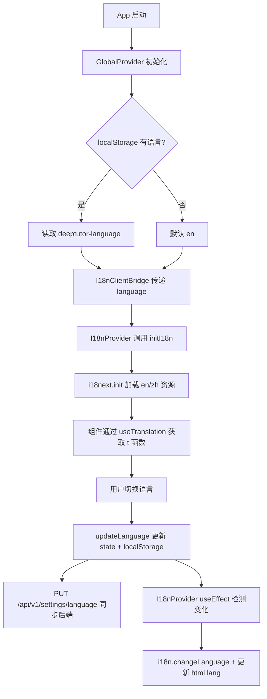
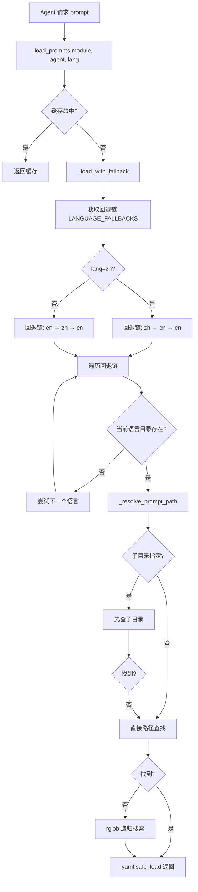

# PD-67.01 DeepTutor — 前后端双层 i18n 与 Prompt 本地化方案

> 文档编号：PD-67.01
> 来源：DeepTutor `web/i18n/init.ts`, `src/services/prompt/manager.py`, `src/api/routers/settings.py`
> GitHub：https://github.com/HKUDS/DeepTutor.git
> 问题域：PD-67 国际化与多语言 Internationalization & Multilingual
> 状态：可复用方案

---

## 第 1 章 问题与动机（≥ 30 行）

### 1.1 核心问题

Agent 系统的国际化面临独特挑战：不仅需要传统的前端 UI 多语言切换，还需要让后端 LLM Agent 的 prompt 也支持多语言。这意味着：

1. **前端 UI 翻译**：540+ 个 UI 文本需要在 en/zh 之间切换，且切换必须实时生效
2. **后端 Prompt 本地化**：6 个 Agent 模块（research, solve, guide, question, ideagen, co_writer）的 prompt 需要按语言加载不同版本
3. **前后端语言同步**：用户在前端切换语言后，后端 Agent 的 prompt 也需要对应切换
4. **语言回退保障**：当某语言的翻译缺失时，系统不能崩溃，需要优雅降级到备选语言
5. **翻译完整性保障**：540+ 个 key 在 en/zh 两套资源中必须保持一致，不能遗漏

### 1.2 DeepTutor 的解法概述

DeepTutor 实现了前后端双层国际化架构：

1. **前端层**：i18next + react-i18next 管理 UI 翻译，通过 React Context 桥接语言状态（`web/i18n/init.ts:26`）
2. **后端层**：自研 PromptManager 单例，按 `src/agents/{module}/prompts/{lang}/` 目录结构加载 YAML prompt（`src/services/prompt/manager.py:84`）
3. **语言回退链**：后端实现 `zh→cn→en` 和 `en→zh→cn` 双向回退链（`src/services/prompt/manager.py:23-26`）
4. **前后端同步**：通过 REST API `/api/v1/settings/language` 持久化语言偏好，前端 localStorage 缓存 + 后端 JSON 文件双写（`src/api/routers/settings.py:100-106`）
5. **翻译质量工具链**：i18n_parity.mjs 脚本自动检测 en/zh 翻译 key 不一致（`web/scripts/i18n_parity.mjs:61-85`）

### 1.3 设计思想

| 设计原则 | 具体实现 | 理由 | 替代方案 |
|----------|----------|------|----------|
| 前后端分离 | 前端 i18next JSON，后端 YAML prompt 独立管理 | 前端翻译是 UI 文本，后端翻译是 LLM prompt，结构和用途完全不同 | 统一翻译平台（如 Crowdin），但 prompt 不适合传统翻译流程 |
| 单例 + 缓存 | PromptManager 用 `__new__` 单例 + `_cache` 字典缓存 | 避免重复加载 YAML 文件，Agent 调用频繁需要低延迟 | 每次加载（简单但慢）、Redis 缓存（过度设计） |
| 语言回退链 | `LANGUAGE_FALLBACKS` 字典定义 zh→cn→en 链 | 兼容 "cn" 等非标准语言码，确保总能找到可用 prompt | 硬编码 fallback（不灵活）、抛异常（用户体验差） |
| Context 桥接 | I18nClientBridge 从 GlobalContext 读取语言传给 I18nProvider | 解耦语言状态管理和 i18n 初始化，支持 SSR | 直接在 Provider 中读 localStorage（SSR 不兼容） |
| 翻译完整性检查 | i18n_parity.mjs 对比 en/zh 所有 JSON key | 540+ key 手动维护容易遗漏，CI 自动检测 | 运行时检测（太晚）、TypeScript 类型约束（无法覆盖 JSON） |

---

## 第 2 章 源码实现分析（≥ 60 行，核心章节）

### 2.1 架构概览

DeepTutor 的 i18n 架构分为前端和后端两个独立层，通过 REST API 同步语言偏好：

```
┌─────────────────────────────────────────────────────────────────┐
│                        前端 (Next.js)                           │
│                                                                 │
│  GlobalContext ──→ I18nClientBridge ──→ I18nProvider             │
│  (language state)    (桥接层)           (i18next init)          │
│       │                                      │                  │
│       │  localStorage                  useTranslation()         │
│       │  "deeptutor-language"          ├── 540+ UI keys         │
│       │                                ├── en/app.json          │
│       ▼                                └── zh/app.json          │
│  PUT /api/v1/settings/language                                  │
└───────────────────────┬─────────────────────────────────────────┘
                        │ REST API
┌───────────────────────▼─────────────────────────────────────────┐
│                        后端 (FastAPI)                            │
│                                                                 │
│  settings.py ──→ interface.json (持久化)                        │
│                                                                 │
│  config/main.yaml ──→ parse_language() ──→ PromptManager        │
│  (system.language)     (标准化: zh/en)     (单例 + 缓存)        │
│                                                │                │
│                    src/agents/{module}/prompts/{lang}/*.yaml     │
│                    ├── research/prompts/en/research_agent.yaml   │
│                    ├── research/prompts/zh/research_agent.yaml   │
│                    ├── solve/prompts/en/...                      │
│                    └── guide/prompts/zh/...                      │
└─────────────────────────────────────────────────────────────────┘
```

### 2.2 核心实现

#### 2.2.1 前端 i18n 初始化



对应源码 `web/i18n/init.ts:1-44`：

```typescript
import i18n, { type Resource } from "i18next";
import { initReactI18next } from "react-i18next";
import enApp from "@/locales/en/app.json";
import zhApp from "@/locales/zh/app.json";

export type AppLanguage = "en" | "zh";

export function normalizeLanguage(lang: unknown): AppLanguage {
  if (!lang) return "en";
  const s = String(lang).toLowerCase();
  if (s === "zh" || s === "cn" || s === "chinese") return "zh";
  return "en";
}

let _initialized = false;

export function initI18n(language?: unknown) {
  if (_initialized) return i18n;
  const resources: Resource = {
    en: { app: enApp },
    zh: { app: zhApp },
  };
  i18n.use(initReactI18next).init({
    resources,
    lng: normalizeLanguage(language),
    fallbackLng: "en",
    defaultNS: "app",
    ns: ["app"],
    keySeparator: false,        // 允许 key 包含 "." 如 "Generating..."
    interpolation: { escapeValue: false },
    returnEmptyString: false,
    returnNull: false,
  });
  _initialized = true;
  return i18n;
}
```

关键设计点：
- `keySeparator: false`：禁用 i18next 默认的 `.` 分隔符，因为 DeepTutor 的 key 是扁平的自然语言字符串（如 `"Generating..."`），包含 `.` 会被误解析
- `_initialized` 守卫：确保 i18next 只初始化一次，避免 React 严格模式下的重复初始化
- `normalizeLanguage`：前端也实现了语言标准化，兼容 `"cn"` / `"chinese"` 等非标准输入

#### 2.2.2 后端 PromptManager 语言回退链



对应源码 `src/services/prompt/manager.py:76-98`：

```python
class PromptManager:
    _instance: "PromptManager | None" = None
    _cache: dict[str, dict[str, Any]] = {}

    LANGUAGE_FALLBACKS = {
        "zh": ["zh", "cn", "en"],
        "en": ["en", "zh", "cn"],
    }

    MODULES = ["research", "solve", "guide", "question", "ideagen", "co_writer"]

    def _load_with_fallback(
        self, module_name: str, agent_name: str,
        lang_code: str, subdirectory: str | None,
    ) -> dict[str, Any]:
        prompts_dir = PROJECT_ROOT / "src" / "agents" / module_name / "prompts"
        fallback_chain = self.LANGUAGE_FALLBACKS.get(lang_code, ["en"])

        for lang in fallback_chain:
            prompt_file = self._resolve_prompt_path(
                prompts_dir, lang, agent_name, subdirectory
            )
            if prompt_file and prompt_file.exists():
                try:
                    with open(prompt_file, encoding="utf-8") as f:
                        return yaml.safe_load(f) or {}
                except Exception as e:
                    print(f"Warning: Failed to load {prompt_file}: {e}")
                    continue

        print(f"Warning: No prompt file found for {module_name}/{agent_name}")
        return {}
```

关键设计点：
- 回退链包含 `"cn"` 是为了兼容历史遗留的目录命名（有些项目用 `cn` 而非 `zh`）
- `_resolve_prompt_path` 支持三级查找：子目录 → 直接路径 → rglob 递归搜索（`src/services/prompt/manager.py:100-129`）
- 加载失败不抛异常，而是 `continue` 尝试下一个语言，最终返回空字典 `{}`

### 2.3 实现细节

#### 前后端语言同步机制

语言偏好通过三层存储保证一致性：

1. **前端 React State**：`GlobalContext.uiSettings.language`（`web/context/GlobalContext.tsx:306`）
2. **前端 localStorage**：key `"deeptutor-language"`（`web/context/GlobalContext.tsx:29`）
3. **后端 JSON 文件**：`data/user/settings/interface.json`（`src/api/routers/settings.py:19-21`）

`updateLanguage` 函数同时更新三层（`web/context/GlobalContext.tsx:513-530`）：

```typescript
const updateLanguage = async (newLanguage: "en" | "zh") => {
  // 1. 立即更新 React state（UI 即时响应）
  setUiSettings((prev) => ({ ...prev, language: newLanguage }));
  // 2. 写入 localStorage（刷新后恢复）
  if (typeof window !== "undefined") {
    localStorage.setItem(LANGUAGE_STORAGE_KEY, newLanguage);
  }
  // 3. 异步同步到后端（跨设备一致性）
  try {
    await fetch(apiUrl("/api/v1/settings/language"), {
      method: "PUT",
      headers: { "Content-Type": "application/json" },
      body: JSON.stringify({ language: newLanguage }),
    });
  } catch (e) {
    console.warn("Failed to save language to server:", e);
  }
};
```

#### 后端语言标准化

`parse_language` 函数（`src/services/config/loader.py:173-197`）将各种输入统一为 `"zh"` 或 `"en"`：

```python
def parse_language(language: Any) -> str:
    if not language:
        return "zh"
    if isinstance(language, str):
        lang_lower = language.lower()
        if lang_lower in ["en", "english"]:
            return "en"
        if lang_lower in ["zh", "chinese", "cn"]:
            return "zh"
    return "zh"  # 默认中文
```

注意前后端默认语言不同：前端默认 `"en"`，后端默认 `"zh"`。这是因为后端主要服务中文用户的 prompt 生成，而前端面向国际用户。

#### 翻译完整性检查工具

`i18n_parity.mjs`（`web/scripts/i18n_parity.mjs:61-85`）在 CI 中运行，检查：
- en/zh 目录下的 JSON 文件是否一一对应
- 每个 JSON 文件中的 key 是否完全一致（不多不少）
