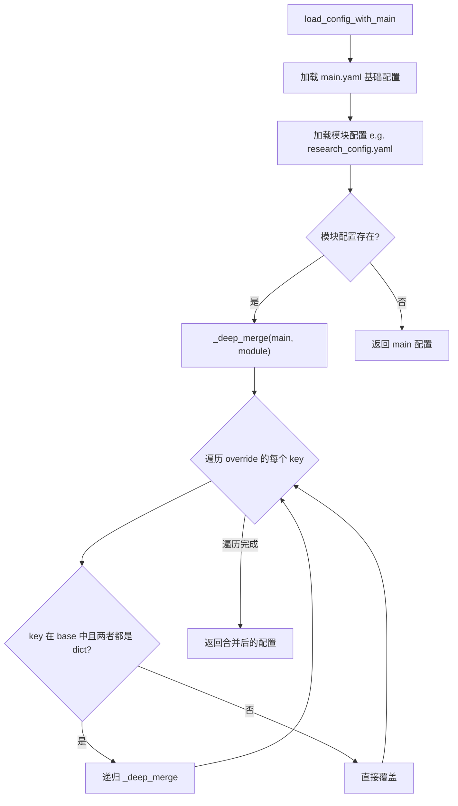
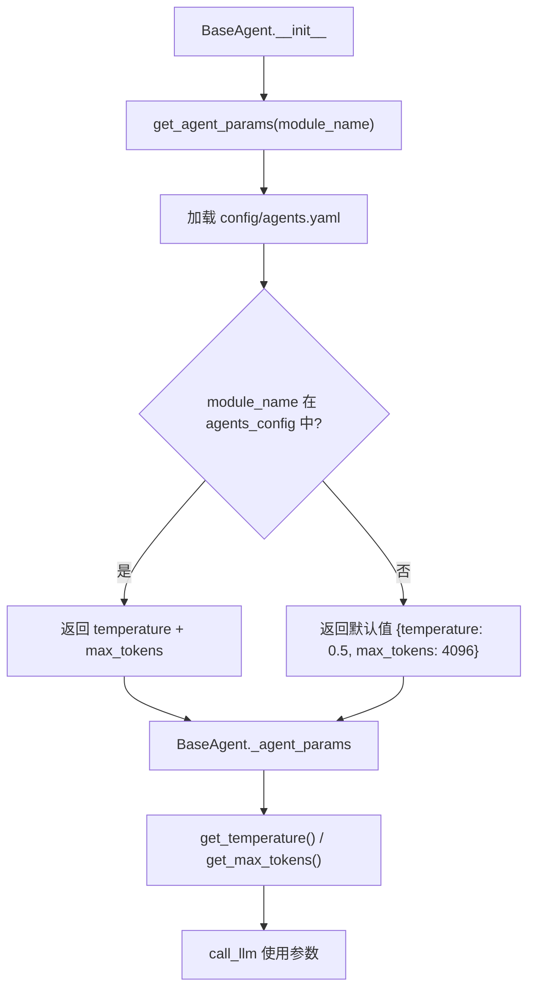
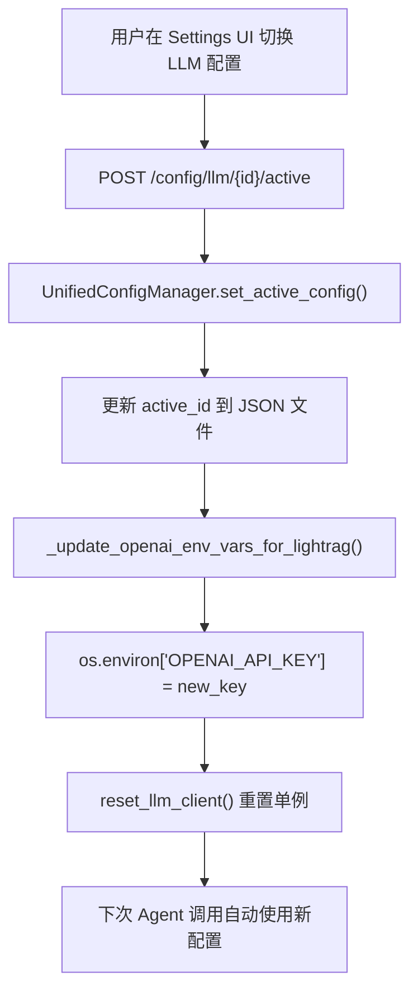

# PD-68.01 DeepTutor — 分层 YAML 配置 + Singleton 统一管理 + Preset 模式

> 文档编号：PD-68.01
> 来源：DeepTutor `src/services/config/loader.py`, `src/services/config/unified_config.py`, `config/main.yaml`, `config/agents.yaml`
> GitHub：https://github.com/HKUDS/DeepTutor.git
> 问题域：PD-68 配置管理 Configuration Management
> 状态：可复用方案

---

## 第 1 章 问题与动机

### 1.1 核心问题

Agent 系统通常包含多个模块（solve、research、guide、question 等），每个模块有自己的参数需求（迭代次数、工具开关、RAG 模式等），同时所有模块共享一些全局配置（路径、日志级别、语言设置）。此外，LLM/Embedding/TTS/Search 等外部服务各有独立的 provider、api_key、base_url 等连接参数，且需要支持运行时热切换。

如果配置散落在各模块代码中（硬编码 temperature、到处 `os.getenv`），会导致：
- 修改一个参数需要改多处代码
- 不同环境（开发/生产/Docker）的配置切换困难
- 用户无法通过 UI 动态调整参数
- Agent 参数（temperature/max_tokens）与业务逻辑耦合

### 1.2 DeepTutor 的解法概述

DeepTutor 采用**三层配置架构**，将配置关注点彻底分离：

1. **YAML 层**（`config/main.yaml` + 模块配置）：全局路径、工具开关、模块业务参数，通过 `_deep_merge` 递归合并（`src/services/config/loader.py:26-47`）
2. **Agent 参数层**（`config/agents.yaml`）：所有 Agent 的 temperature/max_tokens 集中管理，通过 `get_agent_params()` 统一读取（`src/services/config/loader.py:200-250`）
3. **服务配置层**（`UnifiedConfigManager` 单例）：LLM/Embedding/TTS/Search 四类服务的多配置管理，支持 .env 默认 + 用户自定义 + 运行时切换（`src/services/config/unified_config.py:109-126`）

额外特性：
- **Preset 模式**：research 模块在 `main.yaml` 中定义 quick/medium/deep/auto 四种预设，一键覆盖 planning/researching/reporting 参数（`config/main.yaml:102-146`）
- **Pydantic 校验**：`src/config/schema.py` 用 Pydantic BaseModel 定义配置 schema，`src/config/settings.py` 用 pydantic-settings 支持环境变量嵌套解析（`LLM_RETRY__MAX_RETRIES`）
- **配置校验器**：`src/agents/solve/utils/config_validator.py` 提供结构化校验，输出 errors/warnings 分级报告

### 1.3 设计思想

| 设计原则 | 具体实现 | 理由 | 替代方案 |
|----------|----------|------|----------|
| 关注点分离 | YAML 管业务参数，UnifiedConfig 管服务连接，agents.yaml 管 Agent 参数 | 三类配置变更频率和消费者不同 | 全部塞一个 config.yaml |
| 单一数据源 | agents.yaml 是 temperature/max_tokens 的唯一真相源 | 避免 7 个模块各自硬编码 | 每个 Agent 类自带默认值 |
| 递归合并 | `_deep_merge` 递归合并嵌套 dict，子模块只需声明差异 | 减少重复配置，DRY 原则 | 浅拷贝 `dict.update()` |
| 环境变量间接引用 | `{"use_env": "LLM_API_KEY"}` 存储引用而非明文 | 敏感信息不落盘到 JSON | 直接存储 api_key 明文 |
| Preset 模式 | quick/medium/deep/auto 预设覆盖多层嵌套参数 | 用户无需理解 20+ 参数细节 | 暴露所有参数让用户自行配置 |

---

## 第 2 章 源码实现分析

### 2.1 架构概览

DeepTutor 的配置系统由三个独立子系统组成，各自负责不同类型的配置：

```
┌─────────────────────────────────────────────────────────────────┐
│                    DeepTutor 配置架构                            │
├─────────────────────────────────────────────────────────────────┤
│                                                                 │
│  ┌──────────────┐   ┌──────────────┐   ┌──────────────────────┐│
│  │ config/      │   │ config/      │   │ .env / DeepTutor.env ││
│  │ main.yaml    │   │ agents.yaml  │   │ + JSON configs       ││
│  │ (全局+模块)   │   │ (Agent参数)  │   │ (服务连接)            ││
│  └──────┬───────┘   └──────┬───────┘   └──────────┬───────────┘│
│         │                  │                       │            │
│         ▼                  ▼                       ▼            │
│  ┌──────────────┐   ┌──────────────┐   ┌──────────────────────┐│
│  │ loader.py    │   │ loader.py    │   │ unified_config.py    ││
│  │ deep_merge() │   │ get_agent_   │   │ UnifiedConfigManager ││
│  │ load_config  │   │ params()     │   │ (Singleton)          ││
│  │ _with_main() │   │              │   │                      ││
│  └──────┬───────┘   └──────┬───────┘   └──────────┬───────────┘│
│         │                  │                       │            │
│         ▼                  ▼                       ▼            │
│  ┌─────────────────────────────────────────────────────────────┐│
│  │                    BaseAgent.__init__()                      ││
│  │  self.config = load_config_with_main(...)                   ││
│  │  self._agent_params = get_agent_params(module_name)         ││
│  │  llm_config = get_llm_config()  # → UnifiedConfigManager   ││
│  └─────────────────────────────────────────────────────────────┘│
│                                                                 │
│  ┌─────────────────────────────────────────────────────────────┐│
│  │  Pydantic 校验层                                             ││
│  │  schema.py (AppConfig)  settings.py (LLMRetryConfig)        ││
│  │  config_validator.py (ConfigValidator)                       ││
│  └─────────────────────────────────────────────────────────────┘│
└─────────────────────────────────────────────────────────────────┘
```

### 2.2 核心实现

#### 2.2.1 递归深度合并 `_deep_merge`



对应源码 `src/services/config/loader.py:26-47`：
```python
def _deep_merge(base: dict[str, Any], override: dict[str, Any]) -> dict[str, Any]:
    """
    Deep merge two dictionaries, values in override will override values in base
    """
    result = base.copy()
    for key, value in override.items():
        if key in result and isinstance(result[key], dict) and isinstance(value, dict):
            # Recursively merge dictionaries
            result[key] = _deep_merge(result[key], value)
        else:
            # Direct override
            result[key] = value
    return result
```

`load_config_with_main` 使用此函数实现"main.yaml 为基础，模块配置覆盖"的分层策略（`src/services/config/loader.py:61-98`）：
```python
def load_config_with_main(config_file: str, project_root: Path | None = None) -> dict[str, Any]:
    if project_root is None:
        project_root = PROJECT_ROOT
    config_dir = project_root / "config"
    # 1. Load main.yaml (common configuration)
    main_config = {}
    main_config_path = config_dir / "main.yaml"
    if main_config_path.exists():
        main_config = _load_yaml_file(main_config_path)
    # 2. Load sub-module configuration file
    module_config = {}
    module_config_path = config_dir / config_file
    if module_config_path.exists():
        module_config = _load_yaml_file(module_config_path)
    # 3. Merge: main.yaml as base, sub-module config overrides
    merged_config = _deep_merge(main_config, module_config)
    return merged_config
```

#### 2.2.2 Agent 参数集中管理



对应源码 `src/services/config/loader.py:200-250`：
```python
def get_agent_params(module_name: str) -> dict:
    """
    Get agent parameters (temperature, max_tokens) for a specific module.
    This function loads parameters from config/agents.yaml which serves as the
    SINGLE source of truth for all agent temperature and max_tokens settings.
    """
    defaults = {"temperature": 0.5, "max_tokens": 4096}
    try:
        config_path = PROJECT_ROOT / "config" / "agents.yaml"
        if config_path.exists():
            with open(config_path, encoding="utf-8") as f:
                agents_config = yaml.safe_load(f) or {}
            if module_name in agents_config:
                module_config = agents_config[module_name]
                return {
                    "temperature": module_config.get("temperature", defaults["temperature"]),
                    "max_tokens": module_config.get("max_tokens", defaults["max_tokens"]),
                }
    except Exception as e:
        print(f"⚠️ Failed to load agents.yaml: {e}, using defaults")
    return defaults
```

`BaseAgent` 在 `__init__` 中调用此函数（`src/agents/base_agent.py:97`），所有 7 个模块的 Agent 自动获取对应参数。

#### 2.2.3 UnifiedConfigManager 单例 — 服务配置热切换



对应源码 `src/services/config/unified_config.py:109-126`（Singleton 模式）：
```python
class UnifiedConfigManager:
    """
    Manages configurations for all service types.
    Each service type has:
    - A "default" configuration that comes from .env (cannot be deleted)
    - User-defined configurations that can be added/edited/deleted
    - An "active" configuration that is currently in use
    """
    _instance: Optional["UnifiedConfigManager"] = None

    def __new__(cls):
        if cls._instance is None:
            cls._instance = super(UnifiedConfigManager, cls).__new__(cls)
            cls._instance._initialized = False
        return cls._instance

    def __init__(self):
        if getattr(self, "_initialized", False):
            return
        SETTINGS_DIR.mkdir(parents=True, exist_ok=True)
        self._initialized = True
        self._ensure_default_configs()
```

环境变量间接引用机制（`src/services/config/unified_config.py:88-98`）：
```python
def _resolve_env_value(value: Any) -> Any:
    """
    Resolve a value that may reference an environment variable.
    If value is {"use_env": "VAR_NAME"}, returns os.environ.get("VAR_NAME").
    Otherwise, returns the value as-is.
    """
    if isinstance(value, dict) and "use_env" in value:
        env_var = value["use_env"]
        return os.environ.get(env_var, "")
    return value
```

### 2.3 实现细节

**Preset 模式的配置覆盖**（`src/agents/research/main.py:23-55`）：

research 模块在 `config/main.yaml:102-146` 定义了 4 种 preset（quick/medium/deep/auto），每种 preset 只声明与默认值不同的参数。`load_config` 函数通过浅层 `dict.update` 将 preset 参数覆盖到对应的顶层 section：

```python
def load_config(config_path: str = None, preset: str = None) -> dict:
    config = load_config_with_main("research_config.yaml", project_root)
    # Apply preset
    if preset and "presets" in config and preset in config["presets"]:
        preset_config = config["presets"][preset]
        for key, value in preset_config.items():
            if key in config and isinstance(value, dict):
                config[key].update(value)
    return config
```

**配置优先级链**（`src/agents/base_agent.py:153-185`）：

BaseAgent 的 `get_model()` 实现了 4 级优先级：agent_config > llm_config > self.model > 环境变量。这确保了从最具体到最通用的配置覆盖链。

**配置校验器**（`src/agents/solve/utils/config_validator.py:14-89`）：

`ConfigValidator` 对配置进行结构化校验，区分 errors（必须修复）和 warnings（建议修复），覆盖 system、agents、llm、logging、monitoring 五个 section。

**LLM 配置优先级**（`src/services/llm/config.py:107-141`）：

`get_llm_config()` 先尝试从 `UnifiedConfigManager` 获取活跃配置，失败则回退到 `.env` 环境变量，实现了"UI 配置优先，环境变量兜底"的策略。


---

## 第 3 章 迁移指南

### 3.1 迁移清单

**阶段 1：YAML 分层配置（1-2 天）**
- [ ] 创建 `config/main.yaml` 全局配置（路径、日志、语言）
- [ ] 创建 `config/agents.yaml` Agent 参数集中配置
- [ ] 实现 `_deep_merge()` 递归合并函数
- [ ] 实现 `load_config_with_main()` 加载器
- [ ] 实现 `get_agent_params()` Agent 参数读取

**阶段 2：服务配置管理（2-3 天）**
- [ ] 实现 `UnifiedConfigManager` 单例（支持 LLM/Embedding/TTS/Search）
- [ ] 实现 `{"use_env": "VAR_NAME"}` 环境变量间接引用
- [ ] 实现 `set_active_config()` 运行时切换
- [ ] 创建 REST API 端点（CRUD + test connection）

**阶段 3：Preset 模式 + 校验（1 天）**
- [ ] 在 main.yaml 中定义 preset 配置块
- [ ] 实现 preset 覆盖逻辑
- [ ] 实现 `ConfigValidator` 结构化校验

### 3.2 适配代码模板

#### 模板 1：递归深度合并 + 配置加载器

```python
"""config_loader.py — 可直接复用的分层配置加载器"""
from pathlib import Path
from typing import Any
import yaml

PROJECT_ROOT = Path(__file__).resolve().parent.parent

def deep_merge(base: dict[str, Any], override: dict[str, Any]) -> dict[str, Any]:
    """递归合并两个字典，override 中的值覆盖 base"""
    result = base.copy()
    for key, value in override.items():
        if key in result and isinstance(result[key], dict) and isinstance(value, dict):
            result[key] = deep_merge(result[key], value)
        else:
            result[key] = value
    return result

def load_yaml(file_path: Path) -> dict[str, Any]:
    with open(file_path, encoding="utf-8") as f:
        return yaml.safe_load(f) or {}

def load_config(module_config_file: str = None) -> dict[str, Any]:
    """加载配置：main.yaml 为基础，模块配置覆盖"""
    config_dir = PROJECT_ROOT / "config"
    main_config = load_yaml(config_dir / "main.yaml") if (config_dir / "main.yaml").exists() else {}
    if module_config_file:
        module_path = config_dir / module_config_file
        if module_path.exists():
            main_config = deep_merge(main_config, load_yaml(module_path))
    return main_config

def get_agent_params(module_name: str) -> dict:
    """从 agents.yaml 获取 Agent 参数"""
    defaults = {"temperature": 0.5, "max_tokens": 4096}
    try:
        config_path = PROJECT_ROOT / "config" / "agents.yaml"
        if config_path.exists():
            agents_config = load_yaml(config_path)
            if module_name in agents_config:
                m = agents_config[module_name]
                return {
                    "temperature": m.get("temperature", defaults["temperature"]),
                    "max_tokens": m.get("max_tokens", defaults["max_tokens"]),
                }
    except Exception:
        pass
    return defaults

def apply_preset(config: dict, preset_name: str) -> dict:
    """应用 preset 模式覆盖配置"""
    if preset_name and "presets" in config and preset_name in config["presets"]:
        preset = config["presets"][preset_name]
        for key, value in preset.items():
            if key in config and isinstance(value, dict):
                config[key].update(value)
    return config
```

#### 模板 2：服务配置管理器（简化版）

```python
"""service_config.py — 多服务配置管理器（简化版）"""
import json, os, uuid
from enum import Enum
from pathlib import Path
from typing import Any, Dict, Optional

class ServiceType(str, Enum):
    LLM = "llm"
    EMBEDDING = "embedding"

class ServiceConfigManager:
    _instance = None

    def __new__(cls):
        if cls._instance is None:
            cls._instance = super().__new__(cls)
            cls._instance._initialized = False
        return cls._instance

    def __init__(self, storage_dir: Path = Path("data/settings")):
        if self._initialized:
            return
        self._storage_dir = storage_dir
        self._storage_dir.mkdir(parents=True, exist_ok=True)
        self._initialized = True

    def _path(self, stype: ServiceType) -> Path:
        return self._storage_dir / f"{stype.value}_configs.json"

    def _load(self, stype: ServiceType) -> Dict:
        p = self._path(stype)
        if p.exists():
            return json.loads(p.read_text(encoding="utf-8"))
        return {"configs": [], "active_id": "default"}

    def _save(self, stype: ServiceType, data: Dict):
        self._path(stype).write_text(json.dumps(data, indent=2, ensure_ascii=False), encoding="utf-8")

    def get_active(self, stype: ServiceType) -> Optional[Dict]:
        data = self._load(stype)
        active_id = data.get("active_id", "default")
        if active_id == "default":
            return self._resolve_env_config(stype)
        for cfg in data.get("configs", []):
            if cfg.get("id") == active_id:
                return self._resolve_env_refs(cfg)
        return self._resolve_env_config(stype)

    def set_active(self, stype: ServiceType, config_id: str) -> bool:
        data = self._load(stype)
        data["active_id"] = config_id
        self._save(stype, data)
        return True

    def _resolve_env_refs(self, config: Dict) -> Dict:
        """解析 {"use_env": "VAR"} 引用"""
        resolved = {}
        for k, v in config.items():
            if isinstance(v, dict) and "use_env" in v:
                resolved[k] = os.environ.get(v["use_env"], "")
            else:
                resolved[k] = v
        return resolved

    def _resolve_env_config(self, stype: ServiceType) -> Dict:
        if stype == ServiceType.LLM:
            return {
                "id": "default",
                "provider": os.getenv("LLM_BINDING", "openai"),
                "model": os.getenv("LLM_MODEL", ""),
                "api_key": os.getenv("LLM_API_KEY", ""),
                "base_url": os.getenv("LLM_HOST", ""),
            }
        return {"id": "default"}
```

### 3.3 适用场景

| 场景 | 适用度 | 说明 |
|------|--------|------|
| 多模块 Agent 系统 | ⭐⭐⭐ | 每个模块有独立参数需求，agents.yaml 集中管理最合适 |
| 多 LLM Provider 切换 | ⭐⭐⭐ | UnifiedConfigManager 的 active config 机制直接适用 |
| 用户可配置的 SaaS 产品 | ⭐⭐⭐ | REST API + JSON 持久化 + 环境变量兜底 |
| 单 Agent 简单应用 | ⭐ | 过度设计，直接用 .env 即可 |
| 需要配置版本控制 | ⭐⭐ | YAML 文件可 git 管理，但 JSON 运行时配置需额外处理 |

---

## 第 4 章 测试用例

```python
"""test_config_management.py — 基于 DeepTutor 真实函数签名的测试"""
import os
import json
import tempfile
from pathlib import Path
from unittest.mock import patch
import pytest
import yaml


class TestDeepMerge:
    """测试递归深度合并"""

    def test_shallow_merge(self):
        base = {"a": 1, "b": 2}
        override = {"b": 3, "c": 4}
        # 模拟 _deep_merge
        from config_loader import deep_merge
        result = deep_merge(base, override)
        assert result == {"a": 1, "b": 3, "c": 4}

    def test_nested_merge(self):
        base = {"system": {"language": "en"}, "paths": {"log": "/tmp"}}
        override = {"system": {"debug": True}, "paths": {"log": "/var/log"}}
        from config_loader import deep_merge
        result = deep_merge(base, override)
        assert result["system"] == {"language": "en", "debug": True}
        assert result["paths"]["log"] == "/var/log"

    def test_override_non_dict_with_dict(self):
        base = {"key": "string_value"}
        override = {"key": {"nested": True}}
        from config_loader import deep_merge
        result = deep_merge(base, override)
        assert result["key"] == {"nested": True}

    def test_base_not_mutated(self):
        base = {"a": {"b": 1}}
        override = {"a": {"c": 2}}
        from config_loader import deep_merge
        deep_merge(base, override)
        assert "c" not in base["a"]


class TestGetAgentParams:
    """测试 Agent 参数读取"""

    def test_known_module(self, tmp_path):
        agents_yaml = tmp_path / "config" / "agents.yaml"
        agents_yaml.parent.mkdir(parents=True)
        agents_yaml.write_text(yaml.dump({
            "solve": {"temperature": 0.3, "max_tokens": 8192},
            "research": {"temperature": 0.5, "max_tokens": 12000},
        }))
        # 模拟 PROJECT_ROOT
        with patch("config_loader.PROJECT_ROOT", tmp_path):
            from config_loader import get_agent_params
            params = get_agent_params("solve")
            assert params["temperature"] == 0.3
            assert params["max_tokens"] == 8192

    def test_unknown_module_returns_defaults(self, tmp_path):
        agents_yaml = tmp_path / "config" / "agents.yaml"
        agents_yaml.parent.mkdir(parents=True)
        agents_yaml.write_text(yaml.dump({"solve": {"temperature": 0.3}}))
        with patch("config_loader.PROJECT_ROOT", tmp_path):
            from config_loader import get_agent_params
            params = get_agent_params("nonexistent")
            assert params["temperature"] == 0.5
            assert params["max_tokens"] == 4096

    def test_missing_file_returns_defaults(self, tmp_path):
        with patch("config_loader.PROJECT_ROOT", tmp_path):
            from config_loader import get_agent_params
            params = get_agent_params("solve")
            assert params == {"temperature": 0.5, "max_tokens": 4096}


class TestPresetMode:
    """测试 Preset 模式覆盖"""

    def test_apply_quick_preset(self):
        config = {
            "researching": {"max_iterations": 5, "enable_web_search": True},
            "reporting": {"min_section_length": 800},
            "presets": {
                "quick": {
                    "researching": {"max_iterations": 1},
                    "reporting": {"min_section_length": 300},
                }
            }
        }
        from config_loader import apply_preset
        result = apply_preset(config, "quick")
        assert result["researching"]["max_iterations"] == 1
        assert result["researching"]["enable_web_search"] is True  # 未被覆盖
        assert result["reporting"]["min_section_length"] == 300

    def test_nonexistent_preset_no_change(self):
        config = {"researching": {"max_iterations": 5}, "presets": {}}
        from config_loader import apply_preset
        result = apply_preset(config, "turbo")
        assert result["researching"]["max_iterations"] == 5


class TestEnvRefResolution:
    """测试环境变量间接引用"""

    def test_resolve_use_env(self):
        with patch.dict(os.environ, {"MY_API_KEY": "sk-test123"}):
            config = {"api_key": {"use_env": "MY_API_KEY"}, "model": "gpt-4o"}
            from service_config import ServiceConfigManager
            mgr = ServiceConfigManager.__new__(ServiceConfigManager)
            resolved = mgr._resolve_env_refs(config)
            assert resolved["api_key"] == "sk-test123"
            assert resolved["model"] == "gpt-4o"

    def test_missing_env_returns_empty(self):
        config = {"api_key": {"use_env": "NONEXISTENT_VAR"}}
        from service_config import ServiceConfigManager
        mgr = ServiceConfigManager.__new__(ServiceConfigManager)
        resolved = mgr._resolve_env_refs(config)
        assert resolved["api_key"] == ""
```


---

## 第 5 章 跨域关联

| 关联域 | 关系类型 | 说明 |
|--------|----------|------|
| PD-02 多 Agent 编排 | 协同 | BaseAgent 通过 `get_agent_params(module_name)` 从 agents.yaml 获取参数，编排层决定启动哪些 Agent，配置层决定每个 Agent 的行为参数 |
| PD-03 容错与重试 | 协同 | `settings.py` 的 `LLMRetryConfig`（max_retries/base_delay/exponential_backoff）通过 pydantic-settings 从环境变量加载，BaseAgent 的 `get_max_retries()` 消费此配置 |
| PD-04 工具系统 | 依赖 | `main.yaml` 的 `tools` section 定义了 rag_tool/run_code/web_search 等工具的配置（workspace 路径、allowed_roots），工具系统依赖配置层提供参数 |
| PD-11 可观测性 | 协同 | `main.yaml` 的 `logging` section 控制全局日志级别和输出方式，BaseAgent 的 token tracking 依赖配置中的 log_dir 路径 |
| PD-69 多 LLM Provider | 强依赖 | `UnifiedConfigManager` 管理 LLM/Embedding/TTS/Search 四类服务的多 provider 配置，`get_llm_config()` 的优先级链（UnifiedConfig → .env）是多 Provider 切换的基础 |

---

## 第 6 章 来源文件索引

| 文件 | 行范围 | 关键实现 |
|------|--------|----------|
| `src/services/config/loader.py` | L26-L47 | `_deep_merge()` 递归合并函数 |
| `src/services/config/loader.py` | L61-L98 | `load_config_with_main()` 分层加载 |
| `src/services/config/loader.py` | L200-L250 | `get_agent_params()` Agent 参数读取 |
| `src/services/config/unified_config.py` | L31-L37 | `ConfigType` 枚举（LLM/Embedding/TTS/Search） |
| `src/services/config/unified_config.py` | L57-L85 | `ENV_VAR_MAPPINGS` 环境变量映射表 |
| `src/services/config/unified_config.py` | L88-L98 | `_resolve_env_value()` 环境变量间接引用 |
| `src/services/config/unified_config.py` | L109-L126 | `UnifiedConfigManager` 单例初始化 |
| `src/services/config/unified_config.py` | L456-L472 | `get_active_config()` 活跃配置获取 |
| `src/services/config/unified_config.py` | L530-L547 | `set_active_config()` 运行时切换 |
| `config/main.yaml` | L1-L147 | 全局配置 + preset 定义 |
| `config/agents.yaml` | L1-L57 | 7 模块 Agent 参数集中配置 |
| `src/agents/base_agent.py` | L53-L148 | BaseAgent.__init__ 配置加载流程 |
| `src/agents/base_agent.py` | L153-L185 | `get_model()` 4 级优先级链 |
| `src/agents/base_agent.py` | L214-L238 | `refresh_config()` 运行时配置刷新 |
| `src/config/settings.py` | L19-L51 | Pydantic Settings + 环境变量嵌套解析 |
| `src/config/schema.py` | L1-L39 | Pydantic 配置 Schema 定义 |
| `src/agents/solve/utils/config_validator.py` | L14-L89 | ConfigValidator 结构化校验 |
| `src/agents/research/main.py` | L23-L55 | Preset 模式加载与覆盖逻辑 |
| `src/services/llm/config.py` | L107-L141 | `get_llm_config()` 优先级链 |
| `src/services/config/knowledge_base_config.py` | L28-L94 | KB 级配置管理（global_defaults + per-KB） |
| `src/api/routers/config.py` | L147-L178 | REST API 配置状态端点 |

---

## 第 7 章 横向对比维度

```json comparison_data
{
  "project": "DeepTutor",
  "dimensions": {
    "配置分层策略": "三层分离：YAML业务参数 + agents.yaml Agent参数 + UnifiedConfigManager服务连接",
    "合并机制": "_deep_merge 递归合并，模块配置覆盖 main.yaml 基础配置",
    "运行时切换": "UnifiedConfigManager 单例 + active_id 持久化 + LLM client 单例重置",
    "Preset模式": "4种预设(quick/medium/deep/auto)，浅层dict.update覆盖多层嵌套参数",
    "敏感信息处理": "{\"use_env\": \"VAR_NAME\"} 间接引用，JSON不存明文api_key",
    "配置校验": "ConfigValidator 分级报告(errors/warnings) + Pydantic Schema 类型校验",
    "Agent参数管理": "agents.yaml 单一数据源，7模块共享，BaseAgent自动读取"
  }
}
```

### 域元数据补充

```json domain_metadata
{
  "solution_summary": "DeepTutor 用三层配置架构（YAML业务参数 + agents.yaml Agent参数 + UnifiedConfigManager服务连接单例）实现关注点分离，支持 deep_merge 递归合并、4种 preset 模式、环境变量间接引用和运行时热切换",
  "description": "服务连接配置的多实例管理与运行时热切换",
  "sub_problems": [
    "敏感信息（API Key）的安全存储与间接引用",
    "多服务类型（LLM/Embedding/TTS/Search）的统一配置管理"
  ],
  "best_practices": [
    "用 {\"use_env\": \"VAR\"} 间接引用避免 api_key 明文落盘",
    "BaseAgent.refresh_config() 支持运行时配置刷新无需重启"
  ]
}
```
