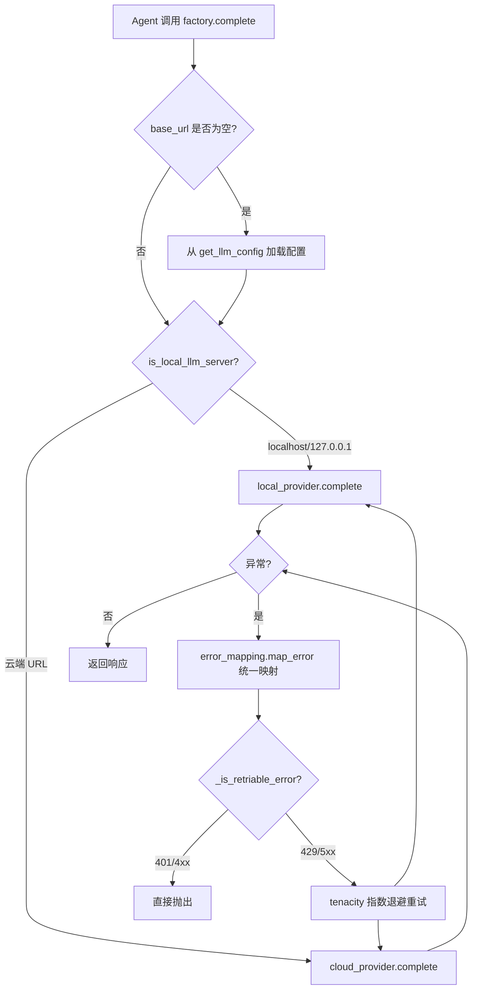
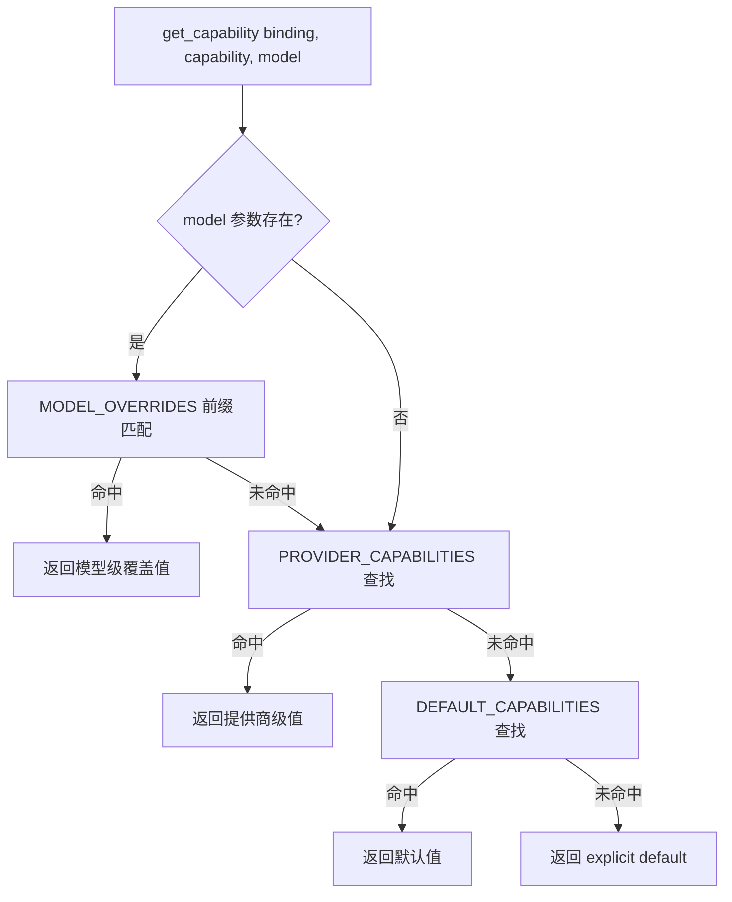
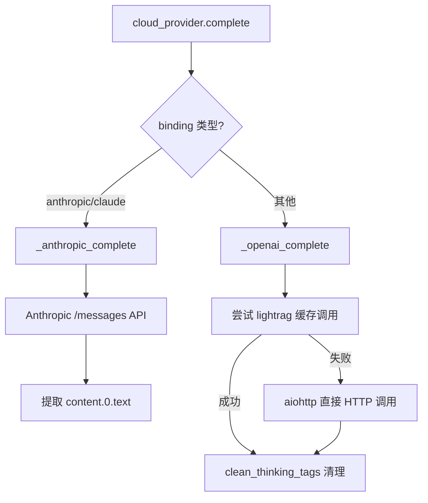

# PD-69.01 DeepTutor — LLM Factory 多提供商统一适配层

> 文档编号：PD-69.01
> 来源：DeepTutor `src/services/llm/factory.py` `src/services/llm/capabilities.py` `src/services/llm/cloud_provider.py`
> GitHub：https://github.com/HKUDS/DeepTutor.git
> 问题域：PD-69 多LLM提供商适配 Multi-LLM Provider Adaptation
> 状态：可复用方案

---

## 第 1 章 问题与动机

### 1.1 核心问题

在 Agent 系统中接入多个 LLM 提供商（OpenAI、Anthropic、DeepSeek、Azure、Groq、Ollama 等）时，面临以下工程挑战：

1. **API 协议碎片化** — OpenAI 用 `Authorization: Bearer`，Anthropic 用 `x-api-key`，Azure 用 `api-key`，各家 endpoint 路径不同（`/chat/completions` vs `/messages`）
2. **能力差异** — 不同提供商对 `response_format`、`tools`、`streaming`、`system_in_messages` 的支持各不相同，且同一提供商的不同模型也有差异（如 DeepSeek-Reasoner 有 thinking tags）
3. **Cloud/Local 双轨** — 生产环境用云端 API，开发调试用本地 Ollama/LM Studio/vLLM，需要无缝切换
4. **错误处理碎片化** — OpenAI SDK 抛 `openai.RateLimitError`，Anthropic SDK 抛 `anthropic.RateLimitError`，原生 HTTP 返回状态码，需要统一映射
5. **重试策略** — 不同错误类型需要不同的重试策略（429 可重试、401 不可重试、5xx 可重试）

### 1.2 DeepTutor 的解法概述

DeepTutor 构建了一个 6 模块分层架构来解决上述问题：

1. **Factory 模块** (`factory.py:116-240`) — 统一入口，提供 `complete()` 和 `stream()` 两个顶层函数，内置 tenacity 重试
2. **Capabilities 矩阵** (`capabilities.py:25-134`) — 集中声明 12 个提供商 × 7 个能力维度的配置表，支持模型级覆盖
3. **Cloud Provider** (`cloud_provider.py:47-97`) — 处理所有云端 API 调用，内部按 binding 分发到 OpenAI 兼容路径或 Anthropic 专用路径
4. **Local Provider** (`local_provider.py:33-112`) — 处理本地服务器调用，使用 aiohttp 替代 httpx（解决 LM Studio 502 问题），内置 streaming 降级
5. **Error Mapping** (`error_mapping.py:54-104`) — 规则链模式将各 SDK 异常映射到统一异常层级
6. **Utils** (`utils.py:60-95`) — URL 检测（Cloud vs Local）、URL 清洗、认证头构建、thinking tags 清理

### 1.3 设计思想

| 设计原则 | 具体实现 | 理由 | 替代方案 |
|----------|----------|------|----------|
| 单一入口 | `factory.complete()` / `factory.stream()` 是唯一调用点 | Agent 层无需关心底层提供商差异 | 每个 Agent 自行选择 Provider（散乱） |
| URL 自动路由 | `is_local_llm_server()` 检测 localhost/127.0.0.1/常见端口 | 零配置切换 Cloud/Local | 手动配置 `provider_type` 字段 |
| 能力矩阵 + 模型覆盖 | `PROVIDER_CAPABILITIES` + `MODEL_OVERRIDES` 两级查找 | 同一提供商不同模型能力不同（如 DeepSeek-Reasoner） | 运行时探测（慢且不可靠） |
| 统一异常层级 | 8 个异常类 + `map_error()` 规则链 | 重试逻辑只需判断统一异常类型 | 每个 Provider 单独 try/except |
| tenacity 重试 | `@tenacity.retry` 装饰器 + 指数退避 | 声明式重试，与业务逻辑分离 | 手写 for 循环重试 |
| 懒加载 | `__getattr__` 延迟导入 cloud/local provider | 避免 lightrag 等重依赖拖慢启动 | 顶层 import（启动慢） |

---

## 第 2 章 源码实现分析

### 2.1 架构概览

DeepTutor 的 LLM 服务采用分层架构，从上到下共 4 层：

```
┌─────────────────────────────────────────────────────────┐
│  Agent 层 (BaseAgent.call_llm / stream_llm)             │
│  src/agents/base_agent.py:340-458                       │
├─────────────────────────────────────────────────────────┤
│  Factory 层 (complete / stream + tenacity retry)        │
│  src/services/llm/factory.py:116-357                    │
├──────────────────────┬──────────────────────────────────┤
│  CloudProvider       │  LocalProvider                   │
│  cloud_provider.py   │  local_provider.py               │
│  ┌────────┬────────┐ │  ┌────────┬────────┬──────────┐  │
│  │OpenAI  │Anthropic│ │  │Ollama  │LMStudio│vLLM/llama│  │
│  │compat  │native  │ │  │        │        │.cpp      │  │
│  └────────┴────────┘ │  └────────┴────────┴──────────┘  │
├──────────────────────┴──────────────────────────────────┤
│  横切关注点                                              │
│  capabilities.py │ error_mapping.py │ utils.py │ config │
└─────────────────────────────────────────────────────────┘
```

### 2.2 核心实现

#### 2.2.1 Factory 路由与重试机制



对应源码 `src/services/llm/factory.py:116-240`：

```python
async def complete(
    prompt: str,
    system_prompt: str = "You are a helpful assistant.",
    model: Optional[str] = None,
    api_key: Optional[str] = None,
    base_url: Optional[str] = None,
    api_version: Optional[str] = None,
    binding: Optional[str] = None,
    messages: Optional[List[Dict[str, str]]] = None,
    max_retries: int = DEFAULT_MAX_RETRIES,
    retry_delay: float = DEFAULT_RETRY_DELAY,
    exponential_backoff: bool = DEFAULT_EXPONENTIAL_BACKOFF,
    **kwargs,
) -> str:
    # 自动加载配置
    if not model or not base_url:
        config = get_llm_config()
        model = model or config.model
        api_key = api_key if api_key is not None else config.api_key
        base_url = base_url or config.base_url
        binding = binding or config.binding or "openai"

    # URL 检测自动路由
    use_local = _should_use_local(base_url)

    # tenacity 声明式重试
    @tenacity.retry(
        retry=(
            tenacity.retry_if_exception_type(LLMRateLimitError)
            | tenacity.retry_if_exception_type(LLMTimeoutError)
            | tenacity.retry_if_exception(_is_retriable_llm_api_error)
        ),
        wait=tenacity.wait_exponential(multiplier=retry_delay, min=retry_delay, max=120),
        stop=tenacity.stop_after_attempt(max_retries + 1),
    )
    async def _do_complete(**call_kwargs):
        try:
            if use_local:
                return await local_provider.complete(**call_kwargs)
            else:
                return await cloud_provider.complete(**call_kwargs)
        except Exception as e:
            from .error_mapping import map_error
            mapped_error = map_error(e, provider=call_kwargs.get("binding", "unknown"))
            raise mapped_error from e

    return await _do_complete(**call_kwargs)
```

关键设计点：
- `_do_complete` 是一个**闭包内函数**，tenacity 装饰器在每次 `complete()` 调用时动态生成，允许 `max_retries` 参数化（`factory.py:197-209`）
- 异常映射在 `_do_complete` 内部完成，确保 tenacity 看到的是统一异常类型（`factory.py:218-221`）
- Streaming 版本 (`factory.py:243-357`) 使用手写 for 循环重试而非 tenacity，因为 AsyncGenerator 不能被 tenacity 装饰

#### 2.2.2 Capabilities 能力矩阵与三级查找



对应源码 `src/services/llm/capabilities.py:180-225`：

```python
def get_capability(
    binding: str,
    capability: str,
    model: Optional[str] = None,
    default: Any = None,
) -> Any:
    binding_lower = (binding or "openai").lower()

    # 1. 模型级覆盖（最长前缀优先匹配）
    if model:
        model_lower = model.lower()
        for pattern, overrides in sorted(MODEL_OVERRIDES.items(), key=lambda x: -len(x[0])):
            if model_lower.startswith(pattern):
                if capability in overrides:
                    return overrides[capability]

    # 2. 提供商级能力
    provider_caps = PROVIDER_CAPABILITIES.get(binding_lower, {})
    if capability in provider_caps:
        return provider_caps[capability]

    # 3. 全局默认值
    if capability in DEFAULT_CAPABILITIES:
        return DEFAULT_CAPABILITIES[capability]

    return default
```

能力矩阵覆盖 12 个提供商（`capabilities.py:25-124`）：

| 提供商 | response_format | streaming | tools | system_in_messages | thinking_tags |
|--------|:-:|:-:|:-:|:-:|:-:|
| openai | ✅ | ✅ | ✅ | ✅ | ❌ |
| anthropic | ❌ | ✅ | ✅ | ❌ | ❌ |
| deepseek | ❌ | ✅ | ✅ | ✅ | ✅ |
| ollama | ✅ | ✅ | ❌ | ✅ | ❌ |
| groq | ✅ | ✅ | ✅ | ✅ | ❌ |
| azure_openai | ✅ | ✅ | ✅ | ✅ | ❌ |

模型级覆盖示例（`capabilities.py:139-177`）：
- `deepseek-reasoner` → `has_thinking_tags: True`
- `claude` → `system_in_messages: False`（即使通过 OpenRouter 调用）
- `o1/o3/gpt-5` → `forced_temperature: 1.0`（推理模型只支持固定温度）

#### 2.2.3 Cloud Provider 双协议分发



对应源码 `src/services/llm/cloud_provider.py:47-97`：

```python
async def complete(
    prompt: str,
    system_prompt: str = "You are a helpful assistant.",
    model: Optional[str] = None,
    api_key: Optional[str] = None,
    base_url: Optional[str] = None,
    api_version: Optional[str] = None,
    binding: str = "openai",
    **kwargs,
) -> str:
    binding_lower = (binding or "openai").lower()

    if binding_lower in ["anthropic", "claude"]:
        return await _anthropic_complete(
            model=model, prompt=prompt, system_prompt=system_prompt,
            api_key=api_key, base_url=base_url, **kwargs,
        )

    # 默认走 OpenAI 兼容路径
    return await _openai_complete(
        model=model, prompt=prompt, system_prompt=system_prompt,
        api_key=api_key, base_url=base_url, api_version=api_version,
        binding=binding_lower, **kwargs,
    )
```

### 2.3 实现细节

#### Error Mapping 规则链

`error_mapping.py` 使用 `MappingRule` dataclass 构建规则链（`error_mapping.py:36-63`）：

1. **状态码快速路径** — 先检查 `status_code` 属性（401→Auth, 429→RateLimit）
2. **SDK 类型匹配** — `openai.AuthenticationError`、`anthropic.RateLimitError` 等
3. **消息文本匹配** — 兜底方案，检查错误消息中是否包含 "rate limit"、"context length" 等关键词
4. **默认映射** — 未匹配的异常统一包装为 `LLMAPIError`

#### URL 自动路由逻辑

`utils.py:60-95` 的 `is_local_llm_server()` 使用三级检测：

1. **排除云端域名** — 12 个已知云端域名（`.openai.com`、`.anthropic.com` 等）
2. **匹配本地主机名** — `localhost`、`127.0.0.1`、`0.0.0.0`
3. **匹配本地端口** — `:1234`(LM Studio)、`:11434`(Ollama)、`:8000`(vLLM)、`:8080`(llama.cpp)

#### Streaming 降级策略

`local_provider.py:174-267` 的 `stream()` 实现了 streaming→non-streaming 自动降级：
- 先尝试 SSE streaming
- 如果 streaming 失败（非 LLMAPIError），自动回退到 `complete()` 非流式调用
- 将完整响应作为单个 chunk yield 出去

#### Thinking Tags 清理

`utils.py:176-210` 的 `clean_thinking_tags()` 处理推理模型（DeepSeek、Qwen）的 `<think>...</think>` 标签：
- 非流式模式：正则 `re.sub(r"<think>.*?</think>", "", content, flags=re.DOTALL)` 一次性清除
- 流式模式：维护 `in_thinking_block` 状态机，缓冲 thinking 内容直到 `</think>` 出现再清理

---

## 第 3 章 迁移指南

### 3.1 迁移清单

**阶段 1：基础层（异常 + 配置）**

- [ ] 创建 `exceptions.py`：定义 `LLMError` → `LLMAPIError` → `LLMRateLimitError` / `LLMTimeoutError` / `LLMAuthenticationError` 异常层级
- [ ] 创建 `config.py`：定义 `LLMConfig` dataclass，支持从环境变量和配置服务加载
- [ ] 创建 `error_mapping.py`：实现 `map_error()` 规则链，将各 SDK 异常映射到统一异常

**阶段 2：能力矩阵**

- [ ] 创建 `capabilities.py`：定义 `PROVIDER_CAPABILITIES` 字典，覆盖目标提供商
- [ ] 添加 `MODEL_OVERRIDES`：为特殊模型（推理模型、Claude via OpenRouter）添加覆盖
- [ ] 实现 `get_capability()` 三级查找函数

**阶段 3：Provider 实现**

- [ ] 创建 `cloud_provider.py`：实现 OpenAI 兼容 + Anthropic 原生两条路径
- [ ] 创建 `local_provider.py`：使用 aiohttp 实现本地服务器调用，含 streaming 降级
- [ ] 创建 `utils.py`：实现 `is_local_llm_server()`、`sanitize_url()`、`build_chat_url()`、`build_auth_headers()`

**阶段 4：Factory 统一入口**

- [ ] 创建 `factory.py`：实现 `complete()` 和 `stream()` 统一入口
- [ ] 集成 tenacity 重试（complete 用装饰器，stream 用手写循环）
- [ ] 定义 `API_PROVIDER_PRESETS` 和 `LOCAL_PROVIDER_PRESETS` 预设

**阶段 5：Agent 层集成**

- [ ] 在 BaseAgent 中添加 `call_llm()` / `stream_llm()` 方法，委托给 factory
- [ ] 添加 capability 检查（如 `supports_response_format`）到 Agent 调用链

### 3.2 适配代码模板

以下是一个最小可运行的 Factory + Capabilities 实现：

```python
# llm/exceptions.py
from typing import Optional, Dict, Any

class LLMError(Exception):
    def __init__(self, message: str, provider: Optional[str] = None):
        super().__init__(message)
        self.provider = provider

class LLMAPIError(LLMError):
    def __init__(self, message: str, status_code: Optional[int] = None, provider: Optional[str] = None):
        super().__init__(message, provider)
        self.status_code = status_code

class LLMRateLimitError(LLMAPIError):
    def __init__(self, message: str = "Rate limit exceeded", retry_after: Optional[float] = None, provider: Optional[str] = None):
        super().__init__(message, status_code=429, provider=provider)
        self.retry_after = retry_after

class LLMTimeoutError(LLMAPIError):
    def __init__(self, message: str = "Request timed out", provider: Optional[str] = None):
        super().__init__(message, status_code=408, provider=provider)

class LLMAuthenticationError(LLMAPIError):
    def __init__(self, message: str = "Authentication failed", provider: Optional[str] = None):
        super().__init__(message, status_code=401, provider=provider)


# llm/capabilities.py
from typing import Any, Optional

PROVIDER_CAPABILITIES: dict[str, dict[str, Any]] = {
    "openai": {"supports_response_format": True, "supports_streaming": True, "system_in_messages": True},
    "anthropic": {"supports_response_format": False, "supports_streaming": True, "system_in_messages": False},
    "deepseek": {"supports_response_format": False, "has_thinking_tags": True, "system_in_messages": True},
    "ollama": {"supports_response_format": True, "supports_streaming": True, "supports_tools": False},
}

MODEL_OVERRIDES: dict[str, dict[str, Any]] = {
    "deepseek-reasoner": {"has_thinking_tags": True},
    "claude": {"system_in_messages": False},
    "o1": {"forced_temperature": 1.0},
}

DEFAULT_CAPABILITIES: dict[str, Any] = {
    "supports_response_format": True, "supports_streaming": True,
    "supports_tools": False, "system_in_messages": True, "has_thinking_tags": False,
}

def get_capability(binding: str, capability: str, model: Optional[str] = None, default: Any = None) -> Any:
    # 1. 模型级覆盖
    if model:
        for pattern, overrides in sorted(MODEL_OVERRIDES.items(), key=lambda x: -len(x[0])):
            if model.lower().startswith(pattern):
                if capability in overrides:
                    return overrides[capability]
    # 2. 提供商级
    caps = PROVIDER_CAPABILITIES.get((binding or "openai").lower(), {})
    if capability in caps:
        return caps[capability]
    # 3. 默认
    return DEFAULT_CAPABILITIES.get(capability, default)


# llm/factory.py
import tenacity
from typing import Optional, List, Dict, AsyncGenerator

async def complete(
    prompt: str, system_prompt: str = "You are a helpful assistant.",
    model: Optional[str] = None, base_url: Optional[str] = None,
    api_key: Optional[str] = None, binding: str = "openai",
    max_retries: int = 3, retry_delay: float = 2.0, **kwargs,
) -> str:
    from .capabilities import get_capability
    from .exceptions import LLMRateLimitError, LLMTimeoutError, LLMAPIError

    use_local = _is_local(base_url)

    @tenacity.retry(
        retry=tenacity.retry_if_exception_type((LLMRateLimitError, LLMTimeoutError)),
        wait=tenacity.wait_exponential(multiplier=retry_delay, min=retry_delay, max=120),
        stop=tenacity.stop_after_attempt(max_retries + 1),
    )
    async def _do():
        if use_local:
            return await _local_complete(prompt, system_prompt, model, base_url, api_key, **kwargs)
        return await _cloud_complete(prompt, system_prompt, model, base_url, api_key, binding, **kwargs)

    return await _do()

def _is_local(url: Optional[str]) -> bool:
    if not url: return False
    u = url.lower()
    return any(h in u for h in ("localhost", "127.0.0.1", "0.0.0.0"))
```

### 3.3 适用场景

| 场景 | 适用度 | 说明 |
|------|--------|------|
| 多提供商 Agent 系统 | ⭐⭐⭐ | 核心场景，Factory + Capabilities 完美匹配 |
| Cloud + Local 混合部署 | ⭐⭐⭐ | URL 自动路由零配置切换 |
| 单提供商简单应用 | ⭐ | 过度设计，直接用 SDK 即可 |
| 需要提供商热切换 | ⭐⭐⭐ | 只需修改 config，无需改代码 |
| 推理模型（o1/DeepSeek-R1） | ⭐⭐⭐ | MODEL_OVERRIDES 处理 thinking tags 和 forced_temperature |
| 高并发生产环境 | ⭐⭐ | tenacity 重试 + 指数退避足够，但缺少连接池和熔断器 |

---

## 第 4 章 测试用例

```python
import pytest
from unittest.mock import AsyncMock, patch, MagicMock

# ---- capabilities 测试 ----

class TestCapabilities:
    """测试 capabilities.py 的三级查找逻辑"""

    def test_provider_level_capability(self):
        """提供商级能力查找"""
        from llm.capabilities import get_capability
        assert get_capability("openai", "supports_response_format") is True
        assert get_capability("anthropic", "supports_response_format") is False

    def test_model_override_takes_precedence(self):
        """模型级覆盖优先于提供商级"""
        from llm.capabilities import get_capability
        # deepseek 提供商级 has_thinking_tags 为 True
        # 但通过 openai binding 调用 deepseek-reasoner 模型时，模型覆盖生效
        assert get_capability("openai", "has_thinking_tags", model="deepseek-reasoner") is True

    def test_unknown_provider_uses_defaults(self):
        """未知提供商使用默认值"""
        from llm.capabilities import get_capability
        assert get_capability("unknown_provider", "supports_streaming") is True
        assert get_capability("unknown_provider", "supports_tools") is False

    def test_longest_prefix_match(self):
        """最长前缀优先匹配"""
        from llm.capabilities import get_capability
        # "deepseek-reasoner" 比 "deepseek" 更长，应优先匹配
        assert get_capability("openai", "has_thinking_tags", model="deepseek-reasoner") is True

    def test_forced_temperature(self):
        """推理模型强制温度"""
        from llm.capabilities import get_capability
        assert get_capability("openai", "forced_temperature", model="o1-preview") == 1.0
        assert get_capability("openai", "forced_temperature", model="gpt-4o") is None


# ---- URL 路由测试 ----

class TestURLRouting:
    """测试 URL 自动路由逻辑"""

    def test_localhost_is_local(self):
        from llm.utils import is_local_llm_server
        assert is_local_llm_server("http://localhost:11434/v1") is True
        assert is_local_llm_server("http://127.0.0.1:1234/v1") is True

    def test_cloud_domains_not_local(self):
        from llm.utils import is_local_llm_server
        assert is_local_llm_server("https://api.openai.com/v1") is False
        assert is_local_llm_server("https://api.anthropic.com/v1") is False

    def test_common_local_ports(self):
        from llm.utils import is_local_llm_server
        assert is_local_llm_server("http://192.168.1.100:11434") is True  # Ollama port
        assert is_local_llm_server("http://192.168.1.100:8000") is True   # vLLM port


# ---- Error Mapping 测试 ----

class TestErrorMapping:
    """测试统一异常映射"""

    def test_status_code_401_maps_to_auth_error(self):
        from llm.error_mapping import map_error
        from llm.exceptions import LLMAuthenticationError
        exc = Exception("Unauthorized")
        exc.status_code = 401
        mapped = map_error(exc, provider="openai")
        assert isinstance(mapped, LLMAuthenticationError)

    def test_status_code_429_maps_to_rate_limit(self):
        from llm.error_mapping import map_error
        from llm.exceptions import LLMRateLimitError
        exc = Exception("Too many requests")
        exc.status_code = 429
        mapped = map_error(exc, provider="openai")
        assert isinstance(mapped, LLMRateLimitError)

    def test_message_based_rate_limit_detection(self):
        from llm.error_mapping import map_error
        from llm.exceptions import LLMRateLimitError
        exc = Exception("Rate limit exceeded, please retry")
        mapped = map_error(exc, provider="deepseek")
        assert isinstance(mapped, LLMRateLimitError)


# ---- Factory 重试测试 ----

class TestFactoryRetry:
    """测试 Factory 重试机制"""

    @pytest.mark.asyncio
    async def test_retry_on_rate_limit(self):
        """429 错误应触发重试"""
        from llm.exceptions import LLMRateLimitError
        call_count = 0

        async def mock_complete(**kwargs):
            nonlocal call_count
            call_count += 1
            if call_count < 3:
                raise LLMRateLimitError("Rate limited")
            return "success"

        with patch("llm.factory.cloud_provider") as mock_cloud:
            mock_cloud.complete = mock_complete
            from llm.factory import complete
            result = await complete("test", base_url="https://api.openai.com/v1", model="gpt-4o")
            assert result == "success"
            assert call_count == 3

    @pytest.mark.asyncio
    async def test_no_retry_on_auth_error(self):
        """401 错误不应重试"""
        from llm.exceptions import LLMAuthenticationError

        async def mock_complete(**kwargs):
            raise LLMAuthenticationError("Invalid API key")

        with patch("llm.factory.cloud_provider") as mock_cloud:
            mock_cloud.complete = mock_complete
            from llm.factory import complete
            with pytest.raises(LLMAuthenticationError):
                await complete("test", base_url="https://api.openai.com/v1", model="gpt-4o")
```

---

## 第 5 章 跨域关联

| 关联域 | 关系类型 | 说明 |
|--------|----------|------|
| PD-03 容错与重试 | 强依赖 | Factory 的 tenacity 重试机制是 PD-03 的具体实现；`_is_retriable_error()` 判断逻辑与容错策略直接相关 |
| PD-04 工具系统 | 协同 | `capabilities.supports_tools()` 决定是否向 LLM 发送 tool 定义；不同提供商的 tool calling 能力差异需要 capabilities 矩阵管理 |
| PD-01 上下文管理 | 协同 | `ProviderContextWindowError` 异常用于检测上下文窗口溢出；`max_tokens` / `max_completion_tokens` 的模型级适配影响上下文预算 |
| PD-11 可观测性 | 协同 | BaseAgent 的 `call_llm()` 中集成了 token 追踪和调用耗时记录（`base_agent.py:436-452`），依赖 Factory 返回的响应 |
| PD-12 推理增强 | 协同 | `MODEL_OVERRIDES` 中的 `has_thinking_tags` 和 `forced_temperature` 专门为推理模型（o1/o3/DeepSeek-R1）设计 |

---

## 第 6 章 来源文件索引

| 文件 | 行范围 | 关键实现 |
|------|--------|----------|
| `src/services/llm/factory.py` | L1-463 | Factory 统一入口：`complete()` + `stream()` + tenacity 重试 + Provider Presets |
| `src/services/llm/capabilities.py` | L25-134 | 12 提供商能力矩阵 `PROVIDER_CAPABILITIES` + 模型覆盖 `MODEL_OVERRIDES` |
| `src/services/llm/capabilities.py` | L180-225 | `get_capability()` 三级查找（模型→提供商→默认） |
| `src/services/llm/cloud_provider.py` | L47-97 | Cloud 入口：按 binding 分发到 OpenAI 兼容 / Anthropic 原生路径 |
| `src/services/llm/cloud_provider.py` | L156-255 | `_openai_complete()`：lightrag 缓存优先 + aiohttp 直接调用降级 |
| `src/services/llm/cloud_provider.py` | L363-416 | `_anthropic_complete()`：Anthropic 原生 API，system 作为独立参数 |
| `src/services/llm/local_provider.py` | L33-112 | Local 非流式调用：aiohttp + thinking tags 清理 |
| `src/services/llm/local_provider.py` | L115-267 | Local 流式调用：SSE 解析 + thinking 状态机 + streaming→non-streaming 降级 |
| `src/services/llm/error_mapping.py` | L36-104 | `MappingRule` 规则链 + `map_error()` 统一异常映射 |
| `src/services/llm/exceptions.py` | L14-153 | 8 个异常类层级：LLMError → LLMAPIError → RateLimit/Timeout/Auth/ModelNotFound |
| `src/services/llm/utils.py` | L60-95 | `is_local_llm_server()`：三级 URL 检测（排除云端→匹配本地主机→匹配本地端口） |
| `src/services/llm/utils.py` | L176-210 | `clean_thinking_tags()`：正则清除 `<think>` 标签 |
| `src/services/llm/utils.py` | L288-317 | `build_auth_headers()`：按 binding 构建不同认证头 |
| `src/services/llm/config.py` | L60-141 | `LLMConfig` dataclass + `get_llm_config()` 双源加载（配置服务→环境变量） |
| `src/services/llm/__init__.py` | L156-166 | `__getattr__` 懒加载 cloud/local provider |
| `src/agents/base_agent.py` | L340-458 | `BaseAgent.call_llm()`：Agent 层统一 LLM 调用接口 |

---

## 第 7 章 横向对比维度

```json comparison_data
{
  "project": "DeepTutor",
  "dimensions": {
    "路由机制": "URL 检测自动路由 Cloud/Local，三级域名+主机名+端口检测",
    "能力管理": "静态 PROVIDER_CAPABILITIES 字典 + MODEL_OVERRIDES 前缀匹配，三级查找",
    "异常处理": "MappingRule 规则链 + 状态码快速路径，8 类统一异常层级",
    "重试策略": "tenacity 声明式重试（complete）+ 手写循环（stream），指数退避 max=120s",
    "协议适配": "OpenAI 兼容 + Anthropic 原生双路径，认证头/endpoint/system_prompt 差异化处理",
    "本地推理支持": "Ollama/LM Studio/vLLM/llama.cpp 四种预设，aiohttp 替代 httpx 解决兼容性"
  }
}
```

### 域元数据补充

```json domain_metadata
{
  "solution_summary": "DeepTutor 用 Factory+Capabilities 矩阵实现 12 提供商统一适配：URL 三级检测自动路由 Cloud/Local，tenacity 声明式重试，MappingRule 规则链统一异常映射",
  "description": "涵盖协议适配、能力探测、异常统一、重试策略的完整多提供商工程方案",
  "sub_problems": [
    "推理模型特殊处理（thinking tags 清理、forced temperature）",
    "lightrag 缓存层与 aiohttp 直接调用的双层降级",
    "模型级能力覆盖（同提供商不同模型能力差异）"
  ],
  "best_practices": [
    "tenacity 装饰器用于非流式重试，手写循环用于流式重试（AsyncGenerator 不可装饰）",
    "MappingRule 规则链模式统一各 SDK 异常到内部异常层级",
    "__getattr__ 懒加载避免重依赖拖慢模块启动"
  ]
}
```
