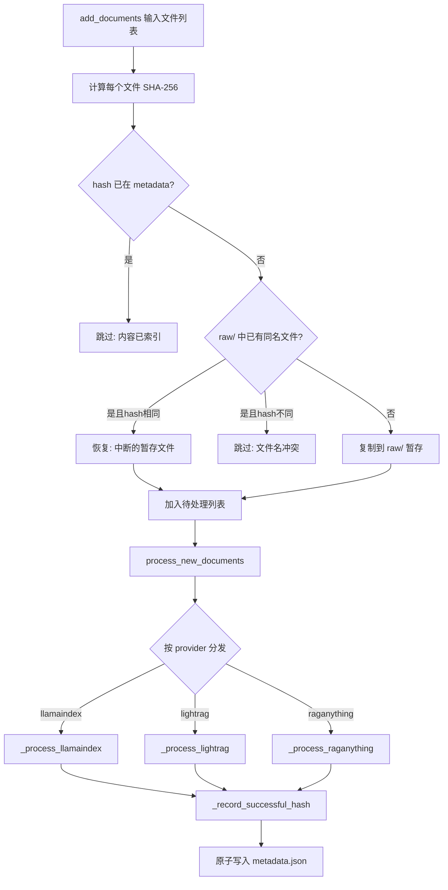
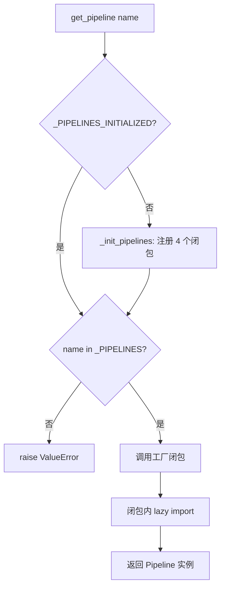
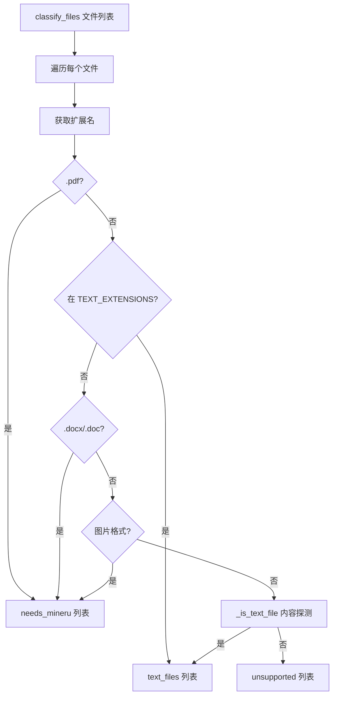

# PD-70.01 DeepTutor — 知识库生命周期管理

> 文档编号：PD-70.01
> 来源：DeepTutor `src/knowledge/add_documents.py`, `src/services/rag/factory.py`, `src/knowledge/manager.py`
> GitHub：https://github.com/HKUDS/DeepTutor.git
> 问题域：PD-70 知识库管理 Knowledge Base Management
> 状态：可复用方案

---

## 第 1 章 问题与动机

### 1.1 核心问题

RAG 应用的知识库管理面临四个工程难题：

1. **增量更新**：用户持续添加文档，如何避免重复索引已有内容？全量重建成本高昂（LLM embedding 费用 + 时间），必须支持增量添加。
2. **多管线兼容**：不同 RAG 引擎（向量检索、知识图谱、多模态）各有优劣，同一系统需要支持多种管线并存，且同一知识库的增量操作必须与初始化时使用的管线保持一致。
3. **多模态文档解析**：真实文档包含 PDF 表格、公式、图片等复杂元素，纯文本提取会丢失关键信息，需要分级处理策略。
4. **构建进度可观测**：知识库构建耗时长（大 PDF 可能数十分钟），用户需要实时了解进度，否则会误以为系统卡死。

### 1.2 DeepTutor 的解法概述

DeepTutor 实现了完整的知识库生命周期管理系统，核心设计：

1. **SHA-256 Hash 去重 + WAL 模式**：`DocumentAdder` 用 SHA-256 对文件内容做指纹，metadata.json 记录已索引文件的 hash 映射，`raw/` 目录作为 Write-Ahead Log 保证中断恢复（`src/knowledge/add_documents.py:135-212`）
2. **懒加载工厂模式**：`factory.py` 用延迟初始化的注册表管理 4 种 RAG 管线，每种管线的依赖只在实际使用时才 import，避免安装全部依赖（`src/services/rag/factory.py:20-63`）
3. **FileTypeRouter 分级路由**：按文件扩展名 + 内容探测将文档分为 3 类（需解析/纯文本/不支持），不同类型走不同处理路径（`src/services/rag/components/routing.py:47-235`）
4. **WebSocket + 回调双通道进度推送**：`ProgressTracker` 同时写文件 + 广播 WebSocket + 触发回调，三路冗余确保前端能收到进度（`src/knowledge/progress_tracker.py:59-99`）
5. **原子写入保护元数据**：hash 记录使用 tempfile + os.replace 原子写入，避免进程崩溃导致 metadata.json 损坏（`src/knowledge/add_documents.py:669-677`）

### 1.3 设计思想

| 设计原则 | 具体实现 | 理由 | 替代方案 |
|----------|----------|------|----------|
| 内容寻址去重 | SHA-256 hash 比对文件内容而非文件名 | 同一文件改名后仍能识别为重复 | 文件名比对（会漏判）、mtime 比对（不可靠） |
| 管线一致性 | 增量添加强制使用 metadata 中记录的 provider | 混用不同索引格式会导致检索失败 | 允许切换（需全量重建） |
| 懒加载隔离 | 每种管线的 import 放在工厂闭包内 | 用户只装了 LlamaIndex 也能正常使用 | 顶层 import（缺依赖直接崩溃） |
| WAL 恢复 | raw/ 目录作为预写日志，先暂存再索引 | 中断后重启可从 raw/ 恢复未完成的文件 | 直接处理源文件（中断后无法恢复） |
| 跨平台文件锁 | fcntl (Unix) / msvcrt (Windows) 双实现 | 多进程并发访问 kb_config.json 不会损坏 | 无锁（并发写入会丢数据） |

---

## 第 2 章 源码实现分析

### 2.1 架构概览

DeepTutor 的知识库管理分为三层：API 层（FastAPI 路由）、业务层（Manager/Initializer/DocumentAdder）、管线层（Pipeline Factory + 4 种 RAG 引擎）。

```
┌─────────────────────────────────────────────────────────────┐
│                    API Layer (FastAPI)                       │
│  /create  /upload  /{kb}/progress/ws  /{kb}/link-folder     │
└──────────┬──────────────────┬───────────────────┬───────────┘
           │                  │                   │
┌──────────▼──────────┐ ┌────▼────────────┐ ┌────▼──────────┐
│ KnowledgeBaseManager│ │ Initializer     │ │ DocumentAdder │
│ (CRUD + 文件锁)     │ │ (首次构建)      │ │ (增量添加)    │
└──────────┬──────────┘ └────┬────────────┘ └────┬──────────┘
           │                 │                    │
           │    ┌────────────▼────────────────────▼──────┐
           │    │         RAGService (统一入口)           │
           │    └────────────┬──────────────────────────┘
           │                 │
           │    ┌────────────▼──────────────────────────┐
           │    │      Pipeline Factory (懒加载注册表)    │
           │    ├────────┬────────┬──────────┬──────────┤
           │    │LlamaIdx│LightRAG│RAGAnythng│RAGAny-Doc│
           │    │(向量)  │(知识图谱)│(MinerU) │(Docling) │
           │    └────────┴────────┴──────────┴──────────┘
           │
┌──────────▼──────────────────────────────────────────────┐
│              Storage Layer (文件系统)                     │
│  kb_config.json  metadata.json  raw/  rag_storage/      │
│  images/  content_list/  .progress.json                  │
└─────────────────────────────────────────────────────────┘
```

### 2.2 核心实现

#### 2.2.1 增量文档添加与 Hash 去重



对应源码 `src/knowledge/add_documents.py:162-212`：

```python
def add_documents(self, source_files: List[str], allow_duplicates: bool = False) -> List[Path]:
    """
    Synchronous phase: Validates hashes and prepares files.
    Treats 'raw/' as a Write-Ahead Log: files exist there before being canonized in metadata.
    """
    ingested_hashes = self.get_ingested_hashes()

    files_to_process = []
    for source in source_files:
        source_path = Path(source)
        if not source_path.exists():
            continue

        current_hash = self._get_file_hash(source_path)

        # 1. Canon Check: content already fully ingested?
        if current_hash in ingested_hashes.values() and not allow_duplicates:
            logger.info(f"  → Skipped (content already indexed): {source_path.name}")
            continue

        # 2. Write-Ahead Log: prepare file in raw/
        dest_path = self.raw_dir / source_path.name
        should_copy = True
        if dest_path.exists():
            dest_hash = self._get_file_hash(dest_path)
            if dest_hash == current_hash:
                should_copy = False  # Recovering from interrupted run
            else:
                if not allow_duplicates:
                    continue

        if should_copy:
            shutil.copy2(source_path, dest_path)
        files_to_process.append(dest_path)

    return files_to_process
```

原子写入保护 `src/knowledge/add_documents.py:656-679`：

```python
def _record_successful_hash(self, file_path: Path):
    """Update metadata with the hash of a successfully processed file."""
    file_hash = self._get_file_hash(file_path)
    metadata = {}
    if self.metadata_file.exists():
        with open(self.metadata_file, "r", encoding="utf-8") as f:
            metadata = json.load(f)

    if "file_hashes" not in metadata:
        metadata["file_hashes"] = {}
    metadata["file_hashes"][file_path.name] = file_hash

    # Atomic write: write to temp file, then rename
    fd, tmp_path = tempfile.mkstemp(dir=self.kb_dir, suffix=".json")
    try:
        with os.fdopen(fd, "w", encoding="utf-8") as f:
            json.dump(metadata, f, indent=2, ensure_ascii=False)
        os.replace(tmp_path, self.metadata_file)
    except Exception:
        os.unlink(tmp_path)
        raise
```

#### 2.2.2 懒加载管线工厂



对应源码 `src/services/rag/factory.py:20-63`：

```python
_PIPELINES: Dict[str, Callable] = {}
_PIPELINES_INITIALIZED = False

def _init_pipelines():
    global _PIPELINES, _PIPELINES_INITIALIZED
    if _PIPELINES_INITIALIZED:
        return

    def _build_raganything(**kwargs):
        from .pipelines.raganything import RAGAnythingPipeline
        return RAGAnythingPipeline(**kwargs)

    def _build_lightrag(kb_base_dir=None, **kwargs):
        from .pipelines.lightrag import LightRAGPipeline
        return LightRAGPipeline(kb_base_dir=kb_base_dir)

    def _build_llamaindex(**kwargs):
        from .pipelines.llamaindex import LlamaIndexPipeline
        return LlamaIndexPipeline(**kwargs)

    _PIPELINES.update({
        "raganything": _build_raganything,
        "raganything_docling": _build_raganything_docling,
        "lightrag": _build_lightrag,
        "llamaindex": _build_llamaindex,
    })
    _PIPELINES_INITIALIZED = True
```

#### 2.2.3 FileTypeRouter 文件分级路由



对应源码 `src/services/rag/components/routing.py:47-166`：

```python
class FileTypeRouter:
    MINERU_EXTENSIONS = {".pdf"}
    TEXT_EXTENSIONS = {".txt", ".md", ".json", ".yaml", ".py", ".js", ...}  # 50+ types
    DOCX_EXTENSIONS = {".docx", ".doc"}
    IMAGE_EXTENSIONS = {".png", ".jpg", ".jpeg", ".gif", ".webp", ".bmp", ".tiff"}

    @classmethod
    def get_document_type(cls, file_path: str) -> DocumentType:
        ext = Path(file_path).suffix.lower()
        if ext in cls.MINERU_EXTENSIONS:
            return DocumentType.PDF
        elif ext in cls.TEXT_EXTENSIONS:
            return DocumentType.TEXT
        elif ext in cls.DOCX_EXTENSIONS:
            return DocumentType.DOCX
        elif ext in cls.IMAGE_EXTENSIONS:
            return DocumentType.IMAGE
        else:
            if cls._is_text_file(file_path):  # Content-based fallback
                return DocumentType.TEXT
            return DocumentType.UNKNOWN
```

### 2.3 实现细节

**知识库目录结构**（`src/knowledge/initializer.py:50-54`）：

```
data/knowledge_bases/{kb_name}/
├── raw/              # Write-Ahead Log: 原始文档暂存
├── images/           # 规范化图片目录（迁移后的最终位置）
├── rag_storage/      # RAG 引擎索引存储
├── content_list/     # 解析后的结构化内容 JSON
├── metadata.json     # 元数据 + file_hashes + rag_provider
└── .progress.json    # 构建进度快照
```

**进度推送三通道**（`src/knowledge/progress_tracker.py:59-99`）：

1. **WebSocket 广播**：通过 `ProgressBroadcaster` 单例推送到所有连接的前端客户端
2. **回调函数**：支持注册多个回调，用于后台任务日志
3. **文件持久化**：同时写入 `kb_config.json`（集中配置）和 `.progress.json`（本地快照）

**图片迁移管线**（`src/services/rag/utils/image_migration.py:29-90`）：

解析器（MinerU/Docling）输出图片到嵌套目录 `content_list/{doc}/auto/images/`，但 RAG 索引存储的是路径引用。如果先索引再迁移图片，检索时路径会断裂。DeepTutor 的做法是在 RAG 索引之前先迁移图片到 `kb/images/`，更新 content_list 中的路径，再插入 RAG。使用信号量（`MAX_CONCURRENT_COPIES=10`）控制并发 I/O。

**跨平台文件锁**（`src/knowledge/manager.py:22-63`）：

`KnowledgeBaseManager` 对 `kb_config.json` 的读写使用文件锁保护。Unix 用 `fcntl.flock`（共享锁/排他锁），Windows 用 `msvcrt.locking`，通过 `@contextmanager` 封装为统一接口。
