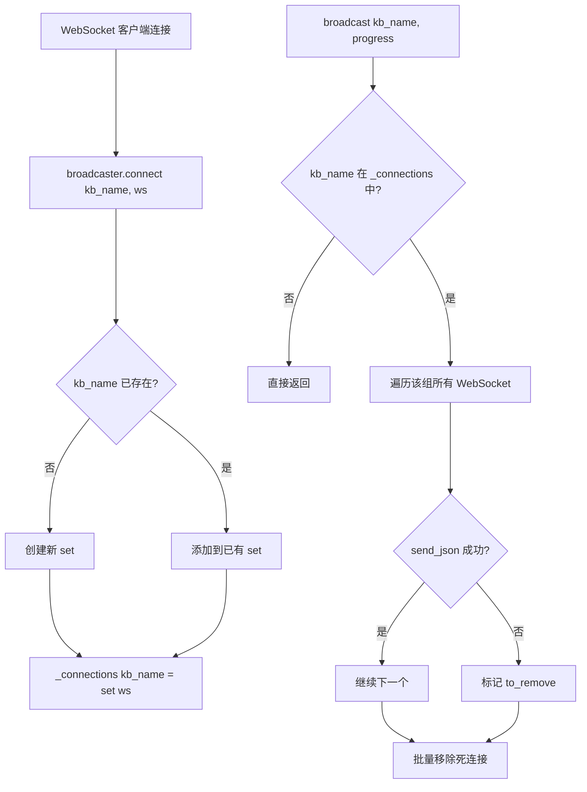
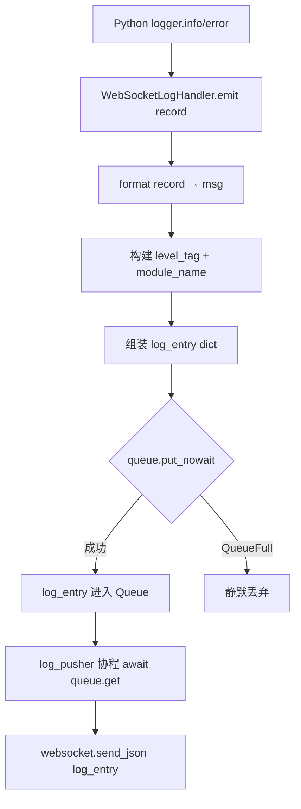
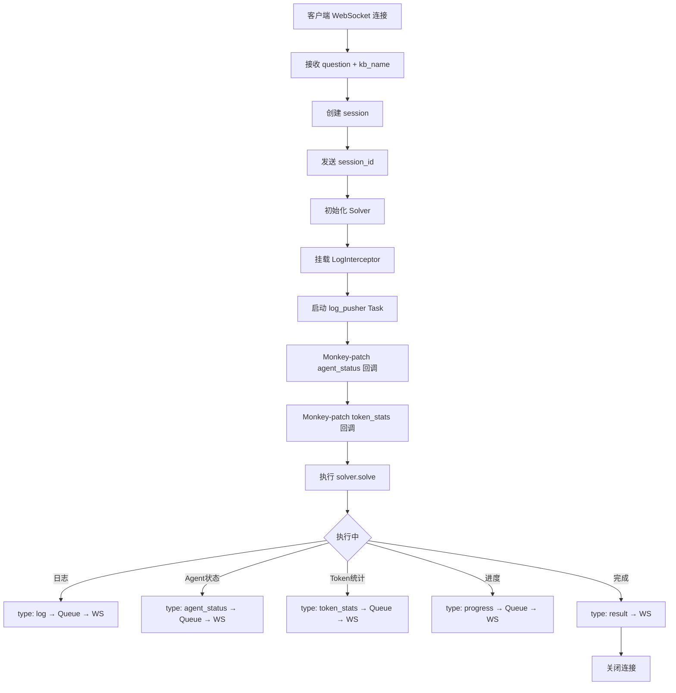

# PD-71.01 DeepTutor — WebSocket 全链路实时通信管道

> 文档编号：PD-71.01
> 来源：DeepTutor `src/api/utils/progress_broadcaster.py`, `src/logging/handlers/websocket.py`, `src/api/routers/solve.py`
> GitHub：https://github.com/HKUDS/DeepTutor.git
> 问题域：PD-71 实时通信 Real-time Communication
> 状态：可复用方案

---

## 第 1 章 问题与动机

### 1.1 核心问题

AI 教学系统中，后端执行链路通常包含多个 Agent 协作、RAG 检索、LLM 推理等耗时操作，单次请求可能持续数十秒甚至数分钟。如果采用传统 HTTP 请求-响应模式，用户在等待期间完全无法感知后端进度，体验极差。

核心挑战包括：

1. **长时任务进度可见性** — 知识库初始化（文档解析、向量化）可能持续数分钟，用户需要实时看到处理进度
2. **多 Agent 状态同步** — Solver 包含 6+ 个 Agent（InvestigateAgent、NoteAgent、ManagerAgent 等），每个 Agent 的状态变化需要实时推送到前端
3. **日志流式透传** — 后端 Python logging 系统产生的日志需要实时桥接到前端展示，而非等任务结束后批量返回
4. **多通道复用** — 同一个 WebSocket 连接需要同时传输日志、进度、Agent 状态、Token 统计、最终结果等多种消息类型
5. **资源隔离广播** — 多个知识库可能同时初始化，进度广播不能互相污染

### 1.2 DeepTutor 的解法概述

DeepTutor 构建了一套三层实时通信架构：

1. **ProgressBroadcaster 单例** — 管理按 `kb_name` 分组的 WebSocket 连接池，支持多客户端同时监听同一知识库的进度（`src/api/utils/progress_broadcaster.py:11-73`）
2. **WebSocketLogHandler + LogInterceptor** — 将 Python logging 系统桥接到 asyncio Queue，再由 log_pusher 协程推送到 WebSocket（`src/logging/handlers/websocket.py:14-132`）
3. **多类型消息协议** — 每个 WebSocket 端点定义统一的 `{type: string, ...}` 消息格式，前端通过 `type` 字段分发到不同的状态更新逻辑（`src/api/routers/solve.py:106-358`）
4. **asyncio Queue 解耦** — 日志生产者（logging.Handler）和消费者（WebSocket pusher）通过 Queue 解耦，避免阻塞业务逻辑（`src/api/routers/solve.py:103-143`）
5. **ProgressTracker 双写** — 进度同时写入文件（`.progress.json`）和通过 Broadcaster 推送 WebSocket，支持断线重连后恢复进度（`src/knowledge/progress_tracker.py:101-203`）

### 1.3 设计思想

| 设计原则 | 具体实现 | 理由 | 替代方案 |
|----------|----------|------|----------|
| 单例连接池 | `ProgressBroadcaster._instance` 类变量 + `get_instance()` | 全局唯一广播器，避免多实例导致连接丢失 | 依赖注入容器（更重但更灵活） |
| 资源分组隔离 | `_connections: dict[str, set[WebSocket]]` 按 kb_name 分组 | 不同知识库的进度互不干扰 | 每个资源独立 WebSocket 端点（URL 爆炸） |
| Queue 解耦 | `asyncio.Queue` 连接 Handler 和 Pusher | logging.Handler.emit() 是同步方法，不能直接 await WebSocket.send | 直接在 emit 中 fire-and-forget（丢消息风险） |
| 消息类型协议 | `{"type": "log"|"progress"|"result"|...}` | 单连接多通道复用，减少连接数 | 每种消息类型独立 WebSocket（连接管理复杂） |
| 双写持久化 | 文件 + WebSocket 同时写入 | 断线重连时可从文件恢复最新进度 | 仅 WebSocket（断线即丢失进度） |
| 死连接清理 | broadcast 时 try/except 标记失败连接，循环后批量移除 | 避免在迭代 set 时修改集合 | 心跳检测（额外开销） |

---

## 第 2 章 源码实现分析

### 2.1 架构概览

DeepTutor 的实时通信架构分为三层：广播层、桥接层、端点层。

```
┌─────────────────────────────────────────────────────────────────┐
│                        Frontend (React)                         │
│  ┌──────────────┐  ┌──────────────┐  ┌──────────────────────┐  │
│  │ SolverContext │  │ ChatContext   │  │ ResearchContext       │  │
│  │ ws.onmessage │  │ ws.onmessage │  │ ws.onmessage          │  │
│  └──────┬───────┘  └──────┬───────┘  └──────────┬───────────┘  │
│         │                  │                      │              │
│         │    WebSocket (type-based multiplexing)  │              │
├─────────┼──────────────────┼──────────────────────┼──────────────┤
│         ▼                  ▼                      ▼              │
│  ┌──────────────┐  ┌──────────────┐  ┌──────────────────────┐  │
│  │ /api/v1/solve│  │ /api/v1/chat │  │ /api/v1/research/run │  │
│  │  WebSocket   │  │  WebSocket   │  │  WebSocket            │  │
│  └──────┬───────┘  └──────┬───────┘  └──────────┬───────────┘  │
│         │                  │                      │              │
│  ┌──────▼───────┐         │              ┌───────▼──────────┐  │
│  │ log_pusher   │         │              │ log_pusher +      │  │
│  │ (asyncio     │         │              │ progress_pusher   │  │
│  │  Task)       │         │              │ (asyncio Tasks)   │  │
│  └──────┬───────┘         │              └───────┬──────────┘  │
│         │                  │                      │              │
│  ┌──────▼───────┐         │              ┌───────▼──────────┐  │
│  │ asyncio.Queue│         │              │ log_queue +       │  │
│  │              │         │              │ progress_queue    │  │
│  └──────┬───────┘         │              └───────┬──────────┘  │
│         │                  │                      │              │
│  ┌──────▼────────────┐    │              ┌───────▼──────────┐  │
│  │WebSocketLogHandler│    │              │StdoutInterceptor │  │
│  │ + LogInterceptor  │    │              │ + progress_cb    │  │
│  └───────────────────┘    │              └──────────────────┘  │
│                            │                                    │
│  ┌─────────────────────────▼────────────────────────────────┐  │
│  │              ProgressBroadcaster (Singleton)              │  │
│  │  _connections: {kb_name: set[WebSocket]}                  │  │
│  │  ← ProgressTracker._notify() 调用                         │  │
│  └──────────────────────────────────────────────────────────┘  │
│                        Backend (FastAPI)                        │
└─────────────────────────────────────────────────────────────────┘
```

### 2.2 核心实现

#### 2.2.1 ProgressBroadcaster — 按资源分组的 WebSocket 连接池



对应源码 `src/api/utils/progress_broadcaster.py:11-73`：

```python
class ProgressBroadcaster:
    """Manages WebSocket broadcasting of knowledge base progress"""

    _instance: Optional["ProgressBroadcaster"] = None
    _connections: dict[str, set[WebSocket]] = {}  # kb_name -> Set[WebSocket]
    _lock = asyncio.Lock()

    @classmethod
    def get_instance(cls) -> "ProgressBroadcaster":
        """Get singleton instance"""
        if cls._instance is None:
            cls._instance = cls()
        return cls._instance

    async def broadcast(self, kb_name: str, progress: dict):
        """Broadcast progress update to all WebSocket connections for specified knowledge base"""
        async with self._lock:
            if kb_name not in self._connections:
                return
            to_remove = []
            for websocket in self._connections[kb_name]:
                try:
                    await websocket.send_json({"type": "progress", "data": progress})
                except Exception as e:
                    print(f"[ProgressBroadcaster] Error sending to WebSocket for KB '{kb_name}': {e}")
                    to_remove.append(websocket)
            for ws in to_remove:
                self._connections[kb_name].discard(ws)
            if not self._connections[kb_name]:
                del self._connections[kb_name]
```

关键设计点：
- **类变量 `_connections`** 而非实例变量，确保单例模式下所有引用共享同一连接池
- **`asyncio.Lock`** 保护并发访问，防止多个协程同时修改连接集合
- **延迟清理** — 先收集 `to_remove` 列表，遍历结束后再批量 `discard`，避免迭代中修改集合

#### 2.2.2 WebSocketLogHandler — logging 到 WebSocket 的桥接器



对应源码 `src/logging/handlers/websocket.py:14-91`：

```python
class WebSocketLogHandler(logging.Handler):
    def __init__(self, queue: asyncio.Queue, include_module: bool = True,
                 service_prefix: Optional[str] = None):
        super().__init__()
        self.queue = queue
        self.include_module = include_module
        self.service_prefix = service_prefix
        self.setFormatter(logging.Formatter("%(message)s"))

    def emit(self, record: logging.LogRecord):
        try:
            msg = self.format(record)
            display_level = getattr(record, "display_level", record.levelname)
            module_name = getattr(record, "module_name", record.name)
            log_entry = {
                "type": "log",
                "level": display_level,
                "module": module_name,
                "content": f"{display_level} [{module_name}] {msg}",
                "message": msg,
                "timestamp": record.created,
            }
            try:
                self.queue.put_nowait(log_entry)
            except asyncio.QueueFull:
                pass  # Drop log if queue is full
        except Exception:
            self.handleError(record)
```

关键设计点：
- **`put_nowait` + QueueFull 静默丢弃** — `emit()` 是同步方法，不能 `await`，所以用非阻塞入队；队列满时丢弃日志而非阻塞业务
- **结构化消息** — 不是简单传字符串，而是包含 `type`、`level`、`module`、`timestamp` 的结构化 JSON
- **LogInterceptor 上下文管理器** — 临时挂载 Handler 到 logger，任务结束自动移除，避免 Handler 泄漏

#### 2.2.3 Solve 端点 — 多通道消息复用



对应源码 `src/api/routers/solve.py:97-424`，核心的 `safe_send_json` 和 `log_pusher`：

```python
@router.websocket("/solve")
async def websocket_solve(websocket: WebSocket):
    await websocket.accept()
    connection_closed = asyncio.Event()
    log_queue = asyncio.Queue()

    async def safe_send_json(data: dict[str, Any]):
        """Safely send JSON to WebSocket, checking if connection is closed"""
        if connection_closed.is_set():
            return False
        try:
            await websocket.send_json(data)
            return True
        except (WebSocketDisconnect, RuntimeError, ConnectionError):
            connection_closed.set()
            return False

    async def log_pusher():
        while not connection_closed.is_set():
            try:
                entry = await asyncio.wait_for(log_queue.get(), timeout=0.5)
                try:
                    await websocket.send_json(entry)
                except (WebSocketDisconnect, RuntimeError, ConnectionError):
                    connection_closed.set()
                    break
                log_queue.task_done()
            except asyncio.TimeoutError:
                continue
```

关键设计点：
- **`connection_closed` Event** — 全局断连标志，`safe_send_json` 和 `log_pusher` 都检查此标志，避免向已关闭连接发送数据
- **`wait_for(timeout=0.5)`** — log_pusher 不会永久阻塞在 `queue.get()`，每 0.5 秒检查一次连接状态
- **Monkey-patch 回调** — 通过替换 `display_manager.set_agent_status` 和 `update_token_stats` 方法，将 Agent 状态变化注入到 Queue 中（`solve.py:233-269`）

