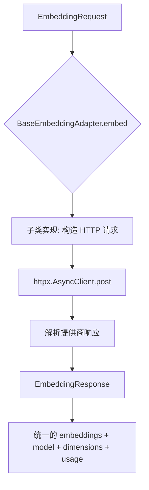
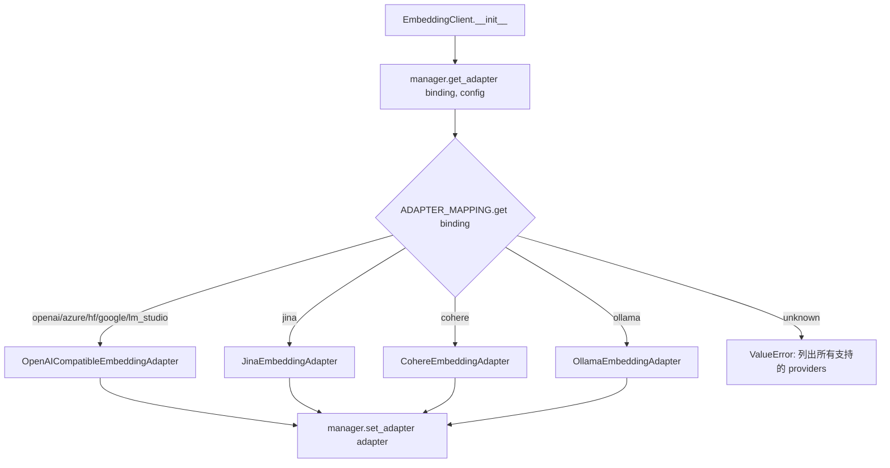
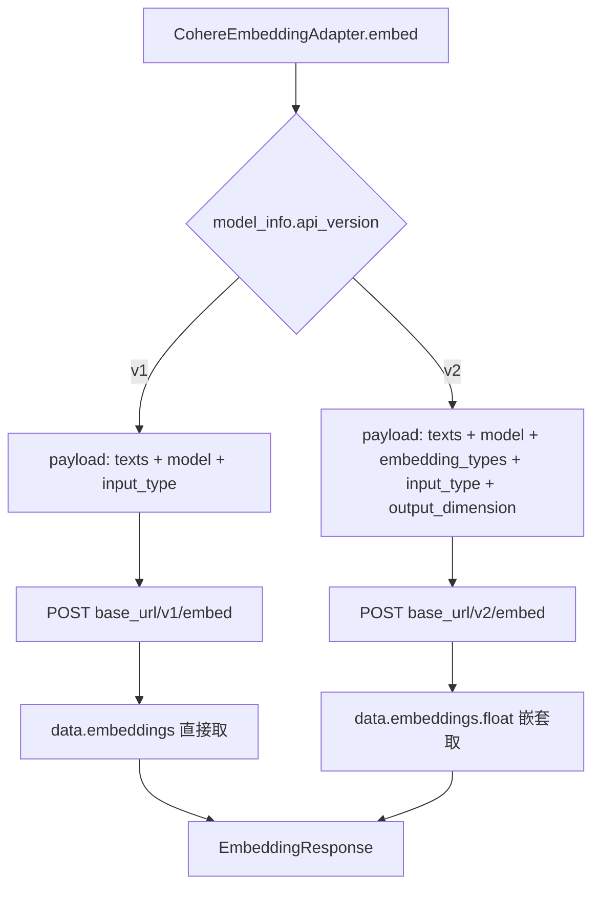

# PD-72.01 DeepTutor — Embedding 多提供商适配器架构

> 文档编号：PD-72.01
> 来源：DeepTutor `src/services/embedding/`
> GitHub：https://github.com/HKUDS/DeepTutor.git
> 问题域：PD-72 Embedding多提供商适配 Embedding Provider Adaptation
> 状态：可复用方案

---

## 第 1 章 问题与动机

### 1.1 核心问题

RAG 系统需要将文本转换为向量表示，但不同 Embedding 提供商的 API 差异巨大：

- **认证方式不同**：OpenAI 用 `Authorization: Bearer`，Azure 用 `api-key` header + URL query `api-version`
- **请求格式不同**：Cohere v1 用 `texts` 字段，v2 用 `texts` + `embedding_types`；Ollama 用 `/api/embed` 端点
- **响应格式不同**：OpenAI 返回 `data[].embedding`，Cohere v1 返回 `embeddings[]`，Cohere v2 返回 `embeddings.float[]`
- **特性差异**：Jina 支持 task-aware embedding 和 late chunking，Cohere 区分 `search_document` / `search_query` 语义
- **本地 vs 云端**：Ollama/LM Studio 无需 API Key，需要检测服务可用性和模型是否已下载

如果每个 RAG pipeline（LightRAG、LlamaIndex、RAGAnything）各自实现 Embedding 调用，会导致大量重复代码和维护噩梦。

### 1.2 DeepTutor 的解法概述

DeepTutor 通过 **适配器模式 + 单例客户端 + 框架桥接** 三层架构统一管理 8 种 Embedding 提供商：

1. **BaseEmbeddingAdapter 抽象基类**（`src/services/embedding/adapters/base.py:56`）定义 `embed()` + `get_model_info()` 统一接口
2. **4 个具体适配器** 覆盖 8 种提供商：OpenAICompatible（复用于 OpenAI/Azure/HuggingFace/Google/LM Studio）、Jina、Cohere、Ollama
3. **EmbeddingProviderManager**（`src/services/embedding/provider.py:22`）通过 `ADAPTER_MAPPING` 字典集中注册，工厂方法按 binding 名实例化
4. **EmbeddingClient 单例**（`src/services/embedding/client.py:19`）对外暴露 `embed()` 和 `get_embedding_func()`
5. **LightRAG 桥接**（`src/services/embedding/client.py:113`）通过 `get_embedding_func()` 输出 `EmbeddingFunc` 兼容 LightRAG 的 numpy 数组格式

### 1.3 设计思想

| 设计原则 | 具体实现 | 理由 | 替代方案 |
|----------|----------|------|----------|
| 适配器模式 | BaseEmbeddingAdapter ABC + 4 个子类 | 隔离提供商 API 差异，新增提供商只需加一个类 | 策略模式（更轻量但缺少类型约束） |
| OpenAI 兼容复用 | 5 种提供商共用 OpenAICompatibleEmbeddingAdapter | OpenAI API 已成事实标准，Azure/HuggingFace/Google/LM Studio 均兼容 | 每个提供商独立适配器（代码膨胀） |
| 双层单例 | ProviderManager 单例 + EmbeddingClient 单例 | 避免重复初始化 HTTP 客户端和配置解析 | 依赖注入容器（过重） |
| 标准化请求/响应 | EmbeddingRequest/EmbeddingResponse dataclass | 统一上下游数据格式，适配器只负责协议转换 | Dict 传递（缺少类型安全） |
| 框架桥接 | get_embedding_func() 返回 LightRAG EmbeddingFunc | 让 RAG 框架无感知地使用统一 Embedding 服务 | 在每个 RAG pipeline 中重复适配 |
| 配置优先级 | 统一配置服务 > .env 环境变量 | 支持运行时动态切换提供商，同时保留简单部署方式 | 只支持 .env（无法运行时切换） |

---

## 第 2 章 源码实现分析

### 2.1 架构概览

DeepTutor 的 Embedding 服务采用经典的三层架构：配置层 → 管理层 → 适配层，通过单例模式对外暴露统一接口。

```
┌─────────────────────────────────────────────────────────────────┐
│                      消费者层                                    │
│  LightRAG Pipeline  │  LlamaIndex Pipeline  │  RAGAnything      │
│  (get_embedding_func)│  (get_embedding_client)│  (get_embedding_client) │
└────────┬────────────┴──────────┬─────────────┴────────┬─────────┘
         │                       │                       │
         ▼                       ▼                       ▼
┌─────────────────────────────────────────────────────────────────┐
│              EmbeddingClient (单例)                               │
│  embed(texts) → List[List[float]]                                │
│  get_embedding_func() → LightRAG EmbeddingFunc                   │
│  embed_sync(texts) → 同步包装器                                   │
└────────────────────────┬────────────────────────────────────────┘
                         │
                         ▼
┌─────────────────────────────────────────────────────────────────┐
│         EmbeddingProviderManager (单例)                           │
│  ADAPTER_MAPPING: {binding_name → AdapterClass}                  │
│  get_adapter(binding, config) → BaseEmbeddingAdapter             │
│  set_adapter() / get_active_adapter()                            │
└────────────────────────┬────────────────────────────────────────┘
                         │
         ┌───────────────┼───────────────┬───────────────┐
         ▼               ▼               ▼               ▼
┌──────────────┐ ┌──────────────┐ ┌──────────────┐ ┌──────────────┐
│ OpenAI       │ │ Jina         │ │ Cohere       │ │ Ollama       │
│ Compatible   │ │ Adapter      │ │ Adapter      │ │ Adapter      │
│ (5 providers)│ │ (task-aware) │ │ (v1/v2 API)  │ │ (local)      │
└──────────────┘ └──────────────┘ └──────────────┘ └──────────────┘
```

### 2.2 核心实现

#### 2.2.1 适配器基类与标准化数据结构



对应源码 `src/services/embedding/adapters/base.py:15-97`：

```python
@dataclass
class EmbeddingRequest:
    """Provider-agnostic request format."""
    texts: List[str]
    model: str
    dimensions: Optional[int] = None
    input_type: Optional[str] = None      # Cohere/Jina task-aware
    encoding_format: Optional[str] = "float"
    truncate: Optional[bool] = True
    normalized: Optional[bool] = True      # Jina/Ollama L2 归一化
    late_chunking: Optional[bool] = False  # Jina v3 长上下文

@dataclass
class EmbeddingResponse:
    """Standard embedding response structure."""
    embeddings: List[List[float]]
    model: str
    dimensions: int
    usage: Dict[str, Any]

class BaseEmbeddingAdapter(ABC):
    def __init__(self, config: Dict[str, Any]):
        self.api_key = config.get("api_key")
        self.base_url = config.get("base_url")
        self.api_version = config.get("api_version")
        self.model = config.get("model")
        self.dimensions = config.get("dimensions")
        self.request_timeout = config.get("request_timeout", 30)

    @abstractmethod
    async def embed(self, request: EmbeddingRequest) -> EmbeddingResponse:
        pass

    @abstractmethod
    def get_model_info(self) -> Dict[str, Any]:
        pass
```

关键设计：`EmbeddingRequest` 包含所有提供商可能用到的字段（`input_type`、`normalized`、`late_chunking`），各适配器按需取用、忽略不支持的字段。这是一种 **超集请求** 设计——请求结构是所有提供商能力的并集。

#### 2.2.2 ProviderManager 工厂注册



对应源码 `src/services/embedding/provider.py:22-71`：

```python
class EmbeddingProviderManager:
    ADAPTER_MAPPING: Dict[str, Type[BaseEmbeddingAdapter]] = {
        "openai": OpenAICompatibleEmbeddingAdapter,
        "azure_openai": OpenAICompatibleEmbeddingAdapter,
        "jina": JinaEmbeddingAdapter,
        "huggingface": OpenAICompatibleEmbeddingAdapter,
        "google": OpenAICompatibleEmbeddingAdapter,
        "cohere": CohereEmbeddingAdapter,
        "ollama": OllamaEmbeddingAdapter,
        "lm_studio": OpenAICompatibleEmbeddingAdapter,
    }

    def get_adapter(self, binding: str, config: Dict[str, Any]) -> BaseEmbeddingAdapter:
        adapter_class = self.ADAPTER_MAPPING.get(binding)
        if not adapter_class:
            supported = ", ".join(self.ADAPTER_MAPPING.keys())
            raise ValueError(
                f"Unknown embedding binding: '{binding}'. Supported providers: {supported}"
            )
        return adapter_class(config)
```

8 种 binding 映射到 4 个适配器类。OpenAI 兼容协议覆盖了 5 种提供商，这是一个务实的设计——与其为每个提供商写独立适配器，不如识别出 OpenAI API 已成为事实标准这一现实。

#### 2.2.3 Cohere 双版本 API 适配



对应源码 `src/services/embedding/adapters/cohere.py:45-116`：

```python
class CohereEmbeddingAdapter(BaseEmbeddingAdapter):
    MODELS_INFO = {
        "embed-v4.0": {"dimensions": [256, 512, 1024, 1536], "default": 1024, "api_version": "v2"},
        "embed-english-v3.0": {"dimensions": [1024], "default": 1024, "api_version": "v1"},
        "embed-multilingual-v3.0": {"dimensions": [1024], "default": 1024, "api_version": "v1"},
    }

    async def embed(self, request: EmbeddingRequest) -> EmbeddingResponse:
        model_name = request.model or self.model
        model_info = self.MODELS_INFO.get(model_name, {})
        api_version = model_info.get("api_version", "v2")

        if api_version == "v1":
            payload = {"texts": request.texts, "model": model_name, "input_type": input_type}
        else:
            payload = {
                "texts": request.texts, "model": model_name,
                "embedding_types": ["float"], "input_type": input_type,
            }
            # v2 支持可变维度
            if isinstance(supported_dims, list) and len(supported_dims) > 1:
                payload["output_dimension"] = dimension or model_info.get("default")

        url = f"{self.base_url}/{api_version}/embed"
        # ... HTTP 调用 ...

        # 响应解析也按版本区分
        if api_version == "v1":
            embeddings = data["embeddings"]
        else:
            embeddings = data["embeddings"]["float"]
```

Cohere 适配器通过 `MODELS_INFO` 字典内嵌 `api_version` 字段，让模型名自动决定使用 v1 还是 v2 API。这避免了用户手动配置 API 版本。

#### 2.2.4 Ollama 本地服务容错

Ollama 适配器（`src/services/embedding/adapters/ollama.py:23-108`）实现了三层容错：

1. **模型不存在检测**（L45-63）：404 时主动查询 `/api/tags` 列出可用模型，提示 `ollama pull`
2. **连接失败检测**（L68-72）：`ConnectError` 时提示启动 `ollama serve`
3. **超时保护**（L74-78）：`TimeoutException` 时提示模型过大或服务过载

### 2.3 实现细节

#### LightRAG 桥接层

`EmbeddingClient.get_embedding_func()`（`src/services/embedding/client.py:113-134`）是连接统一 Embedding 服务与 LightRAG 框架的桥梁：

```python
def get_embedding_func(self):
    from lightrag.utils import EmbeddingFunc
    import numpy as np

    async def embedding_wrapper(texts: List[str]):
        embeddings = await self.embed(texts)
        return np.array(embeddings)  # LightRAG 需要 numpy 数组

    return EmbeddingFunc(
        embedding_dim=self.config.dim,
        max_token_size=self.config.max_tokens,
        func=embedding_wrapper,
    )
```

这个桥接的关键在于：LightRAG 期望 `EmbeddingFunc` 返回 `np.ndarray`，而适配器返回 `List[List[float]]`。桥接层做了 `np.array()` 转换，同时传递 `embedding_dim` 和 `max_token_size` 元数据。

#### 同步/异步双模式

`embed_sync()`（`src/services/embedding/client.py:92-111`）处理了 Python 异步编程的经典难题——在已有事件循环中调用异步函数：

- 无事件循环 → `asyncio.run()`
- 有事件循环但未运行 → `loop.run_until_complete()`
- 有事件循环且正在运行 → `ThreadPoolExecutor` + `asyncio.run()` 在新线程中执行

#### 配置双源优先级

`get_embedding_config()`（`src/services/embedding/config.py:69-157`）实现了两级配置源：

1. **统一配置服务**（运行时 UI 配置）→ 优先
2. **.env 环境变量**（部署时配置）→ 兜底

本地提供商（Ollama、LM Studio）免 API Key 检查（`config.py:119-120`）。

---

## 第 3 章 迁移指南

### 3.1 迁移清单

**阶段 1：基础架构（必须）**

- [ ] 创建 `embedding/adapters/base.py`：定义 `EmbeddingRequest`、`EmbeddingResponse`、`BaseEmbeddingAdapter`
- [ ] 创建 `embedding/adapters/openai_compatible.py`：实现 OpenAI 兼容适配器（覆盖 OpenAI/Azure/HuggingFace/Google/LM Studio）
- [ ] 创建 `embedding/provider.py`：实现 `EmbeddingProviderManager` + `ADAPTER_MAPPING`
- [ ] 创建 `embedding/client.py`：实现 `EmbeddingClient` 单例 + `embed()` 方法
- [ ] 创建 `embedding/config.py`：实现 `EmbeddingConfig` dataclass + 环境变量加载

**阶段 2：扩展适配器（按需）**

- [ ] 添加 `CohereEmbeddingAdapter`（如需 Cohere task-aware embedding）
- [ ] 添加 `JinaEmbeddingAdapter`（如需 Jina late chunking / task-aware）
- [ ] 添加 `OllamaEmbeddingAdapter`（如需本地 Embedding）

**阶段 3：框架集成（按需）**

- [ ] 实现 `get_embedding_func()` 桥接 LightRAG
- [ ] 实现 `embed_sync()` 同步包装器
- [ ] 在 RAG pipeline 中替换直接 API 调用为 `get_embedding_client()`

### 3.2 适配代码模板

以下是一个最小可运行的多提供商 Embedding 适配器实现：

```python
"""最小可运行的多提供商 Embedding 适配器"""
from abc import ABC, abstractmethod
from dataclasses import dataclass
from typing import Any, Dict, List, Optional, Type

import httpx


# ── 标准化数据结构 ──────────────────────────────────────────────

@dataclass
class EmbeddingRequest:
    texts: List[str]
    model: str
    dimensions: Optional[int] = None
    input_type: Optional[str] = None  # task-aware (Cohere/Jina)

@dataclass
class EmbeddingResponse:
    embeddings: List[List[float]]
    model: str
    dimensions: int
    usage: Dict[str, Any]


# ── 适配器基类 ──────────────────────────────────────────────────

class BaseEmbeddingAdapter(ABC):
    def __init__(self, config: Dict[str, Any]):
        self.api_key = config.get("api_key", "")
        self.base_url = config.get("base_url", "")
        self.model = config.get("model", "")
        self.dimensions = config.get("dimensions")
        self.timeout = config.get("request_timeout", 30)

    @abstractmethod
    async def embed(self, request: EmbeddingRequest) -> EmbeddingResponse:
        pass


# ── OpenAI 兼容适配器（覆盖 OpenAI/Azure/HuggingFace/Google/LM Studio）──

class OpenAICompatibleAdapter(BaseEmbeddingAdapter):
    async def embed(self, request: EmbeddingRequest) -> EmbeddingResponse:
        headers = {"Authorization": f"Bearer {self.api_key}", "Content-Type": "application/json"}
        payload = {"input": request.texts, "model": request.model or self.model, "encoding_format": "float"}
        if request.dimensions or self.dimensions:
            payload["dimensions"] = request.dimensions or self.dimensions

        async with httpx.AsyncClient(timeout=self.timeout) as client:
            resp = await client.post(f"{self.base_url}/embeddings", json=payload, headers=headers)
            resp.raise_for_status()
            data = resp.json()

        embeddings = [item["embedding"] for item in data["data"]]
        return EmbeddingResponse(
            embeddings=embeddings, model=data["model"],
            dimensions=len(embeddings[0]) if embeddings else 0,
            usage=data.get("usage", {}),
        )


# ── Ollama 本地适配器 ──────────────────────────────────────────

class OllamaAdapter(BaseEmbeddingAdapter):
    async def embed(self, request: EmbeddingRequest) -> EmbeddingResponse:
        payload = {"model": request.model or self.model, "input": request.texts}
        if request.dimensions or self.dimensions:
            payload["dimensions"] = request.dimensions or self.dimensions

        async with httpx.AsyncClient(timeout=self.timeout) as client:
            resp = await client.post(f"{self.base_url}/api/embed", json=payload)
            resp.raise_for_status()
            data = resp.json()

        embeddings = data["embeddings"]
        return EmbeddingResponse(
            embeddings=embeddings, model=data.get("model", self.model),
            dimensions=len(embeddings[0]) if embeddings else 0,
            usage={"prompt_eval_count": data.get("prompt_eval_count", 0)},
        )


# ── Provider Manager ───────────────────────────────────────────

class EmbeddingProviderManager:
    ADAPTER_MAPPING: Dict[str, Type[BaseEmbeddingAdapter]] = {
        "openai": OpenAICompatibleAdapter,
        "azure_openai": OpenAICompatibleAdapter,
        "huggingface": OpenAICompatibleAdapter,
        "ollama": OllamaAdapter,
    }

    def __init__(self):
        self._active: Optional[BaseEmbeddingAdapter] = None

    def create_adapter(self, binding: str, config: Dict[str, Any]) -> BaseEmbeddingAdapter:
        cls = self.ADAPTER_MAPPING.get(binding)
        if not cls:
            raise ValueError(f"Unknown binding: '{binding}'. Supported: {list(self.ADAPTER_MAPPING)}")
        self._active = cls(config)
        return self._active

    @property
    def active(self) -> BaseEmbeddingAdapter:
        if not self._active:
            raise RuntimeError("No active adapter. Call create_adapter() first.")
        return self._active


# ── 单例客户端 ─────────────────────────────────────────────────

_manager: Optional[EmbeddingProviderManager] = None

def get_manager() -> EmbeddingProviderManager:
    global _manager
    if _manager is None:
        _manager = EmbeddingProviderManager()
    return _manager


# ── 使用示例 ───────────────────────────────────────────────────

async def main():
    manager = get_manager()
    manager.create_adapter("openai", {
        "api_key": "sk-xxx",
        "base_url": "https://api.openai.com/v1",
        "model": "text-embedding-3-small",
        "dimensions": 1536,
    })

    response = await manager.active.embed(
        EmbeddingRequest(texts=["hello world"], model="text-embedding-3-small")
    )
    print(f"Got {len(response.embeddings)} embeddings, dim={response.dimensions}")
```

### 3.3 适用场景

| 场景 | 适用度 | 说明 |
|------|--------|------|
| 多 RAG 框架共享 Embedding | ⭐⭐⭐ | 核心场景：LightRAG/LlamaIndex/自定义 pipeline 共用一套 Embedding |
| 云端+本地混合部署 | ⭐⭐⭐ | Ollama 本地开发，OpenAI 生产环境，只改 binding 配置 |
| 运行时切换提供商 | ⭐⭐⭐ | 通过统一配置服务动态切换，无需重启 |
| 单一提供商项目 | ⭐ | 过度设计，直接调 API 即可 |
| 需要批量/流式 Embedding | ⭐⭐ | 当前实现不支持批量分片和流式，需自行扩展 |

---

## 第 4 章 测试用例

```python
"""基于 DeepTutor 真实接口签名的测试用例"""
import pytest
from unittest.mock import AsyncMock, MagicMock, patch
from dataclasses import dataclass
from typing import Any, Dict, List, Optional


# ── 测试数据结构 ────────────────────────────────────────────────

@dataclass
class EmbeddingRequest:
    texts: List[str]
    model: str
    dimensions: Optional[int] = None
    input_type: Optional[str] = None
    encoding_format: Optional[str] = "float"
    truncate: Optional[bool] = True
    normalized: Optional[bool] = True
    late_chunking: Optional[bool] = False

@dataclass
class EmbeddingResponse:
    embeddings: List[List[float]]
    model: str
    dimensions: int
    usage: Dict[str, Any]


# ── ProviderManager 测试 ───────────────────────────────────────

class TestEmbeddingProviderManager:
    """测试 EmbeddingProviderManager (src/services/embedding/provider.py:22)"""

    def test_get_adapter_openai(self):
        """验证 openai binding 返回 OpenAICompatibleEmbeddingAdapter"""
        from src.services.embedding.provider import EmbeddingProviderManager
        manager = EmbeddingProviderManager()
        adapter = manager.get_adapter("openai", {
            "api_key": "test-key", "base_url": "http://localhost",
            "model": "text-embedding-3-small", "dimensions": 1536,
        })
        assert adapter.__class__.__name__ == "OpenAICompatibleEmbeddingAdapter"

    def test_get_adapter_ollama(self):
        """验证 ollama binding 返回 OllamaEmbeddingAdapter"""
        from src.services.embedding.provider import EmbeddingProviderManager
        manager = EmbeddingProviderManager()
        adapter = manager.get_adapter("ollama", {
            "base_url": "http://localhost:11434", "model": "nomic-embed-text",
        })
        assert adapter.__class__.__name__ == "OllamaEmbeddingAdapter"

    def test_get_adapter_unknown_binding_raises(self):
        """验证未知 binding 抛出 ValueError 并列出支持的提供商"""
        from src.services.embedding.provider import EmbeddingProviderManager
        manager = EmbeddingProviderManager()
        with pytest.raises(ValueError, match="Unknown embedding binding"):
            manager.get_adapter("unknown_provider", {})

    def test_openai_compatible_covers_five_providers(self):
        """验证 5 种提供商共用 OpenAICompatibleEmbeddingAdapter"""
        from src.services.embedding.provider import EmbeddingProviderManager
        manager = EmbeddingProviderManager()
        openai_bindings = ["openai", "azure_openai", "huggingface", "google", "lm_studio"]
        for binding in openai_bindings:
            adapter = manager.get_adapter(binding, {"model": "test"})
            assert adapter.__class__.__name__ == "OpenAICompatibleEmbeddingAdapter"

    def test_active_adapter_raises_when_not_set(self):
        """验证未设置 adapter 时 get_active_adapter 抛出 RuntimeError"""
        from src.services.embedding.provider import EmbeddingProviderManager
        manager = EmbeddingProviderManager()
        with pytest.raises(RuntimeError, match="No active embedding adapter"):
            manager.get_active_adapter()

    def test_set_and_get_active_adapter(self):
        """验证 set_adapter + get_active_adapter 流程"""
        from src.services.embedding.provider import EmbeddingProviderManager
        manager = EmbeddingProviderManager()
        adapter = manager.get_adapter("openai", {"model": "test"})
        manager.set_adapter(adapter)
        assert manager.get_active_adapter() is adapter


# ── EmbeddingClient 测试 ───────────────────────────────────────

class TestEmbeddingClient:
    """测试 EmbeddingClient (src/services/embedding/client.py:19)"""

    @pytest.mark.asyncio
    async def test_embed_delegates_to_adapter(self):
        """验证 embed() 正确委托给活跃适配器"""
        mock_response = EmbeddingResponse(
            embeddings=[[0.1, 0.2, 0.3]], model="test-model",
            dimensions=3, usage={"total_tokens": 5},
        )
        mock_adapter = AsyncMock()
        mock_adapter.embed.return_value = mock_response

        with patch("src.services.embedding.provider.get_embedding_provider_manager") as mock_mgr:
            mock_manager = MagicMock()
            mock_manager.get_adapter.return_value = mock_adapter
            mock_manager.get_active_adapter.return_value = mock_adapter
            mock_mgr.return_value = mock_manager

            from src.services.embedding.client import EmbeddingClient
            from src.services.embedding.config import EmbeddingConfig
            config = EmbeddingConfig(model="test-model", api_key="key", base_url="http://localhost")
            client = EmbeddingClient(config)
            result = await client.embed(["hello"])

            assert result == [[0.1, 0.2, 0.3]]
            mock_adapter.embed.assert_called_once()


# ── Cohere 双版本 API 测试 ─────────────────────────────────────

class TestCohereAdapter:
    """测试 CohereEmbeddingAdapter v1/v2 API 分支 (src/services/embedding/adapters/cohere.py:45)"""

    def test_v1_model_uses_v1_api(self):
        """验证 embed-english-v3.0 使用 v1 API"""
        from src.services.embedding.adapters.cohere import CohereEmbeddingAdapter
        adapter = CohereEmbeddingAdapter({"model": "embed-english-v3.0", "base_url": "https://api.cohere.com"})
        info = adapter.MODELS_INFO.get("embed-english-v3.0", {})
        assert info.get("api_version") == "v1"

    def test_v2_model_uses_v2_api(self):
        """验证 embed-v4.0 使用 v2 API"""
        from src.services.embedding.adapters.cohere import CohereEmbeddingAdapter
        adapter = CohereEmbeddingAdapter({"model": "embed-v4.0", "base_url": "https://api.cohere.com"})
        info = adapter.MODELS_INFO.get("embed-v4.0", {})
        assert info.get("api_version") == "v2"
        assert len(info.get("dimensions", [])) > 1  # v2 支持可变维度


# ── 单例模式测试 ───────────────────────────────────────────────

class TestSingleton:
    """测试单例模式 (src/services/embedding/provider.py:104, client.py:141)"""

    def test_provider_manager_singleton(self):
        """验证 get_embedding_provider_manager 返回同一实例"""
        from src.services.embedding.provider import (
            get_embedding_provider_manager, reset_embedding_provider_manager,
        )
        reset_embedding_provider_manager()
        m1 = get_embedding_provider_manager()
        m2 = get_embedding_provider_manager()
        assert m1 is m2
        reset_embedding_provider_manager()
```

---

## 第 5 章 跨域关联

| 关联域 | 关系类型 | 说明 |
|--------|----------|------|
| PD-08 搜索与检索 | 强依赖 | Embedding 是 RAG 检索的基础，DeepTutor 的 LightRAG/LlamaIndex/RAGAnything 三条 pipeline 都通过 `get_embedding_client()` 获取向量 |
| PD-04 工具系统 | 协同 | Embedding 提供商可视为一种"工具"，ADAPTER_MAPPING 的注册机制与工具注册模式相似 |
| PD-01 上下文管理 | 协同 | `EmbeddingConfig.max_tokens` 限制单次 Embedding 的 token 上限，与上下文窗口管理相关 |
| PD-11 可观测性 | 协同 | 每个适配器记录 `usage` 信息（token 消耗、计费单元），可接入成本追踪系统 |
| PD-68 配置管理 | 强依赖 | `get_embedding_config()` 优先从统一配置服务加载，支持运行时动态切换提供商 |
| PD-69 多LLM提供商 | 同构 | Embedding 多提供商适配与 LLM 多提供商适配是同一设计模式的两个实例，可共享适配器架构 |

---

## 第 6 章 来源文件索引

| 文件 | 行范围 | 关键实现 |
|------|--------|----------|
| `src/services/embedding/adapters/base.py` | L15-L107 | BaseEmbeddingAdapter ABC + EmbeddingRequest/Response dataclass |
| `src/services/embedding/adapters/openai_compatible.py` | L14-L97 | OpenAI 兼容适配器（覆盖 5 种提供商），Azure api-version 处理 |
| `src/services/embedding/adapters/cohere.py` | L14-L128 | Cohere v1/v2 双版本 API 适配，task-aware embedding |
| `src/services/embedding/adapters/jina.py` | L14-L100 | Jina task-aware + late chunking + 可变维度 |
| `src/services/embedding/adapters/ollama.py` | L14-L117 | Ollama 本地适配器，三层容错（404/连接/超时） |
| `src/services/embedding/provider.py` | L22-L120 | EmbeddingProviderManager + ADAPTER_MAPPING 工厂注册 |
| `src/services/embedding/client.py` | L19-L161 | EmbeddingClient 单例 + LightRAG 桥接 + 同步包装器 |
| `src/services/embedding/config.py` | L27-L157 | EmbeddingConfig dataclass + 双源配置加载 |
| `src/services/embedding/__init__.py` | L1-L46 | 模块公开 API 定义 |
| `src/api/routers/config.py` | L381-L458 | Embedding 连接测试 API（验证提供商可用性） |

---

## 第 7 章 横向对比维度

```json comparison_data
{
  "project": "DeepTutor",
  "dimensions": {
    "适配器架构": "ABC基类 + 4个子类覆盖8种提供商，OpenAI兼容协议复用5种",
    "请求标准化": "超集EmbeddingRequest dataclass，各适配器按需取用字段",
    "提供商注册": "ADAPTER_MAPPING字典静态注册，binding名→适配器类映射",
    "框架兼容": "get_embedding_func()桥接LightRAG，numpy数组转换",
    "本地支持": "Ollama适配器含三层容错：模型检测、连接检测、超时保护",
    "配置管理": "双源优先级：统一配置服务 > .env环境变量",
    "API版本兼容": "Cohere适配器按模型名自动选择v1/v2 API"
  }
}
```

### 域元数据补充

```json domain_metadata
{
  "solution_summary": "DeepTutor用ABC适配器模式+OpenAI兼容协议复用，4个适配器类覆盖8种Embedding提供商，通过EmbeddingFunc桥接LightRAG框架",
  "description": "Embedding服务需处理API版本兼容、本地/云端混合部署、RAG框架桥接等工程挑战",
  "sub_problems": [
    "Embedding API版本兼容（如Cohere v1/v2）",
    "本地Embedding服务可用性检测与容错",
    "同步/异步双模式调用适配"
  ],
  "best_practices": [
    "超集请求结构覆盖所有提供商能力，各适配器按需取用",
    "OpenAI兼容协议复用减少适配器数量",
    "模型元数据内嵌API版本自动选择调用路径",
    "LightRAG桥接层做List→numpy转换保持框架无感知"
  ]
}
```
