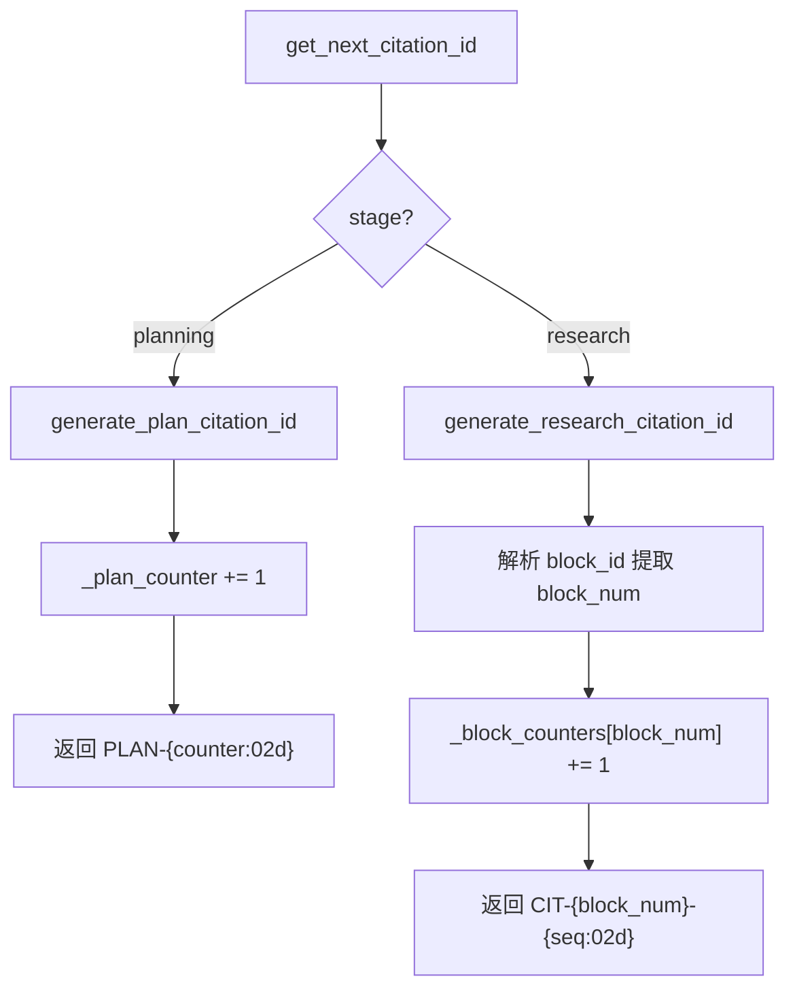
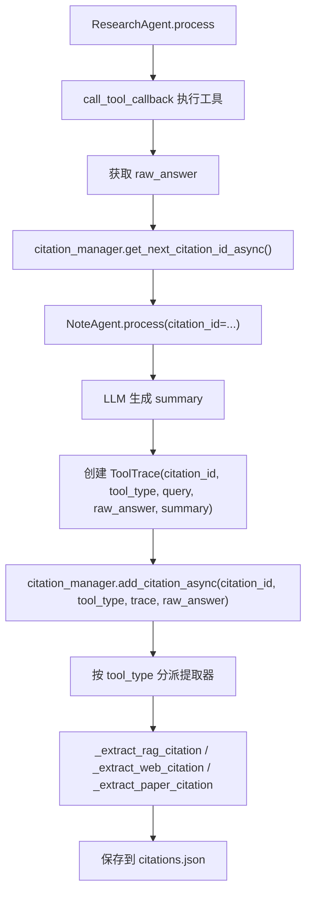
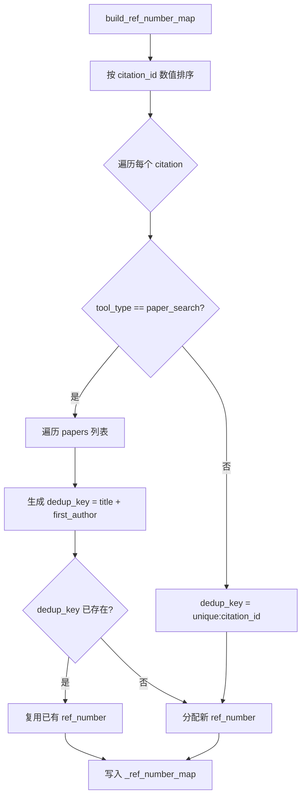

# PD-73.01 DeepTutor — 学术引用全链路管理方案

> 文档编号：PD-73.01
> 来源：DeepTutor `src/agents/research/utils/citation_manager.py`
> GitHub：https://github.com/HKUDS/DeepTutor.git
> 问题域：PD-73 引用管理 Citation Management
> 状态：可复用方案

---

## 第 1 章 问题与动机

### 1.1 核心问题

在 Agent 驱动的深度研究系统中，一次研究任务可能涉及数十次工具调用（RAG 检索、论文搜索、网页搜索、代码执行等），每次调用都会产生需要引用的信息源。如果没有统一的引用管理机制，最终报告将面临以下问题：

1. **引用 ID 冲突**：多个并行研究块同时生成引用，ID 可能重复
2. **引用链断裂**：工具调用结果与最终报告中的引用标记无法对应
3. **引用格式不一致**：不同工具类型（论文、网页、RAG）的引用格式各异
4. **去重缺失**：同一篇论文被多次检索时产生重复引用编号
5. **并发安全**：并行研究模式下多个协程同时写入引用数据导致竞态条件

### 1.2 DeepTutor 的解法概述

DeepTutor 实现了一套三层引用管理架构，覆盖从 ID 生成到报告渲染的完整链路：

1. **CitationManager（研究层）**：统一管理全局引用 ID，支持 PLAN-XX（规划阶段）和 CIT-X-XX（研究阶段）两种格式，通过 `asyncio.Lock` 保证并发安全（`src/agents/research/utils/citation_manager.py:47`）
2. **ToolTrace（数据层）**：每次工具调用生成一个 ToolTrace 对象，携带 citation_id 字段，记录完整的查询-结果-摘要链（`src/agents/research/data_structures.py:41-52`）
3. **ReportingAgent（渲染层）**：构建 ref_number_map 将 citation_id 映射为连续编号，自动在报告中插入 `[[N]](#ref-N)` 格式的可点击内联引用，并生成 References 章节（`src/agents/research/agents/reporting_agent.py:552-593`）
4. **CitationMemory（Solve 层）**：Solve 阶段的独立引用管理，使用 Singleton 模式和 `[prefix-N]` 格式（`src/agents/solve/memory/citation_memory.py:45-100`）
5. **双层引用验证**：CitationManager 提供 `validate_citation_references` 和 `fix_invalid_citations` 方法，ReportingAgent 在报告后处理阶段执行 `_validate_and_fix_citations`，确保所有内联引用指向有效的 References 条目（`src/agents/research/utils/citation_manager.py:176-233`）

### 1.3 设计思想

| 设计原则 | 具体实现 | 理由 | 替代方案 |
|----------|----------|------|----------|
| 单一数据源 | CitationManager 是引用 ID 的唯一生成者 | 避免多处生成 ID 导致冲突 | 各 Agent 自行生成（易冲突） |
| 阶段化 ID 格式 | PLAN-XX / CIT-X-XX 区分规划与研究阶段 | 从 ID 即可判断引用来源阶段 | 统一递增编号（丢失阶段信息） |
| 异步锁保护 | asyncio.Lock 包裹 ID 生成和写入 | 并行研究模式下多协程安全 | threading.Lock（不适合 asyncio） |
| 工具类型分派 | add_citation 按 tool_type 分派到不同提取器 | 不同工具的引用元数据结构不同 | 统一格式（丢失论文作者等信息） |
| 延迟编号映射 | ref_number_map 在报告生成时才构建 | 研究阶段 ID 可能不连续，报告需要连续编号 | 实时编号（并行时编号跳跃） |
| 论文去重 | 按 title + first_author 去重 | 同一论文多次检索只分配一个编号 | 不去重（引用列表冗余） |

---

## 第 2 章 源码实现分析

### 2.1 架构概览

DeepTutor 的引用管理系统横跨三个层次，贯穿整个研究流水线：

```
┌─────────────────────────────────────────────────────────────────┐
│                    ResearchPipeline                              │
│                                                                 │
│  Phase 1: Planning                                              │
│  ┌──────────────┐    ┌──────────────────┐                       │
│  │DecomposeAgent│───→│ CitationManager  │ generate_plan_id()    │
│  └──────────────┘    │  (PLAN-XX IDs)   │                       │
│                      └────────┬─────────┘                       │
│                               │                                 │
│  Phase 2: Researching         │ (shared instance)               │
│  ┌──────────────┐    ┌───────▼──────────┐    ┌──────────────┐  │
│  │ResearchAgent │───→│ CitationManager  │───→│  NoteAgent   │  │
│  │ (per block)  │    │ (CIT-X-XX IDs)  │    │ (ToolTrace)  │  │
│  └──────────────┘    │ + asyncio.Lock   │    └──────────────┘  │
│                      └────────┬─────────┘                       │
│                               │                                 │
│  Phase 3: Reporting           │ (read citations)                │
│  ┌──────────────┐    ┌───────▼──────────┐                       │
│  │ReportingAgent│───→│build_ref_number  │                       │
│  │              │    │_map() → [N]      │                       │
│  │ inline refs  │    │ + References     │                       │
│  └──────────────┘    └──────────────────┘                       │
│                                                                 │
│  Solve Stage (独立)                                              │
│  ┌──────────────┐    ┌──────────────────┐                       │
│  │ SolveAgent   │───→│ CitationMemory   │ [prefix-N] format    │
│  │              │    │ (Singleton)      │                       │
│  └──────────────┘    └──────────────────┘                       │
└─────────────────────────────────────────────────────────────────┘
```

### 2.2 核心实现

#### 2.2.1 引用 ID 生成：双格式分阶段



对应源码 `src/agents/research/utils/citation_manager.py:51-100`：

```python
class CitationManager:
    def __init__(self, research_id: str, cache_dir: Path | None = None):
        self.research_id = research_id
        self._citations: dict[str, dict[str, Any]] = {}
        self._plan_counter = 0          # PLAN-XX 格式计数器
        self._block_counters: dict[str, int] = {}  # CIT-X-XX 格式计数器
        self._ref_number_map: dict[str, int] = {}  # 引用编号映射
        self._lock = asyncio.Lock()     # 并发安全锁

    def generate_plan_citation_id(self) -> str:
        self._plan_counter += 1
        return f"PLAN-{self._plan_counter:02d}"

    def generate_research_citation_id(self, block_id: str) -> str:
        block_num = int(block_id.split("_")[1]) if "_" in block_id else 0
        block_key = str(block_num)
        if block_key not in self._block_counters:
            self._block_counters[block_key] = 0
        self._block_counters[block_key] += 1
        return f"CIT-{block_num}-{self._block_counters[block_key]:02d}"
```

CIT-X-XX 格式中 X 是 block 编号，XX 是该 block 内的序列号。这样从 citation_id 就能反推出引用来自哪个研究块。

#### 2.2.2 工具调用引用链：ResearchAgent → NoteAgent → CitationManager



对应源码 `src/agents/research/agents/research_agent.py:628-687`：

```python
# Step 4: 从 CitationManager 获取引用 ID（支持同步/异步）
if hasattr(citation_manager, "get_next_citation_id_async"):
    citation_id = await citation_manager.get_next_citation_id_async(
        stage="research", block_id=topic_block.block_id
    )
else:
    citation_id = citation_manager.get_next_citation_id(
        stage="research", block_id=topic_block.block_id
    )

# Step 5: NoteAgent 用该 citation_id 生成摘要并创建 ToolTrace
trace = await note_agent.process(
    tool_type=tool_type, query=query, raw_answer=raw_answer,
    citation_id=citation_id, topic=topic_block.sub_topic,
)
topic_block.add_tool_trace(trace)

# Step 6: 将引用信息添加到 CitationManager
citation_manager.add_citation(
    citation_id=citation_id, tool_type=tool_type,
    tool_trace=trace, raw_answer=raw_answer,
)
```

#### 2.2.3 引用编号映射与去重



对应源码 `src/agents/research/utils/citation_manager.py:640-708`：

```python
def build_ref_number_map(self) -> dict[str, int]:
    sorted_citation_ids = sorted(
        self._citations.keys(), key=self._extract_citation_sort_key
    )
    seen_keys: dict[str, int] = {}
    ref_idx = 0
    ref_map: dict[str, int] = {}

    for citation_id in sorted_citation_ids:
        citation = self._citations.get(citation_id)
        tool_type = citation.get("tool_type", "").lower()

        if tool_type == "paper_search":
            papers = citation.get("papers", [])
            for paper_idx, paper in enumerate(papers):
                dedup_key = self._get_citation_dedup_key(citation, paper)
                if dedup_key in seen_keys:
                    ref_map[citation_id] = seen_keys[dedup_key]
                else:
                    ref_idx += 1
                    seen_keys[dedup_key] = ref_idx
                    ref_map[citation_id] = ref_idx
        else:
            dedup_key = self._get_citation_dedup_key(citation)
            ref_idx += 1
            ref_map[citation_id] = ref_idx

    self._ref_number_map = ref_map
    return ref_map
```

### 2.3 实现细节

#### 并发安全的异步包装器

在并行研究模式下，ResearchPipeline 创建 `AsyncCitationManagerWrapper` 包装原始 CitationManager，将所有写操作路由到 `_async` 方法（`src/agents/research/research_pipeline.py:854-867`）：

```python
class AsyncCitationManagerWrapper:
    def __init__(self, cm):
        self._cm = cm

    async def add_citation(self, citation_id, tool_type, tool_trace, raw_answer):
        return await self._cm.add_citation_async(
            citation_id, tool_type, tool_trace, raw_answer
        )

    def __getattr__(self, name):
        return getattr(self._cm, name)
```

底层 `add_citation_async` 使用 `asyncio.Lock` 保护（`src/agents/research/utils/citation_manager.py:776-796`）：

```python
async def add_citation_async(self, citation_id, tool_type, tool_trace, raw_answer):
    async with self._lock:
        return self.add_citation(citation_id, tool_type, tool_trace, raw_answer)
```

#### 引用持久化与恢复

CitationManager 在每次 `add_citation` 后自动保存到 `citations.json`，包含计数器状态（`src/agents/research/utils/citation_manager.py:159-174`）。加载时优先从 `counters` 字段恢复，若不存在则从已有 citation_id 反推计数器值（`_restore_counters_from_citations`），确保中断恢复后 ID 不冲突。

#### 报告内联引用后处理

ReportingAgent 在报告写完后执行两步后处理（`src/agents/research/agents/reporting_agent.py:1199-1212`）：
1. `_convert_citation_format`：将 LLM 输出的 `[N]` 格式转换为 `[[N]](#ref-N)` 可点击链接
2. `_validate_and_fix_citations`：验证所有引用编号是否在 ref_number_map 中存在，移除无效引用

#### Solve 阶段的独立引用系统

Solve 阶段使用独立的 `CitationMemory`（`src/agents/solve/memory/citation_memory.py:45-100`），采用 `[prefix-N]` 格式（如 `[rag-1]`、`[web-2]`），通过 `_get_tool_prefix` 将工具类型映射为前缀。与 Research 阶段的 CitationManager 完全独立，各自管理各自的引用空间。


---

## 第 3 章 迁移指南

### 3.1 迁移清单

**阶段 1：核心引用管理器（必须）**

- [ ] 实现 `CitationManager` 类，包含双格式 ID 生成（或自定义格式）
- [ ] 实现 `asyncio.Lock` 保护的异步方法
- [ ] 实现 JSON 持久化与计数器恢复逻辑
- [ ] 实现 `add_citation` 按工具类型分派提取引用元数据

**阶段 2：数据结构集成（必须）**

- [ ] 在工具调用记录结构中添加 `citation_id` 字段（类似 ToolTrace）
- [ ] 确保每次工具调用前先从 CitationManager 获取 ID
- [ ] 工具调用完成后将引用信息回写 CitationManager

**阶段 3：报告渲染（推荐）**

- [ ] 实现 `build_ref_number_map` 将 citation_id 映射为连续编号
- [ ] 实现论文去重逻辑（按 title + first_author）
- [ ] 实现内联引用格式转换（`[N]` → `[[N]](#ref-N)`）
- [ ] 实现引用验证与无效引用清理

**阶段 4：并行安全（按需）**

- [ ] 实现 `AsyncCitationManagerWrapper` 包装器
- [ ] 确保并行模式下所有写操作经过 Lock

### 3.2 适配代码模板

以下是一个可直接复用的最小化引用管理器：

```python
import asyncio
import json
from pathlib import Path
from typing import Any
from dataclasses import dataclass, field
from datetime import datetime


@dataclass
class ToolTrace:
    """工具调用追踪记录"""
    tool_id: str
    citation_id: str
    tool_type: str
    query: str
    raw_answer: str
    summary: str
    timestamp: str = field(default_factory=lambda: datetime.now().isoformat())


class CitationManager:
    """引用管理器 — 从 DeepTutor 提炼的最小可用版本"""

    def __init__(self, task_id: str, cache_dir: Path):
        self.task_id = task_id
        self.cache_dir = Path(cache_dir)
        self.cache_dir.mkdir(parents=True, exist_ok=True)
        self.citations_file = self.cache_dir / "citations.json"

        self._citations: dict[str, dict[str, Any]] = {}
        self._counter = 0
        self._block_counters: dict[str, int] = {}
        self._ref_number_map: dict[str, int] = {}
        self._lock = asyncio.Lock()

        self._load()

    # ---- ID 生成 ----
    def next_id(self, block_id: str = "") -> str:
        """生成下一个引用 ID（CIT-{block}-{seq} 格式）"""
        block_num = "0"
        if block_id and "_" in block_id:
            try:
                block_num = block_id.split("_")[1]
            except (IndexError, ValueError):
                pass
        if block_num not in self._block_counters:
            self._block_counters[block_num] = 0
        self._block_counters[block_num] += 1
        return f"CIT-{block_num}-{self._block_counters[block_num]:02d}"

    async def next_id_async(self, block_id: str = "") -> str:
        async with self._lock:
            return self.next_id(block_id)

    # ---- 引用存储 ----
    def add(self, citation_id: str, tool_type: str, trace: ToolTrace, raw: str) -> bool:
        self._citations[citation_id] = {
            "citation_id": citation_id,
            "tool_type": tool_type,
            "query": trace.query,
            "summary": trace.summary,
            "timestamp": trace.timestamp,
        }
        self._save()
        return True

    async def add_async(self, citation_id: str, tool_type: str, trace: ToolTrace, raw: str) -> bool:
        async with self._lock:
            return self.add(citation_id, tool_type, trace, raw)

    # ---- 编号映射 ----
    def build_ref_map(self) -> dict[str, int]:
        """构建 citation_id → 连续编号映射"""
        def sort_key(cid: str):
            parts = cid.replace("CIT-", "").split("-")
            try:
                return (int(parts[0]), int(parts[1]))
            except (ValueError, IndexError):
                return (999, 999)

        sorted_ids = sorted(self._citations.keys(), key=sort_key)
        self._ref_number_map = {cid: idx + 1 for idx, cid in enumerate(sorted_ids)}
        return self._ref_number_map

    def get_ref(self, citation_id: str) -> int:
        if not self._ref_number_map:
            self.build_ref_map()
        return self._ref_number_map.get(citation_id, 0)

    # ---- 持久化 ----
    def _save(self):
        data = {
            "task_id": self.task_id,
            "citations": self._citations,
            "counters": {"block_counters": self._block_counters},
        }
        with open(self.citations_file, "w", encoding="utf-8") as f:
            json.dump(data, f, ensure_ascii=False, indent=2)

    def _load(self):
        if self.citations_file.exists():
            with open(self.citations_file, encoding="utf-8") as f:
                data = json.load(f)
            self._citations = data.get("citations", {})
            counters = data.get("counters", {})
            self._block_counters = counters.get("block_counters", {})
```

### 3.3 适用场景

| 场景 | 适用度 | 说明 |
|------|--------|------|
| 多工具 Agent 研究系统 | ⭐⭐⭐ | 核心场景，多种工具调用需要统一引用追踪 |
| 学术论文生成 Agent | ⭐⭐⭐ | 论文去重、APA 格式化、内联引用是刚需 |
| RAG + 搜索混合系统 | ⭐⭐⭐ | 不同来源的引用需要统一编号和格式 |
| 并行多 Agent 研究 | ⭐⭐⭐ | asyncio.Lock 并发安全是关键 |
| 单工具简单问答 | ⭐ | 过度设计，直接在回答中标注来源即可 |
| 实时对话系统 | ⭐ | 对话不需要 References 章节 |

---

## 第 4 章 测试用例

```python
import asyncio
import json
import tempfile
from pathlib import Path
from dataclasses import dataclass, field
from datetime import datetime
from typing import Any
import pytest


@dataclass
class MockToolTrace:
    """测试用 ToolTrace"""
    tool_id: str = "tool_1"
    citation_id: str = ""
    tool_type: str = "rag_hybrid"
    query: str = "test query"
    raw_answer: str = '{"answer": "test"}'
    summary: str = "test summary"
    timestamp: str = field(default_factory=lambda: datetime.now().isoformat())


class TestCitationManager:
    """CitationManager 核心功能测试"""

    def setup_method(self):
        self.tmp_dir = tempfile.mkdtemp()
        # 使用 DeepTutor 原始类的接口模拟
        self.cache_dir = Path(self.tmp_dir)

    def test_plan_citation_id_generation(self):
        """测试规划阶段 ID 生成：PLAN-XX 格式"""
        from citation_manager import CitationManager  # 适配你的导入路径
        cm = CitationManager("test_research", self.cache_dir)
        id1 = cm.generate_plan_citation_id()
        id2 = cm.generate_plan_citation_id()
        assert id1 == "PLAN-01"
        assert id2 == "PLAN-02"

    def test_research_citation_id_generation(self):
        """测试研究阶段 ID 生成：CIT-X-XX 格式"""
        from citation_manager import CitationManager
        cm = CitationManager("test_research", self.cache_dir)
        id1 = cm.generate_research_citation_id("block_3")
        id2 = cm.generate_research_citation_id("block_3")
        id3 = cm.generate_research_citation_id("block_5")
        assert id1 == "CIT-3-01"
        assert id2 == "CIT-3-02"
        assert id3 == "CIT-5-01"

    def test_add_citation_and_persistence(self):
        """测试引用添加与 JSON 持久化"""
        from citation_manager import CitationManager
        cm = CitationManager("test_research", self.cache_dir)
        trace = MockToolTrace(citation_id="CIT-1-01")
        result = cm.add_citation("CIT-1-01", "rag_hybrid", trace, '{"answer": "test"}')
        assert result is True
        assert cm.citation_exists("CIT-1-01")
        # 验证持久化
        assert cm.citations_file.exists()
        with open(cm.citations_file) as f:
            data = json.load(f)
        assert "CIT-1-01" in data["citations"]

    def test_counter_restoration(self):
        """测试中断恢复后计数器正确恢复"""
        from citation_manager import CitationManager
        cm1 = CitationManager("test_research", self.cache_dir)
        cm1.generate_research_citation_id("block_1")  # CIT-1-01
        cm1.generate_research_citation_id("block_1")  # CIT-1-02
        trace = MockToolTrace(citation_id="CIT-1-01")
        cm1.add_citation("CIT-1-01", "rag_hybrid", trace, "{}")
        # 模拟重启：创建新实例，从文件恢复
        cm2 = CitationManager("test_research", self.cache_dir)
        id_new = cm2.generate_research_citation_id("block_1")
        # 应该从 02 之后继续（至少不冲突）
        assert id_new != "CIT-1-01"
        assert id_new != "CIT-1-02"

    def test_ref_number_map_deduplication(self):
        """测试论文去重：同一论文只分配一个编号"""
        from citation_manager import CitationManager
        cm = CitationManager("test_research", self.cache_dir)
        # 模拟两次检索到同一篇论文
        cm._citations["CIT-1-01"] = {
            "tool_type": "paper_search",
            "papers": [{"title": "Attention Is All You Need", "authors": "Vaswani et al."}],
        }
        cm._citations["CIT-2-01"] = {
            "tool_type": "paper_search",
            "papers": [{"title": "Attention Is All You Need", "authors": "Vaswani et al."}],
        }
        ref_map = cm.build_ref_number_map()
        assert ref_map["CIT-1-01"] == ref_map["CIT-2-01"]  # 同一编号

    @pytest.mark.asyncio
    async def test_concurrent_id_generation(self):
        """测试并发安全：多协程同时生成 ID 不冲突"""
        from citation_manager import CitationManager
        cm = CitationManager("test_research", self.cache_dir)
        ids = []

        async def gen_id(block_id):
            cid = await cm.get_next_citation_id_async(stage="research", block_id=block_id)
            ids.append(cid)

        tasks = [gen_id("block_1") for _ in range(20)]
        await asyncio.gather(*tasks)
        assert len(ids) == 20
        assert len(set(ids)) == 20  # 所有 ID 唯一

    def test_validate_citation_references(self):
        """测试引用验证：识别无效引用"""
        from citation_manager import CitationManager
        cm = CitationManager("test_research", self.cache_dir)
        cm._citations["CIT-1-01"] = {"tool_type": "rag_hybrid"}
        text = "根据研究 [[CIT-1-01]] 和 [[CIT-9-99]] 的结果"
        result = cm.validate_citation_references(text)
        assert result["is_valid"] is False
        assert "CIT-1-01" in result["valid_citations"]
        assert "CIT-9-99" in result["invalid_citations"]

    def test_format_paper_citation(self):
        """测试论文引用格式化"""
        from citation_manager import CitationManager
        cm = CitationManager("test_research", self.cache_dir)
        cm._citations["CIT-1-01"] = {
            "tool_type": "paper_search",
            "title": "Attention Is All You Need",
            "authors": "Vaswani, A. et al.",
            "year": "2017",
            "url": "https://arxiv.org/abs/1706.03762",
            "arxiv_id": "1706.03762",
        }
        formatted = cm.format_citation_for_report("CIT-1-01")
        assert "Vaswani" in formatted
        assert "2017" in formatted
        assert "Attention" in formatted
```


---

## 第 5 章 跨域关联

| 关联域 | 关系类型 | 说明 |
|--------|----------|------|
| PD-02 多 Agent 编排 | 依赖 | 引用管理需要与多 Agent 编排协同：ResearchAgent 生成引用，ReportingAgent 消费引用，编排层负责传递 CitationManager 实例 |
| PD-06 记忆持久化 | 协同 | CitationManager 的 JSON 持久化与 InvestigateMemory 的 knowledge_chain 共享 cite_id 字段，两者通过 cite_id 关联 |
| PD-07 质量检查 | 协同 | ReportingAgent 的引用验证（validate_citation_references）本质上是质量检查的一部分，确保报告引用完整性 |
| PD-08 搜索与检索 | 依赖 | 引用管理的输入来自搜索系统（RAG、Web Search、Paper Search），不同搜索工具产生不同格式的引用元数据 |
| PD-10 中间件管道 | 协同 | ToolTrace 作为管道中的数据载体，在 NoteAgent → CitationManager → ReportingAgent 之间流转 |
| PD-11 可观测性 | 协同 | citations.json 持久化文件本身就是可观测性数据，记录了每次工具调用的引用链 |

---

## 第 6 章 来源文件索引

| 文件 | 行范围 | 关键实现 |
|------|--------|----------|
| `src/agents/research/utils/citation_manager.py` | L19-L799 | CitationManager 完整实现：ID 生成、引用存储、编号映射、去重、验证、异步方法 |
| `src/agents/research/data_structures.py` | L40-L171 | ToolTrace 数据结构：citation_id 字段、raw_answer 截断、序列化 |
| `src/agents/research/agents/research_agent.py` | L628-L687 | ResearchAgent 中的引用链：获取 ID → NoteAgent 生成摘要 → 回写 CitationManager |
| `src/agents/research/agents/reporting_agent.py` | L29-L1333 | ReportingAgent：ref_number_map 构建、内联引用转换、References 生成、引用验证 |
| `src/agents/research/agents/note_agent.py` | L43-L96 | NoteAgent.process：接收 citation_id 参数，创建携带引用 ID 的 ToolTrace |
| `src/agents/research/agents/decompose_agent.py` | L57-L61 | DecomposeAgent：set_citation_manager，规划阶段引用 |
| `src/agents/solve/memory/citation_memory.py` | L45-L354 | CitationMemory：Solve 阶段独立引用系统，[prefix-N] 格式，Markdown 格式化 |
| `src/agents/solve/solve_loop/citation_manager.py` | L10-L75 | Solve 阶段 CitationManager：Singleton 模式，[N] 格式分配 |
| `src/agents/solve/memory/investigate_memory.py` | L14-L43 | KnowledgeItem：cite_id 字段，与 CitationMemory 关联 |
| `src/agents/research/research_pipeline.py` | L147, L652-L654, L854-L867, L1192 | Pipeline 集成：CitationManager 初始化、传递给各 Agent、AsyncWrapper |

---

## 第 7 章 横向对比维度

```json comparison_data
{
  "project": "DeepTutor",
  "dimensions": {
    "ID格式": "双格式：PLAN-XX（规划）+ CIT-X-XX（研究），从ID可反推阶段和block",
    "并发安全": "asyncio.Lock + AsyncCitationManagerWrapper 包装器",
    "去重机制": "论文按 title+first_author 去重，其他类型不去重",
    "引用渲染": "build_ref_number_map 延迟映射 + [[N]](#ref-N) 可点击链接 + 后处理验证",
    "持久化": "每次 add_citation 自动保存 JSON，含计数器状态，支持中断恢复",
    "多工具适配": "按 tool_type 分派5种提取器（RAG/Web/Paper/Code/Generic），保留各类型元数据"
  }
}
```

### 域元数据补充

```json domain_metadata
{
  "solution_summary": "DeepTutor 用 CitationManager 双格式ID(PLAN-XX/CIT-X-XX) + asyncio.Lock 并发安全 + build_ref_number_map 延迟编号映射，实现从工具调用到报告内联引用的全链路管理",
  "description": "覆盖引用ID生成、持久化恢复、编号去重映射、报告渲染后处理的完整引用生命周期",
  "sub_problems": [
    "引用编号的延迟映射与论文去重",
    "中断恢复后引用计数器的正确续接",
    "多阶段引用系统的独立管理（Research vs Solve）"
  ],
  "best_practices": [
    "延迟构建ref_number_map确保报告编号连续",
    "JSON持久化含计数器状态支持中断恢复",
    "AsyncWrapper模式将同步管理器适配为并发安全版本"
  ]
}
```

