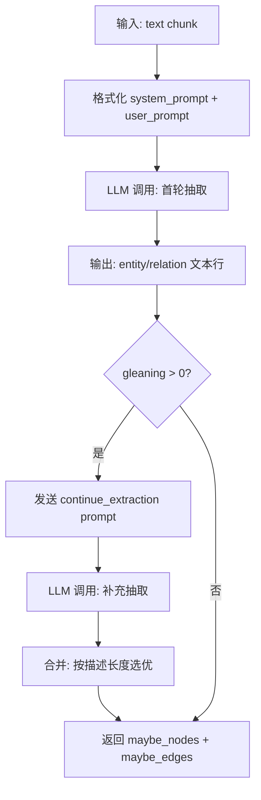
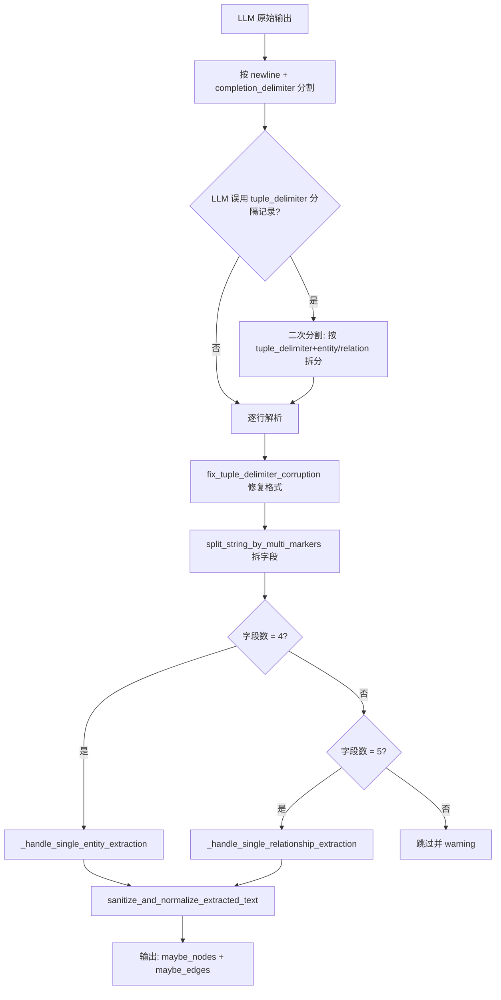
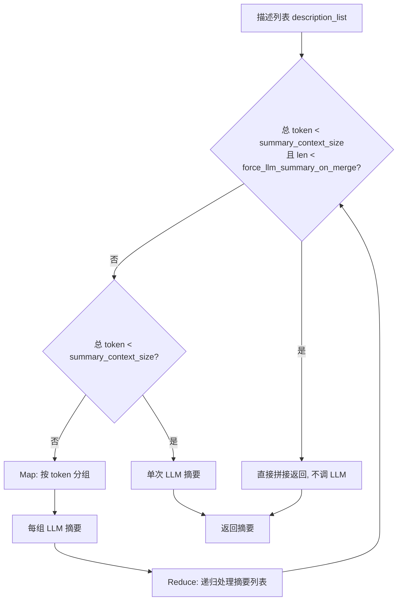

# PD-74.01 LightRAG — LLM 驱动的实体/关系抽取与知识图谱构建

> 文档编号：PD-74.01
> 来源：LightRAG `lightrag/operate.py`, `lightrag/prompt.py`, `lightrag/types.py`
> GitHub：https://github.com/HKUDS/LightRAG.git
> 问题域：PD-74 知识图谱构建 Knowledge Graph Construction
> 状态：可复用方案

---

## 第 1 章 问题与动机

### 1.1 核心问题

RAG 系统通常依赖向量检索获取相关文档片段，但纯向量检索无法捕捉实体间的结构化关系。当用户提问涉及多跳推理（如"A 公司的 CEO 毕业于哪所大学？"）时，单纯的 chunk 检索往往无法跨越多个文档片段建立关联。

知识图谱（KG）通过将非结构化文本转化为 entity-relation 三元组，提供了结构化的知识表示。但从文本中自动构建高质量 KG 面临三大挑战：

1. **抽取质量**：LLM 输出格式不稳定，需要鲁棒的解析和容错
2. **增量合并**：同一实体/关系可能在多个 chunk 中被重复抽取，需要去重和描述合并
3. **规模化处理**：大量文档的并行抽取需要异步控制和缓存机制

### 1.2 LightRAG 的解法概述

LightRAG 实现了一套完整的 LLM 驱动 KG 构建管线：

1. **结构化 Prompt 模板**：精心设计的 system/user prompt 约束 LLM 输出为 `entity<|#|>name<|#|>type<|#|>description` 格式，使用自定义 tuple_delimiter 分隔字段（`lightrag/prompt.py:11-61`）
2. **Gleaning 多轮补充抽取**：首轮抽取后，发送 continue_extraction prompt 让 LLM 补充遗漏的实体和关系，通过描述长度对比选择更优版本（`lightrag/operate.py:2884-2960`）
3. **两阶段并发合并**：`merge_nodes_and_edges` 先并发处理所有实体（Phase 1），再并发处理所有关系（Phase 2），使用 keyed_lock 保证同名实体的并发安全（`lightrag/operate.py:2411-2710`）
4. **Map-Reduce 描述摘要**：当同一实体的描述片段过多时，采用 map-reduce 策略分组摘要再递归合并，避免超出 LLM 上下文窗口（`lightrag/operate.py:165-294`）
5. **双存储同步**：每个实体/关系同时写入 Graph Storage（结构化查询）和 Vector DB（语义检索），实现混合检索能力（`lightrag/operate.py:1849-1883`）

### 1.3 设计思想

| 设计原则 | 具体实现 | 理由 | 替代方案 |
|----------|----------|------|----------|
| Delimiter 协议 | 使用 `<\|#\|>` 作为字段分隔符，`<\|COMPLETE\|>` 作为完成标记 | 避免与自然语言内容冲突，便于正则解析 | JSON 输出（解析成本高，LLM 容易生成非法 JSON） |
| Gleaning 补充抽取 | 首轮抽取后追加 continue_extraction prompt | 单轮抽取遗漏率高，二轮可补充 10-30% 实体 | 增大单轮 prompt 上下文（成本更高） |
| 两阶段合并 | 先实体后关系，关系阶段可自动补建缺失实体节点 | 保证关系的两端节点一定存在 | 单阶段混合处理（可能出现悬挂边） |
| Map-Reduce 摘要 | 描述列表按 token 分组，每组 LLM 摘要后递归 | 支持任意数量的描述片段合并 | 简单截断拼接（丢失信息） |
| 频率投票选类型 | 同一实体多次抽取的 type 取出现次数最多的 | 抵消 LLM 单次抽取的类型波动 | 取第一次抽取结果（不稳定） |

---

## 第 2 章 源码实现分析

### 2.1 架构概览

LightRAG 的 KG 构建管线从文档分块开始，经过 LLM 抽取、解析、合并，最终写入图存储和向量库：

```
┌──────────────┐     ┌──────────────────┐     ┌─────────────────┐
│  Document    │────→│  chunking_by_    │────→│  extract_       │
│  Input       │     │  token_size      │     │  entities       │
└──────────────┘     └──────────────────┘     └────────┬────────┘
                                                       │
                     ┌─────────────────────────────────┘
                     ▼
        ┌────────────────────────┐
        │  _process_single_      │ ← 每个 chunk 独立处理
        │  content               │
        │  ┌──────────────────┐  │
        │  │ LLM 首轮抽取     │  │
        │  │ (entity_extract) │  │
        │  └────────┬─────────┘  │
        │           ▼            │
        │  ┌──────────────────┐  │
        │  │ Gleaning 补充    │  │  ← entity_extract_max_gleaning > 0
        │  │ (continue_extract)│  │
        │  └────────┬─────────┘  │
        │           ▼            │
        │  ┌──────────────────┐  │
        │  │ _process_        │  │
        │  │ extraction_result│  │  ← 解析 LLM 输出为 nodes/edges
        │  └──────────────────┘  │
        └────────────┬───────────┘
                     ▼
        ┌────────────────────────┐
        │  merge_nodes_and_edges │
        │  ┌──────────────────┐  │
        │  │ Phase 1: 实体合并 │  │  ← _merge_nodes_then_upsert
        │  └────────┬─────────┘  │
        │           ▼            │
        │  ┌──────────────────┐  │
        │  │ Phase 2: 关系合并 │  │  ← _merge_edges_then_upsert
        │  └────────┬─────────┘  │
        │           ▼            │
        │  ┌──────────────────┐  │
        │  │ Phase 3: 索引更新 │  │  ← full_entities/relations storage
        │  └──────────────────┘  │
        └────────────────────────┘
                     │
          ┌──────────┴──────────┐
          ▼                     ▼
   ┌─────────────┐     ┌──────────────┐
   │ Graph Store  │     │ Vector DB    │
   │ (Neo4j etc.) │     │ (embedding)  │
   └─────────────┘     └──────────────┘
```

### 2.2 核心实现

#### 2.2.1 Prompt 驱动的实体/关系抽取

LightRAG 使用精心设计的 prompt 模板将 LLM 输出约束为固定格式的文本行。



对应源码 `lightrag/prompt.py:11-61`（system prompt 核心片段）：

```python
PROMPTS["entity_extraction_system_prompt"] = """---Role---
You are a Knowledge Graph Specialist responsible for extracting entities
and relationships from the input text.

---Instructions---
1.  **Entity Extraction & Output:**
    *   Format: `entity{tuple_delimiter}entity_name{tuple_delimiter}entity_type
        {tuple_delimiter}entity_description`

2.  **Relationship Extraction & Output:**
    *   Format: `relation{tuple_delimiter}source_entity{tuple_delimiter}target_entity
        {tuple_delimiter}relationship_keywords{tuple_delimiter}relationship_description`

3.  **Delimiter Usage Protocol:**
    *   The `{tuple_delimiter}` is a complete, atomic marker and
        **must not be filled with content**.
...
8.  **Completion Signal:** Output the literal string `{completion_delimiter}`
    only after all entities and relationships have been completely extracted.
"""
```

#### 2.2.2 抽取结果解析与容错

LLM 输出并不总是严格遵循格式。`_process_extraction_result` 实现了多层容错解析。



对应源码 `lightrag/operate.py:915-1037`：

```python
async def _process_extraction_result(
    result: str,
    chunk_key: str,
    timestamp: int,
    file_path: str = "unknown_source",
    tuple_delimiter: str = "<|#|>",
    completion_delimiter: str = "<|COMPLETE|>",
) -> tuple[dict, dict]:
    maybe_nodes = defaultdict(list)
    maybe_edges = defaultdict(list)

    # Split LLM output to records by "\n"
    records = split_string_by_multi_markers(
        result, ["\n", completion_delimiter, completion_delimiter.lower()],
    )

    # Fix LLM format error: tuple_delimiter used as record separator
    fixed_records = []
    for record in records:
        record = record.strip()
        if record is None:
            continue
        entity_records = split_string_by_multi_markers(
            record, [f"{tuple_delimiter}entity{tuple_delimiter}"]
        )
        # ... 二次拆分逻辑 ...

    for record in fixed_records:
        # Fix delimiter corruption
        delimiter_core = tuple_delimiter[2:-2]  # Extract "#" from "<|#|>"
        record = fix_tuple_delimiter_corruption(record, delimiter_core, tuple_delimiter)
        record_attributes = split_string_by_multi_markers(record, [tuple_delimiter])

        entity_data = await _handle_single_entity_extraction(
            record_attributes, chunk_key, timestamp, file_path
        )
        if entity_data is not None:
            maybe_nodes[entity_data["entity_name"]].append(entity_data)
            continue

        relationship_data = await _handle_single_relationship_extraction(
            record_attributes, chunk_key, timestamp, file_path
        )
        if relationship_data is not None:
            maybe_edges[(relationship_data["src_id"], relationship_data["tgt_id"])].append(
                relationship_data
            )
    return dict(maybe_nodes), dict(maybe_edges)
```

### 2.3 实现细节

#### 2.3.1 Gleaning 多轮补充抽取

Gleaning 是 LightRAG 提升抽取召回率的关键机制。首轮抽取完成后，将首轮的 user prompt + LLM response 作为 history，再发送 `entity_continue_extraction_user_prompt`，要求 LLM 补充遗漏或格式错误的实体/关系。

核心逻辑在 `lightrag/operate.py:2884-2960`：

- 首轮结果与 gleaning 结果按 entity_name/edge_key 对比
- 同名实体：比较描述长度，保留更长（更详细）的版本
- 新实体/关系：直接追加到结果集
- Token 溢出保护：gleaning 前计算 system_prompt + history + user_prompt 的总 token 数，超过 `max_extract_input_tokens` 则跳过

#### 2.3.2 两阶段并发合并（merge_nodes_and_edges）

`merge_nodes_and_edges`（`lightrag/operate.py:2411-2710`）是 KG 构建的核心合并引擎：

**Phase 1 — 实体合并**：
- 收集所有 chunk 的抽取结果，按 entity_name 聚合
- 对每个 entity_name 并发调用 `_merge_nodes_then_upsert`
- 使用 `get_storage_keyed_lock([entity_name])` 保证同名实体的并发安全
- 合并逻辑（`lightrag/operate.py:1598-1883`）：
  1. 从 Graph Storage 读取已有节点数据
  2. 合并 source_ids（去重 + 限制数量）
  3. 实体类型取频率最高的（Counter 投票）
  4. 描述列表去重后按 timestamp 排序
  5. 调用 `_handle_entity_relation_summary` 做 Map-Reduce 摘要
  6. 同时写入 Graph Storage 和 Vector DB

**Phase 2 — 关系合并**：
- 按 `tuple(sorted(edge_key))` 聚合（无向图，排序保证一致性）
- 并发调用 `_merge_edges_then_upsert`
- 关系合并额外处理：权重累加、关键词集合合并
- 如果关系两端节点不存在，自动创建占位节点

#### 2.3.3 Map-Reduce 描述摘要

`_handle_entity_relation_summary`（`lightrag/operate.py:165-294`）处理同一实体/关系的多条描述合并：



关键配置参数：
- `force_llm_summary_on_merge`（默认 ≥ 3）：描述数量低于此值且 token 在限制内时，直接拼接不调 LLM
- `summary_context_size`：单次摘要的最大输入 token 数
- `summary_max_tokens`：摘要输出的最大 token 数


---

## 第 3 章 迁移指南

### 3.1 迁移清单

**阶段 1：Prompt 模板与抽取解析（核心，1-2 天）**

- [ ] 定义 tuple_delimiter 和 completion_delimiter 常量
- [ ] 移植 `entity_extraction_system_prompt` 和 `entity_extraction_user_prompt`
- [ ] 实现 `_process_extraction_result` 解析逻辑（含 delimiter corruption 修复）
- [ ] 实现 `_handle_single_entity_extraction` 和 `_handle_single_relationship_extraction`
- [ ] 实现 `sanitize_and_normalize_extracted_text` 文本清洗

**阶段 2：Gleaning 补充抽取（可选，0.5 天）**

- [ ] 移植 `entity_continue_extraction_user_prompt`
- [ ] 实现 gleaning 结果与首轮结果的合并逻辑（描述长度对比）
- [ ] 添加 token 溢出保护

**阶段 3：合并引擎（核心，1-2 天）**

- [ ] 实现 `_merge_nodes_then_upsert`：实体合并（类型投票 + 描述去重 + source_id 管理）
- [ ] 实现 `_merge_edges_then_upsert`：关系合并（权重累加 + 关键词合并）
- [ ] 实现 `_handle_entity_relation_summary`：Map-Reduce 描述摘要
- [ ] 实现 `merge_nodes_and_edges`：两阶段并发编排

**阶段 4：存储适配（按需，1 天）**

- [ ] 适配 Graph Storage 接口（`upsert_node`, `upsert_edge`, `get_node`, `get_edge`）
- [ ] 适配 Vector DB 接口（`upsert` with embedding content）
- [ ] 实现 keyed_lock 并发控制

### 3.2 适配代码模板

以下是一个可直接运行的简化版 KG 抽取管线，保留了 LightRAG 的核心设计：

```python
import asyncio
import re
from collections import Counter, defaultdict
from dataclasses import dataclass, field
from typing import Any

# ===== 常量定义 =====
TUPLE_DELIMITER = "<|#|>"
COMPLETION_DELIMITER = "<|COMPLETE|>"
GRAPH_FIELD_SEP = "<SEP>"

# ===== Prompt 模板（简化版） =====
ENTITY_EXTRACTION_SYSTEM_PROMPT = """You are a Knowledge Graph Specialist.
Extract entities and relationships from the input text.

Entity format: entity{td}entity_name{td}entity_type{td}entity_description
Relation format: relation{td}source{td}target{td}keywords{td}description

Use {cd} as completion signal after all extractions.
""".replace("{td}", TUPLE_DELIMITER).replace("{cd}", COMPLETION_DELIMITER)

CONTINUE_EXTRACTION_PROMPT = """Based on the last extraction, identify any missed
or incorrectly formatted entities and relationships. Output {cd} when done.
""".replace("{cd}", COMPLETION_DELIMITER)


@dataclass
class ExtractedEntity:
    name: str
    entity_type: str
    description: str
    source_chunk_id: str


@dataclass
class ExtractedRelation:
    source: str
    target: str
    keywords: str
    description: str
    weight: float = 1.0
    source_chunk_id: str = ""


def parse_extraction_result(
    raw_output: str,
    chunk_id: str,
) -> tuple[dict[str, list[ExtractedEntity]], dict[tuple, list[ExtractedRelation]]]:
    """解析 LLM 抽取结果，容错处理格式异常"""
    entities: dict[str, list[ExtractedEntity]] = defaultdict(list)
    relations: dict[tuple, list[ExtractedRelation]] = defaultdict(list)

    # 按换行和完成标记分割
    lines = re.split(r"\n|" + re.escape(COMPLETION_DELIMITER), raw_output)

    for line in lines:
        line = line.strip()
        if not line:
            continue

        parts = line.split(TUPLE_DELIMITER)
        parts = [p.strip().strip('"').strip("'") for p in parts]

        if len(parts) == 4 and "entity" in parts[0].lower():
            name = parts[1].strip()
            if name:
                ent = ExtractedEntity(
                    name=name,
                    entity_type=parts[2].strip().lower().replace(" ", ""),
                    description=parts[3].strip(),
                    source_chunk_id=chunk_id,
                )
                entities[name].append(ent)

        elif len(parts) == 5 and "relation" in parts[0].lower():
            src, tgt = parts[1].strip(), parts[2].strip()
            if src and tgt and src != tgt:
                rel = ExtractedRelation(
                    source=src,
                    target=tgt,
                    keywords=parts[3].strip(),
                    description=parts[4].strip(),
                    source_chunk_id=chunk_id,
                )
                key = tuple(sorted([src, tgt]))
                relations[key].append(rel)

    return entities, relations


def merge_entity_descriptions(
    descriptions: list[str],
    max_join_length: int = 2000,
    force_llm_threshold: int = 3,
) -> tuple[str, bool]:
    """合并实体描述：少量直接拼接，大量需要 LLM 摘要"""
    if len(descriptions) == 1:
        return descriptions[0], False
    if len(descriptions) < force_llm_threshold:
        return GRAPH_FIELD_SEP.join(descriptions), False
    # 超过阈值时应调用 LLM 摘要（此处返回标记）
    return GRAPH_FIELD_SEP.join(descriptions), True


def merge_entities(
    all_entities: dict[str, list[ExtractedEntity]],
) -> dict[str, dict[str, Any]]:
    """合并同名实体：类型投票 + 描述去重"""
    merged = {}
    for name, ent_list in all_entities.items():
        # 类型投票
        type_counter = Counter(e.entity_type for e in ent_list)
        best_type = type_counter.most_common(1)[0][0]

        # 描述去重
        unique_descs = list(dict.fromkeys(e.description for e in ent_list if e.description))
        description, needs_llm = merge_entity_descriptions(unique_descs)

        merged[name] = {
            "entity_name": name,
            "entity_type": best_type,
            "description": description,
            "source_ids": list(set(e.source_chunk_id for e in ent_list)),
            "needs_llm_summary": needs_llm,
        }
    return merged
```

### 3.3 适用场景

| 场景 | 适用度 | 说明 |
|------|--------|------|
| RAG 系统增强（多跳问答） | ⭐⭐⭐ | KG 提供结构化关系，弥补向量检索的关系盲区 |
| 文档知识库构建 | ⭐⭐⭐ | 自动从文档中提取实体关系，构建可浏览的知识网络 |
| 实时流式文档处理 | ⭐⭐ | 增量合并支持新文档持续注入，但 LLM 摘要有延迟 |
| 高精度领域 KG（医疗/法律） | ⭐⭐ | 需要定制 entity_types 和领域 prompt，通用模板精度有限 |
| 超大规模语料（百万文档） | ⭐ | LLM 调用成本高，需要配合缓存和采样策略 |

---

## 第 4 章 测试用例

```python
import pytest
from collections import defaultdict


# ===== 测试 parse_extraction_result =====

class TestParseExtractionResult:
    """测试 LLM 输出解析的鲁棒性"""

    def test_normal_entity_and_relation(self):
        """正常格式的实体和关系抽取"""
        raw = (
            'entity<|#|>Alice<|#|>person<|#|>Alice is a researcher.\n'
            'entity<|#|>MIT<|#|>organization<|#|>MIT is a university.\n'
            'relation<|#|>Alice<|#|>MIT<|#|>affiliation<|#|>Alice works at MIT.\n'
            '<|COMPLETE|>'
        )
        entities, relations = parse_extraction_result(raw, "chunk-001")
        assert "Alice" in entities
        assert entities["Alice"][0].entity_type == "person"
        assert ("Alice", "MIT") in relations or ("MIT", "Alice") in relations

    def test_missing_completion_delimiter(self):
        """缺少完成标记时仍能解析"""
        raw = 'entity<|#|>Bob<|#|>person<|#|>Bob is an engineer.'
        entities, _ = parse_extraction_result(raw, "chunk-002")
        assert "Bob" in entities

    def test_self_loop_relation_filtered(self):
        """自环关系应被过滤"""
        raw = 'relation<|#|>Alice<|#|>Alice<|#|>self<|#|>Self reference.\n<|COMPLETE|>'
        _, relations = parse_extraction_result(raw, "chunk-003")
        assert len(relations) == 0

    def test_malformed_fields_skipped(self):
        """字段数不对的行应被跳过"""
        raw = (
            'entity<|#|>OnlyTwoFields<|#|>person\n'  # 3 fields, need 4
            'entity<|#|>Good<|#|>person<|#|>Valid entity.\n'
            '<|COMPLETE|>'
        )
        entities, _ = parse_extraction_result(raw, "chunk-004")
        assert "Good" in entities
        assert "OnlyTwoFields" not in entities

    def test_empty_entity_name_skipped(self):
        """空实体名应被跳过"""
        raw = 'entity<|#|><|#|>person<|#|>No name.\n<|COMPLETE|>'
        entities, _ = parse_extraction_result(raw, "chunk-005")
        assert len(entities) == 0


# ===== 测试 merge_entities =====

class TestMergeEntities:
    """测试实体合并逻辑"""

    def test_type_voting(self):
        """类型投票：取出现次数最多的类型"""
        from collections import defaultdict
        entities = defaultdict(list)
        for t in ["person", "person", "organization"]:
            entities["Alice"].append(ExtractedEntity(
                name="Alice", entity_type=t,
                description=f"Alice as {t}", source_chunk_id="c1"
            ))
        merged = merge_entities(dict(entities))
        assert merged["Alice"]["entity_type"] == "person"

    def test_description_dedup(self):
        """相同描述应去重"""
        entities = defaultdict(list)
        for _ in range(3):
            entities["Bob"].append(ExtractedEntity(
                name="Bob", entity_type="person",
                description="Bob is a developer.",
                source_chunk_id="c1"
            ))
        merged = merge_entities(dict(entities))
        # 去重后只有 1 条描述，不需要 LLM 摘要
        assert merged["Bob"]["needs_llm_summary"] is False

    def test_multiple_unique_descriptions_trigger_llm(self):
        """多条不同描述超过阈值时标记需要 LLM 摘要"""
        entities = defaultdict(list)
        for i in range(5):
            entities["Carol"].append(ExtractedEntity(
                name="Carol", entity_type="person",
                description=f"Carol description variant {i}.",
                source_chunk_id=f"c{i}"
            ))
        merged = merge_entities(dict(entities))
        assert merged["Carol"]["needs_llm_summary"] is True


# ===== 测试 Gleaning 合并逻辑 =====

class TestGleaningMerge:
    """测试 gleaning 结果与首轮结果的合并"""

    def test_longer_description_wins(self):
        """gleaning 产生更长描述时应替换原有结果"""
        original = {"Alice": [ExtractedEntity(
            name="Alice", entity_type="person",
            description="Short.", source_chunk_id="c1"
        )]}
        gleaning = {"Alice": [ExtractedEntity(
            name="Alice", entity_type="person",
            description="Alice is a senior researcher at MIT with 10 years of experience.",
            source_chunk_id="c1"
        )]}

        # 模拟 LightRAG 的合并逻辑
        for name, glean_list in gleaning.items():
            if name in original:
                orig_len = len(original[name][0].description)
                glean_len = len(glean_list[0].description)
                if glean_len > orig_len:
                    original[name] = glean_list

        assert "senior researcher" in original["Alice"][0].description

    def test_new_entity_from_gleaning(self):
        """gleaning 发现的新实体应被追加"""
        original = {"Alice": [ExtractedEntity(
            name="Alice", entity_type="person",
            description="Alice.", source_chunk_id="c1"
        )]}
        gleaning = {"NewEntity": [ExtractedEntity(
            name="NewEntity", entity_type="concept",
            description="A new concept.", source_chunk_id="c1"
        )]}

        for name, glean_list in gleaning.items():
            if name not in original:
                original[name] = glean_list

        assert "NewEntity" in original
```


---

## 第 5 章 跨域关联

| 关联域 | 关系类型 | 说明 |
|--------|----------|------|
| PD-01 上下文管理 | 依赖 | Gleaning 需要将首轮 prompt+response 作为 history 传入二轮，token 管理直接影响 gleaning 可行性；Map-Reduce 摘要的分组策略依赖 `summary_context_size` 上下文窗口配置 |
| PD-04 工具系统 | 协同 | KG 构建管线可作为 RAG Agent 的内置工具，Agent 调用 `extract_entities` + `merge_nodes_and_edges` 完成知识注入 |
| PD-08 搜索与检索 | 协同 | KG 构建的输出（Graph Storage + Vector DB）直接服务于 `kg_query` 混合检索，实体/关系的 embedding 质量影响检索效果 |
| PD-03 容错与重试 | 依赖 | LLM 输出格式不稳定是 KG 构建的核心挑战，`_process_extraction_result` 的多层容错解析（delimiter corruption 修复、字段数校验）本质上是容错设计 |
| PD-11 可观测性 | 协同 | `merge_nodes_and_edges` 通过 `pipeline_status` 实时上报进度（实体数、关系数、LLM 摘要次数），支持前端展示构建进度 |

---

## 第 6 章 来源文件索引

| 文件 | 行范围 | 关键实现 |
|------|--------|----------|
| `lightrag/prompt.py` | L11-L61 | `entity_extraction_system_prompt`：实体/关系抽取的 system prompt 模板 |
| `lightrag/prompt.py` | L63-L82 | `entity_extraction_user_prompt`：用户 prompt 模板（含 input_text 占位） |
| `lightrag/prompt.py` | L84-L100 | `entity_continue_extraction_user_prompt`：Gleaning 补充抽取 prompt |
| `lightrag/prompt.py` | L185-L218 | `summarize_entity_descriptions`：描述摘要合并 prompt |
| `lightrag/types.py` | L12-L30 | `KnowledgeGraphNode`, `KnowledgeGraphEdge`, `KnowledgeGraph` Pydantic 模型 |
| `lightrag/operate.py` | L165-L294 | `_handle_entity_relation_summary`：Map-Reduce 描述摘要引擎 |
| `lightrag/operate.py` | L379-L448 | `_handle_single_entity_extraction`：单实体解析与校验 |
| `lightrag/operate.py` | L451-L535 | `_handle_single_relationship_extraction`：单关系解析与校验 |
| `lightrag/operate.py` | L915-L1037 | `_process_extraction_result`：LLM 输出解析主函数（含 delimiter 修复） |
| `lightrag/operate.py` | L1598-L1883 | `_merge_nodes_then_upsert`：实体合并（类型投票 + 描述去重 + 双存储写入） |
| `lightrag/operate.py` | L1886-L2085 | `_merge_edges_then_upsert`：关系合并（权重累加 + 关键词合并） |
| `lightrag/operate.py` | L2411-L2710 | `merge_nodes_and_edges`：两阶段并发合并编排（Phase 1 实体 → Phase 2 关系） |
| `lightrag/operate.py` | L2781-L3049 | `extract_entities`：抽取主函数（含 gleaning + 并发控制） |
| `lightrag/lightrag.py` | L210-L226 | `entity_extract_max_gleaning`, `force_llm_summary_on_merge` 配置定义 |

---

## 第 7 章 横向对比维度

```json comparison_data
{
  "project": "LightRAG",
  "dimensions": {
    "抽取方式": "Delimiter 协议 prompt + 多层容错解析，非 JSON 输出",
    "合并策略": "两阶段并发合并：先实体后关系，keyed_lock 保证并发安全",
    "描述摘要": "Map-Reduce 递归摘要，force_llm_summary_on_merge 阈值控制",
    "Gleaning机制": "单轮补充抽取，按描述长度对比选优，token 溢出保护",
    "存储架构": "Graph Storage + Vector DB 双写，支持结构化查询与语义检索混合"
  }
}
```

### 域元数据补充

```json domain_metadata
{
  "solution_summary": "LightRAG 用 Delimiter 协议 prompt 驱动 LLM 抽取实体/关系，配合 Gleaning 补充抽取和两阶段并发 Map-Reduce 合并引擎构建知识图谱",
  "description": "LLM 输出格式容错与大规模并发合并是工程化 KG 构建的关键挑战",
  "sub_problems": [
    "LLM 输出 delimiter 格式损坏的检测与修复",
    "大规模实体描述的 Map-Reduce 递归摘要",
    "Graph Storage 与 Vector DB 双写一致性"
  ],
  "best_practices": [
    "用自定义 delimiter 协议替代 JSON 输出降低解析失败率",
    "Gleaning 补充抽取后按描述长度对比选优而非简单追加",
    "两阶段合并（先实体后关系）避免悬挂边问题"
  ]
}
```

