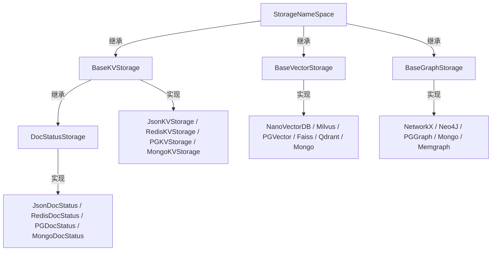
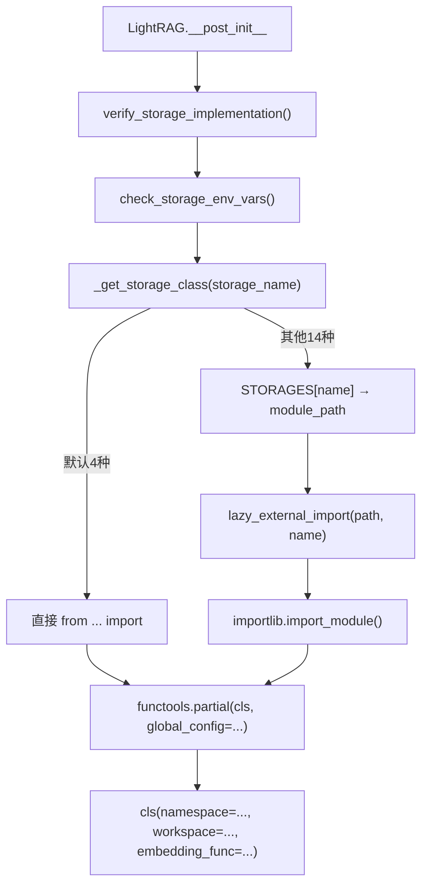
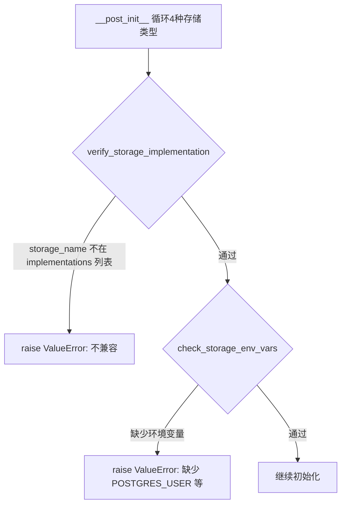

# PD-75.01 LightRAG — 四层存储抽象与注册表动态加载

> 文档编号：PD-75.01
> 来源：LightRAG `lightrag/kg/__init__.py`, `lightrag/base.py`, `lightrag/lightrag.py`
> GitHub：https://github.com/HKUDS/LightRAG.git
> 问题域：PD-75 多后端存储抽象 Multi-Backend Storage Abstraction
> 状态：可复用方案

---

## 第 1 章 问题与动机

### 1.1 核心问题

RAG 系统需要同时管理四种异构存储需求：键值对（文档/缓存）、向量（嵌入检索）、图（知识图谱）、文档状态（处理流水线追踪）。不同部署环境对存储后端有截然不同的要求——本地开发用 JSON 文件 + NetworkX，生产环境用 PostgreSQL + Neo4j + Milvus。如果业务逻辑直接耦合具体存储实现，每换一个后端就要改大量代码，且无法保证接口一致性。

核心挑战：
- 四种存储类型各有不同的操作语义（KV 的 get/upsert vs Graph 的 node/edge CRUD vs Vector 的 query/upsert）
- 后端实现数量庞大（12+ 个实现类跨 JSON/Redis/PG/Mongo/Neo4j/Milvus/Qdrant/Faiss 等）
- 需要在运行时通过字符串配置切换后端，无需改代码
- 必须在初始化前验证后端兼容性，避免运行时崩溃

### 1.2 LightRAG 的解法概述

LightRAG 设计了一套四层 ABC 接口 + 注册表动态加载的存储抽象体系：

1. **四层 ABC 接口**：`BaseKVStorage`、`BaseVectorStorage`、`BaseGraphStorage`、`DocStatusStorage`，每层定义完整的抽象方法契约（`lightrag/base.py:356-823`）
2. **STORAGES 注册表**：字符串名 → 模块路径的静态映射表，支持 `importlib` 延迟加载（`lightrag/kg/__init__.py:97-119`）
3. **STORAGE_IMPLEMENTATIONS 兼容性矩阵**：声明每种存储类型允许的实现列表和必需方法（`lightrag/kg/__init__.py:1-42`）
4. **verify_storage_implementation 门控**：初始化前校验实现与类型的兼容性（`lightrag/kg/__init__.py:122-141`）
5. **check_storage_env_vars 环境检查**：根据 `STORAGE_ENV_REQUIREMENTS` 表验证所需环境变量是否存在（`lightrag/utils.py:2337-2355`）

### 1.3 设计思想

| 设计原则 | 具体实现 | 理由 | 替代方案 |
|----------|----------|------|----------|
| 接口隔离 | 四个独立 ABC 基类，各自定义操作语义 | KV/Vector/Graph/DocStatus 操作差异大，统一接口会导致空方法 | 单一 BaseStorage 接口（过于宽泛） |
| 字符串驱动配置 | `kv_storage="PGKVStorage"` 字符串传入 | 支持 YAML/env/CLI 配置，无需 import 具体类 | 直接传入类引用（不利于序列化配置） |
| 延迟加载 | `lazy_external_import` 仅在首次使用时 import 模块 | 避免启动时加载所有后端依赖（如 asyncpg、neo4j） | 启动时全量 import（浪费内存，依赖冲突） |
| 初始化前验证 | `verify_storage_implementation` + `check_storage_env_vars` 双重门控 | 快速失败，避免运行到一半才发现后端不兼容 | 运行时异常（调试困难） |
| partial 注入 | `functools.partial` 预绑定 `global_config` | 统一配置传递，避免每次实例化都传完整配置 | 全局变量（不利于多实例） |

---

## 第 2 章 源码实现分析

### 2.1 架构概览

LightRAG 的存储抽象分为三层：ABC 接口层、注册表层、实例化层。

```
┌─────────────────────────────────────────────────────────────────┐
│                      LightRAG 主类                               │
│  kv_storage="PGKVStorage"  vector_storage="MilvusVectorDBStorage"│
│  graph_storage="Neo4JStorage"  doc_status_storage="PGDocStatus"  │
└──────────┬──────────────────────────────────────────────────────┘
           │ __post_init__
           ▼
┌──────────────────────────────────────────────────────────────────┐
│  验证层                                                          │
│  verify_storage_implementation() → 兼容性矩阵检查                  │
│  check_storage_env_vars()        → 环境变量检查                    │
└──────────┬──────────────────────────────────────────────────────┘
           │ _get_storage_class()
           ▼
┌──────────────────────────────────────────────────────────────────┐
│  注册表层 (STORAGES dict)                                        │
│  "PGKVStorage" → ".kg.postgres_impl"                             │
│  "Neo4JStorage" → ".kg.neo4j_impl"                               │
│  "MilvusVectorDBStorage" → ".kg.milvus_impl"                     │
│  ... (18 个映射)                                                  │
└──────────┬──────────────────────────────────────────────────────┘
           │ lazy_external_import / direct import
           ▼
┌──────────────────────────────────────────────────────────────────┐
│  ABC 接口层                                                      │
│  StorageNameSpace (公共基类: namespace, workspace, global_config)  │
│    ├── BaseKVStorage      (get_by_id, upsert, filter_keys, ...)  │
│    ├── BaseVectorStorage  (query, upsert, delete_entity, ...)    │
│    ├── BaseGraphStorage   (has_node, upsert_node, get_edge, ...) │
│    └── DocStatusStorage   (get_docs_by_status, get_status_counts)│
└──────────┬──────────────────────────────────────────────────────┘
           │ 具体实现
           ▼
┌──────────────────────────────────────────────────────────────────┐
│  实现层 (12 个 *_impl.py 文件)                                    │
│  json_kv_impl / redis_impl / postgres_impl / mongo_impl          │
│  neo4j_impl / milvus_impl / qdrant_impl / faiss_impl / ...       │
└──────────────────────────────────────────────────────────────────┘
```

### 2.2 核心实现

#### 2.2.1 四层 ABC 接口定义



对应源码 `lightrag/base.py:173-823`：

```python
@dataclass
class StorageNameSpace(ABC):
    namespace: str
    workspace: str
    global_config: dict[str, Any]

    async def initialize(self):
        """Initialize the storage"""
        pass

    async def finalize(self):
        """Finalize the storage"""
        pass

    @abstractmethod
    async def index_done_callback(self) -> None:
        """Commit the storage operations after indexing"""

    @abstractmethod
    async def drop(self) -> dict[str, str]:
        """Drop all data from storage and clean up resources"""


@dataclass
class BaseKVStorage(StorageNameSpace, ABC):
    embedding_func: EmbeddingFunc

    @abstractmethod
    async def get_by_id(self, id: str) -> dict[str, Any] | None: ...
    @abstractmethod
    async def get_by_ids(self, ids: list[str]) -> list[dict[str, Any]]: ...
    @abstractmethod
    async def filter_keys(self, keys: set[str]) -> set[str]: ...
    @abstractmethod
    async def upsert(self, data: dict[str, dict[str, Any]]) -> None: ...
    @abstractmethod
    async def delete(self, ids: list[str]) -> None: ...
    @abstractmethod
    async def is_empty(self) -> bool: ...


@dataclass
class BaseVectorStorage(StorageNameSpace, ABC):
    embedding_func: EmbeddingFunc
    cosine_better_than_threshold: float = field(default=0.2)
    meta_fields: set[str] = field(default_factory=set)

    @abstractmethod
    async def query(self, query: str, top_k: int, query_embedding: list[float] = None) -> list[dict]: ...
    @abstractmethod
    async def upsert(self, data: dict[str, dict[str, Any]]) -> None: ...
    @abstractmethod
    async def delete_entity(self, entity_name: str) -> None: ...
    @abstractmethod
    async def get_by_id(self, id: str) -> dict[str, Any] | None: ...
```

#### 2.2.2 注册表与动态加载



对应源码 `lightrag/lightrag.py:1098-1120`：

```python
def _get_storage_class(self, storage_name: str) -> Callable[..., Any]:
    # Direct imports for default storage implementations
    if storage_name == "JsonKVStorage":
        from lightrag.kg.json_kv_impl import JsonKVStorage
        return JsonKVStorage
    elif storage_name == "NanoVectorDBStorage":
        from lightrag.kg.nano_vector_db_impl import NanoVectorDBStorage
        return NanoVectorDBStorage
    elif storage_name == "NetworkXStorage":
        from lightrag.kg.networkx_impl import NetworkXStorage
        return NetworkXStorage
    elif storage_name == "JsonDocStatusStorage":
        from lightrag.kg.json_doc_status_impl import JsonDocStatusStorage
        return JsonDocStatusStorage
    else:
        # Fallback to dynamic import for other storage implementations
        import_path = STORAGES[storage_name]
        storage_class = lazy_external_import(import_path, storage_name)
        return storage_class
```

#### 2.2.3 兼容性验证与环境检查



对应源码 `lightrag/kg/__init__.py:1-42` 和 `lightrag/kg/__init__.py:122-141`：

```python
STORAGE_IMPLEMENTATIONS = {
    "KV_STORAGE": {
        "implementations": ["JsonKVStorage", "RedisKVStorage", "PGKVStorage", "MongoKVStorage"],
        "required_methods": ["get_by_id", "upsert"],
    },
    "GRAPH_STORAGE": {
        "implementations": ["NetworkXStorage", "Neo4JStorage", "PGGraphStorage", "MongoGraphStorage", "MemgraphStorage"],
        "required_methods": ["upsert_node", "upsert_edge"],
    },
    "VECTOR_STORAGE": {
        "implementations": ["NanoVectorDBStorage", "MilvusVectorDBStorage", "PGVectorStorage",
                           "FaissVectorDBStorage", "QdrantVectorDBStorage", "MongoVectorDBStorage"],
        "required_methods": ["query", "upsert"],
    },
    "DOC_STATUS_STORAGE": {
        "implementations": ["JsonDocStatusStorage", "RedisDocStatusStorage", "PGDocStatusStorage", "MongoDocStatusStorage"],
        "required_methods": ["get_docs_by_status"],
    },
}

def verify_storage_implementation(storage_type: str, storage_name: str) -> None:
    if storage_type not in STORAGE_IMPLEMENTATIONS:
        raise ValueError(f"Unknown storage type: {storage_type}")
    storage_info = STORAGE_IMPLEMENTATIONS[storage_type]
    if storage_name not in storage_info["implementations"]:
        raise ValueError(
            f"Storage implementation '{storage_name}' is not compatible with {storage_type}. "
            f"Compatible implementations are: {', '.join(storage_info['implementations'])}"
        )
```

### 2.3 实现细节

**partial 预绑定模式**（`lightrag/lightrag.py:571-579`）：

LightRAG 使用 `functools.partial` 将 `global_config` 预绑定到存储类上，这样后续创建多个同类型存储实例时无需重复传递配置：

```python
self.key_string_value_json_storage_cls = partial(
    self.key_string_value_json_storage_cls, global_config=global_config
)
self.vector_db_storage_cls = partial(
    self.vector_db_storage_cls, global_config=global_config
)
self.graph_storage_cls = partial(
    self.graph_storage_cls, global_config=global_config
)
```

之后创建 7 个 KV 存储实例、3 个 Vector 存储实例、1 个 Graph 存储实例时，只需传 `namespace` 和 `workspace`（`lightrag/lightrag.py:584-653`）。

**lazy_external_import 延迟加载**（`lightrag/utils.py:1867-1883`）：

```python
def lazy_external_import(module_name: str, class_name: str) -> Callable[..., Any]:
    caller_frame = inspect.currentframe().f_back
    module = inspect.getmodule(caller_frame)
    package = module.__package__ if module else None

    def import_class(*args, **kwargs):
        module = importlib.import_module(module_name, package=package)
        cls = getattr(module, class_name)
        return cls(*args, **kwargs)

    return import_class
```

这个函数返回一个闭包，只有在真正调用时才执行 `importlib.import_module`。这意味着如果用户配置了 `PGKVStorage`，只有 `asyncpg` 和 `pgvector` 会被加载，`neo4j`、`pymilvus` 等不会被引入。

**STORAGE_ENV_REQUIREMENTS 环境变量表**（`lightrag/kg/__init__.py:44-94`）：

每个存储实现声明自己需要的环境变量。例如 `PGKVStorage` 需要 `POSTGRES_USER`、`POSTGRES_PASSWORD`、`POSTGRES_DATABASE`，而 `JsonKVStorage` 不需要任何环境变量。`check_storage_env_vars` 在初始化前检查这些变量是否存在，实现快速失败。

---

## 第 3 章 迁移指南

### 3.1 迁移清单

**阶段 1：定义 ABC 接口**
- [ ] 识别项目中的存储类型（KV/Vector/Graph/其他）
- [ ] 为每种类型定义 ABC 基类，继承公共 `StorageNameSpace`
- [ ] 每个 ABC 声明 `@abstractmethod` 方法（至少包含 CRUD + 生命周期）
- [ ] 公共基类包含 `namespace`、`workspace`、`global_config` 三个字段

**阶段 2：实现注册表**
- [ ] 创建 `STORAGES` 字典：实现类名 → 模块路径
- [ ] 创建 `STORAGE_IMPLEMENTATIONS` 兼容性矩阵：存储类型 → 允许的实现列表
- [ ] 创建 `STORAGE_ENV_REQUIREMENTS` 环境变量表
- [ ] 实现 `verify_storage_implementation()` 验证函数
- [ ] 实现 `check_storage_env_vars()` 环境检查函数

**阶段 3：实现动态加载**
- [ ] 实现 `lazy_external_import()` 延迟加载函数
- [ ] 在主类中实现 `_get_storage_class()` 方法（默认实现直接 import，其他走注册表）
- [ ] 使用 `functools.partial` 预绑定公共配置

**阶段 4：实现具体后端**
- [ ] 为每种存储类型实现至少一个本地后端（JSON/SQLite）和一个远程后端（PG/Redis）
- [ ] 每个实现类继承对应 ABC，实现所有抽象方法
- [ ] 实现 `initialize()` / `finalize()` 生命周期方法

### 3.2 适配代码模板

```python
"""可直接复用的存储抽象框架模板"""
from __future__ import annotations
from abc import ABC, abstractmethod
from dataclasses import dataclass, field
from typing import Any, Callable
from functools import partial
import importlib
import inspect
import os


# ── 1. 公共基类 ──────────────────────────────────────────────
@dataclass
class StorageNameSpace(ABC):
    namespace: str
    workspace: str
    global_config: dict[str, Any]

    async def initialize(self):
        pass

    async def finalize(self):
        pass

    @abstractmethod
    async def drop(self) -> dict[str, str]:
        """清空存储"""


# ── 2. ABC 接口层 ─────────────────────────────────────────────
@dataclass
class BaseKVStorage(StorageNameSpace, ABC):
    @abstractmethod
    async def get_by_id(self, id: str) -> dict[str, Any] | None: ...
    @abstractmethod
    async def upsert(self, data: dict[str, dict[str, Any]]) -> None: ...
    @abstractmethod
    async def delete(self, ids: list[str]) -> None: ...


@dataclass
class BaseVectorStorage(StorageNameSpace, ABC):
    embedding_dim: int = 1536

    @abstractmethod
    async def query(self, query_embedding: list[float], top_k: int) -> list[dict]: ...
    @abstractmethod
    async def upsert(self, data: dict[str, dict[str, Any]]) -> None: ...


# ── 3. 注册表 ─────────────────────────────────────────────────
STORAGES: dict[str, str] = {
    "JsonKVStorage": ".storage.json_impl",
    "RedisKVStorage": ".storage.redis_impl",
    "PGKVStorage": ".storage.pg_impl",
    "FaissVectorStorage": ".storage.faiss_impl",
    "PGVectorStorage": ".storage.pg_impl",
}

STORAGE_IMPLEMENTATIONS: dict[str, dict] = {
    "KV_STORAGE": {
        "implementations": ["JsonKVStorage", "RedisKVStorage", "PGKVStorage"],
        "required_methods": ["get_by_id", "upsert"],
    },
    "VECTOR_STORAGE": {
        "implementations": ["FaissVectorStorage", "PGVectorStorage"],
        "required_methods": ["query", "upsert"],
    },
}

STORAGE_ENV_REQUIREMENTS: dict[str, list[str]] = {
    "JsonKVStorage": [],
    "RedisKVStorage": ["REDIS_URI"],
    "PGKVStorage": ["POSTGRES_USER", "POSTGRES_PASSWORD", "POSTGRES_DATABASE"],
    "FaissVectorStorage": [],
    "PGVectorStorage": ["POSTGRES_USER", "POSTGRES_PASSWORD", "POSTGRES_DATABASE"],
}


# ── 4. 验证与加载 ─────────────────────────────────────────────
def verify_storage_implementation(storage_type: str, storage_name: str) -> None:
    if storage_type not in STORAGE_IMPLEMENTATIONS:
        raise ValueError(f"Unknown storage type: {storage_type}")
    info = STORAGE_IMPLEMENTATIONS[storage_type]
    if storage_name not in info["implementations"]:
        raise ValueError(
            f"'{storage_name}' is not compatible with {storage_type}. "
            f"Compatible: {', '.join(info['implementations'])}"
        )


def check_storage_env_vars(storage_name: str) -> None:
    required = STORAGE_ENV_REQUIREMENTS.get(storage_name, [])
    missing = [v for v in required if v not in os.environ]
    if missing:
        raise ValueError(f"'{storage_name}' requires env vars: {', '.join(missing)}")


def lazy_external_import(module_name: str, class_name: str) -> Callable[..., Any]:
    caller_frame = inspect.currentframe().f_back
    mod = inspect.getmodule(caller_frame)
    package = mod.__package__ if mod else None

    def import_class(*args, **kwargs):
        module = importlib.import_module(module_name, package=package)
        cls = getattr(module, class_name)
        return cls(*args, **kwargs)
    return import_class


# ── 5. 主类集成 ────────────────────────────────────────────────
@dataclass
class MyRAG:
    kv_storage: str = "JsonKVStorage"
    vector_storage: str = "FaissVectorStorage"

    def __post_init__(self):
        # 验证
        for stype, sname in [("KV_STORAGE", self.kv_storage), ("VECTOR_STORAGE", self.vector_storage)]:
            verify_storage_implementation(stype, sname)
            check_storage_env_vars(sname)

        # 加载 + partial 预绑定
        config = {"embedding_dim": 1536}
        kv_cls = self._get_storage_class(self.kv_storage)
        self.kv_cls = partial(kv_cls, global_config=config)

    def _get_storage_class(self, name: str) -> Callable:
        if name == "JsonKVStorage":
            from .storage.json_impl import JsonKVStorage
            return JsonKVStorage
        import_path = STORAGES[name]
        return lazy_external_import(import_path, name)
```

### 3.3 适用场景

| 场景 | 适用度 | 说明 |
|------|--------|------|
| RAG 系统多后端支持 | ⭐⭐⭐ | 完美匹配：KV/Vector/Graph 三层存储正是 RAG 核心需求 |
| 微服务存储层抽象 | ⭐⭐⭐ | 注册表 + ABC 模式可直接复用于任何需要存储可插拔的系统 |
| 插件化数据库适配 | ⭐⭐⭐ | STORAGES 注册表 + lazy_import 是经典的插件加载模式 |
| 单一后端项目 | ⭐ | 过度设计，直接用具体实现即可 |
| 需要运行时热切换后端 | ⭐⭐ | LightRAG 的切换是初始化时确定的，不支持运行中切换 |

---

## 第 4 章 测试用例

```python
import pytest
from unittest.mock import patch, MagicMock
from dataclasses import dataclass, field
from typing import Any


# ── 测试兼容性验证 ──────────────────────────────────────────────
class TestVerifyStorageImplementation:
    """测试 verify_storage_implementation 函数"""

    def test_valid_kv_storage(self):
        """正常路径：合法的 KV 存储实现"""
        # 不应抛出异常
        verify_storage_implementation("KV_STORAGE", "JsonKVStorage")
        verify_storage_implementation("KV_STORAGE", "PGKVStorage")

    def test_invalid_storage_type(self):
        """边界情况：未知的存储类型"""
        with pytest.raises(ValueError, match="Unknown storage type"):
            verify_storage_implementation("UNKNOWN_TYPE", "JsonKVStorage")

    def test_incompatible_implementation(self):
        """边界情况：实现与类型不兼容"""
        with pytest.raises(ValueError, match="is not compatible"):
            verify_storage_implementation("KV_STORAGE", "Neo4JStorage")

    def test_vector_storage_implementations(self):
        """正常路径：所有向量存储实现"""
        for impl in ["NanoVectorDBStorage", "MilvusVectorDBStorage",
                      "PGVectorStorage", "FaissVectorDBStorage",
                      "QdrantVectorDBStorage", "MongoVectorDBStorage"]:
            verify_storage_implementation("VECTOR_STORAGE", impl)


# ── 测试环境变量检查 ────────────────────────────────────────────
class TestCheckStorageEnvVars:
    """测试 check_storage_env_vars 函数"""

    def test_json_no_env_required(self):
        """正常路径：JSON 存储不需要环境变量"""
        check_storage_env_vars("JsonKVStorage")  # 不应抛出

    @patch.dict("os.environ", {}, clear=True)
    def test_pg_missing_env_vars(self):
        """降级行为：PG 存储缺少环境变量"""
        with pytest.raises(ValueError, match="requires the following environment variables"):
            check_storage_env_vars("PGKVStorage")

    @patch.dict("os.environ", {
        "POSTGRES_USER": "test",
        "POSTGRES_PASSWORD": "test",
        "POSTGRES_DATABASE": "testdb"
    })
    def test_pg_all_env_present(self):
        """正常路径：PG 存储所有环境变量都存在"""
        check_storage_env_vars("PGKVStorage")  # 不应抛出


# ── 测试动态加载 ────────────────────────────────────────────────
class TestGetStorageClass:
    """测试 _get_storage_class 动态加载"""

    def test_default_json_direct_import(self):
        """正常路径：默认存储直接 import"""
        # JsonKVStorage 应该通过直接 import 加载
        from lightrag.kg.json_kv_impl import JsonKVStorage
        assert JsonKVStorage is not None

    def test_storages_registry_completeness(self):
        """边界情况：注册表覆盖所有声明的实现"""
        from lightrag.kg import STORAGES, STORAGE_IMPLEMENTATIONS
        all_impls = set()
        for info in STORAGE_IMPLEMENTATIONS.values():
            all_impls.update(info["implementations"])
        for impl in all_impls:
            assert impl in STORAGES, f"{impl} not in STORAGES registry"

    def test_env_requirements_completeness(self):
        """边界情况：环境变量表覆盖所有注册的实现"""
        from lightrag.kg import STORAGES, STORAGE_ENV_REQUIREMENTS
        for impl in STORAGES:
            assert impl in STORAGE_ENV_REQUIREMENTS, \
                f"{impl} not in STORAGE_ENV_REQUIREMENTS"
```

---

## 第 5 章 跨域关联

| 关联域 | 关系类型 | 说明 |
|--------|----------|------|
| PD-08 搜索与检索 | 依赖 | BaseVectorStorage 的 `query` 方法是 RAG 检索的核心入口，搜索质量直接取决于向量存储后端的实现 |
| PD-06 记忆持久化 | 协同 | BaseKVStorage 承载了 LLM 响应缓存、文档全文、实体/关系等持久化数据，是记忆系统的存储基座 |
| PD-03 容错与重试 | 协同 | PostgreSQLDB 实现了连接重试（tenacity）、连接池重建、瞬态异常识别，存储层的容错直接影响系统可靠性 |
| PD-78 并发控制 | 依赖 | shared_storage.py 的 KeyedUnifiedLock 为存储操作提供跨进程/协程的并发安全保障 |
| PD-82 配置管理 | 协同 | 存储后端选择通过字符串配置 + 环境变量驱动，与配置管理域紧密关联 |

---

## 第 6 章 来源文件索引

| 文件 | 行范围 | 关键实现 |
|------|--------|----------|
| `lightrag/base.py` | L173-L215 | StorageNameSpace 公共基类定义 |
| `lightrag/base.py` | L356-L402 | BaseKVStorage ABC 接口（6 个抽象方法） |
| `lightrag/base.py` | L218-L353 | BaseVectorStorage ABC 接口（10 个抽象方法） |
| `lightrag/base.py` | L405-L702 | BaseGraphStorage ABC 接口（20+ 方法含批量默认实现） |
| `lightrag/base.py` | L762-L823 | DocStatusStorage ABC 接口 |
| `lightrag/kg/__init__.py` | L1-L42 | STORAGE_IMPLEMENTATIONS 兼容性矩阵 |
| `lightrag/kg/__init__.py` | L44-L94 | STORAGE_ENV_REQUIREMENTS 环境变量表 |
| `lightrag/kg/__init__.py` | L97-L119 | STORAGES 注册表（18 个映射） |
| `lightrag/kg/__init__.py` | L122-L141 | verify_storage_implementation 验证函数 |
| `lightrag/lightrag.py` | L131-L153 | LightRAG 类存储配置字段（4 个字符串字段） |
| `lightrag/lightrag.py` | L484-L495 | 初始化时的验证循环 |
| `lightrag/lightrag.py` | L561-L653 | 存储类加载 + partial 绑定 + 实例创建 |
| `lightrag/lightrag.py` | L1098-L1120 | _get_storage_class 动态加载方法 |
| `lightrag/utils.py` | L1867-L1883 | lazy_external_import 延迟加载函数 |
| `lightrag/utils.py` | L2337-L2355 | check_storage_env_vars 环境检查函数 |
| `lightrag/kg/postgres_impl.py` | L128-L201 | PostgreSQLDB 连接管理（SSL/重试/连接池） |
| `lightrag/kg/postgres_impl.py` | L1887-L2006 | PGKVStorage 具体实现 |
| `lightrag/kg/postgres_impl.py` | L2376-L2455 | PGVectorStorage 具体实现 |

---

## 第 7 章 横向对比维度

```json comparison_data
{
  "project": "LightRAG",
  "dimensions": {
    "接口分层": "四层ABC(KV/Vector/Graph/DocStatus)各自独立，StorageNameSpace公共基类",
    "注册机制": "STORAGES字典字符串→模块路径映射，18个实现类静态注册",
    "动态加载": "默认4种直接import，其余lazy_external_import延迟加载避免依赖膨胀",
    "兼容性验证": "STORAGE_IMPLEMENTATIONS矩阵+verify函数+env_vars检查三重门控",
    "配置传递": "functools.partial预绑定global_config，实例化时只传namespace/workspace",
    "后端覆盖": "12个impl文件覆盖JSON/Redis/PG/Mongo/Neo4j/Milvus/Qdrant/Faiss/Memgraph"
  }
}
```

### 域元数据补充

```json domain_metadata
{
  "solution_summary": "LightRAG用四层ABC接口(KV/Vector/Graph/DocStatus)+STORAGES注册表+lazy_external_import延迟加载，实现18个存储后端的字符串配置切换与初始化前三重验证",
  "description": "多层异构存储的统一抽象需要兼顾接口隔离与延迟加载的平衡",
  "sub_problems": [
    "多存储实例的配置预绑定与批量创建",
    "存储后端依赖的按需加载与隔离"
  ],
  "best_practices": [
    "用functools.partial预绑定公共配置减少实例化参数",
    "默认实现直接import+非默认lazy_import兼顾启动速度与扩展性"
  ]
}
```
