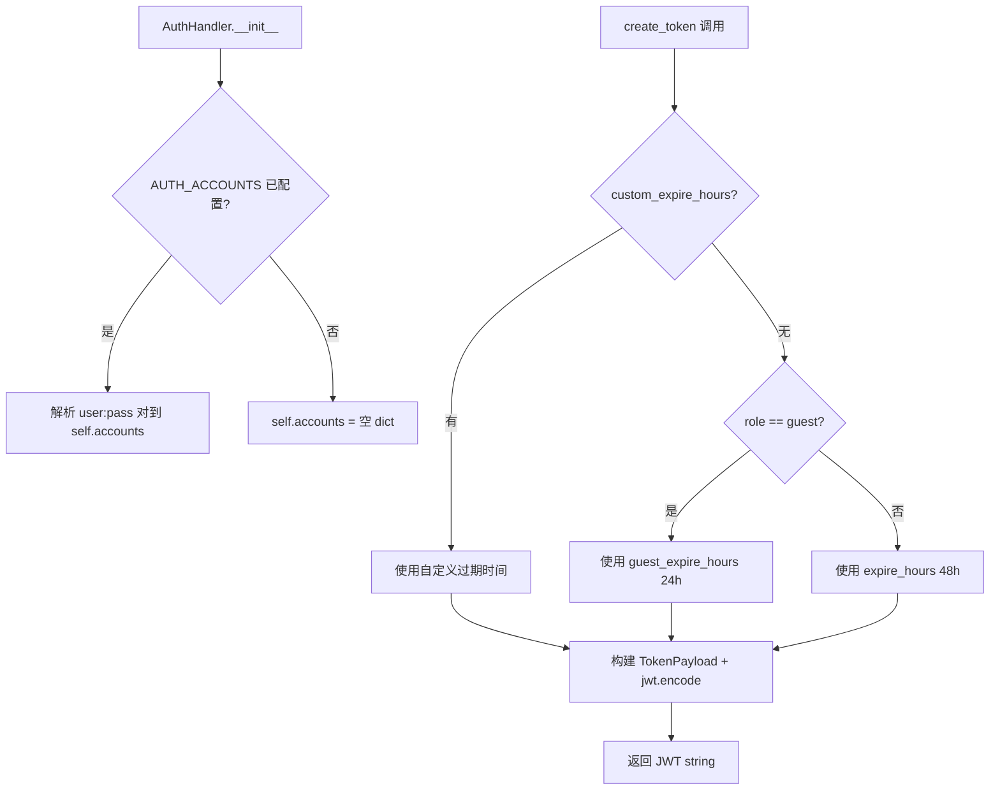
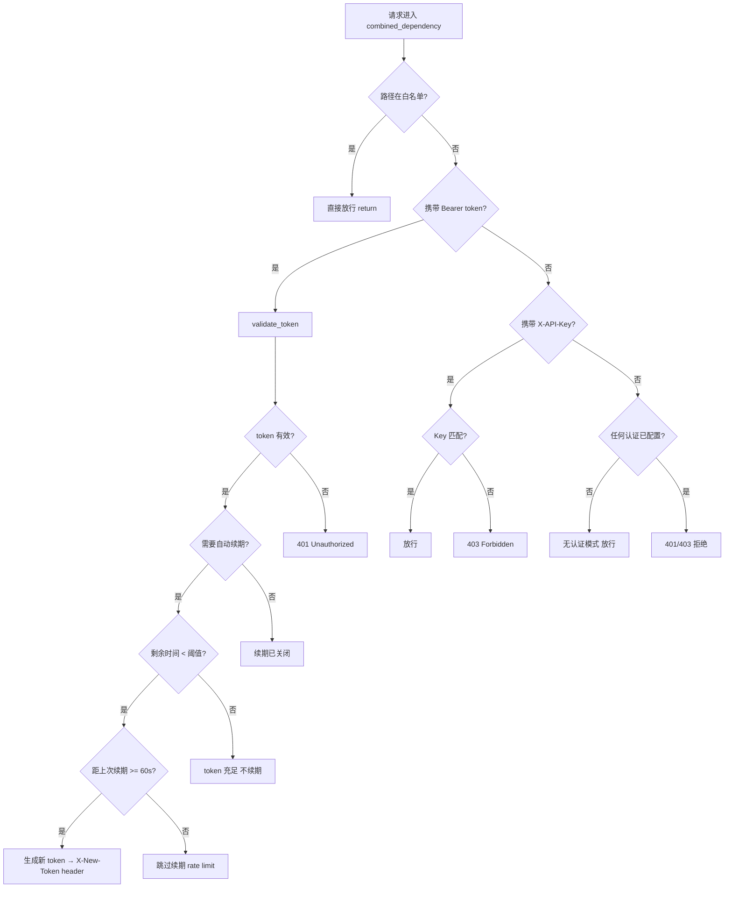

# PD-76.01 LightRAG — JWT 双模认证与滑动续期

> 文档编号：PD-76.01
> 来源：LightRAG `lightrag/api/auth.py` `lightrag/api/utils_api.py`
> GitHub：https://github.com/HKUDS/LightRAG.git
> 问题域：PD-76 认证授权 Authentication & Authorization
> 状态：可复用方案

---

## 第 1 章 问题与动机

### 1.1 核心问题

RAG 系统作为知识密集型服务，通常暴露 REST API 供前端 WebUI 和第三方客户端调用。认证授权需要解决以下问题：

1. **多客户端接入**：WebUI 用户需要用户名/密码登录（OAuth2），自动化脚本需要 API Key 静态凭证
2. **会话保活**：长时间使用 WebUI 时 token 过期导致操作中断，用户体验差
3. **零配置可用**：开发/测试环境不想配置认证，但生产环境必须强制认证
4. **公共端点豁免**：健康检查、Ollama 兼容 API 等端点不应要求认证

### 1.2 LightRAG 的解法概述

LightRAG 实现了一套完整的 JWT 双模认证系统，核心设计：

1. **双模认证**：API Key（`X-API-Key` header）+ OAuth2 Password Bearer 并行，任一通过即放行（`lightrag/api/utils_api.py:109-262`）
2. **角色差异化过期**：user 角色 48h、guest 角色 24h，通过 `TokenPayload` Pydantic 模型统一管理（`lightrag/api/auth.py:16-21`）
3. **滑动窗口续期**：token 剩余时间低于阈值（默认 50%）时自动通过 `X-New-Token` 响应头下发新 token（`lightrag/api/utils_api.py:130-201`）
4. **续期防刷**：内存缓存 + 60 秒最小间隔限制，防止高频轮询端点触发大量 token 生成（`lightrag/api/utils_api.py:28-29`）
5. **白名单路径**：支持精确匹配和前缀通配（`/api/*`），环境变量配置（`lightrag/api/utils_api.py:62-74`）

### 1.3 设计思想

| 设计原则 | 具体实现 | 理由 | 替代方案 |
|----------|----------|------|----------|
| 渐进式安全 | 无配置时自动降级为 guest token | 降低开发门槛，生产环境通过 AUTH_ACCOUNTS 启用 | 强制配置认证（影响开发体验） |
| 双模并行 | API Key + OAuth2 任一通过即放行 | 脚本用 API Key 简单，WebUI 用 OAuth2 标准 | 只支持一种认证方式 |
| 滑动窗口续期 | 响应头 X-New-Token 透明续期 | 用户无感知，避免操作中断 | 前端定时刷新（增加复杂度） |
| 防刷限流 | 内存 dict + 60s 间隔 | 轻量级，无需 Redis 依赖 | Redis 限流（过重） |
| 路径白名单 | 前缀通配 + 精确匹配 | 灵活覆盖公共端点 | 装饰器标记（侵入性强） |

---

## 第 2 章 源码实现分析

### 2.1 架构概览

LightRAG 的认证系统由三层组成：

```
┌─────────────────────────────────────────────────────────────┐
│                    FastAPI Application                       │
│                                                             │
│  ┌──────────┐  ┌──────────────┐  ┌───────────────────────┐ │
│  │ /login   │  │ /auth-status │  │ Protected Endpoints   │ │
│  │ (公开)   │  │ (公开)       │  │ (combined_auth 守卫)  │ │
│  └────┬─────┘  └──────┬───────┘  └──────────┬────────────┘ │
│       │               │                      │              │
│  ┌────▼───────────────▼──────────────────────▼────────────┐ │
│  │           get_combined_auth_dependency()                │ │
│  │  ┌─────────────┐ ┌──────────┐ ┌──────────────────────┐ │ │
│  │  │ 白名单检查  │→│ JWT 验证 │→│ API Key 验证         │ │ │
│  │  │ (前缀/精确) │ │ + 自动续期│ │ (X-API-Key header)  │ │ │
│  │  └─────────────┘ └──────────┘ └──────────────────────┘ │ │
│  └────────────────────────────────────────────────────────┘ │
│                           │                                  │
│  ┌────────────────────────▼──────────────────────────────┐  │
│  │              AuthHandler (auth.py)                     │  │
│  │  create_token() ←→ validate_token()                   │  │
│  │  TokenPayload(sub, exp, role, metadata)                │  │
│  └───────────────────────────────────────────────────────┘  │
│                           │                                  │
│  ┌────────────────────────▼──────────────────────────────┐  │
│  │           config.py (环境变量驱动)                     │  │
│  │  TOKEN_SECRET / TOKEN_EXPIRE_HOURS / JWT_ALGORITHM    │  │
│  │  AUTH_ACCOUNTS / WHITELIST_PATHS / TOKEN_AUTO_RENEW   │  │
│  └───────────────────────────────────────────────────────┘  │
└─────────────────────────────────────────────────────────────┘
```

### 2.2 核心实现

#### 2.2.1 AuthHandler — Token 生命周期管理



对应源码 `lightrag/api/auth.py:23-109`：

```python
class AuthHandler:
    def __init__(self):
        self.secret = global_args.token_secret
        self.algorithm = global_args.jwt_algorithm
        self.expire_hours = global_args.token_expire_hours
        self.guest_expire_hours = global_args.guest_token_expire_hours
        self.accounts = {}
        auth_accounts = global_args.auth_accounts
        if auth_accounts:
            for account in auth_accounts.split(","):
                username, password = account.split(":", 1)
                self.accounts[username] = password

    def create_token(
        self, username: str, role: str = "user",
        custom_expire_hours: int = None, metadata: dict = None,
    ) -> str:
        if custom_expire_hours is None:
            if role == "guest":
                expire_hours = self.guest_expire_hours
            else:
                expire_hours = self.expire_hours
        else:
            expire_hours = custom_expire_hours
        expire = datetime.utcnow() + timedelta(hours=expire_hours)
        payload = TokenPayload(
            sub=username, exp=expire, role=role, metadata=metadata or {}
        )
        return jwt.encode(payload.dict(), self.secret, algorithm=self.algorithm)

    def validate_token(self, token: str) -> dict:
        try:
            payload = jwt.decode(token, self.secret, algorithms=[self.algorithm])
            expire_time = datetime.utcfromtimestamp(payload["exp"])
            if datetime.utcnow() > expire_time:
                raise HTTPException(status_code=401, detail="Token expired")
            return {
                "username": payload["sub"],
                "role": payload.get("role", "user"),
                "metadata": payload.get("metadata", {}),
                "exp": expire_time,
            }
        except jwt.PyJWTError:
            raise HTTPException(status_code=401, detail="Invalid token")
```

#### 2.2.2 组合认证依赖 — 多模式认证决策链



对应源码 `lightrag/api/utils_api.py:80-262`：

```python
def get_combined_auth_dependency(api_key: Optional[str] = None):
    api_key_configured = bool(api_key)
    oauth2_scheme = OAuth2PasswordBearer(tokenUrl="login", auto_error=False)
    api_key_header = None
    if api_key_configured:
        api_key_header = APIKeyHeader(name="X-API-Key", auto_error=False)

    async def combined_dependency(
        request: Request, response: Response,
        token: str = Security(oauth2_scheme),
        api_key_header_value: Optional[str] = None
        if api_key_header is None else Security(api_key_header),
    ):
        # 1. 白名单检查
        path = request.url.path
        for pattern, is_prefix in whitelist_patterns:
            if (is_prefix and path.startswith(pattern)) or (
                not is_prefix and path == pattern
            ):
                return

        # 2. Token 验证 + 自动续期
        if token:
            token_info = auth_handler.validate_token(token)
            if global_args.token_auto_renew:
                skip_renewal = any(
                    path == skip_path or path.startswith(skip_path + "/")
                    for skip_path in _TOKEN_RENEWAL_SKIP_PATHS
                )
                if not skip_renewal:
                    expire_time = token_info.get("exp")
                    remaining_seconds = (expire_time - datetime.utcnow()).total_seconds()
                    role = token_info.get("role", "user")
                    total_hours = (auth_handler.guest_expire_hours
                                   if role == "guest" else auth_handler.expire_hours)
                    total_seconds = total_hours * 3600
                    if remaining_seconds < total_seconds * global_args.token_renew_threshold:
                        username = token_info["username"]
                        current_time = time.time()
                        last_renewal = _token_renewal_cache.get(username, 0)
                        if (current_time - last_renewal) >= _RENEWAL_MIN_INTERVAL:
                            new_token = auth_handler.create_token(
                                username=username, role=role,
                                metadata=token_info.get("metadata", {}),
                            )
                            response.headers["X-New-Token"] = new_token
                            _token_renewal_cache[username] = current_time
            # 角色验证逻辑...
            return

        # 3. API Key 验证
        if api_key_configured and api_key_header_value == api_key:
            return

        # 4. 无认证配置时放行
        if not auth_configured and not api_key_configured:
            return

        raise HTTPException(status_code=403, detail="Authentication required")

    return combined_dependency
```

### 2.3 实现细节

#### 白名单路径预编译

模块加载时一次性编译白名单模式，避免每次请求重复解析（`lightrag/api/utils_api.py:62-74`）：

```python
whitelist_paths = global_args.whitelist_paths.split(",")
whitelist_patterns: List[Tuple[str, bool]] = []
for path in whitelist_paths:
    path = path.strip()
    if path:
        if path.endswith("/*"):
            prefix = path[:-2]
            whitelist_patterns.append((prefix, True))   # 前缀匹配
        else:
            whitelist_patterns.append((path, False))     # 精确匹配
```

#### Token 续期路径排除

高频轮询端点（如 pipeline_status 每 2 秒一次）被排除在续期逻辑之外，避免无意义的 token 生成（`lightrag/api/utils_api.py:36-40`）：

```python
_TOKEN_RENEWAL_SKIP_PATHS = [
    "/health",
    "/documents/paginated",
    "/documents/pipeline_status",
]
```

#### CORS 配合续期

服务端通过 `expose_headers` 暴露 `X-New-Token`，确保跨域请求时前端能读取续期 token（`lightrag/api/lightrag_server.py:448-457`）：

```python
app.add_middleware(
    CORSMiddleware,
    allow_origins=get_cors_origins(),
    allow_credentials=True,
    allow_methods=["*"],
    allow_headers=["*"],
    expose_headers=["X-New-Token"],  # 关键：暴露续期 header
)
```

#### 登录端点的优雅降级

`/login` 端点在无认证配置时自动返回 guest token，前端无需区分处理（`lightrag/api/lightrag_server.py:1162-1195`）：

```python
@app.post("/login")
async def login(form_data: OAuth2PasswordRequestForm = Depends()):
    if not auth_handler.accounts:
        guest_token = auth_handler.create_token(
            username="guest", role="guest", metadata={"auth_mode": "disabled"}
        )
        return {"access_token": guest_token, "token_type": "bearer", "auth_mode": "disabled"}
    # 正常认证流程...
```

---

## 第 3 章 迁移指南

### 3.1 迁移清单

#### 阶段一：基础 JWT 认证（1 个文件）

- [ ] 创建 `auth.py`：复制 `AuthHandler` 类 + `TokenPayload` 模型
- [ ] 安装依赖：`pip install PyJWT pydantic`
- [ ] 配置环境变量：`TOKEN_SECRET`、`TOKEN_EXPIRE_HOURS`、`AUTH_ACCOUNTS`

#### 阶段二：组合认证中间件（1 个文件）

- [ ] 创建 `auth_middleware.py`：实现 `get_combined_auth_dependency()`
- [ ] 配置白名单路径：`WHITELIST_PATHS` 环境变量
- [ ] 在 FastAPI 路由中注入 `dependencies=[Depends(combined_auth)]`

#### 阶段三：滑动续期（增量修改）

- [ ] 在 `combined_dependency` 中添加续期逻辑
- [ ] CORS 配置添加 `expose_headers=["X-New-Token"]`
- [ ] 前端拦截 `X-New-Token` 响应头并更新本地存储

#### 阶段四：API Key 双模（可选）

- [ ] 添加 `APIKeyHeader` 安全依赖
- [ ] 在 `combined_dependency` 中添加 API Key 验证分支

### 3.2 适配代码模板

以下是一个可直接运行的最小化认证模块，从 LightRAG 提炼而来：

```python
"""auth_module.py — 从 LightRAG 提炼的 JWT 双模认证模块"""
import os
import time
from datetime import datetime, timedelta
from typing import Optional, List, Tuple

import jwt
from fastapi import FastAPI, Depends, HTTPException, Request, Response, Security, status
from fastapi.security import APIKeyHeader, OAuth2PasswordBearer, OAuth2PasswordRequestForm
from fastapi.middleware.cors import CORSMiddleware
from pydantic import BaseModel


# ========== 配置 ==========
TOKEN_SECRET = os.getenv("TOKEN_SECRET", "change-me-in-production")
TOKEN_EXPIRE_HOURS = float(os.getenv("TOKEN_EXPIRE_HOURS", "48"))
GUEST_EXPIRE_HOURS = float(os.getenv("GUEST_TOKEN_EXPIRE_HOURS", "24"))
JWT_ALGORITHM = os.getenv("JWT_ALGORITHM", "HS256")
AUTH_ACCOUNTS = os.getenv("AUTH_ACCOUNTS", "")  # "user1:pass1,user2:pass2"
API_KEY = os.getenv("LIGHTRAG_API_KEY", "")
WHITELIST_PATHS = os.getenv("WHITELIST_PATHS", "/health,/docs,/openapi.json")
TOKEN_AUTO_RENEW = os.getenv("TOKEN_AUTO_RENEW", "true").lower() == "true"
TOKEN_RENEW_THRESHOLD = float(os.getenv("TOKEN_RENEW_THRESHOLD", "0.5"))


# ========== Token 模型 ==========
class TokenPayload(BaseModel):
    sub: str
    exp: datetime
    role: str = "user"
    metadata: dict = {}


# ========== AuthHandler ==========
class AuthHandler:
    def __init__(self):
        self.secret = TOKEN_SECRET
        self.algorithm = JWT_ALGORITHM
        self.expire_hours = TOKEN_EXPIRE_HOURS
        self.guest_expire_hours = GUEST_EXPIRE_HOURS
        self.accounts = {}
        if AUTH_ACCOUNTS:
            for account in AUTH_ACCOUNTS.split(","):
                username, password = account.split(":", 1)
                self.accounts[username] = password

    def create_token(self, username: str, role: str = "user",
                     custom_expire_hours: float = None, metadata: dict = None) -> str:
        if custom_expire_hours is None:
            expire_hours = self.guest_expire_hours if role == "guest" else self.expire_hours
        else:
            expire_hours = custom_expire_hours
        expire = datetime.utcnow() + timedelta(hours=expire_hours)
        payload = TokenPayload(sub=username, exp=expire, role=role, metadata=metadata or {})
        return jwt.encode(payload.dict(), self.secret, algorithm=self.algorithm)

    def validate_token(self, token: str) -> dict:
        try:
            payload = jwt.decode(token, self.secret, algorithms=[self.algorithm])
            expire_time = datetime.utcfromtimestamp(payload["exp"])
            if datetime.utcnow() > expire_time:
                raise HTTPException(status_code=401, detail="Token expired")
            return {
                "username": payload["sub"],
                "role": payload.get("role", "user"),
                "metadata": payload.get("metadata", {}),
                "exp": expire_time,
            }
        except jwt.PyJWTError:
            raise HTTPException(status_code=401, detail="Invalid token")


auth_handler = AuthHandler()


# ========== 白名单预编译 ==========
_whitelist_patterns: List[Tuple[str, bool]] = []
for p in WHITELIST_PATHS.split(","):
    p = p.strip()
    if p:
        if p.endswith("/*"):
            _whitelist_patterns.append((p[:-2], True))
        else:
            _whitelist_patterns.append((p, False))

# ========== 续期限流 ==========
_renewal_cache: dict[str, float] = {}
_RENEWAL_MIN_INTERVAL = 60
_RENEWAL_SKIP_PATHS = ["/health"]


# ========== 组合认证依赖 ==========
def get_combined_auth_dependency(api_key: Optional[str] = None):
    auth_configured = bool(auth_handler.accounts)
    api_key_configured = bool(api_key)
    oauth2_scheme = OAuth2PasswordBearer(tokenUrl="login", auto_error=False)
    api_key_header = APIKeyHeader(name="X-API-Key", auto_error=False) if api_key_configured else None

    async def combined_dependency(
        request: Request, response: Response,
        token: str = Security(oauth2_scheme),
        api_key_value: Optional[str] = None if api_key_header is None else Security(api_key_header),
    ):
        path = request.url.path
        # 1. 白名单
        for pattern, is_prefix in _whitelist_patterns:
            if (is_prefix and path.startswith(pattern)) or (not is_prefix and path == pattern):
                return
        # 2. JWT 验证 + 续期
        if token:
            token_info = auth_handler.validate_token(token)
            if TOKEN_AUTO_RENEW and path not in _RENEWAL_SKIP_PATHS:
                exp = token_info["exp"]
                remaining = (exp - datetime.utcnow()).total_seconds()
                role = token_info["role"]
                total = (auth_handler.guest_expire_hours if role == "guest"
                         else auth_handler.expire_hours) * 3600
                if remaining < total * TOKEN_RENEW_THRESHOLD:
                    user = token_info["username"]
                    now = time.time()
                    if (now - _renewal_cache.get(user, 0)) >= _RENEWAL_MIN_INTERVAL:
                        new_token = auth_handler.create_token(
                            username=user, role=role, metadata=token_info.get("metadata", {}))
                        response.headers["X-New-Token"] = new_token
                        _renewal_cache[user] = now
            if not auth_configured and token_info.get("role") == "guest":
                return
            if auth_configured and token_info.get("role") != "guest":
                return
            raise HTTPException(status_code=401, detail="Invalid token")
        # 3. API Key
        if api_key_configured and api_key_value == api_key:
            return
        # 4. 无认证
        if not auth_configured and not api_key_configured:
            return
        raise HTTPException(status_code=403, detail="Authentication required")

    return combined_dependency


# ========== 使用示例 ==========
app = FastAPI()
app.add_middleware(CORSMiddleware, allow_origins=["*"], allow_credentials=True,
                   allow_methods=["*"], allow_headers=["*"], expose_headers=["X-New-Token"])
combined_auth = get_combined_auth_dependency(API_KEY)

@app.post("/login")
async def login(form_data: OAuth2PasswordRequestForm = Depends()):
    if not auth_handler.accounts:
        return {"access_token": auth_handler.create_token("guest", "guest"), "token_type": "bearer"}
    if auth_handler.accounts.get(form_data.username) != form_data.password:
        raise HTTPException(status_code=401, detail="Incorrect credentials")
    return {"access_token": auth_handler.create_token(form_data.username), "token_type": "bearer"}

@app.get("/protected", dependencies=[Depends(combined_auth)])
async def protected_endpoint():
    return {"message": "authenticated"}
```

### 3.3 适用场景

| 场景 | 适用度 | 说明 |
|------|--------|------|
| FastAPI RAG/AI 服务 | ⭐⭐⭐ | 完美匹配，直接复用 |
| 内部工具 + WebUI | ⭐⭐⭐ | 双模认证覆盖人机两种场景 |
| 多租户 SaaS | ⭐⭐ | 需扩展 tenant 字段到 TokenPayload |
| 高安全场景（金融） | ⭐ | 缺少 bcrypt 密码哈希、refresh token、审计日志 |
| 微服务间调用 | ⭐⭐ | API Key 模式可用，但缺少 mTLS |

---

## 第 4 章 测试用例

基于 LightRAG 真实函数签名编写的测试，覆盖核心认证流程：

```python
"""test_auth.py — LightRAG 认证系统测试用例"""
import time
from datetime import datetime, timedelta
from unittest.mock import MagicMock, patch

import jwt
import pytest
from fastapi import HTTPException


# ========== AuthHandler 测试 ==========

class TestAuthHandler:
    """测试 AuthHandler 的 token 创建与验证"""

    def setup_method(self):
        """每个测试前重置 AuthHandler"""
        self.secret = "test-secret-key"
        self.algorithm = "HS256"

    def test_create_token_user_role(self):
        """正常路径：user 角色 token 创建"""
        from auth_module import AuthHandler
        handler = AuthHandler()
        handler.secret = self.secret
        handler.algorithm = self.algorithm
        handler.expire_hours = 48

        token = handler.create_token(username="admin", role="user")
        payload = jwt.decode(token, self.secret, algorithms=[self.algorithm])

        assert payload["sub"] == "admin"
        assert payload["role"] == "user"
        # 验证过期时间在 47-49 小时范围内
        exp_time = datetime.utcfromtimestamp(payload["exp"])
        delta = exp_time - datetime.utcnow()
        assert 47 * 3600 < delta.total_seconds() < 49 * 3600

    def test_create_token_guest_role(self):
        """正常路径：guest 角色使用更短过期时间"""
        from auth_module import AuthHandler
        handler = AuthHandler()
        handler.secret = self.secret
        handler.algorithm = self.algorithm
        handler.guest_expire_hours = 24

        token = handler.create_token(username="guest", role="guest")
        payload = jwt.decode(token, self.secret, algorithms=[self.algorithm])

        assert payload["role"] == "guest"
        exp_time = datetime.utcfromtimestamp(payload["exp"])
        delta = exp_time - datetime.utcnow()
        assert 23 * 3600 < delta.total_seconds() < 25 * 3600

    def test_validate_token_success(self):
        """正常路径：有效 token 验证"""
        from auth_module import AuthHandler
        handler = AuthHandler()
        handler.secret = self.secret
        handler.algorithm = self.algorithm
        handler.expire_hours = 48

        token = handler.create_token(username="admin", role="user")
        result = handler.validate_token(token)

        assert result["username"] == "admin"
        assert result["role"] == "user"
        assert isinstance(result["exp"], datetime)

    def test_validate_expired_token(self):
        """边界情况：过期 token 应抛出 401"""
        from auth_module import AuthHandler
        handler = AuthHandler()
        handler.secret = self.secret
        handler.algorithm = self.algorithm

        # 创建已过期的 token
        token = handler.create_token(
            username="admin", role="user", custom_expire_hours=-1
        )
        with pytest.raises(HTTPException) as exc_info:
            handler.validate_token(token)
        assert exc_info.value.status_code == 401

    def test_validate_tampered_token(self):
        """边界情况：篡改的 token 应抛出 401"""
        from auth_module import AuthHandler
        handler = AuthHandler()
        handler.secret = self.secret
        handler.algorithm = self.algorithm
        handler.expire_hours = 48

        token = handler.create_token(username="admin")
        tampered = token[:-5] + "XXXXX"
        with pytest.raises(HTTPException) as exc_info:
            handler.validate_token(tampered)
        assert exc_info.value.status_code == 401


# ========== Token 续期限流测试 ==========

class TestTokenRenewalRateLimit:
    """测试续期防刷机制"""

    def test_renewal_rate_limit_blocks_rapid_requests(self):
        """60 秒内同一用户的第二次续期应被跳过"""
        from auth_module import _renewal_cache, _RENEWAL_MIN_INTERVAL
        _renewal_cache.clear()

        username = "test_user"
        current_time = time.time()
        _renewal_cache[username] = current_time

        # 模拟 30 秒后的请求
        time_since = 30  # < 60s
        assert time_since < _RENEWAL_MIN_INTERVAL
        # 应该被跳过

    def test_renewal_allowed_after_interval(self):
        """超过 60 秒后应允许续期"""
        from auth_module import _renewal_cache, _RENEWAL_MIN_INTERVAL
        _renewal_cache.clear()

        username = "test_user"
        _renewal_cache[username] = time.time() - 61  # 61 秒前

        last_renewal = _renewal_cache.get(username, 0)
        time_since = time.time() - last_renewal
        assert time_since >= _RENEWAL_MIN_INTERVAL

    def test_different_users_independent(self):
        """不同用户的续期限流应独立"""
        from auth_module import _renewal_cache
        _renewal_cache.clear()

        current = time.time()
        _renewal_cache["user1"] = current
        # user2 没有记录，应该允许续期
        assert _renewal_cache.get("user2", 0) == 0


# ========== 白名单路径测试 ==========

class TestWhitelistPaths:
    """测试白名单路径匹配"""

    def test_exact_match(self):
        """精确匹配"""
        patterns = [("/health", False), ("/api", True)]
        path = "/health"
        matched = any(
            (is_prefix and path.startswith(p)) or (not is_prefix and path == p)
            for p, is_prefix in patterns
        )
        assert matched is True

    def test_prefix_match(self):
        """前缀通配匹配"""
        patterns = [("/api", True)]
        path = "/api/v1/tags"
        matched = any(
            (is_prefix and path.startswith(p)) or (not is_prefix and path == p)
            for p, is_prefix in patterns
        )
        assert matched is True

    def test_no_match(self):
        """不匹配的路径应被拒绝"""
        patterns = [("/health", False), ("/api", True)]
        path = "/documents/upload"
        matched = any(
            (is_prefix and path.startswith(p)) or (not is_prefix and path == p)
            for p, is_prefix in patterns
        )
        assert matched is False
```

---

## 第 5 章 跨域关联

| 关联域 | 关系类型 | 说明 |
|--------|----------|------|
| PD-10 中间件管道 | 协同 | 认证作为 FastAPI 依赖注入，本质是中间件管道的一环；白名单检查 → token 验证 → API Key 验证形成三级管道 |
| PD-09 Human-in-the-Loop | 协同 | `/login` 端点是人机交互入口，`/auth-status` 让前端决定是否展示登录界面 |
| PD-11 可观测性 | 依赖 | 续期日志 `logger.info("Token auto-renewed for user ...")` 依赖日志系统；续期频率可作为用户活跃度指标 |
| PD-04 工具系统 | 协同 | Ollama 兼容 API（`/api/*`）通过白名单豁免认证，使工具调用链路不受认证阻断 |

---

## 第 6 章 来源文件索引

| 文件 | 行范围 | 关键实现 |
|------|--------|----------|
| `lightrag/api/auth.py` | L1-L109 | AuthHandler 类、TokenPayload 模型、create_token/validate_token |
| `lightrag/api/utils_api.py` | L25-L29 | 续期限流缓存 `_token_renewal_cache` + 60s 间隔常量 |
| `lightrag/api/utils_api.py` | L36-L40 | 续期路径排除列表 `_TOKEN_RENEWAL_SKIP_PATHS` |
| `lightrag/api/utils_api.py` | L62-L74 | 白名单路径预编译（前缀/精确匹配） |
| `lightrag/api/utils_api.py` | L80-L262 | `get_combined_auth_dependency()` 组合认证依赖核心 |
| `lightrag/api/utils_api.py` | L130-L201 | Token 自动续期逻辑（阈值判断 + 限流 + header 下发） |
| `lightrag/api/lightrag_server.py` | L65 | `auth_handler` 单例导入 |
| `lightrag/api/lightrag_server.py` | L81 | `auth_configured` 全局标志 |
| `lightrag/api/lightrag_server.py` | L448-L457 | CORS 中间件配置，`expose_headers=["X-New-Token"]` |
| `lightrag/api/lightrag_server.py` | L460 | `combined_auth` 依赖创建 |
| `lightrag/api/lightrag_server.py` | L1132-L1160 | `/auth-status` 端点（guest token 降级） |
| `lightrag/api/lightrag_server.py` | L1162-L1195 | `/login` 端点（OAuth2 密码认证） |
| `lightrag/api/config.py` | L393-L404 | 认证相关环境变量配置（TOKEN_SECRET, AUTH_ACCOUNTS 等） |
| `tests/test_token_auto_renewal.py` | L1-L404 | 官方续期测试用例（限流、guest 模式、多用户独立性） |

---

## 第 7 章 横向对比维度

> **重要：** 本章用于自动填充 Butcher Wiki 的横向对比表。

```json comparison_data
{
  "project": "LightRAG",
  "dimensions": {
    "认证模式": "API Key + OAuth2 Password Bearer 双模并行",
    "Token 管理": "JWT HS256，user 48h / guest 24h 差异化过期",
    "续期策略": "滑动窗口：剩余 < 50% 时通过 X-New-Token header 自动续期",
    "防刷机制": "内存 dict 限流，同用户 60s 最小续期间隔",
    "路径豁免": "白名单预编译，支持精确匹配 + 前缀通配（/api/*）",
    "降级策略": "无认证配置时自动签发 guest token，零配置可用"
  }
}
```

### 域元数据补充

```json domain_metadata
{
  "solution_summary": "LightRAG 用 AuthHandler 单例 + FastAPI 依赖注入实现 API Key/OAuth2 双模认证，滑动窗口续期通过 X-New-Token header 透明下发，内存 dict 60s 限流防刷",
  "description": "API 服务的多模式认证与无感 token 续期机制",
  "sub_problems": [
    "高频轮询端点的续期路径排除",
    "CORS 跨域场景下续期 header 暴露",
    "无认证配置时的 guest token 优雅降级"
  ],
  "best_practices": [
    "白名单路径模块加载时预编译为 (pattern, is_prefix) 元组避免运行时解析",
    "续期失败不影响正常请求处理，仅记录 warning 日志"
  ]
}
```
