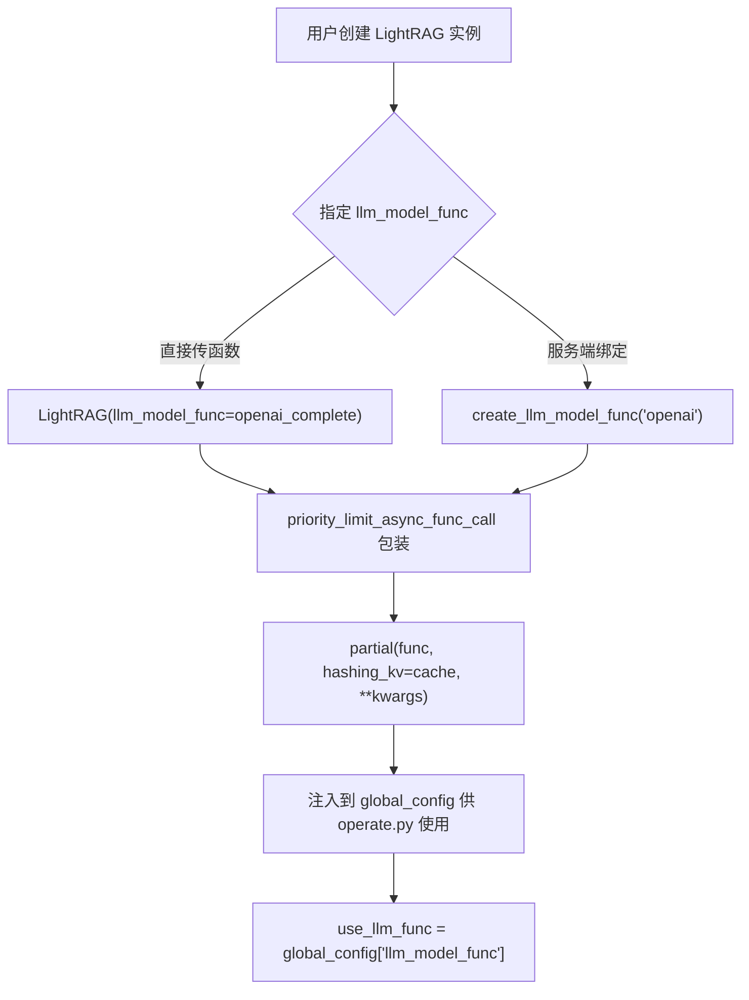
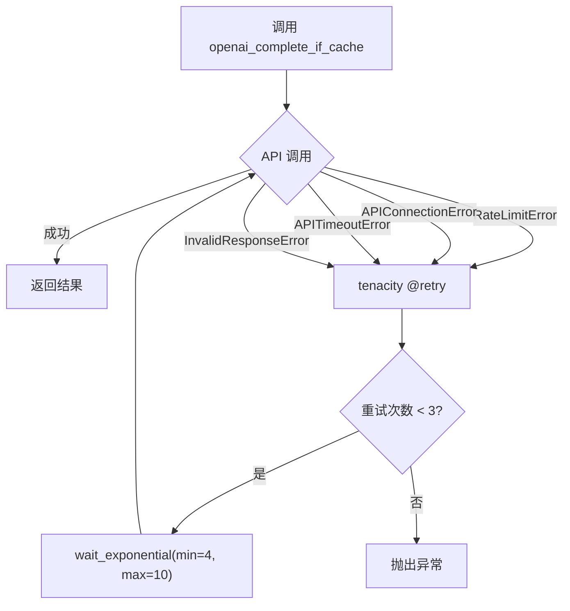

# PD-77.01 LightRAG — LLM 提供商函数式注入抽象

> 文档编号：PD-77.01
> 来源：LightRAG `lightrag/llm/openai.py`, `lightrag/llm/binding_options.py`, `lightrag/llm/gemini.py`
> GitHub：https://github.com/HKUDS/LightRAG.git
> 问题域：PD-77 LLM提供商抽象 LLM Provider Abstraction
> 状态：可复用方案

---

## 第 1 章 问题与动机

### 1.1 核心问题

RAG 系统需要同时支持多种 LLM 提供商（OpenAI、Azure、Anthropic、Gemini、Ollama、Bedrock、HuggingFace、LMDeploy 等），每个提供商有不同的 SDK、认证方式、参数格式和错误类型。如何在不引入复杂类继承体系的前提下，实现提供商的零耦合切换？

核心挑战：
- 10+ 提供商各有独立 SDK，API 签名差异大
- 流式/非流式响应需要统一处理
- 每个提供商的可重试异常类型不同
- Azure/自托管端点需要特殊的认证和路由逻辑
- Embedding 函数需要维度验证和 token 截断

### 1.2 LightRAG 的解法概述

LightRAG 采用**函数式注入**而非类继承来实现 LLM 提供商抽象，核心设计：

1. **函数签名约定**：所有提供商的 completion 函数遵循统一签名 `(model, prompt, system_prompt, history_messages, **kwargs) -> str | AsyncIterator[str]`（`lightrag/llm/openai.py:197`）
2. **`llm_model_func` 注入点**：LightRAG 主类通过 `llm_model_func: Callable` 字段接受任意符合签名的函数（`lightrag/lightrag.py:321`）
3. **`BindingOptions` 配置基类**：用 dataclass 继承实现提供商特定参数的声明式管理（`lightrag/llm/binding_options.py:70`）
4. **独立 retry 装饰器**：每个提供商模块用 `tenacity @retry` 装饰器封装自己的可重试异常（`lightrag/llm/openai.py:187-196`）
5. **`EmbeddingFunc` 包装器**：统一 embedding 函数的维度注入和验证（`lightrag/utils.py:411`）

### 1.3 设计思想

| 设计原则 | 具体实现 | 理由 | 替代方案 |
|----------|----------|------|----------|
| 函数式注入 | `llm_model_func: Callable` 字段 | 避免类继承的刚性耦合，任意函数只要签名匹配即可注入 | ABC 抽象基类 + 工厂模式 |
| 每提供商独立模块 | `llm/openai.py`, `llm/gemini.py` 等独立文件 | 按需导入，不安装不用的 SDK；修改一个提供商不影响其他 | 单文件 switch-case |
| 装饰器式 retry | `@retry(retry_if_exception_type(...))` | 每个提供商的可重试异常不同，装饰器声明式清晰 | 统一 retry 中间件 |
| dataclass 配置 | `BindingOptions` 基类 + 子类 | 自动生成 CLI 参数、环境变量、.env 模板 | JSON/YAML 配置文件 |
| 动态依赖安装 | `pipmaster.install()` 按需安装 | 用户只需安装使用的提供商 SDK | requirements.txt 全量安装 |

---

## 第 2 章 源码实现分析

### 2.1 架构概览

LightRAG 的 LLM 提供商抽象分为三层：

```
┌─────────────────────────────────────────────────────────────────┐
│                    LightRAG 主类 (lightrag.py)                   │
│  llm_model_func: Callable  ←── 函数式注入点                      │
│  embedding_func: EmbeddingFunc  ←── Embedding 注入点             │
│  priority_limit_async_func_call() ←── 并发限制 + 超时包装         │
├─────────────────────────────────────────────────────────────────┤
│              lightrag_server.py — 绑定工厂层                      │
│  create_llm_model_func(binding) → 根据 binding 名返回函数         │
│  create_optimized_embedding_function() → 返回 EmbeddingFunc       │
│  create_llm_model_kwargs(binding) → 返回提供商特定 kwargs          │
├─────────────────────────────────────────────────────────────────┤
│              llm/ 目录 — 提供商实现层（16 个模块）                  │
│  ┌──────────┐ ┌──────────┐ ┌───────────┐ ┌──────────┐          │
│  │ openai   │ │ gemini   │ │ anthropic │ │ bedrock  │          │
│  │ @retry   │ │ @retry   │ │ @retry    │ │ @retry   │          │
│  │ 独立异常  │ │ 独立异常  │ │ 独立异常   │ │ 独立异常  │          │
│  └──────────┘ └──────────┘ └───────────┘ └──────────┘          │
│  ┌──────────┐ ┌──────────┐ ┌───────────┐ ┌──────────┐          │
│  │ ollama   │ │ hf       │ │ lmdeploy  │ │ zhipu    │          │
│  └──────────┘ └──────────┘ └───────────┘ └──────────┘          │
├─────────────────────────────────────────────────────────────────┤
│              binding_options.py — 配置声明层                      │
│  BindingOptions (dataclass 基类)                                 │
│  ├── OllamaLLMOptions / OllamaEmbeddingOptions                  │
│  ├── OpenAILLMOptions                                           │
│  └── GeminiLLMOptions / GeminiEmbeddingOptions                  │
└─────────────────────────────────────────────────────────────────┘
```

### 2.2 核心实现

#### 2.2.1 函数式注入：llm_model_func



对应源码 `lightrag/lightrag.py:321,664-674`：
```python
# 字段声明 — 接受任意 Callable
llm_model_func: Callable[..., object] | None = field(default=None)

# 初始化时包装：并发限制 + 超时 + 缓存注入
self.llm_model_func = priority_limit_async_func_call(
    self.llm_model_max_async,
    llm_timeout=self.default_llm_timeout,
    queue_name="LLM func",
)(
    partial(
        self.llm_model_func,
        hashing_kv=hashing_kv,
        **self.llm_model_kwargs,
    )
)
```

#### 2.2.2 提供商独立 retry 策略



对应源码 `lightrag/llm/openai.py:187-196`（OpenAI）：
```python
@retry(
    stop=stop_after_attempt(3),
    wait=wait_exponential(multiplier=1, min=4, max=10),
    retry=(
        retry_if_exception_type(RateLimitError)
        | retry_if_exception_type(APIConnectionError)
        | retry_if_exception_type(APITimeoutError)
        | retry_if_exception_type(InvalidResponseError)
    ),
)
async def openai_complete_if_cache(model, prompt, ...) -> str:
```

对比 `lightrag/llm/gemini.py:203-217`（Gemini 的 retry 覆盖 8 种 Google API 异常）：
```python
@retry(
    stop=stop_after_attempt(3),
    wait=wait_exponential(multiplier=1, min=4, max=60),
    retry=(
        retry_if_exception_type(google_api_exceptions.InternalServerError)
        | retry_if_exception_type(google_api_exceptions.ServiceUnavailable)
        | retry_if_exception_type(google_api_exceptions.ResourceExhausted)
        | retry_if_exception_type(google_api_exceptions.GatewayTimeout)
        | retry_if_exception_type(google_api_exceptions.BadGateway)
        | retry_if_exception_type(google_api_exceptions.DeadlineExceeded)
        | retry_if_exception_type(google_api_exceptions.Aborted)
        | retry_if_exception_type(google_api_exceptions.Unknown)
        | retry_if_exception_type(InvalidResponseError)
    ),
)
async def gemini_complete_if_cache(model, prompt, ...) -> str | AsyncIterator[str]:
```

对比 `lightrag/llm/bedrock.py:135-143`（Bedrock 用自定义异常层级，retry 5 次）：
```python
@retry(
    stop=stop_after_attempt(5),
    wait=wait_exponential(multiplier=1, min=4, max=60),
    retry=(
        retry_if_exception_type(BedrockRateLimitError)
        | retry_if_exception_type(BedrockConnectionError)
        | retry_if_exception_type(BedrockTimeoutError)
    ),
)
async def bedrock_complete_if_cache(model, prompt, ...) -> Union[str, AsyncIterator[str]]:
```

### 2.3 实现细节

#### BindingOptions 配置声明体系

`BindingOptions` 是一个 dataclass 基类（`lightrag/llm/binding_options.py:70`），提供：
- **自动 CLI 参数生成**：`add_args(parser)` 遍历 dataclass 字段生成 `--binding-name-field` 参数
- **自动环境变量映射**：字段 `temperature` → 环境变量 `OPENAI_LLM_TEMPERATURE`
- **自动 .env 模板生成**：`generate_dot_env_sample()` 遍历所有子类生成完整 .env 文件
- **类型安全解析**：bool/list/dict 类型有专用解析器（`binding_options.py:117-203`）

子类只需声明字段和帮助文本：

```python
# binding_options.py:535-567
@dataclass
class OpenAILLMOptions(BindingOptions):
    _binding_name: ClassVar[str] = "openai_llm"
    frequency_penalty: float = 0.0
    max_completion_tokens: int = None
    temperature: float = DEFAULT_TEMPERATURE
    top_p: float = 1.0
    stop: List[str] = field(default_factory=list)
    extra_body: dict = None  # 支持 OpenRouter/vLLM 扩展参数
    _help: ClassVar[dict[str, str]] = { ... }
```

#### 动态依赖安装（pipmaster）

每个提供商模块在导入时按需安装 SDK（`lightrag/llm/gemini.py:34-38`）：
```python
import pipmaster as pm
if not pm.is_installed("google-genai"):
    pm.install("google-genai")
if not pm.is_installed("google-api-core"):
    pm.install("google-api-core")
```

#### EmbeddingFunc 包装器

`EmbeddingFunc`（`lightrag/utils.py:411`）统一了 embedding 函数的接口：
- 自动注入 `embedding_dim` 参数
- 维度验证（运行时检查输出维度是否匹配声明）
- `max_token_size` 注入用于 token 截断
- `.func` 属性暴露原始函数，避免双重包装

#### 服务端绑定工厂

`create_llm_model_func(binding)`（`lightrag/api/lightrag_server.py:600-627`）根据 binding 名称返回对应函数：

```python
def create_llm_model_func(binding: str):
    if binding == "ollama":
        from lightrag.llm.ollama import ollama_model_complete
        return ollama_model_complete
    elif binding == "aws_bedrock":
        return bedrock_model_complete
    elif binding == "azure_openai":
        return create_optimized_azure_openai_llm_func(config_cache, args, llm_timeout)
    elif binding == "gemini":
        return create_optimized_gemini_llm_func(config_cache, args, llm_timeout)
    else:  # openai and compatible
        return create_optimized_openai_llm_func(config_cache, args, llm_timeout)
```

#### Azure 复用 OpenAI 实现

Azure OpenAI 不是独立模块，而是复用 `openai.py` 的实现，通过 `use_azure=True` 参数切换（`lightrag/llm/openai.py:851-906`）：

```python
async def azure_openai_complete_if_cache(model, prompt, ...):
    deployment = os.getenv("AZURE_OPENAI_DEPLOYMENT") or model
    return await openai_complete_if_cache(
        model=deployment, use_azure=True,
        azure_deployment=deployment, ...
    )
```


---

## 第 3 章 迁移指南

### 3.1 迁移清单

**阶段 1：核心抽象层（必须）**

- [ ] 定义统一的 LLM 调用签名：`async def llm_func(model, prompt, system_prompt, history_messages, stream, **kwargs) -> str | AsyncIterator[str]`
- [ ] 创建 `llm/` 目录，每个提供商一个独立模块
- [ ] 为每个提供商实现独立的 `@retry` 装饰器，覆盖该提供商特有的可重试异常
- [ ] 在主类中添加 `llm_model_func: Callable` 注入点

**阶段 2：配置管理（推荐）**

- [ ] 实现 `BindingOptions` dataclass 基类，支持自动 CLI 参数和环境变量映射
- [ ] 为每个提供商创建 Options 子类（只需声明字段 + 帮助文本）
- [ ] 实现 `.env` 模板自动生成

**阶段 3：Embedding 统一（按需）**

- [ ] 实现 `EmbeddingFunc` 包装器，统一维度注入和验证
- [ ] 用 `@wrap_embedding_func_with_attrs` 装饰器声明默认维度和 token 限制

### 3.2 适配代码模板

#### 最小可用的函数式注入框架

```python
"""minimal_llm_abstraction.py — 可直接运行的 LLM 提供商抽象框架"""
from __future__ import annotations
import asyncio
from collections.abc import AsyncIterator
from dataclasses import dataclass, field
from functools import partial
from typing import Any, Callable

from tenacity import retry, stop_after_attempt, wait_exponential, retry_if_exception_type


# ── 1. 统一签名约定 ──────────────────────────────────────────
# 所有提供商函数必须遵循此签名
LLMFunc = Callable[..., str | AsyncIterator[str]]


# ── 2. 提供商实现示例（OpenAI）──────────────────────────────
@retry(
    stop=stop_after_attempt(3),
    wait=wait_exponential(multiplier=1, min=4, max=10),
    retry=retry_if_exception_type((ConnectionError, TimeoutError)),
)
async def openai_complete(
    model: str,
    prompt: str,
    system_prompt: str | None = None,
    history_messages: list[dict] | None = None,
    stream: bool = False,
    api_key: str | None = None,
    base_url: str | None = None,
    **kwargs: Any,
) -> str | AsyncIterator[str]:
    """OpenAI 提供商实现 — 每个提供商独立封装 retry 和异常处理"""
    from openai import AsyncOpenAI
    client = AsyncOpenAI(api_key=api_key, base_url=base_url)
    messages = []
    if system_prompt:
        messages.append({"role": "system", "content": system_prompt})
    messages.extend(history_messages or [])
    messages.append({"role": "user", "content": prompt})

    response = await client.chat.completions.create(
        model=model, messages=messages, stream=stream, **kwargs
    )
    if stream:
        async def _stream():
            async for chunk in response:
                if chunk.choices and chunk.choices[0].delta.content:
                    yield chunk.choices[0].delta.content
        return _stream()
    return response.choices[0].message.content


# ── 3. 主类注入 ──────────────────────────────────────────────
@dataclass
class RAGEngine:
    """主类通过 llm_model_func 字段接受任意符合签名的函数"""
    llm_model_func: LLMFunc | None = None
    llm_model_name: str = "gpt-4o-mini"
    llm_model_kwargs: dict[str, Any] = field(default_factory=dict)

    def __post_init__(self):
        if self.llm_model_func:
            # 用 partial 预绑定通用参数
            self.llm_model_func = partial(
                self.llm_model_func, **self.llm_model_kwargs
            )

    async def query(self, prompt: str) -> str:
        if not self.llm_model_func:
            raise ValueError("llm_model_func not set")
        return await self.llm_model_func(
            model=self.llm_model_name, prompt=prompt
        )


# ── 4. 使用示例 ──────────────────────────────────────────────
async def main():
    # 切换提供商只需替换函数，零代码改动
    engine = RAGEngine(
        llm_model_func=openai_complete,
        llm_model_name="gpt-4o-mini",
        llm_model_kwargs={"api_key": "sk-xxx"},
    )
    result = await engine.query("What is RAG?")
    print(result)

# asyncio.run(main())
```

### 3.3 适用场景

| 场景 | 适用度 | 说明 |
|------|--------|------|
| RAG 系统多提供商支持 | ⭐⭐⭐ | LightRAG 的核心场景，函数式注入天然适合 |
| Agent 框架 LLM 层 | ⭐⭐⭐ | Agent 需要灵活切换模型，函数注入比类继承更轻量 |
| 需要 Azure/自托管端点 | ⭐⭐⭐ | OpenAI 兼容层 + `use_azure` 参数复用同一实现 |
| 需要严格类型约束 | ⭐⭐ | 函数签名约定靠文档而非编译器，大团队可能需要 Protocol |
| 单一提供商项目 | ⭐ | 过度设计，直接调用 SDK 即可 |

---

## 第 4 章 测试用例

```python
"""test_llm_provider_abstraction.py — 基于 LightRAG 真实函数签名的测试"""
import pytest
from unittest.mock import AsyncMock, patch, MagicMock
from dataclasses import dataclass, field
from typing import Any, ClassVar
import numpy as np


# ── 测试 1：函数签名兼容性 ──────────────────────────────────
class TestFunctionSignatureCompatibility:
    """验证不同提供商函数遵循统一签名"""

    @pytest.mark.asyncio
    async def test_openai_signature(self):
        """openai_complete_if_cache 接受标准参数"""
        with patch("openai.AsyncOpenAI") as mock_client:
            mock_response = MagicMock()
            mock_response.choices = [MagicMock()]
            mock_response.choices[0].message.content = "test response"
            mock_response.choices[0].message.parsed = None
            mock_response.usage = MagicMock(prompt_tokens=10, completion_tokens=5, total_tokens=15)
            mock_client.return_value.chat.completions.create = AsyncMock(return_value=mock_response)

            from lightrag.llm.openai import openai_complete_if_cache
            # 验证函数接受标准签名参数
            result = await openai_complete_if_cache(
                model="gpt-4o-mini",
                prompt="test",
                system_prompt="you are helpful",
                history_messages=[],
                stream=False,
            )
            assert isinstance(result, str)

    @pytest.mark.asyncio
    async def test_custom_func_injection(self):
        """自定义函数可以注入到 llm_model_func"""
        async def my_llm(model, prompt, system_prompt=None, history_messages=None, **kwargs):
            return f"echo: {prompt}"

        # 模拟 LightRAG 的注入机制
        from functools import partial
        func = partial(my_llm, model="test-model")
        result = await func(prompt="hello")
        assert result == "echo: hello"


# ── 测试 2：BindingOptions 配置体系 ──────────────────────────
class TestBindingOptions:
    """验证 BindingOptions 的 CLI 参数和环境变量生成"""

    def test_options_dict_extraction(self):
        """从 Namespace 中提取特定 binding 的参数"""
        from argparse import Namespace
        from lightrag.llm.binding_options import OpenAILLMOptions

        args = Namespace(openai_llm_temperature=0.7, openai_llm_top_p=0.9, other_param="x")
        opts = OpenAILLMOptions.options_dict(args)
        assert opts["temperature"] == 0.7
        assert opts["top_p"] == 0.9
        assert "other_param" not in opts

    def test_env_sample_generation(self):
        """generate_dot_env_sample 生成完整 .env 模板"""
        from lightrag.llm.binding_options import BindingOptions
        sample = BindingOptions.generate_dot_env_sample()
        assert "OLLAMA_LLM_TEMPERATURE" in sample
        assert "OPENAI_LLM_TEMPERATURE" in sample

    def test_dataclass_asdict(self):
        """Options 实例可序列化为 dict"""
        from lightrag.llm.binding_options import OpenAILLMOptions
        opts = OpenAILLMOptions(temperature=0.5, top_p=0.8)
        d = opts.asdict()
        assert d["temperature"] == 0.5
        assert d["top_p"] == 0.8


# ── 测试 3：独立 retry 策略 ──────────────────────────────────
class TestRetryStrategies:
    """验证每个提供商的 retry 装饰器独立工作"""

    @pytest.mark.asyncio
    async def test_openai_retries_on_rate_limit(self):
        """OpenAI 在 RateLimitError 时重试"""
        from openai import RateLimitError
        call_count = 0

        @patch("lightrag.llm.openai.create_openai_async_client")
        async def _test(mock_create):
            nonlocal call_count
            mock_client = AsyncMock()
            mock_create.return_value = mock_client

            def side_effect(*args, **kwargs):
                nonlocal call_count
                call_count += 1
                if call_count < 3:
                    raise RateLimitError("rate limited", response=MagicMock(), body=None)
                resp = MagicMock()
                resp.choices = [MagicMock()]
                resp.choices[0].message.content = "ok"
                resp.choices[0].message.parsed = None
                resp.usage = MagicMock(prompt_tokens=1, completion_tokens=1, total_tokens=2)
                return resp

            mock_client.chat.completions.create = AsyncMock(side_effect=side_effect)
            from lightrag.llm.openai import openai_complete_if_cache
            result = await openai_complete_if_cache("gpt-4o", "test")
            assert call_count == 3

        await _test()

    @pytest.mark.asyncio
    async def test_bedrock_custom_exception_hierarchy(self):
        """Bedrock 使用自定义异常层级"""
        from lightrag.llm.bedrock import (
            BedrockError, BedrockRateLimitError,
            BedrockConnectionError, BedrockTimeoutError
        )
        assert issubclass(BedrockRateLimitError, BedrockError)
        assert issubclass(BedrockConnectionError, BedrockError)
        assert issubclass(BedrockTimeoutError, BedrockError)


# ── 测试 4：降级行为 ──────────────────────────────────────────
class TestDegradation:
    """验证提供商不可用时的降级行为"""

    @pytest.mark.asyncio
    async def test_gemini_empty_response_raises(self):
        """Gemini 空响应触发 InvalidResponseError 并重试"""
        from lightrag.llm.gemini import InvalidResponseError
        with pytest.raises(InvalidResponseError):
            raise InvalidResponseError("empty response")

    def test_cot_unsupported_graceful(self):
        """不支持 COT 的提供商静默忽略 enable_cot"""
        # Bedrock 和 Ollama 在 enable_cot=True 时只打 debug 日志，不报错
        import logging
        with patch.object(logging, "debug") as mock_debug:
            # 模拟 Bedrock 的 COT 处理
            enable_cot = True
            if enable_cot:
                logging.debug("enable_cot=True is not supported for Bedrock")
            mock_debug.assert_called_once()
```


---

## 第 5 章 跨域关联

| 关联域 | 关系类型 | 说明 |
|--------|----------|------|
| PD-03 容错与重试 | 协同 | 每个提供商模块独立封装 tenacity retry，是 PD-03 在 LLM 层的具体实践 |
| PD-11 可观测性 | 协同 | OpenAI 模块集成 Langfuse 可观测性（`openai.py:44-64`），token_tracker 参数贯穿所有提供商 |
| PD-72 Embedding 提供商适配 | 依赖 | EmbeddingFunc 包装器和 `@wrap_embedding_func_with_attrs` 装饰器是 PD-77 的 Embedding 侧镜像 |
| PD-68 配置管理 | 协同 | BindingOptions 的 CLI 参数 / 环境变量自动映射是配置管理的具体实现 |
| PD-01 上下文管理 | 协同 | `history_messages` 参数在所有提供商间统一传递，是上下文窗口管理的接口层 |

---

## 第 6 章 来源文件索引

| 文件 | 行范围 | 关键实现 |
|------|--------|----------|
| `lightrag/llm/binding_options.py` | L32-356 | BindingOptions 基类：CLI 参数生成、环境变量映射、.env 模板 |
| `lightrag/llm/binding_options.py` | L459-568 | OllamaLLMOptions、GeminiLLMOptions、OpenAILLMOptions 子类 |
| `lightrag/llm/openai.py` | L102-184 | create_openai_async_client：OpenAI/Azure 客户端工厂 |
| `lightrag/llm/openai.py` | L187-618 | openai_complete_if_cache：核心 completion 实现 + retry + COT + streaming |
| `lightrag/llm/openai.py` | L705-848 | openai_embed：Embedding 实现 + tiktoken 截断 |
| `lightrag/llm/openai.py` | L851-1021 | Azure OpenAI 包装函数（复用 openai 实现） |
| `lightrag/llm/gemini.py` | L51-100 | _get_gemini_client：LRU 缓存客户端 + Vertex AI 支持 |
| `lightrag/llm/gemini.py` | L203-435 | gemini_complete_if_cache：Gemini completion + COT + streaming |
| `lightrag/llm/gemini.py` | L464-603 | gemini_embed：Embedding + L2 归一化 + 动态维度 |
| `lightrag/llm/anthropic.py` | L50-153 | anthropic_complete_if_cache：Anthropic completion + Voyage AI embedding |
| `lightrag/llm/bedrock.py` | L42-56 | 自定义异常层级：BedrockError → RateLimit/Connection/Timeout |
| `lightrag/llm/bedrock.py` | L135-336 | bedrock_complete_if_cache：Converse API + streaming |
| `lightrag/llm/ollama.py` | L54-151 | _ollama_model_if_cache：Ollama Cloud 自动检测 + streaming |
| `lightrag/llm/hf.py` | L34-122 | hf_model_if_cache：HuggingFace 本地推理 + LRU 模型缓存 |
| `lightrag/lightrag.py` | L321 | llm_model_func 字段声明 |
| `lightrag/lightrag.py` | L664-674 | priority_limit_async_func_call 包装注入 |
| `lightrag/api/lightrag_server.py` | L600-627 | create_llm_model_func 绑定工厂 |
| `lightrag/utils.py` | L411-440 | EmbeddingFunc 包装器类 |
| `lightrag/utils.py` | L1061-1080 | wrap_embedding_func_with_attrs 装饰器 |

---

## 第 7 章 横向对比维度

```json comparison_data
{
  "project": "LightRAG",
  "dimensions": {
    "抽象模式": "函数式注入（Callable 字段 + partial 预绑定），非类继承",
    "提供商数量": "16 个模块覆盖 OpenAI/Azure/Anthropic/Gemini/Ollama/Bedrock/HF/LMDeploy/Zhipu/Jina/LoLLMs/Nvidia 等",
    "retry 策略": "每提供商独立 tenacity @retry，异常类型和重试次数各异（3-5 次）",
    "配置管理": "BindingOptions dataclass 基类自动生成 CLI 参数、环境变量、.env 模板",
    "依赖管理": "pipmaster 按需安装，用哪个提供商才装哪个 SDK",
    "Azure 适配": "复用 OpenAI 实现 + use_azure 参数切换，非独立模块"
  }
}
```

### 域元数据补充

```json domain_metadata
{
  "solution_summary": "LightRAG 通过 llm_model_func: Callable 函数式注入 + BindingOptions dataclass 配置基类 + 16 个独立提供商模块实现零耦合 LLM 切换，每个模块独立封装 tenacity retry 和 pipmaster 按需依赖安装",
  "description": "LLM 提供商抽象需要同时解决调用接口统一、配置声明自动化和依赖按需安装三个子问题",
  "sub_problems": [
    "按需依赖安装：避免全量安装所有提供商 SDK",
    "COT/推理内容的跨提供商统一处理",
    "Embedding 函数维度注入与双重包装防护",
    "可观测性集成（Langfuse 等）的可选插拔"
  ],
  "best_practices": [
    "BindingOptions dataclass 基类自动生成 CLI 参数和环境变量映射",
    "Azure 复用 OpenAI 实现而非独立模块，减少代码重复",
    "EmbeddingFunc 包装器通过 .func 属性暴露原始函数防止双重包装",
    "pipmaster 在模块导入时按需安装 SDK，用户只需安装使用的提供商"
  ]
}
```
