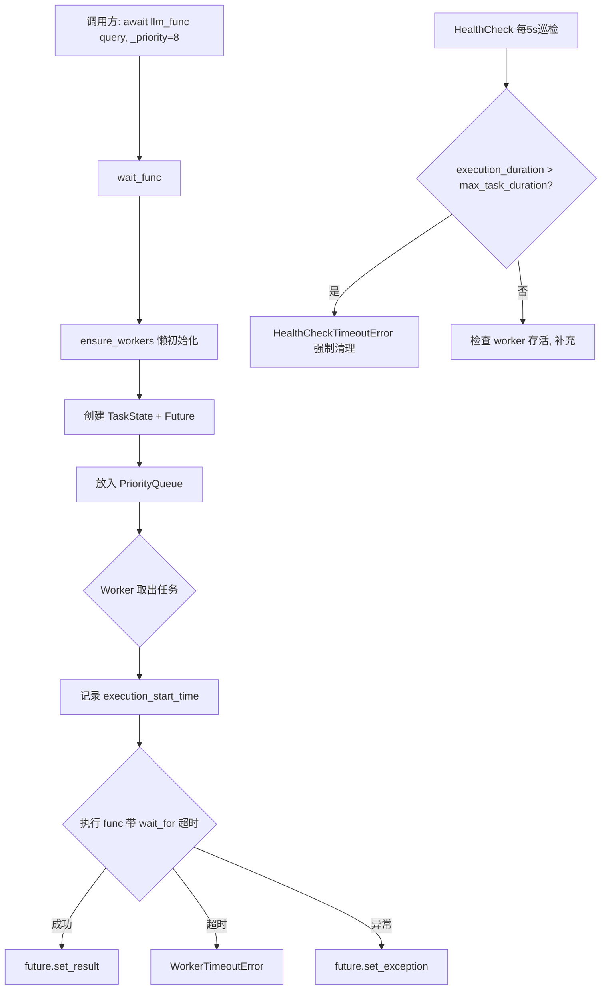
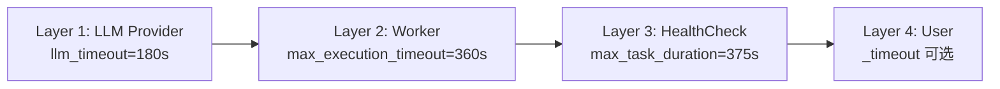
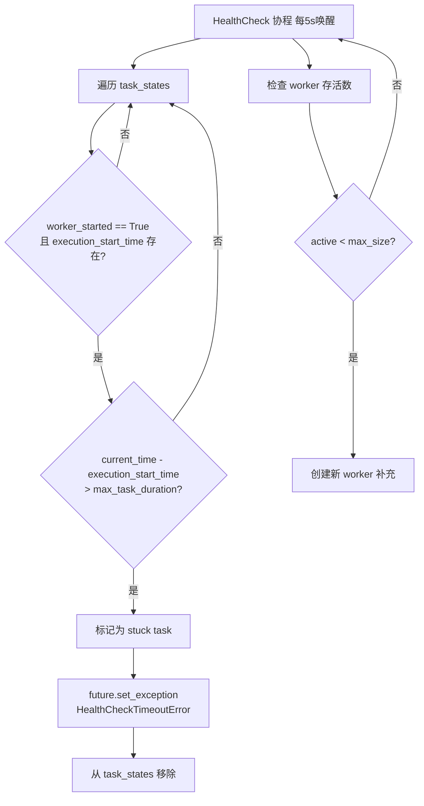

# PD-78.01 LightRAG — 优先级队列并发控制与多层超时保护

> 文档编号：PD-78.01
> 来源：LightRAG `lightrag/utils.py`, `lightrag/kg/shared_storage.py`, `lightrag/lightrag.py`
> GitHub：https://github.com/HKUDS/LightRAG.git
> 问题域：PD-78 并发控制 Concurrency Control
> 状态：可复用方案

---

## 第 1 章 问题与动机

### 1.1 核心问题

RAG 系统在运行时需要大量并发调用 LLM 和 Embedding 服务：知识图谱构建阶段的实体抽取（extract）、查询阶段的语义检索（query）、以及摘要生成等任务同时竞争有限的 API 配额。如果不加控制：

1. **资源耗尽**：数百个并发请求同时打到 LLM Provider，触发 rate limit 或 OOM
2. **优先级倒置**：用户实时查询被后台批量抽取任务阻塞，响应延迟飙升
3. **僵死任务**：LLM 偶发超时后任务卡死，占用 worker 槽位不释放
4. **多进程数据竞争**：Gunicorn 多 worker 部署时，多个进程同时写入知识图谱导致数据损坏

LightRAG 面对的场景尤其复杂——它同时支持单进程（uvicorn）和多进程（Gunicorn）部署，且知识图谱的实体级操作需要细粒度锁。

### 1.2 LightRAG 的解法概述

LightRAG 构建了一套完整的并发控制体系，核心由两大子系统组成：

1. **`priority_limit_async_func_call` 装饰器**（`lightrag/utils.py:616`）：基于 `asyncio.PriorityQueue` 的并发限制器，支持优先级调度、多层超时保护、stuck 任务自动检测与恢复
2. **`KeyedUnifiedLock` 锁管理器**（`lightrag/kg/shared_storage.py:529`）：支持 asyncio.Lock 和 multiprocessing.Lock 双模式的细粒度键控锁，自动适配单/多进程环境
3. **动态超时层级计算**（`lightrag/utils.py:652-662`）：基于 `llm_timeout` 自动推导 Worker 超时和 HealthCheck 超时，避免硬编码
4. **优先级差异化**（`lightrag/lightrag.py:2774`）：query 请求 `_priority=8`，默认 extract 请求 `_priority=10`，确保用户查询优先
5. **引用计数 + 延迟清理**（`lightrag/kg/shared_storage.py:469-526`）：锁的生命周期管理，避免内存泄漏

### 1.3 设计思想

| 设计原则 | 具体实现 | 理由 | 替代方案 |
|----------|----------|------|----------|
| 装饰器透明封装 | `priority_limit_async_func_call` 作为装饰器包裹 LLM/Embedding 函数 | 业务代码零侵入，调用方无需感知并发控制 | 在每个调用点手动 acquire/release semaphore |
| 动态超时层级 | 从 `llm_timeout` 自动计算 `max_execution_timeout = llm_timeout * 2`，`max_task_duration = llm_timeout * 2 + 15` | 不同 LLM Provider 超时差异大，硬编码不可维护 | 为每个 Provider 手动配置三层超时 |
| 优先级队列调度 | `asyncio.PriorityQueue` + `_priority` 参数，数值越小优先级越高 | 用户查询（实时）必须优先于后台抽取（批量） | FIFO 队列 + 独立队列隔离 |
| 双模式锁适配 | `UnifiedLock` 统一封装 `asyncio.Lock` 和 `multiprocessing.Lock` | 同一套代码同时支持 uvicorn 单进程和 Gunicorn 多 worker | 只支持单进程或只支持多进程 |
| 键控细粒度锁 | `KeyedUnifiedLock` 按 `namespace:key` 粒度加锁 | 实体级锁避免全局锁瓶颈，不同实体可并行写入 | 全局写锁序列化所有写操作 |
| 引用计数 + 延迟清理 | 锁释放后标记清理时间，达到阈值（500）且过期（300s）后批量清理 | 避免频繁创建/销毁锁对象，减少 Manager 通信开销 | 立即销毁或永不清理 |

---

## 第 2 章 源码实现分析

### 2.1 架构概览

LightRAG 的并发控制分为两层：**请求调度层**（PriorityQueue）和**数据保护层**（KeyedUnifiedLock）。

```
┌─────────────────────────────────────────────────────────────────┐
│                        LightRAG 实例                             │
│                                                                  │
│  ┌──────────────────────┐    ┌──────────────────────┐           │
│  │  LLM Model Function  │    │  Embedding Function   │           │
│  └──────────┬───────────┘    └──────────┬───────────┘           │
│             │                           │                        │
│  ┌──────────▼───────────┐    ┌──────────▼───────────┐           │
│  │ priority_limit_async  │    │ priority_limit_async  │           │
│  │ (max_async=4,         │    │ (max_async=8,         │           │
│  │  queue="LLM func")   │    │  queue="Embedding")   │           │
│  │                       │    │                       │           │
│  │ ┌─PriorityQueue────┐ │    │ ┌─PriorityQueue────┐ │           │
│  │ │ query  (_p=8) ▲  │ │    │ │ embed  (_p=10)   │ │           │
│  │ │ extract(_p=10)   │ │    │ │                   │ │           │
│  │ └──────────────────┘ │    │ └──────────────────┘ │           │
│  │                       │    │                       │           │
│  │ Workers(N) + Health   │    │ Workers(N) + Health   │           │
│  │ Check + Stuck Detect  │    │ Check + Stuck Detect  │           │
│  └───────────────────────┘    └───────────────────────┘           │
│                                                                  │
│  ┌──────────────────────────────────────────────────────────┐   │
│  │              KeyedUnifiedLock (shared_storage)             │   │
│  │                                                            │   │
│  │  单进程: asyncio.Lock per key                              │   │
│  │  多进程: Manager.Lock + asyncio.Lock (双层)                │   │
│  │                                                            │   │
│  │  namespace:entity_A ──→ Lock_A                             │   │
│  │  namespace:entity_B ──→ Lock_B  (可并行)                   │   │
│  │  namespace:entity_C ──→ Lock_C                             │   │
│  └──────────────────────────────────────────────────────────┘   │
└─────────────────────────────────────────────────────────────────┘
```

### 2.2 核心实现

#### 2.2.1 优先级队列并发控制器



对应源码 `lightrag/utils.py:616-1058`：

```python
# lightrag/utils.py:616-662
def priority_limit_async_func_call(
    max_size: int,
    llm_timeout: float = None,
    max_execution_timeout: float = None,
    max_task_duration: float = None,
    max_queue_size: int = 1000,
    cleanup_timeout: float = 2.0,
    queue_name: str = "limit_async",
):
    def final_decro(func):
        # 动态超时层级计算
        if llm_timeout is not None:
            nonlocal max_execution_timeout, max_task_duration
            if max_execution_timeout is None:
                max_execution_timeout = llm_timeout * 2  # Worker 超时 = LLM超时 × 2
            if max_task_duration is None:
                max_task_duration = llm_timeout * 2 + 15  # HealthCheck 超时 = Worker超时 + 15s

        queue = asyncio.PriorityQueue(maxsize=max_queue_size)
        tasks = set()
        task_states = {}  # task_id -> TaskState
        task_states_lock = asyncio.Lock()
        active_futures = weakref.WeakSet()
        ...
```

LightRAG 在初始化时将 LLM 和 Embedding 函数分别用此装饰器包裹（`lightrag/lightrag.py:553-557` 和 `lightrag/lightrag.py:664-668`）：

```python
# lightrag/lightrag.py:553-557 — Embedding 函数包裹
wrapped_func = priority_limit_async_func_call(
    self.embedding_func_max_async,          # 默认 8
    llm_timeout=self.default_embedding_timeout,  # 默认 30s
    queue_name="Embedding func",
)(self.embedding_func.func)

# lightrag/lightrag.py:664-668 — LLM 函数包裹
self.llm_model_func = priority_limit_async_func_call(
    self.llm_model_max_async,               # 默认 4
    llm_timeout=self.default_llm_timeout,   # 默认 180s
    queue_name="LLM func",
)(partial(self.llm_model_func, hashing_kv=hashing_kv, **self.llm_model_kwargs))
```

查询时通过 `_priority=8` 提升优先级（`lightrag/lightrag.py:2774`）：

```python
# lightrag/lightrag.py:2774 — query 请求优先级高于默认的 extract(_priority=10)
use_llm_func = partial(use_llm_func, _priority=8)
```

#### 2.2.2 多层超时保护机制



四层超时形成递进式保护网（`lightrag/utils.py:652-662`）：

| 层级 | 超时值（默认 LLM 180s） | 触发者 | 异常类型 |
|------|------------------------|--------|----------|
| L1 LLM Provider | 180s | LLM SDK 内部 | Provider 原生异常 |
| L2 Worker | 360s (`llm_timeout * 2`) | `asyncio.wait_for` | `WorkerTimeoutError` |
| L3 HealthCheck | 375s (`llm_timeout * 2 + 15`) | 后台巡检任务 | `HealthCheckTimeoutError` |
| L4 User | 调用方自定义 `_timeout` | `asyncio.wait_for` on Future | `TimeoutError` |

#### 2.2.3 Stuck 任务检测与恢复



对应源码 `lightrag/utils.py:770-837`：

```python
# lightrag/utils.py:770-813
async def enhanced_health_check():
    """Enhanced health check with stuck task detection and recovery"""
    while not shutdown_event.is_set():
        await asyncio.sleep(5)  # 每 5 秒巡检
        current_time = asyncio.get_event_loop().time()

        # 检测 stuck 任务
        if max_task_duration is not None:
            stuck_tasks = []
            async with task_states_lock:
                for task_id, task_state in list(task_states.items()):
                    if (task_state.worker_started
                        and task_state.execution_start_time is not None
                        and current_time - task_state.execution_start_time > max_task_duration):
                        stuck_tasks.append((task_id, current_time - task_state.execution_start_time))

            # 强制清理 stuck 任务
            for task_id, execution_duration in stuck_tasks:
                async with task_states_lock:
                    if task_id in task_states:
                        task_state = task_states[task_id]
                        if not task_state.future.done():
                            task_state.future.set_exception(
                                HealthCheckTimeoutError(max_task_duration, execution_duration))
                        task_states.pop(task_id, None)

        # Worker 存活检查与补充
        done_tasks = {t for t in set(tasks) if t.done()}
        tasks.difference_update(done_tasks)
        workers_needed = max_size - len(tasks)
        if workers_needed > 0:
            for _ in range(workers_needed):
                task = asyncio.create_task(worker())
                tasks.add(task)
```

### 2.3 实现细节

#### KeyedUnifiedLock 双模式锁

`KeyedUnifiedLock`（`lightrag/kg/shared_storage.py:529`）是 LightRAG 数据保护层的核心。它根据部署模式自动选择锁实现：

- **单进程模式**：每个 key 一个 `asyncio.Lock`，纯协程级别同步
- **多进程模式**：每个 key 一个 `Manager.Lock()`（跨进程）+ 一个 `asyncio.Lock()`（协程级），双层锁防止事件循环阻塞

锁获取顺序（`lightrag/kg/shared_storage.py:155-178`）：多进程模式下先获取 async_lock（防止协程阻塞），再获取 process_lock（跨进程互斥）。

键排序防死锁（`lightrag/kg/shared_storage.py:830`）：`_KeyedLockContext` 在 `__init__` 中对 keys 排序 `self._keys = sorted(keys)`，确保多键加锁时顺序一致。

引用计数与延迟清理（`lightrag/kg/shared_storage.py:474-526`）：锁释放时不立即销毁，而是记录清理时间戳。当待清理锁数量超过 `CLEANUP_THRESHOLD=500` 且最早的锁已过期 `CLEANUP_KEYED_LOCKS_AFTER_SECONDS=300s` 时，批量清理。

`asyncio.shield` 保护回滚（`lightrag/kg/shared_storage.py:905`）：锁获取失败时的回滚操作用 `asyncio.shield` 包裹，防止 `CancelledError` 中断回滚导致锁泄漏。


---

## 第 3 章 迁移指南

### 3.1 迁移清单

**阶段 1：优先级并发控制器（核心，1 个文件）**

- [ ] 复制 `TaskState` dataclass（6 行）
- [ ] 复制 `QueueFullError`、`WorkerTimeoutError`、`HealthCheckTimeoutError` 异常类
- [ ] 复制 `priority_limit_async_func_call` 装饰器函数（约 440 行）
- [ ] 在 LLM/Embedding 调用入口处应用装饰器
- [ ] 为不同调用场景设置 `_priority` 值（query < extract）

**阶段 2：双模式键控锁（按需，多进程部署时）**

- [ ] 复制 `UnifiedLock` 类（统一锁接口）
- [ ] 复制 `KeyedUnifiedLock` 类（键控锁管理器）
- [ ] 复制 `_KeyedLockContext` 类（上下文管理器）
- [ ] 复制 `initialize_share_data()` 初始化函数
- [ ] 在应用启动时调用 `initialize_share_data(workers=N)`

**阶段 3：集成与调优**

- [ ] 根据 LLM Provider 的实际超时调整 `llm_timeout`
- [ ] 根据并发需求调整 `max_size`（LLM 默认 4，Embedding 默认 8）
- [ ] 监控 HealthCheck 日志，确认 stuck 检测正常工作

### 3.2 适配代码模板

#### 模板 1：为任意异步函数添加优先级并发控制

```python
import asyncio
from dataclasses import dataclass
from functools import wraps
import weakref

@dataclass
class TaskState:
    future: asyncio.Future
    start_time: float
    execution_start_time: float = None
    worker_started: bool = False
    cancellation_requested: bool = False

def priority_limit_async(max_concurrency: int, base_timeout: float = 60.0, queue_name: str = "default"):
    """简化版优先级并发控制装饰器"""
    worker_timeout = base_timeout * 2
    health_check_timeout = base_timeout * 2 + 15

    def decorator(func):
        queue = asyncio.PriorityQueue(maxsize=1000)
        tasks = set()
        task_states = {}
        task_states_lock = asyncio.Lock()
        shutdown_event = asyncio.Event()
        initialized = False
        init_lock = asyncio.Lock()
        counter = 0

        async def worker():
            while not shutdown_event.is_set():
                try:
                    priority, count, task_id, args, kwargs = await asyncio.wait_for(
                        queue.get(), timeout=1.0
                    )
                except asyncio.TimeoutError:
                    continue

                async with task_states_lock:
                    if task_id not in task_states:
                        queue.task_done()
                        continue
                    state = task_states[task_id]
                    state.worker_started = True
                    state.execution_start_time = asyncio.get_event_loop().time()

                try:
                    result = await asyncio.wait_for(func(*args, **kwargs), timeout=worker_timeout)
                    if not state.future.done():
                        state.future.set_result(result)
                except asyncio.TimeoutError:
                    if not state.future.done():
                        state.future.set_exception(TimeoutError(f"{queue_name}: Worker timeout after {worker_timeout}s"))
                except Exception as e:
                    if not state.future.done():
                        state.future.set_exception(e)
                finally:
                    async with task_states_lock:
                        task_states.pop(task_id, None)
                    queue.task_done()

        async def health_check():
            while not shutdown_event.is_set():
                await asyncio.sleep(5)
                now = asyncio.get_event_loop().time()
                async with task_states_lock:
                    for tid, st in list(task_states.items()):
                        if (st.worker_started and st.execution_start_time
                                and now - st.execution_start_time > health_check_timeout):
                            if not st.future.done():
                                st.future.set_exception(
                                    TimeoutError(f"{queue_name}: Stuck task {tid} force-cleaned"))
                            task_states.pop(tid, None)
                # 补充 worker
                done = {t for t in tasks if t.done()}
                tasks.difference_update(done)
                for _ in range(max_concurrency - len(tasks)):
                    t = asyncio.create_task(worker())
                    tasks.add(t)

        async def ensure_init():
            nonlocal initialized
            if initialized:
                return
            async with init_lock:
                if initialized:
                    return
                for _ in range(max_concurrency):
                    t = asyncio.create_task(worker())
                    tasks.add(t)
                asyncio.create_task(health_check())
                initialized = True

        @wraps(func)
        async def wrapper(*args, _priority=10, **kwargs):
            nonlocal counter
            await ensure_init()
            task_id = f"{id(asyncio.current_task())}_{asyncio.get_event_loop().time()}"
            future = asyncio.Future()
            async with task_states_lock:
                task_states[task_id] = TaskState(future=future, start_time=asyncio.get_event_loop().time())
            async with init_lock:
                c = counter
                counter += 1
            await queue.put((_priority, c, task_id, args, kwargs))
            return await future

        return wrapper
    return decorator

# 使用示例
@priority_limit_async(max_concurrency=4, base_timeout=180.0, queue_name="LLM")
async def call_llm(prompt: str, model: str = "gpt-4") -> str:
    # 实际 LLM 调用
    ...

# 查询时提高优先级
from functools import partial
query_llm = partial(call_llm, _priority=8)
result = await query_llm("What is RAG?")
```

#### 模板 2：双模式键控锁（简化版）

```python
import asyncio
import os
from typing import Dict, Optional

class SimpleKeyedLock:
    """简化版键控锁，支持按 key 粒度加锁"""

    def __init__(self):
        self._locks: Dict[str, asyncio.Lock] = {}

    def __call__(self, *keys: str):
        return _KeyedContext(self, sorted(keys))  # 排序防死锁

    def _get_lock(self, key: str) -> asyncio.Lock:
        if key not in self._locks:
            self._locks[key] = asyncio.Lock()
        return self._locks[key]

class _KeyedContext:
    def __init__(self, parent: SimpleKeyedLock, keys: list[str]):
        self._parent = parent
        self._keys = keys
        self._acquired = []

    async def __aenter__(self):
        for key in self._keys:
            lock = self._parent._get_lock(key)
            await lock.acquire()
            self._acquired.append(lock)
        return self

    async def __aexit__(self, *exc):
        for lock in reversed(self._acquired):
            lock.release()
        self._acquired.clear()

# 使用示例
entity_lock = SimpleKeyedLock()

async def update_entity(entity_id: str, data: dict):
    async with entity_lock(entity_id):
        # 实体级互斥写入
        await storage.upsert(entity_id, data)

async def update_relation(src: str, tgt: str, data: dict):
    async with entity_lock(src, tgt):  # 多键加锁，自动排序
        await storage.upsert_relation(src, tgt, data)
```

### 3.3 适用场景

| 场景 | 适用度 | 说明 |
|------|--------|------|
| RAG 系统 LLM 并发控制 | ⭐⭐⭐ | 完美匹配：优先级区分 query/extract，多层超时保护 |
| 多 Agent 系统 API 调度 | ⭐⭐⭐ | 不同 Agent 任务可设不同优先级 |
| Gunicorn 多 worker 部署 | ⭐⭐⭐ | KeyedUnifiedLock 专为此场景设计 |
| 单进程 FastAPI 服务 | ⭐⭐ | 优先级队列有用，但 KeyedUnifiedLock 可简化为纯 asyncio.Lock |
| 批量数据处理管道 | ⭐⭐ | 优先级意义不大，但并发限制和超时保护仍有价值 |
| 客户端 SDK | ⭐ | 通常不需要这么重的并发控制 |

---

## 第 4 章 测试用例

```python
import asyncio
import pytest
import time

# ---- 测试 priority_limit_async_func_call ----

class TestPriorityLimitAsync:
    """测试优先级并发控制装饰器"""

    @pytest.mark.asyncio
    async def test_concurrency_limit(self):
        """验证并发数不超过 max_size"""
        concurrent_count = 0
        max_observed = 0

        @priority_limit_async(max_concurrency=2, base_timeout=10.0)
        async def slow_func():
            nonlocal concurrent_count, max_observed
            concurrent_count += 1
            max_observed = max(max_observed, concurrent_count)
            await asyncio.sleep(0.1)
            concurrent_count -= 1
            return "done"

        results = await asyncio.gather(*[slow_func() for _ in range(10)])
        assert all(r == "done" for r in results)
        assert max_observed <= 2

    @pytest.mark.asyncio
    async def test_priority_ordering(self):
        """验证高优先级任务优先执行"""
        execution_order = []

        @priority_limit_async(max_concurrency=1, base_timeout=10.0)
        async def tracked_func(name: str):
            execution_order.append(name)
            await asyncio.sleep(0.05)
            return name

        # 先提交低优先级任务填满队列
        tasks = []
        for i in range(3):
            tasks.append(asyncio.create_task(tracked_func(f"low_{i}", _priority=10)))
        await asyncio.sleep(0.01)  # 让低优先级任务入队

        # 再提交高优先级任务
        tasks.append(asyncio.create_task(tracked_func("high", _priority=1)))
        await asyncio.gather(*tasks)

        # 高优先级任务应在低优先级之前执行（第一个已在执行的除外）
        high_idx = execution_order.index("high")
        assert high_idx <= 1  # 最多排在第二个（第一个已在执行）

    @pytest.mark.asyncio
    async def test_worker_timeout(self):
        """验证 Worker 超时保护"""
        @priority_limit_async(max_concurrency=1, base_timeout=0.5)
        async def hanging_func():
            await asyncio.sleep(100)  # 模拟卡死

        with pytest.raises(TimeoutError):
            await hanging_func()

    @pytest.mark.asyncio
    async def test_stuck_task_recovery(self):
        """验证 stuck 任务被 HealthCheck 清理后 worker 恢复"""
        call_count = 0

        @priority_limit_async(max_concurrency=1, base_timeout=1.0)
        async def sometimes_stuck(should_hang: bool):
            nonlocal call_count
            call_count += 1
            if should_hang:
                await asyncio.sleep(100)
            return "ok"

        # 第一个任务卡死
        with pytest.raises(TimeoutError):
            await sometimes_stuck(True)

        # 第二个任务应正常执行（worker 已恢复）
        result = await sometimes_stuck(False)
        assert result == "ok"
        assert call_count == 2


class TestKeyedLock:
    """测试键控锁"""

    @pytest.mark.asyncio
    async def test_mutual_exclusion(self):
        """验证同一 key 互斥"""
        lock = SimpleKeyedLock()
        results = []

        async def writer(key: str, value: str):
            async with lock(key):
                results.append(f"start_{value}")
                await asyncio.sleep(0.05)
                results.append(f"end_{value}")

        await asyncio.gather(writer("k1", "a"), writer("k1", "b"))
        # 同一 key 应串行：start_a, end_a, start_b, end_b 或反序
        assert results[0].startswith("start_") and results[1].startswith("end_")

    @pytest.mark.asyncio
    async def test_different_keys_parallel(self):
        """验证不同 key 可并行"""
        lock = SimpleKeyedLock()
        timestamps = {}

        async def writer(key: str):
            async with lock(key):
                timestamps[f"{key}_start"] = time.monotonic()
                await asyncio.sleep(0.1)
                timestamps[f"{key}_end"] = time.monotonic()

        await asyncio.gather(writer("k1"), writer("k2"))
        # 不同 key 应并行：k2 在 k1 结束前就开始了
        assert timestamps["k2_start"] < timestamps["k1_end"]

    @pytest.mark.asyncio
    async def test_multi_key_deadlock_prevention(self):
        """验证多键加锁不死锁（通过排序）"""
        lock = SimpleKeyedLock()

        async def task_ab():
            async with lock("a", "b"):
                await asyncio.sleep(0.05)
                return "ab"

        async def task_ba():
            async with lock("b", "a"):  # 反序传入，内部应排序为 a, b
                await asyncio.sleep(0.05)
                return "ba"

        r1, r2 = await asyncio.gather(task_ab(), task_ba())
        assert r1 == "ab" and r2 == "ba"
```


---

## 第 5 章 跨域关联

| 关联域 | 关系类型 | 说明 |
|--------|----------|------|
| PD-03 容错与重试 | 协同 | 多层超时保护是容错的一部分；HealthCheck 的 stuck 任务恢复本质是自动重试的前置条件——清理卡死任务后 worker 槽位释放，新请求可重新调度 |
| PD-08 搜索与检索 | 依赖 | LightRAG 的 query 路径依赖 `priority_limit_async_func_call` 控制 LLM 并发；优先级 `_priority=8` 确保检索查询不被批量抽取阻塞 |
| PD-04 工具系统 | 协同 | 装饰器模式与工具系统的函数注册模式类似——都是对原始函数的透明增强，可组合使用 |
| PD-11 可观测性 | 协同 | `queue_name` 参数为每个队列提供日志标识；HealthCheck 的 stuck 检测日志是可观测性的重要数据源 |
| PD-01 上下文管理 | 间接 | 并发控制影响 LLM 调用吞吐量，间接影响上下文窗口的利用效率——更高并发意味着更快完成分块处理 |

---

## 第 6 章 来源文件索引

| 文件 | 行范围 | 关键实现 |
|------|--------|----------|
| `lightrag/utils.py` | L398-L407 | `TaskState` dataclass：任务状态追踪 |
| `lightrag/utils.py` | L589-L613 | `QueueFullError`、`WorkerTimeoutError`、`HealthCheckTimeoutError` 异常类 |
| `lightrag/utils.py` | L616-L662 | `priority_limit_async_func_call` 装饰器入口 + 动态超时计算 |
| `lightrag/utils.py` | L664-L768 | Worker 协程：任务取出、执行、超时保护、状态清理 |
| `lightrag/utils.py` | L770-L837 | `enhanced_health_check`：stuck 任务检测 + worker 存活补充 |
| `lightrag/utils.py` | L840-L895 | `ensure_workers`：懒初始化 worker 池 + health check |
| `lightrag/utils.py` | L897-L940 | `shutdown`：优雅关闭（cancel futures → drain queue → cancel workers） |
| `lightrag/utils.py` | L942-L1058 | `wait_func`：调用方入口，优先级入队 + 多层超时等待 |
| `lightrag/kg/shared_storage.py` | L137-L317 | `UnifiedLock`：统一锁接口，支持 sync/async 双模式 |
| `lightrag/kg/shared_storage.py` | L529-L654 | `KeyedUnifiedLock`：键控锁管理器，双模式锁创建/释放/清理 |
| `lightrag/kg/shared_storage.py` | L817-L1068 | `_KeyedLockContext`：上下文管理器，排序加锁 + shield 回滚 |
| `lightrag/kg/shared_storage.py` | L1176-L1264 | `initialize_share_data`：单/多进程初始化分支 |
| `lightrag/lightrag.py` | L296-L298 | `embedding_func_max_async` 配置（默认 8） |
| `lightrag/lightrag.py` | L344-L346 | `llm_model_max_async` 配置（默认 4） |
| `lightrag/lightrag.py` | L553-L557 | Embedding 函数装饰器应用 |
| `lightrag/lightrag.py` | L664-L668 | LLM 函数装饰器应用 |
| `lightrag/lightrag.py` | L2774 | Query 优先级提升 `_priority=8` |

---

## 第 7 章 横向对比维度

> **重要：** 本章用于自动填充 Butcher Wiki 的横向对比表。
> 必须严格按以下 JSON 格式输出，放在 `comparison_data` 代码块中。

```json comparison_data
{
  "project": "LightRAG",
  "dimensions": {
    "并发模型": "asyncio.PriorityQueue + N Worker 协程池，装饰器透明封装",
    "优先级调度": "数值优先级（query=8, extract=10），PriorityQueue 自动排序",
    "超时保护": "4层递进：LLM Provider → Worker(2x) → HealthCheck(2x+15) → User",
    "stuck检测": "HealthCheck 每5s巡检 execution_start_time，超时强制清理并补充 worker",
    "锁粒度": "KeyedUnifiedLock 按 namespace:key 细粒度锁，支持 asyncio/multiprocessing 双模式",
    "锁生命周期": "引用计数 + 延迟清理（阈值500，过期300s），批量回收减少 Manager 开销"
  }
}
```

### 域元数据补充

```json domain_metadata
{
  "solution_summary": "LightRAG 用 PriorityQueue+Worker 池装饰器实现 LLM 并发控制，4层超时递进保护，KeyedUnifiedLock 支持 asyncio/multiprocessing 双模式细粒度锁",
  "description": "协程与多进程混合部署下的细粒度并发控制与资源保护",
  "sub_problems": [
    "Worker 池动态补充与存活监控",
    "锁引用计数与延迟批量清理",
    "asyncio.shield 防取消中断回滚"
  ],
  "best_practices": [
    "键排序防死锁：多键加锁前 sorted(keys) 确保顺序一致",
    "asyncio.shield 包裹锁回滚操作防止 CancelledError 导致锁泄漏",
    "WeakSet 追踪 active_futures 避免内存泄漏"
  ]
}
```

