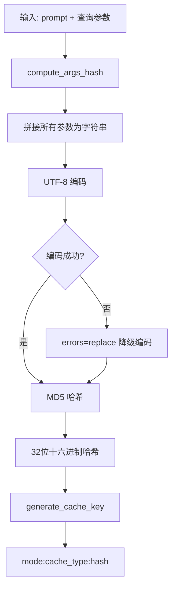
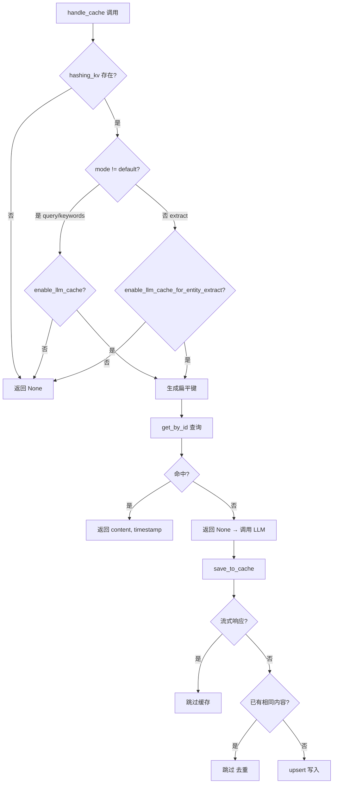

# PD-79.01 LightRAG — 扁平化 LLM 响应缓存系统

> 文档编号：PD-79.01
> 来源：LightRAG `lightrag/utils.py` `lightrag/operate.py` `lightrag/lightrag.py`
> GitHub：https://github.com/HKUDS/LightRAG.git
> 问题域：PD-79 LLM响应缓存 LLM Response Caching
> 状态：可复用方案

---

## 第 1 章 问题与动机

### 1.1 核心问题

RAG 系统中 LLM 调用是最昂贵的操作。LightRAG 在两个关键路径上产生大量 LLM 调用：

1. **文档摄入阶段**：每个文本 chunk 需要调用 LLM 做实体/关系抽取（entity extraction），还可能有 gleaning（多轮补充抽取）。一篇文档切成 50 个 chunk，每个 chunk 2 轮 gleaning，就是 150 次 LLM 调用。
2. **查询阶段**：每次用户查询需要先做关键词抽取（keywords extraction），再做最终回答生成（query response）。相同查询参数下的重复查询完全可以复用。

如果不做缓存，重新插入同一文档或重复查询会产生大量冗余 LLM 调用，浪费成本和时间。

### 1.2 LightRAG 的解法概述

LightRAG 实现了一套**扁平化键值缓存系统**，核心设计：

1. **MD5 哈希键生成**：`compute_args_hash()` 将 prompt + 所有影响输出的参数拼接后取 MD5，生成唯一缓存键（`lightrag/utils.py:530`）
2. **三段式扁平键**：`generate_cache_key()` 生成 `{mode}:{cache_type}:{hash}` 格式的扁平键，支持按 mode/type 维度管理（`lightrag/utils.py:560`）
3. **双开关独立控制**：`enable_llm_cache`（查询缓存）和 `enable_llm_cache_for_entity_extract`（抽取缓存）分别控制，互不干扰（`lightrag/lightrag.py:373-377`）
4. **去重写入检测**：`save_to_cache()` 写入前检查已有缓存内容是否相同，避免无意义的重复写入（`lightrag/utils.py:1442-1450`）
5. **chunk-cache 反向索引**：每个 chunk 维护 `llm_cache_list` 字段，记录该 chunk 产生的所有缓存键，支持文档删除时级联清理缓存（`lightrag/lightrag.py:1874`）

### 1.3 设计思想

| 设计原则 | 具体实现 | 理由 | 替代方案 |
|----------|----------|------|----------|
| 扁平化键结构 | `mode:type:hash` 三段式 | 便于按维度批量查询/清理，无嵌套 | 嵌套字典 `{mode: {type: {hash: data}}}` |
| 内容寻址 | MD5(prompt+params) 作为键 | 相同输入必然相同输出，天然幂等 | UUID 随机键（无法去重） |
| 双开关分离 | query 和 extract 独立开关 | 抽取缓存体积大但复用率高，查询缓存小但时效性要求高 | 单一全局开关 |
| 流式响应跳过 | `hasattr(content, "__aiter__")` 检测 | 流式响应无法序列化为完整字符串 | 收集完整流再缓存（增加延迟） |
| 反向索引清理 | chunk.llm_cache_list 记录缓存键 | 文档删除时可精确定位并清理关联缓存 | 全表扫描匹配（O(n) 性能差） |

---

## 第 2 章 源码实现分析

### 2.1 架构概览

LightRAG 的缓存系统由 4 个核心函数 + 1 个数据类 + 1 个统计计数器组成，分布在 `utils.py` 中，被 `operate.py`（查询/抽取逻辑）和 `lightrag.py`（文档生命周期）调用。

```
┌─────────────────────────────────────────────────────────────┐
│                     LightRAG 缓存架构                        │
├─────────────────────────────────────────────────────────────┤
│                                                             │
│  ┌──────────────┐    ┌──────────────┐    ┌──────────────┐  │
│  │  Query Path  │    │ Extract Path │    │ Keywords Path│  │
│  │ (operate.py  │    │ (utils.py    │    │ (operate.py  │  │
│  │  :3178)      │    │  :1936)      │    │  :3312)      │  │
│  └──────┬───────┘    └──────┬───────┘    └──────┬───────┘  │
│         │                   │                   │          │
│         ▼                   ▼                   ▼          │
│  ┌─────────────────────────────────────────────────────┐   │
│  │           compute_args_hash(*args) → MD5            │   │
│  │                  (utils.py:530)                      │   │
│  └──────────────────────┬──────────────────────────────┘   │
│                         ▼                                  │
│  ┌─────────────────────────────────────────────────────┐   │
│  │    generate_cache_key(mode, type, hash)              │   │
│  │    → "{mode}:{cache_type}:{hash}"                   │   │
│  │                  (utils.py:560)                      │   │
│  └──────────────────────┬──────────────────────────────┘   │
│                         ▼                                  │
│  ┌──────────────────┐       ┌──────────────────┐          │
│  │   handle_cache   │       │  save_to_cache   │          │
│  │   (读: 1375)     │       │  (写: 1421)      │          │
│  │                  │       │                  │          │
│  │ ① 检查开关      │       │ ① 跳过流式响应   │          │
│  │ ② 生成扁平键    │       │ ② 去重检测       │          │
│  │ ③ KV 存储查询   │       │ ③ 构建缓存条目   │          │
│  │ ④ 返回命中/未中 │       │ ④ upsert 写入    │          │
│  └──────────────────┘       └──────────────────┘          │
│                         ▼                                  │
│  ┌─────────────────────────────────────────────────────┐   │
│  │          BaseKVStorage (hashing_kv)                  │   │
│  │     扁平键值存储：key=mode:type:hash                  │   │
│  └─────────────────────────────────────────────────────┘   │
│                                                             │
│  ┌─────────────────────────────────────────────────────┐   │
│  │  statistic_data = {llm_call:0, llm_cache:0, ...}   │   │
│  │                  (utils.py:273)                      │   │
│  └─────────────────────────────────────────────────────┘   │
└─────────────────────────────────────────────────────────────┘
```

### 2.2 核心实现

#### 2.2.1 缓存键生成：compute_args_hash + generate_cache_key



对应源码 `lightrag/utils.py:530-571`：

```python
def compute_args_hash(*args: Any) -> str:
    """Compute a hash for the given arguments with safe Unicode handling."""
    args_str = "".join([str(arg) for arg in args])
    try:
        return md5(args_str.encode("utf-8")).hexdigest()
    except UnicodeEncodeError:
        safe_bytes = args_str.encode("utf-8", errors="replace")
        return md5(safe_bytes).hexdigest()


def generate_cache_key(mode: str, cache_type: str, hash_value: str) -> str:
    """Generate a flattened cache key in the format {mode}:{cache_type}:{hash}"""
    return f"{mode}:{cache_type}:{hash_value}"


def parse_cache_key(cache_key: str) -> tuple[str, str, str] | None:
    """Parse a flattened cache key back into its components"""
    parts = cache_key.split(":", 2)
    if len(parts) == 3:
        return parts[0], parts[1], parts[2]
    return None
```

关键设计点：
- `compute_args_hash` 接受可变参数 `*args`，将所有参数字符串化后拼接取 MD5。查询路径传入 `(mode, query, response_type, top_k, ...)` 共 11 个参数（`operate.py:3178-3191`），确保任何参数变化都产生不同的缓存键。
- `generate_cache_key` 用冒号分隔的三段式结构，使得可以通过前缀匹配批量操作同一 mode 或 type 的缓存。
- `parse_cache_key` 提供反向解析能力，用 `split(":", 2)` 确保 hash 中如果包含冒号也不会被错误分割。

#### 2.2.2 缓存读写：handle_cache + save_to_cache



对应源码 `lightrag/utils.py:1375-1466`：

```python
async def handle_cache(
    hashing_kv, args_hash, prompt, mode="default", cache_type="unknown",
) -> tuple[str, int] | None:
    if hashing_kv is None:
        return None
    if mode != "default":  # query/keywords 路径
        if not hashing_kv.global_config.get("enable_llm_cache"):
            return None
    else:  # entity extraction 路径
        if not hashing_kv.global_config.get("enable_llm_cache_for_entity_extract"):
            return None
    flattened_key = generate_cache_key(mode, cache_type, args_hash)
    cache_entry = await hashing_kv.get_by_id(flattened_key)
    if cache_entry:
        content = cache_entry["return"]
        timestamp = cache_entry.get("create_time", 0)
        return content, timestamp
    return None


async def save_to_cache(hashing_kv, cache_data: CacheData):
    if hashing_kv is None or not cache_data.content:
        return
    if hasattr(cache_data.content, "__aiter__"):  # 流式响应检测
        return
    flattened_key = generate_cache_key(
        cache_data.mode, cache_data.cache_type, cache_data.args_hash
    )
    existing_cache = await hashing_kv.get_by_id(flattened_key)
    if existing_cache:
        if existing_cache.get("return") == cache_data.content:
            logger.warning(f"Cache duplication detected for {flattened_key}, skipping")
            return
    cache_entry = {
        "return": cache_data.content,
        "cache_type": cache_data.cache_type,
        "chunk_id": cache_data.chunk_id,
        "original_prompt": cache_data.prompt,
        "queryparam": cache_data.queryparam,
    }
    await hashing_kv.upsert({flattened_key: cache_entry})
```

关键设计点：
- `handle_cache` 通过 `mode` 参数区分查询路径和抽取路径，分别检查不同的开关。`mode="default"` 表示 entity extraction（内部调用），其他 mode（local/global/hybrid/mix）表示用户查询。
- `save_to_cache` 的去重检测是**内容级别**的：即使键相同，只有内容也相同才跳过。如果同一键的内容变了（比如 LLM 非确定性输出），会覆盖更新。
- 缓存条目保存了 `original_prompt` 和 `queryparam`，便于调试和审计。

### 2.3 实现细节

#### 2.3.1 use_llm_func_with_cache：抽取路径的缓存封装

`use_llm_func_with_cache`（`utils.py:1936-2054`）是 entity extraction 路径的缓存封装函数，它额外实现了：

1. **文本消毒**：调用 `sanitize_text_for_encoding()` 处理 Unicode 问题，确保缓存键的稳定性
2. **history 序列化**：将 `history_messages` JSON 序列化后纳入哈希计算，确保多轮 gleaning 的不同轮次产生不同缓存键
3. **cache_keys_collector 模式**：通过传入一个列表收集器，批量收集一个 chunk 处理过程中产生的所有缓存键，最后一次性更新 `llm_cache_list`

```python
# operate.py:2844-2968 — entity extraction 中的 collector 模式
cache_keys_collector = []

# 初始抽取
await use_llm_func_with_cache(
    ..., cache_keys_collector=cache_keys_collector,
)

# gleaning 轮次
for glean_round in range(gleaning_count):
    await use_llm_func_with_cache(
        ..., cache_keys_collector=cache_keys_collector,
    )

# 批量更新 chunk 的缓存引用
if cache_keys_collector and text_chunks_storage:
    await update_chunk_cache_list(
        chunk_key, text_chunks_storage, cache_keys_collector, "entity_extraction",
    )
```

#### 2.3.2 缓存统计与可观测性

全局统计计数器 `statistic_data`（`utils.py:273`）记录 `llm_call` 和 `llm_cache` 次数，可以计算缓存命中率：

```python
statistic_data = {"llm_call": 0, "llm_cache": 0, "embed_call": 0}
# 缓存命中时：statistic_data["llm_cache"] += 1  (utils.py:2013)
# 缓存未中时：statistic_data["llm_call"] += 1   (utils.py:2020)
```

#### 2.3.3 文档删除时的缓存级联清理

`adelete_by_doc_id`（`lightrag.py:2989`）支持 `delete_llm_cache=True` 参数，通过 chunk 的 `llm_cache_list` 反向索引精确定位并删除关联缓存：

```python
# lightrag.py:3177-3226 — 收集缓存 ID
if delete_llm_cache and chunk_ids:
    chunk_data_list = await self.text_chunks.get_by_ids(list(chunk_ids))
    seen_cache_ids: set[str] = set()
    for chunk_data in chunk_data_list:
        cache_ids = chunk_data.get("llm_cache_list", [])
        for cache_id in cache_ids:
            if isinstance(cache_id, str) and cache_id not in seen_cache_ids:
                doc_llm_cache_ids.append(cache_id)
                seen_cache_ids.add(cache_id)

# lightrag.py:3630-3645 — 批量删除缓存
if delete_llm_cache and doc_llm_cache_ids and self.llm_response_cache:
    await self.llm_response_cache.delete(doc_llm_cache_ids)
```


---

## 第 3 章 迁移指南

### 3.1 迁移清单

**阶段 1：基础缓存层（必须）**
- [ ] 实现 `compute_args_hash(*args)` 哈希函数
- [ ] 实现 `generate_cache_key(mode, type, hash)` 扁平键生成
- [ ] 实现 `CacheData` 数据类
- [ ] 实现 `handle_cache()` 缓存读取（含开关检查）
- [ ] 实现 `save_to_cache()` 缓存写入（含去重检测 + 流式跳过）
- [ ] 接入 KV 存储后端（Redis / 文件 / 内存）

**阶段 2：业务集成（按需）**
- [ ] 查询路径接入缓存（query + keywords extraction）
- [ ] 抽取路径接入缓存（entity extraction + gleaning）
- [ ] 实现 `cache_keys_collector` 批量收集模式
- [ ] chunk 数据结构添加 `llm_cache_list` 字段

**阶段 3：生命周期管理（推荐）**
- [ ] 文档删除时级联清理缓存（反向索引）
- [ ] 缓存统计计数器（命中率监控）
- [ ] 双开关配置（query 缓存 vs extract 缓存独立控制）

### 3.2 适配代码模板

以下是可直接复用的缓存层实现，不依赖 LightRAG 的其他模块：

```python
"""llm_cache.py — 可移植的 LLM 响应缓存层"""
from dataclasses import dataclass, field
from hashlib import md5
from typing import Any, Protocol
import time
import logging

logger = logging.getLogger(__name__)


class KVStorage(Protocol):
    """缓存存储后端协议"""
    async def get(self, key: str) -> dict | None: ...
    async def set(self, key: str, value: dict) -> None: ...
    async def delete(self, keys: list[str]) -> None: ...


# ---- 缓存键生成 ----

def compute_args_hash(*args: Any) -> str:
    """将任意参数哈希为 MD5，作为缓存键的一部分"""
    args_str = "".join(str(a) for a in args)
    try:
        return md5(args_str.encode("utf-8")).hexdigest()
    except UnicodeEncodeError:
        return md5(args_str.encode("utf-8", errors="replace")).hexdigest()


def make_cache_key(mode: str, cache_type: str, hash_val: str) -> str:
    """生成扁平化缓存键: {mode}:{cache_type}:{hash}"""
    return f"{mode}:{cache_type}:{hash_val}"


def parse_cache_key(key: str) -> tuple[str, str, str] | None:
    """反向解析缓存键"""
    parts = key.split(":", 2)
    return (parts[0], parts[1], parts[2]) if len(parts) == 3 else None


# ---- 缓存数据结构 ----

@dataclass
class CacheEntry:
    args_hash: str
    content: str
    prompt: str
    mode: str = "default"
    cache_type: str = "query"
    metadata: dict = field(default_factory=dict)


# ---- 缓存读写 ----

class LLMCache:
    def __init__(
        self,
        storage: KVStorage,
        enable_query_cache: bool = True,
        enable_extract_cache: bool = True,
    ):
        self.storage = storage
        self.enable_query_cache = enable_query_cache
        self.enable_extract_cache = enable_extract_cache
        self.stats = {"hits": 0, "misses": 0}

    async def get(
        self, args_hash: str, mode: str, cache_type: str
    ) -> tuple[str, int] | None:
        """读取缓存，返回 (content, timestamp) 或 None"""
        # 开关检查
        if mode == "default" and not self.enable_extract_cache:
            return None
        if mode != "default" and not self.enable_query_cache:
            return None

        key = make_cache_key(mode, cache_type, args_hash)
        entry = await self.storage.get(key)
        if entry:
            self.stats["hits"] += 1
            return entry["content"], entry.get("timestamp", 0)
        self.stats["misses"] += 1
        return None

    async def put(self, entry: CacheEntry) -> str | None:
        """写入缓存，返回缓存键。流式响应和重复内容会被跳过"""
        if not entry.content or hasattr(entry.content, "__aiter__"):
            return None

        key = make_cache_key(entry.mode, entry.cache_type, entry.args_hash)

        # 去重检测
        existing = await self.storage.get(key)
        if existing and existing.get("content") == entry.content:
            logger.debug(f"Cache dedup: {key}")
            return key

        await self.storage.set(key, {
            "content": entry.content,
            "prompt": entry.prompt,
            "cache_type": entry.cache_type,
            "timestamp": int(time.time()),
            **entry.metadata,
        })
        return key

    async def delete_keys(self, keys: list[str]) -> None:
        """批量删除缓存条目"""
        if keys:
            await self.storage.delete(keys)

    @property
    def hit_rate(self) -> float:
        total = self.stats["hits"] + self.stats["misses"]
        return self.stats["hits"] / total if total > 0 else 0.0
```

### 3.3 适用场景

| 场景 | 适用度 | 说明 |
|------|--------|------|
| RAG 系统（文档摄入 + 查询） | ⭐⭐⭐ | 完美匹配：抽取缓存避免重复处理，查询缓存加速重复问题 |
| 多轮对话系统 | ⭐⭐ | 需要将 history 纳入哈希，LightRAG 已有此设计 |
| 批量文档处理管线 | ⭐⭐⭐ | collector 模式 + 反向索引非常适合批量场景 |
| 实时流式问答 | ⭐ | 流式响应无法缓存，仅能缓存非流式回退 |
| 多租户 SaaS | ⭐⭐ | 需要在 cache_key 中加入 tenant_id 维度 |

---

## 第 4 章 测试用例

```python
"""test_llm_cache.py — 基于 LightRAG 缓存设计的测试用例"""
import pytest
import time
from unittest.mock import AsyncMock, MagicMock


# ---- 测试 compute_args_hash ----

class TestComputeArgsHash:
    def test_deterministic(self):
        """相同参数产生相同哈希"""
        from lightrag.utils import compute_args_hash
        h1 = compute_args_hash("hello", "world", 42)
        h2 = compute_args_hash("hello", "world", 42)
        assert h1 == h2

    def test_different_args_different_hash(self):
        """不同参数产生不同哈希"""
        from lightrag.utils import compute_args_hash
        h1 = compute_args_hash("query1", "local", 10)
        h2 = compute_args_hash("query2", "local", 10)
        assert h1 != h2

    def test_unicode_safety(self):
        """Unicode 字符不会导致崩溃"""
        from lightrag.utils import compute_args_hash
        h = compute_args_hash("你好世界", "🎉", "\ud800")  # 含代理字符
        assert isinstance(h, str) and len(h) == 32

    def test_param_order_matters(self):
        """参数顺序影响哈希值"""
        from lightrag.utils import compute_args_hash
        h1 = compute_args_hash("a", "b")
        h2 = compute_args_hash("b", "a")
        assert h1 != h2


# ---- 测试 generate_cache_key / parse_cache_key ----

class TestCacheKey:
    def test_roundtrip(self):
        from lightrag.utils import generate_cache_key, parse_cache_key
        key = generate_cache_key("local", "query", "abc123")
        assert key == "local:query:abc123"
        parsed = parse_cache_key(key)
        assert parsed == ("local", "query", "abc123")

    def test_parse_invalid(self):
        from lightrag.utils import parse_cache_key
        assert parse_cache_key("invalid") is None
        assert parse_cache_key("only:two") is None

    def test_hash_with_colon(self):
        """哈希值中包含冒号不会破坏解析"""
        from lightrag.utils import generate_cache_key, parse_cache_key
        key = generate_cache_key("mode", "type", "hash:with:colons")
        parsed = parse_cache_key(key)
        assert parsed == ("mode", "type", "hash:with:colons")


# ---- 测试 handle_cache ----

class TestHandleCache:
    @pytest.mark.asyncio
    async def test_cache_hit(self):
        """缓存命中返回 (content, timestamp)"""
        from lightrag.utils import handle_cache
        mock_kv = AsyncMock()
        mock_kv.global_config = {"enable_llm_cache": True}
        mock_kv.get_by_id = AsyncMock(return_value={
            "return": "cached answer", "create_time": 1700000000
        })
        result = await handle_cache(mock_kv, "hash123", "prompt", "local", "query")
        assert result == ("cached answer", 1700000000)

    @pytest.mark.asyncio
    async def test_cache_disabled(self):
        """开关关闭时返回 None"""
        from lightrag.utils import handle_cache
        mock_kv = AsyncMock()
        mock_kv.global_config = {"enable_llm_cache": False}
        result = await handle_cache(mock_kv, "hash123", "prompt", "local", "query")
        assert result is None

    @pytest.mark.asyncio
    async def test_extract_cache_separate_switch(self):
        """entity extract 使用独立开关"""
        from lightrag.utils import handle_cache
        mock_kv = AsyncMock()
        mock_kv.global_config = {
            "enable_llm_cache": True,
            "enable_llm_cache_for_entity_extract": False,
        }
        # query 缓存开启，extract 缓存关闭
        mock_kv.get_by_id = AsyncMock(return_value={"return": "x", "create_time": 0})
        assert await handle_cache(mock_kv, "h", "p", "local", "query") is not None
        assert await handle_cache(mock_kv, "h", "p", "default", "extract") is None


# ---- 测试 save_to_cache ----

class TestSaveToCache:
    @pytest.mark.asyncio
    async def test_skip_streaming(self):
        """流式响应不缓存"""
        from lightrag.utils import save_to_cache, CacheData
        mock_kv = AsyncMock()
        stream = MagicMock()
        stream.__aiter__ = MagicMock()
        data = CacheData(args_hash="h", content=stream, prompt="p")
        await save_to_cache(mock_kv, data)
        mock_kv.upsert.assert_not_called()

    @pytest.mark.asyncio
    async def test_dedup_detection(self):
        """相同内容不重复写入"""
        from lightrag.utils import save_to_cache, CacheData
        mock_kv = AsyncMock()
        mock_kv.get_by_id = AsyncMock(return_value={"return": "same content"})
        data = CacheData(args_hash="h", content="same content", prompt="p")
        await save_to_cache(mock_kv, data)
        mock_kv.upsert.assert_not_called()
```


---

## 第 5 章 跨域关联

| 关联域 | 关系类型 | 说明 |
|--------|----------|------|
| PD-08 搜索与检索 | 协同 | 缓存系统直接服务于 RAG 查询路径，缓存命中可跳过整个检索+生成流程 |
| PD-11 可观测性 | 协同 | `statistic_data` 计数器提供缓存命中率指标，是成本追踪的数据源 |
| PD-01 上下文管理 | 依赖 | 缓存键的哈希输入包含 prompt 全文，上下文压缩/截断会改变缓存键 |
| PD-03 容错与重试 | 协同 | 缓存命中可作为 LLM 调用失败时的降级回退源 |
| PD-06 记忆持久化 | 互补 | 缓存是短期精确匹配（相同输入→相同输出），记忆是长期语义匹配（相似场景→经验复用） |

---

## 第 6 章 来源文件索引

| 文件 | 行范围 | 关键实现 |
|------|--------|----------|
| `lightrag/utils.py` | L273 | `statistic_data` 全局缓存统计计数器 |
| `lightrag/utils.py` | L530-548 | `compute_args_hash()` MD5 哈希键生成 |
| `lightrag/utils.py` | L560-571 | `generate_cache_key()` 扁平键生成 |
| `lightrag/utils.py` | L574-586 | `parse_cache_key()` 键反向解析 |
| `lightrag/utils.py` | L1375-1407 | `handle_cache()` 缓存读取 + 双开关检查 |
| `lightrag/utils.py` | L1410-1418 | `CacheData` 数据类定义 |
| `lightrag/utils.py` | L1421-1466 | `save_to_cache()` 缓存写入 + 去重 + 流式跳过 |
| `lightrag/utils.py` | L1886-1925 | `update_chunk_cache_list()` chunk 反向索引更新 |
| `lightrag/utils.py` | L1936-2054 | `use_llm_func_with_cache()` 抽取路径缓存封装 |
| `lightrag/operate.py` | L3178-3236 | 查询路径缓存集成（kg_query） |
| `lightrag/operate.py` | L3312-3395 | 关键词抽取缓存集成（extract_keywords） |
| `lightrag/operate.py` | L2844-2968 | entity extraction 的 collector 模式 |
| `lightrag/lightrag.py` | L373-377 | `enable_llm_cache` / `enable_llm_cache_for_entity_extract` 配置 |
| `lightrag/lightrag.py` | L1874 | chunk 初始化 `llm_cache_list: []` |
| `lightrag/lightrag.py` | L2989-3645 | `adelete_by_doc_id()` 缓存级联删除 |

---

## 第 7 章 横向对比维度

```json comparison_data
{
  "project": "LightRAG",
  "dimensions": {
    "缓存策略": "MD5 内容寻址 + 扁平化三段式键 mode:type:hash",
    "缓存粒度": "双开关分离：query 缓存与 entity_extract 缓存独立控制",
    "去重机制": "写入前内容级比对，相同内容跳过 upsert",
    "流式处理": "检测 __aiter__ 属性，流式响应直接跳过缓存",
    "缓存清理": "chunk→cache 反向索引，文档删除时精确级联清理",
    "可观测性": "全局 statistic_data 计数器统计 llm_call/llm_cache 次数"
  }
}
```

### 域元数据补充

```json domain_metadata
{
  "solution_summary": "LightRAG 用 MD5 内容寻址 + mode:type:hash 三段式扁平键实现双路径（query/extract）独立缓存，支持去重写入检测、流式响应跳过和 chunk→cache 反向索引级联清理",
  "description": "RAG 系统中文档摄入与查询双路径的 LLM 调用缓存与生命周期管理",
  "sub_problems": [
    "缓存与文档生命周期的级联删除",
    "批量抽取场景的缓存键收集与反向索引维护"
  ],
  "best_practices": [
    "chunk 维护 llm_cache_list 反向索引支持精确级联清理",
    "cache_keys_collector 模式批量收集后一次性更新减少 IO"
  ]
}
```

