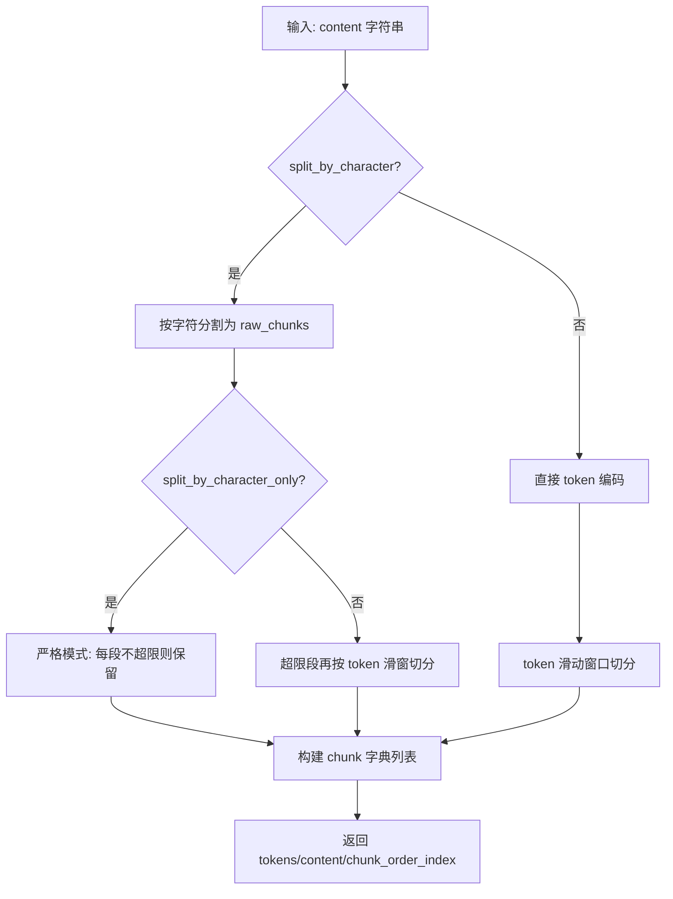
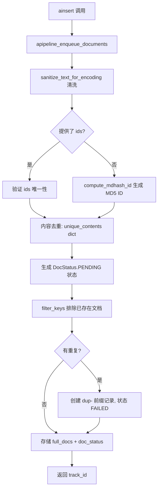

# PD-80.01 LightRAG — 多格式文档处理管道与 Token 级分块引擎

> 文档编号：PD-80.01
> 来源：LightRAG `lightrag/operate.py` `lightrag/api/routers/document_routes.py` `lightrag/base.py` `lightrag/lightrag.py`
> GitHub：https://github.com/HKUDS/LightRAG.git
> 问题域：PD-80 文档处理管道 Document Processing Pipeline
> 状态：可复用方案

---

## 第 1 章 问题与动机

### 1.1 核心问题

RAG 系统的文档处理管道面临多重工程挑战：

1. **多格式解析**：用户上传的文档格式多样（PDF、DOCX、PPTX、XLSX、Markdown、代码文件等），每种格式需要不同的解析策略，且解析质量直接影响下游检索效果。
2. **分块策略**：文档需要被切分为适合 embedding 和 LLM 上下文窗口的 chunk，分块粒度过大导致检索噪声，过小则丢失语义连贯性。
3. **管道状态管理**：大批量文档处理是长时间异步任务，需要精确追踪每个文档的处理状态（排队、处理中、已完成、失败），支持断点续传和失败重试。
4. **管道取消与并发控制**：用户可能需要中途取消处理，系统需要在多个异步阶段优雅地响应取消请求，同时控制并发度避免资源耗尽。

### 1.2 LightRAG 的解法概述

LightRAG 实现了一套完整的文档处理管道，核心设计要点：

1. **两阶段入队-处理分离**：`apipeline_enqueue_documents` 负责文档验证、去重和入队，`apipeline_process_enqueue_documents` 负责实际的分块和实体抽取，两阶段解耦（`lightrag/lightrag.py:1265-1442`）。
2. **可注入的分块函数**：`chunking_func` 作为 `LightRAG` dataclass 的可配置字段，默认使用 `chunking_by_token_size`，用户可替换为自定义实现（`lightrag/lightrag.py:249-282`）。
3. **5 态文档状态机**：`DocStatus` 枚举定义 PENDING → PROCESSING → PREPROCESSED → PROCESSED / FAILED 五种状态，配合 `DocProcessingStatus` dataclass 记录完整元数据（`lightrag/base.py:705-760`）。
4. **协作式取消机制**：通过 `pipeline_status["cancellation_requested"]` 标志位 + `PipelineCancelledException` 异常，在分块、实体抽取、合并等多个阶段检查取消请求（`lightrag/lightrag.py:1806-1807`）。
5. **多格式解析引擎**：API 层通过 `match ext` 分发到不同解析器（pypdf、python-docx、python-pptx、openpyxl），并支持可选的 Docling 引擎作为高级 PDF 解析后端（`lightrag/api/routers/document_routes.py:1269-1399`）。

### 1.3 设计思想

| 设计原则 | 具体实现 | 理由 | 替代方案 |
|----------|----------|------|----------|
| 入队与处理分离 | enqueue + process 两个独立 async 方法 | 允许批量入队后统一处理，支持后台异步 | 单一 insert 方法同步处理 |
| 策略模式分块 | `chunking_func` 可注入 Callable | 不同场景需要不同分块策略（按段落、按语义等） | 硬编码单一分块算法 |
| 协作式取消 | 标志位 + 异常，多检查点 | 避免强制 kill 导致数据不一致 | asyncio.Task.cancel() 强制取消 |
| 状态机追踪 | 5 态 DocStatus + DocStatusStorage 抽象 | 支持断点续传、失败重试、进度查询 | 简单 bool 标记 |
| 解析引擎可切换 | Docling 可选，pypdf 兜底 | Docling 质量更高但依赖重，pypdf 轻量 | 只支持单一解析库 |

---

## 第 2 章 源码实现分析

### 2.1 架构概览

LightRAG 的文档处理管道由 4 层组成：API 路由层、核心引擎层、分块层、存储层。

```
┌─────────────────────────────────────────────────────────────────┐
│                     API 路由层 (FastAPI)                         │
│  document_routes.py: upload / scan / insert_text / cancel       │
│  ┌──────────┐  ┌──────────┐  ┌───────────┐  ┌──────────────┐  │
│  │ /upload   │  │ /scan    │  │/text      │  │/cancel       │  │
│  │ 文件上传  │  │ 目录扫描 │  │ 文本插入  │  │ 管道取消     │  │
│  └─────┬────┘  └────┬─────┘  └─────┬─────┘  └──────┬───────┘  │
│        │            │              │                │           │
│  ┌─────▼────────────▼──────────────▼────────────────▼────────┐ │
│  │  extract_and_enqueue_file() — 多格式解析 + 入队            │ │
│  │  _extract_pdf_pypdf / _extract_docx / _extract_pptx / ... │ │
│  └───────────────────────────┬───────────────────────────────┘ │
└──────────────────────────────┼─────────────────────────────────┘
                               │
┌──────────────────────────────▼─────────────────────────────────┐
│                    核心引擎层 (LightRAG)                        │
│  lightrag.py: apipeline_enqueue_documents()                    │
│               apipeline_process_enqueue_documents()             │
│  ┌────────────────┐    ┌─────────────────────────────────────┐ │
│  │ 1. 入队阶段     │    │ 2. 处理阶段                         │ │
│  │ - 验证/去重     │───→│ - 获取 PENDING/FAILED/PROCESSING 文档│ │
│  │ - 生成 doc_id   │    │ - 一致性校验                        │ │
│  │ - 存储 full_doc │    │ - 并发处理 (Semaphore)              │ │
│  │ - 设置 PENDING  │    │ - 分块 → 实体抽取 → 合并            │ │
│  └────────────────┘    └─────────────────────────────────────┘ │
└──────────────────────────────┬─────────────────────────────────┘
                               │
┌──────────────────────────────▼─────────────────────────────────┐
│                      分块层 (operate.py)                        │
│  chunking_by_token_size(tokenizer, content, ...)               │
│  - 支持 split_by_character 自定义分隔符                         │
│  - 支持 split_by_character_only 严格模式                        │
│  - token 级滑动窗口 + 重叠                                     │
└──────────────────────────────┬─────────────────────────────────┘
                               │
┌──────────────────────────────▼─────────────────────────────────┐
│                      存储层 (base.py)                           │
│  DocStatusStorage / BaseKVStorage / BaseVectorStorage           │
│  - doc_status: 文档状态追踪                                     │
│  - full_docs: 原始文档内容                                      │
│  - text_chunks: 分块后的文本                                    │
│  - chunks_vdb: 分块向量索引                                     │
└────────────────────────────────────────────────────────────────┘
```

### 2.2 核心实现

#### 2.2.1 Token 级分块引擎



对应源码 `lightrag/operate.py:99-162`：

```python
def chunking_by_token_size(
    tokenizer: Tokenizer,
    content: str,
    split_by_character: str | None = None,
    split_by_character_only: bool = False,
    chunk_overlap_token_size: int = 100,
    chunk_token_size: int = 1200,
) -> list[dict[str, Any]]:
    tokens = tokenizer.encode(content)
    results: list[dict[str, Any]] = []
    if split_by_character:
        raw_chunks = content.split(split_by_character)
        new_chunks = []
        if split_by_character_only:
            for chunk in raw_chunks:
                _tokens = tokenizer.encode(chunk)
                if len(_tokens) > chunk_token_size:
                    raise ChunkTokenLimitExceededError(
                        chunk_tokens=len(_tokens),
                        chunk_token_limit=chunk_token_size,
                        chunk_preview=chunk[:120],
                    )
                new_chunks.append((len(_tokens), chunk))
        else:
            for chunk in raw_chunks:
                _tokens = tokenizer.encode(chunk)
                if len(_tokens) > chunk_token_size:
                    for start in range(
                        0, len(_tokens), chunk_token_size - chunk_overlap_token_size
                    ):
                        chunk_content = tokenizer.decode(
                            _tokens[start : start + chunk_token_size]
                        )
                        new_chunks.append(
                            (min(chunk_token_size, len(_tokens) - start), chunk_content)
                        )
                else:
                    new_chunks.append((len(_tokens), chunk))
        for index, (_len, chunk) in enumerate(new_chunks):
            results.append(
                {"tokens": _len, "content": chunk.strip(), "chunk_order_index": index}
            )
    else:
        for index, start in enumerate(
            range(0, len(tokens), chunk_token_size - chunk_overlap_token_size)
        ):
            chunk_content = tokenizer.decode(tokens[start : start + chunk_token_size])
            results.append(
                {"tokens": min(chunk_token_size, len(tokens) - start),
                 "content": chunk_content.strip(), "chunk_order_index": index}
            )
    return results
```

关键设计点：
- **三种分块模式**：纯 token 滑窗、字符分割 + token 兜底、字符严格分割
- **重叠窗口**：`chunk_overlap_token_size` 默认 100 token，保证跨 chunk 语义连贯
- **严格模式异常**：`split_by_character_only=True` 时，超限 chunk 直接抛 `ChunkTokenLimitExceededError`，而非静默截断

#### 2.2.2 文档入队与去重



对应源码 `lightrag/lightrag.py:1265-1442`：

```python
async def apipeline_enqueue_documents(
    self,
    input: str | list[str],
    ids: list[str] | None = None,
    file_paths: str | list[str] | None = None,
    track_id: str | None = None,
) -> str:
    # 1. 验证或生成 MD5 hash ID，去重
    if ids is not None:
        if len(ids) != len(input):
            raise ValueError("Number of IDs must match the number of documents")
        unique_contents = {}
        for id_, doc, path in zip(ids, input, file_paths):
            cleaned_content = sanitize_text_for_encoding(doc)
            if cleaned_content not in unique_contents:
                unique_contents[cleaned_content] = (id_, path)
        contents = {
            id_: {"content": content, "file_path": file_path}
            for content, (id_, file_path) in unique_contents.items()
        }
    else:
        unique_content_with_paths = {}
        for doc, path in zip(input, file_paths):
            cleaned_content = sanitize_text_for_encoding(doc)
            if cleaned_content not in unique_content_with_paths:
                unique_content_with_paths[cleaned_content] = path
        contents = {
            compute_mdhash_id(content, prefix="doc-"): {
                "content": content, "file_path": path,
            }
            for content, path in unique_content_with_paths.items()
        }

    # 2. 生成 PENDING 状态
    new_docs = {
        id_: {
            "status": DocStatus.PENDING,
            "content_summary": get_content_summary(content_data["content"]),
            "content_length": len(content_data["content"]),
            "created_at": datetime.now(timezone.utc).isoformat(),
            "updated_at": datetime.now(timezone.utc).isoformat(),
            "file_path": content_data["file_path"],
            "track_id": track_id,
        }
        for id_, content_data in contents.items()
    }

    # 3. 过滤已存在文档
    unique_new_doc_ids = await self.doc_status.filter_keys(set(new_docs.keys()))
    # ... 重复文档创建 dup- 记录 ...

    # 4. 持久化
    await self.full_docs.upsert(full_docs_data)
    await self.full_docs.index_done_callback()
    await self.doc_status.upsert(new_docs)
    return track_id
```

### 2.3 实现细节

#### 2.3.1 5 态文档状态机

`DocStatus` 定义在 `lightrag/base.py:705-712`：

```python
class DocStatus(str, Enum):
    PENDING = "pending"        # 已入队，等待处理
    PROCESSING = "processing"  # 正在分块/抽取
    PREPROCESSED = "preprocessed"  # 多模态预处理完成，等待最终索引
    PROCESSED = "processed"    # 完全处理完成
    FAILED = "failed"          # 处理失败
```

`DocProcessingStatus` dataclass（`lightrag/base.py:716-760`）记录完整元数据：

- `content_summary`：文档前 100 字符预览
- `content_length`：文档总长度
- `file_path`：文件路径
- `track_id`：追踪 ID，用于批量操作进度查询
- `chunks_count` / `chunks_list`：分块数量和 chunk ID 列表
- `error_msg`：失败时的错误信息
- `metadata`：扩展元数据（处理时间等）
- `multimodal_processed`：多模态处理标记，`__post_init__` 中自动将 PROCESSED 降级为 PREPROCESSED

状态转换路径：

```
PENDING ──→ PROCESSING ──→ PROCESSED
   │             │              │
   │             ▼              ▼
   │          FAILED      PREPROCESSED
   │             │         (多模态未完成)
   ▼             │
 (重试时重置回 PENDING)
```

#### 2.3.2 协作式管道取消

取消机制通过共享的 `pipeline_status` 字典实现（`lightrag/lightrag.py:1694-1695`）：

```python
pipeline_status.update({
    "cancellation_requested": False,  # 取消标志
    "busy": True,
    "request_pending": False,
    # ...
})
```

取消检查点分布在管道的关键位置：
1. **主循环入口**：`lightrag/lightrag.py:1714` — 每轮文档批次开始前检查
2. **单文档处理前**：`lightrag/lightrag.py:1806` — 每个文档开始处理前检查
3. **实体抽取前**：`lightrag/lightrag.py:1887` — 分块完成后、实体抽取前检查
4. **合并阶段前**：`lightrag/lightrag.py:2015` — 实体抽取完成后、合并前检查
5. **实体摘要中**：`lightrag/operate.py:1745` — 实体摘要循环中检查
6. **合并阶段中**：`lightrag/operate.py:2459` — 节点合并循环中检查

取消时的清理逻辑（`lightrag/lightrag.py:1968-1974`）：

```python
# Cancel tasks that are not yet completed
all_tasks = first_stage_tasks + (
    [entity_relation_task] if entity_relation_task else []
)
for task in all_tasks:
    if task and not task.done():
        task.cancel()
```

#### 2.3.3 并发控制与两阶段处理

每个文档的处理分为两个阶段（`lightrag/lightrag.py:1890-1940`）：

**Stage 1（并行）**：文档状态更新 + 向量存储 + 文本块存储
```python
first_stage_tasks = [
    doc_status_task,     # 更新状态为 PROCESSING
    chunks_vdb_task,     # 向量数据库 upsert
    text_chunks_task,    # 文本块 KV 存储 upsert
]
await asyncio.gather(*first_stage_tasks)
```

**Stage 2（串行）**：实体关系抽取 → 知识图谱合并
```python
entity_relation_task = asyncio.create_task(
    self._process_extract_entities(chunks, pipeline_status, pipeline_status_lock)
)
chunk_results = await entity_relation_task
# 然后执行 merge_nodes_and_edges
```

文档间并发通过 `asyncio.Semaphore(self.max_parallel_insert)` 控制（`lightrag/lightrag.py:1778`）。

#### 2.3.4 多格式文档解析

API 层的 `extract_and_enqueue_file` 函数（`lightrag/api/routers/document_routes.py:1190-1399`）通过 `match ext` 分发：

| 格式 | 解析器 | 实现方式 |
|------|--------|----------|
| .txt/.md/.py/... | UTF-8 decode | 直接 `file.decode("utf-8")` |
| .pdf | pypdf / Docling | `asyncio.to_thread(_extract_pdf_pypdf, ...)` |
| .docx | python-docx | `asyncio.to_thread(_extract_docx, ...)` |
| .pptx | python-pptx | `asyncio.to_thread(_extract_pptx, ...)` |
| .xlsx | openpyxl | `asyncio.to_thread(_extract_xlsx, ...)` |

所有 CPU 密集型解析都通过 `asyncio.to_thread()` 放到线程池执行，避免阻塞事件循环。

Docling 引擎的可选性通过 `@lru_cache` 缓存的可用性检查实现（`lightrag/api/routers/document_routes.py:36-50`）：

```python
@lru_cache(maxsize=1)
def _is_docling_available() -> bool:
    try:
        import docling
        return True
    except ImportError:
        return False
```

---

## 第 3 章 迁移指南

### 3.1 迁移清单

**阶段 1：核心分块引擎（最小可用）**

- [ ] 移植 `chunking_by_token_size` 函数（~65 行）
- [ ] 引入 tokenizer 抽象（tiktoken 或自定义）
- [ ] 定义 chunk 输出格式：`{tokens, content, chunk_order_index}`
- [ ] 配置 `chunk_token_size`（默认 1200）和 `chunk_overlap_token_size`（默认 100）

**阶段 2：文档状态管理**

- [ ] 定义 `DocStatus` 枚举（5 态）
- [ ] 实现 `DocProcessingStatus` 数据结构
- [ ] 实现 `DocStatusStorage` 抽象（KV 存储 + 状态查询）
- [ ] 实现 track_id 生成和追踪

**阶段 3：管道编排**

- [ ] 实现入队-处理分离的两阶段管道
- [ ] 添加 `pipeline_status` 共享状态 + asyncio.Lock
- [ ] 实现协作式取消（标志位 + 多检查点）
- [ ] 添加 Semaphore 并发控制

**阶段 4：多格式解析（按需）**

- [ ] 添加 PDF 解析（pypdf）
- [ ] 添加 DOCX 解析（python-docx）
- [ ] 添加 PPTX/XLSX 解析
- [ ] 可选：集成 Docling 引擎

### 3.2 适配代码模板

#### 可复用的分块引擎

```python
"""可直接复用的 token 级分块引擎，从 LightRAG 提取"""
from typing import Any, Callable, Protocol
import tiktoken


class Tokenizer(Protocol):
    def encode(self, text: str) -> list[int]: ...
    def decode(self, tokens: list[int]) -> str: ...


class TiktokenTokenizer:
    def __init__(self, model_name: str = "gpt-4o-mini"):
        self._encoder = tiktoken.encoding_for_model(model_name)

    def encode(self, text: str) -> list[int]:
        return self._encoder.encode(text)

    def decode(self, tokens: list[int]) -> str:
        return self._encoder.decode(tokens)


def chunking_by_token_size(
    tokenizer: Tokenizer,
    content: str,
    split_by_character: str | None = None,
    split_by_character_only: bool = False,
    chunk_overlap_token_size: int = 100,
    chunk_token_size: int = 1200,
) -> list[dict[str, Any]]:
    """Token-level text chunking with optional character-based pre-splitting.

    Returns list of dicts with keys: tokens, content, chunk_order_index
    """
    tokens = tokenizer.encode(content)
    results: list[dict[str, Any]] = []

    if split_by_character:
        raw_chunks = content.split(split_by_character)
        new_chunks = []
        for chunk in raw_chunks:
            _tokens = tokenizer.encode(chunk)
            if len(_tokens) > chunk_token_size and not split_by_character_only:
                # 超限段按 token 滑窗再切
                for start in range(0, len(_tokens), chunk_token_size - chunk_overlap_token_size):
                    chunk_content = tokenizer.decode(_tokens[start:start + chunk_token_size])
                    new_chunks.append((min(chunk_token_size, len(_tokens) - start), chunk_content))
            elif len(_tokens) > chunk_token_size and split_by_character_only:
                raise ValueError(f"Chunk exceeds token limit: {len(_tokens)} > {chunk_token_size}")
            else:
                new_chunks.append((len(_tokens), chunk))
        for index, (_len, chunk) in enumerate(new_chunks):
            results.append({"tokens": _len, "content": chunk.strip(), "chunk_order_index": index})
    else:
        for index, start in enumerate(
            range(0, len(tokens), chunk_token_size - chunk_overlap_token_size)
        ):
            chunk_content = tokenizer.decode(tokens[start:start + chunk_token_size])
            results.append({
                "tokens": min(chunk_token_size, len(tokens) - start),
                "content": chunk_content.strip(),
                "chunk_order_index": index,
            })
    return results


# 使用示例
if __name__ == "__main__":
    tokenizer = TiktokenTokenizer()
    text = "这是一段很长的文本..." * 500
    chunks = chunking_by_token_size(tokenizer, text, chunk_token_size=512, chunk_overlap_token_size=50)
    print(f"Generated {len(chunks)} chunks")
    for c in chunks[:3]:
        print(f"  Chunk {c['chunk_order_index']}: {c['tokens']} tokens, preview: {c['content'][:60]}...")
```

#### 可复用的文档状态机

```python
"""可直接复用的文档状态追踪系统"""
from enum import Enum
from dataclasses import dataclass, field
from datetime import datetime, timezone
from typing import Any, Optional
import hashlib


class DocStatus(str, Enum):
    PENDING = "pending"
    PROCESSING = "processing"
    PREPROCESSED = "preprocessed"
    PROCESSED = "processed"
    FAILED = "failed"


@dataclass
class DocProcessingStatus:
    content_summary: str
    content_length: int
    file_path: str
    status: DocStatus
    created_at: str
    updated_at: str
    track_id: str | None = None
    chunks_count: int | None = None
    chunks_list: list[str] | None = field(default_factory=list)
    error_msg: str | None = None
    metadata: dict[str, Any] = field(default_factory=dict)

    def mark_processing(self, chunks_count: int, chunks_list: list[str]):
        self.status = DocStatus.PROCESSING
        self.chunks_count = chunks_count
        self.chunks_list = chunks_list
        self.updated_at = datetime.now(timezone.utc).isoformat()

    def mark_processed(self, processing_time: float):
        self.status = DocStatus.PROCESSED
        self.updated_at = datetime.now(timezone.utc).isoformat()
        self.metadata["processing_time"] = processing_time

    def mark_failed(self, error_msg: str):
        self.status = DocStatus.FAILED
        self.error_msg = error_msg
        self.updated_at = datetime.now(timezone.utc).isoformat()


def generate_doc_id(content: str) -> str:
    return "doc-" + hashlib.md5(content.encode()).hexdigest()


def generate_track_id(prefix: str = "insert") -> str:
    now = datetime.now(timezone.utc)
    return f"{prefix}_{now.strftime('%Y%m%d_%H%M%S')}_{hashlib.md5(str(now.timestamp()).encode()).hexdigest()[:6]}"
```

### 3.3 适用场景

| 场景 | 适用度 | 说明 |
|------|--------|------|
| RAG 系统文档摄入 | ⭐⭐⭐ | 核心场景，完整管道直接可用 |
| 知识库批量导入 | ⭐⭐⭐ | 入队-处理分离 + track_id 追踪非常适合 |
| 实时文档处理 API | ⭐⭐⭐ | FastAPI 后台任务 + SSE 进度推送 |
| 嵌入式文档处理 | ⭐⭐ | 分块引擎可独立使用，管道部分可能过重 |
| 流式文档处理 | ⭐ | 当前设计是批量处理，非流式 |
