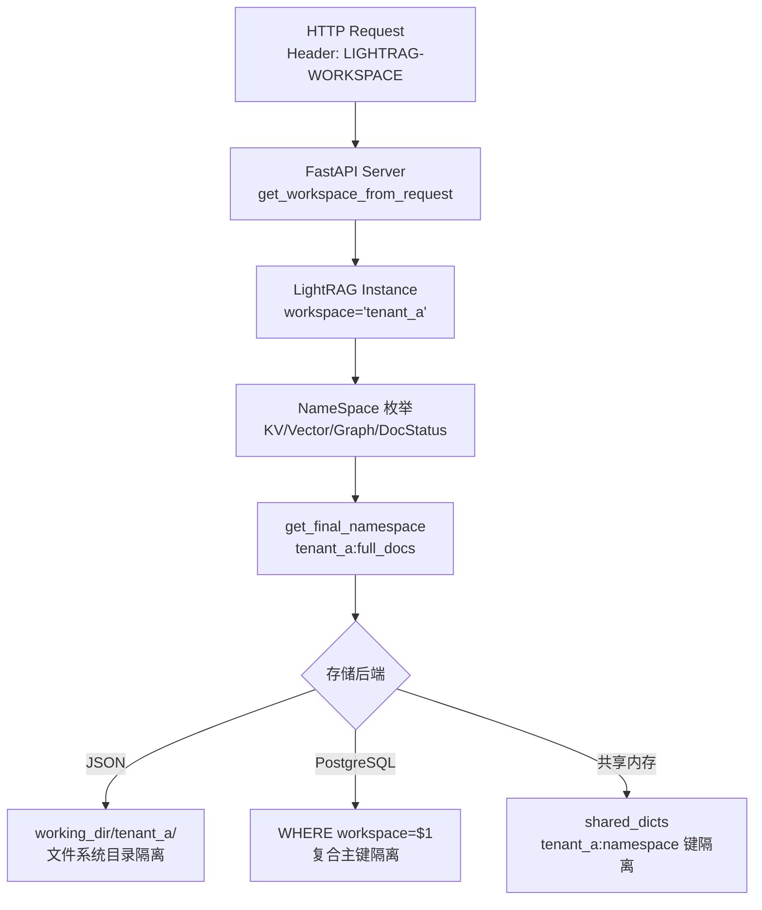
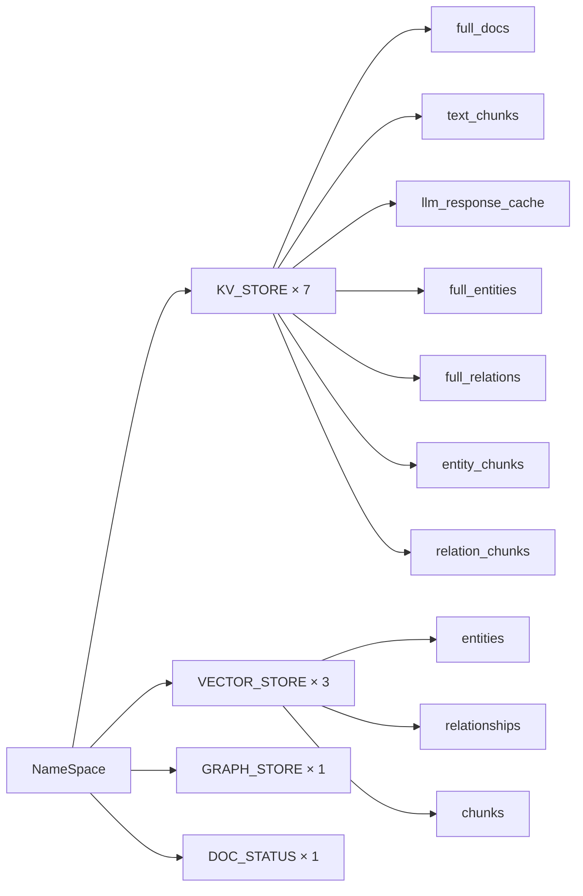
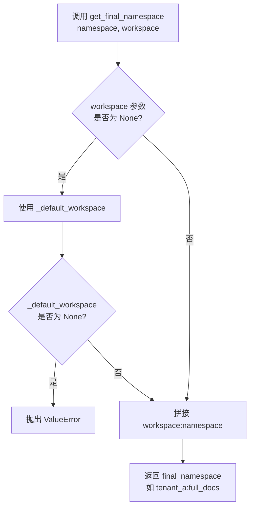
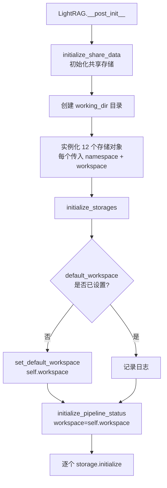

# PD-81.01 LightRAG — Workspace+Namespace 双层多租户数据隔离

> 文档编号：PD-81.01
> 来源：LightRAG `lightrag/namespace.py` `lightrag/kg/shared_storage.py` `lightrag/lightrag.py`
> GitHub：https://github.com/HKUDS/LightRAG.git
> 问题域：PD-81 多租户数据隔离 Multi-Tenant Data Isolation
> 状态：可复用方案

---

## 第 1 章 问题与动机

### 1.1 核心问题

在 RAG（检索增强生成）系统中，多个用户或项目共享同一套服务实例时，必须确保：

1. **数据隔离**：用户 A 的知识图谱、向量索引、文档状态不会泄露给用户 B
2. **并发安全**：多进程/多协程环境下，不同租户的存储操作互不干扰
3. **存储后端透明**：无论底层是 JSON 文件、PostgreSQL 还是其他存储，隔离机制一致
4. **运行时动态切换**：API 层支持通过 HTTP Header 动态指定 workspace，无需重启服务
5. **向后兼容**：单租户场景无需感知多租户机制的存在

LightRAG 面对的场景是：一个 FastAPI 服务实例可能同时服务多个 workspace（租户），每个 workspace 拥有独立的文档集、知识图谱和向量索引。同时在 Gunicorn 多 worker 部署下，还需要跨进程的数据一致性保障。

### 1.2 LightRAG 的解法概述

LightRAG 采用 **workspace + namespace 双层隔离** 架构：

1. **workspace 层（租户级）**：每个 `LightRAG` 实例绑定一个 `workspace` 字符串，通过 `get_final_namespace()` 将 workspace 前缀拼接到所有存储命名空间上，实现租户级数据隔离（`lightrag/kg/shared_storage.py:99-112`）
2. **namespace 层（功能级）**：`NameSpace` 类定义了 12 种存储命名空间（KV、Vector、Graph、DocStatus），每种存储类型有独立的命名空间标识（`lightrag/namespace.py:7-22`）
3. **共享存储层**：`shared_storage.py` 提供跨进程共享的字典、初始化标志和锁机制，所有操作都通过 `final_namespace = workspace:namespace` 的复合键进行隔离（`lightrag/kg/shared_storage.py:1445-1483`）
4. **API 层动态路由**：FastAPI 服务通过 `LIGHTRAG-WORKSPACE` HTTP Header 实现运行时 workspace 切换（`lightrag/api/lightrag_server.py:462-482`）
5. **PostgreSQL 层复合主键**：数据库表使用 `(workspace, id)` 复合主键和索引，确保 SQL 层面的数据隔离（`lightrag/kg/postgres_impl.py:826, 2462`）

### 1.3 设计思想

| 设计原则 | 具体实现 | 理由 | 替代方案 |
|----------|----------|------|----------|
| 前缀拼接隔离 | `workspace:namespace` 复合键 | 零成本实现逻辑隔离，无需物理分库 | 每租户独立数据库实例（成本高） |
| 枚举式命名空间 | `NameSpace` 类常量定义 12 种存储类型 | 编译期可检查，防止拼写错误 | 字符串魔法值（易出错） |
| 双模锁机制 | 单进程用 asyncio.Lock，多进程用 Manager.Lock | 单进程零开销，多进程安全 | 统一用 Manager.Lock（单进程有额外开销） |
| 存储基类抽象 | `StorageNameSpace` 基类强制 namespace+workspace | 所有存储实现自动获得隔离能力 | 每个存储自行实现隔离（不一致） |
| HTTP Header 路由 | `LIGHTRAG-WORKSPACE` 自定义 Header | 无侵入，兼容 REST 规范 | URL 路径参数（破坏 RESTful 语义） |

---

## 第 2 章 源码实现分析

### 2.1 架构概览

LightRAG 的多租户隔离分为四个层次，从上到下依次是 API 路由层、实例绑定层、共享存储层和物理存储层：



### 2.2 核心实现

#### 2.2.1 NameSpace 枚举定义



对应源码 `lightrag/namespace.py:7-22`：

```python
class NameSpace:
    KV_STORE_FULL_DOCS = "full_docs"
    KV_STORE_TEXT_CHUNKS = "text_chunks"
    KV_STORE_LLM_RESPONSE_CACHE = "llm_response_cache"
    KV_STORE_FULL_ENTITIES = "full_entities"
    KV_STORE_FULL_RELATIONS = "full_relations"
    KV_STORE_ENTITY_CHUNKS = "entity_chunks"
    KV_STORE_RELATION_CHUNKS = "relation_chunks"

    VECTOR_STORE_ENTITIES = "entities"
    VECTOR_STORE_RELATIONSHIPS = "relationships"
    VECTOR_STORE_CHUNKS = "chunks"

    GRAPH_STORE_CHUNK_ENTITY_RELATION = "chunk_entity_relation"

    DOC_STATUS = "doc_status"
```

`is_namespace()` 辅助函数（`lightrag/namespace.py:25-28`）通过 `endswith` 匹配，使得 `tenant_a:full_docs` 可以被识别为 `full_docs` 命名空间，实现了前缀透明的命名空间判断。

#### 2.2.2 get_final_namespace — 核心拼接函数



对应源码 `lightrag/kg/shared_storage.py:99-112`：

```python
def get_final_namespace(namespace: str, workspace: str | None = None):
    global _default_workspace
    if workspace is None:
        workspace = _default_workspace

    if workspace is None:
        direct_log(
            f"Error: Invoke namespace operation without workspace, pid={os.getpid()}",
            level="ERROR",
        )
        raise ValueError("Invoke namespace operation without workspace")

    final_namespace = f"{workspace}:{namespace}" if workspace else f"{namespace}"
    return final_namespace
```

这个函数是整个隔离机制的枢纽：所有存储操作（读写共享字典、获取锁、初始化标志）都通过它获取带 workspace 前缀的最终命名空间。

#### 2.2.3 LightRAG 实例初始化 — 存储绑定



对应源码 `lightrag/lightrag.py:584-655`，每个存储对象创建时都传入 `namespace` 和 `workspace`：

```python
self.llm_response_cache = self.key_string_value_json_storage_cls(
    namespace=NameSpace.KV_STORE_LLM_RESPONSE_CACHE,
    workspace=self.workspace,
    global_config=global_config,
    embedding_func=self.embedding_func,
)
# ... 同样模式创建 text_chunks, full_docs, full_entities 等 11 个存储
self.chunk_entity_relation_graph = self.graph_storage_cls(
    namespace=NameSpace.GRAPH_STORE_CHUNK_ENTITY_RELATION,
    workspace=self.workspace,
    embedding_func=self.embedding_func,
)
```

`StorageNameSpace` 基类（`lightrag/base.py:172-175`）强制所有存储实现携带 `namespace` 和 `workspace`：

```python
@dataclass
class StorageNameSpace(ABC):
    namespace: str
    workspace: str
    global_config: dict[str, Any]
```

### 2.3 实现细节

#### 共享存储初始化 — 单/多进程双模

`initialize_share_data()` 根据 worker 数量选择不同的共享机制（`lightrag/kg/shared_storage.py:1176-1264`）：

- **单进程模式**（workers=1）：使用 `asyncio.Lock` 和普通 `dict`，零额外开销
- **多进程模式**（workers>1）：使用 `multiprocessing.Manager` 创建跨进程共享的 `dict`、`Lock`、`RLock`

关键数据结构：
- `_shared_dicts`：以 `workspace:namespace` 为键的共享字典，存储各命名空间的运行时数据
- `_init_flags`：以 `workspace:namespace` 为键的初始化标志，防止重复初始化
- `_update_flags`：以 `workspace:namespace` 为键的更新标志列表，通知各 worker 重新加载数据

#### KeyedUnifiedLock — 命名空间感知的细粒度锁

`KeyedUnifiedLock`（`lightrag/kg/shared_storage.py:529-814`）实现了按 `namespace:key` 粒度的锁管理：

1. 锁的键由 `namespace` 和 `key` 组合而成（`_get_combined_key`，`lightrag/kg/shared_storage.py:319-321`）
2. 支持引用计数和自动清理过期锁（`CLEANUP_KEYED_LOCKS_AFTER_SECONDS = 300`）
3. `_KeyedLockContext` 对多个 key 排序后依次获取锁，避免死锁（`lightrag/kg/shared_storage.py:828-830`）

#### PostgreSQL 层的 workspace 隔离

PostgreSQL 实现（`lightrag/kg/postgres_impl.py`）在 SQL 层面强制 workspace 隔离：

- 所有表使用 `(workspace, id)` 复合主键（`postgres_impl.py:826`：`ON CONFLICT (workspace, id) DO NOTHING`）
- 创建 `(workspace, id)` 复合索引加速查询（`postgres_impl.py:2462-2470`）
- 所有查询都带 `WHERE workspace=$1` 条件（`postgres_impl.py:2173, 2315, 2343`）
- workspace 优先级：`PG_WORKSPACE 环境变量 > LightRAG.workspace > "default"`（`postgres_impl.py:1898-1910`）

#### API 层动态 workspace 路由

FastAPI 服务通过 `get_workspace_from_request()`（`lightrag/api/lightrag_server.py:462-482`）从 HTTP Header 提取 workspace：

```python
def get_workspace_from_request(request: Request) -> str | None:
    workspace = request.headers.get("LIGHTRAG-WORKSPACE", "").strip()
    if not workspace:
        workspace = None
    return workspace
```

客户端只需在请求中添加 `LIGHTRAG-WORKSPACE: tenant_a` Header 即可切换到对应租户的数据空间。

---

## 第 3 章 迁移指南

### 3.1 迁移清单

**阶段 1：基础隔离层（必须）**

- [ ] 定义 `NameSpace` 枚举类，列出所有存储命名空间
- [ ] 实现 `get_final_namespace(namespace, workspace)` 拼接函数
- [ ] 创建 `StorageNameSpace` 基类，强制所有存储携带 `namespace` + `workspace`
- [ ] 所有存储操作使用 `final_namespace` 作为键

**阶段 2：并发安全层（多进程部署需要）**

- [ ] 实现 `initialize_share_data(workers)` 双模初始化
- [ ] 实现 `KeyedUnifiedLock` 或等效的命名空间感知锁
- [ ] 实现 `NamespaceLock` 包装器（使用 `ContextVar` 避免协程间干扰）

**阶段 3：API 路由层（多租户 API 需要）**

- [ ] 添加 HTTP Header 解析中间件提取 workspace
- [ ] 实现 `set_default_workspace` / `get_default_workspace` 向后兼容

**阶段 4：数据库层（使用关系型数据库时）**

- [ ] 所有表添加 `workspace` 列
- [ ] 创建 `(workspace, id)` 复合主键和索引
- [ ] 所有 SQL 查询添加 `WHERE workspace=$1`

### 3.2 适配代码模板

以下是一个可直接复用的最小化双层隔离实现：

```python
"""minimal_tenant_isolation.py — 可运行的双层隔离模板"""
from __future__ import annotations
from abc import ABC, abstractmethod
from dataclasses import dataclass
from typing import Any, Dict, Optional
from contextvars import ContextVar
import asyncio


# ---- Layer 1: Namespace 枚举 ----
class NameSpace:
    """存储命名空间定义，所有值不可变"""
    KV_DOCS = "docs"
    KV_CHUNKS = "chunks"
    VECTOR_ENTITIES = "entities"
    GRAPH_RELATIONS = "relations"


# ---- Layer 2: 前缀拼接 ----
_default_workspace: Optional[str] = None

def set_default_workspace(ws: str):
    global _default_workspace
    _default_workspace = ws

def get_final_namespace(namespace: str, workspace: str | None = None) -> str:
    ws = workspace or _default_workspace
    if ws is None:
        raise ValueError("workspace not set")
    return f"{ws}:{namespace}" if ws else namespace


# ---- Layer 3: 存储基类 ----
@dataclass
class StorageBase(ABC):
    namespace: str
    workspace: str

    @property
    def final_ns(self) -> str:
        return get_final_namespace(self.namespace, self.workspace)

    @abstractmethod
    async def get(self, key: str) -> Any: ...

    @abstractmethod
    async def put(self, key: str, value: Any) -> None: ...


# ---- Layer 4: 内存存储实现示例 ----
_store: Dict[str, Dict[str, Any]] = {}

@dataclass
class InMemoryKVStorage(StorageBase):
    async def get(self, key: str) -> Any:
        return _store.get(self.final_ns, {}).get(key)

    async def put(self, key: str, value: Any) -> None:
        _store.setdefault(self.final_ns, {})[key] = value


# ---- Layer 5: 使用示例 ----
async def main():
    # 租户 A
    docs_a = InMemoryKVStorage(namespace=NameSpace.KV_DOCS, workspace="tenant_a")
    await docs_a.put("doc1", {"title": "Hello from A"})

    # 租户 B
    docs_b = InMemoryKVStorage(namespace=NameSpace.KV_DOCS, workspace="tenant_b")
    await docs_b.put("doc1", {"title": "Hello from B"})

    # 验证隔离
    assert await docs_a.get("doc1") != await docs_b.get("doc1")
    assert "tenant_a:docs" in _store
    assert "tenant_b:docs" in _store
    print("Isolation verified!")

if __name__ == "__main__":
    asyncio.run(main())
```

### 3.3 适用场景

| 场景 | 适用度 | 说明 |
|------|--------|------|
| SaaS 多租户 RAG 服务 | ⭐⭐⭐ | 完美匹配，workspace 对应租户 |
| 单用户多项目隔离 | ⭐⭐⭐ | workspace 对应项目名 |
| 多进程 Gunicorn 部署 | ⭐⭐⭐ | 双模锁机制直接适用 |
| 微服务间数据隔离 | ⭐⭐ | 需额外考虑分布式锁 |
| 单租户单进程 | ⭐ | 过度设计，但向后兼容无额外开销 |

---

## 第 4 章 测试用例

```python
"""test_tenant_isolation.py — 基于 LightRAG 真实接口的测试"""
import pytest
import asyncio
from unittest.mock import patch


class TestGetFinalNamespace:
    """测试 get_final_namespace 核心拼接逻辑"""

    def test_normal_workspace_namespace(self):
        """正常拼接 workspace:namespace"""
        from lightrag.kg.shared_storage import get_final_namespace, set_default_workspace
        set_default_workspace("test_ws")
        result = get_final_namespace("full_docs", "tenant_a")
        assert result == "tenant_a:full_docs"

    def test_explicit_workspace_overrides_default(self):
        """显式 workspace 覆盖默认值"""
        from lightrag.kg.shared_storage import get_final_namespace, set_default_workspace
        set_default_workspace("default_ws")
        result = get_final_namespace("full_docs", "explicit_ws")
        assert result == "explicit_ws:full_docs"

    def test_fallback_to_default_workspace(self):
        """workspace=None 时回退到默认值"""
        from lightrag.kg.shared_storage import get_final_namespace, set_default_workspace
        set_default_workspace("fallback_ws")
        result = get_final_namespace("full_docs", None)
        assert result == "fallback_ws:full_docs"

    def test_no_workspace_raises_error(self):
        """无 workspace 且无默认值时抛出 ValueError"""
        from lightrag.kg.shared_storage import get_final_namespace
        with patch("lightrag.kg.shared_storage._default_workspace", None):
            with pytest.raises(ValueError, match="without workspace"):
                get_final_namespace("full_docs", None)

    def test_empty_workspace_no_prefix(self):
        """空字符串 workspace 不添加前缀"""
        from lightrag.kg.shared_storage import get_final_namespace
        result = get_final_namespace("full_docs", "")
        assert result == "full_docs"  # 无前缀


class TestNameSpaceEnum:
    """测试 NameSpace 枚举完整性"""

    def test_all_namespaces_defined(self):
        from lightrag.namespace import NameSpace
        expected = [
            "full_docs", "text_chunks", "llm_response_cache",
            "full_entities", "full_relations", "entity_chunks", "relation_chunks",
            "entities", "relationships", "chunks",
            "chunk_entity_relation", "doc_status",
        ]
        actual = [v for k, v in vars(NameSpace).items() if not k.startswith("_")]
        assert set(expected) == set(actual)

    def test_is_namespace_with_prefix(self):
        """带 workspace 前缀的命名空间匹配"""
        from lightrag.namespace import is_namespace, NameSpace
        assert is_namespace("tenant_a:full_docs", NameSpace.KV_STORE_FULL_DOCS)
        assert not is_namespace("tenant_a:full_docs", NameSpace.KV_STORE_TEXT_CHUNKS)


class TestSharedStorageIsolation:
    """测试共享存储的命名空间隔离"""

    @pytest.mark.asyncio
    async def test_namespace_data_isolation(self):
        """不同 workspace 的 namespace_data 互相隔离"""
        from lightrag.kg.shared_storage import (
            initialize_share_data, get_namespace_data,
            set_default_workspace, finalize_share_data,
        )
        initialize_share_data(workers=1)
        set_default_workspace("ws_a")

        data_a = await get_namespace_data("test_ns", workspace="ws_a")
        data_b = await get_namespace_data("test_ns", workspace="ws_b")

        data_a["key"] = "value_a"
        data_b["key"] = "value_b"

        assert data_a["key"] == "value_a"
        assert data_b["key"] == "value_b"
        assert data_a is not data_b

        finalize_share_data()

    @pytest.mark.asyncio
    async def test_init_flag_per_workspace(self):
        """初始化标志按 workspace 独立"""
        from lightrag.kg.shared_storage import (
            initialize_share_data, try_initialize_namespace,
            set_default_workspace, finalize_share_data,
        )
        initialize_share_data(workers=1)
        set_default_workspace("ws_a")

        got_a = await try_initialize_namespace("store", workspace="ws_a")
        got_b = await try_initialize_namespace("store", workspace="ws_b")
        got_a2 = await try_initialize_namespace("store", workspace="ws_a")

        assert got_a is True   # 首次初始化
        assert got_b is True   # 不同 workspace，独立
        assert got_a2 is False # 同 workspace 重复，拒绝

        finalize_share_data()
```

---

## 第 5 章 跨域关联

| 关联域 | 关系类型 | 说明 |
|--------|----------|------|
| PD-78 并发控制 | 强依赖 | `KeyedUnifiedLock` 和 `NamespaceLock` 是多租户并发安全的基础，锁的键空间按 workspace:namespace 隔离 |
| PD-75 多后端存储 | 协同 | `StorageNameSpace` 基类同时承载多后端抽象和多租户隔离，namespace+workspace 参数贯穿所有存储实现 |
| PD-82 配置管理 | 协同 | 每个 LightRAG 实例支持独立 `.env` 配置（`load_dotenv` 在 `lightrag.py:122`），workspace 可通过 `WORKSPACE` 环境变量设置 |
| PD-79 LLM 响应缓存 | 依赖 | LLM 缓存存储（`llm_response_cache`）也通过 namespace 隔离，不同租户的缓存互不污染 |
| PD-76 认证授权 | 协同 | API 层的 workspace Header 解析与认证中间件配合，先认证再路由到对应 workspace |

---

## 第 6 章 来源文件索引

| 文件 | 行范围 | 关键实现 |
|------|--------|----------|
| `lightrag/namespace.py` | L7-L28 | NameSpace 枚举定义 + is_namespace 辅助函数 |
| `lightrag/kg/shared_storage.py` | L99-L112 | get_final_namespace 核心拼接函数 |
| `lightrag/kg/shared_storage.py` | L529-L814 | KeyedUnifiedLock 命名空间感知锁 |
| `lightrag/kg/shared_storage.py` | L1176-L1264 | initialize_share_data 单/多进程双模初始化 |
| `lightrag/kg/shared_storage.py` | L1445-L1483 | get_namespace_data 共享字典隔离 |
| `lightrag/kg/shared_storage.py` | L1486-L1583 | NamespaceLock + get_namespace_lock |
| `lightrag/kg/shared_storage.py` | L1674-L1703 | set/get_default_workspace 向后兼容 |
| `lightrag/lightrag.py` | L130-L159 | LightRAG dataclass 定义（working_dir + workspace） |
| `lightrag/lightrag.py` | L584-L655 | 12 个存储对象实例化（namespace + workspace 绑定） |
| `lightrag/lightrag.py` | L678-L695 | initialize_storages 中的 default_workspace 设置 |
| `lightrag/base.py` | L172-L175 | StorageNameSpace 基类（namespace + workspace 字段） |
| `lightrag/kg/postgres_impl.py` | L128-L135 | PostgreSQLDB workspace 配置 |
| `lightrag/kg/postgres_impl.py` | L1898-L1910 | PostgreSQL workspace 优先级逻辑 |
| `lightrag/kg/postgres_impl.py` | L2462-L2470 | (workspace, id) 复合索引创建 |
| `lightrag/api/lightrag_server.py` | L462-L482 | get_workspace_from_request HTTP Header 解析 |

---

## 第 7 章 横向对比维度

```json comparison_data
{
  "project": "LightRAG",
  "dimensions": {
    "隔离架构": "workspace+namespace 双层前缀拼接，逻辑隔离",
    "锁机制": "KeyedUnifiedLock 按 namespace:key 细粒度锁，支持单/多进程双模",
    "存储后端适配": "StorageNameSpace 基类强制 namespace+workspace，JSON/PostgreSQL/向量库统一",
    "API 路由": "LIGHTRAG-WORKSPACE HTTP Header 动态切换，无需重启",
    "数据库隔离": "(workspace, id) 复合主键 + WHERE workspace=$1 行级过滤"
  }
}
```

```json domain_metadata
{
  "solution_summary": "LightRAG 通过 get_final_namespace 将 workspace 前缀拼接到 12 种 NameSpace 枚举上，配合 StorageNameSpace 基类和 KeyedUnifiedLock 实现跨存储后端的多租户隔离",
  "description": "API层支持HTTP Header动态切换workspace，数据库层用复合主键强制行级隔离",
  "sub_problems": [
    "多进程部署下的共享状态同步",
    "存储后端异构时的隔离一致性保障",
    "运行时动态workspace切换的API设计"
  ],
  "best_practices": [
    "StorageNameSpace基类强制所有存储实现携带namespace+workspace",
    "单/多进程双模锁避免单进程场景的额外开销",
    "ContextVar隔离协程间的锁上下文防止状态泄露"
  ]
}
```
