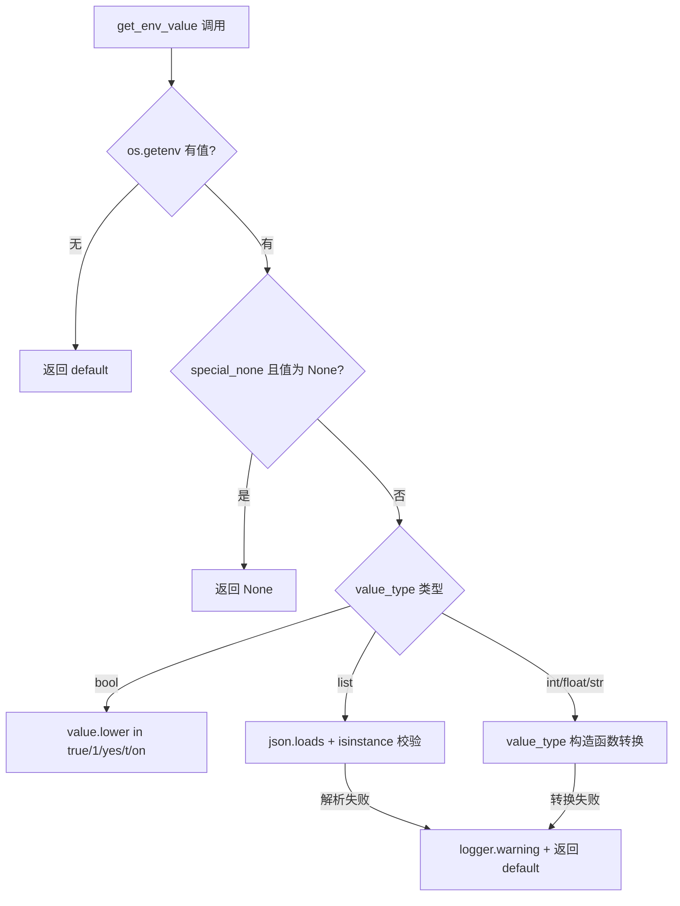
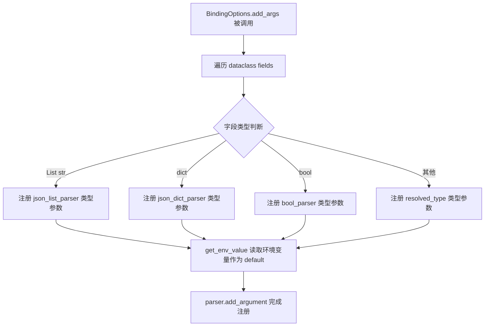
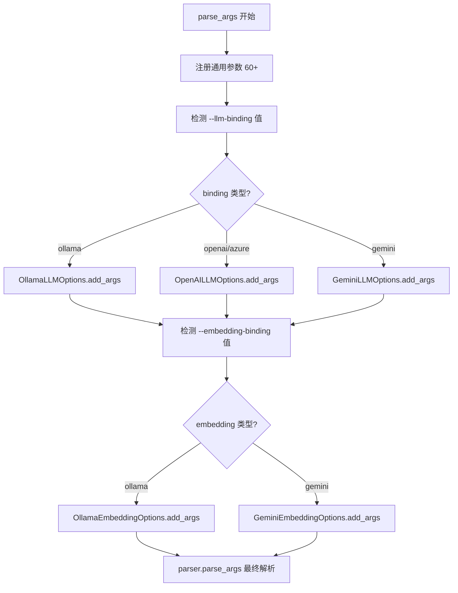

# PD-82.01 LightRAG — 多层配置管理与 BindingOptions 自动化

> 文档编号：PD-82.01
> 来源：LightRAG `lightrag/constants.py` `lightrag/api/config.py` `lightrag/llm/binding_options.py` `lightrag/utils.py`
> GitHub：https://github.com/HKUDS/LightRAG.git
> 问题域：PD-82 配置管理 Configuration Management
> 状态：可复用方案

---

## 第 1 章 问题与动机

### 1.1 核心问题

RAG 系统的配置参数极其庞大——LightRAG 仅 API 服务器就有 60+ 个可配置项，涵盖服务器端口、LLM 绑定、Embedding 参数、存储后端、认证密钥等。这些参数需要在三个层级中灵活管理：

1. **代码默认值**：开发者预设的合理默认值，保证零配置可启动
2. **环境变量 / .env 文件**：部署时按实例定制，支持多实例隔离
3. **命令行参数**：运行时覆盖，方便调试和临时调整

如果每个参数都手写三遍（默认值、env 读取、argparse 注册），维护成本极高且容易不一致。更复杂的是，LightRAG 支持多种 LLM 提供商（Ollama、OpenAI、Gemini、Azure），每种提供商有自己的参数集，需要动态注册到 CLI。

### 1.2 LightRAG 的解法概述

1. **集中常量定义** (`lightrag/constants.py:1-114`)：所有默认值集中在一个文件，消除魔法数字
2. **统一类型转换函数** (`lightrag/utils.py:176-225`)：`get_env_value()` 处理 str→int/float/bool/list 的类型安全转换，含 `special_none` 特殊值支持
3. **BindingOptions 基类** (`lightrag/llm/binding_options.py:69-356`)：dataclass 基类通过内省自动生成 CLI 参数和 .env 模板，子类只需声明字段
4. **_GlobalArgsProxy 延迟初始化** (`lightrag/api/config.py:529-580`)：代理模式实现全局配置的懒加载，支持编程式和 CLI 两种初始化路径
5. **多实例 .env 隔离** (`lightrag/api/config.py:49`)：`load_dotenv(override=False)` 让 OS 环境变量优先，每个工作目录可有独立 .env

### 1.3 设计思想

| 设计原则 | 具体实现 | 理由 | 替代方案 |
|----------|----------|------|----------|
| 单一真相源 | `constants.py` 集中定义所有默认值 | 避免同一默认值在多处硬编码导致不一致 | 分散在各模块中（维护噩梦） |
| 三级优先级 | CLI > .env > constants 默认值 | 符合 12-Factor App 配置原则 | 单一配置文件（不够灵活） |
| 元编程自动化 | BindingOptions 通过 dataclass 内省自动生成 argparse 参数 | 新增 LLM 提供商只需定义字段，零 boilerplate | 手写每个 provider 的 argparse（重复劳动） |
| 延迟初始化 | _GlobalArgsProxy 代理模式 | 支持编程式嵌入（不走 CLI）和测试场景 | 模块级全局变量（import 时就解析 argv） |
| 类型安全 | get_env_value 统一处理类型转换 + 错误降级 | 环境变量都是字符串，需要安全转换 | 每处手写 int(os.getenv(...)) |

---

## 第 2 章 源码实现分析

### 2.1 架构概览

LightRAG 的配置管理分为四层，从底层到顶层依次是：

```
┌─────────────────────────────────────────────────────────┐
│                   _GlobalArgsProxy                       │
│          (延迟初始化代理，全局单例访问点)                    │
├─────────────────────────────────────────────────────────┤
│                    parse_args()                           │
│     (argparse 注册 60+ 参数，每个用 get_env_value 回退)     │
├──────────────┬──────────────────────────────────────────┤
│ BindingOptions│  OllamaLLMOptions / OpenAILLMOptions /   │
│   (基类)      │  GeminiLLMOptions ... (子类自动注册)       │
├──────────────┴──────────────────────────────────────────┤
│  constants.py (DEFAULT_*)  +  get_env_value() (utils.py) │
│           (默认值层)              (类型转换层)              │
└─────────────────────────────────────────────────────────┘
```

### 2.2 核心实现

#### 2.2.1 get_env_value — 类型安全的环境变量读取



对应源码 `lightrag/utils.py:176-225`：

```python
def get_env_value(
    env_key: str, default: any, value_type: type = str, special_none: bool = False
) -> any:
    value = os.getenv(env_key)
    if value is None:
        return default

    # Handle special case for "None" string
    if special_none and value == "None":
        return None

    if value_type is bool:
        return value.lower() in ("true", "1", "yes", "t", "on")

    # Handle list type with JSON parsing
    if value_type is list:
        try:
            import json
            parsed_value = json.loads(value)
            if isinstance(parsed_value, list):
                return parsed_value
            else:
                logger.warning(
                    f"Environment variable {env_key} is not a valid JSON list, using default"
                )
                return default
        except (json.JSONDecodeError, ValueError) as e:
            logger.warning(f"Failed to parse {env_key} as JSON list: {e}, using default")
            return default

    try:
        return value_type(value)
    except (ValueError, TypeError):
        return default
```

关键设计点：
- `special_none` 参数处理 `EMBEDDING_DIM=None` 这类"显式设为空"的场景 (`lightrag/api/config.py:365`)
- bool 转换支持 5 种真值写法，容错性强
- list 类型走 JSON 解析，支持 `ENTITY_TYPES='["Person","Location"]'` 这种复杂值 (`lightrag/api/config.py:392`)
- 所有转换失败都静默降级到 default，不会崩溃

#### 2.2.2 BindingOptions — 元编程驱动的 CLI 参数自动生成



对应源码 `lightrag/llm/binding_options.py:111-203`：

```python
@classmethod
def add_args(cls, parser: ArgumentParser):
    group = parser.add_argument_group(f"{cls._binding_name} binding options")
    for arg_item in cls.args_env_name_type_value():
        if arg_item["type"] is List[str]:
            def json_list_parser(value):
                try:
                    parsed = json.loads(value)
                    if not isinstance(parsed, list):
                        raise argparse.ArgumentTypeError(
                            f"Expected JSON array, got {type(parsed).__name__}"
                        )
                    return parsed
                except json.JSONDecodeError as e:
                    raise argparse.ArgumentTypeError(f"Invalid JSON: {e}")

            env_value = get_env_value(f"{arg_item['env_name']}", argparse.SUPPRESS)
            if env_value is not argparse.SUPPRESS:
                try:
                    env_value = json_list_parser(env_value)
                except argparse.ArgumentTypeError:
                    env_value = argparse.SUPPRESS

            group.add_argument(
                f"--{arg_item['argname']}",
                type=json_list_parser,
                default=env_value,
                help=arg_item["help"],
            )
        elif arg_item["type"] is bool:
            # ... bool 特殊处理
```

`args_env_name_type_value()` 方法 (`lightrag/llm/binding_options.py:205-263`) 是核心的元编程引擎：

```python
@classmethod
def args_env_name_type_value(cls):
    import dataclasses
    args_prefix = f"{cls._binding_name}".replace("_", "-")
    env_var_prefix = f"{cls._binding_name}_".upper()
    help = cls._help

    if dataclasses.is_dataclass(cls):
        for field in dataclasses.fields(cls):
            if field.name.startswith("_"):
                continue
            # 自动推导 default 值
            if field.default is not dataclasses.MISSING:
                default_value = field.default
            elif field.default_factory is not dataclasses.MISSING:
                default_value = field.default_factory()
            else:
                default_value = None

            argdef = {
                "argname": f"{args_prefix}-{field.name}",        # ollama-llm-temperature
                "env_name": f"{env_var_prefix}{field.name.upper()}", # OLLAMA_LLM_TEMPERATURE
                "type": _resolve_optional_type(field.type),
                "default": default_value,
                "help": f"{cls._binding_name} -- " + help.get(field.name, ""),
            }
            yield argdef
```

命名约定自动映射：
- 字段 `temperature` → CLI `--ollama-llm-temperature` → 环境变量 `OLLAMA_LLM_TEMPERATURE`
- 子类只需声明 `_binding_name` 和字段，零 boilerplate

#### 2.2.3 条件式 Binding 注册



对应源码 `lightrag/api/config.py:273-313`：

```python
# Determine LLM binding value consistently from command line or environment
llm_binding_value = None
if "--llm-binding" in sys.argv:
    try:
        idx = sys.argv.index("--llm-binding")
        if idx + 1 < len(sys.argv) and not sys.argv[idx + 1].startswith("-"):
            llm_binding_value = sys.argv[idx + 1]
    except IndexError:
        pass

if llm_binding_value is None:
    llm_binding_value = get_env_value("LLM_BINDING", "ollama")

# Add LLM binding options based on determined value
if llm_binding_value == "ollama":
    OllamaLLMOptions.add_args(parser)
elif llm_binding_value in ["openai", "azure_openai"]:
    OpenAILLMOptions.add_args(parser)
elif llm_binding_value == "gemini":
    GeminiLLMOptions.add_args(parser)
```

这段代码在 argparse 解析之前先手动检查 `sys.argv`，根据 binding 类型动态注册对应的参数组。这避免了把所有 provider 的参数都注册（会导致 `--help` 输出混乱）。

### 2.3 实现细节

#### _GlobalArgsProxy 延迟初始化代理

`lightrag/api/config.py:529-580` 实现了一个代理对象，拦截所有属性访问并委托给底层的 `_global_args`：

```python
class _GlobalArgsProxy:
    def __getattribute__(self, name):
        global _initialized, _global_args
        if name == "__dict__":
            if not _initialized:
                initialize_config()
            return vars(_global_args)
        if name in ("__class__", "__repr__", "__getattribute__", "__setattr__"):
            return object.__getattribute__(self, name)
        if not _initialized:
            initialize_config()
        return getattr(_global_args, name)

global_args = _GlobalArgsProxy()
```

这个设计解决了两个问题：
1. **向后兼容**：已有代码 `from config import global_args` 继续工作
2. **编程式使用**：可以通过 `initialize_config(custom_args)` 注入自定义配置，用于测试或嵌入场景 (`lightrag/api/config.py:481-515`)

#### 多实例 .env 隔离

在 `lightrag/utils.py:235`、`lightrag/lightrag.py:122`、`lightrag/base.py:38`、`lightrag/api/config.py:49` 四处都有相同的模式：

```python
# use the .env that is inside the current folder
# allows to use different .env file for each lightrag instance
# the OS environment variables take precedence over the .env file
load_dotenv(dotenv_path=".env", override=False)
```

`override=False` 是关键：OS 环境变量优先于 .env 文件。这意味着在不同目录下运行多个 LightRAG 实例时，每个实例读取自己目录下的 `.env`，实现配置隔离。

#### LightRAG dataclass 中的混合配置读取

`lightrag/lightrag.py:129-397` 的 `LightRAG` dataclass 展示了两种配置读取风格的混用：

```python
# 风格 1：使用 get_env_value（推荐，类型安全）
top_k: int = field(default=get_env_value("TOP_K", DEFAULT_TOP_K, int))

# 风格 2：直接 os.getenv + int()（旧代码，不够安全）
chunk_token_size: int = field(default=int(os.getenv("CHUNK_SIZE", 1200)))
```

风格 2 在环境变量值非法时会直接抛 ValueError，而风格 1 会静默降级到默认值。这是一个渐进迁移的痕迹。


---

## 第 3 章 迁移指南

### 3.1 迁移清单

**阶段 1：基础层（constants + get_env_value）**

- [ ] 创建 `constants.py`，集中定义所有 `DEFAULT_*` 常量
- [ ] 实现 `get_env_value(env_key, default, value_type, special_none)` 工具函数
- [ ] 在项目入口处添加 `load_dotenv(dotenv_path=".env", override=False)`
- [ ] 将现有的 `os.getenv()` 调用替换为 `get_env_value()`

**阶段 2：BindingOptions 自动化（可选，适合多 provider 场景）**

- [ ] 定义 `BindingOptions` 基类，实现 `add_args()` 和 `args_env_name_type_value()`
- [ ] 为每个 provider 创建 dataclass 子类，声明字段和 `_help`
- [ ] 在 `parse_args()` 中根据 binding 类型条件注册参数组
- [ ] 实现 `generate_dot_env_sample()` 自动生成 .env 模板

**阶段 3：全局配置代理（可选，适合库/框架场景）**

- [ ] 实现 `_GlobalArgsProxy` 延迟初始化代理
- [ ] 提供 `initialize_config(args, force)` 编程式初始化入口
- [ ] 确保 `vars()` 调用正常工作（`__dict__` 代理）

### 3.2 适配代码模板

#### 模板 1：get_env_value 最小实现

```python
"""config_utils.py — 类型安全的环境变量读取"""
import os
import json
import logging

logger = logging.getLogger(__name__)

def get_env_value(
    env_key: str,
    default,
    value_type: type = str,
    special_none: bool = False,
):
    """从环境变量读取值，带类型转换和降级。

    优先级：OS 环境变量 > .env 文件 > default 参数
    """
    value = os.getenv(env_key)
    if value is None:
        return default

    if special_none and value.strip().lower() in ("none", "null", ""):
        return None

    if value_type is bool:
        return value.lower() in ("true", "1", "yes", "t", "on")

    if value_type is list:
        try:
            parsed = json.loads(value)
            return parsed if isinstance(parsed, list) else default
        except (json.JSONDecodeError, ValueError):
            logger.warning(f"Failed to parse {env_key} as JSON list, using default")
            return default

    try:
        return value_type(value)
    except (ValueError, TypeError):
        logger.warning(f"Failed to convert {env_key}={value!r} to {value_type.__name__}")
        return default
```

#### 模板 2：BindingOptions 基类（简化版）

```python
"""binding_options.py — 自动生成 CLI 参数的 dataclass 基类"""
import dataclasses
from argparse import ArgumentParser
from dataclasses import dataclass
from typing import Any, ClassVar

from config_utils import get_env_value


@dataclass
class BindingOptions:
    _binding_name: ClassVar[str]
    _help: ClassVar[dict[str, str]] = {}

    @classmethod
    def add_args(cls, parser: ArgumentParser):
        prefix = cls._binding_name.replace("_", "-")
        env_prefix = f"{cls._binding_name}_".upper()
        group = parser.add_argument_group(f"{cls._binding_name} options")

        for f in dataclasses.fields(cls):
            if f.name.startswith("_"):
                continue
            default = f.default if f.default is not dataclasses.MISSING else None
            env_name = f"{env_prefix}{f.name.upper()}"
            arg_name = f"--{prefix}-{f.name}"

            group.add_argument(
                arg_name,
                type=f.type if f.type is not bool else None,
                default=get_env_value(env_name, default),
                help=cls._help.get(f.name, ""),
            )

    @classmethod
    def options_dict(cls, args) -> dict[str, Any]:
        prefix = cls._binding_name + "_"
        return {
            k[len(prefix):]: v
            for k, v in vars(args).items()
            if k.startswith(prefix)
        }


# 使用示例：新增一个 provider 只需 5 行
@dataclass
class MyLLMOptions(BindingOptions):
    _binding_name: ClassVar[str] = "my_llm"
    temperature: float = 0.7
    max_tokens: int = 4096
    _help: ClassVar[dict[str, str]] = {
        "temperature": "Controls randomness (0.0-2.0)",
        "max_tokens": "Maximum tokens to generate",
    }
```

### 3.3 适用场景

| 场景 | 适用度 | 说明 |
|------|--------|------|
| 多 LLM provider 的 RAG/Agent 系统 | ⭐⭐⭐ | BindingOptions 自动化价值最大 |
| 需要多实例部署的服务 | ⭐⭐⭐ | .env 隔离 + override=False 直接可用 |
| CLI 工具 + 环境变量配置 | ⭐⭐⭐ | get_env_value 三级优先级通用 |
| 单一配置的小型项目 | ⭐ | 过度设计，直接用 pydantic-settings 更简单 |
| 需要配置热更新的场景 | ⭐ | LightRAG 方案不支持运行时重载 |

---

## 第 4 章 测试用例

```python
"""test_config_management.py — 基于 LightRAG 配置管理模式的测试"""
import os
import json
import argparse
import pytest
from unittest.mock import patch


# ============================================================
# 测试 get_env_value
# ============================================================

class TestGetEnvValue:
    """测试类型安全的环境变量读取函数"""

    def test_returns_default_when_env_not_set(self):
        """环境变量不存在时返回默认值"""
        result = get_env_value("NONEXISTENT_KEY", 42, int)
        assert result == 42

    @patch.dict(os.environ, {"TEST_PORT": "8080"})
    def test_int_conversion(self):
        """字符串→int 转换"""
        result = get_env_value("TEST_PORT", 3000, int)
        assert result == 8080
        assert isinstance(result, int)

    @patch.dict(os.environ, {"TEST_TEMP": "0.7"})
    def test_float_conversion(self):
        """字符串→float 转换"""
        result = get_env_value("TEST_TEMP", 1.0, float)
        assert result == 0.7

    @patch.dict(os.environ, {"TEST_BOOL": "true"})
    def test_bool_true_variants(self):
        """bool 转换支持多种真值写法"""
        for true_val in ["true", "True", "1", "yes", "t", "on"]:
            with patch.dict(os.environ, {"TEST_BOOL": true_val}):
                assert get_env_value("TEST_BOOL", False, bool) is True

    @patch.dict(os.environ, {"TEST_BOOL": "false"})
    def test_bool_false(self):
        """非真值字符串转为 False"""
        assert get_env_value("TEST_BOOL", True, bool) is False

    @patch.dict(os.environ, {"TEST_LIST": '["a", "b", "c"]'})
    def test_list_json_parsing(self):
        """JSON 数组解析"""
        result = get_env_value("TEST_LIST", [], list)
        assert result == ["a", "b", "c"]

    @patch.dict(os.environ, {"TEST_LIST": "not-json"})
    def test_list_invalid_json_fallback(self):
        """JSON 解析失败时降级到默认值"""
        result = get_env_value("TEST_LIST", ["default"], list)
        assert result == ["default"]

    @patch.dict(os.environ, {"TEST_DIM": "None"})
    def test_special_none(self):
        """special_none=True 时 'None' 字符串返回 None"""
        result = get_env_value("TEST_DIM", 512, int, special_none=True)
        assert result is None

    @patch.dict(os.environ, {"TEST_PORT": "not_a_number"})
    def test_conversion_failure_fallback(self):
        """类型转换失败时静默降级到默认值"""
        result = get_env_value("TEST_PORT", 3000, int)
        assert result == 3000


# ============================================================
# 测试 BindingOptions 自动注册
# ============================================================

class TestBindingOptions:
    """测试 BindingOptions 元编程自动生成 CLI 参数"""

    def test_add_args_registers_all_fields(self):
        """子类字段自动注册为 CLI 参数"""
        parser = argparse.ArgumentParser()
        MyLLMOptions.add_args(parser)
        args = parser.parse_args(["--my-llm-temperature", "0.5"])
        assert float(args.my_llm_temperature) == 0.5

    def test_options_dict_extracts_prefix(self):
        """options_dict 正确提取并去除前缀"""
        ns = argparse.Namespace(my_llm_temperature=0.8, my_llm_max_tokens=2048, other=1)
        result = MyLLMOptions.options_dict(ns)
        assert result == {"temperature": 0.8, "max_tokens": 2048}
        assert "other" not in result

    @patch.dict(os.environ, {"MY_LLM_TEMPERATURE": "0.3"})
    def test_env_fallback_for_binding_args(self):
        """CLI 参数未指定时从环境变量读取"""
        parser = argparse.ArgumentParser()
        MyLLMOptions.add_args(parser)
        args = parser.parse_args([])
        assert args.my_llm_temperature == "0.3"


# ============================================================
# 测试三级优先级
# ============================================================

class TestConfigPriority:
    """测试 CLI > .env > constants 优先级链"""

    def test_cli_overrides_env(self):
        """CLI 参数覆盖环境变量"""
        with patch.dict(os.environ, {"PORT": "8080"}):
            parser = argparse.ArgumentParser()
            parser.add_argument("--port", type=int,
                                default=get_env_value("PORT", 9621, int))
            args = parser.parse_args(["--port", "3000"])
            assert args.port == 3000  # CLI wins

    def test_env_overrides_default(self):
        """环境变量覆盖代码默认值"""
        with patch.dict(os.environ, {"PORT": "8080"}):
            parser = argparse.ArgumentParser()
            parser.add_argument("--port", type=int,
                                default=get_env_value("PORT", 9621, int))
            args = parser.parse_args([])
            assert args.port == 8080  # env wins over default 9621

    def test_default_when_nothing_set(self):
        """无 CLI 无环境变量时使用代码默认值"""
        with patch.dict(os.environ, {}, clear=True):
            result = get_env_value("PORT", 9621, int)
            assert result == 9621
```


---

## 第 5 章 跨域关联

| 关联域 | 关系类型 | 说明 |
|--------|----------|------|
| PD-04 工具系统 | 协同 | BindingOptions 的 provider 选择直接决定了 LLM/Embedding 工具的配置参数集 |
| PD-81 多租户隔离 | 协同 | 多实例 .env 隔离是多租户配置隔离的基础，每个 workspace 可有独立配置 |
| PD-68 配置管理（通用） | 互补 | PD-68 侧重 YAML 分层配置，PD-82 侧重环境变量 + CLI 三级优先级，两者可组合 |
| PD-77 LLM Provider 抽象 | 依赖 | BindingOptions 子类定义了每个 LLM provider 的参数结构，是 provider 抽象层的配置入口 |
| PD-72 Embedding 适配 | 依赖 | OllamaEmbeddingOptions / GeminiEmbeddingOptions 为 Embedding provider 提供配置 |

---

## 第 6 章 来源文件索引

| 文件 | 行范围 | 关键实现 |
|------|--------|----------|
| `lightrag/constants.py` | L1-L114 | 全部 DEFAULT_* 常量定义，40+ 个配置默认值 |
| `lightrag/utils.py` | L176-L235 | `get_env_value()` 类型安全转换 + `load_dotenv` 调用 |
| `lightrag/llm/binding_options.py` | L69-L356 | `BindingOptions` 基类：`add_args()`、`args_env_name_type_value()`、`generate_dot_env_sample()`、`options_dict()` |
| `lightrag/llm/binding_options.py` | L371-L568 | Ollama/Gemini/OpenAI 子类定义（_OllamaOptionsMixin、GeminiLLMOptions、OpenAILLMOptions） |
| `lightrag/api/config.py` | L49-L462 | `parse_args()` 60+ 参数注册，条件式 binding 注册，存储配置注入 |
| `lightrag/api/config.py` | L476-L580 | `initialize_config()`、`get_config()`、`_GlobalArgsProxy` 延迟初始化代理 |
| `lightrag/lightrag.py` | L129-L397 | `LightRAG` dataclass 字段定义，混合使用 `get_env_value` 和 `os.getenv` |
| `lightrag/base.py` | L35-L50 | `OllamaServerInfos` 从环境变量读取模拟模型配置 |

---

## 第 7 章 横向对比维度

```json comparison_data
{
  "project": "LightRAG",
  "dimensions": {
    "配置层级": "三级：constants默认值 → .env文件 → CLI参数，get_env_value统一桥接",
    "类型安全": "get_env_value支持int/float/bool/list/special_none，转换失败静默降级",
    "CLI自动化": "BindingOptions基类通过dataclass内省自动生成argparse参数和环境变量名",
    "多实例隔离": "load_dotenv(override=False)按工作目录加载独立.env，OS环境变量优先",
    "全局访问模式": "_GlobalArgsProxy代理模式延迟初始化，支持编程式注入和vars()调用",
    "Provider扩展": "条件式binding注册，根据--llm-binding值动态加载对应provider参数组"
  }
}
```

### 域元数据补充

```json domain_metadata
{
  "solution_summary": "LightRAG用BindingOptions dataclass基类通过内省自动生成CLI参数和.env模板，get_env_value统一三级优先级类型转换，_GlobalArgsProxy代理实现延迟初始化",
  "description": "dataclass元编程驱动的Provider参数自动注册与.env模板生成",
  "sub_problems": [
    "条件式Provider参数动态注册",
    "全局配置延迟初始化与编程式注入",
    ".env模板自动生成"
  ],
  "best_practices": [
    "BindingOptions基类内省自动映射字段→CLI参数→环境变量名",
    "_GlobalArgsProxy代理模式支持编程式和CLI两种初始化路径",
    "条件式binding注册避免--help输出混乱"
  ]
}
```

