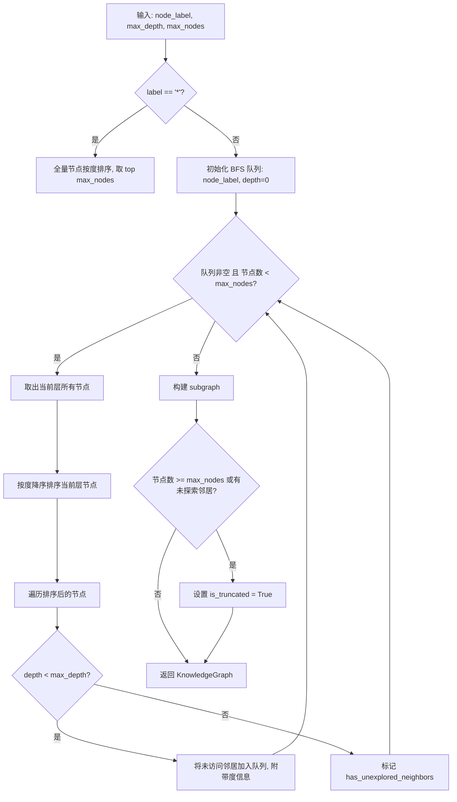
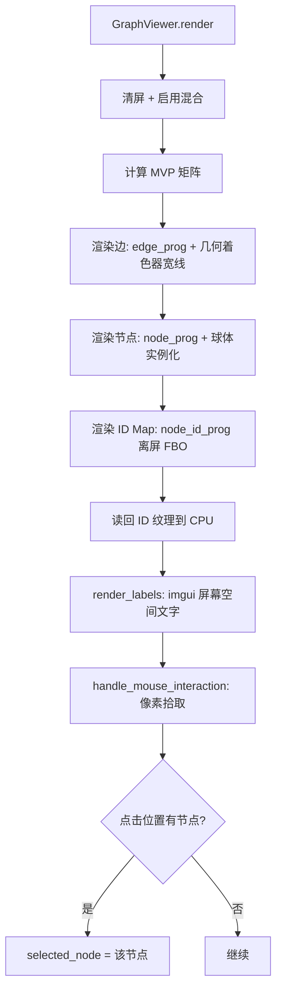

# PD-83.01 LightRAG — 知识图谱双通道可视化方案

> 文档编号：PD-83.01
> 来源：LightRAG `lightrag/tools/lightrag_visualizer/graph_visualizer.py`, `lightrag/api/routers/graph_routes.py`, `lightrag/kg/networkx_impl.py`, `lightrag_webui/src/features/GraphViewer.tsx`
> GitHub：https://github.com/HKUDS/LightRAG.git
> 问题域：PD-83 知识图谱可视化 Knowledge Graph Visualization
> 状态：可复用方案

---

## 第 1 章 问题与动机

### 1.1 核心问题

知识图谱系统在完成实体抽取和关系构建后，面临一个关键挑战：如何让用户直观理解和操作图谱数据？

具体痛点包括：
- **认知负荷**：大规模图谱（数千节点）无法直接展示，需要智能裁剪和分层浏览
- **交互需求**：用户需要搜索、选中、展开、修剪节点，而非仅仅"看"
- **数据管理**：图谱中存在重复实体、拼写错误，需要 CRUD + 合并操作
- **多场景适配**：开发者需要桌面端 3D 调试工具，终端用户需要 Web 端 2D 浏览器
- **性能瓶颈**：全量图谱渲染会导致浏览器卡死，需要 BFS 截断 + 度优先策略

### 1.2 LightRAG 的解法概述

LightRAG 提供了一套完整的双通道可视化方案：

1. **桌面端 3D 可视化器**：基于 ModernGL + imgui 的独立 Python 工具，支持 Louvain 社区检测着色、WASD 相机控制、节点选中和属性查看（`graph_visualizer.py:45-957`）
2. **Web 端 2D 图谱浏览器**：基于 Sigma.js + Graphology 的 React 组件，支持力导向布局、节点拖拽、搜索、展开/修剪（`GraphViewer.tsx:110-260`）
3. **RESTful 图谱 API**：FastAPI 路由层提供标签搜索、子图查询、实体/关系 CRUD 和合并去重（`graph_routes.py:89-688`）
4. **智能子图提取**：基于度优先 BFS 的子图裁剪算法，支持 `max_depth` + `max_nodes` 双重限制和截断标记（`networkx_impl.py:297-472`）
5. **图谱数据管理**：完整的实体/关系 CRUD + 多实体合并，带键级锁保证并发安全（`utils_graph.py:66-1612`）

### 1.3 设计思想

| 设计原则 | 具体实现 | 理由 | 替代方案 |
|----------|----------|------|----------|
| 双通道分离 | 桌面端 ModernGL 3D + Web 端 Sigma.js 2D | 开发调试需要 3D 全局视角，用户浏览需要轻量 Web 端 | 统一用 Three.js（但桌面端性能不如原生 OpenGL） |
| 度优先 BFS | 子图提取时同层节点按度排序，高连接度节点优先保留 | 高度节点是图谱枢纽，优先展示信息密度最高的子图 | 随机 BFS（丢失重要节点）或全量加载（性能崩溃） |
| 键级并发锁 | 实体操作用 `get_storage_keyed_lock` 锁定具体实体名 | 避免全局锁导致的性能瓶颈，允许不同实体并行操作 | 全局写锁（简单但并发差） |
| 社区检测着色 | Louvain 算法自动分组 + 黄金比例 HSV 色彩生成 | 无需手动标注，自动发现图谱结构 | 按 entity_type 着色（需要预定义类型） |
| 截断标记 | `is_truncated` 标志告知前端数据不完整 | 前端可据此提示用户"还有更多数据" | 静默截断（用户不知道数据不完整） |

---

## 第 2 章 源码实现分析

### 2.1 架构概览

LightRAG 的图谱可视化分为四层：

```
┌─────────────────────────────────────────────────────────────────┐
│                        用户界面层                                │
│  ┌──────────────────────┐    ┌────────────────────────────────┐ │
│  │  桌面端 3D Viewer     │    │  Web 端 Sigma.js Viewer        │ │
│  │  ModernGL + imgui     │    │  React + Graphology            │ │
│  │  graph_visualizer.py  │    │  GraphViewer.tsx                │ │
│  └──────────┬───────────┘    └──────────────┬─────────────────┘ │
│             │ GraphML 文件                    │ REST API           │
├─────────────┼────────────────────────────────┼──────────────────┤
│             │                API 路由层        │                   │
│             │    ┌────────────────────────────┴──────────┐       │
│             │    │  graph_routes.py (FastAPI Router)      │       │
│             │    │  /graphs, /graph/label/*, /graph/entity│       │
│             │    └────────────────────────────┬──────────┘       │
├─────────────┼────────────────────────────────┼──────────────────┤
│             │            图谱存储层            │                   │
│             │    ┌────────────────────────────┴──────────┐       │
│             │    │  networkx_impl.py (NetworkXStorage)    │       │
│             │    │  BFS 子图提取 + 标签搜索 + 度排序       │       │
│             │    └────────────────────────────┬──────────┘       │
├─────────────┼────────────────────────────────┼──────────────────┤
│             │          数据操作层              │                   │
│             │    ┌────────────────────────────┴──────────┐       │
│             │    │  utils_graph.py                        │       │
│             │    │  CRUD + Merge + 键级锁 + VDB 同步      │       │
│             │    └──────────────────────────────────────┘       │
└─────────────────────────────────────────────────────────────────┘
```

### 2.2 核心实现

#### 2.2.1 度优先 BFS 子图提取

这是 LightRAG 图谱可视化的核心算法——从一个起始节点出发，用改良 BFS 提取最有信息量的子图。



对应源码 `lightrag/kg/networkx_impl.py:297-472`：

```python
async def get_knowledge_graph(
    self,
    node_label: str,
    max_depth: int = 3,
    max_nodes: int = None,
) -> KnowledgeGraph:
    graph = await self._get_graph()
    result = KnowledgeGraph()

    if node_label == "*":
        # 全量模式：按度排序取 top N
        degrees = dict(graph.degree())
        sorted_nodes = sorted(degrees.items(), key=lambda x: x[1], reverse=True)
        if len(sorted_nodes) > max_nodes:
            result.is_truncated = True
        limited_nodes = [node for node, _ in sorted_nodes[:max_nodes]]
        subgraph = graph.subgraph(limited_nodes)
    else:
        # BFS 模式：度优先遍历
        bfs_nodes = []
        visited = set()
        queue = [(node_label, 0, graph.degree(node_label))]
        has_unexplored_neighbors = False

        while queue and len(bfs_nodes) < max_nodes:
            current_depth = queue[0][1]
            current_level_nodes = []
            while queue and queue[0][1] == current_depth:
                current_level_nodes.append(queue.pop(0))
            # 关键：同层节点按度降序排序
            current_level_nodes.sort(key=lambda x: x[2], reverse=True)

            for current_node, depth, degree in current_level_nodes:
                if current_node not in visited:
                    visited.add(current_node)
                    bfs_nodes.append(current_node)
                    if depth < max_depth:
                        neighbors = list(graph.neighbors(current_node))
                        for neighbor in [n for n in neighbors if n not in visited]:
                            queue.append((neighbor, depth + 1, graph.degree(neighbor)))
                    else:
                        if [n for n in graph.neighbors(current_node) if n not in visited]:
                            has_unexplored_neighbors = True
                if len(bfs_nodes) >= max_nodes:
                    break

        if (queue and len(bfs_nodes) >= max_nodes) or has_unexplored_neighbors:
            result.is_truncated = True
        subgraph = graph.subgraph(bfs_nodes)
    return result
```

#### 2.2.2 桌面端 3D 渲染管线

GraphViewer 类使用 ModernGL 实现 GPU 加速的 3D 图谱渲染，包含节点球体实例化渲染、边线几何着色器宽线、以及离屏 ID 缓冲区实现像素级节点拾取。



对应源码 `lightrag/tools/lightrag_visualizer/graph_visualizer.py:855-903`：

```python
def render(self):
    """Render the graph"""
    self.glctx.clear(*self.background_color, depth=1)
    if not self.graph:
        return
    self.glctx.enable(moderngl.BLEND)
    self.glctx.blend_func = moderngl.SRC_ALPHA, moderngl.ONE_MINUS_SRC_ALPHA
    self.update_view_proj_matrix()
    mvp = self.proj_matrix * self.view_matrix

    # 边渲染：几何着色器将线段扩展为三角带，实现宽线效果
    if self.edge_vao:
        self.edge_prog["mvp"].write(mvp.to_bytes())
        self.edge_prog["edge_width"].value = float(self.edge_width) * 2.0
        self.edge_prog["viewport_size"].value = (
            float(self.window_width), float(self.window_height))
        self.edge_vao.render(moderngl.LINES)

    # 节点渲染：球体网格 + 实例化，每个节点一个实例
    if self.node_vao:
        self.node_prog["mvp"].write(mvp.to_bytes())
        self.node_prog["camera"].write(self.position.to_bytes())
        self.node_prog["selected_node"].write(
            np.int32(self.selected_node.idx).tobytes()
            if self.selected_node else np.int32(-1).tobytes())
        self.node_prog["scale"].write(np.float32(self.node_scale).tobytes())
        self.node_vao.render(moderngl.TRIANGLES)

    self.glctx.disable(moderngl.BLEND)
    # 离屏 ID 渲染：每个节点用唯一颜色编码 instance ID
    self.render_id_map(mvp)
```

### 2.3 实现细节

#### Louvain 社区检测 + 黄金比例着色

`graph_visualizer.py:535-543` 中，布局计算时自动执行 Louvain 社区检测：

```python
def calculate_layout(self):
    if not self.graph:
        return
    # Louvain 社区检测
    self.communities = community.best_partition(self.graph)
    num_communities = len(set(self.communities.values()))
    # 黄金比例 HSV 色彩生成，确保相邻社区颜色差异最大
    self.community_colors = generate_colors(num_communities)
```

`generate_colors` 函数（`graph_visualizer.py:959-972`）使用黄金比例 φ ≈ 0.618 在色相环上均匀分布颜色：

```python
def generate_colors(n: int) -> List[glm.vec3]:
    colors = []
    for i in range(n):
        hue = (i * 0.618033988749895) % 1.0  # 黄金比例
        saturation = 0.8
        value = 0.95
        rgb = colorsys.hsv_to_rgb(hue, saturation, value)
        colors.append(glm.vec3(rgb))
    return colors
```

#### Web 端 Sigma.js 图谱构建

`useLightragGraph.tsx:186-259` 中，前端将后端返回的原始图谱数据转换为 Sigma.js 可渲染的 UndirectedGraph：

- 节点位置使用 `seedrandom` 生成确定性随机坐标
- 边权重通过平方根缩放映射到视觉粗细：`scaledSize = min + scale * sqrt((w - min) / range)`
- 节点颜色按 `entity_type` 分配，使用 Zustand store 维护类型-颜色映射

#### 模糊标签搜索

`networkx_impl.py:241-295` 实现了三级相关度评分的模糊搜索：

| 匹配类型 | 分数 | 示例 |
|----------|------|------|
| 精确匹配 | 1000 | query="Tesla", node="Tesla" |
| 前缀匹配 | 500 | query="Tes", node="Tesla" |
| 包含匹配 | 100 - len(node) | query="esl", node="Tesla" |
| 词边界加分 | +50 | query="musk", node="Elon Musk" |


---

## 第 3 章 迁移指南

### 3.1 迁移清单

**阶段 1：图谱存储与查询层（必选）**

- [ ] 实现 `GraphStorage` 抽象基类，包含 `get_all_labels`、`get_popular_labels`、`search_labels`、`get_knowledge_graph` 方法
- [ ] 实现度优先 BFS 子图提取算法（核心，直接复用 `networkx_impl.py:297-472`）
- [ ] 定义 `KnowledgeGraph`、`KnowledgeGraphNode`、`KnowledgeGraphEdge` 数据模型
- [ ] 实现模糊标签搜索（三级评分：精确 > 前缀 > 包含）

**阶段 2：REST API 层（必选）**

- [ ] 创建 FastAPI 路由：`GET /graphs`、`GET /graph/label/list`、`GET /graph/label/popular`、`GET /graph/label/search`
- [ ] 创建 CRUD 路由：`POST /graph/entity/create`、`POST /graph/entity/edit`、`POST /graph/relation/create`、`POST /graph/relation/edit`
- [ ] 创建合并路由：`POST /graph/entities/merge`
- [ ] 添加认证中间件（`get_combined_auth_dependency`）

**阶段 3：Web 前端（按需）**

- [ ] 集成 Sigma.js + Graphology（`@react-sigma/core`、`graphology`）
- [ ] 实现图谱数据获取 hook（参考 `useLightragGraph.tsx`）
- [ ] 实现节点展开/修剪交互
- [ ] 实现标签搜索组件

**阶段 4：桌面端 3D 工具（可选）**

- [ ] 集成 ModernGL + imgui_bundle
- [ ] 实现 GraphML 文件加载 + Louvain 社区检测
- [ ] 实现 3D 相机控制和节点拾取

### 3.2 适配代码模板

#### 度优先 BFS 子图提取（可直接复用）

```python
from dataclasses import dataclass, field
from typing import Optional
import networkx as nx


@dataclass
class KnowledgeGraphNode:
    id: str
    labels: list[str]
    properties: dict


@dataclass
class KnowledgeGraphEdge:
    id: str
    type: str
    source: str
    target: str
    properties: dict


@dataclass
class KnowledgeGraph:
    nodes: list[KnowledgeGraphNode] = field(default_factory=list)
    edges: list[KnowledgeGraphEdge] = field(default_factory=list)
    is_truncated: bool = False


def extract_subgraph(
    graph: nx.Graph,
    start_node: str,
    max_depth: int = 3,
    max_nodes: int = 1000,
) -> KnowledgeGraph:
    """度优先 BFS 子图提取 — 移植自 LightRAG networkx_impl.py"""
    result = KnowledgeGraph()

    if start_node == "*":
        degrees = dict(graph.degree())
        sorted_nodes = sorted(degrees.items(), key=lambda x: x[1], reverse=True)
        if len(sorted_nodes) > max_nodes:
            result.is_truncated = True
        subgraph = graph.subgraph([n for n, _ in sorted_nodes[:max_nodes]])
    else:
        if start_node not in graph:
            return result

        bfs_nodes, visited = [], set()
        queue = [(start_node, 0, graph.degree(start_node))]
        has_unexplored = False

        while queue and len(bfs_nodes) < max_nodes:
            current_depth = queue[0][1]
            level_nodes = []
            while queue and queue[0][1] == current_depth:
                level_nodes.append(queue.pop(0))
            level_nodes.sort(key=lambda x: x[2], reverse=True)

            for node, depth, _ in level_nodes:
                if node not in visited:
                    visited.add(node)
                    bfs_nodes.append(node)
                    if depth < max_depth:
                        for nb in graph.neighbors(node):
                            if nb not in visited:
                                queue.append((nb, depth + 1, graph.degree(nb)))
                    else:
                        if any(nb not in visited for nb in graph.neighbors(node)):
                            has_unexplored = True
                if len(bfs_nodes) >= max_nodes:
                    break

        if (queue and len(bfs_nodes) >= max_nodes) or has_unexplored:
            result.is_truncated = True
        subgraph = graph.subgraph(bfs_nodes)

    # 构建结果
    seen_edges = set()
    for node in subgraph.nodes():
        node_data = dict(subgraph.nodes[node])
        labels = node_data.get("entity_type", ["UNKNOWN"])
        if isinstance(labels, str):
            labels = [labels]
        result.nodes.append(KnowledgeGraphNode(
            id=str(node), labels=labels, properties=node_data
        ))

    for src, tgt in subgraph.edges():
        if src > tgt:
            src, tgt = tgt, src
        edge_id = f"{src}-{tgt}"
        if edge_id not in seen_edges:
            seen_edges.add(edge_id)
            result.edges.append(KnowledgeGraphEdge(
                id=edge_id, type="DIRECTED",
                source=str(src), target=str(tgt),
                properties=dict(subgraph.edges[(src, tgt)])
            ))

    return result
```

#### 模糊标签搜索（可直接复用）

```python
def search_labels(graph: nx.Graph, query: str, limit: int = 50) -> list[str]:
    """三级相关度模糊搜索 — 移植自 LightRAG networkx_impl.py"""
    query_lower = query.lower().strip()
    if not query_lower:
        return []

    matches = []
    for node in graph.nodes():
        node_str = str(node)
        node_lower = node_str.lower()
        if query_lower not in node_lower:
            continue
        if node_lower == query_lower:
            score = 1000
        elif node_lower.startswith(query_lower):
            score = 500
        else:
            score = 100 - len(node_str)
            if f" {query_lower}" in node_lower or f"_{query_lower}" in node_lower:
                score += 50
        matches.append((node_str, score))

    matches.sort(key=lambda x: (-x[1], x[0]))
    return [m[0] for m in matches[:limit]]
```

### 3.3 适用场景

| 场景 | 适用度 | 说明 |
|------|--------|------|
| RAG 系统知识图谱浏览 | ⭐⭐⭐ | 完美匹配，直接复用全套方案 |
| 通用图数据库可视化 | ⭐⭐⭐ | BFS 子图提取 + 标签搜索通用性强 |
| 社交网络分析 | ⭐⭐ | 社区检测和度优先策略适用，但缺少时间维度 |
| 实时流式图谱 | ⭐ | 当前方案是静态快照，不支持增量更新渲染 |
| 超大规模图谱（>100万节点） | ⭐ | NetworkX 内存限制，需换用 Neo4j/Memgraph 后端 |

---

## 第 4 章 测试用例

```python
import pytest
import networkx as nx


# 复用上面的 extract_subgraph 和 search_labels 函数

class TestSubgraphExtraction:
    """测试度优先 BFS 子图提取"""

    @pytest.fixture
    def sample_graph(self):
        """构建一个有明确度差异的测试图"""
        G = nx.Graph()
        # hub 节点连接 10 个邻居
        for i in range(10):
            G.add_edge("hub", f"spoke_{i}")
        # spoke_0 额外连接 5 个二级节点
        for i in range(5):
            G.add_edge("spoke_0", f"level2_{i}")
        # spoke_1 连接 2 个二级节点
        G.add_edge("spoke_1", "level2_a")
        G.add_edge("spoke_1", "level2_b")
        return G

    def test_normal_bfs(self, sample_graph):
        """正常 BFS 应返回从起始节点可达的子图"""
        result = extract_subgraph(sample_graph, "hub", max_depth=2, max_nodes=100)
        assert len(result.nodes) == 18  # hub + 10 spokes + 5 level2 + 2 level2
        assert not result.is_truncated

    def test_max_nodes_truncation(self, sample_graph):
        """max_nodes 限制应触发截断标记"""
        result = extract_subgraph(sample_graph, "hub", max_depth=3, max_nodes=5)
        assert len(result.nodes) == 5
        assert result.is_truncated

    def test_degree_priority(self, sample_graph):
        """同层节点应按度降序排列，spoke_0（度=6）应优先于 spoke_1（度=3）"""
        result = extract_subgraph(sample_graph, "hub", max_depth=1, max_nodes=3)
        node_ids = [n.id for n in result.nodes]
        assert "hub" in node_ids
        assert "spoke_0" in node_ids  # 度最高的 spoke 应被优先选中

    def test_star_query(self, sample_graph):
        """'*' 查询应返回全量节点按度排序"""
        result = extract_subgraph(sample_graph, "*", max_nodes=5)
        assert len(result.nodes) == 5
        assert result.nodes[0].id == "hub"  # 度最高

    def test_nonexistent_node(self, sample_graph):
        """查询不存在的节点应返回空图"""
        result = extract_subgraph(sample_graph, "nonexistent")
        assert len(result.nodes) == 0
        assert len(result.edges) == 0

    def test_depth_limit(self, sample_graph):
        """max_depth=1 应只返回直接邻居"""
        result = extract_subgraph(sample_graph, "hub", max_depth=1, max_nodes=100)
        node_ids = {n.id for n in result.nodes}
        assert "hub" in node_ids
        assert all(f"spoke_{i}" in node_ids for i in range(10))
        assert "level2_0" not in node_ids  # 二级节点不应出现


class TestLabelSearch:
    """测试模糊标签搜索"""

    @pytest.fixture
    def label_graph(self):
        G = nx.Graph()
        for name in ["Tesla", "Elon Musk", "test_case", "Testing Framework",
                      "Elasticsearch", "TESLA MOTORS"]:
            G.add_node(name)
        return G

    def test_exact_match_highest_score(self, label_graph):
        results = search_labels(label_graph, "Tesla")
        assert results[0] == "Tesla"  # 精确匹配排第一

    def test_prefix_match(self, label_graph):
        results = search_labels(label_graph, "Tes")
        assert "Tesla" in results
        assert "Testing Framework" in results

    def test_word_boundary_bonus(self, label_graph):
        results = search_labels(label_graph, "musk")
        assert "Elon Musk" in results

    def test_empty_query(self, label_graph):
        results = search_labels(label_graph, "")
        assert results == []

    def test_limit(self, label_graph):
        results = search_labels(label_graph, "es", limit=2)
        assert len(results) <= 2
```

