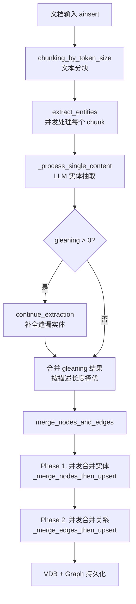
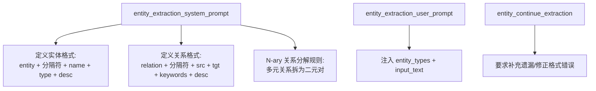
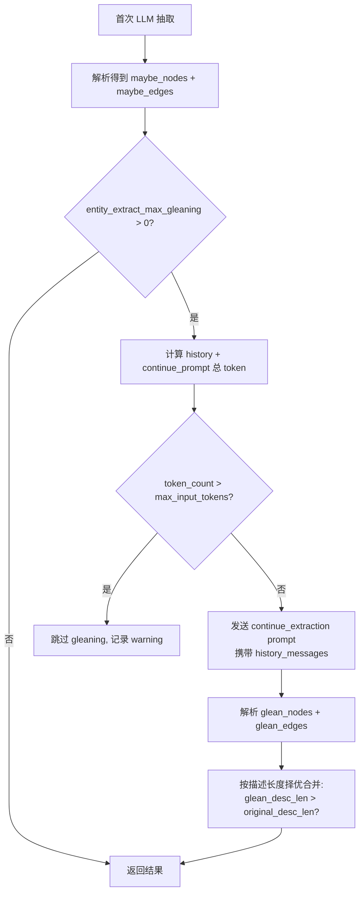
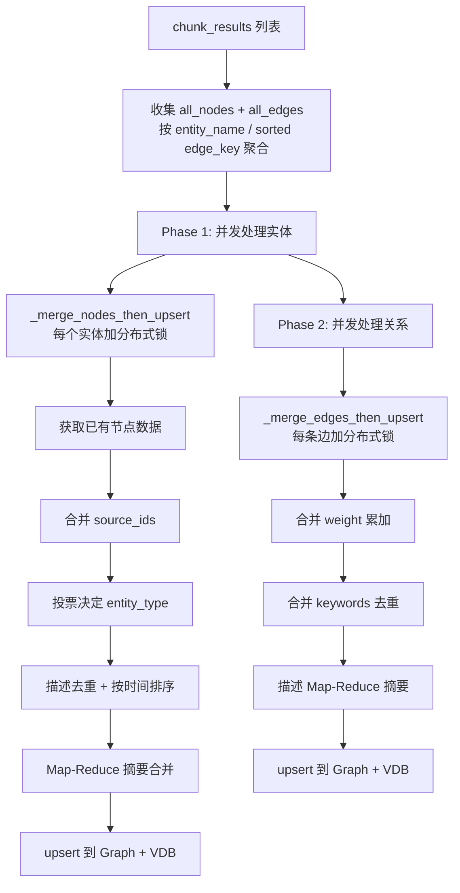

# PD-84.01 LightRAG — LLM 驱动实体/关系抽取与知识图谱自动构建

> 文档编号：PD-84.01
> 来源：LightRAG `lightrag/operate.py`, `lightrag/prompt.py`, `lightrag/lightrag.py`
> GitHub：https://github.com/HKUDS/LightRAG.git
> 问题域：PD-84 知识图谱构建 Knowledge Graph Construction
> 状态：可复用方案

---

## 第 1 章 问题与动机

### 1.1 核心问题

RAG 系统的检索质量高度依赖知识的组织方式。传统向量检索只能做语义相似度匹配，无法捕捉实体间的结构化关系——比如"A 是 B 的子公司"、"X 方法用于解决 Y 问题"这类关系。知识图谱（KG）能补充这一缺陷，但手动构建 KG 成本极高，且难以跟上文档增量更新的节奏。

核心挑战：
- **自动化抽取**：如何从非结构化文本中自动提取高质量的实体和关系？
- **召回率提升**：单次 LLM 抽取往往遗漏实体，如何系统性地补全？
- **增量合并**：新文档插入时，如何与已有图谱中的同名实体/关系正确合并？
- **描述摘要**：同一实体在不同文档中有不同描述，如何合并为一致的摘要？
- **存储抽象**：如何支持从轻量级 NetworkX 到生产级 Neo4j/PostgreSQL 的多种后端？

### 1.2 LightRAG 的解法概述

LightRAG 采用 **LLM 驱动的两阶段抽取 + 两阶段合并** 架构：

1. **Prompt 驱动抽取**：使用精心设计的 `entity_extraction` prompt，让 LLM 以固定分隔符格式输出实体和关系（`operate.py:2849-2868`）
2. **Gleaning 补全**：首次抽取后，发送 `entity_continue_extraction` prompt 要求 LLM 补充遗漏的实体/关系，通过描述长度比较选择更优版本（`operate.py:2885-2960`）
3. **两阶段合并**：先并发处理所有实体（Phase 1），再并发处理所有关系（Phase 2），确保关系引用的实体已存在（`operate.py:2488-2594`）
4. **Map-Reduce 描述摘要**：当同一实体的描述片段过多时，分组摘要再递归合并，避免超出 LLM 上下文窗口（`operate.py:208-294`）
5. **存储抽象层**：`BaseGraphStorage` 抽象类定义统一接口，支持 NetworkX、Neo4j、Memgraph、PostgreSQL、MongoDB 五种图存储后端（`base.py:405-504`）

### 1.3 设计思想

| 设计原则 | 具体实现 | 理由 | 替代方案 |
|----------|----------|------|----------|
| Prompt 即协议 | 用 `<\|#\|>` 分隔符 + `entity/relation` 前缀定义输出格式 | 比 JSON 输出更稳定，LLM 不易产生格式错误 | 要求 LLM 输出 JSON（解析失败率更高） |
| Gleaning 多轮补全 | 首次抽取后追加 continue_extraction prompt | 单次抽取召回率约 70-80%，gleaning 可提升至 90%+ | 一次性要求抽取所有（遗漏率高） |
| 两阶段合并 | 先实体后关系，关系阶段可自动补建缺失实体 | 保证关系的两端节点一定存在 | 实体关系混合处理（可能出现悬挂边） |
| Map-Reduce 摘要 | 描述列表按 token 分组，每组 LLM 摘要，递归合并 | 避免超长描述列表溢出上下文窗口 | 简单截断（丢失信息） |
| 投票式类型决定 | 同名实体多次出现时，取出现次数最多的 entity_type | 容忍 LLM 偶尔的类型分类错误 | 取第一次出现的类型（不够鲁棒） |
| 存储注册表 | `STORAGES` 字典映射类名到模块路径，懒加载 | 不安装 Neo4j 驱动也能用 NetworkX | 硬编码 import（依赖膨胀） |

---

## 第 2 章 源码实现分析

### 2.1 架构概览

LightRAG 的知识图谱构建流水线从文档插入到图谱持久化，经历 5 个阶段：

```
┌──────────────┐     ┌──────────────┐     ┌──────────────────┐
│  ainsert()   │────→│  chunking    │────→│ extract_entities │
│  文档入口     │     │  文本分块     │     │  LLM 实体抽取    │
└──────────────┘     └──────────────┘     └────────┬─────────┘
                                                    │
                                          ┌─────────▼─────────┐
                                          │  gleaning 补全     │
                                          │  continue_extract  │
                                          └─────────┬─────────┘
                                                    │
                     ┌──────────────┐     ┌─────────▼─────────┐
                     │  _insert_done│←────│ merge_nodes_edges │
                     │  持久化回调   │     │  两阶段合并入图    │
                     └──────────────┘     └───────────────────┘
```

核心数据流：



### 2.2 核心实现

#### 2.2.1 实体/关系抽取 Prompt 设计

LightRAG 的 prompt 设计是整个图谱构建的基石。`prompt.py` 定义了一套严格的输出协议：



对应源码 `lightrag/prompt.py:11-61`：
```python
PROMPTS["entity_extraction_system_prompt"] = """---Role---
You are a Knowledge Graph Specialist responsible for extracting entities and relationships from the input text.

---Instructions---
1.  **Entity Extraction & Output:**
    *   **Identification:** Identify clearly defined and meaningful entities in the input text.
    *   **Entity Details:** For each identified entity, extract the following information:
        *   `entity_name`: The name of the entity. If the entity name is case-insensitive, capitalize the first letter of each significant word (title case).
        *   `entity_type`: Categorize the entity using one of the following types: `{entity_types}`.
        *   `entity_description`: Provide a concise yet comprehensive description of the entity's attributes and activities.
    *   **Output Format - Entities:** Output a total of 4 fields for each entity, delimited by `{tuple_delimiter}`, on a single line.
        *   Format: `entity{tuple_delimiter}entity_name{tuple_delimiter}entity_type{tuple_delimiter}entity_description`

2.  **Relationship Extraction & Output:**
    *   **N-ary Relationship Decomposition:** If a single statement describes a relationship involving more than two entities, decompose it into multiple binary relationship pairs.
    *   **Output Format - Relationships:** Output a total of 5 fields for each relationship, delimited by `{tuple_delimiter}`, on a single line.
        *   Format: `relation{tuple_delimiter}source_entity{tuple_delimiter}target_entity{tuple_delimiter}relationship_keywords{tuple_delimiter}relationship_description`
...
"""
```

关键设计点：
- **分隔符协议**：使用 `<|#|>` 作为字段分隔符，`<|COMPLETE|>` 作为结束标记（`prompt.py:8-9`）
- **N-ary 分解**：明确要求将多元关系拆为二元对，避免图谱中出现超边
- **Title Case 规范化**：要求实体名首字母大写，减少同名实体因大小写不同而重复

#### 2.2.2 Gleaning 多轮补全机制



对应源码 `lightrag/operate.py:2884-2960`：
```python
# Process additional gleaning results only 1 time when entity_extract_max_gleaning is greater than zero.
if entity_extract_max_gleaning > 0:
    # Calculate total tokens for the gleaning request to prevent context window overflow
    tokenizer = global_config["tokenizer"]
    max_input_tokens = global_config["max_extract_input_tokens"]

    history_str = json.dumps(history, ensure_ascii=False)
    full_context_str = (
        entity_extraction_system_prompt
        + history_str
        + entity_continue_extraction_user_prompt
    )
    token_count = len(tokenizer.encode(full_context_str))

    if token_count > max_input_tokens:
        logger.warning(
            f"Gleaning stopped for chunk {chunk_key}: Input tokens ({token_count}) exceeded limit ({max_input_tokens})."
        )
    else:
        glean_result, timestamp = await use_llm_func_with_cache(
            entity_continue_extraction_user_prompt,
            use_llm_func,
            system_prompt=entity_extraction_system_prompt,
            llm_response_cache=llm_response_cache,
            history_messages=history,
            cache_type="extract",
            chunk_id=chunk_key,
            cache_keys_collector=cache_keys_collector,
        )

        glean_nodes, glean_edges = await _process_extraction_result(
            glean_result, chunk_key, timestamp, file_path,
            tuple_delimiter=context_base["tuple_delimiter"],
            completion_delimiter=context_base["completion_delimiter"],
        )

        # Merge results - compare description lengths to choose better version
        for entity_name, glean_entities in glean_nodes.items():
            if entity_name in maybe_nodes:
                original_desc_len = len(maybe_nodes[entity_name][0].get("description", "") or "")
                glean_desc_len = len(glean_entities[0].get("description", "") or "")
                if glean_desc_len > original_desc_len:
                    maybe_nodes[entity_name] = list(glean_entities)
            else:
                maybe_nodes[entity_name] = list(glean_entities)
```

关键设计点：
- **Token 安全检查**：gleaning 前计算总 token 数，超过 `max_extract_input_tokens`（默认 20480）则跳过，防止上下文溢出
- **描述长度择优**：同名实体在 gleaning 中再次出现时，取描述更长的版本（更详细 = 更好）
- **LLM 缓存**：通过 `use_llm_func_with_cache` 和 `cache_keys_collector` 实现抽取结果缓存，避免重复调用

#### 2.2.3 两阶段合并与实体去重



对应源码 `lightrag/operate.py:1598-1714`（实体合并核心逻辑）：
```python
async def _merge_nodes_then_upsert(
    entity_name: str,
    nodes_data: list[dict],
    knowledge_graph_inst: BaseGraphStorage,
    entity_vdb: BaseVectorStorage | None,
    global_config: dict,
    ...
):
    # 1. Get existing node data from knowledge graph
    already_node = await knowledge_graph_inst.get_node(entity_name)
    if already_node:
        already_entity_types.append(already_node.get("entity_type") or "UNKNOWN")
        already_source_ids.extend(existing_source_id.split(GRAPH_FIELD_SEP))
        already_description.extend(existing_desc.split(GRAPH_FIELD_SEP))

    # 2. Merge source_ids (full tracking + limit application)
    full_source_ids = merge_source_ids(existing_full_source_ids, new_source_ids)
    source_ids = apply_source_ids_limit(full_source_ids, max_source_limit, limit_method, ...)

    # 6.2 Finalize entity type by highest count (投票机制)
    entity_type = sorted(
        Counter([dp["entity_type"] for dp in nodes_data] + already_entity_types).items(),
        key=lambda x: x[1], reverse=True,
    )[0][0]

    # 7. Deduplicate nodes by description
    unique_nodes = {}
    for dp in nodes_data:
        desc = dp.get("description")
        if desc not in unique_nodes:
            unique_nodes[desc] = dp

    # 8. Map-Reduce summary
    description, llm_was_used = await _handle_entity_relation_summary(
        "Entity", entity_name, description_list, GRAPH_FIELD_SEP, global_config, ...
    )
```

### 2.3 实现细节

#### Map-Reduce 描述摘要算法

`_handle_entity_relation_summary`（`operate.py:165-294`）实现了一个迭代式 Map-Reduce：

1. **短路条件**：描述数 < `force_llm_summary_on_merge`（默认 8）且总 token < `summary_max_tokens`（默认 1200）时，直接用 `<SEP>` 拼接，不调用 LLM
2. **Map 阶段**：将描述列表按 `summary_context_size`（默认 12000 token）分组，每组至少 2 条描述
3. **Reduce 阶段**：每组调用 LLM 摘要，单条描述的组直接保留
4. **递归**：将摘要结果作为新的描述列表，重复 Map-Reduce 直到满足短路条件

#### LLM 输出容错解析

`_process_extraction_result`（`operate.py:915-1037`）包含大量容错逻辑：
- 修复 LLM 用分隔符代替换行的格式错误（`operate.py:948-977`）
- 修复分隔符损坏（如 `<|#>` 缺少闭合）（`operate.py:989-997`）
- 实体名长度截断保护（默认 256 字符上限）（`operate.py:1006-1012`）
- 空实体名/空描述/非法类型字符过滤（`operate.py:398-428`）

#### 并发控制与分布式锁

合并阶段使用 `asyncio.Semaphore` 限制并发数（`operate.py:2486`），每个实体/关系的合并操作通过 `get_storage_keyed_lock` 加分布式锁（`operate.py:2507-2508`），防止多进程同时修改同一节点。

#### 关系权重累加

关系的 `weight` 字段在每次合并时累加（`operate.py:2029`）：`weight = sum([dp["weight"] for dp in edges_data] + already_weights)`。出现次数越多的关系权重越高，检索时可用于排序。


---

## 第 3 章 迁移指南

### 3.1 迁移清单

**阶段 1：核心抽取能力（最小可用）**

- [ ] 定义实体/关系抽取 prompt（参考 `prompt.py:11-61` 的分隔符协议）
- [ ] 实现 `_process_extraction_result` 解析器，处理 LLM 输出的分隔符格式
- [ ] 实现 `_handle_single_entity_extraction` 和 `_handle_single_relationship_extraction`
- [ ] 集成 LLM 调用函数（支持 system_prompt + history_messages）

**阶段 2：Gleaning 补全**

- [ ] 实现 `entity_continue_extraction_user_prompt` 模板
- [ ] 添加 token 计数安全检查（防止 gleaning 溢出上下文窗口）
- [ ] 实现描述长度择优合并逻辑

**阶段 3：图谱合并**

- [ ] 实现两阶段合并（先实体后关系）
- [ ] 实现 Map-Reduce 描述摘要（`_handle_entity_relation_summary`）
- [ ] 实现实体类型投票机制（Counter + 排序取最高频）
- [ ] 实现关系权重累加
- [ ] 添加并发控制（Semaphore + keyed lock）

**阶段 4：存储抽象**

- [ ] 定义 `BaseGraphStorage` 抽象接口（has_node, has_edge, get_node, upsert_node 等）
- [ ] 实现至少一种后端（推荐 NetworkX 用于开发，Neo4j 用于生产）
- [ ] 实现 source_ids 限制策略（FIFO / KEEP）

### 3.2 适配代码模板

以下是一个可直接运行的最小化实体抽取 + 合并模板：

```python
import asyncio
import json
from collections import Counter, defaultdict
from dataclasses import dataclass
from typing import Any, Callable

TUPLE_DELIMITER = "<|#|>"
COMPLETION_DELIMITER = "<|COMPLETE|>"
GRAPH_FIELD_SEP = "<SEP>"

# ---- Prompt 模板 ----
ENTITY_EXTRACTION_SYSTEM = """---Role---
You are a Knowledge Graph Specialist.

---Instructions---
1. Extract entities: entity{delim}name{delim}type{delim}description
2. Extract relations: relation{delim}src{delim}tgt{delim}keywords{delim}description
3. Output {completion} when done.
""".format(delim=TUPLE_DELIMITER, completion=COMPLETION_DELIMITER)

ENTITY_EXTRACTION_USER = """Extract entities and relationships from:
<Entity_types>[{entity_types}]
<Input Text>
```
{input_text}
```
<Output>
"""

CONTINUE_EXTRACTION = """Identify any missed or incorrectly formatted entities and relationships.
Do NOT re-output correctly extracted ones. Output {completion} when done.
""".format(completion=COMPLETION_DELIMITER)


def parse_extraction_result(result: str) -> tuple[dict, dict]:
    """解析 LLM 输出的实体/关系，返回 (nodes_dict, edges_dict)"""
    nodes = defaultdict(list)
    edges = defaultdict(list)

    records = result.replace(COMPLETION_DELIMITER, "").strip().split("\n")
    for record in records:
        record = record.strip()
        if not record:
            continue
        fields = record.split(TUPLE_DELIMITER)

        if len(fields) == 4 and "entity" in fields[0]:
            name = fields[1].strip().title()
            nodes[name].append({
                "entity_name": name,
                "entity_type": fields[2].strip().lower(),
                "description": fields[3].strip(),
            })
        elif len(fields) == 5 and "relation" in fields[0]:
            src, tgt = fields[1].strip().title(), fields[2].strip().title()
            edges[(src, tgt)].append({
                "src_id": src, "tgt_id": tgt,
                "keywords": fields[3].strip(),
                "description": fields[4].strip(),
                "weight": 1.0,
            })
    return dict(nodes), dict(edges)


async def extract_with_gleaning(
    content: str,
    llm_func: Callable,
    entity_types: list[str],
    max_gleaning: int = 1,
) -> tuple[dict, dict]:
    """带 gleaning 的实体抽取"""
    user_prompt = ENTITY_EXTRACTION_USER.format(
        entity_types=",".join(entity_types), input_text=content
    )

    # 首次抽取
    result = await llm_func(user_prompt, system_prompt=ENTITY_EXTRACTION_SYSTEM)
    nodes, edges = parse_extraction_result(result)

    # Gleaning 补全
    if max_gleaning > 0:
        history = [
            {"role": "user", "content": user_prompt},
            {"role": "assistant", "content": result},
        ]
        glean_result = await llm_func(
            CONTINUE_EXTRACTION,
            system_prompt=ENTITY_EXTRACTION_SYSTEM,
            history_messages=history,
        )
        glean_nodes, glean_edges = parse_extraction_result(glean_result)

        # 按描述长度择优合并
        for name, entities in glean_nodes.items():
            if name in nodes:
                if len(entities[0].get("description", "")) > len(nodes[name][0].get("description", "")):
                    nodes[name] = entities
            else:
                nodes[name] = entities

        for key, rels in glean_edges.items():
            if key not in edges:
                edges[key] = rels

    return nodes, edges


def merge_entity_descriptions(
    entity_name: str,
    description_list: list[str],
    force_summary_threshold: int = 8,
) -> str:
    """简化版描述合并（不调用 LLM，直接拼接或截断）"""
    if len(description_list) < force_summary_threshold:
        return GRAPH_FIELD_SEP.join(description_list)
    # 生产环境应替换为 LLM Map-Reduce 摘要
    return GRAPH_FIELD_SEP.join(description_list[:force_summary_threshold])


def resolve_entity_type(type_list: list[str]) -> str:
    """投票式类型决定"""
    return Counter(type_list).most_common(1)[0][0]
```

### 3.3 适用场景

| 场景 | 适用度 | 说明 |
|------|--------|------|
| RAG 系统增强检索 | ⭐⭐⭐ | 核心场景，KG 补充向量检索的结构化关系 |
| 文档知识库自动构建 | ⭐⭐⭐ | 批量文档插入 + 增量更新，自动维护图谱 |
| 学术论文关系挖掘 | ⭐⭐⭐ | 论文中的方法-数据集-指标关系抽取 |
| 实时流式文档处理 | ⭐⭐ | 支持增量合并，但 LLM 调用延迟较高 |
| 超大规模图谱（>100M 节点） | ⭐ | Map-Reduce 摘要的 LLM 成本随规模线性增长 |

---

## 第 4 章 测试用例

```python
import pytest
from collections import Counter, defaultdict


# ---- 测试辅助 ----
TUPLE_DELIMITER = "<|#|>"
COMPLETION_DELIMITER = "<|COMPLETE|>"
GRAPH_FIELD_SEP = "<SEP>"


def parse_extraction_result(result: str) -> tuple[dict, dict]:
    """复用第 3 章的解析函数"""
    nodes = defaultdict(list)
    edges = defaultdict(list)
    records = result.replace(COMPLETION_DELIMITER, "").strip().split("\n")
    for record in records:
        record = record.strip()
        if not record:
            continue
        fields = record.split(TUPLE_DELIMITER)
        if len(fields) == 4 and "entity" in fields[0]:
            name = fields[1].strip().title()
            nodes[name].append({
                "entity_name": name,
                "entity_type": fields[2].strip().lower(),
                "description": fields[3].strip(),
            })
        elif len(fields) == 5 and "relation" in fields[0]:
            src, tgt = fields[1].strip().title(), fields[2].strip().title()
            edges[(src, tgt)].append({
                "src_id": src, "tgt_id": tgt,
                "keywords": fields[3].strip(),
                "description": fields[4].strip(),
                "weight": 1.0,
            })
    return dict(nodes), dict(edges)


class TestEntityExtractionParsing:
    """测试 LLM 输出解析"""

    def test_normal_entity_and_relation(self):
        """正常格式的实体和关系解析"""
        result = (
            f"entity{TUPLE_DELIMITER}Python{TUPLE_DELIMITER}method{TUPLE_DELIMITER}A programming language\n"
            f"entity{TUPLE_DELIMITER}Guido Van Rossum{TUPLE_DELIMITER}person{TUPLE_DELIMITER}Creator of Python\n"
            f"relation{TUPLE_DELIMITER}Guido Van Rossum{TUPLE_DELIMITER}Python{TUPLE_DELIMITER}created{TUPLE_DELIMITER}Guido created Python\n"
            f"{COMPLETION_DELIMITER}"
        )
        nodes, edges = parse_extraction_result(result)
        assert "Python" in nodes
        assert "Guido Van Rossum" in nodes
        assert len(nodes) == 2
        assert ("Guido Van Rossum", "Python") in edges
        assert edges[("Guido Van Rossum", "Python")][0]["weight"] == 1.0

    def test_empty_result(self):
        """空结果处理"""
        nodes, edges = parse_extraction_result(COMPLETION_DELIMITER)
        assert len(nodes) == 0
        assert len(edges) == 0

    def test_malformed_record_skipped(self):
        """格式错误的记录被跳过"""
        result = (
            f"entity{TUPLE_DELIMITER}ValidEntity{TUPLE_DELIMITER}person{TUPLE_DELIMITER}A valid entity\n"
            f"entity{TUPLE_DELIMITER}BadEntity\n"  # 缺少字段
            f"{COMPLETION_DELIMITER}"
        )
        nodes, edges = parse_extraction_result(result)
        assert "Validentity" in nodes
        assert len(nodes) == 1

    def test_entity_name_title_case(self):
        """实体名自动 Title Case"""
        result = (
            f"entity{TUPLE_DELIMITER}machine learning{TUPLE_DELIMITER}concept{TUPLE_DELIMITER}A field of AI\n"
            f"{COMPLETION_DELIMITER}"
        )
        nodes, _ = parse_extraction_result(result)
        assert "Machine Learning" in nodes


class TestEntityTypeMerge:
    """测试实体类型投票合并"""

    def test_majority_vote(self):
        """多数投票决定类型"""
        types = ["person", "person", "organization", "person"]
        result = Counter(types).most_common(1)[0][0]
        assert result == "person"

    def test_tie_breaking(self):
        """平票时取 Counter 排序靠前的"""
        types = ["person", "organization"]
        result = Counter(types).most_common(1)[0][0]
        assert result in ("person", "organization")


class TestDescriptionMerge:
    """测试描述合并逻辑"""

    def test_below_threshold_join(self):
        """描述数低于阈值时直接拼接"""
        descs = ["Desc A", "Desc B", "Desc C"]
        result = GRAPH_FIELD_SEP.join(descs)
        assert GRAPH_FIELD_SEP in result
        assert "Desc A" in result
        assert "Desc C" in result

    def test_gleaning_longer_description_wins(self):
        """Gleaning 中更长的描述胜出"""
        original = {"description": "Short desc"}
        gleaning = {"description": "A much longer and more detailed description of the entity"}
        if len(gleaning["description"]) > len(original["description"]):
            winner = gleaning
        else:
            winner = original
        assert winner == gleaning


class TestRelationWeightAccumulation:
    """测试关系权重累加"""

    def test_weight_sum(self):
        """多次出现的关系权重累加"""
        edges_data = [{"weight": 1.0}, {"weight": 1.0}, {"weight": 1.0}]
        already_weights = [2.0]
        total = sum([dp["weight"] for dp in edges_data] + already_weights)
        assert total == 5.0
```


---

## 第 5 章 跨域关联

| 关联域 | 关系类型 | 说明 |
|--------|----------|------|
| PD-01 上下文管理 | 依赖 | Gleaning 需要计算 history + prompt 的总 token 数，防止溢出上下文窗口（`operate.py:2886-2904`）；Map-Reduce 摘要按 `summary_context_size` 分组 |
| PD-03 容错与重试 | 协同 | `_process_extraction_result` 包含大量 LLM 输出格式容错（分隔符修复、字段数校验）；`PipelineCancelledException` 支持用户取消 |
| PD-06 记忆持久化 | 依赖 | 图谱数据通过 `BaseGraphStorage` 持久化；`entity_chunks_storage` 和 `relation_chunks_storage` 追踪实体/关系的来源 chunk 列表 |
| PD-08 搜索与检索 | 协同 | 构建的知识图谱直接服务于 `kg_query` 检索；实体和关系同时写入 VDB 支持向量检索 |
| PD-11 可观测性 | 协同 | `pipeline_status` + `pipeline_status_lock` 实时追踪抽取/合并进度，支持前端展示 |
| PD-75 多后端存储 | 依赖 | `STORAGES` 注册表 + `BaseGraphStorage` 抽象支持 5 种图存储后端的动态切换 |
| PD-78 并发控制 | 依赖 | 合并阶段使用 `asyncio.Semaphore` + `get_storage_keyed_lock` 实现细粒度并发控制 |

---

## 第 6 章 来源文件索引

| 文件 | 行范围 | 关键实现 |
|------|--------|----------|
| `lightrag/prompt.py` | L8-9 | 分隔符定义：`DEFAULT_TUPLE_DELIMITER` 和 `DEFAULT_COMPLETION_DELIMITER` |
| `lightrag/prompt.py` | L11-61 | `entity_extraction_system_prompt`：实体/关系抽取的核心 prompt |
| `lightrag/prompt.py` | L63-82 | `entity_extraction_user_prompt`：用户侧抽取指令模板 |
| `lightrag/prompt.py` | L84-100 | `entity_continue_extraction_user_prompt`：Gleaning 补全 prompt |
| `lightrag/prompt.py` | L102-183 | `entity_extraction_examples`：3 个 few-shot 示例 |
| `lightrag/prompt.py` | L185-200 | `summarize_entity_descriptions`：描述摘要 prompt |
| `lightrag/operate.py` | L99-162 | `chunking_by_token_size`：文本分块函数 |
| `lightrag/operate.py` | L165-294 | `_handle_entity_relation_summary`：Map-Reduce 描述摘要 |
| `lightrag/operate.py` | L297-360 | `_summarize_descriptions`：LLM 摘要调用封装 |
| `lightrag/operate.py` | L379-448 | `_handle_single_entity_extraction`：单实体解析与校验 |
| `lightrag/operate.py` | L451-458 | `_handle_single_relationship_extraction`：单关系解析 |
| `lightrag/operate.py` | L915-1037 | `_process_extraction_result`：LLM 输出容错解析 |
| `lightrag/operate.py` | L1598-1797 | `_merge_nodes_then_upsert`：实体合并核心（类型投票+描述去重+摘要） |
| `lightrag/operate.py` | L1886-2035 | `_merge_edges_then_upsert`：关系合并核心（权重累加+keywords 去重） |
| `lightrag/operate.py` | L2411-2594 | `merge_nodes_and_edges`：两阶段合并调度器 |
| `lightrag/operate.py` | L2781-2980 | `extract_entities`：实体抽取入口 + gleaning 逻辑 |
| `lightrag/lightrag.py` | L129-260 | `LightRAG` dataclass：配置参数定义 |
| `lightrag/lightrag.py` | L1158-1191 | `ainsert`：文档插入入口 |
| `lightrag/lightrag.py` | L1642-1910 | `apipeline_process_enqueue_documents`：文档处理流水线 |
| `lightrag/lightrag.py` | L2205-2224 | `_process_extract_entities`：抽取调用封装 |
| `lightrag/base.py` | L405-504 | `BaseGraphStorage`：图存储抽象基类 |
| `lightrag/constants.py` | L15-44 | 核心常量：`DEFAULT_MAX_GLEANING=1`, `GRAPH_FIELD_SEP="<SEP>"` |
| `lightrag/kg/__init__.py` | L97-119 | `STORAGES`：存储实现注册表 |

---

## 第 7 章 横向对比维度

```json comparison_data
{
  "project": "LightRAG",
  "dimensions": {
    "抽取方式": "LLM prompt + 分隔符协议，非 JSON 输出",
    "召回增强": "Gleaning 多轮补全，描述长度择优合并",
    "合并策略": "两阶段合并（先实体后关系），实体类型投票，描述 Map-Reduce 摘要",
    "去重机制": "实体名 Title Case 规范化 + 描述文本去重",
    "存储抽象": "BaseGraphStorage 抽象层，STORAGES 注册表懒加载 5 种后端",
    "并发模型": "asyncio.Semaphore + keyed lock 细粒度并发控制",
    "增量更新": "source_ids 追踪 + FIFO/KEEP 两种限制策略"
  }
}
```

### 域元数据补充

```json domain_metadata
{
  "solution_summary": "LightRAG 用分隔符协议 prompt + gleaning 多轮补全抽取实体关系，两阶段合并入图，Map-Reduce 递归摘要合并描述，支持 5 种图存储后端",
  "description": "从非结构化文本自动构建可增量更新的知识图谱的完整工程方案",
  "sub_problems": [
    "LLM 输出格式损坏的容错解析",
    "多文档同名实体的类型冲突解决",
    "描述摘要的 token 预算控制与递归合并"
  ],
  "best_practices": [
    "分隔符协议比 JSON 输出更稳定，LLM 格式错误率更低",
    "两阶段合并（先实体后关系）保证关系端点一定存在",
    "实体类型用投票机制（Counter.most_common）容忍偶发分类错误"
  ]
}
```

