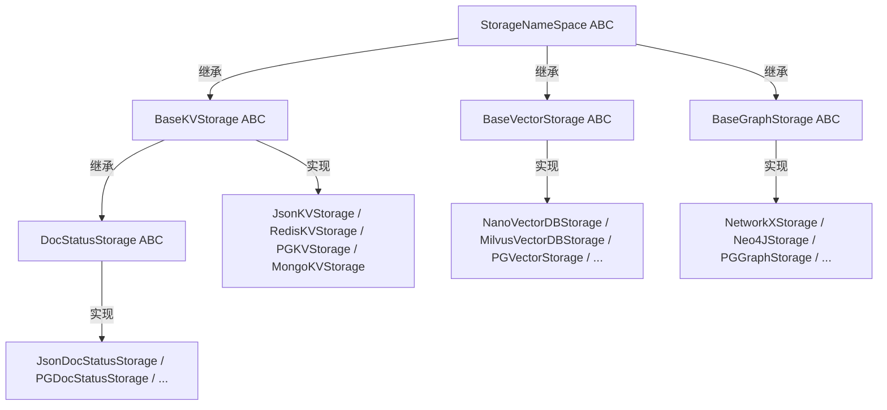
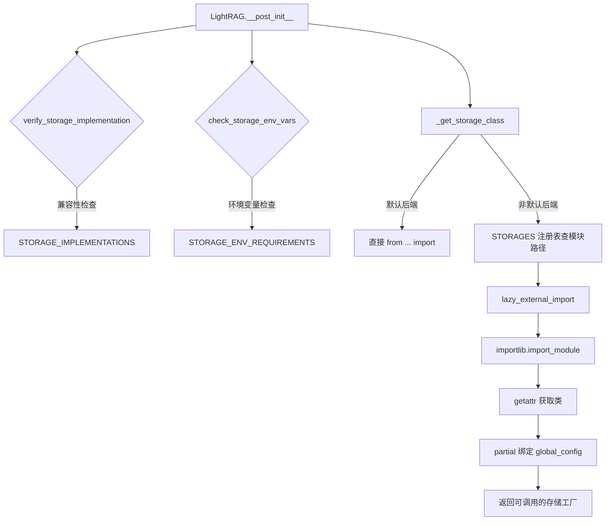

# PD-85.02 LightRAG — 四层存储抽象与注册表动态加载

> 文档编号：PD-85.02
> 来源：LightRAG `lightrag/base.py` `lightrag/kg/__init__.py` `lightrag/lightrag.py`
> GitHub：https://github.com/HKUDS/LightRAG.git
> 问题域：PD-85 多后端存储抽象 Multi-Backend Storage Abstraction
> 状态：可复用方案

---

## 第 1 章 问题与动机

### 1.1 核心问题

RAG 系统需要同时管理三种异构存储：KV 存储（文档/实体/关系的元数据）、向量存储（Embedding 检索）、图存储（知识图谱的节点与边）。不同部署环境对存储后端的需求差异巨大——个人开发者用 JSON 文件 + NanoVectorDB + NetworkX 即可，企业级部署则需要 PostgreSQL + Milvus + Neo4j。如果每种组合都硬编码，代码会爆炸式膨胀且难以维护。

核心挑战：
- **异构存储统一接口**：KV、Vector、Graph 三种存储的操作语义完全不同，如何设计统一的抽象层？
- **后端即插即用**：新增一个存储后端（如 Qdrant）不应修改任何核心代码
- **环境感知**：不同后端依赖不同的环境变量（如 Neo4j 需要 URI/用户名/密码），如何在初始化时自动校验？
- **懒加载性能**：17 种后端不能全部 import，只加载用户实际选择的那个

### 1.2 LightRAG 的解法概述

LightRAG 设计了一套四层存储抽象体系，核心要点：

1. **四层抽象基类**：`StorageNameSpace` → `BaseKVStorage` / `BaseVectorStorage` / `BaseGraphStorage`，每层定义精确的 async 接口契约（`lightrag/base.py:173-702`）
2. **STORAGES 注册表**：一个 `dict[str, str]` 映射实现类名到模块路径，18 个后端全部注册（`lightrag/kg/__init__.py:97-119`）
3. **STORAGE_IMPLEMENTATIONS 兼容性矩阵**：按存储类型分组，声明每种类型的合法实现列表和必需方法（`lightrag/kg/__init__.py:1-42`）
4. **STORAGE_ENV_REQUIREMENTS 环境校验表**：每个实现类声明所需环境变量，初始化时自动检查（`lightrag/kg/__init__.py:45-94`）
5. **双轨加载策略**：默认后端（Json/Nano/NetworkX）直接 import，非默认后端通过 `lazy_external_import` + `importlib` 动态加载（`lightrag/lightrag.py:1098-1120`）

### 1.3 设计思想

| 设计原则 | 具体实现 | 理由 | 替代方案 |
|----------|----------|------|----------|
| 接口隔离 | 三种存储各有独立抽象基类，不共享业务方法 | KV/Vector/Graph 操作语义差异大，强行统一会导致接口臃肿 | 单一 BaseStorage 基类（会导致大量空方法） |
| 注册表模式 | `STORAGES` dict 集中管理类名→模块路径映射 | 新增后端只需加一行注册，零侵入核心代码 | 工厂方法 if-else 链（每次新增都要改工厂） |
| 懒加载 | `lazy_external_import` 返回闭包，首次调用时才 `importlib.import_module` | 避免 import 17 个后端的依赖（如 asyncpg、neo4j 等） | 全量 import（启动慢，依赖冲突风险高） |
| 环境前置校验 | `STORAGE_ENV_REQUIREMENTS` + `check_storage_env_vars` 在 `__post_init__` 阶段检查 | 快速失败，避免运行到一半才发现缺环境变量 | 运行时报错（用户体验差） |
| Namespace 隔离 | `StorageNameSpace` 基类强制 `namespace` + `workspace` 字段 | 同一后端实例可承载多个逻辑存储空间（多租户） | 每个逻辑空间独立连接（资源浪费） |

---

## 第 2 章 源码实现分析

### 2.1 架构概览

LightRAG 的存储抽象分为四个层次：

```
┌─────────────────────────────────────────────────────────────────┐
│                      LightRAG (lightrag.py)                     │
│  kv_storage="JsonKVStorage"  vector_storage="NanoVectorDBStorage"│
│  graph_storage="NetworkXStorage"  doc_status_storage="Json..."   │
├─────────────────────────────────────────────────────────────────┤
│                    _get_storage_class()                          │
│  ┌──────────────┐  ┌──────────────────────────────────────┐     │
│  │ 默认后端:     │  │ 非默认后端:                          │     │
│  │ 直接 import   │  │ STORAGES[name] → lazy_external_import│     │
│  └──────────────┘  └──────────────────────────────────────┘     │
├─────────────────────────────────────────────────────────────────┤
│  verify_storage_implementation()  check_storage_env_vars()       │
│  STORAGE_IMPLEMENTATIONS          STORAGE_ENV_REQUIREMENTS       │
├──────────┬──────────────┬──────────────┬────────────────────────┤
│ BaseKV   │ BaseVector   │ BaseGraph    │ DocStatusStorage       │
│ Storage  │ Storage      │ Storage      │ (extends BaseKV)       │
├──────────┴──────────────┴──────────────┴────────────────────────┤
│                   StorageNameSpace (ABC)                         │
│           namespace / workspace / global_config                  │
│           initialize() / finalize() / index_done_callback()     │
└─────────────────────────────────────────────────────────────────┘
         │              │              │              │
    ┌────┴────┐   ┌────┴────┐   ┌────┴────┐   ┌────┴────┐
    │Json/Redis│   │Nano/Mil-│   │NetworkX/│   │Json/PG/ │
    │PG/Mongo │   │vus/PG/  │   │Neo4j/PG/│   │Redis/   │
    │KVStorage│   │Faiss/   │   │Mongo/   │   │Mongo    │
    │         │   │Qdrant/  │   │Memgraph │   │DocStatus│
    │(4 impl) │   │Mongo    │   │(5 impl) │   │(4 impl) │
    └─────────┘   │(6 impl) │   └─────────┘   └─────────┘
                  └─────────┘
```

### 2.2 核心实现

#### 2.2.1 四层抽象基类体系



对应源码 `lightrag/base.py:173-215`（StorageNameSpace 基类）：

```python
@dataclass
class StorageNameSpace(ABC):
    namespace: str
    workspace: str
    global_config: dict[str, Any]

    async def initialize(self):
        """Initialize the storage"""
        pass

    async def finalize(self):
        """Finalize the storage"""
        pass

    @abstractmethod
    async def index_done_callback(self) -> None:
        """Commit the storage operations after indexing"""

    @abstractmethod
    async def drop(self) -> dict[str, str]:
        """Drop all data from storage and clean up resources"""
```

`BaseKVStorage`（`lightrag/base.py:356-402`）定义了 KV 存储的 6 个核心抽象方法：

```python
@dataclass
class BaseKVStorage(StorageNameSpace, ABC):
    embedding_func: EmbeddingFunc

    @abstractmethod
    async def get_by_id(self, id: str) -> dict[str, Any] | None: ...
    @abstractmethod
    async def get_by_ids(self, ids: list[str]) -> list[dict[str, Any]]: ...
    @abstractmethod
    async def filter_keys(self, keys: set[str]) -> set[str]: ...
    @abstractmethod
    async def upsert(self, data: dict[str, dict[str, Any]]) -> None: ...
    @abstractmethod
    async def delete(self, ids: list[str]) -> None: ...
    @abstractmethod
    async def is_empty(self) -> bool: ...
```

`BaseGraphStorage`（`lightrag/base.py:405-702`）是最复杂的抽象，定义了 18 个方法，其中 5 个提供了默认的逐条实现（batch 方法），子类可覆盖以优化性能：

```python
@dataclass
class BaseGraphStorage(StorageNameSpace, ABC):
    embedding_func: EmbeddingFunc

    # 13 个 @abstractmethod: has_node, has_edge, node_degree, edge_degree,
    # get_node, get_edge, get_node_edges, upsert_node, upsert_edge,
    # delete_node, remove_nodes, remove_edges, get_all_labels, ...

    # 5 个默认实现（可覆盖优化）:
    async def get_nodes_batch(self, node_ids: list[str]) -> dict[str, dict]:
        """Default: fetch one by one. Override for batch performance."""
        result = {}
        for node_id in node_ids:
            node = await self.get_node(node_id)
            if node is not None:
                result[node_id] = node
        return result
```


#### 2.2.2 注册表 + 动态加载机制



对应源码 `lightrag/kg/__init__.py:97-119`（STORAGES 注册表）：

```python
STORAGES = {
    "NetworkXStorage": ".kg.networkx_impl",
    "JsonKVStorage": ".kg.json_kv_impl",
    "NanoVectorDBStorage": ".kg.nano_vector_db_impl",
    "JsonDocStatusStorage": ".kg.json_doc_status_impl",
    "Neo4JStorage": ".kg.neo4j_impl",
    "MilvusVectorDBStorage": ".kg.milvus_impl",
    "MongoKVStorage": ".kg.mongo_impl",
    "MongoDocStatusStorage": ".kg.mongo_impl",
    "MongoGraphStorage": ".kg.mongo_impl",
    "MongoVectorDBStorage": ".kg.mongo_impl",
    "RedisKVStorage": ".kg.redis_impl",
    "RedisDocStatusStorage": ".kg.redis_impl",
    "PGKVStorage": ".kg.postgres_impl",
    "PGVectorStorage": ".kg.postgres_impl",
    "PGGraphStorage": ".kg.postgres_impl",
    "PGDocStatusStorage": ".kg.postgres_impl",
    "FaissVectorDBStorage": ".kg.faiss_impl",
    "QdrantVectorDBStorage": ".kg.qdrant_impl",
    "MemgraphStorage": ".kg.memgraph_impl",
}
```

对应源码 `lightrag/lightrag.py:1098-1120`（双轨加载策略）：

```python
def _get_storage_class(self, storage_name: str) -> Callable[..., Any]:
    # Direct imports for default storage implementations
    if storage_name == "JsonKVStorage":
        from lightrag.kg.json_kv_impl import JsonKVStorage
        return JsonKVStorage
    elif storage_name == "NanoVectorDBStorage":
        from lightrag.kg.nano_vector_db_impl import NanoVectorDBStorage
        return NanoVectorDBStorage
    elif storage_name == "NetworkXStorage":
        from lightrag.kg.networkx_impl import NetworkXStorage
        return NetworkXStorage
    elif storage_name == "JsonDocStatusStorage":
        from lightrag.kg.json_doc_status_impl import JsonDocStatusStorage
        return JsonDocStatusStorage
    else:
        # Fallback to dynamic import for other storage implementations
        import_path = STORAGES[storage_name]
        storage_class = lazy_external_import(import_path, storage_name)
        return storage_class
```

对应源码 `lightrag/utils.py:1867-1883`（懒加载核心）：

```python
def lazy_external_import(module_name: str, class_name: str) -> Callable[..., Any]:
    """Lazily import a class from an external module based on the package of the caller."""
    import inspect
    caller_frame = inspect.currentframe().f_back
    module = inspect.getmodule(caller_frame)
    package = module.__package__ if module else None

    def import_class(*args: Any, **kwargs: Any):
        import importlib
        module = importlib.import_module(module_name, package=package)
        cls = getattr(module, class_name)
        return cls(*args, **kwargs)

    return import_class
```

### 2.3 实现细节

#### 环境变量前置校验

`STORAGE_ENV_REQUIREMENTS`（`lightrag/kg/__init__.py:45-94`）为每个实现类声明必需的环境变量。例如 Neo4j 需要 `NEO4J_URI`、`NEO4J_USERNAME`、`NEO4J_PASSWORD`，而 Json 后端不需要任何环境变量。

校验逻辑在 `lightrag/utils.py:2337-2355`：

```python
def check_storage_env_vars(storage_name: str) -> None:
    from lightrag.kg import STORAGE_ENV_REQUIREMENTS
    required_vars = STORAGE_ENV_REQUIREMENTS.get(storage_name, [])
    missing_vars = [var for var in required_vars if var not in os.environ]
    if missing_vars:
        raise ValueError(
            f"Storage implementation '{storage_name}' requires the following "
            f"environment variables: {', '.join(missing_vars)}"
        )
```

#### 兼容性矩阵校验

`STORAGE_IMPLEMENTATIONS`（`lightrag/kg/__init__.py:1-42`）按四种存储类型分组，声明合法实现列表。`verify_storage_implementation` 在 `__post_init__` 阶段调用，防止用户把 KV 实现配到 Graph 存储位上。

#### partial 绑定与 Namespace 实例化

存储类解析后，通过 `functools.partial` 预绑定 `global_config`（`lightrag/lightrag.py:571-579`），然后在不同 namespace 下创建多个实例：

```python
self.key_string_value_json_storage_cls = partial(
    self.key_string_value_json_storage_cls, global_config=global_config
)
# 然后用不同 namespace 创建多个实例
self.full_docs = self.key_string_value_json_storage_cls(
    namespace=NameSpace.KV_STORE_FULL_DOCS, workspace=self.workspace, ...
)
self.text_chunks = self.key_string_value_json_storage_cls(
    namespace=NameSpace.KV_STORE_TEXT_CHUNKS, workspace=self.workspace, ...
)
```

同一个 KV 存储类被实例化 6 次（full_docs、text_chunks、full_entities、full_relations、entity_chunks、llm_response_cache），每个实例通过 `namespace` 隔离数据。


---

## 第 3 章 迁移指南

### 3.1 迁移清单

**阶段 1：定义抽象基类**
- [ ] 创建 `StorageNameSpace` 基类，包含 `namespace`、`workspace`、`global_config` 字段
- [ ] 创建 `BaseKVStorage`、`BaseVectorStorage`、`BaseGraphStorage` 三个抽象基类
- [ ] 为每个基类定义 `initialize()`、`finalize()`、`index_done_callback()`、`drop()` 生命周期方法
- [ ] 为 `BaseGraphStorage` 提供 batch 方法的默认实现（逐条 fallback）

**阶段 2：实现注册表**
- [ ] 创建 `STORAGES` 注册表 dict，映射类名到模块路径
- [ ] 创建 `STORAGE_IMPLEMENTATIONS` 兼容性矩阵
- [ ] 创建 `STORAGE_ENV_REQUIREMENTS` 环境变量需求表
- [ ] 实现 `verify_storage_implementation()` 和 `check_storage_env_vars()`

**阶段 3：实现动态加载**
- [ ] 实现 `lazy_external_import()` 函数
- [ ] 在主类中实现 `_get_storage_class()` 双轨加载
- [ ] 用 `functools.partial` 预绑定配置参数

**阶段 4：实现具体后端**
- [ ] 先实现默认后端（JSON 文件 / 内存）作为参考实现
- [ ] 按需实现其他后端，每个后端一个独立模块文件

### 3.2 适配代码模板

以下是一个可直接复用的最小化存储抽象框架：

```python
"""storage_base.py — 存储抽象基类"""
from abc import ABC, abstractmethod
from dataclasses import dataclass, field
from typing import Any, Callable
import os

@dataclass
class StorageNameSpace(ABC):
    namespace: str
    workspace: str
    global_config: dict[str, Any]

    async def initialize(self):
        pass

    async def finalize(self):
        pass

    @abstractmethod
    async def index_done_callback(self) -> None:
        """Commit after batch operations"""

@dataclass
class BaseKVStorage(StorageNameSpace, ABC):
    @abstractmethod
    async def get_by_id(self, id: str) -> dict[str, Any] | None: ...
    @abstractmethod
    async def get_by_ids(self, ids: list[str]) -> list[dict[str, Any]]: ...
    @abstractmethod
    async def upsert(self, data: dict[str, dict[str, Any]]) -> None: ...
    @abstractmethod
    async def delete(self, ids: list[str]) -> None: ...

@dataclass
class BaseVectorStorage(StorageNameSpace, ABC):
    embedding_dim: int = 0
    @abstractmethod
    async def query(self, query: str, top_k: int) -> list[dict[str, Any]]: ...
    @abstractmethod
    async def upsert(self, data: dict[str, dict[str, Any]]) -> None: ...

@dataclass
class BaseGraphStorage(StorageNameSpace, ABC):
    @abstractmethod
    async def upsert_node(self, node_id: str, node_data: dict) -> None: ...
    @abstractmethod
    async def upsert_edge(self, src: str, tgt: str, edge_data: dict) -> None: ...
    @abstractmethod
    async def get_node(self, node_id: str) -> dict | None: ...

    # 默认 batch 实现，子类可覆盖优化
    async def get_nodes_batch(self, node_ids: list[str]) -> dict[str, dict]:
        result = {}
        for nid in node_ids:
            node = await self.get_node(nid)
            if node is not None:
                result[nid] = node
        return result
```

```python
"""storage_registry.py — 注册表 + 动态加载"""
import os
from typing import Any, Callable

STORAGES: dict[str, str] = {
    "JsonKVStorage": ".backends.json_impl",
    "RedisKVStorage": ".backends.redis_impl",
    "PGKVStorage": ".backends.pg_impl",
}

STORAGE_ENV_REQUIREMENTS: dict[str, list[str]] = {
    "JsonKVStorage": [],
    "RedisKVStorage": ["REDIS_URI"],
    "PGKVStorage": ["POSTGRES_USER", "POSTGRES_PASSWORD", "POSTGRES_DATABASE"],
}

def check_storage_env_vars(storage_name: str) -> None:
    required = STORAGE_ENV_REQUIREMENTS.get(storage_name, [])
    missing = [v for v in required if v not in os.environ]
    if missing:
        raise ValueError(
            f"Storage '{storage_name}' requires env vars: {', '.join(missing)}"
        )

def lazy_external_import(module_name: str, class_name: str) -> Callable[..., Any]:
    import inspect
    caller_frame = inspect.currentframe().f_back
    module = inspect.getmodule(caller_frame)
    package = module.__package__ if module else None

    def import_class(*args, **kwargs):
        import importlib
        mod = importlib.import_module(module_name, package=package)
        cls = getattr(mod, class_name)
        return cls(*args, **kwargs)
    return import_class

def get_storage_class(storage_name: str, defaults: dict[str, str] | None = None):
    """双轨加载：默认后端直接 import，其他走注册表"""
    check_storage_env_vars(storage_name)
    if defaults and storage_name in defaults:
        # 直接 import 默认后端
        import importlib
        mod = importlib.import_module(defaults[storage_name])
        return getattr(mod, storage_name)
    else:
        import_path = STORAGES[storage_name]
        return lazy_external_import(import_path, storage_name)
```

### 3.3 适用场景

| 场景 | 适用度 | 说明 |
|------|--------|------|
| RAG 系统多后端存储 | ⭐⭐⭐ | 完美匹配，LightRAG 的原生场景 |
| 多租户 SaaS 平台 | ⭐⭐⭐ | namespace + workspace 天然支持租户隔离 |
| 插件化数据层 | ⭐⭐⭐ | 注册表模式让新后端零侵入接入 |
| 微服务存储适配 | ⭐⭐ | 适合单进程多存储，跨服务需额外 RPC 层 |
| 简单 CRUD 应用 | ⭐ | 过度设计，直接用 ORM 更合适 |

---

## 第 4 章 测试用例

```python
"""test_storage_abstraction.py — 存储抽象层测试"""
import pytest
import os
from unittest.mock import patch, MagicMock
from dataclasses import dataclass
from typing import Any


# === 测试 StorageNameSpace 基类 ===

class TestStorageNameSpace:
    def test_namespace_workspace_required(self):
        """抽象基类要求 namespace 和 workspace 字段"""
        from lightrag.base import StorageNameSpace
        # StorageNameSpace 是 ABC，不能直接实例化
        with pytest.raises(TypeError):
            StorageNameSpace(namespace="test", workspace="default", global_config={})

    def test_initialize_finalize_default_noop(self):
        """initialize/finalize 默认是空操作"""
        from lightrag.base import BaseKVStorage
        # BaseKVStorage 也是 ABC，但 initialize/finalize 有默认实现
        # 验证它们不抛异常即可（通过具体实现类测试）


# === 测试注册表 ===

class TestStorageRegistry:
    def test_storages_dict_completeness(self):
        """STORAGES 注册表应包含所有声明的实现"""
        from lightrag.kg import STORAGES, STORAGE_IMPLEMENTATIONS
        for storage_type, info in STORAGE_IMPLEMENTATIONS.items():
            for impl_name in info["implementations"]:
                assert impl_name in STORAGES, (
                    f"{impl_name} declared in STORAGE_IMPLEMENTATIONS "
                    f"but missing from STORAGES registry"
                )

    def test_env_requirements_coverage(self):
        """每个注册的实现都应有环境变量声明（即使为空列表）"""
        from lightrag.kg import STORAGES, STORAGE_ENV_REQUIREMENTS
        for name in STORAGES:
            assert name in STORAGE_ENV_REQUIREMENTS, (
                f"{name} in STORAGES but missing from STORAGE_ENV_REQUIREMENTS"
            )

    def test_verify_storage_implementation_valid(self):
        """合法的存储类型+实现组合应通过校验"""
        from lightrag.kg import verify_storage_implementation
        verify_storage_implementation("KV_STORAGE", "JsonKVStorage")
        verify_storage_implementation("GRAPH_STORAGE", "Neo4JStorage")
        verify_storage_implementation("VECTOR_STORAGE", "MilvusVectorDBStorage")

    def test_verify_storage_implementation_invalid(self):
        """不兼容的组合应抛出 ValueError"""
        from lightrag.kg import verify_storage_implementation
        with pytest.raises(ValueError, match="not compatible"):
            verify_storage_implementation("KV_STORAGE", "Neo4JStorage")

    def test_verify_unknown_storage_type(self):
        """未知存储类型应抛出 ValueError"""
        from lightrag.kg import verify_storage_implementation
        with pytest.raises(ValueError, match="Unknown storage type"):
            verify_storage_implementation("UNKNOWN_TYPE", "JsonKVStorage")


# === 测试环境变量校验 ===

class TestEnvVarCheck:
    def test_json_no_env_required(self):
        """Json 后端不需要环境变量"""
        from lightrag.utils import check_storage_env_vars
        check_storage_env_vars("JsonKVStorage")  # 不应抛异常

    def test_pg_missing_env_raises(self):
        """PG 后端缺少环境变量应抛出 ValueError"""
        from lightrag.utils import check_storage_env_vars
        with patch.dict(os.environ, {}, clear=True):
            with pytest.raises(ValueError, match="POSTGRES_USER"):
                check_storage_env_vars("PGKVStorage")

    def test_pg_with_env_passes(self):
        """PG 后端环境变量齐全应通过"""
        from lightrag.utils import check_storage_env_vars
        env = {
            "POSTGRES_USER": "test",
            "POSTGRES_PASSWORD": "test",
            "POSTGRES_DATABASE": "test",
        }
        with patch.dict(os.environ, env):
            check_storage_env_vars("PGKVStorage")


# === 测试懒加载 ===

class TestLazyImport:
    def test_lazy_external_import_returns_callable(self):
        """lazy_external_import 应返回可调用对象"""
        from lightrag.utils import lazy_external_import
        factory = lazy_external_import(".kg.json_kv_impl", "JsonKVStorage")
        assert callable(factory)

    def test_lazy_import_defers_actual_import(self):
        """实际 import 应延迟到首次调用时"""
        from lightrag.utils import lazy_external_import
        import sys
        # 确保模块未被加载（如果已加载则跳过）
        factory = lazy_external_import(".kg.json_kv_impl", "JsonKVStorage")
        # factory 本身不触发 import，只有调用时才触发
        assert callable(factory)
```


---

## 第 5 章 跨域关联

| 关联域 | 关系类型 | 说明 |
|--------|----------|------|
| PD-03 容错与重试 | 协同 | PG 后端实现了 Tenacity 重试 + 连接池自动重建（`postgres_impl.py:174-194`），存储抽象层的 `initialize/finalize` 生命周期为重试提供了钩子 |
| PD-06 记忆持久化 | 依赖 | LightRAG 的 `llm_response_cache` 就是一个 KV 存储实例，记忆持久化完全依赖存储抽象层 |
| PD-01 上下文管理 | 协同 | `text_chunks` KV 存储管理分块后的文本，是上下文窗口管理的数据基础 |
| PD-08 搜索与检索 | 依赖 | 向量检索（`BaseVectorStorage.query`）和图检索（`BaseGraphStorage.get_knowledge_graph`）是搜索的底层实现 |
| PD-78 并发控制 | 协同 | `index_done_callback` 机制确保批量写入的原子性，`get_data_init_lock` 防止多进程初始化竞争 |
| PD-81 多租户隔离 | 依赖 | `StorageNameSpace` 的 `namespace` + `workspace` 双层隔离是多租户的存储层基础 |

---

## 第 6 章 来源文件索引

| 文件 | 行范围 | 关键实现 |
|------|--------|----------|
| `lightrag/base.py` | L173-L215 | `StorageNameSpace` 抽象基类定义 |
| `lightrag/base.py` | L218-L353 | `BaseVectorStorage` 抽象基类（含 embedding 验证、collection suffix 生成） |
| `lightrag/base.py` | L356-L402 | `BaseKVStorage` 抽象基类（6 个核心方法） |
| `lightrag/base.py` | L405-L702 | `BaseGraphStorage` 抽象基类（13 个抽象方法 + 5 个默认 batch 实现） |
| `lightrag/base.py` | L763-L823 | `DocStatusStorage` 抽象基类（扩展 BaseKVStorage） |
| `lightrag/kg/__init__.py` | L1-L42 | `STORAGE_IMPLEMENTATIONS` 兼容性矩阵 |
| `lightrag/kg/__init__.py` | L45-L94 | `STORAGE_ENV_REQUIREMENTS` 环境变量需求表 |
| `lightrag/kg/__init__.py` | L97-L119 | `STORAGES` 注册表（18 个后端映射） |
| `lightrag/kg/__init__.py` | L122-L141 | `verify_storage_implementation()` 兼容性校验 |
| `lightrag/lightrag.py` | L143-L153 | LightRAG 存储配置字段（kv_storage/vector_storage/graph_storage/doc_status_storage） |
| `lightrag/lightrag.py` | L483-L495 | `__post_init__` 中的存储校验流程 |
| `lightrag/lightrag.py` | L561-L619 | 存储类解析 + partial 绑定 + 多 namespace 实例化 |
| `lightrag/lightrag.py` | L678-L710 | `initialize_storages()` 逐个初始化所有存储实例 |
| `lightrag/lightrag.py` | L1098-L1120 | `_get_storage_class()` 双轨加载策略 |
| `lightrag/utils.py` | L1867-L1883 | `lazy_external_import()` 动态模块加载 |
| `lightrag/utils.py` | L2337-L2355 | `check_storage_env_vars()` 环境变量校验 |
| `lightrag/kg/postgres_impl.py` | L128-L194 | `PostgreSQLDB` 连接池管理（SSL + 重试配置） |
| `lightrag/kg/postgres_impl.py` | L1887-L1937 | `PGKVStorage` 实现（继承 BaseKVStorage） |
| `lightrag/kg/postgres_impl.py` | L3885-L3914 | `PGGraphStorage` 实现（workspace 隔离） |
| `lightrag/kg/json_kv_impl.py` | L27-L77 | `JsonKVStorage` 实现（文件存储 + 共享内存） |

---

## 第 7 章 横向对比维度

```json comparison_data
{
  "project": "LightRAG",
  "dimensions": {
    "抽象层级": "四层：StorageNameSpace → BaseKV/BaseVector/BaseGraph → DocStatusStorage",
    "后端发现": "STORAGES dict 注册表 + importlib 动态加载，18 个后端",
    "环境校验": "STORAGE_ENV_REQUIREMENTS 前置校验 + STORAGE_IMPLEMENTATIONS 兼容性矩阵",
    "加载策略": "双轨：默认后端直接 import，非默认走 lazy_external_import 闭包",
    "多租户支持": "namespace + workspace 双层隔离，同一存储类可实例化多个逻辑空间",
    "批量优化": "BaseGraphStorage 提供 5 个默认逐条 batch 方法，子类可覆盖优化"
  }
}
```

### 域元数据补充

```json domain_metadata
{
  "solution_summary": "LightRAG 用 StorageNameSpace 四层抽象基类 + STORAGES 注册表 + lazy_external_import 动态加载实现 18 种存储后端即插即用，配合 STORAGE_ENV_REQUIREMENTS 前置校验和 partial 绑定多 namespace 实例化",
  "description": "存储后端的环境感知与懒加载优化同样是多后端抽象的关键子问题",
  "sub_problems": [
    "环境变量前置校验与快速失败",
    "默认后端与非默认后端的加载性能差异优化",
    "同一存储类多 namespace 实例化与生命周期管理"
  ],
  "best_practices": [
    "双轨加载策略：默认后端直接 import 保性能，非默认走懒加载避免依赖膨胀",
    "兼容性矩阵校验防止存储类型与实现的错误组合",
    "BaseGraphStorage 提供默认 batch 实现，子类按需覆盖优化"
  ]
}
```

