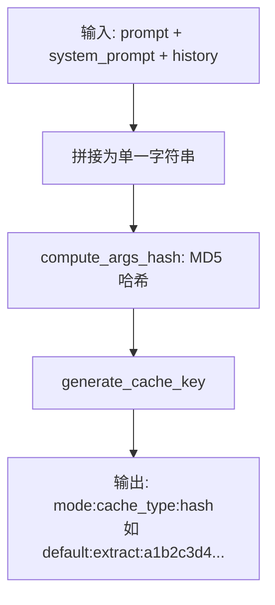
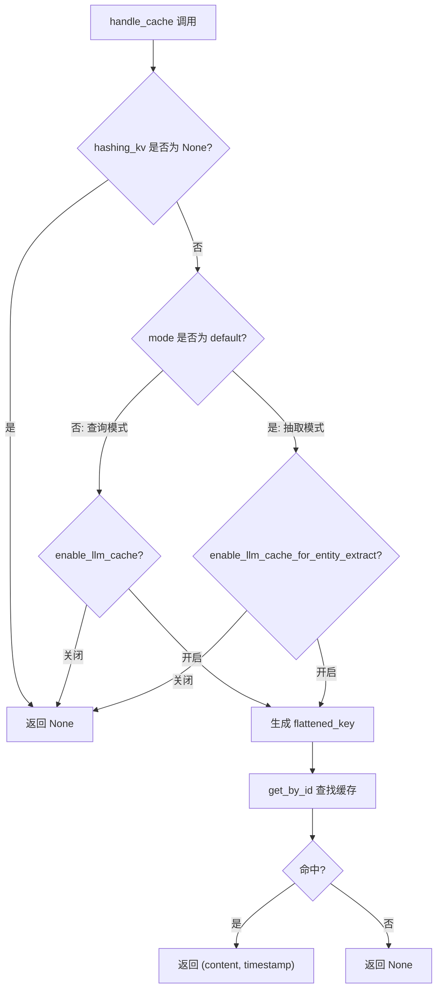
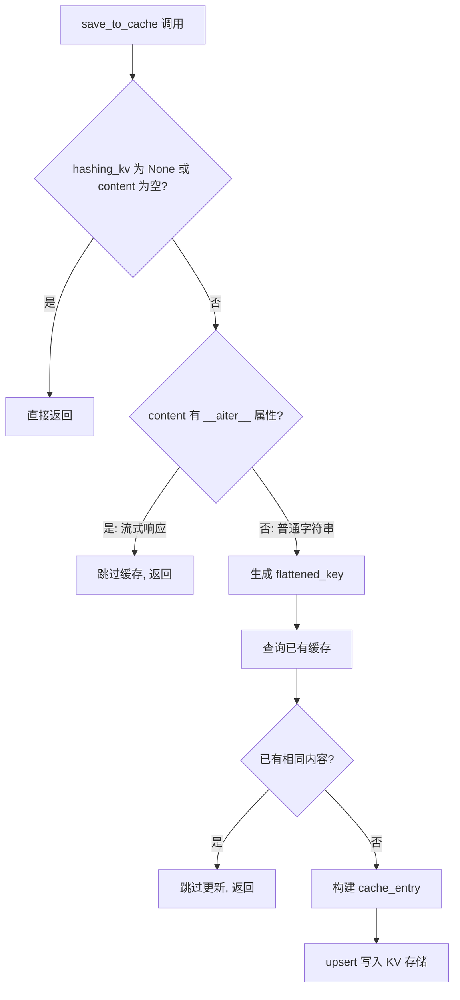

# PD-86.01 LightRAG — 扁平化键结构 LLM 响应缓存系统

> 文档编号：PD-86.01
> 来源：LightRAG `lightrag/utils.py`, `lightrag/operate.py`, `lightrag/lightrag.py`
> GitHub：https://github.com/HKUDS/LightRAG.git
> 问题域：PD-86 LLM响应缓存 LLM Response Caching
> 状态：可复用方案

---

## 第 1 章 问题与动机

### 1.1 核心问题

RAG 系统中 LLM 调用是最昂贵的操作——实体抽取、摘要生成、关键词提取、查询回答每一步都需要调用 LLM。当同一文档被重复处理（增量更新、重试、重新索引）或同一查询被多次发起时，重复的 LLM 调用造成巨大的成本浪费和延迟。

LightRAG 面临的具体挑战：
1. **多阶段 LLM 调用**：单次文档处理涉及 entity_extract + summary 两类 LLM 调用，单次查询涉及 keywords + query 两类调用
2. **多查询模式**：支持 local/global/mix/hybrid/naive 五种查询模式，每种模式的缓存需要独立管理
3. **流式响应兼容**：流式响应（AsyncGenerator）不能被缓存，需要检测并跳过
4. **存储后端多样性**：缓存需要在 JSON/Redis/PostgreSQL/MongoDB 四种 KV 后端上统一工作
5. **遗留格式迁移**：从嵌套键结构（`mode → {hash → entry}`）迁移到扁平化键结构，需要向后兼容

### 1.2 LightRAG 的解法概述

LightRAG 实现了一套扁平化键结构的 LLM 响应缓存系统，核心设计：

1. **三段式扁平键** `{mode}:{cache_type}:{hash}` — 将查询模式、缓存类型、内容哈希编码为单一字符串键，复用现有 KV 存储后端（`lightrag/utils.py:560-571`）
2. **双开关独立控制** — `enable_llm_cache` 控制查询缓存，`enable_llm_cache_for_entity_extract` 控制实体抽取缓存，两者互不干扰（`lightrag/lightrag.py:373-377`）
3. **流式响应检测跳过** — 通过 `hasattr(content, "__aiter__")` 检测 AsyncGenerator，自动跳过流式响应的缓存写入（`lightrag/utils.py:1433-1435`）
4. **去重检测** — 写入前比对已有缓存内容，相同内容跳过更新，避免无意义的存储写入（`lightrag/utils.py:1442-1450`）
5. **遗留格式自动迁移** — JSON KV 存储加载时自动检测嵌套结构并迁移为扁平键（`lightrag/kg/json_kv_impl.py:254-295`）

### 1.3 设计思想

| 设计原则 | 具体实现 | 理由 | 替代方案 |
|----------|----------|------|----------|
| 键结构扁平化 | `mode:cache_type:hash` 三段式 | 所有 KV 后端统一支持字符串键查找，无需嵌套 JSON 解析 | 嵌套字典 `{mode: {hash: entry}}`（已废弃） |
| 存储复用 | 缓存直接写入 `BaseKVStorage`，与文档/图谱共用存储抽象 | 零额外基础设施，支持 4 种后端自动切换 | 独立 Redis/Memcached 缓存层 |
| 双开关分离 | 抽取缓存和查询缓存独立开关 | 抽取缓存几乎总是有益的（确定性输入），查询缓存可能需要关闭（参数变化频繁） | 单一全局开关 |
| 哈希包含参数 | 查询缓存的 hash 包含 mode/top_k/response_type 等参数 | 不同参数组合产生不同结果，必须区分缓存 | 仅 hash 查询文本 |
| 流式跳过 | `__aiter__` 鸭子类型检测 | 流式响应是 AsyncGenerator，无法序列化存储 | 强制非流式模式才缓存 |

---

## 第 2 章 源码实现分析

### 2.1 架构概览

LightRAG 的缓存系统分为三层：键生成层、缓存读写层、业务调用层。

```
┌─────────────────────────────────────────────────────────────┐
│                    业务调用层 (operate.py)                     │
│  ┌──────────────┐  ┌──────────────┐  ┌───────────────────┐  │
│  │ entity_extract│  │ query_answer │  │ keywords_extract  │  │
│  │ cache_type=   │  │ cache_type=  │  │ cache_type=       │  │
│  │ "extract"     │  │ "query"      │  │ "keywords"        │  │
│  └──────┬───────┘  └──────┬───────┘  └────────┬──────────┘  │
│         │                 │                    │             │
├─────────┼─────────────────┼────────────────────┼─────────────┤
│         ▼                 ▼                    ▼             │
│  ┌─────────────────────────────────────────────────────┐    │
│  │          缓存读写层 (utils.py)                        │    │
│  │  handle_cache() ──→ 读取缓存                         │    │
│  │  save_to_cache() ──→ 写入缓存（含去重+流式跳过）       │    │
│  │  use_llm_func_with_cache() ──→ 封装 LLM 调用+缓存    │    │
│  └──────────────────────┬──────────────────────────────┘    │
│                         │                                    │
├─────────────────────────┼────────────────────────────────────┤
│                         ▼                                    │
│  ┌─────────────────────────────────────────────────────┐    │
│  │          键生成层 (utils.py)                          │    │
│  │  compute_args_hash() ──→ MD5 哈希                    │    │
│  │  generate_cache_key() ──→ "mode:type:hash"           │    │
│  │  parse_cache_key()   ──→ 反解三段式键                 │    │
│  └──────────────────────┬──────────────────────────────┘    │
│                         │                                    │
├─────────────────────────┼────────────────────────────────────┤
│                         ▼                                    │
│  ┌─────────────────────────────────────────────────────┐    │
│  │     KV 存储后端 (BaseKVStorage)                       │    │
│  │  JsonKVStorage │ RedisKVStorage │ PGKVStorage │ Mongo │    │
│  └─────────────────────────────────────────────────────┘    │
└─────────────────────────────────────────────────────────────┘
```

### 2.2 核心实现

#### 2.2.1 键生成与哈希计算



对应源码 `lightrag/utils.py:530-571`：

```python
def compute_args_hash(*args: Any) -> str:
    """Compute a hash for the given arguments with safe Unicode handling."""
    args_str = "".join([str(arg) for arg in args])
    try:
        return md5(args_str.encode("utf-8")).hexdigest()
    except UnicodeEncodeError:
        safe_bytes = args_str.encode("utf-8", errors="replace")
        return md5(safe_bytes).hexdigest()


def generate_cache_key(mode: str, cache_type: str, hash_value: str) -> str:
    """Generate a flattened cache key in the format {mode}:{cache_type}:{hash}"""
    return f"{mode}:{cache_type}:{hash_value}"


def parse_cache_key(cache_key: str) -> tuple[str, str, str] | None:
    """Parse a flattened cache key back into its components"""
    parts = cache_key.split(":", 2)
    if len(parts) == 3:
        return parts[0], parts[1], parts[2]
    return None
```

#### 2.2.2 缓存读取与双开关控制



对应源码 `lightrag/utils.py:1375-1407`：

```python
async def handle_cache(
    hashing_kv, args_hash, prompt, mode="default", cache_type="unknown",
) -> tuple[str, int] | None:
    if hashing_kv is None:
        return None

    if mode != "default":  # handle cache for all type of query
        if not hashing_kv.global_config.get("enable_llm_cache"):
            return None
    else:  # handle cache for entity extraction
        if not hashing_kv.global_config.get("enable_llm_cache_for_entity_extract"):
            return None

    # Use flattened cache key format: {mode}:{cache_type}:{hash}
    flattened_key = generate_cache_key(mode, cache_type, args_hash)
    cache_entry = await hashing_kv.get_by_id(flattened_key)
    if cache_entry:
        content = cache_entry["return"]
        timestamp = cache_entry.get("create_time", 0)
        return content, timestamp

    return None
```

#### 2.2.3 缓存写入：去重检测与流式跳过



对应源码 `lightrag/utils.py:1421-1466`：

```python
async def save_to_cache(hashing_kv, cache_data: CacheData):
    # Skip if storage is None or content is a streaming response
    if hashing_kv is None or not cache_data.content:
        return

    # If content is a streaming response, don't cache it
    if hasattr(cache_data.content, "__aiter__"):
        logger.debug("Streaming response detected, skipping cache")
        return

    # Use flattened cache key format: {mode}:{cache_type}:{hash}
    flattened_key = generate_cache_key(
        cache_data.mode, cache_data.cache_type, cache_data.args_hash
    )

    # Check if we already have identical content cached
    existing_cache = await hashing_kv.get_by_id(flattened_key)
    if existing_cache:
        existing_content = existing_cache.get("return")
        if existing_content == cache_data.content:
            logger.warning(f"Cache duplication detected for {flattened_key}, skipping update")
            return

    # Create cache entry with flattened structure
    cache_entry = {
        "return": cache_data.content,
        "cache_type": cache_data.cache_type,
        "chunk_id": cache_data.chunk_id if cache_data.chunk_id is not None else None,
        "original_prompt": cache_data.prompt,
        "queryparam": cache_data.queryparam if cache_data.queryparam is not None else None,
    }

    await hashing_kv.upsert({flattened_key: cache_entry})
```

### 2.3 实现细节

#### 缓存类型矩阵

LightRAG 定义了四种缓存类型，分别服务于不同的 LLM 调用场景：

| cache_type | 触发场景 | mode 值 | 开关 | 哈希输入 |
|------------|----------|---------|------|----------|
| `extract` | 实体抽取 | `default` | `enable_llm_cache_for_entity_extract` | user_prompt + system_prompt + history |
| `summary` | 摘要生成 | `default` | `enable_llm_cache_for_entity_extract` | prompt 文本 |
| `query` | 查询回答 | `local/global/mix/hybrid/naive` | `enable_llm_cache` | mode + query + response_type + top_k + ... |
| `keywords` | 关键词提取 | `local/global/mix/hybrid` | `enable_llm_cache` | mode + text + language |

#### 查询缓存的参数敏感哈希

查询缓存的哈希不仅包含查询文本，还包含所有影响结果的参数（`lightrag/operate.py:3178-3191`）：

```python
args_hash = compute_args_hash(
    query_param.mode,           # 查询模式
    query,                      # 查询文本
    query_param.response_type,  # 响应类型
    query_param.top_k,          # 实体/关系 top_k
    query_param.chunk_top_k,    # 文本块 top_k
    query_param.max_entity_tokens,
    query_param.max_relation_tokens,
    query_param.max_total_tokens,
    hl_keywords_str,            # 高级关键词
    ll_keywords_str,            # 低级关键词
    query_param.user_prompt or "",
    query_param.enable_rerank,  # 是否启用重排序
)
```

这确保了任何参数变化都会产生不同的缓存键，避免返回错误的缓存结果。

#### CacheData 数据结构

缓存写入使用统一的 `CacheData` 数据类（`lightrag/utils.py:1410-1418`）：

```python
@dataclass
class CacheData:
    args_hash: str              # 内容哈希
    content: str                # LLM 响应内容
    prompt: str                 # 原始 prompt
    mode: str = "default"       # 缓存模式
    cache_type: str = "query"   # 缓存类型
    chunk_id: str | None = None # 关联的文本块 ID
    queryparam: dict | None = None  # 查询参数快照
```

#### 缓存命中统计

系统维护全局统计计数器（`lightrag/utils.py:273`）：

```python
statistic_data = {"llm_call": 0, "llm_cache": 0, "embed_call": 0}
```

每次缓存命中时 `llm_cache += 1`，缓存未命中时 `llm_call += 1`，用于运行时监控缓存效率。

#### 遗留格式自动迁移

JSON KV 存储在加载时自动检测并迁移旧格式（`lightrag/kg/json_kv_impl.py:254-295`）：

旧格式（嵌套）：`{"default": {"a1b2c3": {"return": "...", "cache_type": "extract"}}}`
新格式（扁平）：`{"default:extract:a1b2c3": {"return": "...", "cache_type": "extract"}}`

迁移逻辑检测第一个键是否包含两个冒号来判断格式，然后遍历嵌套结构生成扁平键并持久化。

---

## 第 3 章 迁移指南

### 3.1 迁移清单

**阶段 1：基础设施（无 LLM 依赖）**
- [ ] 实现 `compute_args_hash()` — MD5 哈希函数，处理 Unicode 异常
- [ ] 实现 `generate_cache_key()` / `parse_cache_key()` — 三段式键生成与解析
- [ ] 定义 `CacheData` 数据类 — 统一缓存写入参数

**阶段 2：缓存读写层**
- [ ] 实现 `handle_cache()` — 缓存读取 + 双开关判断
- [ ] 实现 `save_to_cache()` — 缓存写入 + 去重检测 + 流式跳过
- [ ] 实现 `use_llm_func_with_cache()` — 封装 LLM 调用的缓存包装器

**阶段 3：业务集成**
- [ ] 在实体抽取流程中接入缓存（cache_type="extract"）
- [ ] 在查询流程中接入缓存（cache_type="query" + "keywords"）
- [ ] 添加配置开关（enable_llm_cache / enable_llm_cache_for_entity_extract）
- [ ] 实现 `aclear_cache()` 全量清理方法

**阶段 4：运维工具**
- [ ] 缓存迁移工具（跨存储后端迁移）
- [ ] 查询缓存清理工具（按模式/类型选择性清理）

### 3.2 适配代码模板

以下是一个可直接复用的缓存系统实现：

```python
import hashlib
import time
from dataclasses import dataclass
from typing import Any, Optional, Callable


def compute_args_hash(*args: Any) -> str:
    """计算参数的 MD5 哈希"""
    args_str = "".join(str(arg) for arg in args)
    try:
        return hashlib.md5(args_str.encode("utf-8")).hexdigest()
    except UnicodeEncodeError:
        return hashlib.md5(args_str.encode("utf-8", errors="replace")).hexdigest()


def generate_cache_key(mode: str, cache_type: str, hash_value: str) -> str:
    """生成扁平化缓存键: mode:cache_type:hash"""
    return f"{mode}:{cache_type}:{hash_value}"


def parse_cache_key(key: str) -> tuple[str, str, str] | None:
    """解析缓存键为 (mode, cache_type, hash)"""
    parts = key.split(":", 2)
    return tuple(parts) if len(parts) == 3 else None


@dataclass
class CacheData:
    args_hash: str
    content: str
    prompt: str
    mode: str = "default"
    cache_type: str = "query"
    chunk_id: str | None = None
    metadata: dict | None = None


class LLMResponseCache:
    """LLM 响应缓存管理器"""

    def __init__(self, kv_storage, config: dict):
        self.kv = kv_storage
        self.config = config
        self.stats = {"cache_hit": 0, "cache_miss": 0}

    async def get(
        self, args_hash: str, mode: str = "default", cache_type: str = "query"
    ) -> tuple[str, int] | None:
        """读取缓存，返回 (content, timestamp) 或 None"""
        # 双开关控制
        if mode == "default":
            if not self.config.get("enable_cache_for_extract", True):
                return None
        else:
            if not self.config.get("enable_cache_for_query", True):
                return None

        key = generate_cache_key(mode, cache_type, args_hash)
        entry = await self.kv.get(key)
        if entry:
            self.stats["cache_hit"] += 1
            return entry["return"], entry.get("create_time", 0)

        self.stats["cache_miss"] += 1
        return None

    async def put(self, cache_data: CacheData) -> None:
        """写入缓存，含去重检测和流式跳过"""
        if not cache_data.content:
            return

        # 流式响应检测
        if hasattr(cache_data.content, "__aiter__"):
            return

        key = generate_cache_key(
            cache_data.mode, cache_data.cache_type, cache_data.args_hash
        )

        # 去重检测
        existing = await self.kv.get(key)
        if existing and existing.get("return") == cache_data.content:
            return

        entry = {
            "return": cache_data.content,
            "cache_type": cache_data.cache_type,
            "chunk_id": cache_data.chunk_id,
            "original_prompt": cache_data.prompt,
            "create_time": int(time.time()),
            "metadata": cache_data.metadata,
        }
        await self.kv.upsert({key: entry})

    async def clear(self) -> bool:
        """清除所有缓存"""
        return await self.kv.drop()


async def call_llm_with_cache(
    prompt: str,
    llm_func: Callable,
    cache: Optional[LLMResponseCache] = None,
    cache_type: str = "extract",
    **kwargs,
) -> tuple[str, int]:
    """带缓存的 LLM 调用封装"""
    if cache:
        args_hash = compute_args_hash(prompt, kwargs.get("system_prompt", ""))
        cached = await cache.get(args_hash, mode="default", cache_type=cache_type)
        if cached:
            return cached

    result = await llm_func(prompt, **kwargs)
    timestamp = int(time.time())

    if cache:
        await cache.put(CacheData(
            args_hash=args_hash,
            content=result,
            prompt=prompt,
            cache_type=cache_type,
        ))

    return result, timestamp
```

### 3.3 适用场景

| 场景 | 适用度 | 说明 |
|------|--------|------|
| RAG 系统的文档处理缓存 | ⭐⭐⭐ | 实体抽取/摘要生成输入确定性高，缓存命中率极高 |
| 多模式查询系统 | ⭐⭐⭐ | 三段式键天然支持按模式区分缓存 |
| 增量更新场景 | ⭐⭐⭐ | 已处理文档块的 LLM 结果可直接复用 |
| 高并发查询场景 | ⭐⭐ | 相同查询+参数组合可命中缓存，但参数变化多时命中率低 |
| 流式响应为主的系统 | ⭐ | 流式响应无法缓存，需要非流式回退才能利用缓存 |
| 需要缓存过期的场景 | ⭐ | LightRAG 无 TTL 机制，需自行扩展 |

---

## 第 4 章 测试用例

```python
import pytest
import hashlib
from dataclasses import dataclass
from unittest.mock import AsyncMock, MagicMock


# ---- 被测函数（从 LightRAG 提取的核心逻辑） ----

def compute_args_hash(*args):
    args_str = "".join(str(arg) for arg in args)
    return hashlib.md5(args_str.encode("utf-8")).hexdigest()

def generate_cache_key(mode, cache_type, hash_value):
    return f"{mode}:{cache_type}:{hash_value}"

def parse_cache_key(key):
    parts = key.split(":", 2)
    return tuple(parts) if len(parts) == 3 else None


@dataclass
class CacheData:
    args_hash: str
    content: str
    prompt: str
    mode: str = "default"
    cache_type: str = "query"
    chunk_id: str | None = None


# ---- 测试用例 ----

class TestComputeArgsHash:
    def test_deterministic(self):
        """相同输入产生相同哈希"""
        h1 = compute_args_hash("hello", "world")
        h2 = compute_args_hash("hello", "world")
        assert h1 == h2

    def test_different_inputs(self):
        """不同输入产生不同哈希"""
        h1 = compute_args_hash("hello")
        h2 = compute_args_hash("world")
        assert h1 != h2

    def test_unicode_handling(self):
        """Unicode 字符正常处理"""
        h = compute_args_hash("你好世界", "🌍")
        assert len(h) == 32  # MD5 hex digest length

    def test_parameter_order_matters(self):
        """参数顺序影响哈希（查询参数敏感）"""
        h1 = compute_args_hash("local", "query_text", "10")
        h2 = compute_args_hash("global", "query_text", "10")
        assert h1 != h2


class TestCacheKeyGeneration:
    def test_generate_format(self):
        """三段式键格式正确"""
        key = generate_cache_key("default", "extract", "abc123")
        assert key == "default:extract:abc123"

    def test_parse_valid_key(self):
        """解析有效键"""
        result = parse_cache_key("local:query:abc123def456")
        assert result == ("local", "query", "abc123def456")

    def test_parse_invalid_key(self):
        """解析无效键返回 None"""
        assert parse_cache_key("invalid_key") is None
        assert parse_cache_key("only:two") is None

    def test_roundtrip(self):
        """生成-解析往返一致"""
        key = generate_cache_key("mix", "keywords", "hash123")
        parsed = parse_cache_key(key)
        assert parsed == ("mix", "keywords", "hash123")

    def test_query_modes(self):
        """不同查询模式生成不同键"""
        modes = ["local", "global", "mix", "hybrid", "naive"]
        keys = [generate_cache_key(m, "query", "same_hash") for m in modes]
        assert len(set(keys)) == len(modes)


class TestHandleCache:
    @pytest.mark.asyncio
    async def test_cache_hit(self):
        """缓存命中返回 (content, timestamp)"""
        mock_kv = AsyncMock()
        mock_kv.global_config = {"enable_llm_cache_for_entity_extract": True}
        mock_kv.get_by_id.return_value = {"return": "cached_result", "create_time": 1000}

        from lightrag.utils import handle_cache
        result = await handle_cache(mock_kv, "hash123", "prompt", "default", "extract")
        assert result == ("cached_result", 1000)

    @pytest.mark.asyncio
    async def test_cache_miss(self):
        """缓存未命中返回 None"""
        mock_kv = AsyncMock()
        mock_kv.global_config = {"enable_llm_cache": True}
        mock_kv.get_by_id.return_value = None

        from lightrag.utils import handle_cache
        result = await handle_cache(mock_kv, "hash123", "prompt", "local", "query")
        assert result is None

    @pytest.mark.asyncio
    async def test_extract_switch_off(self):
        """抽取缓存开关关闭时跳过"""
        mock_kv = AsyncMock()
        mock_kv.global_config = {"enable_llm_cache_for_entity_extract": False}

        from lightrag.utils import handle_cache
        result = await handle_cache(mock_kv, "hash123", "prompt", "default", "extract")
        assert result is None
        mock_kv.get_by_id.assert_not_called()

    @pytest.mark.asyncio
    async def test_query_switch_off(self):
        """查询缓存开关关闭时跳过"""
        mock_kv = AsyncMock()
        mock_kv.global_config = {"enable_llm_cache": False}

        from lightrag.utils import handle_cache
        result = await handle_cache(mock_kv, "hash123", "prompt", "local", "query")
        assert result is None


class TestSaveToCache:
    @pytest.mark.asyncio
    async def test_skip_streaming_response(self):
        """流式响应自动跳过"""
        mock_kv = AsyncMock()

        async def fake_stream():
            yield "chunk"

        from lightrag.utils import save_to_cache
        cache_data = CacheData(
            args_hash="h1", content=fake_stream(), prompt="test"
        )
        await save_to_cache(mock_kv, cache_data)
        mock_kv.upsert.assert_not_called()

    @pytest.mark.asyncio
    async def test_deduplication(self):
        """相同内容不重复写入"""
        mock_kv = AsyncMock()
        mock_kv.get_by_id.return_value = {"return": "same_content"}

        from lightrag.utils import save_to_cache
        cache_data = CacheData(
            args_hash="h1", content="same_content", prompt="test",
            mode="default", cache_type="extract"
        )
        await save_to_cache(mock_kv, cache_data)
        mock_kv.upsert.assert_not_called()
```

---

## 第 5 章 跨域关联

| 关联域 | 关系类型 | 说明 |
|--------|----------|------|
| PD-01 上下文管理 | 协同 | 缓存命中避免重复 LLM 调用，间接减少上下文窗口压力 |
| PD-03 容错与重试 | 协同 | 重试时缓存命中可跳过已成功的 LLM 调用，加速恢复；`use_llm_func_with_cache` 中的 `cache_keys_collector` 支持批量回溯 |
| PD-06 记忆持久化 | 依赖 | 缓存存储复用 `BaseKVStorage` 抽象，与记忆系统共享存储后端 |
| PD-08 搜索与检索 | 协同 | 查询缓存直接服务于检索流程，keywords 缓存加速关键词提取阶段 |
| PD-11 可观测性 | 协同 | `statistic_data` 计数器提供 `llm_cache` vs `llm_call` 的命中率指标 |
| PD-75 多后端存储 | 依赖 | 缓存系统依赖 KV 存储抽象层，支持 JSON/Redis/PG/MongoDB 四种后端 |
| PD-78 并发控制 | 协同 | 缓存命中减少实际 LLM 调用数量，降低并发队列压力 |

---

## 第 6 章 来源文件索引

| 文件 | 行范围 | 关键实现 |
|------|--------|----------|
| `lightrag/utils.py` | L273 | `statistic_data` 全局缓存命中统计 |
| `lightrag/utils.py` | L530-548 | `compute_args_hash()` MD5 哈希计算 |
| `lightrag/utils.py` | L560-584 | `generate_cache_key()` / `parse_cache_key()` 三段式键 |
| `lightrag/utils.py` | L1375-1407 | `handle_cache()` 缓存读取 + 双开关控制 |
| `lightrag/utils.py` | L1410-1418 | `CacheData` 数据类定义 |
| `lightrag/utils.py` | L1421-1466 | `save_to_cache()` 缓存写入 + 去重 + 流式跳过 |
| `lightrag/utils.py` | L1936-2075 | `use_llm_func_with_cache()` LLM 调用缓存封装 |
| `lightrag/lightrag.py` | L373-377 | `enable_llm_cache` / `enable_llm_cache_for_entity_extract` 配置 |
| `lightrag/lightrag.py` | L660-661 | `hashing_kv = self.llm_response_cache` 缓存存储初始化 |
| `lightrag/lightrag.py` | L2885-2913 | `aclear_cache()` / `clear_cache()` 全量清理 |
| `lightrag/operate.py` | L356-361 | 摘要生成缓存调用（cache_type="summary"） |
| `lightrag/operate.py` | L2860-2914 | 实体抽取缓存调用（cache_type="extract"） |
| `lightrag/operate.py` | L3178-3236 | 查询回答缓存调用（cache_type="query"） |
| `lightrag/operate.py` | L3312-3399 | 关键词提取缓存调用（cache_type="keywords"） |
| `lightrag/operate.py` | L845-894 | 从 chunk 的 `llm_cache_list` 批量加载缓存 |
| `lightrag/kg/json_kv_impl.py` | L254-295 | 遗留嵌套格式自动迁移为扁平键 |
| `lightrag/tools/migrate_llm_cache.py` | L1-80 | 跨存储后端缓存迁移工具 |
| `lightrag/tools/clean_llm_query_cache.py` | L59-63 | 查询缓存清理工具（按 mode/type 选择性清理） |

---

## 第 7 章 横向对比维度

```json comparison_data
{
  "project": "LightRAG",
  "dimensions": {
    "缓存策略": "扁平化三段式键 mode:cache_type:hash，复用 KV 存储后端",
    "缓存粒度": "四种 cache_type（extract/summary/query/keywords）独立管理",
    "开关控制": "双开关分离：抽取缓存与查询缓存独立启停",
    "去重机制": "写入前内容比对，相同内容跳过 upsert",
    "流式兼容": "鸭子类型检测 __aiter__，流式响应自动跳过缓存",
    "存储后端": "复用 BaseKVStorage 抽象，支持 JSON/Redis/PG/MongoDB",
    "迁移工具": "提供跨后端迁移工具和按模式清理工具"
  }
}
```

### 域元数据补充

```json domain_metadata
{
  "solution_summary": "LightRAG 用扁平化三段式键(mode:cache_type:hash)复用KV存储后端实现四类LLM响应缓存,含双开关独立控制、流式跳过和去重检测",
  "description": "缓存系统与存储抽象层的复用关系及遗留格式迁移策略",
  "sub_problems": [
    "缓存存储后端复用与独立部署的权衡",
    "遗留嵌套键格式向扁平键的在线迁移",
    "缓存条目与源文档块的反向关联追踪"
  ],
  "best_practices": [
    "查询缓存哈希应包含所有影响结果的参数(mode/top_k/response_type等)",
    "用鸭子类型检测(__aiter__)跳过流式响应缓存",
    "写入前比对已有内容避免无意义的存储更新"
  ]
}
```
