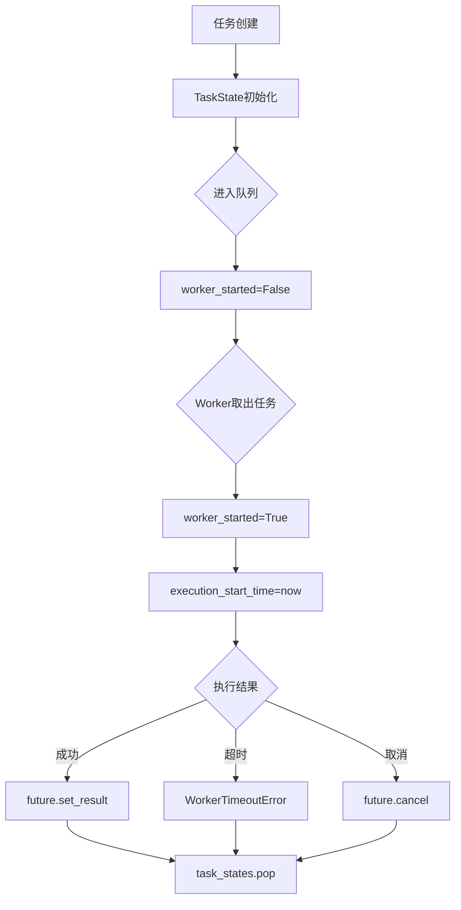
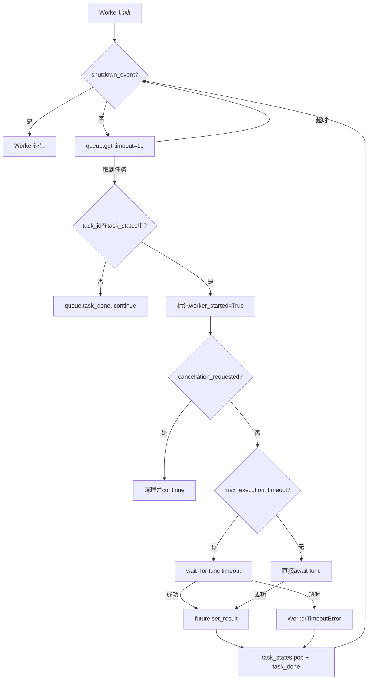
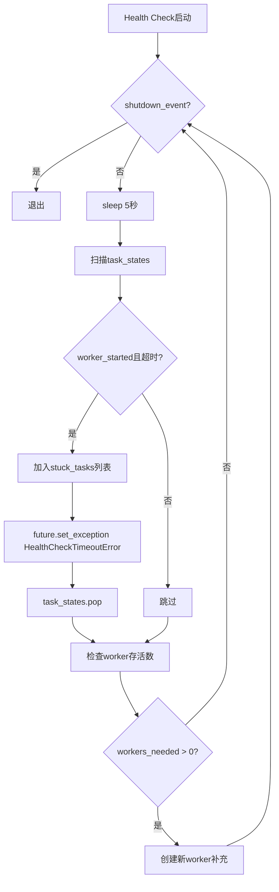

# PD-87.01 LightRAG — 优先级异步并发控制与多层超时保护

> 文档编号：PD-87.01
> 来源：LightRAG `lightrag/utils.py`, `lightrag/lightrag.py`
> GitHub：https://github.com/HKUDS/LightRAG.git
> 问题域：PD-87 异步并发控制 Async Concurrency Control
> 状态：可复用方案

---

## 第 1 章 问题与动机

### 1.1 核心问题

RAG 系统在运行时需要大量并发调用 LLM 和 Embedding API。这些调用有以下特征：

1. **资源受限**：LLM/Embedding 提供商有并发限制（rate limit），超出会被拒绝
2. **延迟不可预测**：单次 LLM 调用可能从 1 秒到 180 秒不等，网络抖动或模型过载时更长
3. **优先级差异**：查询请求应优先于后台索引构建，实时交互应优先于批量处理
4. **资源泄漏风险**：如果一个调用卡住（stuck），占用的 worker 槽位永远不会释放，最终耗尽并发池
5. **级联故障**：一个超时的调用如果不被及时清理，会阻塞后续所有排队任务

传统的 `asyncio.Semaphore` 只能限制并发数，无法解决优先级调度、stuck 检测、多层超时保护等问题。

### 1.2 LightRAG 的解法概述

LightRAG 实现了 `priority_limit_async_func_call` 装饰器（`lightrag/utils.py:616`），这是一个基于 `asyncio.PriorityQueue` 的完整并发控制框架：

1. **优先级队列调度**：用 `(priority, counter)` 元组实现优先级 + FIFO 排序，低 priority 值优先出队
2. **Worker 池模式**：固定数量的 worker 协程从队列消费任务，类似线程池但基于 asyncio
3. **四层超时保护**：LLM Provider → Worker Execution → Health Check → User Timeout，层层递进
4. **Stuck 任务检测**：后台 health check 协程每 5 秒扫描，强制清理超时任务并回收 worker
5. **优雅关闭**：`shutdown()` 方法按序取消 futures → 清理 task states → drain queue → 停止 workers

### 1.3 设计思想

| 设计原则 | 具体实现 | 理由 | 替代方案 |
|----------|----------|------|----------|
| 装饰器透明化 | `@priority_limit_async_func_call(max_size=4)` 包装任意 async 函数 | 调用方无需感知并发控制存在，零侵入 | 显式 Semaphore（侵入性强） |
| 动态超时计算 | 从 `llm_timeout` 自动推导 `max_execution_timeout = llm_timeout * 2`，`max_task_duration = llm_timeout * 2 + 15` | 不同模型/场景超时不同，硬编码不灵活 | 全部手动配置（易出错） |
| 状态机追踪 | `TaskState` dataclass 记录 `worker_started`、`execution_start_time`、`cancellation_requested` | 精确区分"排队中"和"执行中"的任务，避免误杀 | 只用 Future 状态（粒度不够） |
| 多层防御 | 4 层超时各司其职，内层超时触发后外层兜底 | 单层超时无法覆盖所有故障模式 | 单一超时（不够健壮） |
| WeakSet 防泄漏 | `active_futures = weakref.WeakSet()` 追踪活跃 Future | Future 完成后自动被 GC 回收，无需手动清理 | 普通 Set（需手动 discard） |

---

## 第 2 章 源码实现分析

### 2.1 架构概览

LightRAG 的并发控制架构由三个核心组件构成：装饰器工厂、Worker 池、Health Check 守护协程。

```
┌─────────────────────────────────────────────────────────────────┐
│                  priority_limit_async_func_call                  │
│                     (Decorator Factory)                          │
├─────────────────────────────────────────────────────────────────┤
│                                                                  │
│  ┌──────────┐    ┌──────────────────┐    ┌──────────────────┐   │
│  │ wait_func│───→│ PriorityQueue    │───→│ Worker Pool      │   │
│  │ (入口)   │    │ (priority,count, │    │ (N个worker协程)  │   │
│  │          │    │  task_id,args,kw)│    │                  │   │
│  └──────────┘    └──────────────────┘    └────────┬─────────┘   │
│       │                                           │              │
│       │          ┌──────────────────┐              │              │
│       │          │ TaskState Dict   │◄─────────────┘              │
│       │          │ {task_id: state} │                             │
│       │          └────────┬─────────┘                             │
│       │                   │                                       │
│       │          ┌────────▼─────────┐                             │
│       │          │ Health Check     │  每5秒扫描                  │
│       │          │ (守护协程)       │  检测stuck + 恢复worker     │
│       │          └──────────────────┘                             │
│       │                                                          │
│       ▼                                                          │
│  ┌──────────┐                                                    │
│  │ shutdown │  优雅关闭: futures→states→queue→workers→healthcheck │
│  └──────────┘                                                    │
└─────────────────────────────────────────────────────────────────┘
```

四层超时保护层级关系（以 `llm_timeout=180s` 为例）：

```
Layer 1: LLM Provider Timeout     = 180s   (由LLM SDK自身控制)
Layer 2: Worker Execution Timeout = 360s   (max_execution_timeout = llm_timeout * 2)
Layer 3: Health Check Timeout     = 375s   (max_task_duration = llm_timeout * 2 + 15)
Layer 4: User Timeout             = 自定义  (_timeout 参数，调用方控制)
```

### 2.2 核心实现

#### 2.2.1 TaskState 状态追踪



对应源码 `lightrag/utils.py:398-407`：

```python
@dataclass
class TaskState:
    """Task state tracking for priority queue management"""
    future: asyncio.Future
    start_time: float
    execution_start_time: float = None
    worker_started: bool = False
    cancellation_requested: bool = False
    cleanup_done: bool = False
```

`TaskState` 是整个并发控制的状态核心。`worker_started` 区分任务是在排队还是在执行，`execution_start_time` 供 health check 计算实际执行时长，`cancellation_requested` 实现协作式取消。

#### 2.2.2 Worker 执行循环



对应源码 `lightrag/utils.py:678-768`：

```python
async def worker():
    """Enhanced worker that processes tasks with proper timeout and state management"""
    try:
        while not shutdown_event.is_set():
            try:
                try:
                    (priority, count, task_id, args, kwargs) = await asyncio.wait_for(
                        queue.get(), timeout=1.0
                    )
                except asyncio.TimeoutError:
                    continue

                # Get task state and mark worker as started
                async with task_states_lock:
                    if task_id not in task_states:
                        queue.task_done()
                        continue
                    task_state = task_states[task_id]
                    task_state.worker_started = True
                    task_state.execution_start_time = asyncio.get_event_loop().time()

                # Check if task was cancelled before worker started
                if task_state.cancellation_requested or task_state.future.cancelled():
                    async with task_states_lock:
                        task_states.pop(task_id, None)
                    queue.task_done()
                    continue

                try:
                    if max_execution_timeout is not None:
                        result = await asyncio.wait_for(
                            func(*args, **kwargs), timeout=max_execution_timeout
                        )
                    else:
                        result = await func(*args, **kwargs)
                    if not task_state.future.done():
                        task_state.future.set_result(result)
                except asyncio.TimeoutError:
                    if not task_state.future.done():
                        task_state.future.set_exception(
                            WorkerTimeoutError(max_execution_timeout, "execution")
                        )
                finally:
                    async with task_states_lock:
                        task_states.pop(task_id, None)
                    queue.task_done()
            except Exception as e:
                logger.error(f"{queue_name}: Critical error in worker: {str(e)}")
                await asyncio.sleep(0.1)
    finally:
        logger.debug(f"{queue_name}: Worker exiting")
```

关键设计点：
- `queue.get(timeout=1.0)` 使 worker 每秒检查一次 `shutdown_event`，实现可中断等待
- 取到任务后先检查 `task_id` 是否仍在 `task_states` 中，防止已取消任务被执行
- `worker_started` 和 `execution_start_time` 在持锁状态下原子设置，避免 health check 误判

#### 2.2.3 Health Check 守护协程



对应源码 `lightrag/utils.py:770-837`：

```python
async def enhanced_health_check():
    """Enhanced health check with stuck task detection and recovery"""
    nonlocal initialized
    try:
        while not shutdown_event.is_set():
            await asyncio.sleep(5)
            current_time = asyncio.get_event_loop().time()

            if max_task_duration is not None:
                stuck_tasks = []
                async with task_states_lock:
                    for task_id, task_state in list(task_states.items()):
                        if (
                            task_state.worker_started
                            and task_state.execution_start_time is not None
                            and current_time - task_state.execution_start_time
                            > max_task_duration
                        ):
                            stuck_tasks.append(
                                (task_id, current_time - task_state.execution_start_time)
                            )

                for task_id, execution_duration in stuck_tasks:
                    logger.warning(
                        f"{queue_name}: Detected stuck task {task_id} "
                        f"(execution time: {execution_duration:.1f}s), forcing cleanup"
                    )
                    async with task_states_lock:
                        if task_id in task_states:
                            task_state = task_states[task_id]
                            if not task_state.future.done():
                                task_state.future.set_exception(
                                    HealthCheckTimeoutError(max_task_duration, execution_duration)
                                )
                            task_states.pop(task_id, None)

            # Worker recovery: replace dead workers
            current_tasks = set(tasks)
            done_tasks = {t for t in current_tasks if t.done()}
            tasks.difference_update(done_tasks)
            workers_needed = max_size - len(tasks)
            if workers_needed > 0:
                for _ in range(workers_needed):
                    task = asyncio.create_task(worker())
                    tasks.add(task)
                    task.add_done_callback(tasks.discard)
    except Exception as e:
        logger.error(f"{queue_name}: Error in enhanced health check: {str(e)}")
    finally:
        initialized = False
```

Health Check 的双重职责：
1. **Stuck 检测**：基于 `execution_start_time` 计算实际执行时长，超过 `max_task_duration` 则强制终止
2. **Worker 恢复**：检查 worker 协程存活数，如果有 worker 异常退出则自动补充新 worker


### 2.3 实现细节

#### 动态超时计算链

装饰器工厂在初始化时根据 `llm_timeout` 自动推导超时层级（`lightrag/utils.py:652-662`）：

```python
if llm_timeout is not None:
    if max_execution_timeout is None:
        max_execution_timeout = llm_timeout * 2        # Worker层：给底层重试留余量
    if max_task_duration is None:
        max_task_duration = llm_timeout * 2 + 15       # HealthCheck层：比Worker层多15秒缓冲
```

这种级联设计确保：内层超时先触发（Worker 层），如果内层失效（如 `asyncio.wait_for` 被绕过），外层 Health Check 兜底清理。

#### 调用方入口 wait_func

`wait_func`（`lightrag/utils.py:942-1054`）是装饰后的函数入口，支持三个控制参数：
- `_priority=10`：优先级，值越小越优先
- `_timeout=None`：用户级超时（第 4 层）
- `_queue_timeout=None`：入队超时，队列满时等待的最大时间

入队使用 `(_priority, current_count, task_id, args, kwargs)` 五元组，`current_count` 保证同优先级 FIFO。

#### 在 LightRAG 中的应用

LightRAG 在初始化时对 LLM 和 Embedding 函数分别应用装饰器（`lightrag/lightrag.py:553-557, 664-668`）：

```python
# Embedding 函数包装
wrapped_func = priority_limit_async_func_call(
    self.embedding_func_max_async,          # 默认 8 并发
    llm_timeout=self.default_embedding_timeout,  # 默认 30s
    queue_name="Embedding func",
)(self.embedding_func.func)

# LLM 函数包装
self.llm_model_func = priority_limit_async_func_call(
    self.llm_model_max_async,               # 默认 4 并发
    llm_timeout=self.default_llm_timeout,   # 默认 180s
    queue_name="LLM func",
)(partial(self.llm_model_func, hashing_kv=hashing_kv, **self.llm_model_kwargs))
```

两个队列独立运行，Embedding 队列并发更高（8）但超时更短（30s），LLM 队列并发更低（4）但超时更长（180s）。

#### 文件插入的 Semaphore 并发控制

除了 LLM/Embedding 的优先级队列，LightRAG 还在文件批量插入时使用 `asyncio.Semaphore` 控制并行度（`lightrag/lightrag.py:1777-1798`）：

```python
semaphore = asyncio.Semaphore(self.max_parallel_insert)  # 默认 2

async def process_document(..., semaphore: asyncio.Semaphore) -> None:
    async with semaphore:
        # 处理单个文档的完整流程
        ...
```

这是一个更简单的并发控制层，限制同时处理的文档数量，防止内存和 API 调用爆炸。

#### 自定义异常层级

三个自定义异常类（`lightrag/utils.py:589-613`）对应不同超时层级：

| 异常类 | 触发层 | 含义 |
|--------|--------|------|
| `QueueFullError` | 入队层 | 队列已满且等待超时 |
| `WorkerTimeoutError` | Worker 层 | `max_execution_timeout` 超时 |
| `HealthCheckTimeoutError` | Health Check 层 | `max_task_duration` 超时，强制清理 |

---

## 第 3 章 迁移指南

### 3.1 迁移清单

**阶段 1：核心框架（必须）**

- [ ] 复制 `TaskState` dataclass 和三个异常类
- [ ] 复制 `priority_limit_async_func_call` 装饰器工厂
- [ ] 配置 `max_size`（并发数）和 `llm_timeout`（基础超时）
- [ ] 用装饰器包装你的 LLM/Embedding 调用函数

**阶段 2：集成调优（推荐）**

- [ ] 为不同类型的调用创建独立队列（如 LLM 队列、Embedding 队列）
- [ ] 根据业务场景设置 `_priority` 参数（查询 > 索引 > 后台任务）
- [ ] 调整 `max_queue_size` 防止内存溢出（默认 1000）
- [ ] 添加 `queue_name` 便于日志区分

**阶段 3：生产加固（可选）**

- [ ] 集成 Prometheus/OpenTelemetry 指标（队列深度、超时次数、worker 利用率）
- [ ] 添加动态并发调整（根据 429 错误自动降低 `max_size`）
- [ ] 实现跨进程的全局并发控制（当前方案是单进程内的）

### 3.2 适配代码模板

以下是一个可直接运行的最小化迁移模板：

```python
import asyncio
import weakref
from dataclasses import dataclass
from functools import wraps
from typing import Any


@dataclass
class TaskState:
    future: asyncio.Future
    start_time: float
    execution_start_time: float = None
    worker_started: bool = False
    cancellation_requested: bool = False


class WorkerTimeoutError(Exception):
    def __init__(self, timeout_value: float):
        super().__init__(f"Worker execution timeout after {timeout_value}s")


class HealthCheckTimeoutError(Exception):
    def __init__(self, timeout_value: float, actual: float):
        super().__init__(f"Task stuck >{timeout_value}s (actual: {actual:.1f}s)")


def priority_async_limiter(
    max_concurrency: int,
    base_timeout: float = None,
    queue_name: str = "async_limiter",
):
    """Simplified priority-based async concurrency limiter.

    Args:
        max_concurrency: Max concurrent executions
        base_timeout: Base timeout; worker_timeout = base * 2, health_check = base * 2 + 15
        queue_name: Name for logging
    """
    worker_timeout = base_timeout * 2 if base_timeout else None
    health_timeout = base_timeout * 2 + 15 if base_timeout else None

    def decorator(func):
        queue = asyncio.PriorityQueue()
        tasks: set = set()
        task_states: dict[str, TaskState] = {}
        task_states_lock = asyncio.Lock()
        shutdown_event = asyncio.Event()
        counter = 0
        initialized = False
        init_lock = asyncio.Lock()

        async def _worker():
            while not shutdown_event.is_set():
                try:
                    item = await asyncio.wait_for(queue.get(), timeout=1.0)
                except asyncio.TimeoutError:
                    continue
                priority, count, task_id, args, kwargs = item

                async with task_states_lock:
                    if task_id not in task_states:
                        queue.task_done()
                        continue
                    state = task_states[task_id]
                    state.worker_started = True
                    state.execution_start_time = asyncio.get_event_loop().time()

                try:
                    if worker_timeout:
                        result = await asyncio.wait_for(
                            func(*args, **kwargs), timeout=worker_timeout
                        )
                    else:
                        result = await func(*args, **kwargs)
                    if not state.future.done():
                        state.future.set_result(result)
                except asyncio.TimeoutError:
                    if not state.future.done():
                        state.future.set_exception(WorkerTimeoutError(worker_timeout))
                except Exception as e:
                    if not state.future.done():
                        state.future.set_exception(e)
                finally:
                    async with task_states_lock:
                        task_states.pop(task_id, None)
                    queue.task_done()

        async def _health_check():
            nonlocal initialized
            while not shutdown_event.is_set():
                await asyncio.sleep(5)
                if health_timeout:
                    now = asyncio.get_event_loop().time()
                    async with task_states_lock:
                        for tid, st in list(task_states.items()):
                            if (st.worker_started and st.execution_start_time
                                    and now - st.execution_start_time > health_timeout):
                                if not st.future.done():
                                    st.future.set_exception(
                                        HealthCheckTimeoutError(health_timeout, now - st.execution_start_time)
                                    )
                                task_states.pop(tid, None)
                # Recover dead workers
                done = {t for t in tasks if t.done()}
                tasks.difference_update(done)
                for _ in range(max_concurrency - len(tasks)):
                    t = asyncio.create_task(_worker())
                    tasks.add(t)
                    t.add_done_callback(tasks.discard)

        async def _ensure_init():
            nonlocal initialized
            if initialized:
                return
            async with init_lock:
                if initialized:
                    return
                for _ in range(max_concurrency):
                    t = asyncio.create_task(_worker())
                    tasks.add(t)
                    t.add_done_callback(tasks.discard)
                asyncio.create_task(_health_check())
                initialized = True

        @wraps(func)
        async def wrapper(*args, _priority=10, _timeout=None, **kwargs):
            await _ensure_init()
            nonlocal counter
            task_id = f"{id(asyncio.current_task())}_{asyncio.get_event_loop().time()}"
            future = asyncio.Future()
            state = TaskState(future=future, start_time=asyncio.get_event_loop().time())
            async with task_states_lock:
                task_states[task_id] = state
            async with init_lock:
                c = counter
                counter += 1
            await queue.put((_priority, c, task_id, args, kwargs))
            if _timeout:
                return await asyncio.wait_for(future, _timeout)
            return await future

        return wrapper
    return decorator


# 使用示例
@priority_async_limiter(max_concurrency=4, base_timeout=60, queue_name="llm")
async def call_llm(prompt: str) -> str:
    # 你的 LLM 调用逻辑
    ...
```

### 3.3 适用场景

| 场景 | 适用度 | 说明 |
|------|--------|------|
| RAG 系统 LLM/Embedding 并发控制 | ⭐⭐⭐ | 完美匹配，LightRAG 的原生场景 |
| 多模型路由（不同模型不同并发限制） | ⭐⭐⭐ | 每个模型一个独立装饰器实例 |
| API Gateway 限流 | ⭐⭐ | 可用但缺少分布式支持，需配合 Redis |
| 批量数据处理管道 | ⭐⭐ | 优先级功能有用，但可能需要更复杂的背压机制 |
| 单次请求的简单限流 | ⭐ | 过度设计，直接用 `asyncio.Semaphore` 即可 |

---

## 第 4 章 测试用例

```python
import asyncio
import pytest
import time


# 假设已从迁移模板中导入
# from your_module import priority_async_limiter, WorkerTimeoutError, HealthCheckTimeoutError


class TestPriorityAsyncLimiter:
    """基于 LightRAG priority_limit_async_func_call 真实签名的测试"""

    @pytest.mark.asyncio
    async def test_concurrency_limit(self):
        """验证并发数不超过 max_size"""
        concurrent_count = 0
        max_observed = 0

        @priority_async_limiter(max_concurrency=2, base_timeout=30)
        async def limited_func():
            nonlocal concurrent_count, max_observed
            concurrent_count += 1
            max_observed = max(max_observed, concurrent_count)
            await asyncio.sleep(0.1)
            concurrent_count -= 1
            return "ok"

        results = await asyncio.gather(*[limited_func() for _ in range(10)])
        assert all(r == "ok" for r in results)
        assert max_observed <= 2

    @pytest.mark.asyncio
    async def test_priority_ordering(self):
        """验证低 priority 值的任务优先执行"""
        execution_order = []

        @priority_async_limiter(max_concurrency=1, base_timeout=30)
        async def ordered_func(label: str):
            execution_order.append(label)
            await asyncio.sleep(0.05)
            return label

        # 先提交一个任务占住 worker
        blocker = asyncio.create_task(ordered_func("blocker", _priority=10))
        await asyncio.sleep(0.01)  # 确保 blocker 先被 worker 取走

        # 同时提交不同优先级的任务
        tasks = [
            asyncio.create_task(ordered_func("low", _priority=20)),
            asyncio.create_task(ordered_func("high", _priority=1)),
            asyncio.create_task(ordered_func("mid", _priority=10)),
        ]
        await asyncio.gather(blocker, *tasks)

        # blocker 最先，然后 high(1) > mid(10) > low(20)
        assert execution_order[0] == "blocker"
        assert execution_order[1] == "high"

    @pytest.mark.asyncio
    async def test_worker_timeout(self):
        """验证 Worker 层超时触发 WorkerTimeoutError"""

        @priority_async_limiter(max_concurrency=1, base_timeout=0.5)
        async def slow_func():
            await asyncio.sleep(10)  # 远超 worker_timeout = 1.0s

        with pytest.raises(Exception) as exc_info:
            await slow_func()
        assert "timeout" in str(exc_info.value).lower()

    @pytest.mark.asyncio
    async def test_user_timeout(self):
        """验证用户级 _timeout 参数"""

        @priority_async_limiter(max_concurrency=1, base_timeout=60)
        async def normal_func():
            await asyncio.sleep(10)

        with pytest.raises((TimeoutError, asyncio.TimeoutError)):
            await normal_func(_timeout=0.5)

    @pytest.mark.asyncio
    async def test_graceful_error_propagation(self):
        """验证函数内部异常正确传播"""

        @priority_async_limiter(max_concurrency=2, base_timeout=30)
        async def failing_func():
            raise ValueError("business error")

        with pytest.raises(ValueError, match="business error"):
            await failing_func()
```


---

## 第 5 章 跨域关联

| 关联域 | 关系类型 | 说明 |
|--------|----------|------|
| PD-03 容错与重试 | 协同 | 多层超时保护是容错机制的一部分；Worker 超时后的异常传播与重试策略紧密配合 |
| PD-01 上下文管理 | 依赖 | 并发控制的 `max_size` 间接影响上下文窗口压力——并发越高，同时处理的 token 越多 |
| PD-11 可观测性 | 协同 | 队列深度、超时次数、worker 利用率是关键可观测指标；LightRAG 通过 logger 输出但未集成 metrics |
| PD-08 搜索与检索 | 依赖 | 检索阶段的 Embedding 调用受 Embedding 队列并发控制，影响检索延迟 |
| PD-78 优先级并发控制 | 同源 | PD-78 与 PD-87 分析同一项目的同一特性，PD-87 侧重异步并发控制的完整框架 |

---

## 第 6 章 来源文件索引

| 文件 | 行范围 | 关键实现 |
|------|--------|----------|
| `lightrag/utils.py` | L388-407 | `UnlimitedSemaphore` 和 `TaskState` dataclass 定义 |
| `lightrag/utils.py` | L589-613 | 三个自定义异常类：`QueueFullError`、`WorkerTimeoutError`、`HealthCheckTimeoutError` |
| `lightrag/utils.py` | L616-662 | `priority_limit_async_func_call` 装饰器工厂签名与动态超时计算 |
| `lightrag/utils.py` | L664-676 | 队列、锁、状态字典等闭包变量初始化 |
| `lightrag/utils.py` | L678-768 | `worker()` 协程：任务取出、状态标记、超时执行、异常处理 |
| `lightrag/utils.py` | L770-837 | `enhanced_health_check()` 协程：stuck 检测、worker 恢复 |
| `lightrag/utils.py` | L840-895 | `ensure_workers()` 初始化函数：双重检查锁、worker 创建、health check 启动 |
| `lightrag/utils.py` | L897-940 | `shutdown()` 优雅关闭：futures → states → queue → workers → health check |
| `lightrag/utils.py` | L942-1054 | `wait_func()` 调用入口：入队、等待结果、四层超时处理 |
| `lightrag/lightrag.py` | L296-299 | `embedding_func_max_async` 配置字段（默认 8） |
| `lightrag/lightrag.py` | L314-316 | `default_embedding_timeout` 配置字段（默认 30s） |
| `lightrag/lightrag.py` | L344-347 | `llm_model_max_async` 配置字段（默认 4） |
| `lightrag/lightrag.py` | L352-354 | `default_llm_timeout` 配置字段（默认 180s） |
| `lightrag/lightrag.py` | L553-557 | Embedding 函数应用 `priority_limit_async_func_call` 装饰器 |
| `lightrag/lightrag.py` | L664-668 | LLM 函数应用 `priority_limit_async_func_call` 装饰器 |
| `lightrag/lightrag.py` | L1777-1798 | 文件插入的 `asyncio.Semaphore` 并发控制 |
| `lightrag/constants.py` | L89-101 | 默认常量：`DEFAULT_MAX_ASYNC=4`、`DEFAULT_LLM_TIMEOUT=180`、`DEFAULT_EMBEDDING_TIMEOUT=30` |

---

## 第 7 章 横向对比维度

```json comparison_data
{
  "project": "LightRAG",
  "dimensions": {
    "优先级调度": "PriorityQueue + (priority, counter) 元组实现优先级 FIFO",
    "多层超时保护": "四层级联：LLM Provider → Worker(2x) → HealthCheck(2x+15) → User",
    "stuck任务检测": "后台 health check 每 5 秒扫描 execution_start_time 超时任务",
    "并发模型": "装饰器工厂 + Worker 池 + PriorityQueue，双队列独立运行",
    "优雅关闭": "shutdown_event + futures cancel + queue drain + workers cancel 四步关闭",
    "Worker恢复": "health check 自动检测死亡 worker 并补充新协程"
  }
}
```

### 域元数据补充

```json domain_metadata
{
  "solution_summary": "LightRAG 用 priority_limit_async_func_call 装饰器实现 PriorityQueue + Worker 池 + 四层超时级联(LLM→Worker→HealthCheck→User)的异步并发控制框架",
  "description": "涵盖优先级调度、Worker池管理、协作式取消与优雅关闭的完整异步并发框架",
  "sub_problems": [
    "Worker 异常退出后的自动恢复与补充",
    "协作式任务取消(cancellation_requested标志)",
    "入队超时控制(queue_timeout防止队列满阻塞)"
  ],
  "best_practices": [
    "用装饰器工厂封装并发控制,对调用方零侵入",
    "从基础超时自动推导多层超时值,避免手动配置不一致",
    "用WeakSet追踪活跃Future防止内存泄漏"
  ]
}
```
