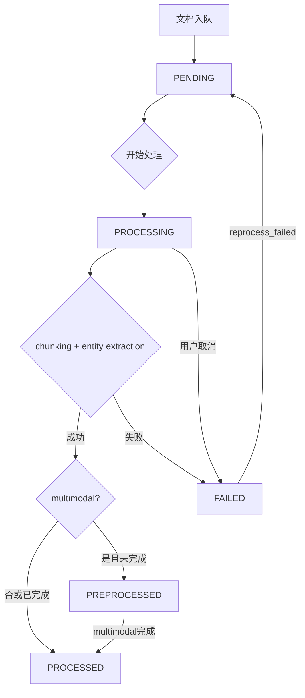
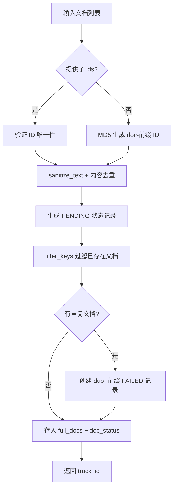
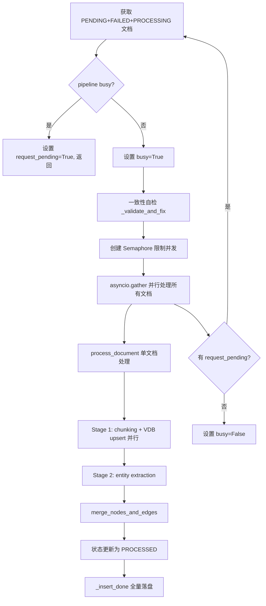

# PD-88.01 LightRAG — 五阶段文档处理管道与 Pipeline 状态机

> 文档编号：PD-88.01
> 来源：LightRAG `lightrag/lightrag.py`, `lightrag/base.py`, `lightrag/api/routers/document_routes.py`
> GitHub：https://github.com/HKUDS/LightRAG.git
> 问题域：PD-88 文档处理流水线 Document Processing Pipeline
> 状态：可复用方案

---

## 第 1 章 问题与动机

### 1.1 核心问题

RAG 系统的文档处理不是一次性操作，而是一条多阶段流水线：从原始文档入队、文本分块、实体抽取、知识图谱构建到向量索引，每个阶段都可能失败。核心挑战包括：

1. **状态追踪**：大批量文档并行处理时，需要精确知道每个文档处于哪个阶段
2. **失败恢复**：LLM 调用、embedding 计算等环节随时可能超时或报错，失败文档需要能重新入队
3. **并发控制**：多文档并行处理需要限制并发度，避免 LLM API 过载
4. **实时监控**：长时间运行的 pipeline 需要实时反馈进度，支持用户取消
5. **数据一致性**：文档状态与实际存储内容必须保持一致，异常中断后需要自动修复

LightRAG 通过一套完整的 Pipeline 架构解决了这些问题：5 态文档状态机 + 共享 pipeline_status 实时监控 + Semaphore 并发控制 + 一致性自动修复。

### 1.2 LightRAG 的解法概述

1. **5 态 DocStatus 状态机**（`lightrag/base.py:705-712`）：PENDING → PROCESSING → PREPROCESSED → PROCESSED，任何阶段失败转 FAILED，支持 FAILED → PENDING 重入队
2. **两阶段文档处理**（`lightrag/lightrag.py:1265-1442`）：先 `apipeline_enqueue_documents` 入队验证去重，再 `apipeline_process_enqueue_documents` 执行处理
3. **Semaphore 并发控制**（`lightrag/lightrag.py:1778`）：`max_parallel_insert` 参数控制并行文档处理数量
4. **共享 pipeline_status 字典**（`lightrag/kg/shared_storage.py:1267-1306`）：跨进程共享的状态字典，记录 busy/job_name/cur_batch/history_messages 等实时信息
5. **track_id 追踪体系**（`lightrag/lightrag.py:1182-1184`）：每次插入操作生成唯一 track_id，支持按 track_id 查询关联文档的处理状态

### 1.3 设计思想

| 设计原则 | 具体实现 | 理由 | 替代方案 |
|----------|----------|------|----------|
| 入队与处理分离 | enqueue 和 process 是两个独立方法 | 允许批量入队后统一处理，也支持 API 层异步触发 | 单一 insert 方法同步处理 |
| 乐观并发 + busy 标志 | pipeline_status["busy"] 互斥锁 | 避免多个 worker 同时处理队列，同时支持 request_pending 排队 | 分布式锁（Redis） |
| 文档级粒度状态 | 每个 doc_id 独立状态，不是批次级 | 单个文档失败不影响其他文档，支持精确重试 | 批次级状态（全部成功或全部失败） |
| 一致性自检 | 处理前自动检查 full_docs 与 doc_status 一致性 | 异常中断后自动修复脏数据 | 手动清理 |
| 优雅取消 | cancellation_requested 标志 + 检查点 | 在每个阶段开始前检查取消标志，确保数据一致性 | 强制 kill 进程 |

---

## 第 2 章 源码实现分析

### 2.1 架构概览

LightRAG 的文档处理管道分为两大阶段，由 `ainsert` 方法串联：

```
┌──────────────────────────────────────────────────────────────────────┐
│                        ainsert (入口)                                │
│  lightrag/lightrag.py:1158                                          │
├──────────────────────────────────────────────────────────────────────┤
│                                                                      │
│  Phase 1: apipeline_enqueue_documents                                │
│  ┌─────────┐   ┌──────────┐   ┌──────────┐   ┌──────────────────┐  │
│  │ 验证ID  │──→│ 去重过滤 │──→│ 生成状态 │──→│ 存入 full_docs   │  │
│  │ 清洗内容│   │ filter_  │   │ PENDING  │   │ + doc_status     │  │
│  └─────────┘   │ keys()   │   └──────────┘   └──────────────────┘  │
│                └──────────┘                                          │
│                                                                      │
│  Phase 2: apipeline_process_enqueue_documents                        │
│  ┌──────────┐   ┌──────────┐   ┌──────────┐   ┌──────────────────┐ │
│  │ 获取待处 │──→│ 一致性   │──→│ 并行处理 │──→│ 检查 pending     │ │
│  │ 理文档   │   │ 自检修复 │   │ 每个文档 │   │ request 循环     │ │
│  │ P+F+ING  │   │ validate │   │ semaphore│   └──────────────────┘ │
│  └──────────┘   └──────────┘   └──────────┘                        │
│                                      │                              │
│                    ┌─────────────────┼─────────────────┐            │
│                    ▼                 ▼                  ▼            │
│              ┌──────────┐    ┌──────────────┐   ┌──────────┐       │
│              │ chunking │    │ entity_extract│   │ merge_   │       │
│              │ + VDB    │    │ (Stage 2)     │   │ nodes_   │       │
│              │ (Stage 1)│    └──────────────┘   │ edges    │       │
│              └──────────┘                       └──────────┘       │
│                                                       │             │
│                                                       ▼             │
│                                                ┌──────────┐        │
│                                                │ PROCESSED │        │
│                                                │ _insert_  │        │
│                                                │ done()    │        │
│                                                └──────────┘        │
└──────────────────────────────────────────────────────────────────────┘
```

### 2.2 核心实现

#### 2.2.1 DocStatus 状态机



对应源码 `lightrag/base.py:705-759`：

```python
class DocStatus(str, Enum):
    """Document processing status"""
    PENDING = "pending"
    PROCESSING = "processing"
    PREPROCESSED = "preprocessed"
    PROCESSED = "processed"
    FAILED = "failed"

@dataclass
class DocProcessingStatus:
    """Document processing status data structure"""
    content_summary: str          # 前 100 字符预览
    content_length: int           # 文档总长度
    file_path: str                # 文件路径
    status: DocStatus             # 当前状态
    created_at: str               # ISO 时间戳
    updated_at: str               # 最后更新时间
    track_id: str | None = None   # 追踪 ID
    chunks_count: int | None = None
    chunks_list: list[str] | None = field(default_factory=list)
    error_msg: str | None = None
    metadata: dict[str, Any] = field(default_factory=dict)
    multimodal_processed: bool | None = field(default=None, repr=False)

    def __post_init__(self):
        # PROCESSED + multimodal_processed=False → 自动降级为 PREPROCESSED
        if self.multimodal_processed is not None:
            if self.multimodal_processed is False and self.status == DocStatus.PROCESSED:
                self.status = DocStatus.PREPROCESSED
```

关键设计：`__post_init__` 中的自动降级逻辑——当文档文本处理完成但多模态处理未完成时，状态自动从 PROCESSED 降为 PREPROCESSED，实现了多模态处理的中间态。

#### 2.2.2 入队阶段：去重与状态初始化



对应源码 `lightrag/lightrag.py:1265-1442`：

```python
async def apipeline_enqueue_documents(
    self,
    input: str | list[str],
    ids: list[str] | None = None,
    file_paths: str | list[str] | None = None,
    track_id: str | None = None,
) -> str:
    if track_id is None or track_id.strip() == "":
        track_id = generate_track_id("enqueue")

    # 1. 清洗 + 去重
    unique_contents = {}
    for id_, doc, path in zip(ids, input, file_paths):
        cleaned_content = sanitize_text_for_encoding(doc)
        if cleaned_content not in unique_contents:
            unique_contents[cleaned_content] = (id_, path)

    # 2. 生成 PENDING 状态
    new_docs = {
        id_: {
            "status": DocStatus.PENDING,
            "content_summary": get_content_summary(content_data["content"]),
            "content_length": len(content_data["content"]),
            "created_at": datetime.now(timezone.utc).isoformat(),
            "track_id": track_id,
        }
        for id_, content_data in contents.items()
    }

    # 3. 过滤已存在文档
    unique_new_doc_ids = await self.doc_status.filter_keys(all_new_doc_ids)

    # 4. 重复文档创建 FAILED 记录（带 dup- 前缀）
    for doc_id in ignored_ids:
        dup_record_id = compute_mdhash_id(f"{doc_id}-{track_id}", prefix="dup-")
        duplicate_docs[dup_record_id] = {
            "status": DocStatus.FAILED,
            "content_summary": f"[DUPLICATE] Original document: {doc_id}",
            "track_id": track_id,
        }

    # 5. 持久化
    await self.full_docs.upsert(full_docs_data)
    await self.full_docs.index_done_callback()  # 立即落盘
    await self.doc_status.upsert(new_docs)
```

#### 2.2.3 处理阶段：并发控制与两阶段处理



对应源码 `lightrag/lightrag.py:1642-2203`：

```python
async def apipeline_process_enqueue_documents(self, ...):
    pipeline_status = await get_namespace_data("pipeline_status", workspace=self.workspace)
    pipeline_status_lock = get_namespace_lock("pipeline_status", workspace=self.workspace)

    async with pipeline_status_lock:
        if not pipeline_status.get("busy", False):
            # 收集所有待处理文档（PROCESSING + FAILED + PENDING）
            processing_docs, failed_docs, pending_docs = await asyncio.gather(
                self.doc_status.get_docs_by_status(DocStatus.PROCESSING),
                self.doc_status.get_docs_by_status(DocStatus.FAILED),
                self.doc_status.get_docs_by_status(DocStatus.PENDING),
            )
            pipeline_status.update({"busy": True, "cancellation_requested": False, ...})
        else:
            pipeline_status["request_pending"] = True  # 排队等待
            return

    # 并发控制
    semaphore = asyncio.Semaphore(self.max_parallel_insert)

    async def process_document(doc_id, status_doc, ...):
        async with semaphore:
            # Stage 1: 并行执行 chunking + VDB + text_chunks
            first_stage_tasks = [doc_status_task, chunks_vdb_task, text_chunks_task]
            await asyncio.gather(*first_stage_tasks)

            # Stage 2: 实体关系抽取
            chunk_results = await self._process_extract_entities(chunks, ...)

            # Stage 3: 合并到知识图谱
            await merge_nodes_and_edges(chunk_results=chunk_results, ...)

            # 更新状态为 PROCESSED
            await self.doc_status.upsert({doc_id: {"status": DocStatus.PROCESSED, ...}})
            await self._insert_done()

    # 并行处理所有文档
    await asyncio.gather(*doc_tasks)
```

### 2.3 实现细节

#### pipeline_status 共享状态字典

`pipeline_status` 是一个跨进程共享的字典（多进程模式下使用 `Manager.dict()`），结构如下：

```python
# lightrag/kg/shared_storage.py:1288-1300
pipeline_namespace.update({
    "autoscanned": False,
    "busy": False,                # 互斥标志
    "job_name": "-",              # 当前任务名
    "job_start": None,            # 任务开始时间
    "docs": 0,                    # 总文档数
    "batchs": 0,                  # 总批次数（= 文档数）
    "cur_batch": 0,               # 当前已处理数
    "request_pending": False,     # 是否有排队请求
    "latest_message": "",         # 最新日志消息
    "history_messages": [],       # 历史消息列表（限制 10000 条，超出裁剪到 5000）
})
```

#### 一致性自检机制

`_validate_and_fix_document_consistency`（`lightrag/lightrag.py:1515-1640`）在每轮处理前执行：
1. 检查每个待处理文档在 `full_docs` 中是否有对应内容
2. FAILED 文档无内容 → 保留状态记录供人工审查
3. 非 FAILED 文档无内容 → 删除不一致的 doc_status 记录
4. 有内容的 PROCESSING/FAILED 文档 → 重置为 PENDING 重新处理

#### 优雅取消机制

取消检查点分布在 pipeline 的关键位置（`lightrag/lightrag.py:1714, 1806, 1886, 2015`）：
- 主循环开始前
- 单文档处理开始前
- entity extraction 开始前
- merge 开始前

每个检查点抛出 `PipelineCancelledException`，由外层 catch 统一处理任务取消和状态更新。


---

## 第 3 章 迁移指南

### 3.1 迁移清单

**阶段 1：文档状态机**
- [ ] 定义 DocStatus 枚举（PENDING/PROCESSING/PROCESSED/FAILED，按需加 PREPROCESSED）
- [ ] 实现 DocProcessingStatus 数据结构（含 track_id、error_msg、metadata）
- [ ] 实现 DocStatusStorage 抽象基类（get_by_status、get_by_track_id、分页查询）
- [ ] 选择存储后端（JSON 文件 / SQLite / PostgreSQL）

**阶段 2：入队管道**
- [ ] 实现文档去重逻辑（MD5 hash 或自定义 ID）
- [ ] 实现 enqueue 方法：验证 → 去重 → 生成 PENDING 状态 → 持久化
- [ ] 实现 track_id 生成与关联

**阶段 3：处理管道**
- [ ] 实现 pipeline_status 共享状态（busy 互斥 + request_pending 排队）
- [ ] 实现 Semaphore 并发控制
- [ ] 实现两阶段文档处理（chunking → entity extraction → merge）
- [ ] 实现一致性自检（处理前验证 content 与 status 一致性）
- [ ] 实现优雅取消（cancellation_requested 标志 + 检查点）

**阶段 4：API 层**
- [ ] 实现 pipeline_status 查询接口
- [ ] 实现 track_id 查询接口
- [ ] 实现 reprocess_failed 重处理接口
- [ ] 实现 cancel_pipeline 取消接口

### 3.2 适配代码模板

```python
"""可复用的文档处理管道模板，基于 LightRAG 的设计模式"""

import asyncio
from enum import Enum
from dataclasses import dataclass, field
from datetime import datetime, timezone
from typing import Any, Optional
import hashlib
import uuid


class DocStatus(str, Enum):
    PENDING = "pending"
    PROCESSING = "processing"
    PROCESSED = "processed"
    FAILED = "failed"


@dataclass
class DocProcessingStatus:
    content_summary: str
    content_length: int
    status: DocStatus
    created_at: str
    updated_at: str
    track_id: Optional[str] = None
    chunks_count: Optional[int] = None
    error_msg: Optional[str] = None
    metadata: dict[str, Any] = field(default_factory=dict)


def generate_track_id(prefix: str = "insert") -> str:
    ts = datetime.now().strftime("%Y%m%d_%H%M%S")
    short_id = uuid.uuid4().hex[:6]
    return f"{prefix}_{ts}_{short_id}"


class DocumentPipeline:
    """文档处理管道，移植自 LightRAG 的 Pipeline 设计"""

    def __init__(self, max_parallel: int = 4):
        self.max_parallel = max_parallel
        self._status_store: dict[str, DocProcessingStatus] = {}
        self._content_store: dict[str, str] = {}
        self._pipeline_status = {
            "busy": False,
            "request_pending": False,
            "cancellation_requested": False,
            "cur_batch": 0,
            "total": 0,
            "latest_message": "",
            "history_messages": [],
        }
        self._lock = asyncio.Lock()

    async def enqueue(
        self,
        documents: list[str],
        ids: list[str] | None = None,
        track_id: str | None = None,
    ) -> str:
        """入队阶段：验证、去重、生成 PENDING 状态"""
        if track_id is None:
            track_id = generate_track_id("enqueue")

        for i, doc in enumerate(documents):
            doc_id = ids[i] if ids else hashlib.md5(doc.encode()).hexdigest()
            if doc_id in self._status_store:
                continue  # 跳过已存在文档

            self._content_store[doc_id] = doc
            self._status_store[doc_id] = DocProcessingStatus(
                content_summary=doc[:100],
                content_length=len(doc),
                status=DocStatus.PENDING,
                created_at=datetime.now(timezone.utc).isoformat(),
                updated_at=datetime.now(timezone.utc).isoformat(),
                track_id=track_id,
            )
        return track_id

    async def process_queue(self, process_fn) -> None:
        """处理阶段：并发控制 + 状态流转"""
        async with self._lock:
            if self._pipeline_status["busy"]:
                self._pipeline_status["request_pending"] = True
                return
            self._pipeline_status["busy"] = True
            self._pipeline_status["cancellation_requested"] = False

        try:
            while True:
                pending = {
                    k: v for k, v in self._status_store.items()
                    if v.status in (DocStatus.PENDING, DocStatus.FAILED)
                }
                if not pending:
                    break

                semaphore = asyncio.Semaphore(self.max_parallel)
                tasks = [
                    self._process_one(doc_id, semaphore, process_fn)
                    for doc_id in pending
                ]
                await asyncio.gather(*tasks)

                async with self._lock:
                    if not self._pipeline_status["request_pending"]:
                        break
                    self._pipeline_status["request_pending"] = False
        finally:
            async with self._lock:
                self._pipeline_status["busy"] = False

    async def _process_one(self, doc_id: str, semaphore, process_fn) -> None:
        async with semaphore:
            # 检查取消
            if self._pipeline_status["cancellation_requested"]:
                return

            status = self._status_store[doc_id]
            status.status = DocStatus.PROCESSING
            status.updated_at = datetime.now(timezone.utc).isoformat()

            try:
                content = self._content_store[doc_id]
                result = await process_fn(doc_id, content)
                status.status = DocStatus.PROCESSED
                status.chunks_count = result.get("chunks_count", 0)
            except Exception as e:
                status.status = DocStatus.FAILED
                status.error_msg = str(e)
            finally:
                status.updated_at = datetime.now(timezone.utc).isoformat()

    async def cancel(self) -> bool:
        async with self._lock:
            if not self._pipeline_status["busy"]:
                return False
            self._pipeline_status["cancellation_requested"] = True
            return True

    def get_status_by_track_id(self, track_id: str) -> list[DocProcessingStatus]:
        return [s for s in self._status_store.values() if s.track_id == track_id]
```

### 3.3 适用场景

| 场景 | 适用度 | 说明 |
|------|--------|------|
| RAG 系统文档索引 | ⭐⭐⭐ | 完美匹配，LightRAG 的原生场景 |
| 批量数据 ETL 管道 | ⭐⭐⭐ | 状态机 + 并发控制模式通用 |
| 异步任务队列（轻量级） | ⭐⭐ | 适合单进程/少量 worker，重度场景建议 Celery |
| 实时流处理 | ⭐ | 设计偏批处理，不适合低延迟流式场景 |
| 多租户文档处理 | ⭐⭐⭐ | workspace 隔离 + pipeline_status 按 workspace 独立 |

---

## 第 4 章 测试用例

```python
import pytest
import asyncio
from datetime import datetime, timezone


class TestDocStatus:
    """测试文档状态机"""

    def test_status_enum_values(self):
        from lightrag.base import DocStatus
        assert DocStatus.PENDING.value == "pending"
        assert DocStatus.PROCESSING.value == "processing"
        assert DocStatus.PREPROCESSED.value == "preprocessed"
        assert DocStatus.PROCESSED.value == "processed"
        assert DocStatus.FAILED.value == "failed"

    def test_preprocessed_auto_downgrade(self):
        """multimodal_processed=False 时 PROCESSED 自动降级为 PREPROCESSED"""
        from lightrag.base import DocProcessingStatus, DocStatus
        status = DocProcessingStatus(
            content_summary="test",
            content_length=100,
            file_path="test.pdf",
            status=DocStatus.PROCESSED,
            created_at=datetime.now(timezone.utc).isoformat(),
            updated_at=datetime.now(timezone.utc).isoformat(),
            multimodal_processed=False,
        )
        assert status.status == DocStatus.PREPROCESSED

    def test_no_downgrade_when_multimodal_done(self):
        """multimodal_processed=True 时保持 PROCESSED"""
        from lightrag.base import DocProcessingStatus, DocStatus
        status = DocProcessingStatus(
            content_summary="test",
            content_length=100,
            file_path="test.pdf",
            status=DocStatus.PROCESSED,
            created_at=datetime.now(timezone.utc).isoformat(),
            updated_at=datetime.now(timezone.utc).isoformat(),
            multimodal_processed=True,
        )
        assert status.status == DocStatus.PROCESSED


class TestPipelineEnqueue:
    """测试入队逻辑"""

    @pytest.mark.asyncio
    async def test_duplicate_detection(self):
        """重复文档应被检测并标记"""
        # 模拟 enqueue 两次相同内容
        pipeline = DocumentPipeline(max_parallel=2)
        track1 = await pipeline.enqueue(["hello world"], track_id="t1")
        track2 = await pipeline.enqueue(["hello world"], track_id="t2")
        # 第二次入队应被跳过（相同 MD5）
        statuses = pipeline.get_status_by_track_id("t2")
        assert len(statuses) == 0  # 重复文档不会创建新记录

    @pytest.mark.asyncio
    async def test_track_id_generation(self):
        """未提供 track_id 时应自动生成"""
        pipeline = DocumentPipeline()
        track_id = await pipeline.enqueue(["test doc"])
        assert track_id.startswith("enqueue_")


class TestPipelineConcurrency:
    """测试并发控制"""

    @pytest.mark.asyncio
    async def test_semaphore_limits_concurrency(self):
        """并发数不应超过 max_parallel"""
        max_concurrent = 0
        current_concurrent = 0
        lock = asyncio.Lock()

        async def mock_process(doc_id, content):
            nonlocal max_concurrent, current_concurrent
            async with lock:
                current_concurrent += 1
                max_concurrent = max(max_concurrent, current_concurrent)
            await asyncio.sleep(0.1)
            async with lock:
                current_concurrent -= 1
            return {"chunks_count": 1}

        pipeline = DocumentPipeline(max_parallel=2)
        await pipeline.enqueue([f"doc {i}" for i in range(10)])
        await pipeline.process_queue(mock_process)
        assert max_concurrent <= 2

    @pytest.mark.asyncio
    async def test_cancel_pipeline(self):
        """取消应设置 cancellation_requested 标志"""
        pipeline = DocumentPipeline()
        pipeline._pipeline_status["busy"] = True
        result = await pipeline.cancel()
        assert result is True
        assert pipeline._pipeline_status["cancellation_requested"] is True
```


---

## 第 5 章 跨域关联

| 关联域 | 关系类型 | 说明 |
|--------|----------|------|
| PD-01 上下文管理 | 协同 | chunking 阶段的 chunk_token_size 和 chunk_overlap_token_size 直接影响上下文窗口利用率 |
| PD-03 容错与重试 | 依赖 | Pipeline 的 FAILED → PENDING 重入队机制是容错重试的具体实现；一致性自检是异常恢复的保障 |
| PD-06 记忆持久化 | 协同 | `_insert_done()` 调用所有存储的 `index_done_callback()` 实现全量落盘，是持久化的关键路径 |
| PD-08 搜索与检索 | 依赖 | Pipeline 的输出（chunks_vdb、entities_vdb、relationships_vdb）是检索系统的数据源 |
| PD-11 可观测性 | 协同 | pipeline_status 共享字典 + history_messages 是可观测性的核心数据源，API 层暴露 /pipeline_status 端点 |
| PD-78 并发控制 | 依赖 | Semaphore 并发控制、busy 互斥标志、request_pending 排队机制都是并发控制模式的应用 |

---

## 第 6 章 来源文件索引

| 文件 | 行范围 | 关键实现 |
|------|--------|----------|
| `lightrag/base.py` | L705-L712 | DocStatus 枚举定义（5 态状态机） |
| `lightrag/base.py` | L716-L759 | DocProcessingStatus 数据结构（含 multimodal 自动降级） |
| `lightrag/base.py` | L762-L822 | DocStatusStorage 抽象基类（分页查询、按状态/track_id 查询） |
| `lightrag/lightrag.py` | L1158-L1191 | ainsert 入口方法（串联 enqueue + process） |
| `lightrag/lightrag.py` | L1265-L1442 | apipeline_enqueue_documents（入队验证去重） |
| `lightrag/lightrag.py` | L1444-L1513 | apipeline_enqueue_error_documents（错误文档入队） |
| `lightrag/lightrag.py` | L1515-L1640 | _validate_and_fix_document_consistency（一致性自检） |
| `lightrag/lightrag.py` | L1642-L2203 | apipeline_process_enqueue_documents（核心处理管道） |
| `lightrag/lightrag.py` | L1780-L2133 | process_document 内部函数（单文档两阶段处理） |
| `lightrag/lightrag.py` | L2205-L2224 | _process_extract_entities（实体关系抽取） |
| `lightrag/lightrag.py` | L2226-L2255 | _insert_done（全量存储落盘） |
| `lightrag/lightrag.py` | L382-L385 | max_parallel_insert 配置参数 |
| `lightrag/kg/shared_storage.py` | L1267-L1306 | initialize_pipeline_status（共享状态初始化） |
| `lightrag/api/routers/document_routes.py` | L724-L751 | PipelineStatusResponse 响应模型 |
| `lightrag/api/routers/document_routes.py` | L2596-L2694 | GET /pipeline_status 端点 |
| `lightrag/api/routers/document_routes.py` | L3181-L3225 | POST /reprocess_failed 端点 |
| `lightrag/api/routers/document_routes.py` | L3227-L3286 | POST /cancel_pipeline 端点 |

---

## 第 7 章 横向对比维度

```json comparison_data
{
  "project": "LightRAG",
  "dimensions": {
    "管道架构": "两阶段分离：enqueue 入队验证 + process 异步处理，busy 标志互斥",
    "状态机模型": "5 态 DocStatus 枚举（含 PREPROCESSED 多模态中间态），文档级粒度",
    "并发控制": "asyncio.Semaphore(max_parallel_insert) 限制并行文档数",
    "进度监控": "共享 pipeline_status 字典，支持 history_messages 和 /pipeline_status API",
    "失败恢复": "FAILED→PENDING 重入队 + 一致性自检自动修复脏数据",
    "取消机制": "cancellation_requested 标志 + 4 个检查点优雅取消"
  }
}
```

### 域元数据补充

```json domain_metadata
{
  "solution_summary": "LightRAG 用 enqueue/process 两阶段分离 + 5 态 DocStatus 状态机 + 共享 pipeline_status 字典实现文档处理管道，支持 Semaphore 并发控制和优雅取消",
  "description": "文档处理管道需要解决入队验证、并发处理、实时监控和优雅取消的完整生命周期管理",
  "sub_problems": [
    "多模态文档的中间态管理（PREPROCESSED 状态）",
    "入队阶段的重复文档检测与记录",
    "处理前数据一致性自检与自动修复"
  ],
  "best_practices": [
    "入队与处理分离为独立方法，支持批量入队后异步触发处理",
    "在 pipeline 关键位置设置取消检查点，实现优雅取消而非强制终止",
    "处理前自动验证 content 与 status 存储一致性，自动清理脏数据"
  ]
}
```
