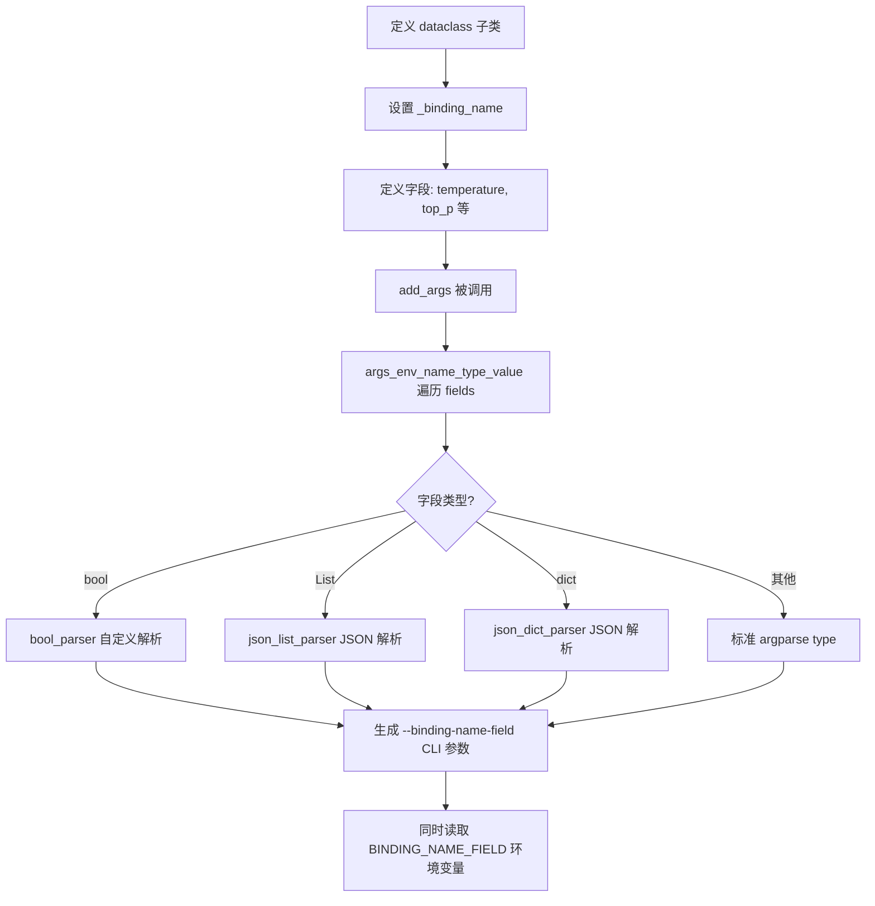
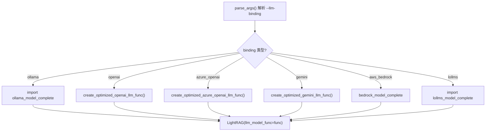
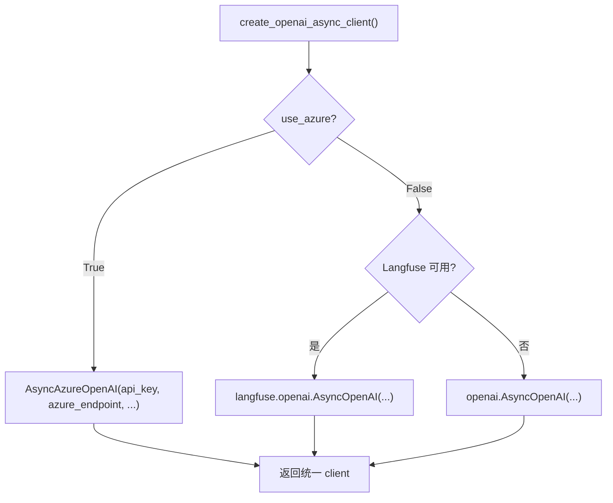

# PD-89.01 LightRAG — BindingOptions 多 LLM 提供商适配器

> 文档编号：PD-89.01
> 来源：LightRAG `lightrag/llm/binding_options.py`, `lightrag/llm/openai.py`, `lightrag/llm/ollama.py`
> GitHub：https://github.com/HKUDS/LightRAG.git
> 问题域：PD-89 多LLM提供商适配 Multi-LLM Provider Adaptation
> 状态：可复用方案

---

## 第 1 章 问题与动机

### 1.1 核心问题

RAG 系统需要同时对接多个 LLM 提供商（OpenAI、Azure、Ollama、Gemini、Anthropic、Bedrock、HuggingFace、Zhipu、Jina、LMDeploy、LoLLMs 等 12+），每个提供商的 API 签名、认证方式、参数命名、错误类型、流式响应格式都不同。如果为每个提供商硬编码适配逻辑，会导致：

- 新增提供商时需要修改大量胶水代码
- CLI 参数和环境变量命名不一致
- 运行时切换提供商需要重启服务
- 每个提供商的采样参数（temperature、top_p 等）无法统一管理

### 1.2 LightRAG 的解法概述

LightRAG 采用**双层适配架构**：

1. **BindingOptions 基类**（`binding_options.py:69`）：用 Python dataclass + 类内省自动生成 CLI 参数和环境变量映射，每个提供商只需定义参数字段和 `_binding_name`
2. **函数式 Binding 模块**：每个提供商一个独立文件（`openai.py`、`ollama.py`、`gemini.py` 等），导出统一签名的 `xxx_complete_if_cache()` 和 `xxx_embed()` 函数
3. **Server 层动态分发**（`lightrag_server.py:600`）：`create_llm_model_func(binding)` 根据 `--llm-binding` 参数动态 import 并返回对应的完成函数
4. **LLMConfigCache 预处理**（`lightrag_server.py:85`）：启动时一次性解析所有 binding options，避免每次请求重复解析
5. **pipmaster 按需安装**：每个 binding 文件开头用 `pipmaster` 检测并自动安装依赖（如 `ollama`、`anthropic`、`google-genai`）

### 1.3 设计思想

| 设计原则 | 具体实现 | 理由 | 替代方案 |
|----------|----------|------|----------|
| 约定优于配置 | `_binding_name` 自动推导 CLI 前缀和环境变量前缀 | 新增 binding 零配置 | 手动注册映射表 |
| 函数式接口 | 每个 binding 导出 `xxx_complete_if_cache(model, prompt, ...)` 统一签名 | 调用方无需知道具体提供商 | 抽象基类 + 策略模式 |
| 延迟加载 | `create_llm_model_func` 按需 import binding 模块 | 不使用的提供商不加载依赖 | 全量 import |
| dataclass 内省 | `args_env_name_type_value()` 遍历 dataclass fields 自动生成参数 | 新增字段自动出现在 CLI 和 .env | 手动维护参数列表 |
| 独立重试策略 | 每个 binding 用 tenacity 定义自己的重试异常类型 | Bedrock 的异常类型和 OpenAI 完全不同 | 统一重试中间件 |

---

## 第 2 章 源码实现分析

### 2.1 架构概览

```
┌─────────────────────────────────────────────────────────────────┐
│                    lightrag_server.py                            │
│  ┌──────────────┐  ┌──────────────────┐  ┌──────────────────┐  │
│  │ parse_args() │→ │ LLMConfigCache   │→ │create_llm_model_ │  │
│  │ (config.py)  │  │ (预处理 options) │  │func(binding)     │  │
│  └──────┬───────┘  └──────────────────┘  └────────┬─────────┘  │
│         │                                          │            │
│  BindingOptions.add_args(parser)          动态 import binding   │
└─────────┼──────────────────────────────────────────┼────────────┘
          │                                          │
┌─────────▼──────────────────────────────────────────▼────────────┐
│                  lightrag/llm/ (Binding 层)                      │
│                                                                  │
│  binding_options.py          openai.py    ollama.py   gemini.py │
│  ┌──────────────────┐   ┌──────────┐  ┌─────────┐  ┌────────┐ │
│  │ BindingOptions   │   │openai_   │  │ollama_  │  │gemini_ │ │
│  │ (dataclass 基类) │   │complete_ │  │model_   │  │complete│ │
│  │                  │   │if_cache()│  │complete()│  │_if_    │ │
│  │ OllamaLLMOptions│   │openai_   │  │ollama_  │  │cache() │ │
│  │ OpenAILLMOptions │   │embed()   │  │embed()  │  │gemini_ │ │
│  │ GeminiLLMOptions │   └──────────┘  └─────────┘  │embed() │ │
│  └──────────────────┘                               └────────┘ │
│                                                                  │
│  anthropic.py  bedrock.py  hf.py  zhipu.py  jina.py  lollms.py │
└──────────────────────────────────────────────────────────────────┘
```

### 2.2 核心实现

#### 2.2.1 BindingOptions 基类：自动参数生成



对应源码 `lightrag/llm/binding_options.py:206-263`：

```python
@classmethod
def args_env_name_type_value(cls):
    import dataclasses

    args_prefix = f"{cls._binding_name}".replace("_", "-")
    env_var_prefix = f"{cls._binding_name}_".upper()
    help = cls._help

    if dataclasses.is_dataclass(cls):
        for field in dataclasses.fields(cls):
            if field.name.startswith("_"):
                continue
            if field.default is not dataclasses.MISSING:
                default_value = field.default
            elif field.default_factory is not dataclasses.MISSING:
                default_value = field.default_factory()
            else:
                default_value = None

            argdef = {
                "argname": f"{args_prefix}-{field.name}",
                "env_name": f"{env_var_prefix}{field.name.upper()}",
                "type": _resolve_optional_type(field.type),
                "default": default_value,
                "help": f"{cls._binding_name} -- " + help.get(field.name, ""),
            }
            yield argdef
```

这段代码的关键设计：`_binding_name` 同时决定了 CLI 参数前缀（`--ollama-llm-temperature`）和环境变量前缀（`OLLAMA_LLM_TEMPERATURE`），新增一个 binding 只需定义 `_binding_name` 和字段。

#### 2.2.2 Server 层动态分发



对应源码 `lightrag/api/lightrag_server.py:600-627`：

```python
def create_llm_model_func(binding: str):
    try:
        if binding == "lollms":
            from lightrag.llm.lollms import lollms_model_complete
            return lollms_model_complete
        elif binding == "ollama":
            from lightrag.llm.ollama import ollama_model_complete
            return ollama_model_complete
        elif binding == "aws_bedrock":
            return bedrock_model_complete
        elif binding == "azure_openai":
            return create_optimized_azure_openai_llm_func(
                config_cache, args, llm_timeout
            )
        elif binding == "gemini":
            return create_optimized_gemini_llm_func(config_cache, args, llm_timeout)
        else:  # openai and compatible
            return create_optimized_openai_llm_func(config_cache, args, llm_timeout)
    except ImportError as e:
        raise Exception(f"Failed to import {binding} LLM binding: {e}")
```

#### 2.2.3 OpenAI 统一客户端工厂



对应源码 `lightrag/llm/openai.py:102-184`：

```python
def create_openai_async_client(
    api_key: str | None = None,
    base_url: str | None = None,
    use_azure: bool = False,
    azure_deployment: str | None = None,
    api_version: str | None = None,
    timeout: int | None = None,
    client_configs: dict[str, Any] | None = None,
) -> AsyncOpenAI:
    if use_azure:
        from openai import AsyncAzureOpenAI
        if not api_key:
            api_key = os.environ.get("AZURE_OPENAI_API_KEY") or os.environ.get(
                "LLM_BINDING_API_KEY"
            )
        merged_configs = {**client_configs, "api_key": api_key}
        if base_url is not None:
            merged_configs["azure_endpoint"] = base_url
        return AsyncAzureOpenAI(**merged_configs)
    else:
        if not api_key:
            api_key = os.environ["OPENAI_API_KEY"]
        merged_configs = {
            **client_configs,
            "default_headers": default_headers,
            "api_key": api_key,
        }
        return AsyncOpenAI(**merged_configs)
```

### 2.3 实现细节

**Binding 子类定义极简**：以 Ollama 为例，只需继承 Mixin + BindingOptions 并设置 `_binding_name`：

```python
# binding_options.py:459-472
@dataclass
class _OllamaOptionsMixin:
    num_ctx: int = 32768
    temperature: float = DEFAULT_TEMPERATURE
    top_k: int = 40
    top_p: float = 0.9
    # ... 20+ 参数

@dataclass
class OllamaLLMOptions(_OllamaOptionsMixin, BindingOptions):
    _binding_name: ClassVar[str] = "ollama_llm"

@dataclass
class OllamaEmbeddingOptions(_OllamaOptionsMixin, BindingOptions):
    _binding_name: ClassVar[str] = "ollama_embedding"
```

**pipmaster 按需安装**（`ollama.py:8-9`）：

```python
if not pm.is_installed("ollama"):
    pm.install("ollama")
```

**每个 binding 独立的重试策略**：Bedrock 用 5 次重试 + 自定义异常层级（`bedrock.py:135-143`），OpenAI 用 3 次 + 标准异常（`openai.py:187-196`），Gemini 用 3 次 + Google API 异常（`gemini.py:203-217`）。

**LLMConfigCache 预处理**（`lightrag_server.py:85-148`）：启动时根据 `--llm-binding` 值一次性调用 `XxxOptions.options_dict(args)` 缓存配置字典，避免每次 LLM 调用都重新解析。

**环境变量多级回退**：Azure 认证链 `AZURE_OPENAI_API_KEY → LLM_BINDING_API_KEY`（`openai.py:131-132`），Gemini 认证链 `LLM_BINDING_API_KEY → GEMINI_API_KEY`（`gemini.py:110`），实现统一环境变量 + 提供商专用环境变量的双层回退。


---

## 第 3 章 迁移指南

### 3.1 迁移清单

**阶段 1：基础框架（必须）**

- [ ] 创建 `binding_options.py`，复制 `BindingOptions` 基类和 `_resolve_optional_type` 辅助函数
- [ ] 为第一个提供商（如 OpenAI）创建 `@dataclass` 子类，设置 `_binding_name` 和参数字段
- [ ] 在 CLI 入口调用 `XxxOptions.add_args(parser)` 注册参数
- [ ] 创建对应的 `openai.py` binding 模块，导出 `xxx_complete_if_cache()` 函数

**阶段 2：多提供商扩展**

- [ ] 为每个新提供商创建 Options 子类（通常 10-30 行）
- [ ] 为每个新提供商创建 binding 模块（导出统一签名函数）
- [ ] 在 server 层添加 `create_llm_model_func` 的分支

**阶段 3：生产加固**

- [ ] 添加 `LLMConfigCache` 预处理层，避免每次请求重复解析
- [ ] 为每个 binding 配置独立的 tenacity 重试策略
- [ ] 添加 `generate_dot_env_sample()` 自动生成 .env 模板

### 3.2 适配代码模板

**最小可运行的 BindingOptions 基类**（从 LightRAG 提取的核心 ~60 行）：

```python
from dataclasses import dataclass, fields, MISSING
from argparse import ArgumentParser
from typing import Any, ClassVar
import os


@dataclass
class BindingOptions:
    """多 LLM 提供商参数基类"""
    _binding_name: ClassVar[str]
    _help: ClassVar[dict[str, str]] = {}

    @classmethod
    def add_args(cls, parser: ArgumentParser):
        prefix = cls._binding_name.replace("_", "-")
        env_prefix = f"{cls._binding_name}_".upper()
        group = parser.add_argument_group(f"{cls._binding_name} options")

        for f in fields(cls):
            if f.name.startswith("_"):
                continue
            default = f.default if f.default is not MISSING else None
            env_name = f"{env_prefix}{f.name.upper()}"
            env_val = os.environ.get(env_name)
            group.add_argument(
                f"--{prefix}-{f.name}",
                type=f.type if f.type is not None else str,
                default=env_val if env_val is not None else default,
                help=cls._help.get(f.name, ""),
            )

    @classmethod
    def options_dict(cls, args) -> dict[str, Any]:
        prefix = cls._binding_name + "_"
        return {
            k[len(prefix):]: v
            for k, v in vars(args).items()
            if k.startswith(prefix)
        }


# 使用示例：定义 OpenAI binding
@dataclass
class OpenAILLMOptions(BindingOptions):
    _binding_name: ClassVar[str] = "openai_llm"
    temperature: float = 0.7
    top_p: float = 1.0
    max_tokens: int = 4096
    _help: ClassVar[dict[str, str]] = {
        "temperature": "Controls randomness (0.0-2.0)",
        "top_p": "Nucleus sampling (0.0-1.0)",
        "max_tokens": "Max tokens to generate",
    }
```

**动态分发函数模板**：

```python
def create_llm_func(binding: str, config: dict):
    """根据 binding 名称动态加载对应的 LLM 完成函数"""
    if binding == "openai":
        from .llm.openai import openai_complete
        async def wrapper(prompt, system_prompt=None, **kwargs):
            kwargs.update(config)
            return await openai_complete(prompt, system_prompt=system_prompt, **kwargs)
        return wrapper
    elif binding == "ollama":
        from .llm.ollama import ollama_complete
        async def wrapper(prompt, system_prompt=None, **kwargs):
            kwargs.update(config)
            return await ollama_complete(prompt, system_prompt=system_prompt, **kwargs)
        return wrapper
    else:
        raise ValueError(f"Unsupported binding: {binding}")
```

### 3.3 适用场景

| 场景 | 适用度 | 说明 |
|------|--------|------|
| RAG 系统需要支持多 LLM 后端 | ⭐⭐⭐ | 核心场景，BindingOptions 直接复用 |
| CLI 工具需要多提供商切换 | ⭐⭐⭐ | add_args 自动生成 CLI 参数 |
| SaaS 平台按租户配置不同 LLM | ⭐⭐ | 需要扩展为实例级配置而非全局 |
| 单一提供商的简单应用 | ⭐ | 过度设计，直接用 SDK 即可 |

---

## 第 4 章 测试用例

```python
import pytest
from dataclasses import dataclass
from typing import ClassVar
from argparse import ArgumentParser, Namespace


@dataclass
class BindingOptions:
    """简化版基类用于测试"""
    _binding_name: ClassVar[str]
    _help: ClassVar[dict[str, str]] = {}

    @classmethod
    def add_args(cls, parser):
        import dataclasses
        prefix = cls._binding_name.replace("_", "-")
        env_prefix = f"{cls._binding_name}_".upper()
        group = parser.add_argument_group(f"{cls._binding_name} options")
        for f in dataclasses.fields(cls):
            if f.name.startswith("_"):
                continue
            default = f.default if f.default is not dataclasses.MISSING else None
            group.add_argument(f"--{prefix}-{f.name}", type=f.type, default=default)

    @classmethod
    def options_dict(cls, args):
        prefix = cls._binding_name + "_"
        return {k[len(prefix):]: v for k, v in vars(args).items() if k.startswith(prefix)}


@dataclass
class TestOpenAIOptions(BindingOptions):
    _binding_name: ClassVar[str] = "openai_llm"
    temperature: float = 0.7
    top_p: float = 1.0
    max_tokens: int = 4096
    _help: ClassVar[dict[str, str]] = {}


@dataclass
class TestOllamaOptions(BindingOptions):
    _binding_name: ClassVar[str] = "ollama_llm"
    num_ctx: int = 32768
    temperature: float = 0.8
    _help: ClassVar[dict[str, str]] = {}


class TestBindingOptionsArgParsing:
    """测试 BindingOptions 自动 CLI 参数生成"""

    def test_add_args_creates_correct_cli_flags(self):
        parser = ArgumentParser()
        TestOpenAIOptions.add_args(parser)
        args = parser.parse_args(["--openai-llm-temperature", "0.5"])
        assert args.openai_llm_temperature == 0.5

    def test_options_dict_extracts_binding_specific_args(self):
        parser = ArgumentParser()
        TestOpenAIOptions.add_args(parser)
        TestOllamaOptions.add_args(parser)
        args = parser.parse_args([
            "--openai-llm-temperature", "0.9",
            "--ollama-llm-num_ctx", "16384",
        ])
        openai_opts = TestOpenAIOptions.options_dict(args)
        assert openai_opts["temperature"] == 0.9
        assert "num_ctx" not in openai_opts

        ollama_opts = TestOllamaOptions.options_dict(args)
        assert ollama_opts["num_ctx"] == 16384
        assert "temperature" in ollama_opts

    def test_default_values_when_no_args_provided(self):
        parser = ArgumentParser()
        TestOpenAIOptions.add_args(parser)
        args = parser.parse_args([])
        opts = TestOpenAIOptions.options_dict(args)
        assert opts["temperature"] == 0.7
        assert opts["top_p"] == 1.0
        assert opts["max_tokens"] == 4096

    def test_multiple_bindings_no_collision(self):
        parser = ArgumentParser()
        TestOpenAIOptions.add_args(parser)
        TestOllamaOptions.add_args(parser)
        args = parser.parse_args([])
        openai_opts = TestOpenAIOptions.options_dict(args)
        ollama_opts = TestOllamaOptions.options_dict(args)
        # 两个 binding 的 temperature 互不干扰
        assert openai_opts["temperature"] == 0.7
        assert ollama_opts["temperature"] == 0.8


class TestBindingOptionsEnvVar:
    """测试环境变量回退"""

    def test_env_var_naming_convention(self, monkeypatch):
        monkeypatch.setenv("OPENAI_LLM_TEMPERATURE", "0.3")
        # 验证环境变量名遵循 {BINDING_NAME}_{FIELD} 大写约定
        import os
        assert os.environ.get("OPENAI_LLM_TEMPERATURE") == "0.3"


class TestDynamicDispatch:
    """测试动态分发逻辑"""

    def test_create_func_returns_callable(self):
        def create_llm_func(binding: str):
            funcs = {
                "openai": lambda p, **kw: f"openai:{p}",
                "ollama": lambda p, **kw: f"ollama:{p}",
            }
            if binding not in funcs:
                raise ValueError(f"Unsupported: {binding}")
            return funcs[binding]

        func = create_llm_func("openai")
        assert callable(func)
        assert func("hello") == "openai:hello"

    def test_unsupported_binding_raises(self):
        def create_llm_func(binding: str):
            supported = ["openai", "ollama"]
            if binding not in supported:
                raise ValueError(f"Unsupported: {binding}")
        with pytest.raises(ValueError, match="Unsupported"):
            create_llm_func("unknown_provider")
```


---

## 第 5 章 跨域关联

| 关联域 | 关系类型 | 说明 |
|--------|----------|------|
| PD-03 容错与重试 | 协同 | 每个 binding 独立配置 tenacity 重试策略，Bedrock 5 次/OpenAI 3 次/Gemini 3 次，异常类型完全不同 |
| PD-11 可观测性 | 协同 | OpenAI binding 内置 Langfuse 可观测性集成（`openai.py:44-64`），自动切换 AsyncOpenAI 实现 |
| PD-01 上下文管理 | 依赖 | Ollama binding 的 `num_ctx` 参数直接控制上下文窗口大小，通过 BindingOptions 统一管理 |
| PD-82 配置管理 | 协同 | BindingOptions 的 `generate_dot_env_sample()` 自动生成所有 binding 的 .env 模板 |

---

## 第 6 章 来源文件索引

| 文件 | 行范围 | 关键实现 |
|------|--------|----------|
| `lightrag/llm/binding_options.py` | L69-L356 | BindingOptions 基类：dataclass 内省、CLI 参数生成、环境变量映射、.env 生成 |
| `lightrag/llm/binding_options.py` | L371-L473 | OllamaOptionsMixin + OllamaLLMOptions/OllamaEmbeddingOptions 子类定义 |
| `lightrag/llm/binding_options.py` | L534-L567 | OpenAILLMOptions 子类定义 |
| `lightrag/llm/binding_options.py` | L478-L521 | GeminiLLMOptions + GeminiEmbeddingOptions 子类定义 |
| `lightrag/llm/openai.py` | L102-L184 | create_openai_async_client 统一客户端工厂（OpenAI/Azure/Langfuse） |
| `lightrag/llm/openai.py` | L197-L618 | openai_complete_if_cache 核心完成函数（含 COT、流式、token 追踪） |
| `lightrag/llm/openai.py` | L851-L1021 | Azure OpenAI 向后兼容包装函数 |
| `lightrag/llm/ollama.py` | L54-L151 | _ollama_model_if_cache 核心完成函数（含云模型检测、流式） |
| `lightrag/llm/gemini.py` | L51-L101 | _get_gemini_client 缓存客户端工厂（含 Vertex AI 支持） |
| `lightrag/llm/gemini.py` | L218-L435 | gemini_complete_if_cache 核心完成函数（含 COT 思维链） |
| `lightrag/llm/anthropic.py` | L57-L152 | anthropic_complete_if_cache（Anthropic SDK + Voyage AI embedding） |
| `lightrag/llm/bedrock.py` | L135-L336 | bedrock_complete_if_cache（AWS Converse API + 自定义异常层级） |
| `lightrag/api/config.py` | L222-L313 | parse_args 中 binding 条件注册 CLI 参数 |
| `lightrag/api/lightrag_server.py` | L85-L148 | LLMConfigCache 预处理 binding options |
| `lightrag/api/lightrag_server.py` | L600-L627 | create_llm_model_func 动态分发 |

---

## 第 7 章 横向对比维度

```json comparison_data
{
  "project": "LightRAG",
  "dimensions": {
    "适配架构": "BindingOptions dataclass 基类 + 函数式 binding 模块，双层分离",
    "提供商数量": "12+ 提供商：OpenAI/Azure/Ollama/Gemini/Anthropic/Bedrock/HF/Zhipu/Jina/LMDeploy/LoLLMs/Nvidia",
    "参数管理": "dataclass 内省自动生成 CLI 参数和环境变量，零手动注册",
    "运行时切换": "CLI --llm-binding 参数 + 延迟 import，启动时确定",
    "依赖管理": "pipmaster 按需检测安装，未使用的提供商零依赖",
    "重试策略": "每个 binding 独立 tenacity 配置，异常类型和重试次数各异"
  }
}
```

### 域元数据补充

```json domain_metadata
{
  "solution_summary": "LightRAG 用 BindingOptions dataclass 基类自动内省生成 CLI/环境变量映射，配合函数式 binding 模块和 pipmaster 按需安装，实现 12+ LLM 提供商的零配置适配",
  "description": "通过 dataclass 内省和函数式接口实现提供商适配的自动化与解耦",
  "sub_problems": [
    "提供商专用采样参数的类型安全管理（bool/list/dict 特殊解析）",
    "多提供商环境变量的多级回退链设计",
    "按需依赖安装避免全量引入"
  ],
  "best_practices": [
    "用 Mixin 复用同类提供商的共享参数（如 Ollama LLM/Embedding 共享 _OllamaOptionsMixin）",
    "LLMConfigCache 启动时预处理 options 避免每次请求重复解析",
    "每个 binding 独立重试策略适配不同提供商的异常类型"
  ]
}
```
