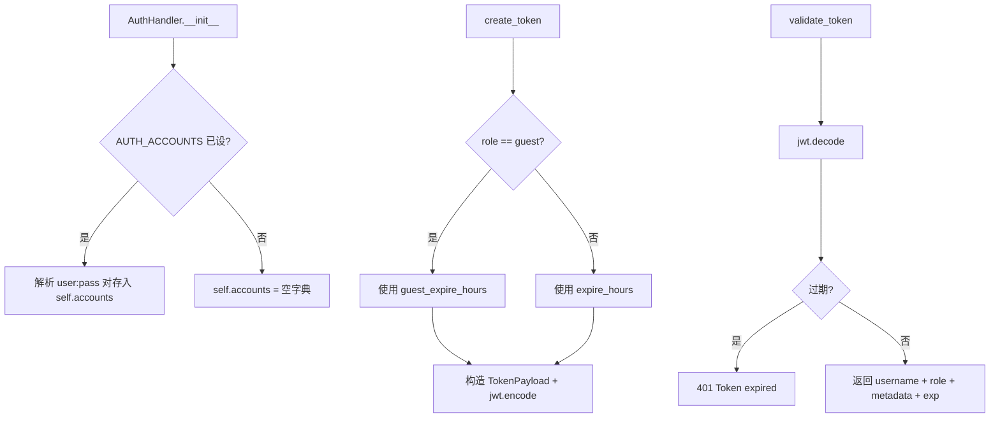
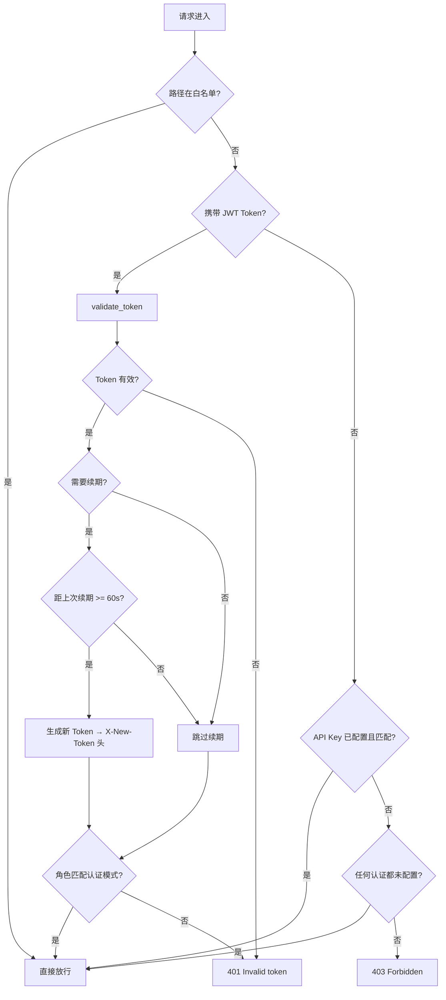

# PD-90.01 LightRAG — JWT 双模认证与滑动续期方案

> 文档编号：PD-90.01
> 来源：LightRAG `lightrag/api/auth.py` `lightrag/api/utils_api.py`
> GitHub：https://github.com/HKUDS/LightRAG.git
> 问题域：PD-90 认证授权 API Authentication & Authorization
> 状态：可复用方案

---

## 第 1 章 问题与动机

### 1.1 核心问题

RAG 系统对外暴露 HTTP API 时，需要解决三个层次的安全问题：

1. **身份认证**：谁在访问？合法用户 vs 匿名访客 vs 自动化脚本
2. **权限控制**：不同角色能做什么？管理员 vs 普通用户 vs 访客
3. **会话管理**：Token 何时过期？如何在不打断用户操作的前提下续期？

对于 LightRAG 这类知识库系统，还有一个特殊需求：**零配置可用**。很多用户只是本地部署试用，不想配置认证系统。因此认证必须是可选的，未配置时系统应自动降级为访客模式。

### 1.2 LightRAG 的解法概述

LightRAG 实现了一套三层认证体系，核心设计点：

1. **双模认证**：JWT Token + API Key 并行，通过 `get_combined_auth_dependency()` 统一注入（`lightrag/api/utils_api.py:80`）
2. **角色区分**：user/guest 两级角色，guest 自动签发、user 需登录获取（`lightrag/api/auth.py:36-71`）
3. **滑动窗口续期**：Token 剩余时间低于阈值时自动通过 `X-New-Token` 响应头续期，带 60 秒速率限制（`lightrag/api/utils_api.py:130-196`）
4. **路径白名单**：`/health`、`/api/*` 等路径免认证，通过前缀匹配实现（`lightrag/api/utils_api.py:61-74`）
5. **环境变量驱动**：所有认证参数通过 `AUTH_ACCOUNTS`、`TOKEN_SECRET` 等环境变量配置（`lightrag/api/config.py:395-404`）

### 1.3 设计思想

| 设计原则 | 具体实现 | 理由 | 替代方案 |
|----------|----------|------|----------|
| 零配置降级 | 未设 AUTH_ACCOUNTS 时自动签发 guest token | 降低试用门槛，本地开发无需配置 | 强制配置（用户体验差） |
| 双通道认证 | JWT + API Key 并行验证 | JWT 适合 WebUI 交互，API Key 适合脚本调用 | 仅 JWT（脚本不友好） |
| 透明续期 | X-New-Token 响应头 + 客户端无感知 | 避免用户操作中断，长会话不掉线 | Refresh Token（需额外端点） |
| 速率限制 | 内存字典 + 60 秒最小间隔 | 防止高频轮询端点产生大量无用 Token | 无限制（Token 泛滥） |
| 路径白名单 | 前缀匹配 + 精确匹配混合 | 健康检查和 Ollama 兼容 API 无需认证 | 全部需认证（监控不便） |

---

## 第 2 章 源码实现分析

### 2.1 架构概览

LightRAG 的认证系统由三个文件协作完成，形成清晰的分层架构：

```
┌─────────────────────────────────────────────────────────┐
│                    FastAPI Application                    │
│  lightrag_server.py                                      │
│  ┌─────────┐  ┌──────────┐  ┌──────────┐  ┌──────────┐ │
│  │ /login  │  │ /health  │  │ /auth-   │  │ Routers  │ │
│  │         │  │          │  │  status  │  │ (all)    │ │
│  └────┬────┘  └────┬─────┘  └────┬─────┘  └────┬─────┘ │
│       │            │             │              │        │
│  ┌────▼────────────▼─────────────▼──────────────▼─────┐ │
│  │         combined_auth_dependency (utils_api.py)     │ │
│  │  ┌──────────┐ ┌──────────┐ ┌───────────────────┐   │ │
│  │  │ Whitelist│→│ JWT Auth │→│ API Key Auth      │   │ │
│  │  │ Check    │ │ + Renew  │ │                   │   │ │
│  │  └──────────┘ └────┬─────┘ └───────────────────┘   │ │
│  └─────────────────────┼──────────────────────────────┘ │
│                        │                                 │
│  ┌─────────────────────▼──────────────────────────────┐ │
│  │              AuthHandler (auth.py)                  │ │
│  │  create_token() / validate_token()                  │ │
│  │  PyJWT + HS256 + Pydantic TokenPayload              │ │
│  └─────────────────────────────────────────────────────┘ │
│                        │                                 │
│  ┌─────────────────────▼──────────────────────────────┐ │
│  │              config.py (环境变量)                    │ │
│  │  AUTH_ACCOUNTS / TOKEN_SECRET / TOKEN_EXPIRE_HOURS  │ │
│  │  TOKEN_AUTO_RENEW / TOKEN_RENEW_THRESHOLD           │ │
│  └─────────────────────────────────────────────────────┘ │
└─────────────────────────────────────────────────────────┘
```

### 2.2 核心实现

#### 2.2.1 AuthHandler — JWT Token 生命周期管理



对应源码 `lightrag/api/auth.py:23-106`：

```python
class AuthHandler:
    def __init__(self):
        self.secret = global_args.token_secret
        self.algorithm = global_args.jwt_algorithm
        self.expire_hours = global_args.token_expire_hours
        self.guest_expire_hours = global_args.guest_token_expire_hours
        self.accounts = {}
        auth_accounts = global_args.auth_accounts
        if auth_accounts:
            for account in auth_accounts.split(","):
                username, password = account.split(":", 1)
                self.accounts[username] = password

    def create_token(
        self, username: str, role: str = "user",
        custom_expire_hours: int = None, metadata: dict = None,
    ) -> str:
        if custom_expire_hours is None:
            if role == "guest":
                expire_hours = self.guest_expire_hours
            else:
                expire_hours = self.expire_hours
        else:
            expire_hours = custom_expire_hours
        expire = datetime.utcnow() + timedelta(hours=expire_hours)
        payload = TokenPayload(
            sub=username, exp=expire, role=role, metadata=metadata or {}
        )
        return jwt.encode(payload.dict(), self.secret, algorithm=self.algorithm)

    def validate_token(self, token: str) -> dict:
        try:
            payload = jwt.decode(token, self.secret, algorithms=[self.algorithm])
            expire_time = datetime.utcfromtimestamp(payload["exp"])
            if datetime.utcnow() > expire_time:
                raise HTTPException(status_code=401, detail="Token expired")
            return {
                "username": payload["sub"],
                "role": payload.get("role", "user"),
                "metadata": payload.get("metadata", {}),
                "exp": expire_time,
            }
        except jwt.PyJWTError:
            raise HTTPException(status_code=401, detail="Invalid token")
```

#### 2.2.2 combined_auth_dependency — 三层认证决策链



对应源码 `lightrag/api/utils_api.py:109-262`：

```python
async def combined_dependency(
    request: Request,
    response: Response,
    token: str = Security(oauth2_scheme),
    api_key_header_value: Optional[str] = None
    if api_key_header is None
    else Security(api_key_header),
):
    # 1. 白名单检查
    path = request.url.path
    for pattern, is_prefix in whitelist_patterns:
        if (is_prefix and path.startswith(pattern)) or (
            not is_prefix and path == pattern
        ):
            return

    # 2. JWT Token 验证 + 自动续期
    if token:
        token_info = auth_handler.validate_token(token)
        if global_args.token_auto_renew:
            skip_renewal = any(
                path == skip_path or path.startswith(skip_path + "/")
                for skip_path in _TOKEN_RENEWAL_SKIP_PATHS
            )
            if not skip_renewal:
                expire_time = token_info.get("exp")
                remaining_seconds = (expire_time - datetime.utcnow()).total_seconds()
                role = token_info.get("role", "user")
                total_hours = (auth_handler.guest_expire_hours
                    if role == "guest" else auth_handler.expire_hours)
                total_seconds = total_hours * 3600
                if remaining_seconds < total_seconds * global_args.token_renew_threshold:
                    username = token_info["username"]
                    current_time = time.time()
                    last_renewal = _token_renewal_cache.get(username, 0)
                    if (current_time - last_renewal) >= _RENEWAL_MIN_INTERVAL:
                        new_token = auth_handler.create_token(
                            username=username, role=role,
                            metadata=token_info.get("metadata", {}),
                        )
                        response.headers["X-New-Token"] = new_token
                        _token_renewal_cache[username] = current_time

    # 3. 无认证配置时放行
    if not auth_configured and not api_key_configured:
        return

    # 4. API Key 验证
    if api_key_configured and api_key_header_value and api_key_header_value == api_key:
        return

    raise HTTPException(status_code=403, detail="API Key required or login required.")
```

### 2.3 实现细节

#### Token 续期速率限制

`utils_api.py:28-29` 定义了内存级速率限制：

```python
_token_renewal_cache: dict[str, float] = {}
_RENEWAL_MIN_INTERVAL = 60  # 同一用户最少 60 秒间隔
```

这防止了 `/documents/paginated` 等高频轮询端点（2-30 秒间隔）产生大量无用 Token。同时 `_TOKEN_RENEWAL_SKIP_PATHS`（`utils_api.py:36-40`）直接排除了健康检查和状态轮询路径。

#### CORS 配合 Token 续期

`lightrag_server.py:454-457` 中 CORS 中间件显式暴露了 `X-New-Token` 头：

```python
app.add_middleware(
    CORSMiddleware,
    expose_headers=["X-New-Token"],  # 跨域请求可读取续期 Token
)
```

#### 环境变量配置体系

`config.py:395-404` 定义了完整的认证配置：

| 环境变量 | 默认值 | 说明 |
|----------|--------|------|
| `AUTH_ACCOUNTS` | `""` | 账户列表，格式 `user1:pass1,user2:pass2` |
| `TOKEN_SECRET` | `"lightrag-jwt-default-secret"` | JWT 签名密钥 |
| `TOKEN_EXPIRE_HOURS` | `48` | 用户 Token 过期时间（小时） |
| `GUEST_TOKEN_EXPIRE_HOURS` | `24` | 访客 Token 过期时间（小时） |
| `JWT_ALGORITHM` | `"HS256"` | JWT 签名算法 |
| `TOKEN_AUTO_RENEW` | `True` | 是否启用自动续期 |
| `TOKEN_RENEW_THRESHOLD` | `0.5` | 剩余时间比例阈值（50%时触发续期） |
| `WHITELIST_PATHS` | `"/health,/api/*"` | 免认证路径白名单 |

---

## 第 3 章 迁移指南

### 3.1 迁移清单

#### 阶段一：基础 JWT 认证（1 个文件）

- [ ] 创建 `auth.py`，实现 `AuthHandler` 类（create_token / validate_token）
- [ ] 安装依赖：`pip install PyJWT pydantic`
- [ ] 定义 `TokenPayload` Pydantic 模型（sub, exp, role, metadata）
- [ ] 配置环境变量：`TOKEN_SECRET`、`AUTH_ACCOUNTS`

#### 阶段二：FastAPI 依赖注入（1 个文件）

- [ ] 创建 `auth_dependency.py`，实现 `get_combined_auth_dependency()`
- [ ] 配置 `OAuth2PasswordBearer(tokenUrl="login")`
- [ ] 在所有 Router 中注入 `dependencies=[Depends(combined_auth)]`

#### 阶段三：Token 自动续期（增强）

- [ ] 在 `combined_dependency` 中添加续期逻辑
- [ ] 配置 CORS `expose_headers=["X-New-Token"]`
- [ ] 前端拦截 `X-New-Token` 响应头并更新本地存储
- [ ] 添加速率限制（内存字典 + 最小间隔）

#### 阶段四：路径白名单（增强）

- [ ] 定义 `WHITELIST_PATHS` 环境变量
- [ ] 实现前缀匹配 + 精确匹配混合模式

### 3.2 适配代码模板

以下是可直接复用的最小化认证模块：

```python
"""auth_module.py — 可移植的 JWT 双模认证模块"""
import time
from datetime import datetime, timedelta
from typing import Optional

import jwt
from fastapi import HTTPException, Request, Response, Security, status
from fastapi.security import APIKeyHeader, OAuth2PasswordBearer
from pydantic import BaseModel


class TokenPayload(BaseModel):
    sub: str
    exp: datetime
    role: str = "user"
    metadata: dict = {}


class AuthHandler:
    def __init__(
        self,
        secret: str = "change-me-in-production",
        algorithm: str = "HS256",
        expire_hours: float = 48,
        guest_expire_hours: float = 24,
        accounts: dict[str, str] | None = None,
    ):
        self.secret = secret
        self.algorithm = algorithm
        self.expire_hours = expire_hours
        self.guest_expire_hours = guest_expire_hours
        self.accounts = accounts or {}

    def create_token(self, username: str, role: str = "user", metadata: dict = None) -> str:
        expire_hours = self.guest_expire_hours if role == "guest" else self.expire_hours
        expire = datetime.utcnow() + timedelta(hours=expire_hours)
        payload = TokenPayload(sub=username, exp=expire, role=role, metadata=metadata or {})
        return jwt.encode(payload.dict(), self.secret, algorithm=self.algorithm)

    def validate_token(self, token: str) -> dict:
        try:
            payload = jwt.decode(token, self.secret, algorithms=[self.algorithm])
            expire_time = datetime.utcfromtimestamp(payload["exp"])
            if datetime.utcnow() > expire_time:
                raise HTTPException(status_code=401, detail="Token expired")
            return {
                "username": payload["sub"],
                "role": payload.get("role", "user"),
                "metadata": payload.get("metadata", {}),
                "exp": expire_time,
            }
        except jwt.PyJWTError:
            raise HTTPException(status_code=401, detail="Invalid token")


# --- Token 续期速率限制 ---
_renewal_cache: dict[str, float] = {}
_RENEWAL_MIN_INTERVAL = 60


def create_auth_dependency(
    auth_handler: AuthHandler,
    api_key: Optional[str] = None,
    whitelist_paths: list[str] = None,
    auto_renew: bool = True,
    renew_threshold: float = 0.5,
    renewal_skip_paths: list[str] = None,
):
    """创建 FastAPI 认证依赖，支持 JWT + API Key 双模"""
    oauth2_scheme = OAuth2PasswordBearer(tokenUrl="login", auto_error=False)
    api_key_header = APIKeyHeader(name="X-API-Key", auto_error=False) if api_key else None
    whitelist = whitelist_paths or ["/health"]
    skip_paths = renewal_skip_paths or []
    auth_configured = bool(auth_handler.accounts)

    async def dependency(
        request: Request,
        response: Response,
        token: str = Security(oauth2_scheme),
        key_value: Optional[str] = None if not api_key_header else Security(api_key_header),
    ):
        path = request.url.path
        # 1. 白名单
        if any(path == p or (p.endswith("/*") and path.startswith(p[:-2])) for p in whitelist):
            return
        # 2. JWT 验证 + 续期
        if token:
            info = auth_handler.validate_token(token)
            if auto_renew and path not in skip_paths:
                exp = info["exp"]
                remaining = (exp - datetime.utcnow()).total_seconds()
                total = (auth_handler.guest_expire_hours if info["role"] == "guest"
                         else auth_handler.expire_hours) * 3600
                if remaining < total * renew_threshold:
                    user = info["username"]
                    now = time.time()
                    if (now - _renewal_cache.get(user, 0)) >= _RENEWAL_MIN_INTERVAL:
                        response.headers["X-New-Token"] = auth_handler.create_token(
                            username=user, role=info["role"], metadata=info.get("metadata", {})
                        )
                        _renewal_cache[user] = now
            if not auth_configured and info.get("role") == "guest":
                return
            if auth_configured and info.get("role") != "guest":
                return
            raise HTTPException(status_code=401, detail="Invalid token")
        # 3. 无认证配置
        if not auth_configured and not api_key:
            return
        # 4. API Key
        if api_key and key_value == api_key:
            return
        raise HTTPException(status_code=403, detail="Authentication required")

    return dependency
```

### 3.3 适用场景

| 场景 | 适用度 | 说明 |
|------|--------|------|
| FastAPI RAG/AI 服务 | ⭐⭐⭐ | 完美匹配，直接复用 |
| 内部工具 API | ⭐⭐⭐ | 零配置降级特性非常适合内部工具 |
| 多租户 SaaS | ⭐⭐ | 需扩展角色体系（当前仅 user/guest） |
| 高安全场景 | ⭐ | 缺少 RBAC、审计日志、Token 黑名单 |
| 微服务间调用 | ⭐⭐ | API Key 模式适合，但缺少服务身份验证 |

---

## 第 4 章 测试用例

```python
"""test_auth.py — 基于 LightRAG AuthHandler 真实签名的测试"""
import time
from datetime import datetime, timedelta
from unittest.mock import MagicMock, patch

import jwt
import pytest
from fastapi import HTTPException


# --- 模拟 global_args ---
class MockArgs:
    token_secret = "test-secret-key"
    jwt_algorithm = "HS256"
    token_expire_hours = 48
    guest_token_expire_hours = 24
    auth_accounts = "admin:password123,viewer:view456"
    token_auto_renew = True
    token_renew_threshold = 0.5


@pytest.fixture
def auth_handler():
    """构造与 LightRAG AuthHandler 等价的测试实例"""
    from auth_module import AuthHandler  # 使用迁移模板
    accounts = {}
    for account in MockArgs.auth_accounts.split(","):
        username, password = account.split(":", 1)
        accounts[username] = password
    return AuthHandler(
        secret=MockArgs.token_secret,
        algorithm=MockArgs.jwt_algorithm,
        expire_hours=MockArgs.token_expire_hours,
        guest_expire_hours=MockArgs.guest_token_expire_hours,
        accounts=accounts,
    )


class TestTokenCreation:
    """测试 Token 创建（对应 auth.py:36-71）"""

    def test_user_token_has_correct_role(self, auth_handler):
        token = auth_handler.create_token(username="admin", role="user")
        payload = jwt.decode(token, "test-secret-key", algorithms=["HS256"])
        assert payload["sub"] == "admin"
        assert payload["role"] == "user"

    def test_guest_token_shorter_expiry(self, auth_handler):
        user_token = auth_handler.create_token(username="u", role="user")
        guest_token = auth_handler.create_token(username="g", role="guest")
        user_exp = jwt.decode(user_token, "test-secret-key", algorithms=["HS256"])["exp"]
        guest_exp = jwt.decode(guest_token, "test-secret-key", algorithms=["HS256"])["exp"]
        # guest 24h < user 48h
        assert guest_exp < user_exp

    def test_metadata_preserved_in_token(self, auth_handler):
        meta = {"auth_mode": "enabled", "source": "webui"}
        token = auth_handler.create_token(username="admin", role="user", metadata=meta)
        payload = jwt.decode(token, "test-secret-key", algorithms=["HS256"])
        assert payload["metadata"] == meta


class TestTokenValidation:
    """测试 Token 验证（对应 auth.py:73-106）"""

    def test_valid_token_returns_user_info(self, auth_handler):
        token = auth_handler.create_token(username="admin", role="user")
        info = auth_handler.validate_token(token)
        assert info["username"] == "admin"
        assert info["role"] == "user"
        assert isinstance(info["exp"], datetime)

    def test_expired_token_raises_401(self, auth_handler):
        # 创建已过期的 Token
        expire = datetime.utcnow() - timedelta(hours=1)
        payload = {"sub": "admin", "exp": expire, "role": "user", "metadata": {}}
        token = jwt.encode(payload, "test-secret-key", algorithm="HS256")
        with pytest.raises(HTTPException) as exc_info:
            auth_handler.validate_token(token)
        assert exc_info.value.status_code == 401

    def test_tampered_token_raises_401(self, auth_handler):
        token = auth_handler.create_token(username="admin")
        with pytest.raises(HTTPException) as exc_info:
            # 用错误密钥解码
            auth_handler_bad = type(auth_handler)(
                secret="wrong-secret", accounts=auth_handler.accounts
            )
            auth_handler_bad.validate_token(token)
        assert exc_info.value.status_code == 401


class TestTokenRenewal:
    """测试 Token 续期逻辑（对应 utils_api.py:130-196）"""

    def test_renewal_triggered_when_below_threshold(self, auth_handler):
        """Token 剩余时间 < 50% 时应触发续期"""
        # 创建一个即将过期的 Token（剩余 10 小时，总共 48 小时，< 50%）
        expire = datetime.utcnow() + timedelta(hours=10)
        payload = {"sub": "admin", "exp": expire, "role": "user", "metadata": {}}
        token = jwt.encode(payload, "test-secret-key", algorithm="HS256")
        info = auth_handler.validate_token(token)
        remaining = (info["exp"] - datetime.utcnow()).total_seconds()
        total = auth_handler.expire_hours * 3600
        assert remaining < total * 0.5  # 确认低于阈值

    def test_rate_limit_prevents_rapid_renewal(self):
        """60 秒内同一用户不应重复续期"""
        from auth_module import _renewal_cache, _RENEWAL_MIN_INTERVAL
        _renewal_cache["admin"] = time.time()
        elapsed = time.time() - _renewal_cache["admin"]
        assert elapsed < _RENEWAL_MIN_INTERVAL


class TestAccountParsing:
    """测试账户解析（对应 auth.py:30-34）"""

    def test_multiple_accounts_parsed(self, auth_handler):
        assert "admin" in auth_handler.accounts
        assert "viewer" in auth_handler.accounts
        assert auth_handler.accounts["admin"] == "password123"

    def test_password_with_colon(self):
        """密码中包含冒号时应正确解析（split(":", 1)）"""
        from auth_module import AuthHandler
        handler = AuthHandler(accounts={"user": "pass:with:colons"})
        assert handler.accounts["user"] == "pass:with:colons"
```

---

## 第 5 章 跨域关联

| 关联域 | 关系类型 | 说明 |
|--------|----------|------|
| PD-03 容错与重试 | 协同 | Token 续期失败时的降级处理（`utils_api.py:198-200`）：续期异常不影响正常请求，仅记录日志 |
| PD-10 中间件管道 | 依赖 | 认证作为 FastAPI Depends 注入，本质是中间件管道的一环；CORS 中间件需配合暴露 `X-New-Token` 头 |
| PD-76 认证授权 | 同域扩展 | PD-76 描述的是 JWT 双模认证的基础架构，PD-90 在此基础上增加了滑动续期、速率限制、路径白名单等生产级特性 |
| PD-81 多租户隔离 | 协同 | LightRAG 的 workspace 机制（`lightrag_server.py:462-482`）通过 `LIGHTRAG-WORKSPACE` 请求头实现数据隔离，与认证系统正交但互补 |

---

## 第 6 章 来源文件索引

| 文件 | 行范围 | 关键实现 |
|------|--------|----------|
| `lightrag/api/auth.py` | L1-L109 | AuthHandler 完整实现：TokenPayload 模型、create_token、validate_token |
| `lightrag/api/auth.py` | L16-L20 | TokenPayload Pydantic 模型定义（sub, exp, role, metadata） |
| `lightrag/api/auth.py` | L23-L34 | AuthHandler.__init__：从 AUTH_ACCOUNTS 环境变量解析账户 |
| `lightrag/api/auth.py` | L36-L71 | create_token：角色区分过期时间、JWT 编码 |
| `lightrag/api/auth.py` | L73-L106 | validate_token：JWT 解码、过期检查、payload 提取 |
| `lightrag/api/utils_api.py` | L25-L40 | Token 续期速率限制配置和路径排除列表 |
| `lightrag/api/utils_api.py` | L61-L77 | 白名单路径解析：前缀匹配 + 精确匹配 |
| `lightrag/api/utils_api.py` | L80-L262 | get_combined_auth_dependency：三层认证决策链完整实现 |
| `lightrag/api/utils_api.py` | L130-L196 | Token 自动续期逻辑：阈值判断 + 速率限制 + X-New-Token 头 |
| `lightrag/api/config.py` | L393-L404 | 认证相关环境变量定义（8 个参数） |
| `lightrag/api/lightrag_server.py` | L65-L66 | auth_handler 单例导入和 auth_configured 全局标志 |
| `lightrag/api/lightrag_server.py` | L81 | auth_configured = bool(auth_handler.accounts) |
| `lightrag/api/lightrag_server.py` | L454-L457 | CORS 中间件配置，expose_headers 包含 X-New-Token |
| `lightrag/api/lightrag_server.py` | L460 | combined_auth = get_combined_auth_dependency(api_key) |
| `lightrag/api/lightrag_server.py` | L1132-L1160 | /auth-status 端点：返回认证状态和访客 Token |
| `lightrag/api/lightrag_server.py` | L1162-L1195 | /login 端点：用户名密码验证 + Token 签发 |

---

## 第 7 章 横向对比维度

```json comparison_data
{
  "project": "LightRAG",
  "dimensions": {
    "认证方式": "JWT + API Key 双通道，OAuth2PasswordBearer + APIKeyHeader 并行",
    "角色模型": "user/guest 二级角色，未配置时自动降级为 guest",
    "Token 续期": "滑动窗口续期，X-New-Token 响应头 + 60s 速率限制",
    "配置方式": "全环境变量驱动，8 个参数，零配置可用",
    "端点保护": "FastAPI Depends 注入 + 路径白名单（前缀/精确混合匹配）",
    "降级策略": "未配置认证时自动签发 guest token，所有端点可访问"
  }
}
```

### 域元数据补充

```json domain_metadata
{
  "solution_summary": "LightRAG 用 PyJWT+FastAPI Depends 实现双通道认证（JWT+API Key），支持滑动窗口 Token 续期（X-New-Token 头+60s 速率限制）和零配置 guest 降级",
  "description": "API 服务的身份验证、会话管理与端点访问控制",
  "sub_problems": [
    "零配置降级与访客自动签发",
    "Token 续期速率限制与高频轮询路径排除"
  ],
  "best_practices": [
    "滑动窗口续期通过响应头透传，客户端无感知",
    "CORS expose_headers 配合 Token 续期实现跨域续期",
    "路径白名单支持前缀匹配和精确匹配混合模式"
  ]
}
```
