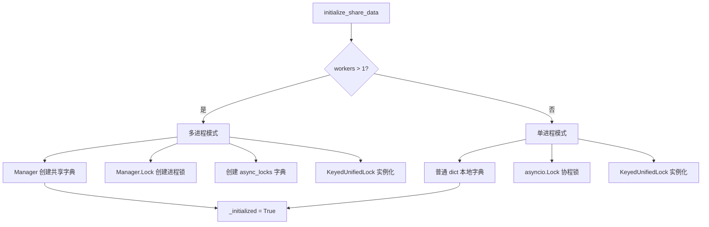
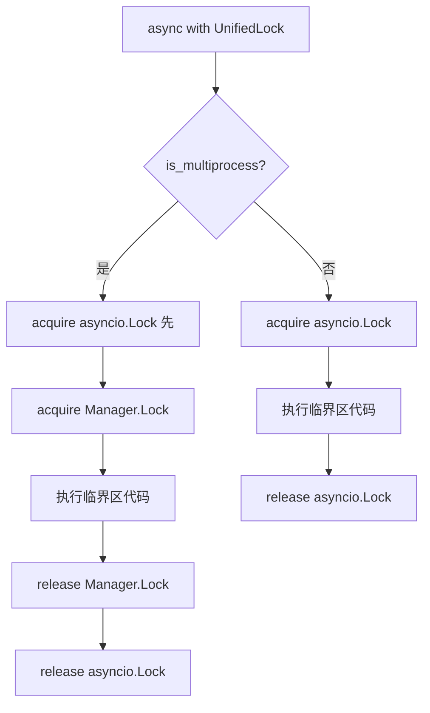
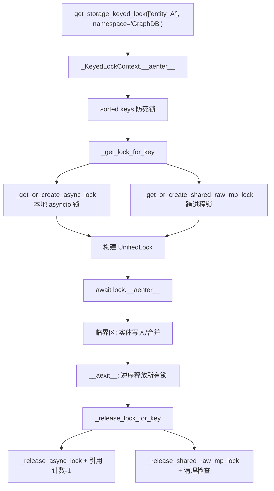

# PD-91.01 LightRAG — Manager 共享字典与 KeyedUnifiedLock 细粒度锁

> 文档编号：PD-91.01
> 来源：LightRAG `lightrag/kg/shared_storage.py`
> GitHub：https://github.com/HKUDS/LightRAG.git
> 问题域：PD-91 多进程数据共享 Multiprocess Data Sharing
> 状态：可复用方案

---

## 第 1 章 问题与动机

### 1.1 核心问题

当 RAG 系统通过 Gunicorn 多 worker 部署时，每个 worker 是独立进程，拥有独立的内存空间。多个 worker 同时向知识图谱（KG）写入实体和关系时，会产生以下问题：

1. **数据竞争**：两个 worker 同时修改同一实体的描述或属性，导致数据丢失或不一致
2. **重复写入**：多个 worker 同时检测到同一实体不存在并尝试创建，产生重复记录
3. **锁粒度问题**：全局锁会严重降低并发性能，但无锁又无法保证一致性
4. **资源泄漏**：动态创建的锁如果不清理，会随着实体数量增长导致内存泄漏
5. **异步兼容**：Python 的 `multiprocessing.Lock` 是同步的，但 FastAPI/Uvicorn 运行在 asyncio 事件循环中，直接 acquire 会阻塞整个事件循环

### 1.2 LightRAG 的解法概述

LightRAG 通过 `shared_storage.py` 构建了一套完整的多进程数据共享方案：

1. **双模初始化**：`initialize_share_data(workers)` 根据 worker 数量自动选择单进程（asyncio.Lock + dict）或多进程（Manager.Lock + Manager.dict）模式 (`shared_storage.py:1176-1264`)
2. **三层锁体系**：internal_lock（全局互斥）→ data_init_lock（初始化互斥）→ KeyedUnifiedLock（实体级细粒度锁），从粗到细覆盖不同场景 (`shared_storage.py:1071-1103`)
3. **UnifiedLock 双锁协议**：在多进程模式下，每次加锁同时获取 asyncio.Lock（防止事件循环阻塞）和 Manager.Lock（跨进程互斥），解决了 asyncio + multiprocessing 的兼容问题 (`shared_storage.py:137-317`)
4. **引用计数 + 延迟清理**：锁释放时不立即删除，而是记录到 cleanup_data 并在引用计数归零后等待 300 秒超时，超过 500 个待清理锁时批量回收 (`shared_storage.py:324-442`)
5. **Gunicorn preload 模式**：在 master 进程 fork worker 之前调用 `initialize_share_data()`，所有 worker 继承同一个 Manager 实例 (`run_with_gunicorn.py:272`)

### 1.3 设计思想

| 设计原则 | 具体实现 | 理由 | 替代方案 |
|----------|----------|------|----------|
| 单/多进程透明 | `initialize_share_data(workers)` 自动切换 asyncio.Lock/Manager.Lock | 开发者无需关心部署模式，同一套代码适配单机和多 worker | 手动 if/else 判断进程模式 |
| 实体级细粒度锁 | `KeyedUnifiedLock` 按 `namespace:key` 动态创建锁 | 不同实体的写入互不阻塞，最大化并发 | 全局锁（简单但性能差） |
| 双锁协议 | UnifiedLock 同时持有 asyncio.Lock + Manager.Lock | Manager.Lock.acquire() 是同步阻塞的，会冻结事件循环；先获取 asyncio.Lock 让其他协程有机会运行 | 用 run_in_executor 包装（额外线程开销） |
| 延迟清理 | 引用计数归零后 300s 超时 + 500 阈值批量清理 | 避免频繁创建/销毁锁的开销，热点实体的锁可复用 | 立即删除（频繁 Manager RPC 开销大） |
| 排序防死锁 | `_KeyedLockContext.__init__` 中 `sorted(keys)` | 多 key 加锁时固定顺序，避免 ABBA 死锁 | 尝试加锁 + 超时回退（复杂且不可靠） |

---

## 第 2 章 源码实现分析

### 2.1 架构概览

LightRAG 的多进程数据共享架构分为三层：初始化层、锁管理层、数据访问层。

```
┌─────────────────────────────────────────────────────────────────┐
│                    Gunicorn Master Process                       │
│  run_with_gunicorn.py:272                                       │
│  initialize_share_data(workers_count)                           │
│    → Manager() 创建共享字典/锁                                    │
│    → preload_app=True 确保 fork 前完成                           │
└──────────────────────┬──────────────────────────────────────────┘
                       │ fork
        ┌──────────────┼──────────────┐
        ▼              ▼              ▼
┌──────────────┐┌──────────────┐┌──────────────┐
│  Worker 1    ││  Worker 2    ││  Worker N    │
│  (Uvicorn)   ││  (Uvicorn)   ││  (Uvicorn)   │
│              ││              ││              │
│ asyncio loop ││ asyncio loop ││ asyncio loop │
│   ↓          ││   ↓          ││   ↓          │
│ UnifiedLock  ││ UnifiedLock  ││ UnifiedLock  │
│ (async+mp)   ││ (async+mp)   ││ (async+mp)   │
└──────┬───────┘└──────┬───────┘└──────┬───────┘
       │               │               │
       └───────────────┼───────────────┘
                       ▼
         ┌─────────────────────────┐
         │  Manager Server Process  │
         │  _lock_registry (dict)   │
         │  _lock_registry_count    │
         │  _lock_cleanup_data      │
         │  _shared_dicts           │
         │  _registry_guard (RLock) │
         └─────────────────────────┘
```

### 2.2 核心实现

#### 2.2.1 双模初始化



对应源码 `lightrag/kg/shared_storage.py:1176-1264`：

```python
def initialize_share_data(workers: int = 1):
    global _manager, _workers, _is_multiprocess, _lock_registry, ...

    if _initialized:
        return

    _workers = workers

    if workers > 1:
        _is_multiprocess = True
        _manager = Manager()
        _lock_registry = _manager.dict()        # 跨进程锁注册表
        _lock_registry_count = _manager.dict()   # 锁引用计数
        _lock_cleanup_data = _manager.dict()     # 待清理锁时间戳
        _registry_guard = _manager.RLock()       # 注册表保护锁
        _internal_lock = _manager.Lock()         # 全局互斥锁
        _data_init_lock = _manager.Lock()        # 数据初始化锁
        _shared_dicts = _manager.dict()          # 共享命名空间字典
        _init_flags = _manager.dict()
        _update_flags = _manager.dict()
        _storage_keyed_lock = KeyedUnifiedLock()
        _async_locks = {                         # 每个 worker 本地的 asyncio 锁
            "internal_lock": asyncio.Lock(),
            "data_init_lock": asyncio.Lock(),
        }
    else:
        _is_multiprocess = False
        _internal_lock = asyncio.Lock()
        _data_init_lock = asyncio.Lock()
        _shared_dicts = {}
        _storage_keyed_lock = KeyedUnifiedLock()

    _initialized = True
```

#### 2.2.2 UnifiedLock 双锁协议



对应源码 `lightrag/kg/shared_storage.py:155-194`：

```python
class UnifiedLock(Generic[T]):
    async def __aenter__(self) -> "UnifiedLock[T]":
        try:
            # 多进程模式：先获取 asyncio 锁防止事件循环阻塞
            if not self._is_async and self._async_lock is not None:
                await self._async_lock.acquire()

            # 获取主锁（asyncio.Lock 或 Manager.Lock）
            if self._is_async:
                await self._lock.acquire()
            else:
                self._lock.acquire()  # Manager.Lock 是同步的
            return self
        except Exception as e:
            # 失败时释放已获取的 asyncio 锁
            if not self._is_async and self._async_lock is not None and self._async_lock.locked():
                self._async_lock.release()
            raise
```

#### 2.2.3 KeyedUnifiedLock 实体级锁管理



对应源码 `lightrag/kg/shared_storage.py:445-527`：

```python
def _get_or_create_shared_raw_mp_lock(factory_name: str, key: str):
    """跨进程锁的获取/创建，受 _registry_guard 保护"""
    if not _is_multiprocess:
        return None

    with _registry_guard:  # RLock 保护注册表操作
        combined_key = _get_combined_key(factory_name, key)
        raw = _lock_registry.get(combined_key)
        count = _lock_registry_count.get(combined_key)
        if raw is None:
            raw = _manager.Lock()                    # 动态创建新锁
            _lock_registry[combined_key] = raw
            count = 0
        else:
            if count == 0 and combined_key in _lock_cleanup_data:
                _lock_cleanup_data.pop(combined_key)  # 复用待清理的锁
        count += 1
        _lock_registry_count[combined_key] = count
        return raw

def _release_shared_raw_mp_lock(factory_name: str, key: str):
    """释放锁并触发清理检查"""
    with _registry_guard:
        combined_key = _get_combined_key(factory_name, key)
        count = _lock_registry_count.get(combined_key)
        count -= 1
        _lock_registry_count[combined_key] = count
        if count == 0:
            _lock_cleanup_data[combined_key] = time.time()  # 标记待清理
        # 触发批量清理（阈值 500 + 超时 300s + 最小间隔 30s）
        _perform_lock_cleanup(...)
```

### 2.3 实现细节

**实体级锁的实际使用场景** — 在 `operate.py` 中，每个实体的合并操作都通过 keyed lock 保护：

```python
# lightrag/operate.py:2505-2509
async def _locked_process_entity_name(entity_name, entities):
    async with semaphore:
        workspace = global_config.get("workspace", "")
        namespace = f"{workspace}:GraphDB" if workspace else "GraphDB"
        async with get_storage_keyed_lock(
            [entity_name], namespace=namespace, enable_logging=False
        ):
            entity_data = await _merge_nodes_then_upsert(...)
```

**关系锁的排序策略** — 关系涉及两个实体，通过排序确保锁顺序一致：

```python
# lightrag/operate.py:2608-2614
sorted_edge_key = sorted([edge_key[0], edge_key[1]])
async with get_storage_keyed_lock(
    sorted_edge_key, namespace=namespace, enable_logging=False
):
    edge_data = await _merge_edges_then_upsert(...)
```

**NamespaceLock 的 ContextVar 隔离** — 使用 `contextvars.ContextVar` 确保同一个 NamespaceLock 实例在并发协程中互不干扰 (`shared_storage.py:1486-1553`)：

```python
class NamespaceLock:
    def __init__(self, namespace, workspace=None, enable_logging=False):
        self._ctx_var: ContextVar[Optional[_KeyedLockContext]] = ContextVar(
            "lock_ctx", default=None
        )

    async def __aenter__(self):
        if self._ctx_var.get() is not None:
            raise RuntimeError("NamespaceLock already acquired in current coroutine context")
        ctx = get_storage_keyed_lock(["default_key"], namespace=final_namespace)
        result = await ctx.__aenter__()
        self._ctx_var.set(ctx)  # 存入当前协程的 ContextVar
        return result
```

**asyncio.shield 保护锁释放** — `_KeyedLockContext.__aexit__` 使用 `asyncio.shield` 确保即使协程被取消，锁也能正确释放 (`shared_storage.py:1051-1064`)。

**Gunicorn 生命周期集成** — `gunicorn_config.py:124-137` 在 `on_exit` 钩子中调用 `finalize_share_data()` 关闭 Manager 并释放所有共享资源。

---

## 第 3 章 迁移指南

### 3.1 迁移清单

**阶段 1：基础共享层**
- [ ] 创建 `shared_storage.py`，实现 `initialize_share_data(workers)` 双模初始化
- [ ] 实现 `UnifiedLock` 类，支持 `async with` 和 `with` 两种上下文管理器
- [ ] 在 Gunicorn/Uvicorn 启动脚本中，fork 前调用 `initialize_share_data(workers)`

**阶段 2：细粒度锁**
- [ ] 实现 `KeyedUnifiedLock`，支持按 `namespace:key` 动态创建锁
- [ ] 实现 `_KeyedLockContext`，支持多 key 排序加锁和异常回滚
- [ ] 在业务代码中用 `get_storage_keyed_lock([entity_name], namespace=...)` 替换全局锁

**阶段 3：清理与监控**
- [ ] 实现引用计数 + 延迟清理机制（`_perform_lock_cleanup`）
- [ ] 配置清理参数：`CLEANUP_KEYED_LOCKS_AFTER_SECONDS`、`CLEANUP_THRESHOLD`、`MIN_CLEANUP_INTERVAL_SECONDS`
- [ ] 实现 `cleanup_expired_locks()` 和 `get_lock_status()` 用于运维监控
- [ ] 在 Gunicorn `on_exit` 钩子中调用 `finalize_share_data()` 释放资源

### 3.2 适配代码模板

以下是一个可直接复用的最小化实现：

```python
"""multiprocess_shared.py — 多进程共享数据与细粒度锁"""
import os
import asyncio
import time
import multiprocessing as mp
from multiprocessing import Manager
from typing import Any, Dict, List, Optional, Union
from multiprocessing.synchronize import Lock as ProcessLock

# ── 全局状态 ──
_manager: Optional[mp.managers.SyncManager] = None
_is_multiprocess: bool = False
_initialized: bool = False
_shared_dicts: Optional[Dict[str, Any]] = None
_internal_lock: Optional[Union[ProcessLock, asyncio.Lock]] = None

# ── 锁注册表（多进程模式） ──
_lock_registry: Optional[Dict[str, ProcessLock]] = None
_lock_registry_count: Optional[Dict[str, int]] = None
_lock_cleanup_data: Optional[Dict[str, float]] = None
_registry_guard: Optional[mp.synchronize.RLock] = None

CLEANUP_TIMEOUT = 300  # 锁超时秒数
CLEANUP_THRESHOLD = 500  # 触发清理的待清理锁数量
MIN_CLEANUP_INTERVAL = 30  # 最小清理间隔秒数


def initialize(workers: int = 1):
    """双模初始化：单进程用 asyncio，多进程用 Manager"""
    global _manager, _is_multiprocess, _initialized
    global _shared_dicts, _internal_lock
    global _lock_registry, _lock_registry_count, _lock_cleanup_data, _registry_guard

    if _initialized:
        return

    if workers > 1:
        _is_multiprocess = True
        _manager = Manager()
        _shared_dicts = _manager.dict()
        _internal_lock = _manager.Lock()
        _lock_registry = _manager.dict()
        _lock_registry_count = _manager.dict()
        _lock_cleanup_data = _manager.dict()
        _registry_guard = _manager.RLock()
    else:
        _is_multiprocess = False
        _shared_dicts = {}
        _internal_lock = asyncio.Lock()

    _initialized = True


class UnifiedLock:
    """统一锁接口：自动适配 asyncio.Lock 和 Manager.Lock"""

    def __init__(self, lock, is_async: bool, async_lock: Optional[asyncio.Lock] = None):
        self._lock = lock
        self._is_async = is_async
        self._async_lock = async_lock

    async def __aenter__(self):
        if not self._is_async and self._async_lock:
            await self._async_lock.acquire()  # 先获取 asyncio 锁
        if self._is_async:
            await self._lock.acquire()
        else:
            self._lock.acquire()  # Manager.Lock 同步获取
        return self

    async def __aexit__(self, *args):
        if self._is_async:
            self._lock.release()
        else:
            self._lock.release()
        if not self._is_async and self._async_lock:
            self._async_lock.release()


class KeyedLock:
    """实体级细粒度锁管理器"""

    def __init__(self):
        self._async_locks: Dict[str, asyncio.Lock] = {}
        self._async_counts: Dict[str, int] = {}

    def __call__(self, namespace: str, keys: List[str]):
        return _KeyedContext(self, namespace, sorted(keys))  # 排序防死锁

    def _get_lock(self, ns: str, key: str) -> UnifiedLock:
        combined = f"{ns}:{key}"
        # 本地 asyncio 锁
        if combined not in self._async_locks:
            self._async_locks[combined] = asyncio.Lock()
            self._async_counts[combined] = 0
        self._async_counts[combined] += 1
        async_lock = self._async_locks[combined]

        # 跨进程锁
        if _is_multiprocess:
            with _registry_guard:
                raw = _lock_registry.get(combined)
                if raw is None:
                    raw = _manager.Lock()
                    _lock_registry[combined] = raw
                    _lock_registry_count[combined] = 0
                _lock_registry_count[combined] = _lock_registry_count.get(combined, 0) + 1
            return UnifiedLock(raw, is_async=False, async_lock=async_lock)
        else:
            return UnifiedLock(async_lock, is_async=True)

    def _release_lock(self, ns: str, key: str):
        combined = f"{ns}:{key}"
        self._async_counts[combined] -= 1
        if _is_multiprocess:
            with _registry_guard:
                count = _lock_registry_count.get(combined, 1) - 1
                _lock_registry_count[combined] = count
                if count == 0:
                    _lock_cleanup_data[combined] = time.time()


class _KeyedContext:
    def __init__(self, parent: KeyedLock, ns: str, keys: List[str]):
        self._parent, self._ns, self._keys = parent, ns, keys
        self._acquired: List[tuple] = []

    async def __aenter__(self):
        for key in self._keys:
            lock = self._parent._get_lock(self._ns, key)
            await lock.__aenter__()
            self._acquired.append((key, lock))
        return self

    async def __aexit__(self, *args):
        for key, lock in reversed(self._acquired):
            await lock.__aexit__(*args)
            self._parent._release_lock(self._ns, key)
        self._acquired.clear()


# ── 使用示例 ──
keyed_lock = KeyedLock()

async def merge_entity(entity_name: str, data: dict):
    """实体合并：通过 keyed lock 保证原子性"""
    async with keyed_lock("GraphDB", [entity_name]):
        existing = await load_entity(entity_name)
        merged = {**existing, **data}
        await save_entity(entity_name, merged)

async def merge_relation(src: str, tgt: str, data: dict):
    """关系合并：排序 key 防止死锁"""
    async with keyed_lock("GraphDB", sorted([src, tgt])):
        await save_relation(src, tgt, data)
```

### 3.3 适用场景

| 场景 | 适用度 | 说明 |
|------|--------|------|
| Gunicorn + Uvicorn 多 worker RAG 服务 | ⭐⭐⭐ | 完美匹配，LightRAG 的原生场景 |
| 多进程 KG 写入（实体/关系并发合并） | ⭐⭐⭐ | 实体级锁最大化并发，排序防死锁 |
| 单进程 FastAPI 服务 | ⭐⭐ | 自动降级为 asyncio.Lock，无额外开销 |
| 多进程批量数据导入 | ⭐⭐ | 可用但需注意 Manager 的 RPC 开销 |
| 分布式多机部署 | ⭐ | Manager 仅支持单机多进程，跨机需 Redis/etcd |

---

## 第 4 章 测试用例

```python
"""test_multiprocess_shared.py — 多进程共享数据测试"""
import asyncio
import pytest
import multiprocessing as mp
from unittest.mock import AsyncMock, patch


class TestInitialization:
    """测试双模初始化"""

    def test_single_process_mode(self):
        """单进程模式使用 asyncio.Lock"""
        from multiprocess_shared import initialize, _is_multiprocess, _internal_lock
        initialize(workers=1)
        assert not _is_multiprocess
        assert isinstance(_internal_lock, asyncio.Lock)

    def test_multi_process_mode(self):
        """多进程模式使用 Manager.Lock"""
        from multiprocess_shared import initialize, _is_multiprocess, _manager
        initialize(workers=4)
        assert _is_multiprocess
        assert _manager is not None

    def test_idempotent_initialization(self):
        """重复初始化不会覆盖"""
        from multiprocess_shared import initialize, _initialized
        initialize(workers=1)
        initialize(workers=4)  # 第二次调用应被忽略
        assert _initialized


class TestUnifiedLock:
    """测试统一锁接口"""

    @pytest.mark.asyncio
    async def test_async_lock_acquire_release(self):
        """asyncio 模式下正常加锁/释放"""
        lock = asyncio.Lock()
        ul = UnifiedLock(lock, is_async=True)
        async with ul:
            assert lock.locked()
        assert not lock.locked()

    @pytest.mark.asyncio
    async def test_dual_lock_protocol(self):
        """多进程模式下双锁协议：先 async 后 mp"""
        mp_lock = mp.Lock()
        async_lock = asyncio.Lock()
        ul = UnifiedLock(mp_lock, is_async=False, async_lock=async_lock)
        async with ul:
            assert async_lock.locked()
        assert not async_lock.locked()

    @pytest.mark.asyncio
    async def test_exception_releases_async_lock(self):
        """主锁获取失败时释放已获取的 asyncio 锁"""
        class FailingLock:
            def acquire(self): raise RuntimeError("lock failed")
            def release(self): pass

        async_lock = asyncio.Lock()
        ul = UnifiedLock(FailingLock(), is_async=False, async_lock=async_lock)
        with pytest.raises(RuntimeError):
            async with ul:
                pass
        assert not async_lock.locked()


class TestKeyedLock:
    """测试实体级细粒度锁"""

    @pytest.mark.asyncio
    async def test_sorted_keys_prevent_deadlock(self):
        """多 key 排序防止死锁"""
        kl = KeyedLock()
        # 无论传入顺序如何，内部都按字母序加锁
        async with kl("ns", ["B", "A"]):
            pass  # 不死锁即通过

    @pytest.mark.asyncio
    async def test_concurrent_different_entities(self):
        """不同实体可并发加锁"""
        kl = KeyedLock()
        results = []

        async def worker(entity: str, delay: float):
            async with kl("GraphDB", [entity]):
                await asyncio.sleep(delay)
                results.append(entity)

        await asyncio.gather(
            worker("entity_A", 0.1),
            worker("entity_B", 0.05),
        )
        # entity_B 先完成（delay 更短），证明不同实体不互相阻塞
        assert results == ["entity_B", "entity_A"]

    @pytest.mark.asyncio
    async def test_same_entity_serialized(self):
        """同一实体的操作被串行化"""
        kl = KeyedLock()
        order = []

        async def worker(tag: str, delay: float):
            async with kl("GraphDB", ["shared_entity"]):
                order.append(f"{tag}_start")
                await asyncio.sleep(delay)
                order.append(f"{tag}_end")

        await asyncio.gather(worker("A", 0.1), worker("B", 0.05))
        # 串行执行：A_start, A_end, B_start, B_end 或 B_start, B_end, A_start, A_end
        assert order[0].endswith("_start") and order[1].endswith("_end")


class TestCleanup:
    """测试锁清理机制"""

    @pytest.mark.asyncio
    async def test_reference_count_tracks_usage(self):
        """引用计数正确追踪锁使用"""
        kl = KeyedLock()
        async with kl("ns", ["key1"]):
            assert kl._async_counts.get("ns:key1", 0) > 0
        assert kl._async_counts.get("ns:key1", 0) == 0
```

---

## 第 5 章 跨域关联

| 关联域 | 关系类型 | 说明 |
|--------|----------|------|
| PD-03 容错与重试 | 协同 | `_KeyedLockContext` 的 `_rollback_acquired_locks` 和 `asyncio.shield` 保护机制是容错设计的体现，确保锁异常时不泄漏 |
| PD-78 并发控制 | 依赖 | `KeyedUnifiedLock` 是并发控制的核心实现，`asyncio.Semaphore` 限制并行度 + keyed lock 保证原子性，两者配合使用 |
| PD-75 多后端存储 | 协同 | 共享字典 `_shared_dicts` 按 namespace 隔离不同存储后端的状态，`get_namespace_data()` 提供统一访问接口 |
| PD-81 多租户隔离 | 协同 | `get_final_namespace(namespace, workspace)` 通过 `workspace:namespace` 前缀实现多租户的数据和锁隔离 |
| PD-87 异步并发控制 | 依赖 | UnifiedLock 的双锁协议（asyncio.Lock + Manager.Lock）是解决 asyncio 事件循环与多进程锁兼容的关键 |

---

## 第 6 章 来源文件索引

| 文件 | 行范围 | 关键实现 |
|------|--------|----------|
| `lightrag/kg/shared_storage.py` | L1-L77 | 全局变量定义、清理参数常量 |
| `lightrag/kg/shared_storage.py` | L137-L317 | `UnifiedLock` 类：双锁协议、sync/async 上下文管理器 |
| `lightrag/kg/shared_storage.py` | L324-L442 | `_perform_lock_cleanup`：通用锁清理函数 |
| `lightrag/kg/shared_storage.py` | L445-L527 | `_get_or_create_shared_raw_mp_lock` / `_release_shared_raw_mp_lock`：跨进程锁生命周期 |
| `lightrag/kg/shared_storage.py` | L529-L815 | `KeyedUnifiedLock` 类：实体级细粒度锁管理器 |
| `lightrag/kg/shared_storage.py` | L817-L1069 | `_KeyedLockContext`：多 key 排序加锁、异常回滚、shield 保护释放 |
| `lightrag/kg/shared_storage.py` | L1071-L1103 | `get_internal_lock` / `get_storage_keyed_lock`：锁获取入口 |
| `lightrag/kg/shared_storage.py` | L1176-L1264 | `initialize_share_data`：双模初始化 |
| `lightrag/kg/shared_storage.py` | L1486-L1553 | `NamespaceLock`：ContextVar 隔离的可复用命名空间锁 |
| `lightrag/kg/shared_storage.py` | L1586-L1671 | `finalize_share_data`：资源释放与 Manager 关闭 |
| `lightrag/lightrag.py` | L452-L477 | `LightRAG.__post_init__`：调用 `initialize_share_data()` |
| `lightrag/api/run_with_gunicorn.py` | L267-L278 | Gunicorn 启动时根据 worker 数初始化共享数据 |
| `lightrag/api/gunicorn_config.py` | L32-L137 | `preload_app=True`、`on_exit` 钩子调用 `finalize_share_data()` |
| `lightrag/operate.py` | L2505-L2509 | 实体合并使用 `get_storage_keyed_lock` |
| `lightrag/operate.py` | L2608-L2614 | 关系合并使用排序 key 的 `get_storage_keyed_lock` |
| `lightrag/utils_graph.py` | L86-L91 | 实体删除使用 keyed lock 保护 |
| `lightrag/utils_graph.py` | L588-L604 | 实体编辑使用多 key 锁（重命名场景） |

---

## 第 7 章 横向对比维度

> **重要：** 本章用于自动填充 Butcher Wiki 的横向对比表。

```json comparison_data
{
  "project": "LightRAG",
  "dimensions": {
    "共享机制": "multiprocessing.Manager 共享字典 + 代理锁，Gunicorn preload fork 继承",
    "锁粒度": "三层：全局 internal_lock → 初始化 data_init_lock → 实体级 KeyedUnifiedLock",
    "异步兼容": "UnifiedLock 双锁协议：asyncio.Lock 防事件循环阻塞 + Manager.Lock 跨进程互斥",
    "锁清理策略": "引用计数 + 300s 超时 + 500 阈值批量清理 + 30s 最小间隔",
    "死锁预防": "多 key 排序加锁 + asyncio.shield 保护释放 + 异常回滚",
    "生命周期管理": "Gunicorn on_starting 初始化 → preload fork 继承 → on_exit finalize 释放"
  }
}
```

### 域元数据补充

```json domain_metadata
{
  "solution_summary": "LightRAG 通过 multiprocessing.Manager 共享字典 + KeyedUnifiedLock 三层锁体系 + UnifiedLock 双锁协议，实现 Gunicorn 多 worker 间的实体级细粒度并发写入控制",
  "description": "多进程 Web 服务中 asyncio 事件循环与跨进程锁的兼容性问题",
  "sub_problems": [
    "asyncio 事件循环与同步 Manager.Lock 的兼容",
    "动态锁的内存泄漏与生命周期管理",
    "多 key 加锁的死锁预防",
    "协程取消时的锁安全释放"
  ],
  "best_practices": [
    "Gunicorn preload_app=True 确保 fork 前完成 Manager 初始化",
    "UnifiedLock 双锁协议：先 asyncio.Lock 再 Manager.Lock 防止事件循环阻塞",
    "asyncio.shield 保护锁释放过程不被协程取消中断",
    "ContextVar 实现 NamespaceLock 的协程级隔离"
  ]
}
```
