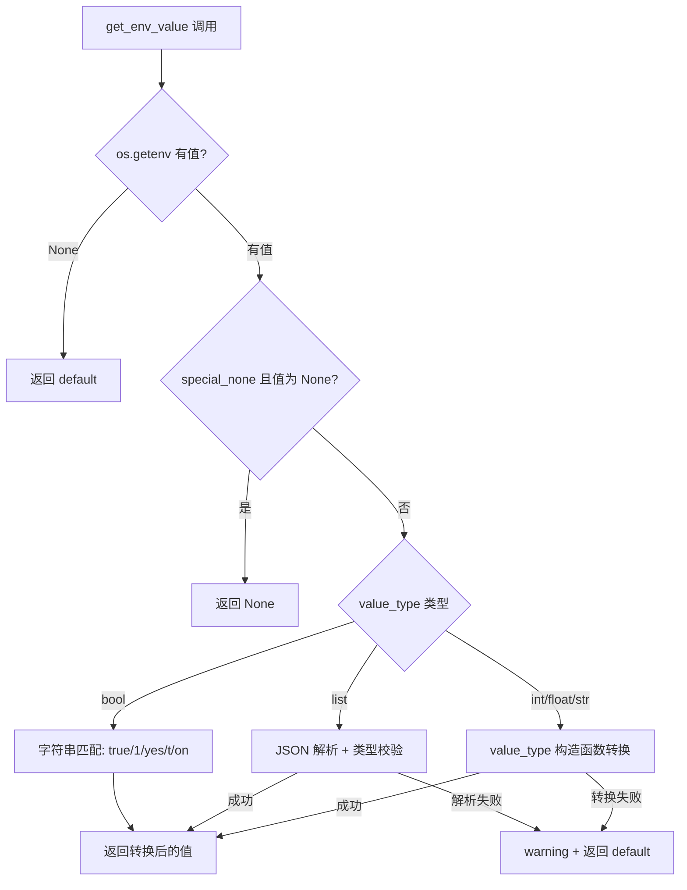
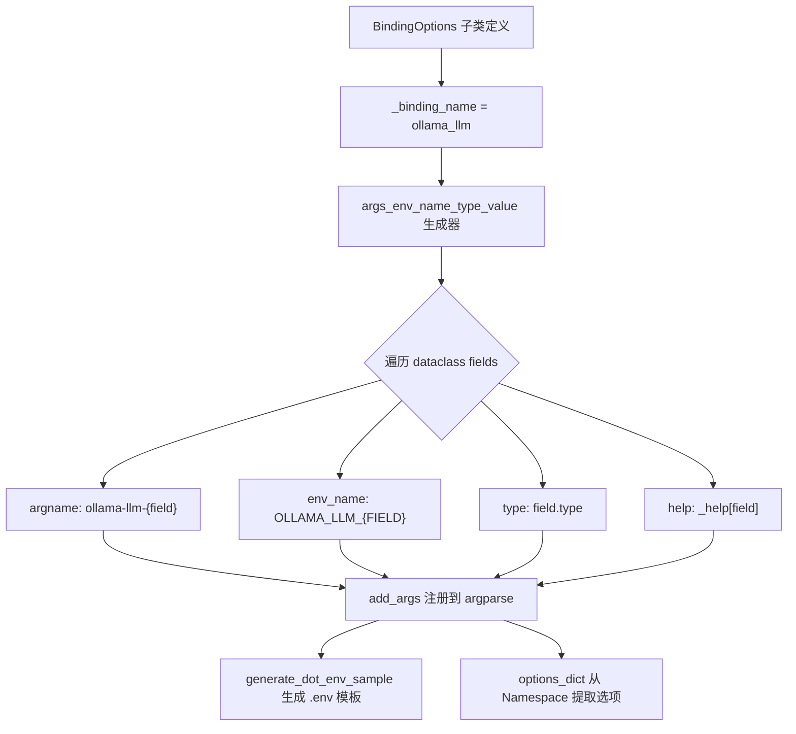

# PD-92.01 LightRAG — 多层配置管理与 BindingOptions 自动化

> 文档编号：PD-92.01
> 来源：LightRAG `lightrag/api/config.py`, `lightrag/llm/binding_options.py`, `lightrag/utils.py`, `lightrag/lightrag.py`
> GitHub：https://github.com/HKUDS/LightRAG.git
> 问题域：PD-92 配置管理 Configuration Management
> 状态：可复用方案

---

## 第 1 章 问题与动机

### 1.1 核心问题

RAG 系统需要管理大量配置参数：LLM 提供商选择、模型参数（temperature/top_p/top_k）、存储后端、嵌入模型、分块策略、检索参数等。这些参数来源多样——代码默认值、环境变量、`.env` 文件、CLI 参数、甚至 `config.ini`——且不同 LLM 提供商（Ollama/OpenAI/Gemini/Azure）各有独立参数集。

核心挑战：
1. **配置来源优先级**：多个来源的同一参数如何决定最终值？
2. **提供商参数爆炸**：每新增一个 LLM 提供商就要手写一套 env 变量名、CLI 参数名、help 文本
3. **类型安全**：环境变量都是字符串，bool/int/float/list/dict 需要安全转换
4. **多实例隔离**：同一机器运行多个 LightRAG 实例，各自需要独立配置

### 1.2 LightRAG 的解法概述

LightRAG 采用五层配置覆盖链 + BindingOptions 自动化生成：

1. **`constants.py` 硬编码默认值** — 所有参数的兜底值集中定义（`lightrag/constants.py:1-114`）
2. **`get_env_value()` 类型安全读取** — 统一的环境变量读取函数，支持 bool/int/float/list 类型转换（`lightrag/utils.py:176-225`）
3. **`dotenv` 实例级 `.env`** — 每个 LightRAG 实例从当前目录加载独立 `.env`，`override=False` 确保 OS 环境变量优先（`lightrag/lightrag.py:122`）
4. **`BindingOptions` 自动化** — dataclass 基类通过内省自动为每个 LLM 提供商生成 env 变量名和 CLI 参数（`lightrag/llm/binding_options.py:69-356`）
5. **`_GlobalArgsProxy` 延迟初始化** — 全局配置代理对象，首次访问时才解析参数（`lightrag/api/config.py:529-580`）

### 1.3 设计思想

| 设计原则 | 具体实现 | 理由 | 替代方案 |
|----------|----------|------|----------|
| 约定优于配置 | `_binding_name` 自动派生 env 前缀和 CLI 前缀 | 新增提供商只需定义字段，无需手写参数注册 | 手动为每个提供商写 argparse 代码 |
| 最少惊讶原则 | OS env > .env > dataclass default | 运维人员习惯用环境变量覆盖，开发者习惯用 .env | 反向优先级（.env 覆盖 OS env） |
| 类型安全边界 | `get_env_value` 在读取时立即转换类型 | 避免字符串 "False" 被当作 truthy | 延迟转换（使用时才转） |
| 延迟初始化 | `_GlobalArgsProxy` 代理模式 | 支持编程式注入配置，不强制 CLI 解析 | 模块级立即解析（import 即触发） |
| 实例隔离 | `load_dotenv(dotenv_path=".env", override=False)` | 不同目录的 LightRAG 实例读不同 .env | 全局单一配置文件 |

---

## 第 2 章 源码实现分析

### 2.1 架构概览

LightRAG 的配置管理分为三个层次：核心库层（LightRAG dataclass）、API 服务层（config.py + argparse）、提供商绑定层（BindingOptions）。

```
┌─────────────────────────────────────────────────────────────────┐
│                    配置优先级链（从高到低）                        │
├─────────────────────────────────────────────────────────────────┤
│  CLI 参数 (argparse)                                            │
│    ↓ 未指定时                                                    │
│  OS 环境变量 (os.getenv)                                        │
│    ↓ 未指定时                                                    │
│  .env 文件 (dotenv, override=False)                             │
│    ↓ 未指定时                                                    │
│  config.ini (configparser, 仅 LightRAG dataclass)               │
│    ↓ 未指定时                                                    │
│  constants.py 硬编码默认值                                       │
└─────────────────────────────────────────────────────────────────┘

┌──────────────┐    ┌──────────────────┐    ┌──────────────────┐
│ constants.py │───→│  get_env_value() │───→│  BindingOptions  │
│  默认值集中   │    │  类型安全转换     │    │  自动参数生成    │
└──────────────┘    └──────────────────┘    └──────────────────┘
        │                    │                       │
        ▼                    ▼                       ▼
┌──────────────┐    ┌──────────────────┐    ┌──────────────────┐
│ LightRAG     │    │  config.py       │    │ OllamaLLMOptions │
│ @dataclass   │    │  parse_args()    │    │ OpenAILLMOptions │
│ 核心库配置    │    │  API 服务配置     │    │ GeminiLLMOptions │
└──────────────┘    └──────────────────┘    └──────────────────┘
```

### 2.2 核心实现

#### 2.2.1 get_env_value — 类型安全的环境变量读取



对应源码 `lightrag/utils.py:176-225`：

```python
def get_env_value(
    env_key: str, default: any, value_type: type = str, special_none: bool = False
) -> any:
    value = os.getenv(env_key)
    if value is None:
        return default

    # Handle special case for "None" string
    if special_none and value == "None":
        return None

    if value_type is bool:
        return value.lower() in ("true", "1", "yes", "t", "on")

    # Handle list type with JSON parsing
    if value_type is list:
        try:
            parsed_value = json.loads(value)
            if isinstance(parsed_value, list):
                return parsed_value
            else:
                logger.warning(f"Environment variable {env_key} is not a valid JSON list, using default")
                return default
        except (json.JSONDecodeError, ValueError) as e:
            logger.warning(f"Failed to parse {env_key} as JSON list: {e}, using default")
            return default

    try:
        return value_type(value)
    except (ValueError, TypeError):
        return default
```

关键设计点：
- `special_none` 参数处理环境变量中的字面量 `"None"` 字符串（`utils.py:196-197`）
- bool 转换不使用 Python 的 `bool()` 构造函数（因为 `bool("false")` 返回 `True`），而是显式匹配字符串（`utils.py:199-200`）
- list 类型通过 JSON 解析，失败时优雅降级到默认值（`utils.py:203-220`）

#### 2.2.2 BindingOptions — 自动化参数生成引擎



对应源码 `lightrag/llm/binding_options.py:205-263`：

```python
@classmethod
def args_env_name_type_value(cls):
    import dataclasses
    args_prefix = f"{cls._binding_name}".replace("_", "-")
    env_var_prefix = f"{cls._binding_name}_".upper()
    help = cls._help

    if dataclasses.is_dataclass(cls):
        for field in dataclasses.fields(cls):
            if field.name.startswith("_"):
                continue
            # Get default value
            if field.default is not dataclasses.MISSING:
                default_value = field.default
            elif field.default_factory is not dataclasses.MISSING:
                default_value = field.default_factory()
            else:
                default_value = None

            argdef = {
                "argname": f"{args_prefix}-{field.name}",
                "env_name": f"{env_var_prefix}{field.name.upper()}",
                "type": _resolve_optional_type(field.type),
                "default": default_value,
                "help": f"{cls._binding_name} -- " + help.get(field.name, ""),
            }
            yield argdef
```

命名约定自动派生规则：
- `_binding_name = "ollama_llm"` → CLI 前缀 `--ollama-llm-`，env 前缀 `OLLAMA_LLM_`
- 字段 `temperature` → CLI `--ollama-llm-temperature`，env `OLLAMA_LLM_TEMPERATURE`
- 字段 `num_ctx` → CLI `--ollama-llm-num_ctx`，env `OLLAMA_LLM_NUM_CTX`

#### 2.2.3 条件化绑定注册

`config.py:274-313` 实现了按需注册绑定参数——只有用户选择的 LLM 提供商的参数才会出现在 `--help` 和 argparse 中：

```python
# lightrag/api/config.py:274-293
llm_binding_value = None
if "--llm-binding" in sys.argv:
    try:
        idx = sys.argv.index("--llm-binding")
        if idx + 1 < len(sys.argv) and not sys.argv[idx + 1].startswith("-"):
            llm_binding_value = sys.argv[idx + 1]
    except IndexError:
        pass

if llm_binding_value is None:
    llm_binding_value = get_env_value("LLM_BINDING", "ollama")

if llm_binding_value == "ollama":
    OllamaLLMOptions.add_args(parser)
elif llm_binding_value in ["openai", "azure_openai"]:
    OpenAILLMOptions.add_args(parser)
elif llm_binding_value == "gemini":
    GeminiLLMOptions.add_args(parser)
```

### 2.3 实现细节

#### _GlobalArgsProxy 延迟初始化代理

`config.py:529-580` 实现了一个代理对象，使全局配置支持延迟初始化和编程式注入：

```python
class _GlobalArgsProxy:
    def __getattribute__(self, name):
        global _initialized, _global_args
        if name == "__dict__":
            if not _initialized:
                initialize_config()
            return vars(_global_args)
        if name in ("__class__", "__repr__", "__getattribute__", "__setattr__"):
            return object.__getattribute__(self, name)
        if not _initialized:
            initialize_config()
        return getattr(_global_args, name)

global_args = _GlobalArgsProxy()
```

这个代理拦截 `__dict__` 访问以支持 `vars()` 调用（`config.py:550-553`），这对 `BindingOptions.options_dict()` 至关重要——该方法通过 `vars(args)` 提取所有参数再按前缀过滤（`binding_options.py:337-343`）。

#### 多实例 .env 隔离

三个模块独立加载 `.env`，均使用 `override=False`：
- `lightrag/lightrag.py:122` — 核心库层
- `lightrag/utils.py:234` — 工具层
- `lightrag/api/config.py:49` — API 层

`override=False` 意味着 OS 环境变量始终优先于 `.env` 文件。不同目录下的 LightRAG 实例各自读取当前目录的 `.env`，实现配置隔离。

---

## 第 3 章 迁移指南

### 3.1 迁移清单

**阶段 1：基础配置层（1 个文件）**
- [ ] 创建 `constants.py`，集中定义所有默认值常量
- [ ] 实现 `get_env_value(key, default, type, special_none)` 工具函数

**阶段 2：BindingOptions 自动化（2 个文件）**
- [ ] 创建 `BindingOptions` 基类（dataclass + ClassVar `_binding_name` + ClassVar `_help`）
- [ ] 实现 `args_env_name_type_value()` 生成器（自动派生 env/CLI 名称）
- [ ] 实现 `add_args(parser)` 方法（注册到 argparse）
- [ ] 实现 `options_dict(args)` 方法（从 Namespace 提取前缀匹配的选项）
- [ ] 为每个提供商创建子类（只需定义字段 + `_binding_name` + `_help`）

**阶段 3：全局配置代理（1 个文件）**
- [ ] 实现 `_GlobalArgsProxy` 代理类（支持延迟初始化 + `vars()` 兼容）
- [ ] 实现 `initialize_config(args=None, force=False)` 函数
- [ ] 导出 `global_args` 代理实例

### 3.2 适配代码模板

#### 模板 1：类型安全环境变量读取

```python
import os
import json
import logging

logger = logging.getLogger(__name__)

def get_env_value(
    env_key: str, default, value_type: type = str, special_none: bool = False
):
    """从环境变量读取值并安全转换类型。

    优先级：OS 环境变量 > .env 文件（由 dotenv 加载到 os.environ）> default
    """
    value = os.getenv(env_key)
    if value is None:
        return default

    if special_none and value == "None":
        return None

    if value_type is bool:
        return value.lower() in ("true", "1", "yes", "t", "on")

    if value_type is list:
        try:
            parsed = json.loads(value)
            return parsed if isinstance(parsed, list) else default
        except (json.JSONDecodeError, ValueError):
            logger.warning(f"Failed to parse {env_key} as JSON list, using default")
            return default

    if value_type is dict:
        try:
            parsed = json.loads(value)
            return parsed if isinstance(parsed, dict) else default
        except (json.JSONDecodeError, ValueError):
            logger.warning(f"Failed to parse {env_key} as JSON dict, using default")
            return default

    try:
        return value_type(value)
    except (ValueError, TypeError):
        return default
```

#### 模板 2：BindingOptions 自动化基类（精简版）

```python
from argparse import ArgumentParser, Namespace
from dataclasses import dataclass, fields
from typing import Any, ClassVar

@dataclass
class BindingOptions:
    """提供商绑定配置基类。子类只需定义字段和 _binding_name。"""
    _binding_name: ClassVar[str]
    _help: ClassVar[dict[str, str]] = {}

    @classmethod
    def cli_prefix(cls) -> str:
        return cls._binding_name.replace("_", "-")

    @classmethod
    def env_prefix(cls) -> str:
        return f"{cls._binding_name}_".upper()

    @classmethod
    def add_args(cls, parser: ArgumentParser):
        """自动将所有 dataclass 字段注册为 CLI 参数。"""
        group = parser.add_argument_group(f"{cls._binding_name} options")
        for f in fields(cls):
            if f.name.startswith("_"):
                continue
            arg_name = f"--{cls.cli_prefix()}-{f.name}"
            env_name = f"{cls.env_prefix()}{f.name.upper()}"
            env_val = get_env_value(env_name, None, f.type if f.type in (int, float, str, bool) else str)
            group.add_argument(
                arg_name,
                type=f.type if f.type in (int, float, str) else str,
                default=env_val if env_val is not None else f.default,
                help=cls._help.get(f.name, ""),
            )

    @classmethod
    def options_dict(cls, args: Namespace) -> dict[str, Any]:
        """从解析后的 Namespace 中提取本提供商的配置。"""
        prefix = cls._binding_name + "_"
        return {
            k[len(prefix):]: v
            for k, v in vars(args).items()
            if k.startswith(prefix)
        }


# 使用示例：新增一个提供商只需 10 行
@dataclass
class DeepSeekOptions(BindingOptions):
    _binding_name: ClassVar[str] = "deepseek"
    temperature: float = 0.7
    max_tokens: int = 4096
    top_p: float = 0.95
    _help: ClassVar[dict[str, str]] = {
        "temperature": "Controls randomness (0.0-2.0)",
        "max_tokens": "Maximum tokens to generate",
        "top_p": "Nucleus sampling parameter",
    }
```

### 3.3 适用场景

| 场景 | 适用度 | 说明 |
|------|--------|------|
| 多 LLM 提供商的 RAG 系统 | ⭐⭐⭐ | 核心场景，BindingOptions 自动化价值最大 |
| 需要多实例部署的服务 | ⭐⭐⭐ | .env 实例隔离 + 延迟初始化代理 |
| CLI 工具 + 环境变量配置 | ⭐⭐⭐ | get_env_value 通用性强 |
| 单一提供商的简单应用 | ⭐ | 过度设计，直接用 pydantic-settings 更简单 |
| 需要配置热更新的场景 | ⭐ | LightRAG 不支持运行时配置变更 |

---

## 第 4 章 测试用例

```python
import os
import argparse
import pytest
from unittest.mock import patch
from dataclasses import dataclass, fields
from typing import ClassVar, List


# ---- get_env_value 测试 ----

class TestGetEnvValue:
    """测试类型安全的环境变量读取。"""

    def test_default_when_env_not_set(self):
        """环境变量不存在时返回默认值"""
        with patch.dict(os.environ, {}, clear=True):
            assert get_env_value("NONEXISTENT", 42, int) == 42

    def test_int_conversion(self):
        """字符串正确转换为 int"""
        with patch.dict(os.environ, {"PORT": "8080"}):
            assert get_env_value("PORT", 9621, int) == 8080

    def test_bool_true_variants(self):
        """bool 类型支持多种 truthy 字符串"""
        for val in ["true", "True", "1", "yes", "t", "on"]:
            with patch.dict(os.environ, {"FLAG": val}):
                assert get_env_value("FLAG", False, bool) is True

    def test_bool_false_string(self):
        """字符串 'false' 不会被 bool() 误判为 True"""
        with patch.dict(os.environ, {"FLAG": "false"}):
            assert get_env_value("FLAG", True, bool) is False

    def test_special_none(self):
        """special_none=True 时字面量 'None' 返回 Python None"""
        with patch.dict(os.environ, {"TIMEOUT": "None"}):
            assert get_env_value("TIMEOUT", 300, int, special_none=True) is None

    def test_list_json_parsing(self):
        """list 类型通过 JSON 解析"""
        with patch.dict(os.environ, {"STOPS": '["</s>", "\\n"]'}):
            result = get_env_value("STOPS", [], list)
            assert result == ["</s>", "\n"]

    def test_list_invalid_json_fallback(self):
        """JSON 解析失败时降级到默认值"""
        with patch.dict(os.environ, {"STOPS": "not-json"}):
            assert get_env_value("STOPS", ["default"], list) == ["default"]

    def test_type_conversion_failure_fallback(self):
        """类型转换失败时返回默认值"""
        with patch.dict(os.environ, {"PORT": "not-a-number"}):
            assert get_env_value("PORT", 9621, int) == 9621


# ---- BindingOptions 测试 ----

class TestBindingOptions:
    """测试 BindingOptions 自动化参数生成。"""

    def test_env_name_generation(self):
        """验证 env 变量名自动生成规则"""
        @dataclass
        class TestOptions(BindingOptions):
            _binding_name: ClassVar[str] = "test_provider"
            temperature: float = 0.7
            _help: ClassVar[dict[str, str]] = {}

        args = list(TestOptions.args_env_name_type_value())
        assert args[0]["env_name"] == "TEST_PROVIDER_TEMPERATURE"
        assert args[0]["argname"] == "test-provider-temperature"

    def test_cli_prefix_derivation(self):
        """_binding_name 中的下划线转为 CLI 连字符"""
        @dataclass
        class OllamaLLM(BindingOptions):
            _binding_name: ClassVar[str] = "ollama_llm"
            num_ctx: int = 32768
            _help: ClassVar[dict[str, str]] = {}

        args = list(OllamaLLM.args_env_name_type_value())
        assert args[0]["argname"] == "ollama-llm-num_ctx"

    def test_options_dict_extraction(self):
        """从 Namespace 中按前缀提取提供商配置"""
        ns = argparse.Namespace(
            ollama_llm_temperature=0.5,
            ollama_llm_num_ctx=4096,
            openai_llm_temperature=0.8,
            unrelated_param="foo",
        )

        @dataclass
        class OllamaLLM(BindingOptions):
            _binding_name: ClassVar[str] = "ollama_llm"
            _help: ClassVar[dict[str, str]] = {}

        result = OllamaLLM.options_dict(ns)
        assert result == {"temperature": 0.5, "num_ctx": 4096}
        assert "openai_llm_temperature" not in result

    def test_generate_dot_env_sample(self):
        """.env 模板生成包含所有子类的参数"""
        sample = BindingOptions.generate_dot_env_sample()
        assert "OLLAMA_LLM_TEMPERATURE" in sample
        assert "OPENAI_LLM_TEMPERATURE" in sample
```

---

## 第 5 章 跨域关联

| 关联域 | 关系类型 | 说明 |
|--------|----------|------|
| PD-77 LLM 提供商抽象 | 强依赖 | BindingOptions 为每个 LLM 提供商生成配置，是提供商抽象层的配置基础设施 |
| PD-75 多后端存储 | 协同 | 存储后端选择（KV/Vector/Graph）通过 `LIGHTRAG_KV_STORAGE` 等 env 变量配置 |
| PD-76 认证授权 | 协同 | JWT 相关配置（TOKEN_SECRET/TOKEN_EXPIRE_HOURS）通过同一 get_env_value 体系管理 |
| PD-72 Embedding 适配 | 协同 | Embedding 提供商参数（EMBEDDING_BINDING/EMBEDDING_MODEL）走相同配置链 |
| PD-81 多租户隔离 | 协同 | WORKSPACE 配置项支持多租户数据隔离，与配置管理的多实例 .env 隔离互补 |

---

## 第 6 章 来源文件索引

| 文件 | 行范围 | 关键实现 |
|------|--------|----------|
| `lightrag/utils.py` | L176-L225 | `get_env_value()` 类型安全环境变量读取 |
| `lightrag/llm/binding_options.py` | L69-L110 | `BindingOptions` 基类定义 + 注释文档 |
| `lightrag/llm/binding_options.py` | L111-L203 | `add_args()` 自动注册 CLI 参数（含 bool/list/dict 特殊处理） |
| `lightrag/llm/binding_options.py` | L205-L263 | `args_env_name_type_value()` 生成器（命名约定派生） |
| `lightrag/llm/binding_options.py` | L265-L314 | `generate_dot_env_sample()` .env 模板生成 |
| `lightrag/llm/binding_options.py` | L316-L356 | `options_dict()` + `asdict()` 配置提取 |
| `lightrag/llm/binding_options.py` | L371-L473 | `_OllamaOptionsMixin` 完整参数定义（30+ 字段） |
| `lightrag/llm/binding_options.py` | L478-L567 | `GeminiLLMOptions` + `OpenAILLMOptions` 提供商子类 |
| `lightrag/api/config.py` | L49 | `load_dotenv(override=False)` 实例级 .env 加载 |
| `lightrag/api/config.py` | L77-L462 | `parse_args()` 完整 CLI 参数定义（80+ 参数） |
| `lightrag/api/config.py` | L274-L313 | 条件化绑定注册（按 LLM_BINDING 值动态注册参数） |
| `lightrag/api/config.py` | L476-L580 | `_GlobalArgsProxy` 延迟初始化代理 |
| `lightrag/lightrag.py` | L122-L126 | dotenv + configparser 加载 |
| `lightrag/lightrag.py` | L129-L399 | `LightRAG` dataclass 字段定义（env 默认值注入） |
| `lightrag/constants.py` | L1-L114 | 全局默认值常量集中定义 |

---

## 第 7 章 横向对比维度

```json comparison_data
{
  "project": "LightRAG",
  "dimensions": {
    "配置层级": "五层覆盖: constants→env→.env→config.ini→CLI argparse",
    "类型转换": "get_env_value 统一函数, 支持 bool/int/float/list/dict + special_none",
    "自动化程度": "BindingOptions 基类内省 dataclass fields, 自动派生 env 名和 CLI 参数",
    "多实例隔离": "每个实例目录独立 .env, load_dotenv(override=False) 保证 OS env 优先",
    "延迟初始化": "_GlobalArgsProxy 代理模式, 首次属性访问时才触发 parse_args",
    "条件注册": "按 LLM_BINDING 值动态注册对应提供商的 CLI 参数组"
  }
}
```

### 域元数据补充

```json domain_metadata
{
  "solution_summary": "LightRAG 用 BindingOptions dataclass 基类内省自动为每个 LLM 提供商派生 env 变量名和 CLI 参数，配合 get_env_value 五层配置覆盖链和 _GlobalArgsProxy 延迟初始化",
  "description": "提供商绑定参数的自动化生成与延迟初始化代理模式",
  "sub_problems": [
    "条件化参数注册（按提供商动态加载参数组）",
    "全局配置延迟初始化与编程式注入"
  ],
  "best_practices": [
    "BindingOptions 基类通过 _binding_name 约定自动派生 env/CLI 命名，新增提供商零模板代码",
    "_GlobalArgsProxy 代理拦截 __dict__ 支持 vars() 兼容，实现延迟初始化不破坏现有代码"
  ]
}
```
