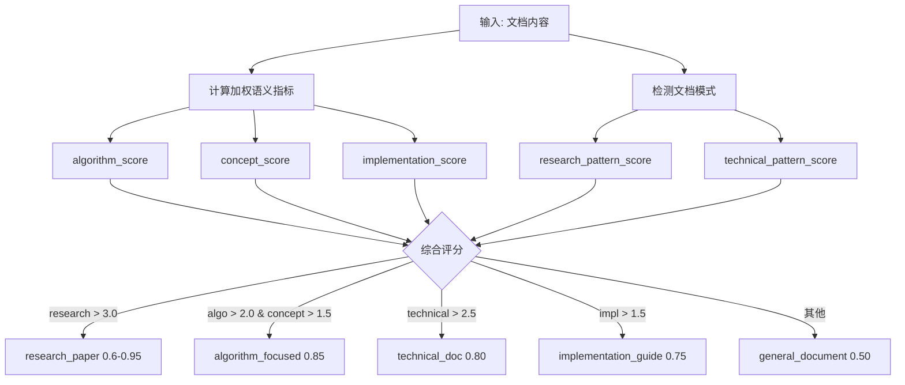
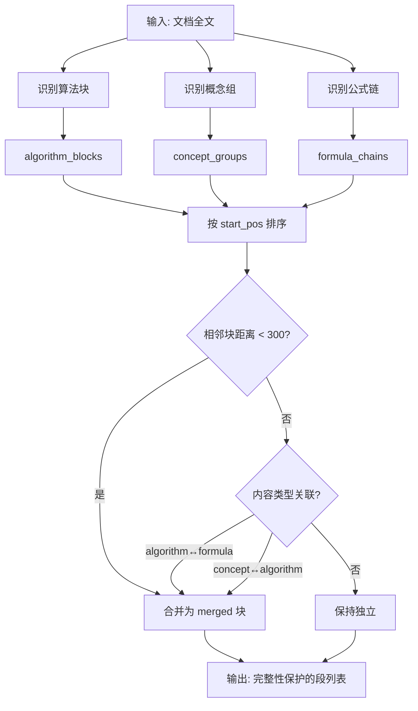
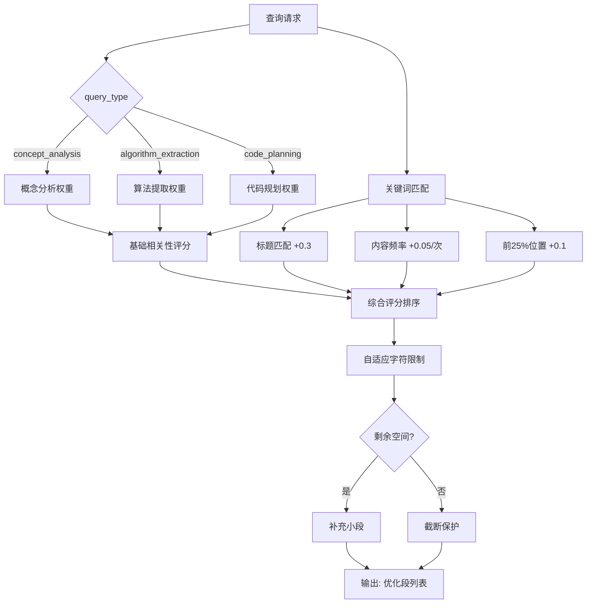

# PD-93.01 DeepCode — 语义感知文档智能分段

> 文档编号：PD-93.01
> 来源：DeepCode `tools/document_segmentation_server.py`
> GitHub：https://github.com/HKUDS/DeepCode.git
> 问题域：PD-93 文档智能分段 Document Intelligent Segmentation
> 状态：可复用方案

---

## 第 1 章 问题与动机

### 1.1 核心问题

大型学术论文和技术文档通常超过 LLM 的 token 限制（50,000+ 字符），直接全文输入会导致：
- **token 溢出**：超出模型上下文窗口，信息丢失
- **算法断裂**：机械式按固定长度切分会将算法块、公式推导链从中间截断，破坏逻辑完整性
- **检索低效**：下游 Agent（ConceptAnalysis、AlgorithmExtraction、CodePlanning）需要不同类型的内容，全文输入浪费 token 预算
- **语义割裂**：传统按标题/段落切分忽略内容语义关联，概念定义与其实现代码被分到不同段

DeepCode 的核心场景是"论文→代码"自动转换，文档分段质量直接决定下游 Agent 的代码生成质量。

### 1.2 DeepCode 的解法概述

DeepCode 实现了一套完整的语义感知文档分段系统，核心设计：

1. **语义文档分类**：通过加权指标评分（非简单关键词匹配）自动识别文档类型（research_paper / algorithm_focused / technical_doc 等），置信度评分 0.5-0.95（`document_segmentation_server.py:168-212`）
2. **5 种自适应分段策略**：根据文档类型和内容密度自动选择最优策略，从 `semantic_research_focused` 到 `content_aware_segmentation`（`document_segmentation_server.py:236-257`）
3. **算法块完整性保护**：识别算法块、概念组、公式链三类结构，通过关联性判断合并相邻块，防止截断（`document_segmentation_server.py:407-439`）
4. **查询感知检索**：三种查询类型（concept_analysis / algorithm_extraction / code_planning）各有独立的相关性评分，动态计算字符限制（`document_segmentation_server.py:1601-1723`）
5. **MCP Server 架构**：作为独立 MCP 工具服务运行，通过 FastMCP 暴露 3 个工具，与下游 Agent 解耦（`document_segmentation_server.py:92`）

### 1.3 设计思想

| 设计原则 | 具体实现 | 理由 | 替代方案 |
|----------|----------|------|----------|
| 语义优先于结构 | DocumentAnalyzer 用加权指标评分替代正则匹配 | 标题结构不可靠，内容语义才是分段依据 | 纯标题切分（LangChain RecursiveCharacterTextSplitter） |
| 算法完整性保护 | 三类内容块识别 + 关联性合并 | 算法/公式被截断后下游 Agent 无法正确理解 | 固定 overlap 窗口（信息冗余且不保证完整） |
| 查询感知检索 | 每个 segment 预计算 3 种查询类型的相关性分数 | 不同 Agent 需要不同内容，避免全文传输 | 统一 top-k 检索（不区分查询意图） |
| 自适应字符限制 | 根据文档类型和查询类型动态计算 max_total_chars | 算法密集文档需要更大上下文窗口 | 固定 chunk_size（一刀切） |
| MCP 工具化 | FastMCP Server 独立进程 | 与 Agent 解耦，可独立升级和测试 | 直接嵌入 Agent 代码（耦合度高） |

---

## 第 2 章 源码实现分析

### 2.1 架构概览

DeepCode 的文档分段系统由三层组成：决策层（llm_utils）、协调层（Agent）、执行层（MCP Server）。

```
┌─────────────────────────────────────────────────────────────┐
│                  Orchestration Engine                        │
│              (Phase 3.5: Document Preprocessing)             │
│  agent_orchestration_engine.py:1075-1215                    │
└──────────────────────┬──────────────────────────────────────┘
                       │ should_use_document_segmentation()
                       ▼
┌─────────────────────────────────────────────────────────────┐
│              Decision Layer (llm_utils.py)                   │
│  ┌─────────────────┐  ┌──────────────────┐                  │
│  │ Config Reader    │  │ Adaptive Config  │                  │
│  │ (size_threshold) │  │ (agent servers)  │                  │
│  └────────┬────────┘  └────────┬─────────┘                  │
│           │                    │                             │
│           ▼                    ▼                             │
│  ┌─────────────────────────────────────────┐                │
│  │ get_adaptive_prompts()                  │                │
│  │ segmented vs traditional prompt 切换     │                │
│  └─────────────────────────────────────────┘                │
└──────────────────────┬──────────────────────────────────────┘
                       │ prepare_document_segments()
                       ▼
┌─────────────────────────────────────────────────────────────┐
│         Coordination Layer (Agent)                           │
│  DocumentSegmentationAgent                                   │
│  ┌──────────────┐  ┌──────────────┐  ┌──────────────┐      │
│  │ analyze_and  │  │ get_document │  │ validate     │      │
│  │ _prepare     │  │ _overview    │  │ _quality     │      │
│  └──────┬───────┘  └──────┬───────┘  └──────┬───────┘      │
└─────────┼─────────────────┼─────────────────┼───────────────┘
          │    MCP Protocol │                 │
          ▼                 ▼                 ▼
┌─────────────────────────────────────────────────────────────┐
│         Execution Layer (MCP Server)                         │
│  DocumentSegmentationServer (FastMCP)                        │
│  ┌──────────────────┐  ┌──────────────┐  ┌──────────────┐  │
│  │ DocumentAnalyzer │  │ Document     │  │ Retrieval    │  │
│  │ (类型识别+策略)   │  │ Segmenter    │  │ System       │  │
│  │                  │  │ (5种策略)     │  │ (查询感知)    │  │
│  └──────────────────┘  └──────────────┘  └──────────────┘  │
└─────────────────────────────────────────────────────────────┘
```

### 2.2 核心实现

#### 2.2.1 语义文档类型分析



对应源码 `tools/document_segmentation_server.py:124-234`：

```python
class DocumentAnalyzer:
    """Enhanced document analyzer using semantic content analysis"""

    # 三级加权指标体系
    ALGORITHM_INDICATORS = {
        "high": ["algorithm", "procedure", "method", "approach", "technique", "framework"],
        "medium": ["step", "process", "implementation", "computation", "calculation"],
        "low": ["example", "illustration", "demonstration"],
    }

    def analyze_document_type(self, content: str) -> Tuple[str, float]:
        content_lower = content.lower()
        # 加权评分：high=3.0, medium=2.0, low=1.0，考虑词频
        algorithm_score = self._calculate_weighted_score(content_lower, self.ALGORITHM_INDICATORS)
        concept_score = self._calculate_weighted_score(content_lower, self.TECHNICAL_CONCEPT_INDICATORS)
        # 正则模式匹配：检测学术论文结构特征
        research_pattern_score = self._detect_pattern_score(content, self.RESEARCH_PAPER_PATTERNS)
        # 综合评分决策
        total_research_score = algorithm_score + concept_score + research_pattern_score * 2
        if research_pattern_score > 0.5 and total_research_score > 3.0:
            return "research_paper", min(0.95, 0.6 + research_pattern_score * 0.35)
        elif algorithm_score > 2.0 and concept_score > 1.5:
            return "algorithm_focused", 0.85
        # ...
```

#### 2.2.2 算法块完整性保护



对应源码 `tools/document_segmentation_server.py:407-439, 893-957`：

```python
def _segment_preserve_algorithm_integrity(self, content: str) -> List[DocumentSegment]:
    """Smart segmentation strategy that preserves algorithm integrity"""
    # 1. 识别算法块和相关描述
    algorithm_blocks = self._identify_algorithm_blocks(content)
    # 2. 识别概念定义组
    concept_groups = self._identify_concept_groups(content)
    # 3. 识别公式推导链
    formula_chains = self._identify_formula_chains(content)
    # 4. 合并相关内容块以确保完整性
    content_blocks = self._merge_related_content_blocks(
        algorithm_blocks, concept_groups, formula_chains, content
    )
    # 5. 转换为 DocumentSegment
    for i, block in enumerate(content_blocks):
        segment = self._create_enhanced_segment(
            block["content"], block["title"],
            block["start_pos"], block["end_pos"],
            block["importance_score"], block["content_type"],
        )
        segments.append(segment)
    return segments
```

公式链识别的关键逻辑（`document_segmentation_server.py:826-891`）：通过检测 `$$...$$` 块级公式和 `$...$` 行内公式的位置，将距离 < 500 字符的公式合并为一条推导链，前后各扩展 200 字符上下文。

#### 2.2.3 查询感知检索系统



对应源码 `tools/document_segmentation_server.py:1601-1723, 1788-1932`：

```python
def _calculate_adaptive_char_limit(document_index: DocumentIndex, query_type: str) -> int:
    """Dynamically calculate character limit based on document complexity"""
    base_limit = 6000
    if document_index.document_type == "research_paper":
        base_limit = 10000
    elif document_index.document_type == "algorithm_focused":
        base_limit = 12000
    elif document_index.segmentation_strategy == "algorithm_preserve_integrity":
        base_limit = 15000
    # 查询类型乘数
    query_multipliers = {
        "algorithm_extraction": 1.5,  # 算法需要更多上下文
        "concept_analysis": 1.2,
        "code_planning": 1.3,
    }
    return int(base_limit * query_multipliers.get(query_type, 1.0))
```

### 2.3 实现细节

**数据结构设计**（`document_segmentation_server.py:95-122`）：

```python
@dataclass
class DocumentSegment:
    id: str                          # MD5 哈希前 8 位
    title: str                       # 段标题
    content: str                     # 段内容
    content_type: str                # "algorithm" | "formula" | "concept" | "merged" | "general"
    keywords: List[str]              # 最多 25 个关键词
    char_start: int                  # 字符起始位置
    char_end: int                    # 字符结束位置
    char_count: int                  # 字符数
    relevance_scores: Dict[str, float]  # 3 种查询类型的相关性分数
    section_path: str                # 章节路径（如 "3.2.1"）

@dataclass
class DocumentIndex:
    document_path: str               # 文档路径
    document_type: str               # 文档类型
    segmentation_strategy: str       # 使用的分段策略
    total_segments: int              # 总段数
    total_chars: int                 # 总字符数
    segments: List[DocumentSegment]  # 所有段
    created_at: str                  # 创建时间
```

**5 种分段策略的选择逻辑**（`document_segmentation_server.py:236-257`）：

| 策略 | 触发条件 | 特点 |
|------|----------|------|
| `semantic_research_focused` | research_paper + algorithm_density > 0.3 | 按学术论文语义结构切分 |
| `algorithm_preserve_integrity` | algorithm_focused 或 algorithm_density > 0.5 | 算法块/公式链完整性保护 |
| `concept_implementation_hybrid` | concept_complexity > 0.4 + impl_detail > 0.3 | 概念与实现配对合并 |
| `semantic_chunking_enhanced` | 文档 > 15000 字符 | 增强语义边界检测 |
| `content_aware_segmentation` | 默认兜底 | 自适应 chunk 大小 |

**相关性评分矩阵**（`document_segmentation_server.py:1073-1117`）：

| content_type | concept_analysis | algorithm_extraction | code_planning |
|-------------|-----------------|---------------------|---------------|
| algorithm | importance × 0.7 | importance × 1.0 | importance × 0.9 |
| concept | importance × 1.0 | importance × 0.8 | importance × 0.6 |
| formula | importance × 0.8 | importance × 1.0 | importance × 0.9 |
| merged | importance × 0.95 | importance × 0.95 | importance × 0.95 |

---

## 第 3 章 迁移指南

### 3.1 迁移清单

**阶段 1：核心数据结构（1 个文件）**
- [ ] 定义 `DocumentSegment` 和 `DocumentIndex` dataclass
- [ ] 实现 segment ID 生成（MD5 哈希）
- [ ] 实现关键词提取和停用词过滤

**阶段 2：文档分析器（1 个文件）**
- [ ] 实现 `DocumentAnalyzer` 类
- [ ] 配置三级加权指标体系（ALGORITHM / CONCEPT / IMPLEMENTATION）
- [ ] 实现文档类型识别（`analyze_document_type`）
- [ ] 实现策略选择（`detect_segmentation_strategy`）

**阶段 3：分段器（1 个文件）**
- [ ] 实现 `DocumentSegmenter` 类
- [ ] 至少实现 2 种核心策略：`algorithm_preserve_integrity` + `semantic_chunking_enhanced`
- [ ] 实现算法块/概念组/公式链识别
- [ ] 实现关联性合并逻辑

**阶段 4：检索系统（集成到分段器或独立）**
- [ ] 实现查询感知的相关性评分
- [ ] 实现自适应字符限制计算
- [ ] 实现带完整性保护的段选择

**阶段 5：服务化（可选）**
- [ ] 封装为 MCP Server 或 REST API
- [ ] 实现索引缓存和增量更新
- [ ] 集成到 Agent 编排流程

### 3.2 适配代码模板

以下是一个可直接运行的最小化实现，包含核心的算法完整性保护分段：

```python
"""Minimal document segmentation with algorithm integrity preservation"""
import re
import hashlib
from dataclasses import dataclass, asdict
from typing import List, Dict, Tuple

@dataclass
class Segment:
    id: str
    title: str
    content: str
    content_type: str  # "algorithm" | "formula" | "concept" | "general"
    char_count: int
    relevance_scores: Dict[str, float]

class SmartSegmenter:
    """语义感知文档分段器 — 移植自 DeepCode"""

    ALGORITHM_PATTERNS = [
        r"(?i)(algorithm\s+\d+|procedure\s+\d+)",
        r"(?i)(input:|output:|return:|initialize:)",
        r"(?i)(for\s+each|while|if.*then)",
    ]
    FORMULA_PATTERNS = [
        r"\$\$.*?\$\$",
        r"\$[^$]+\$",
        r"(?i)(equation|formula)\s+\d+",
    ]

    def segment(self, content: str) -> List[Segment]:
        # 1. 识别特殊内容块
        algo_blocks = self._find_blocks(content, self.ALGORITHM_PATTERNS, "algorithm", 0.95)
        formula_blocks = self._find_blocks(content, self.FORMULA_PATTERNS, "formula", 0.9)
        # 2. 合并相邻关联块（距离 < 300 字符）
        all_blocks = sorted(algo_blocks + formula_blocks, key=lambda b: b["start"])
        merged = self._merge_nearby(all_blocks, content, threshold=300)
        # 3. 填充间隙为 general 段
        segments = self._fill_gaps(merged, content)
        return [self._to_segment(b) for b in segments]

    def _find_blocks(self, content: str, patterns: list, ctype: str, importance: float) -> List[Dict]:
        blocks = []
        for pattern in patterns:
            for m in re.finditer(pattern, content, re.DOTALL):
                start = max(0, m.start() - 200)
                end = min(len(content), m.end() + 500)
                blocks.append({"start": start, "end": end, "type": ctype, "importance": importance})
        return blocks

    def _merge_nearby(self, blocks: List[Dict], content: str, threshold: int) -> List[Dict]:
        if not blocks:
            return []
        merged = [blocks[0].copy()]
        for b in blocks[1:]:
            prev = merged[-1]
            if b["start"] - prev["end"] < threshold:
                prev["end"] = max(prev["end"], b["end"])
                prev["importance"] = max(prev["importance"], b["importance"])
                prev["type"] = "merged" if prev["type"] != b["type"] else prev["type"]
            else:
                merged.append(b.copy())
        for b in merged:
            b["content"] = content[b["start"]:b["end"]].strip()
        return merged

    def _fill_gaps(self, blocks: List[Dict], content: str) -> List[Dict]:
        result = []
        pos = 0
        for b in blocks:
            if b["start"] > pos + 200:  # 有间隙
                gap = content[pos:b["start"]].strip()
                if len(gap) > 100:
                    result.append({"start": pos, "end": b["start"], "content": gap,
                                   "type": "general", "importance": 0.7})
            result.append(b)
            pos = b["end"]
        if pos < len(content) - 200:
            result.append({"start": pos, "end": len(content),
                           "content": content[pos:].strip(), "type": "general", "importance": 0.7})
        return result

    def _to_segment(self, block: Dict) -> Segment:
        sid = hashlib.md5(f"{block['start']}_{block['end']}".encode()).hexdigest()[:8]
        return Segment(
            id=sid, title=block.get("title", f"Segment-{sid}"),
            content=block["content"], content_type=block["type"],
            char_count=len(block["content"]),
            relevance_scores={
                "concept_analysis": block["importance"] * (1.0 if block["type"] == "concept" else 0.7),
                "algorithm_extraction": block["importance"] * (1.0 if block["type"] in ("algorithm", "formula") else 0.5),
                "code_planning": block["importance"] * (0.9 if block["type"] in ("algorithm", "merged") else 0.6),
            },
        )

# 使用示例
segmenter = SmartSegmenter()
with open("paper.md") as f:
    segments = segmenter.segment(f.read())
for seg in sorted(segments, key=lambda s: s.relevance_scores["algorithm_extraction"], reverse=True)[:3]:
    print(f"[{seg.content_type}] {seg.title} ({seg.char_count} chars, algo_score={seg.relevance_scores['algorithm_extraction']:.2f})")
```

### 3.3 适用场景

| 场景 | 适用度 | 说明 |
|------|--------|------|
| 学术论文→代码转换 | ⭐⭐⭐ | DeepCode 的核心场景，策略最完善 |
| RAG 系统文档预处理 | ⭐⭐⭐ | 查询感知检索直接可用，替代 naive chunking |
| 技术文档知识库构建 | ⭐⭐ | 需要扩展 TECHNICAL_DOC_PATTERNS |
| 代码仓库 README 分析 | ⭐ | 文档通常较短，分段收益有限 |
| 多语言文档处理 | ⭐⭐ | 指标体系偏英文，中文需扩展停用词和模式 |

---

## 第 4 章 测试用例

```python
import pytest
from typing import List, Dict

# 假设已按 3.2 模板实现 SmartSegmenter 和 Segment
from smart_segmenter import SmartSegmenter, Segment


class TestDocumentAnalysis:
    """测试文档类型识别"""

    def test_research_paper_detection(self):
        """学术论文应被正确识别"""
        content = """
        ## Abstract
        We propose a novel algorithm for graph neural networks.

        ## Introduction
        Recent advances in deep learning have motivated...

        ## Methodology
        Our approach consists of three steps...

        ## Experiments
        We evaluate on five benchmark datasets...

        ## Conclusion
        In this paper, we presented...

        ## References
        [1] Kipf et al., 2017...
        """
        segmenter = SmartSegmenter()
        segments = segmenter.segment(content)
        assert len(segments) >= 1
        # 应该有 general 类型的段（因为没有算法块）
        types = {s.content_type for s in segments}
        assert "general" in types

    def test_algorithm_block_preservation(self):
        """算法块不应被截断"""
        content = """
        Some introduction text here.

        Algorithm 1: Graph Attention
        Input: Graph G = (V, E), features X
        Output: Updated features H

        Step 1: Compute attention coefficients
        for each edge (i, j) in E:
            alpha_ij = softmax(a^T [Wh_i || Wh_j])

        Step 2: Aggregate neighbors
        for each node i in V:
            h_i = sigma(sum_j alpha_ij * Wh_j)

        Return: H = {h_1, ..., h_n}

        The above algorithm achieves O(|E|) complexity.
        """
        segmenter = SmartSegmenter()
        segments = segmenter.segment(content)
        # 算法块应作为完整段保留
        algo_segments = [s for s in segments if s.content_type == "algorithm"]
        assert len(algo_segments) >= 1
        # 算法段应包含 Input/Output/Step
        algo_content = algo_segments[0].content
        assert "Input:" in algo_content or "Step 1" in algo_content

    def test_formula_chain_grouping(self):
        """相邻公式应被合并为一条推导链"""
        content = """
        The loss function is defined as:
        $$L = -\\sum_{i} y_i \\log(\\hat{y}_i)$$

        where $\\hat{y}_i$ is the predicted probability.

        We can derive the gradient:
        $$\\frac{\\partial L}{\\partial w} = -\\sum_{i} y_i \\frac{1}{\\hat{y}_i} \\frac{\\partial \\hat{y}_i}{\\partial w}$$

        This simplifies to:
        $$\\nabla_w L = X^T (\\hat{y} - y)$$
        """
        segmenter = SmartSegmenter()
        segments = segmenter.segment(content)
        # 公式链应被合并（3 个公式距离 < 500 字符）
        formula_segments = [s for s in segments if s.content_type in ("formula", "merged")]
        assert len(formula_segments) >= 1
        # 合并后的段应包含所有公式
        combined = " ".join(s.content for s in formula_segments)
        assert "$$" in combined

    def test_relevance_scoring(self):
        """不同内容类型应有不同的查询相关性分数"""
        segmenter = SmartSegmenter()
        content = """
        Algorithm 1: Attention Mechanism
        Input: Query Q, Key K, Value V
        Output: Attention(Q, K, V) = softmax(QK^T / sqrt(d_k)) V

        Step 1: Compute scores
        Step 2: Apply softmax
        Step 3: Weighted sum
        """
        segments = segmenter.segment(content)
        algo_seg = [s for s in segments if s.content_type == "algorithm"]
        if algo_seg:
            scores = algo_seg[0].relevance_scores
            # 算法段对 algorithm_extraction 的分数应最高
            assert scores["algorithm_extraction"] >= scores["concept_analysis"]

    def test_empty_document(self):
        """空文档应返回空列表"""
        segmenter = SmartSegmenter()
        segments = segmenter.segment("")
        assert segments == []

    def test_short_document_no_split(self):
        """短文档不应过度切分"""
        content = "This is a short paragraph with minimal content."
        segmenter = SmartSegmenter()
        segments = segmenter.segment(content)
        # 短文档可能不产生段（低于最小阈值）
        assert len(segments) <= 1
```

---

## 第 5 章 跨域关联

| 关联域 | 关系类型 | 说明 |
|--------|----------|------|
| PD-01 上下文管理 | 协同 | 文档分段是上下文窗口管理的前置步骤，分段质量直接影响 token 预算利用率 |
| PD-08 搜索与检索 | 协同 | 查询感知检索是 RAG 检索的特化形式，相关性评分可复用到向量检索的 reranking |
| PD-04 工具系统 | 依赖 | 分段服务通过 MCP 工具协议暴露，依赖 FastMCP 框架 |
| PD-02 多 Agent 编排 | 协同 | 分段结果为下游 3 个 Agent（Concept/Algorithm/CodePlanner）提供差异化输入 |
| PD-07 质量检查 | 协同 | `validate_segmentation_quality` 是分段后的质量门控，可扩展为通用质量检查模式 |
| PD-10 中间件管道 | 协同 | Phase 3.5 作为编排管道中的预处理中间件，可抽象为通用文档预处理管道 |

---

## 第 6 章 来源文件索引

| 文件 | 行范围 | 关键实现 |
|------|--------|----------|
| `tools/document_segmentation_server.py` | L1-92 | MCP Server 初始化、FastMCP 实例创建 |
| `tools/document_segmentation_server.py` | L95-122 | DocumentSegment / DocumentIndex 数据结构定义 |
| `tools/document_segmentation_server.py` | L124-311 | DocumentAnalyzer：语义文档类型分析、策略选择、密度计算 |
| `tools/document_segmentation_server.py` | L313-555 | DocumentSegmenter：5 种分段策略实现 |
| `tools/document_segmentation_server.py` | L753-891 | 算法块识别、概念组识别、公式链识别 |
| `tools/document_segmentation_server.py` | L893-957 | 关联性合并逻辑（_merge_related_content_blocks） |
| `tools/document_segmentation_server.py` | L982-1117 | 增强关键词提取、增强相关性评分计算 |
| `tools/document_segmentation_server.py` | L1446-1598 | MCP Tool: analyze_and_segment_document |
| `tools/document_segmentation_server.py` | L1601-1723 | MCP Tool: read_document_segments（查询感知检索） |
| `tools/document_segmentation_server.py` | L1726-1782 | MCP Tool: get_document_overview |
| `tools/document_segmentation_server.py` | L1788-1932 | 自适应字符限制、增强关键词评分、完整性保护选择 |
| `workflows/agents/document_segmentation_agent.py` | L16-98 | DocumentSegmentationAgent 类定义和 MCP 连接管理 |
| `workflows/agents/document_segmentation_agent.py` | L99-167 | analyze_and_prepare_document 核心方法 |
| `workflows/agents/document_segmentation_agent.py` | L207-253 | validate_segmentation_quality 质量验证 |
| `workflows/agents/document_segmentation_agent.py` | L284-353 | prepare_document_segments 便捷函数（Phase 3.5 入口） |
| `utils/llm_utils.py` | L296-328 | get_document_segmentation_config 配置读取 |
| `utils/llm_utils.py` | L331-363 | should_use_document_segmentation 决策函数 |
| `utils/llm_utils.py` | L366-403 | get_adaptive_agent_config 自适应 Agent 配置 |
| `utils/llm_utils.py` | L406-437 | get_adaptive_prompts 分段/传统 prompt 切换 |

---

## 第 7 章 横向对比维度

```json comparison_data
{
  "project": "DeepCode",
  "dimensions": {
    "分段策略": "5 种语义策略自适应选择，基于文档类型和内容密度",
    "完整性保护": "三类内容块识别（算法/概念/公式）+ 关联性合并",
    "检索方式": "查询感知三通道检索，预计算 3 种查询类型相关性分数",
    "字符限制": "自适应动态计算，算法文档最高 22500 字符",
    "服务架构": "FastMCP Server 独立进程，3 个工具接口",
    "文档分类": "加权语义指标 + 正则模式双通道评分，5 种文档类型"
  }
}
```

### 域元数据补充

```json domain_metadata
{
  "solution_summary": "DeepCode 用三级加权语义指标 + 5 种自适应分段策略实现文档智能分段，通过算法块/概念组/公式链三类内容识别与关联性合并保护完整性，支持查询感知三通道检索",
  "description": "面向论文→代码转换场景的语义感知分段与查询感知检索",
  "sub_problems": [
    "公式推导链的距离阈值合并",
    "分段后的质量验证与评估",
    "下游 Agent 差异化内容分发"
  ],
  "best_practices": [
    "用加权语义指标替代简单关键词匹配进行文档分类",
    "为每个段预计算多种查询类型的相关性分数",
    "将分段服务通过 MCP 协议解耦为独立工具"
  ]
}
```
