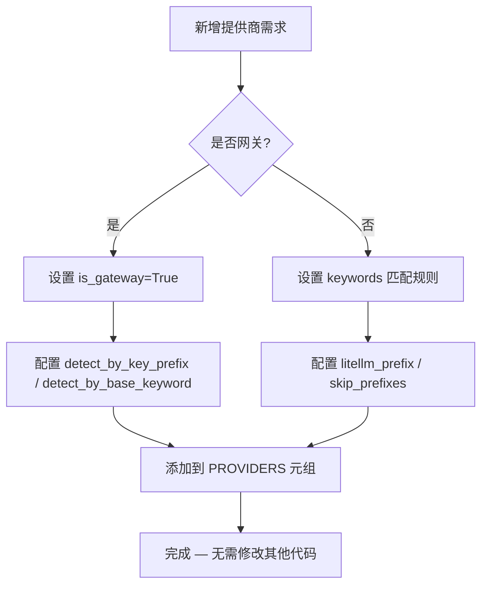
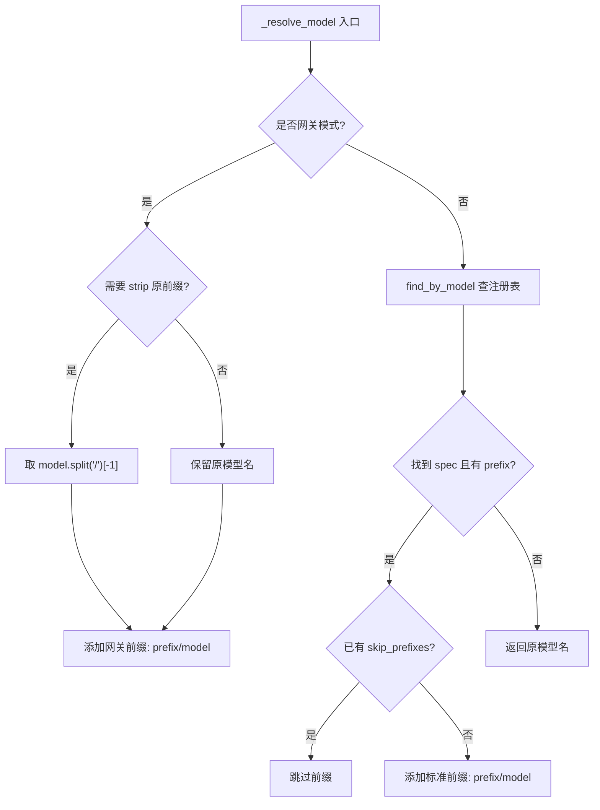
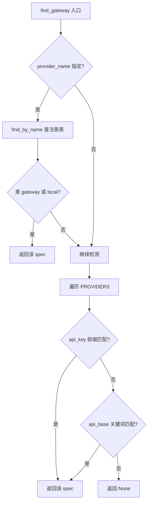

# PD-94.01 DeepCode — 双层注册表驱动的多LLM提供商管理

> 文档编号：PD-94.01
> 来源：DeepCode `nanobot/nanobot/providers/registry.py` `nanobot/nanobot/providers/litellm_provider.py` `utils/llm_utils.py`
> GitHub：https://github.com/HKUDS/DeepCode.git
> 问题域：PD-94 多LLM提供商管理 Multi-LLM Provider Management
> 状态：可复用方案

---

## 第 1 章 问题与动机

### 1.1 核心问题

在 Agent 系统中集成多个 LLM 提供商（Anthropic、OpenAI、Google、DeepSeek、Moonshot 等）面临以下工程挑战：

1. **提供商碎片化**：每个提供商有不同的 API 格式、认证方式、模型命名规则，直接集成会导致大量 if-elif 分支
2. **API Key 管理混乱**：密钥散落在环境变量、配置文件、代码硬编码中，缺乏统一管理
3. **模型路由复杂**：LiteLLM 等统一层要求特定前缀（如 `deepseek/deepseek-chat`），不同提供商规则不同
4. **网关与直连混合**：OpenRouter、AiHubMix 等网关可路由任意模型，与直连提供商的处理逻辑完全不同
5. **新增提供商成本高**：传统做法需要修改多处代码，容易遗漏

DeepCode 项目有两套独立的多提供商管理系统：主项目的 `llm_utils.py`（面向 mcp_agent 框架）和 nanobot 子项目的 `registry.py + litellm_provider.py`（面向 LiteLLM）。两者设计思路不同但互补，提供了从简单到复杂的完整方案谱系。

### 1.2 DeepCode 的解法概述

1. **ProviderSpec 注册表**（`registry.py:20-57`）：用 frozen dataclass 定义每个提供商的完整元数据，包括名称、关键词、环境变量名、LiteLLM 前缀、网关检测规则、模型参数覆盖等 13 个字段
2. **声明式提供商列表**（`registry.py:63-264`）：所有 13 个提供商以有序元组定义，顺序即优先级，新增提供商只需复制模板填写字段
3. **LiteLLM 统一调用层**（`litellm_provider.py:14-202`）：通过 registry 查询自动完成环境变量设置、模型前缀解析、参数覆盖，chat 方法零分支
4. **YAML 配置优先 + 环境变量回退**（`llm_utils.py:13-54`）：`mcp_agent.secrets.yaml` 优先，环境变量作为回退，支持多别名（如 `GOOGLE_API_KEY` / `GEMINI_API_KEY`）
5. **偏好优先 + 可用性回退**（`llm_utils.py:109-171`）：先读用户配置的 `llm_provider` 偏好，验证其 API Key 可用性，不可用则按顺序回退到第一个有 Key 的提供商

### 1.3 设计思想

| 设计原则 | 具体实现 | 理由 | 替代方案 |
|----------|----------|------|----------|
| 数据驱动消除分支 | ProviderSpec 元组替代 if-elif 链 | 新增提供商零代码修改，只加数据 | 策略模式（每个提供商一个类） |
| 有序注册表 = 优先级 | PROVIDERS 元组顺序即匹配优先级 | 网关优先、辅助提供商靠后，无需额外优先级字段 | 显式 priority 字段 |
| 冻结不可变元数据 | `@dataclass(frozen=True)` | 运行时不可篡改，线程安全 | 普通 dict |
| 双层密钥解析 | YAML 文件优先 → 环境变量回退 | 开发环境用文件，CI/CD 用环境变量 | 只用环境变量 |
| 网关自动检测 | API Key 前缀 + URL 关键词匹配 | 用户无需显式声明网关类型 | 配置文件显式指定 |
| 模型参数覆盖 | `model_overrides` 字段 per-model 定制 | Kimi K2.5 要求 temperature≥1.0 等特殊约束 | 全局参数 + 文档说明 |

---

## 第 2 章 源码实现分析

### 2.1 架构概览

DeepCode 的多提供商管理分为两层：

```
┌─────────────────────────────────────────────────────────────────┐
│                        调用层 (Agent Loop)                       │
├─────────────────────────────────────────────────────────────────┤
│                                                                 │
│  ┌─────────────────────┐     ┌──────────────────────────────┐  │
│  │   llm_utils.py      │     │   LiteLLMProvider            │  │
│  │   (mcp_agent 层)    │     │   (nanobot 层)               │  │
│  │                     │     │                              │  │
│  │  get_api_keys()     │     │  __init__() → find_gateway() │  │
│  │  get_preferred_llm  │     │  _setup_env() → ProviderSpec │  │
│  │  _class()           │     │  _resolve_model() → prefix   │  │
│  │  get_default_models │     │  chat() → acompletion()      │  │
│  │  ()                 │     │                              │  │
│  └────────┬────────────┘     └──────────┬───────────────────┘  │
│           │                             │                       │
│           ▼                             ▼                       │
│  ┌─────────────────┐          ┌──────────────────────┐         │
│  │ YAML secrets    │          │  ProviderSpec Registry│         │
│  │ + env vars      │          │  (13 providers)      │         │
│  └─────────────────┘          └──────────────────────┘         │
│                                         │                       │
│                                         ▼                       │
│                               ┌──────────────────┐             │
│                               │     LiteLLM      │             │
│                               │  (统一 API 调用)  │             │
│                               └──────────────────┘             │
└─────────────────────────────────────────────────────────────────┘
```

### 2.2 核心实现

#### 2.2.1 ProviderSpec 注册表 — 数据驱动的提供商元数据



对应源码 `nanobot/nanobot/providers/registry.py:20-57`：

```python
@dataclass(frozen=True)
class ProviderSpec:
    """One LLM provider's metadata. See PROVIDERS below for real examples."""

    # identity
    name: str                          # config field name, e.g. "dashscope"
    keywords: tuple[str, ...]          # model-name keywords for matching (lowercase)
    env_key: str                       # LiteLLM env var, e.g. "DASHSCOPE_API_KEY"
    display_name: str = ""             # shown in `nanobot status`

    # model prefixing
    litellm_prefix: str = ""           # "dashscope" → model becomes "dashscope/{model}"
    skip_prefixes: tuple[str, ...] = () # don't prefix if model already starts with these

    # extra env vars
    env_extras: tuple[tuple[str, str], ...] = ()

    # gateway / local detection
    is_gateway: bool = False           # routes any model (OpenRouter, AiHubMix)
    is_local: bool = False             # local deployment (vLLM, Ollama)
    detect_by_key_prefix: str = ""     # match api_key prefix, e.g. "sk-or-"
    detect_by_base_keyword: str = ""   # match substring in api_base URL
    default_api_base: str = ""

    # gateway behavior
    strip_model_prefix: bool = False   # strip "provider/" before re-prefixing

    # per-model param overrides
    model_overrides: tuple[tuple[str, dict[str, Any]], ...] = ()
```

注册表中的 13 个提供商按优先级排列（`registry.py:63-264`），网关在前、辅助在后：

| 类型 | 提供商 | LiteLLM 前缀 | 特殊处理 |
|------|--------|-------------|----------|
| 网关 | OpenRouter | `openrouter` | Key 前缀 `sk-or-` 自动检测 |
| 网关 | AiHubMix | `openai` | `strip_model_prefix=True` 去除原前缀 |
| 标准 | Anthropic | 无 | LiteLLM 原生识别 `claude-*` |
| 标准 | OpenAI | 无 | LiteLLM 原生识别 `gpt-*` |
| 标准 | DeepSeek | `deepseek` | `skip_prefixes=("deepseek/",)` 防双重前缀 |
| 标准 | Gemini | `gemini` | 同上 |
| 标准 | Zhipu | `zai` | 额外设置 `ZHIPUAI_API_KEY` 环境变量 |
| 标准 | DashScope | `dashscope` | 阿里云通义千问 |
| 标准 | Moonshot | `moonshot` | Kimi K2.5 强制 `temperature≥1.0` |
| 本地 | vLLM | `hosted_vllm` | 用户必须提供 api_base |
| 辅助 | Groq | `groq` | 主要用于 Whisper 语音转写 |

#### 2.2.2 模型名称解析 — 网关 vs 标准双路径



对应源码 `nanobot/nanobot/providers/litellm_provider.py:73-90`：

```python
def _resolve_model(self, model: str) -> str:
    """Resolve model name by applying provider/gateway prefixes."""
    if self._gateway:
        # Gateway mode: apply gateway prefix, skip provider-specific prefixes
        prefix = self._gateway.litellm_prefix
        if self._gateway.strip_model_prefix:
            model = model.split("/")[-1]
        if prefix and not model.startswith(f"{prefix}/"):
            model = f"{prefix}/{model}"
        return model

    # Standard mode: auto-prefix for known providers
    spec = find_by_model(model)
    if spec and spec.litellm_prefix:
        if not any(model.startswith(s) for s in spec.skip_prefixes):
            model = f"{spec.litellm_prefix}/{model}"

    return model
```

#### 2.2.3 网关自动检测 — 三级优先级匹配



对应源码 `nanobot/nanobot/providers/registry.py:284-312`：

```python
def find_gateway(
    provider_name: str | None = None,
    api_key: str | None = None,
    api_base: str | None = None,
) -> ProviderSpec | None:
    """Detect gateway/local provider.
    Priority:
      1. provider_name — if it maps to a gateway/local spec, use it directly.
      2. api_key prefix — e.g. "sk-or-" → OpenRouter.
      3. api_base keyword — e.g. "aihubmix" in URL → AiHubMix.
    """
    # 1. Direct match by config key
    if provider_name:
        spec = find_by_name(provider_name)
        if spec and (spec.is_gateway or spec.is_local):
            return spec

    # 2. Auto-detect by api_key prefix / api_base keyword
    for spec in PROVIDERS:
        if spec.detect_by_key_prefix and api_key and api_key.startswith(spec.detect_by_key_prefix):
            return spec
        if spec.detect_by_base_keyword and api_base and spec.detect_by_base_keyword in api_base:
            return spec

    return None
```

### 2.3 实现细节

#### llm_utils 层：偏好优先 + 可用性回退

`utils/llm_utils.py:109-171` 实现了一个两阶段提供商选择策略：

1. **偏好阶段**：读取 `mcp_agent.config.yaml` 中的 `llm_provider` 字段，如果该提供商有可用 API Key 则直接使用
2. **回退阶段**：按 anthropic → google → openai 顺序遍历，选择第一个有 Key 的提供商
3. **兜底**：所有提供商都无 Key 时，默认返回 Google（因为 Google 有免费额度）

#### 阶段特定模型配置

`utils/llm_utils.py:214-293` 支持为不同任务阶段配置不同模型：

```yaml
# mcp_agent.config.yaml 示例
google:
  default_model: gemini-2.0-flash
  planning_model: gemini-2.5-pro      # 规划阶段用强模型
  implementation_model: gemini-2.0-flash  # 实现阶段用快模型
```

每个提供商都支持 `planning_model` 和 `implementation_model` 两个阶段特定模型，回退到 `default_model`。

#### Pydantic 配置层的注册表联动

`nanobot/nanobot/config/schema.py:226-246` 的 `_match_provider` 方法直接遍历 registry 的 PROVIDERS 元组，实现了配置层与注册表的联动：

```python
def _match_provider(self, model: str | None = None):
    from nanobot.providers.registry import PROVIDERS
    model_lower = (model or self.agents.defaults.model).lower()
    # Match by keyword (order follows PROVIDERS registry)
    for spec in PROVIDERS:
        p = getattr(self.providers, spec.name, None)
        if p and any(kw in model_lower for kw in spec.keywords) and p.api_key:
            return p, spec.name
    # Fallback: gateways first, then others
    for spec in PROVIDERS:
        p = getattr(self.providers, spec.name, None)
        if p and p.api_key:
            return p, spec.name
    return None, None
```

---

## 第 3 章 迁移指南

### 3.1 迁移清单

#### 阶段一：基础注册表（1 天）

- [ ] 创建 `providers/registry.py`，定义 `ProviderSpec` dataclass
- [ ] 添加项目需要的提供商到 `PROVIDERS` 元组
- [ ] 实现 `find_by_model()`、`find_gateway()`、`find_by_name()` 三个查询函数

#### 阶段二：统一调用层（1 天）

- [ ] 创建 `providers/base.py`，定义 `LLMProvider` 抽象基类和 `LLMResponse` 数据类
- [ ] 创建 `providers/litellm_provider.py`，实现 `_resolve_model()` 和 `_setup_env()`
- [ ] 安装 `litellm` 依赖

#### 阶段三：配置集成（0.5 天）

- [ ] 创建 Pydantic 配置 schema，`ProvidersConfig` 字段与注册表 `name` 一一对应
- [ ] 实现 `_match_provider()` 方法联动注册表
- [ ] 创建 YAML 配置文件模板

#### 阶段四：密钥管理（0.5 天）

- [ ] 实现 `get_api_keys()` 函数：YAML 优先 + 环境变量回退
- [ ] 实现 `get_preferred_llm_class()` 函数：偏好优先 + 可用性回退

### 3.2 适配代码模板

以下是一个最小可运行的注册表 + 统一调用层实现：

```python
"""Minimal provider registry — copy and extend."""

from __future__ import annotations
from dataclasses import dataclass
from typing import Any

import litellm
from litellm import acompletion


# ── Step 1: 定义 ProviderSpec ──────────────────────────────────

@dataclass(frozen=True)
class ProviderSpec:
    name: str
    keywords: tuple[str, ...]
    env_key: str
    litellm_prefix: str = ""
    skip_prefixes: tuple[str, ...] = ()
    is_gateway: bool = False
    detect_by_key_prefix: str = ""
    detect_by_base_keyword: str = ""
    default_api_base: str = ""
    strip_model_prefix: bool = False
    model_overrides: tuple[tuple[str, dict[str, Any]], ...] = ()


# ── Step 2: 声明提供商（顺序 = 优先级）─────────────────────────

PROVIDERS: tuple[ProviderSpec, ...] = (
    ProviderSpec(
        name="openrouter",
        keywords=("openrouter",),
        env_key="OPENROUTER_API_KEY",
        litellm_prefix="openrouter",
        is_gateway=True,
        detect_by_key_prefix="sk-or-",
    ),
    ProviderSpec(
        name="anthropic",
        keywords=("anthropic", "claude"),
        env_key="ANTHROPIC_API_KEY",
    ),
    ProviderSpec(
        name="openai",
        keywords=("openai", "gpt"),
        env_key="OPENAI_API_KEY",
    ),
    ProviderSpec(
        name="deepseek",
        keywords=("deepseek",),
        env_key="DEEPSEEK_API_KEY",
        litellm_prefix="deepseek",
        skip_prefixes=("deepseek/",),
    ),
)


# ── Step 3: 查询函数 ──────────────────────────────────────────

def find_by_model(model: str) -> ProviderSpec | None:
    model_lower = model.lower()
    for spec in PROVIDERS:
        if spec.is_gateway:
            continue
        if any(kw in model_lower for kw in spec.keywords):
            return spec
    return None


def find_gateway(api_key: str | None = None, api_base: str | None = None) -> ProviderSpec | None:
    for spec in PROVIDERS:
        if spec.detect_by_key_prefix and api_key and api_key.startswith(spec.detect_by_key_prefix):
            return spec
        if spec.detect_by_base_keyword and api_base and spec.detect_by_base_keyword in api_base:
            return spec
    return None


# ── Step 4: 统一调用层 ────────────────────────────────────────

class UnifiedLLMProvider:
    def __init__(self, api_key: str, api_base: str | None = None, default_model: str = "claude-sonnet-4-20250514"):
        self.default_model = default_model
        self._gateway = find_gateway(api_key, api_base)

        # 设置环境变量
        spec = self._gateway or find_by_model(default_model)
        if spec and api_key:
            import os
            os.environ.setdefault(spec.env_key, api_key)

        litellm.suppress_debug_info = True
        litellm.drop_params = True

    def _resolve_model(self, model: str) -> str:
        if self._gateway:
            prefix = self._gateway.litellm_prefix
            if self._gateway.strip_model_prefix:
                model = model.split("/")[-1]
            if prefix and not model.startswith(f"{prefix}/"):
                model = f"{prefix}/{model}"
            return model

        spec = find_by_model(model)
        if spec and spec.litellm_prefix:
            if not any(model.startswith(s) for s in spec.skip_prefixes):
                model = f"{spec.litellm_prefix}/{model}"
        return model

    async def chat(self, messages: list[dict], model: str | None = None, **kwargs) -> dict:
        model = self._resolve_model(model or self.default_model)
        response = await acompletion(model=model, messages=messages, **kwargs)
        return {
            "content": response.choices[0].message.content,
            "usage": dict(response.usage) if response.usage else {},
        }
```

### 3.3 适用场景

| 场景 | 适用度 | 说明 |
|------|--------|------|
| 多提供商 Agent 系统 | ⭐⭐⭐ | 核心场景，注册表消除分支，新增提供商零代码修改 |
| 网关路由（OpenRouter/AiHubMix） | ⭐⭐⭐ | 网关自动检测 + 模型前缀重写完整覆盖 |
| 单提供商项目 | ⭐ | 过度设计，直接调用 LiteLLM 即可 |
| 需要流式输出的场景 | ⭐⭐ | 当前实现不含 streaming，需自行扩展 `acompletion` 为 streaming 模式 |
| 阶段特定模型（规划/实现用不同模型） | ⭐⭐⭐ | llm_utils 层的 planning_model/implementation_model 直接可用 |
| 本地部署（vLLM/Ollama） | ⭐⭐ | 注册表已支持 `is_local` 标记，需用户提供 api_base |

---

## 第 4 章 测试用例

```python
"""Tests for multi-provider registry and resolution."""

import os
import pytest
from unittest.mock import AsyncMock, patch, MagicMock


# ── ProviderSpec 注册表测试 ────────────────────────────────────

class TestProviderRegistry:
    """Tests based on registry.py:272-321."""

    def test_find_by_model_anthropic(self):
        """Claude 模型应匹配 Anthropic spec。"""
        from nanobot.providers.registry import find_by_model
        spec = find_by_model("claude-sonnet-4-20250514")
        assert spec is not None
        assert spec.name == "anthropic"
        assert spec.env_key == "ANTHROPIC_API_KEY"

    def test_find_by_model_deepseek(self):
        """DeepSeek 模型应匹配并带 prefix。"""
        from nanobot.providers.registry import find_by_model
        spec = find_by_model("deepseek-chat")
        assert spec is not None
        assert spec.name == "deepseek"
        assert spec.litellm_prefix == "deepseek"

    def test_find_by_model_skips_gateways(self):
        """find_by_model 不应匹配网关提供商。"""
        from nanobot.providers.registry import find_by_model
        spec = find_by_model("openrouter-something")
        # openrouter 是网关，不应被 find_by_model 匹配
        assert spec is None or not spec.is_gateway

    def test_find_gateway_by_key_prefix(self):
        """sk-or- 前缀应自动检测为 OpenRouter。"""
        from nanobot.providers.registry import find_gateway
        spec = find_gateway(api_key="sk-or-abc123")
        assert spec is not None
        assert spec.name == "openrouter"
        assert spec.is_gateway is True

    def test_find_gateway_by_base_keyword(self):
        """api_base 含 aihubmix 应检测为 AiHubMix。"""
        from nanobot.providers.registry import find_gateway
        spec = find_gateway(api_base="https://aihubmix.com/v1")
        assert spec is not None
        assert spec.name == "aihubmix"

    def test_find_gateway_none(self):
        """普通 API Key 不应匹配任何网关。"""
        from nanobot.providers.registry import find_gateway
        spec = find_gateway(api_key="sk-abc123", api_base="https://api.openai.com")
        assert spec is None

    def test_find_by_name(self):
        """按名称精确查找。"""
        from nanobot.providers.registry import find_by_name
        spec = find_by_name("moonshot")
        assert spec is not None
        assert spec.display_name == "Moonshot"
        assert ("kimi-k2.5", {"temperature": 1.0}) in spec.model_overrides


# ── 模型名称解析测试 ──────────────────────────────────────────

class TestModelResolution:
    """Tests based on litellm_provider.py:73-90."""

    def test_standard_prefix(self):
        """标准提供商应自动添加前缀。"""
        from nanobot.providers.litellm_provider import LiteLLMProvider
        provider = LiteLLMProvider.__new__(LiteLLMProvider)
        provider._gateway = None
        result = provider._resolve_model("deepseek-chat")
        assert result == "deepseek/deepseek-chat"

    def test_skip_double_prefix(self):
        """已有前缀不应重复添加。"""
        from nanobot.providers.litellm_provider import LiteLLMProvider
        provider = LiteLLMProvider.__new__(LiteLLMProvider)
        provider._gateway = None
        result = provider._resolve_model("deepseek/deepseek-chat")
        assert result == "deepseek/deepseek-chat"

    def test_gateway_strip_and_reprefix(self):
        """AiHubMix 网关应 strip 原前缀再加 openai/ 前缀。"""
        from nanobot.providers.registry import find_by_name
        from nanobot.providers.litellm_provider import LiteLLMProvider
        provider = LiteLLMProvider.__new__(LiteLLMProvider)
        provider._gateway = find_by_name("aihubmix")
        result = provider._resolve_model("anthropic/claude-sonnet-4-20250514")
        assert result == "openai/claude-sonnet-4-20250514"


# ── API Key 管理测试 ──────────────────────────────────────────

class TestApiKeyManagement:
    """Tests based on llm_utils.py:13-54."""

    def test_yaml_priority_over_env(self, tmp_path):
        """YAML 配置应优先于环境变量。"""
        import yaml
        secrets_file = tmp_path / "secrets.yaml"
        secrets_file.write_text(yaml.dump({
            "anthropic": {"api_key": "yaml-key-123"},
        }))

        with patch.dict(os.environ, {"ANTHROPIC_API_KEY": "env-key-456"}):
            from utils.llm_utils import get_api_keys
            keys = get_api_keys(str(secrets_file))
            assert keys["anthropic"] == "yaml-key-123"

    def test_env_fallback_when_no_yaml(self, tmp_path):
        """无 YAML 时应回退到环境变量。"""
        secrets_file = tmp_path / "nonexistent.yaml"

        with patch.dict(os.environ, {"ANTHROPIC_API_KEY": "env-key-456"}, clear=False):
            from utils.llm_utils import get_api_keys
            keys = get_api_keys(str(secrets_file))
            assert keys["anthropic"] == "env-key-456"

    def test_google_key_alias(self, tmp_path):
        """GEMINI_API_KEY 应作为 google key 的别名。"""
        secrets_file = tmp_path / "nonexistent.yaml"

        with patch.dict(os.environ, {"GEMINI_API_KEY": "gemini-key"}, clear=False):
            from utils.llm_utils import get_api_keys
            keys = get_api_keys(str(secrets_file))
            assert keys["google"] == "gemini-key"
```

---

## 第 5 章 跨域关联

| 关联域 | 关系类型 | 说明 |
|--------|----------|------|
| PD-03 容错与重试 | 协同 | LiteLLMProvider.chat() 捕获异常返回 error LLMResponse，上层可据此触发重试或提供商回退 |
| PD-01 上下文管理 | 协同 | get_token_limits() 从配置读取 base_max_tokens/retry_max_tokens，与上下文窗口管理联动 |
| PD-11 可观测性 | 协同 | LLMResponse.usage 字段记录 prompt_tokens/completion_tokens，可接入成本追踪 |
| PD-04 工具系统 | 依赖 | chat() 方法支持 tools 参数和 tool_choice="auto"，ToolCallRequest 解析依赖提供商返回格式 |
| PD-82 配置管理 | 依赖 | 整个系统依赖 YAML 配置文件 + Pydantic schema 驱动，与配置管理域强耦合 |

---

## 第 6 章 来源文件索引

| 文件 | 行范围 | 关键实现 |
|------|--------|----------|
| `nanobot/nanobot/providers/registry.py` | L20-57 | ProviderSpec frozen dataclass 定义（13 个字段） |
| `nanobot/nanobot/providers/registry.py` | L63-264 | PROVIDERS 元组：13 个提供商声明（网关→标准→本地→辅助） |
| `nanobot/nanobot/providers/registry.py` | L272-321 | find_by_model / find_gateway / find_by_name 查询函数 |
| `nanobot/nanobot/providers/litellm_provider.py` | L14-51 | LiteLLMProvider.__init__：网关检测 + 环境变量设置 |
| `nanobot/nanobot/providers/litellm_provider.py` | L73-90 | _resolve_model：网关 vs 标准双路径模型名称解析 |
| `nanobot/nanobot/providers/litellm_provider.py` | L92-100 | _apply_model_overrides：per-model 参数覆盖 |
| `nanobot/nanobot/providers/litellm_provider.py` | L102-155 | chat：统一异步调用 + 错误优雅降级 |
| `nanobot/nanobot/providers/base.py` | L8-31 | ToolCallRequest + LLMResponse 数据类定义 |
| `nanobot/nanobot/providers/base.py` | L33-73 | LLMProvider 抽象基类（chat + get_default_model） |
| `nanobot/nanobot/config/schema.py` | L154-176 | ProviderConfig + ProvidersConfig（11 个提供商字段） |
| `nanobot/nanobot/config/schema.py` | L226-246 | _match_provider：注册表联动的提供商匹配 |
| `nanobot/nanobot/config/schema.py` | L257-276 | get_api_key / get_api_base：配置层密钥和 URL 解析 |
| `utils/llm_utils.py` | L13-54 | get_api_keys：YAML 优先 + 环境变量回退的密钥管理 |
| `utils/llm_utils.py` | L89-106 | _get_llm_class：延迟导入的提供商类工厂 |
| `utils/llm_utils.py` | L109-171 | get_preferred_llm_class：偏好优先 + 可用性回退选择 |
| `utils/llm_utils.py` | L214-293 | get_default_models：阶段特定模型配置（planning/implementation） |

---

## 第 7 章 横向对比维度

```json comparison_data
{
  "project": "DeepCode",
  "dimensions": {
    "提供商注册": "frozen dataclass 注册表，13 个提供商有序元组，顺序即优先级",
    "模型路由": "双路径解析：网关 strip+reprefix，标准 keyword→prefix 自动映射",
    "密钥管理": "双层系统：llm_utils YAML优先+env回退，nanobot Pydantic config+registry联动",
    "网关支持": "自动检测：API Key前缀(sk-or-)和URL关键词(aihubmix)三级优先级匹配",
    "参数定制": "model_overrides 字段 per-model 覆盖（如 Kimi K2.5 temperature≥1.0）",
    "阶段模型": "planning_model/implementation_model 支持规划与实现阶段用不同模型"
  }
}
```

### 域元数据补充

```json domain_metadata
{
  "solution_summary": "DeepCode 用 frozen dataclass 注册表驱动 13 个 LLM 提供商管理，网关自动检测(Key前缀+URL关键词)，双路径模型名称解析，阶段特定模型配置",
  "description": "通过声明式注册表消除提供商分支代码，实现零代码新增提供商",
  "sub_problems": [
    "阶段特定模型选择（规划/实现用不同模型）",
    "网关模型前缀重写（strip原前缀再加网关前缀）",
    "per-model参数覆盖（特定模型的特殊约束）"
  ],
  "best_practices": [
    "用 frozen dataclass 保证提供商元数据不可变和线程安全",
    "有序元组顺序即优先级，无需额外 priority 字段",
    "延迟导入提供商类避免循环依赖"
  ]
}
```
