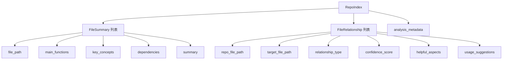
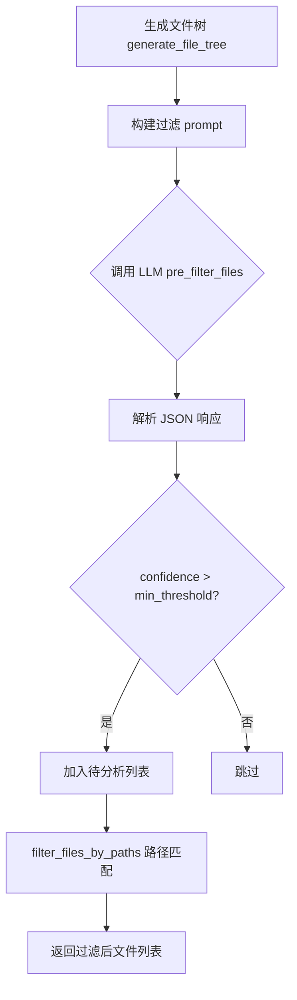
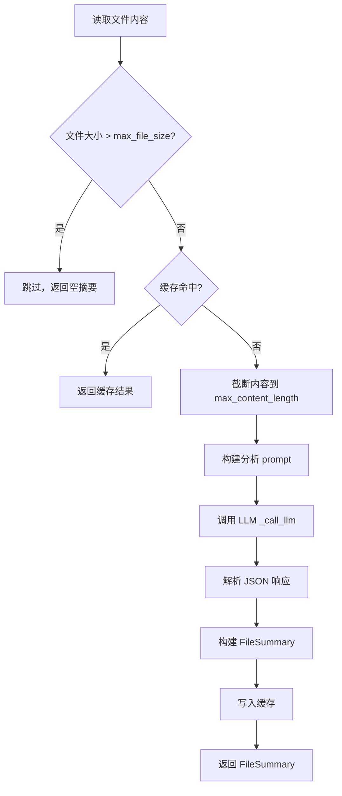
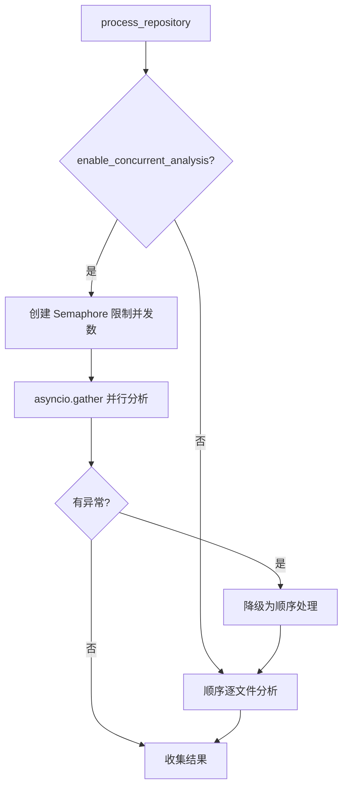
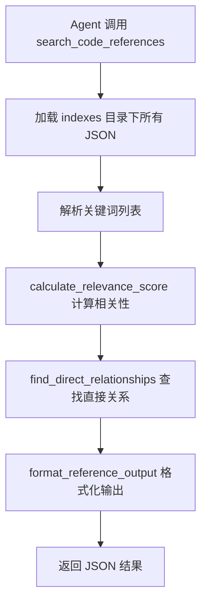

# PD-95.01 DeepCode — LLM 驱动代码索引与参考检索

> 文档编号：PD-95.01
> 来源：DeepCode `tools/code_indexer.py`, `tools/code_reference_indexer.py`, `workflows/codebase_index_workflow.py`
> GitHub：https://github.com/HKUDS/DeepCode.git
> 问题域：PD-95 代码索引与参考系统 Code Index & Reference System
> 状态：可复用方案

---

## 第 1 章 问题与动机

### 1.1 核心问题

在 AI 辅助代码生成场景中，LLM 需要理解已有代码库的结构和功能才能生成高质量的新代码。核心挑战包括：

1. **代码库规模过大**：直接将整个代码库塞入 LLM 上下文窗口不现实，需要预处理和索引
2. **文件间关系隐式**：import 依赖、功能相似性、架构关联等关系散落在代码中，缺乏显式表达
3. **参考代码检索低效**：开发者或 Agent 需要快速找到与目标文件功能相关的参考代码，传统文本搜索无法理解语义
4. **目标结构与现有代码的映射**：给定一个目标项目结构（如论文复现的文件树），需要自动找到现有代码库中可复用的组件

DeepCode 的解法是构建一个 LLM 驱动的两阶段索引系统：先用 LLM 分析每个文件生成结构化摘要（FileSummary），再用 LLM 分析文件与目标结构的关系（FileRelationship），最终通过 MCP 工具提供统一搜索接口。

### 1.2 DeepCode 的解法概述

1. **LLM 预过滤**：先用 LLM 分析文件树，筛选出与目标结构相关的文件，避免分析无关文件（`tools/code_indexer.py:617-697`）
2. **LLM 文件摘要**：对每个文件调用 LLM 生成结构化 JSON 摘要，包含函数列表、关键概念、依赖关系（`tools/code_indexer.py:753-863`）
3. **LLM 关系发现**：基于文件摘要和目标结构，用 LLM 判断文件间的关系类型和置信度（`tools/code_indexer.py:865-949`）
4. **JSON 持久化索引**：所有分析结果序列化为 JSON 文件，支持离线查询（`tools/code_indexer.py:1189-1268`）
5. **MCP 统一搜索接口**：通过 FastMCP 暴露 `search_code_references` 工具，合并加载+搜索为单次调用（`tools/code_reference_indexer.py:334-408`）

### 1.3 设计思想

| 设计原则 | 具体实现 | 理由 | 替代方案 |
|----------|----------|------|----------|
| LLM-as-Analyzer | 用 LLM 而非 AST 解析器分析代码语义 | LLM 能理解代码意图和跨语言模式，AST 只能解析语法结构 | Tree-sitter AST 解析 + 规则匹配 |
| 两阶段索引 | 先生成 FileSummary，再基于摘要发现 Relationship | 解耦文件分析和关系发现，降低单次 LLM 调用复杂度 | 单次 LLM 调用同时分析文件和关系 |
| 目标结构驱动 | 索引以目标项目结构为锚点，而非无方向的全量索引 | 面向代码复现场景，关系发现有明确方向 | 无方向的全量代码相似度计算 |
| 置信度分层 | 4 级关系类型 + 可配置置信度阈值 | 区分直接匹配和间接参考，让消费者按需过滤 | 二元匹配（相关/不相关） |
| MCP 工具化 | 通过 FastMCP 暴露搜索接口 | Agent 可直接调用，无需了解索引内部结构 | REST API 或 CLI 工具 |

---

## 第 2 章 源码实现分析

### 2.1 架构概览

DeepCode 的代码索引系统由三层组成：

```
┌─────────────────────────────────────────────────────────────────┐
│                    Workflow Layer                                 │
│  CodebaseIndexWorkflow                                           │
│  - 从 initial_plan.txt 提取目标文件树                              │
│  - 加载/创建 YAML 配置                                            │
│  - 编排 CodeIndexer 执行                                          │
│  workflows/codebase_index_workflow.py                             │
├─────────────────────────────────────────────────────────────────┤
│                    Indexing Layer                                 │
│  CodeIndexer                                                     │
│  - LLM 预过滤 → 文件摘要 → 关系发现 → JSON 输出                    │
│  - 支持并发/顺序处理、缓存、重试                                    │
│  tools/code_indexer.py                                           │
├─────────────────────────────────────────────────────────────────┤
│                    Query Layer                                   │
│  CodeReferenceIndexer (MCP Tool)                                 │
│  - 加载 JSON 索引 → 关键词+路径匹配 → 格式化输出                    │
│  - search_code_references / get_indexes_overview                 │
│  tools/code_reference_indexer.py                                 │
└─────────────────────────────────────────────────────────────────┘
```

### 2.2 核心实现

#### 2.2.1 数据模型：三个 Dataclass 构成索引骨架



对应源码 `tools/code_indexer.py:30-66`：

```python
@dataclass
class FileRelationship:
    """Represents a relationship between a repo file and target structure file"""
    repo_file_path: str
    target_file_path: str
    relationship_type: str  # 'direct_match', 'partial_match', 'reference', 'utility'
    confidence_score: float  # 0.0 to 1.0
    helpful_aspects: List[str]
    potential_contributions: List[str]
    usage_suggestions: str

@dataclass
class FileSummary:
    """Summary information for a repository file"""
    file_path: str
    file_type: str
    main_functions: List[str]
    key_concepts: List[str]
    dependencies: List[str]
    summary: str
    lines_of_code: int
    last_modified: str

@dataclass
class RepoIndex:
    """Complete index for a repository"""
    repo_name: str
    total_files: int
    file_summaries: List[FileSummary]
    relationships: List[FileRelationship]
    analysis_metadata: Dict[str, Any]
```

关系类型采用 4 级权重体系，在 `tools/indexer_config.yaml:89-94` 中配置：

```yaml
relationship_types:
    direct_match: 1.0      # 直接实现匹配
    partial_match: 0.8     # 部分功能匹配
    reference: 0.6         # 参考或工具函数
    utility: 0.4           # 通用工具或辅助
```

#### 2.2.2 LLM 预过滤：减少无关文件分析



对应源码 `tools/code_indexer.py:617-697`：

```python
async def pre_filter_files(self, repo_path: Path, file_tree: str) -> List[str]:
    """Use LLM to pre-filter relevant files based on target structure"""
    filter_prompt = f"""
    You are a code analysis expert. Please analyze the following code repository
    file tree based on the target project structure and filter out files that
    may be relevant to the target project.

    Target Project Structure:
    {self.target_structure}

    Code Repository File Tree:
    {file_tree}
    ...
    Only return files with confidence > {self.min_confidence_score}.
    """
    llm_response = await self._call_llm(
        filter_prompt,
        system_prompt="You are a professional code analysis and project architecture expert...",
        max_tokens=2000,
    )
    # 解析 JSON 响应，提取 relevant_files
    match = re.search(r"\{.*\}", llm_response, re.DOTALL)
    filter_data = json.loads(match.group(0))
    selected_files = []
    for file_info in filter_data.get("relevant_files", []):
        if file_info.get("confidence", 0.0) > self.min_confidence_score:
            selected_files.append(file_info.get("file_path", ""))
    return selected_files
```

#### 2.2.3 文件摘要生成：LLM 结构化分析



对应源码 `tools/code_indexer.py:753-863`，核心是将文件内容截断后发送给 LLM，要求返回结构化 JSON：

```python
analysis_prompt = f"""
Analyze this code file and provide a structured summary:
File: {file_path.name}
Content:
```
{content_for_analysis}{content_suffix}
```
Please provide analysis in this JSON format:
{{
    "file_type": "description of what type of file this is",
    "main_functions": ["list", "of", "main", "functions", "or", "classes"],
    "key_concepts": ["important", "concepts", "algorithms", "patterns"],
    "dependencies": ["external", "libraries", "or", "imports"],
    "summary": "2-3 sentence summary of what this file does"
}}
"""
```

#### 2.2.4 并发处理与降级



对应源码 `tools/code_indexer.py:1070-1182`，使用 `asyncio.Semaphore` 控制并发度，失败时自动降级：

```python
async def _process_files_concurrently(self, files_to_analyze: list) -> tuple:
    semaphore = asyncio.Semaphore(self.max_concurrent_files)

    async def _process_with_semaphore(file_path, index, total):
        async with semaphore:
            if index > 1:
                await asyncio.sleep(self.request_delay * 0.5)
            return await self._analyze_single_file_with_relationships(file_path, index, total)

    try:
        results = await asyncio.gather(*tasks, return_exceptions=True)
        # ... 处理结果
    except Exception as e:
        self.logger.info("Falling back to sequential processing...")
        return await self._process_files_sequentially(files_to_analyze)
```

#### 2.2.5 MCP 统一搜索接口



对应源码 `tools/code_reference_indexer.py:132-173`，相关性评分算法：

```python
def calculate_relevance_score(target_file, reference, keywords=None) -> float:
    score = 0.0
    target_name = Path(target_file).stem.lower()
    ref_name = Path(reference.file_path).stem.lower()

    # 文件名相似性 +0.3
    if target_name in ref_name or ref_name in target_name:
        score += 0.3
    # 文件类型匹配 +0.2
    if Path(target_file).suffix == Path(reference.file_path).suffix:
        score += 0.2
    # 关键词匹配 +0.5（按比例）
    if keywords:
        total_searchable_text = (" ".join(reference.key_concepts) + " "
            + " ".join(reference.main_functions) + " "
            + reference.summary + " " + reference.file_type).lower()
        keyword_matches = sum(1 for kw in keywords if kw.lower() in total_searchable_text)
        score += (keyword_matches / len(keywords)) * 0.5
    return min(score, 1.0)
```

### 2.3 实现细节

**LLM 调用重试机制**（`tools/code_indexer.py:383-466`）：采用线性退避策略（`retry_delay * (attempt + 1)`），最多重试 `max_retries` 次。支持 Anthropic 和 OpenAI 双提供商自动切换。

**内容缓存**（`tools/code_indexer.py:727-748`）：基于文件路径+修改时间+大小生成缓存键，FIFO 淘汰策略，可配置最大缓存条目数。

**目标结构提取**（`workflows/codebase_index_workflow.py:58-194`）：从 `initial_plan.txt` 中用正则提取文件树，支持 3 级降级：`## File Structure` 标准格式 → 代码块中的树结构 → 反引号中的文件路径重建。

**配置驱动**（`tools/indexer_config.yaml`）：6 大配置域（paths、file_analysis、llm、relationships、performance、debug），所有阈值和行为均可通过 YAML 调整，无需改代码。


---

## 第 3 章 迁移指南

### 3.1 迁移清单

**阶段 1：数据模型定义**
- [ ] 定义 `FileSummary` dataclass（文件路径、类型、函数列表、概念、依赖、摘要）
- [ ] 定义 `FileRelationship` dataclass（源文件、目标文件、关系类型、置信度、建议）
- [ ] 定义 `RepoIndex` dataclass（仓库名、文件摘要列表、关系列表、元数据）
- [ ] 定义关系类型枚举和权重配置

**阶段 2：索引构建管道**
- [ ] 实现文件遍历器（递归扫描 + 扩展名过滤 + 目录跳过）
- [ ] 实现文件树生成器（ASCII 树结构，用于 LLM 预过滤）
- [ ] 实现 LLM 预过滤（发送文件树 + 目标结构，返回相关文件列表）
- [ ] 实现 LLM 文件摘要（发送文件内容，返回结构化 JSON）
- [ ] 实现 LLM 关系发现（发送摘要 + 目标结构，返回关系列表）
- [ ] 实现 JSON 序列化输出

**阶段 3：查询接口**
- [ ] 实现索引加载器（从 JSON 文件反序列化）
- [ ] 实现相关性评分算法（文件名 + 类型 + 关键词三维评分）
- [ ] 实现直接关系查找（路径归一化 + 模糊匹配）
- [ ] 实现格式化输出（Markdown 格式的参考信息）
- [ ] 封装为 MCP 工具或 API 接口

**阶段 4：工程化增强**
- [ ] 添加并发处理支持（Semaphore 限流 + 降级策略）
- [ ] 添加内容缓存（文件修改时间感知 + LRU 淘汰）
- [ ] 添加 LLM 调用重试（线性退避 + 多提供商切换）
- [ ] 添加 YAML 配置驱动（所有阈值可配置）

### 3.2 适配代码模板

以下是一个精简的可运行代码模板，提取了 DeepCode 索引系统的核心逻辑：

```python
"""Minimal Code Indexer — 从 DeepCode 提取的核心索引逻辑"""
import asyncio
import json
import re
from dataclasses import dataclass, asdict
from pathlib import Path
from typing import List, Dict, Any, Optional

@dataclass
class FileSummary:
    file_path: str
    file_type: str
    main_functions: List[str]
    key_concepts: List[str]
    dependencies: List[str]
    summary: str

@dataclass
class FileRelationship:
    repo_file_path: str
    target_file_path: str
    relationship_type: str  # direct_match | partial_match | reference | utility
    confidence_score: float
    helpful_aspects: List[str]
    usage_suggestions: str

class CodeIndexer:
    RELATIONSHIP_WEIGHTS = {
        "direct_match": 1.0, "partial_match": 0.8,
        "reference": 0.6, "utility": 0.4,
    }

    def __init__(self, llm_caller, target_structure: str,
                 min_confidence: float = 0.3, max_content_len: int = 3000):
        self.llm_caller = llm_caller  # async callable(prompt, system) -> str
        self.target_structure = target_structure
        self.min_confidence = min_confidence
        self.max_content_len = max_content_len

    async def analyze_file(self, file_path: Path) -> FileSummary:
        content = file_path.read_text(errors="ignore")[:self.max_content_len]
        prompt = f"""Analyze this code file and return JSON:
File: {file_path.name}
Content:\n```\n{content}\n```
Return: {{"file_type":"...","main_functions":[...],"key_concepts":[...],"dependencies":[...],"summary":"..."}}"""
        resp = await self.llm_caller(prompt, "You are a code analysis expert.")
        data = json.loads(re.search(r"\{.*\}", resp, re.DOTALL).group(0))
        return FileSummary(file_path=str(file_path), **data)

    async def find_relationships(self, summary: FileSummary) -> List[FileRelationship]:
        prompt = f"""Analyze relationship between this file and target structure:
File: {summary.file_path}, Type: {summary.file_type}
Functions: {', '.join(summary.main_functions)}
Summary: {summary.summary}
Target Structure:\n{self.target_structure}
Return: {{"relationships":[{{"target_file_path":"...","relationship_type":"...","confidence_score":0.0-1.0,"helpful_aspects":[...],"usage_suggestions":"..."}}]}}
Only include relationships with confidence > {self.min_confidence}."""
        resp = await self.llm_caller(prompt, "You are a code analysis expert.")
        data = json.loads(re.search(r"\{.*\}", resp, re.DOTALL).group(0))
        return [
            FileRelationship(
                repo_file_path=summary.file_path,
                target_file_path=r["target_file_path"],
                relationship_type=r.get("relationship_type", "reference"),
                confidence_score=r["confidence_score"],
                helpful_aspects=r.get("helpful_aspects", []),
                usage_suggestions=r.get("usage_suggestions", ""),
            )
            for r in data.get("relationships", [])
            if r.get("confidence_score", 0) > self.min_confidence
        ]

    async def build_index(self, repo_path: Path, extensions: set = {".py"}) -> Dict[str, Any]:
        files = [f for f in repo_path.rglob("*") if f.suffix in extensions and f.is_file()]
        summaries, relationships = [], []
        for f in files:
            s = await self.analyze_file(f)
            summaries.append(s)
            rels = await self.find_relationships(s)
            relationships.extend(rels)
        return {
            "repo_name": repo_path.name,
            "total_files": len(files),
            "file_summaries": [asdict(s) for s in summaries],
            "relationships": [asdict(r) for r in relationships],
        }

# --- 查询端 ---
def search_references(index_data: Dict, target_file: str,
                      keywords: List[str] = None, max_results: int = 10):
    """从索引中搜索与目标文件相关的参考代码"""
    results = []
    for fs in index_data.get("file_summaries", []):
        score = 0.0
        target_stem = Path(target_file).stem.lower()
        ref_stem = Path(fs["file_path"]).stem.lower()
        if target_stem in ref_stem or ref_stem in target_stem:
            score += 0.3
        if Path(target_file).suffix == Path(fs["file_path"]).suffix:
            score += 0.2
        if keywords:
            text = " ".join(fs.get("key_concepts", []) + fs.get("main_functions", []))
            text += " " + fs.get("summary", "")
            matches = sum(1 for kw in keywords if kw.lower() in text.lower())
            score += (matches / len(keywords)) * 0.5
        if score > 0.1:
            results.append((fs, score))
    results.sort(key=lambda x: x[1], reverse=True)
    return results[:max_results]
```

### 3.3 适用场景

| 场景 | 适用度 | 说明 |
|------|--------|------|
| 论文代码复现 | ⭐⭐⭐ | DeepCode 的核心场景，目标结构驱动的索引最适合 |
| 代码库迁移/重构 | ⭐⭐⭐ | 需要理解旧代码与新结构的映射关系 |
| AI 代码生成上下文 | ⭐⭐⭐ | 为 LLM 提供精准的参考代码片段 |
| 大型代码库导航 | ⭐⭐ | 可用但不如专用代码搜索引擎（如 Sourcegraph） |
| 实时代码补全 | ⭐ | LLM 索引构建延迟较高，不适合实时场景 |
| 多语言混合项目 | ⭐⭐⭐ | LLM 天然支持多语言理解，无需语言特定解析器 |

---

## 第 4 章 测试用例

```python
"""基于 DeepCode 真实函数签名的测试用例"""
import pytest
import json
from pathlib import Path
from dataclasses import asdict
from unittest.mock import AsyncMock, patch

# --- 数据模型测试 ---

class TestFileSummary:
    def test_create_file_summary(self):
        from code_indexer import FileSummary
        summary = FileSummary(
            file_path="src/core/gcn.py",
            file_type="Python module",
            main_functions=["GCNLayer", "forward", "aggregate"],
            key_concepts=["graph_convolution", "message_passing"],
            dependencies=["torch", "torch_geometric"],
            summary="GCN encoder implementation",
            lines_of_code=120,
            last_modified="2024-01-01T00:00:00",
        )
        assert summary.file_path == "src/core/gcn.py"
        assert len(summary.main_functions) == 3
        d = asdict(summary)
        assert "file_path" in d
        assert d["lines_of_code"] == 120

    def test_file_summary_serialization(self):
        from code_indexer import FileSummary
        summary = FileSummary(
            file_path="test.py", file_type="test", main_functions=[],
            key_concepts=[], dependencies=[], summary="", lines_of_code=0,
            last_modified="",
        )
        json_str = json.dumps(asdict(summary))
        restored = json.loads(json_str)
        assert restored["file_path"] == "test.py"


class TestFileRelationship:
    def test_confidence_score_range(self):
        from code_indexer import FileRelationship
        rel = FileRelationship(
            repo_file_path="src/gcn.py",
            target_file_path="project/src/core/gcn.py",
            relationship_type="direct_match",
            confidence_score=0.95,
            helpful_aspects=["GCN implementation"],
            potential_contributions=["core encoder"],
            usage_suggestions="Direct reuse",
        )
        assert 0.0 <= rel.confidence_score <= 1.0
        assert rel.relationship_type in ["direct_match", "partial_match", "reference", "utility"]


# --- 相关性评分测试 ---

class TestRelevanceScoring:
    def test_filename_similarity_boost(self):
        from code_reference_indexer import calculate_relevance_score, CodeReference
        ref = CodeReference(
            file_path="src/gcn.py", file_type="Python", main_functions=[],
            key_concepts=[], dependencies=[], summary="", lines_of_code=0,
            repo_name="test",
        )
        score = calculate_relevance_score("project/core/gcn.py", ref)
        assert score >= 0.3  # 文件名匹配应加分

    def test_keyword_matching(self):
        from code_reference_indexer import calculate_relevance_score, CodeReference
        ref = CodeReference(
            file_path="src/model.py", file_type="Python",
            main_functions=["train", "evaluate"],
            key_concepts=["diffusion", "denoising"],
            dependencies=[], summary="Diffusion model training",
            lines_of_code=200, repo_name="test",
        )
        score_with_kw = calculate_relevance_score(
            "target/diffusion.py", ref, keywords=["diffusion", "denoising"]
        )
        score_without_kw = calculate_relevance_score("target/diffusion.py", ref)
        assert score_with_kw > score_without_kw

    def test_no_match_low_score(self):
        from code_reference_indexer import calculate_relevance_score, CodeReference
        ref = CodeReference(
            file_path="src/readme.md", file_type="Markdown",
            main_functions=[], key_concepts=["documentation"],
            dependencies=[], summary="Project readme",
            lines_of_code=50, repo_name="test",
        )
        score = calculate_relevance_score("target/core/gcn.py", ref, keywords=["gcn"])
        assert score < 0.3  # 不相关文件应低分

    def test_score_capped_at_one(self):
        from code_reference_indexer import calculate_relevance_score, CodeReference
        ref = CodeReference(
            file_path="src/gcn.py", file_type="Python",
            main_functions=["gcn"], key_concepts=["gcn", "graph"],
            dependencies=[], summary="GCN implementation",
            lines_of_code=100, repo_name="test",
        )
        score = calculate_relevance_score(
            "target/gcn.py", ref, keywords=["gcn", "graph"]
        )
        assert score <= 1.0


# --- 索引加载测试 ---

class TestIndexLoading:
    def test_load_index_files(self, tmp_path):
        from code_reference_indexer import load_index_files_from_directory
        index_data = {
            "repo_name": "test_repo",
            "file_summaries": [{"file_path": "test.py", "file_type": "Python",
                "main_functions": [], "key_concepts": [], "dependencies": [],
                "summary": "test", "lines_of_code": 10}],
            "relationships": [],
        }
        (tmp_path / "test_repo_index.json").write_text(json.dumps(index_data))
        cache = load_index_files_from_directory(str(tmp_path))
        assert "test_repo_index" in cache
        assert cache["test_repo_index"]["repo_name"] == "test_repo"

    def test_empty_directory(self, tmp_path):
        from code_reference_indexer import load_index_files_from_directory
        cache = load_index_files_from_directory(str(tmp_path))
        assert cache == {}

    def test_nonexistent_directory(self):
        from code_reference_indexer import load_index_files_from_directory
        cache = load_index_files_from_directory("/nonexistent/path")
        assert cache == {}
```


---

## 第 5 章 跨域关联

| 关联域 | 关系类型 | 说明 |
|--------|----------|------|
| PD-01 上下文管理 | 协同 | 索引系统通过预过滤和摘要压缩，间接解决了 LLM 上下文窗口限制问题。`max_content_length=3000` 截断策略是上下文管理的一种形式 |
| PD-03 容错与重试 | 依赖 | CodeIndexer 的 `_call_llm` 方法实现了线性退避重试（`tools/code_indexer.py:383-466`），并发处理失败时自动降级为顺序处理 |
| PD-04 工具系统 | 协同 | CodeReferenceIndexer 通过 FastMCP 暴露为标准 MCP 工具，Agent 可直接调用 `search_code_references` 获取参考代码 |
| PD-08 搜索与检索 | 协同 | 索引系统本质上是一个面向代码的检索系统，但不使用向量数据库，而是 LLM 驱动的语义分析 + 关键词匹配的混合检索 |
| PD-11 可观测性 | 协同 | `analysis_metadata` 记录了过滤效率、缓存命中率、关系统计等指标，`generate_statistics_report` 输出详细统计报告 |

---

## 第 6 章 来源文件索引

| 文件 | 行范围 | 关键实现 |
|------|--------|----------|
| `tools/code_indexer.py` | L30-66 | 三个核心 dataclass：FileRelationship、FileSummary、RepoIndex |
| `tools/code_indexer.py` | L68-250 | CodeIndexer 初始化：配置加载、LLM 客户端、缓存、日志 |
| `tools/code_indexer.py` | L383-466 | `_call_llm`：LLM 调用 + 重试机制 + 双提供商支持 |
| `tools/code_indexer.py` | L545-616 | 文件遍历和文件树生成 |
| `tools/code_indexer.py` | L617-697 | `pre_filter_files`：LLM 预过滤相关文件 |
| `tools/code_indexer.py` | L753-863 | `analyze_file_content`：LLM 文件摘要生成 + 缓存 |
| `tools/code_indexer.py` | L865-949 | `find_relationships`：LLM 关系发现 |
| `tools/code_indexer.py` | L966-1048 | `process_repository`：单仓库处理主流程 |
| `tools/code_indexer.py` | L1070-1182 | 并发处理 + Semaphore 限流 + 降级策略 |
| `tools/code_indexer.py` | L1189-1268 | `build_all_indexes`：多仓库批量索引 + JSON 输出 |
| `tools/code_reference_indexer.py` | L37-63 | CodeReference 和 RelationshipInfo dataclass |
| `tools/code_reference_indexer.py` | L65-86 | `load_index_files_from_directory`：JSON 索引加载 |
| `tools/code_reference_indexer.py` | L132-173 | `calculate_relevance_score`：三维相关性评分 |
| `tools/code_reference_indexer.py` | L175-236 | 引用查找和直接关系匹配 |
| `tools/code_reference_indexer.py` | L334-408 | `search_code_references` MCP 工具：统一搜索接口 |
| `workflows/codebase_index_workflow.py` | L30-57 | CodebaseIndexWorkflow 初始化 |
| `workflows/codebase_index_workflow.py` | L58-194 | 目标结构提取：3 级降级正则解析 |
| `workflows/codebase_index_workflow.py` | L406-662 | `run_indexing_workflow`：端到端工作流编排 |
| `tools/indexer_config.yaml` | L1-142 | 6 大配置域：paths、file_analysis、llm、relationships、performance、debug |
| `utils/llm_utils.py` | L89-100 | `_get_llm_class`：LLM 提供商懒加载 |

---

## 第 7 章 横向对比维度

> **重要：** 本章用于自动填充 Butcher Wiki 的横向对比表。

```json comparison_data
{
  "project": "DeepCode",
  "dimensions": {
    "索引架构": "LLM 驱动两阶段索引：预过滤→摘要→关系发现，JSON 持久化",
    "检索方式": "文件名+类型+关键词三维评分，无向量数据库",
    "关系建模": "4 级关系类型（direct_match/partial_match/reference/utility）+ 置信度",
    "并发策略": "asyncio.Semaphore 限流并发，失败自动降级为顺序处理",
    "配置驱动": "6 域 YAML 配置（paths/llm/relationships/performance/debug/output）",
    "工具化接口": "FastMCP 统一搜索工具，单次调用完成加载+搜索+格式化"
  }
}
```

### 域元数据补充

```json domain_metadata
{
  "solution_summary": "DeepCode 用 LLM 两阶段分析（文件摘要+关系发现）构建 JSON 索引，通过 FastMCP 工具提供目标结构驱动的代码参考检索",
  "description": "面向代码复现场景的 LLM 驱动索引与语义检索系统",
  "sub_problems": [
    "目标结构驱动的关系映射（从计划文件提取目标文件树）",
    "LLM 预过滤减少无关文件分析开销",
    "多 LLM 提供商自动切换与降级"
  ],
  "best_practices": [
    "两阶段索引解耦文件分析和关系发现降低单次 LLM 调用复杂度",
    "并发处理失败时自动降级为顺序处理保证可靠性",
    "通过 MCP 工具化暴露搜索接口让 Agent 直接消费索引"
  ]
}
```

