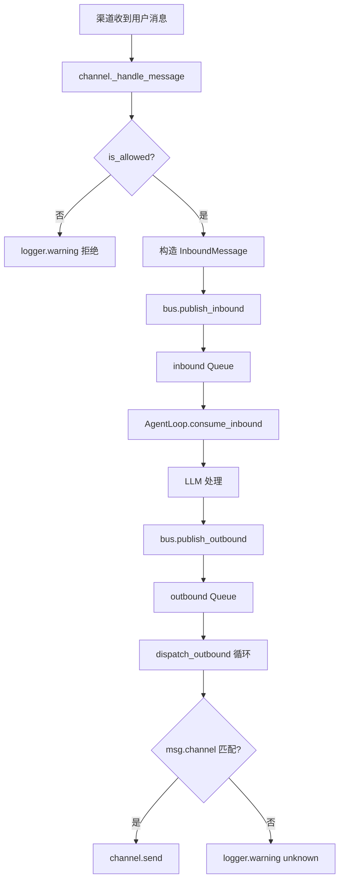
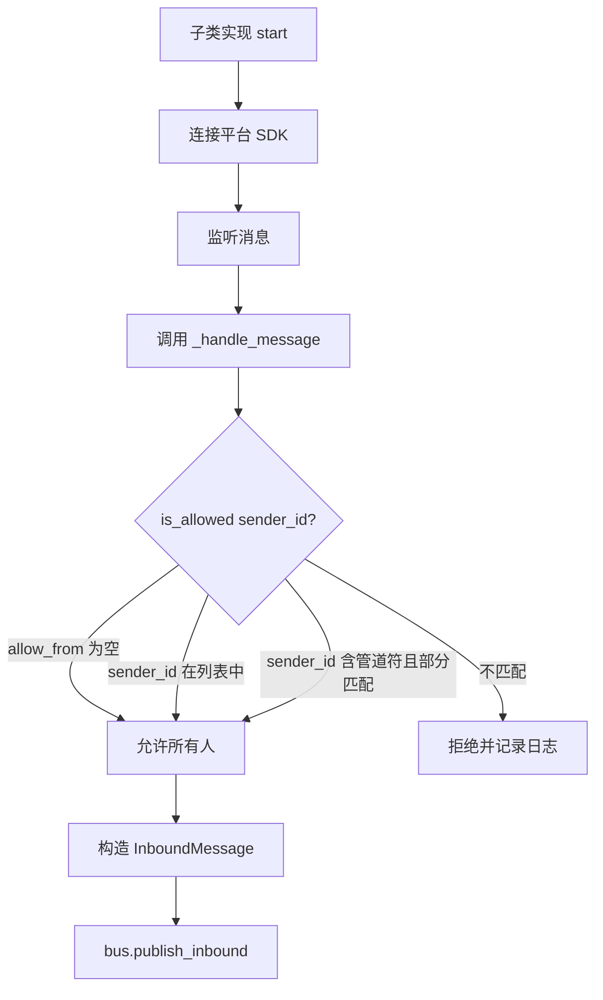
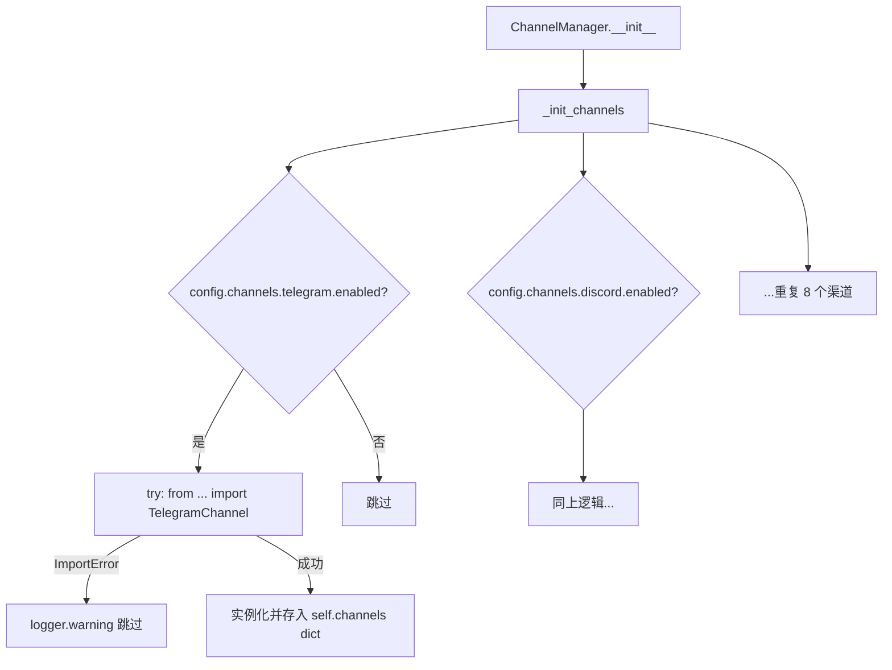

# PD-96.01 DeepCode — MessageBus 双队列解耦 + ChannelManager 多渠道路由

> 文档编号：PD-96.01
> 来源：DeepCode/nanobot `bus/queue.py` `channels/manager.py` `channels/base.py`
> GitHub：https://github.com/HKUDS/DeepCode.git
> 问题域：PD-96 多渠道消息路由 Multi-Channel Message Routing
> 状态：可复用方案

---

## 第 1 章 问题与动机

### 1.1 核心问题

当一个 AI Agent 需要同时接入 Telegram、Discord、Slack、WhatsApp、飞书、钉钉、QQ、Email 等 8+ 聊天平台时，面临三个核心挑战：

1. **耦合爆炸**：Agent 核心逻辑如果直接依赖每个渠道的 SDK，每新增一个渠道就要修改 Agent 代码，违反开闭原则
2. **异步协调**：不同渠道的消息到达速率、响应延迟差异巨大（Email 轮询 30s vs Telegram 实时推送），Agent 需要统一的消息消费模型
3. **生命周期独立性**：单个渠道的崩溃（如 Telegram token 过期）不应影响其他渠道的正常运行

### 1.2 DeepCode 的解法概述

DeepCode 的 nanobot 子项目采用经典的 **消息总线 + 渠道管理器** 双层架构：

1. **MessageBus 双队列解耦**（`nanobot/bus/queue.py:11-81`）：inbound/outbound 两个 `asyncio.Queue` 完全隔离 Agent 与渠道，渠道只需 `publish_inbound`，Agent 只需 `consume_inbound`
2. **BaseChannel 抽象接口**（`nanobot/channels/base.py:12-127`）：定义 `start/stop/send` 三个抽象方法 + `_handle_message` 模板方法 + `is_allowed` 权限检查
3. **ChannelManager 配置驱动初始化**（`nanobot/channels/manager.py:18-211`）：根据 `Config.channels` 中每个渠道的 `enabled` 字段动态实例化，延迟导入避免未安装 SDK 的渠道报错
4. **Outbound 分发循环**（`nanobot/channels/manager.py:175-195`）：ChannelManager 内部运行 `_dispatch_outbound` 协程，按 `msg.channel` 字段路由到目标渠道的 `send()` 方法
5. **Pydantic 配置模型**（`nanobot/config/schema.py:125-135`）：每个渠道有独立的 Config 类（含 `enabled`、`allow_from`、渠道特有参数），统一由 `ChannelsConfig` 聚合

### 1.3 设计思想

| 设计原则 | 具体实现 | 理由 | 替代方案 |
|----------|----------|------|----------|
| 中介者模式 | MessageBus 作为 Agent 与渠道的唯一通信中介 | 避免 N×M 直接依赖，新增渠道零修改 Agent | 观察者模式（需要 Agent 感知渠道存在） |
| 延迟导入 | `_init_channels` 中 `from nanobot.channels.telegram import ...` | 未安装 telegram SDK 时不影响其他渠道 | 全局导入（缺依赖直接崩溃） |
| 模板方法 | `BaseChannel._handle_message` 封装权限检查 + 消息构造 | 子类只需关注平台 SDK 对接，不重复写权限逻辑 | 每个渠道自行实现完整流程 |
| 配置驱动 | `enabled: bool` 字段控制渠道是否初始化 | 运维只改配置文件，不改代码 | 硬编码渠道列表 |
| 优雅降级 | `try/except ImportError` 包裹每个渠道初始化 | 单渠道依赖缺失只 warning，不阻塞启动 | 启动时全量校验依赖 |

---

## 第 2 章 源码实现分析

### 2.1 架构概览

```
┌─────────────────────────────────────────────────────────────────┐
│                        nanobot gateway                          │
│                                                                 │
│  ┌──────────┐    inbound     ┌────────────┐    outbound         │
│  │ Telegram  │──────────────→│            │──────────────→┐     │
│  │ Discord   │──publish──→   │ MessageBus │               │     │
│  │ Slack     │    Queue      │            │  ┌────────────┤     │
│  │ WhatsApp  │               │ inbound Q  │  │DispatchLoop│     │
│  │ 飞书      │               │ outbound Q │  │ (by channel│     │
│  │ 钉钉      │               └─────┬──────┘  │  name)     │     │
│  │ QQ       │                     │          └──────┬─────┘     │
│  │ Email    │    ┌────────────────┘                 │           │
│  └──────────┘    │ consume_inbound()                │           │
│       ↑          ▼                                  │           │
│       │    ┌───────────┐    publish_outbound()      │           │
│       │    │ AgentLoop  │──────────────────────────→│           │
│       │    │ (LLM core) │                           │           │
│       │    └───────────┘                            │           │
│       │                                             │           │
│       └──────── channel.send(msg) ←─────────────────┘           │
│                                                                 │
│  ┌──────────────────────────────────────────────────────────┐   │
│  │ ChannelManager                                            │   │
│  │  - _init_channels(): 配置驱动 + 延迟导入                    │   │
│  │  - start_all(): asyncio.gather 并行启动                    │   │
│  │  - stop_all(): 逐个优雅关闭                                │   │
│  │  - _dispatch_outbound(): 按 msg.channel 路由              │   │
│  └──────────────────────────────────────────────────────────┘   │
└─────────────────────────────────────────────────────────────────┘
```

### 2.2 核心实现

#### 2.2.1 MessageBus 双队列



对应源码 `nanobot/nanobot/bus/queue.py:11-81`：

```python
class MessageBus:
    """
    Async message bus that decouples chat channels from the agent core.
    """

    def __init__(self):
        self.inbound: asyncio.Queue[InboundMessage] = asyncio.Queue()
        self.outbound: asyncio.Queue[OutboundMessage] = asyncio.Queue()
        self._outbound_subscribers: dict[
            str, list[Callable[[OutboundMessage], Awaitable[None]]]
        ] = {}
        self._running = False

    async def publish_inbound(self, msg: InboundMessage) -> None:
        await self.inbound.put(msg)

    async def consume_inbound(self) -> InboundMessage:
        return await self.inbound.get()

    async def publish_outbound(self, msg: OutboundMessage) -> None:
        await self.outbound.put(msg)

    def subscribe_outbound(
        self, channel: str, callback: Callable[[OutboundMessage], Awaitable[None]]
    ) -> None:
        if channel not in self._outbound_subscribers:
            self._outbound_subscribers[channel] = []
        self._outbound_subscribers[channel].append(callback)

    async def dispatch_outbound(self) -> None:
        self._running = True
        while self._running:
            try:
                msg = await asyncio.wait_for(self.outbound.get(), timeout=1.0)
                subscribers = self._outbound_subscribers.get(msg.channel, [])
                for callback in subscribers:
                    try:
                        await callback(msg)
                    except Exception as e:
                        logger.error(f"Error dispatching to {msg.channel}: {e}")
            except asyncio.TimeoutError:
                continue
```

MessageBus 提供两种 outbound 分发模式：`subscribe_outbound`（pub/sub 回调）和 `consume_outbound`（直接消费）。ChannelManager 实际使用的是后者——自己运行 `_dispatch_outbound` 循环直接按 channel name 查找实例调用 `send()`。

#### 2.2.2 BaseChannel 抽象与权限控制



对应源码 `nanobot/nanobot/channels/base.py:12-127`：

```python
class BaseChannel(ABC):
    name: str = "base"

    def __init__(self, config: Any, bus: MessageBus):
        self.config = config
        self.bus = bus
        self._running = False

    @abstractmethod
    async def start(self) -> None: ...

    @abstractmethod
    async def stop(self) -> None: ...

    @abstractmethod
    async def send(self, msg: OutboundMessage) -> None: ...

    def is_allowed(self, sender_id: str) -> bool:
        allow_list = getattr(self.config, "allow_from", [])
        if not allow_list:
            return True
        sender_str = str(sender_id)
        if sender_str in allow_list:
            return True
        if "|" in sender_str:
            for part in sender_str.split("|"):
                if part and part in allow_list:
                    return True
        return False

    async def _handle_message(
        self, sender_id: str, chat_id: str, content: str,
        media: list[str] | None = None, metadata: dict[str, Any] | None = None,
    ) -> None:
        if not self.is_allowed(sender_id):
            logger.warning(f"Access denied for sender {sender_id} on channel {self.name}.")
            return
        msg = InboundMessage(
            channel=self.name, sender_id=str(sender_id),
            chat_id=str(chat_id), content=content,
            media=media or [], metadata=metadata or {},
        )
        await self.bus.publish_inbound(msg)
```

`is_allowed` 的管道符分割设计（`sender_id|username`）是为 Telegram 场景服务的——Telegram 的 `sender_id` 格式为 `numeric_id|username`，允许运维在 `allow_from` 中配置任一标识。

#### 2.2.3 ChannelManager 配置驱动初始化



对应源码 `nanobot/nanobot/channels/manager.py:39-128`：

```python
def _init_channels(self) -> None:
    # Telegram channel
    if self.config.channels.telegram.enabled:
        try:
            from nanobot.channels.telegram import TelegramChannel
            self.channels["telegram"] = TelegramChannel(
                self.config.channels.telegram, self.bus,
                groq_api_key=self.config.providers.groq.api_key,
                session_manager=self.session_manager,
            )
            logger.info("Telegram channel enabled")
        except ImportError as e:
            logger.warning(f"Telegram channel not available: {e}")

    # WhatsApp channel
    if self.config.channels.whatsapp.enabled:
        try:
            from nanobot.channels.whatsapp import WhatsAppChannel
            self.channels["whatsapp"] = WhatsAppChannel(
                self.config.channels.whatsapp, self.bus)
        except ImportError as e:
            logger.warning(f"WhatsApp channel not available: {e}")
    # ... 重复 discord/feishu/dingtalk/email/slack/qq
```

### 2.3 实现细节

**消息事件模型**（`nanobot/nanobot/bus/events.py:1-36`）：

`InboundMessage` 和 `OutboundMessage` 使用 `@dataclass` 定义，关键字段：
- `channel: str` — 渠道标识（"telegram"/"discord"/...），用于路由
- `session_key` 属性 — `f"{channel}:{chat_id}"` 格式，用于会话隔离
- `media: list[str]` — 媒体文件路径列表，支持图片/语音/文档
- `metadata: dict` — 渠道特有数据（如 Telegram 的 `message_id`、`username`）

**Gateway 启动编排**（`nanobot/nanobot/cli/commands.py:346-432`）：

```python
bus = MessageBus()
channels = ChannelManager(config, bus, session_manager=session_manager)
agent = AgentLoop(bus=bus, provider=provider, ...)

async def run():
    await asyncio.gather(
        agent.run(),          # 消费 inbound，产出 outbound
        channels.start_all(), # 启动所有渠道 + dispatch 循环
    )
```

`asyncio.gather` 并行启动 AgentLoop 和 ChannelManager，两者通过 MessageBus 的两个 Queue 完全解耦。AgentLoop 的 `run()` 方法（`agent/loop.py:128-154`）在循环中 `consume_inbound`，处理后 `publish_outbound`。

**Telegram 渠道的完整生命周期**（`nanobot/nanobot/channels/telegram.py:87-408`）：
- `start()`: 构建 Application → 注册 handler → `start_polling` → 阻塞等待
- `_on_message()`: 解析文本/图片/语音 → 下载媒体 → 语音转文字（Groq） → `_handle_message` 入总线
- `send()`: Markdown → Telegram HTML 转换 → 发送，失败时降级为纯文本
- `stop()`: 取消 typing 指示器 → 停止 updater → shutdown


---

## 第 3 章 迁移指南

### 3.1 迁移清单

**阶段 1：消息总线基础设施**
- [ ] 定义 `InboundMessage` / `OutboundMessage` 数据类（含 `channel`、`chat_id`、`content`、`media`、`metadata` 字段）
- [ ] 实现 `MessageBus`：双 `asyncio.Queue` + `publish/consume` 方法
- [ ] 在应用入口创建单例 `MessageBus`，注入到 Agent 和 ChannelManager

**阶段 2：渠道抽象层**
- [ ] 定义 `BaseChannel` ABC：`start()`、`stop()`、`send()` 三个抽象方法
- [ ] 实现 `_handle_message()` 模板方法（权限检查 + 消息构造 + 入队）
- [ ] 实现 `is_allowed()` 白名单检查（空列表 = 允许所有人）

**阶段 3：渠道实现**
- [ ] 为每个目标平台实现 `BaseChannel` 子类
- [ ] 每个渠道独立的 Pydantic Config 类（`enabled` + `allow_from` + 平台特有参数）
- [ ] 使用延迟导入（`try/except ImportError`）隔离 SDK 依赖

**阶段 4：管理器与编排**
- [ ] 实现 `ChannelManager`：配置驱动初始化 + `start_all/stop_all` + outbound 分发循环
- [ ] 在 gateway 入口用 `asyncio.gather` 并行启动 AgentLoop 和 ChannelManager

### 3.2 适配代码模板

以下代码可直接复用，实现最小可运行的多渠道消息路由：

```python
"""最小多渠道消息路由 — 可直接运行的模板"""
import asyncio
from abc import ABC, abstractmethod
from dataclasses import dataclass, field
from datetime import datetime
from typing import Any, Callable, Awaitable


# ── 消息事件 ──────────────────────────────────────────────

@dataclass
class InboundMessage:
    channel: str
    sender_id: str
    chat_id: str
    content: str
    timestamp: datetime = field(default_factory=datetime.now)
    media: list[str] = field(default_factory=list)
    metadata: dict[str, Any] = field(default_factory=dict)

    @property
    def session_key(self) -> str:
        return f"{self.channel}:{self.chat_id}"


@dataclass
class OutboundMessage:
    channel: str
    chat_id: str
    content: str
    reply_to: str | None = None
    media: list[str] = field(default_factory=list)
    metadata: dict[str, Any] = field(default_factory=dict)


# ── 消息总线 ──────────────────────────────────────────────

class MessageBus:
    def __init__(self):
        self.inbound: asyncio.Queue[InboundMessage] = asyncio.Queue()
        self.outbound: asyncio.Queue[OutboundMessage] = asyncio.Queue()
        self._running = False

    async def publish_inbound(self, msg: InboundMessage) -> None:
        await self.inbound.put(msg)

    async def consume_inbound(self) -> InboundMessage:
        return await self.inbound.get()

    async def publish_outbound(self, msg: OutboundMessage) -> None:
        await self.outbound.put(msg)

    async def consume_outbound(self) -> OutboundMessage:
        return await self.outbound.get()

    def stop(self) -> None:
        self._running = False


# ── 渠道抽象 ──────────────────────────────────────────────

class BaseChannel(ABC):
    name: str = "base"

    def __init__(self, config: Any, bus: MessageBus):
        self.config = config
        self.bus = bus
        self._running = False

    @abstractmethod
    async def start(self) -> None: ...

    @abstractmethod
    async def stop(self) -> None: ...

    @abstractmethod
    async def send(self, msg: OutboundMessage) -> None: ...

    def is_allowed(self, sender_id: str) -> bool:
        allow_list = getattr(self.config, "allow_from", [])
        if not allow_list:
            return True
        return str(sender_id) in allow_list

    async def _handle_message(
        self, sender_id: str, chat_id: str, content: str,
        media: list[str] | None = None,
        metadata: dict[str, Any] | None = None,
    ) -> None:
        if not self.is_allowed(sender_id):
            return
        msg = InboundMessage(
            channel=self.name, sender_id=str(sender_id),
            chat_id=str(chat_id), content=content,
            media=media or [], metadata=metadata or {},
        )
        await self.bus.publish_inbound(msg)

    @property
    def is_running(self) -> bool:
        return self._running


# ── 渠道管理器 ────────────────────────────────────────────

class ChannelManager:
    def __init__(self, channels: dict[str, BaseChannel], bus: MessageBus):
        self.channels = channels
        self.bus = bus
        self._dispatch_task: asyncio.Task | None = None

    async def start_all(self) -> None:
        self._dispatch_task = asyncio.create_task(self._dispatch_outbound())
        tasks = [asyncio.create_task(ch.start()) for ch in self.channels.values()]
        await asyncio.gather(*tasks, return_exceptions=True)

    async def stop_all(self) -> None:
        if self._dispatch_task:
            self._dispatch_task.cancel()
        for ch in self.channels.values():
            await ch.stop()

    async def _dispatch_outbound(self) -> None:
        while True:
            try:
                msg = await asyncio.wait_for(self.bus.consume_outbound(), timeout=1.0)
                channel = self.channels.get(msg.channel)
                if channel:
                    await channel.send(msg)
            except asyncio.TimeoutError:
                continue
            except asyncio.CancelledError:
                break
```

### 3.3 适用场景

| 场景 | 适用度 | 说明 |
|------|--------|------|
| 多平台聊天机器人 | ⭐⭐⭐ | 核心场景，8+ 渠道统一接入 |
| 单渠道 Agent | ⭐⭐ | 架构略重，但为未来扩展留余地 |
| 高吞吐消息系统 | ⭐⭐ | asyncio.Queue 无持久化，适合中等负载 |
| 需要消息持久化/重放 | ⭐ | 需替换为 Redis/Kafka 等持久化队列 |
| 微服务分布式部署 | ⭐ | 进程内 Queue 不跨进程，需引入外部消息中间件 |

---

## 第 4 章 测试用例

```python
"""基于 DeepCode nanobot 真实接口的测试用例"""
import asyncio
import pytest
from unittest.mock import AsyncMock, MagicMock


# 假设已按 3.2 模板实现
from your_project.bus import MessageBus, InboundMessage, OutboundMessage
from your_project.channels import BaseChannel, ChannelManager


class MockChannel(BaseChannel):
    """测试用 mock 渠道"""
    name = "mock"

    def __init__(self, bus: MessageBus):
        config = MagicMock(allow_from=[])
        super().__init__(config, bus)
        self.sent_messages: list[OutboundMessage] = []

    async def start(self) -> None:
        self._running = True

    async def stop(self) -> None:
        self._running = False

    async def send(self, msg: OutboundMessage) -> None:
        self.sent_messages.append(msg)


class TestMessageBus:
    """MessageBus 核心功能测试"""

    @pytest.mark.asyncio
    async def test_inbound_publish_consume(self):
        """正常路径：inbound 消息发布与消费"""
        bus = MessageBus()
        msg = InboundMessage(channel="test", sender_id="u1", chat_id="c1", content="hello")
        await bus.publish_inbound(msg)
        result = await asyncio.wait_for(bus.consume_inbound(), timeout=1.0)
        assert result.content == "hello"
        assert result.session_key == "test:c1"

    @pytest.mark.asyncio
    async def test_outbound_publish_consume(self):
        """正常路径：outbound 消息发布与消费"""
        bus = MessageBus()
        msg = OutboundMessage(channel="telegram", chat_id="123", content="reply")
        await bus.publish_outbound(msg)
        result = await asyncio.wait_for(bus.consume_outbound(), timeout=1.0)
        assert result.channel == "telegram"
        assert result.content == "reply"

    @pytest.mark.asyncio
    async def test_queue_ordering(self):
        """边界情况：消息保持 FIFO 顺序"""
        bus = MessageBus()
        for i in range(5):
            await bus.publish_inbound(
                InboundMessage(channel="t", sender_id="u", chat_id="c", content=f"msg-{i}")
            )
        for i in range(5):
            msg = await bus.consume_inbound()
            assert msg.content == f"msg-{i}"


class TestBaseChannel:
    """BaseChannel 权限与消息处理测试"""

    @pytest.mark.asyncio
    async def test_allow_all_when_empty_list(self):
        """allow_from 为空时允许所有人"""
        bus = MessageBus()
        ch = MockChannel(bus)
        ch.config.allow_from = []
        assert ch.is_allowed("anyone") is True

    @pytest.mark.asyncio
    async def test_deny_when_not_in_list(self):
        """sender 不在白名单中时拒绝"""
        bus = MessageBus()
        ch = MockChannel(bus)
        ch.config.allow_from = ["user1", "user2"]
        assert ch.is_allowed("user3") is False

    @pytest.mark.asyncio
    async def test_handle_message_publishes_to_bus(self):
        """_handle_message 将消息发布到 inbound 队列"""
        bus = MessageBus()
        ch = MockChannel(bus)
        await ch._handle_message(sender_id="u1", chat_id="c1", content="test")
        msg = await asyncio.wait_for(bus.consume_inbound(), timeout=1.0)
        assert msg.channel == "mock"
        assert msg.content == "test"

    @pytest.mark.asyncio
    async def test_handle_message_denied(self):
        """权限拒绝时不发布消息"""
        bus = MessageBus()
        ch = MockChannel(bus)
        ch.config.allow_from = ["allowed_user"]
        await ch._handle_message(sender_id="denied_user", chat_id="c1", content="test")
        assert bus.inbound.qsize() == 0


class TestChannelManager:
    """ChannelManager 路由与生命周期测试"""

    @pytest.mark.asyncio
    async def test_dispatch_routes_to_correct_channel(self):
        """outbound 消息路由到正确渠道"""
        bus = MessageBus()
        ch1 = MockChannel(bus)
        ch1.name = "telegram"
        ch2 = MockChannel(bus)
        ch2.name = "discord"

        mgr = ChannelManager({"telegram": ch1, "discord": ch2}, bus)
        dispatch_task = asyncio.create_task(mgr._dispatch_outbound())

        await bus.publish_outbound(
            OutboundMessage(channel="telegram", chat_id="123", content="hi tg")
        )
        await asyncio.sleep(0.1)

        assert len(ch1.sent_messages) == 1
        assert ch1.sent_messages[0].content == "hi tg"
        assert len(ch2.sent_messages) == 0

        dispatch_task.cancel()

    @pytest.mark.asyncio
    async def test_unknown_channel_no_crash(self):
        """降级行为：未知渠道不崩溃"""
        bus = MessageBus()
        mgr = ChannelManager({}, bus)
        dispatch_task = asyncio.create_task(mgr._dispatch_outbound())

        await bus.publish_outbound(
            OutboundMessage(channel="nonexistent", chat_id="x", content="lost")
        )
        await asyncio.sleep(0.1)
        # 不崩溃即通过
        dispatch_task.cancel()
```


---

## 第 5 章 跨域关联

| 关联域 | 关系类型 | 说明 |
|--------|----------|------|
| PD-03 容错与重试 | 协同 | ChannelManager 的 `_dispatch_outbound` 对单渠道 send 失败做 try/except 隔离，但无重试机制；可结合 PD-03 的 Tenacity 重试策略增强 |
| PD-04 工具系统 | 协同 | AgentLoop 通过 `MessageTool` 将 `bus.publish_outbound` 暴露为 LLM 可调用工具，Agent 可主动向任意渠道发消息 |
| PD-09 Human-in-the-Loop | 依赖 | 多渠道路由是 HITL 的基础设施——用户通过 Telegram/Slack 等渠道与 Agent 交互，审批/澄清消息经由同一 MessageBus 流转 |
| PD-10 中间件管道 | 协同 | BaseChannel._handle_message 可视为一个简化的中间件管道（权限检查 → 消息构造 → 入队），可扩展为完整的中间件链 |
| PD-11 可观测性 | 协同 | MessageBus 的 `inbound_size`/`outbound_size` 属性提供队列深度监控点，可接入 Prometheus 等指标系统 |

---

## 第 6 章 来源文件索引

| 文件 | 行范围 | 关键实现 |
|------|--------|----------|
| `nanobot/nanobot/bus/events.py` | L1-L36 | InboundMessage/OutboundMessage 数据类定义，session_key 属性 |
| `nanobot/nanobot/bus/queue.py` | L11-L81 | MessageBus 双队列实现，subscribe/dispatch outbound 模式 |
| `nanobot/nanobot/channels/base.py` | L12-L127 | BaseChannel ABC，is_allowed 白名单，_handle_message 模板方法 |
| `nanobot/nanobot/channels/manager.py` | L18-L211 | ChannelManager 配置驱动初始化，start_all/stop_all，_dispatch_outbound 路由 |
| `nanobot/nanobot/channels/telegram.py` | L87-L408 | TelegramChannel 完整实现：polling/send/typing/media/voice 转文字 |
| `nanobot/nanobot/config/schema.py` | L9-L135 | 8 个渠道的 Pydantic Config 类 + ChannelsConfig 聚合 |
| `nanobot/nanobot/cli/commands.py` | L346-L432 | Gateway 启动编排：MessageBus + ChannelManager + AgentLoop 的 asyncio.gather |
| `nanobot/nanobot/agent/loop.py` | L128-L154 | AgentLoop.run() 消费 inbound 队列，处理后 publish_outbound |

---

## 第 7 章 横向对比维度

```json comparison_data
{
  "project": "DeepCode",
  "dimensions": {
    "消息总线": "asyncio.Queue 双队列（inbound/outbound），进程内无持久化",
    "渠道抽象": "BaseChannel ABC 三方法（start/stop/send）+ _handle_message 模板方法",
    "路由机制": "ChannelManager._dispatch_outbound 按 msg.channel 字符串直接查 dict 路由",
    "渠道数量": "8 渠道（Telegram/Discord/Slack/WhatsApp/飞书/钉钉/QQ/Email）",
    "配置模型": "Pydantic BaseModel 每渠道独立 Config 类，enabled + allow_from 统一字段",
    "依赖隔离": "延迟导入 + try/except ImportError，缺 SDK 只 warning 不崩溃",
    "权限控制": "BaseChannel.is_allowed 白名单，支持管道符复合 ID 匹配"
  }
}
```

### 域元数据补充

```json domain_metadata
{
  "solution_summary": "DeepCode nanobot 用 asyncio.Queue 双队列 MessageBus 解耦 Agent 与 8 渠道，ChannelManager 配置驱动 + 延迟导入实现渠道热插拔",
  "description": "渠道 SDK 依赖隔离与优雅降级，确保单渠道故障不影响整体系统",
  "sub_problems": [
    "渠道 SDK 依赖隔离与延迟加载",
    "复合身份标识的白名单匹配（管道符分割）",
    "渠道内媒体文件下载与格式转换"
  ],
  "best_practices": [
    "延迟导入渠道 SDK 并 try/except ImportError 实现优雅降级",
    "消息事件用 session_key 属性统一会话标识格式"
  ]
}
```
