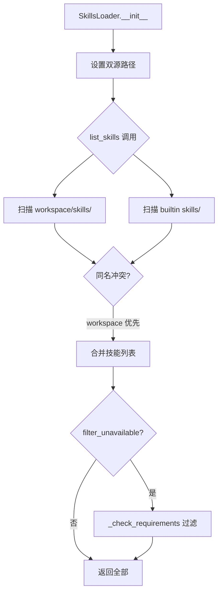
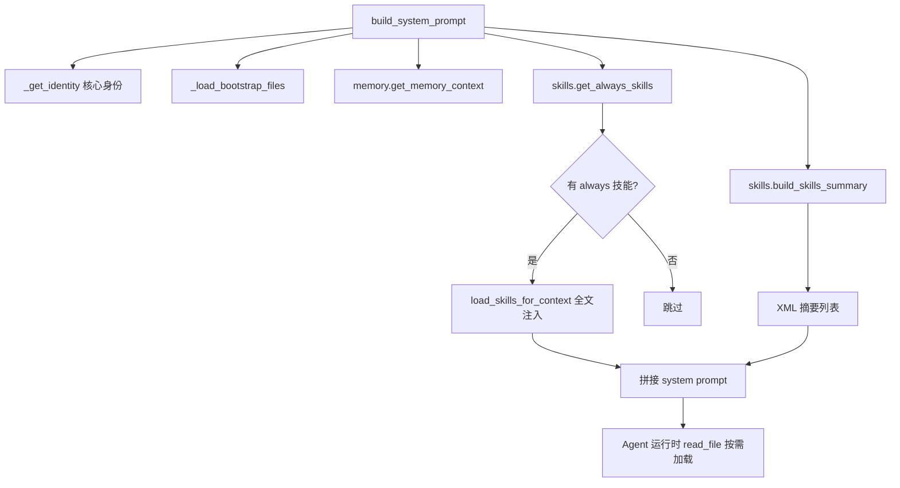
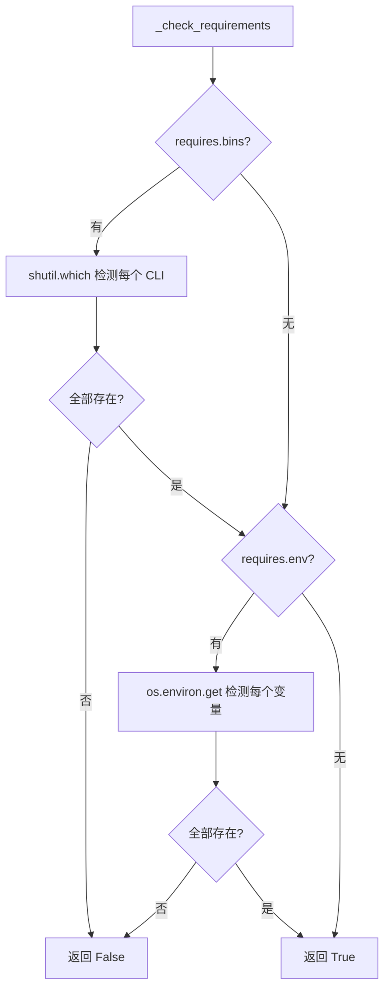

# PD-97.01 DeepCode (nanobot) — 三级渐进式技能加载系统

> 文档编号：PD-97.01
> 来源：DeepCode `nanobot/nanobot/agent/skills.py` `nanobot/nanobot/agent/context.py`
> GitHub：https://github.com/HKUDS/DeepCode.git
> 问题域：PD-97 技能系统 Skill System
> 状态：可复用方案

---

## 第 1 章 问题与动机

### 1.1 核心问题

Agent 系统需要在保持核心精简的同时支持无限扩展的能力。直接把所有能力硬编码到 system prompt 会导致：

1. **Context 膨胀**：每个技能的完整指令可能占 500-2000 tokens，10 个技能就吃掉大量上下文窗口
2. **能力耦合**：新增/修改一个技能需要改动核心代码，违反开闭原则
3. **环境依赖**：不同部署环境可用的工具不同（有的有 `gh` CLI，有的没有），硬编码会导致无效指令污染 prompt
4. **用户定制困难**：用户无法在不修改源码的情况下添加自己的领域技能

这些问题的本质是：**如何让 Agent 的能力像插件一样可插拔，同时不浪费宝贵的 context window？**

### 1.2 DeepCode (nanobot) 的解法概述

nanobot 实现了一套完整的三级渐进式技能系统：

1. **SKILL.md 标准化定义**：每个技能是一个目录，包含 `SKILL.md`（YAML frontmatter + Markdown 指令），可选包含 `scripts/`、`references/`、`assets/` 资源（`nanobot/nanobot/skills/skill-creator/SKILL.md:46-61`）
2. **双源发现与优先级覆盖**：SkillsLoader 从 workspace/skills（用户自定义，高优先级）和 builtin skills（内置，低优先级）两个目录发现技能，workspace 可覆盖同名内置技能（`nanobot/nanobot/agent/skills.py:38-56`）
3. **三级渐进加载**：Level 1 = 元数据摘要（name + description，始终在 context 中，~100 tokens/技能）；Level 2 = always-loaded 技能全文注入 system prompt；Level 3 = 按需加载，Agent 通过 `read_file` 工具自主读取完整 SKILL.md（`nanobot/nanobot/agent/context.py:53-69`）
4. **运行时依赖检测**：每个技能可声明 `requires.bins`（CLI 工具）和 `requires.env`（环境变量），SkillsLoader 在加载前用 `shutil.which()` 和 `os.environ.get()` 检测，不满足的标记为 unavailable（`nanobot/nanobot/agent/skills.py:181-190`）
5. **工具与技能分离**：技能（SKILL.md）提供知识和指令，工具（Tool 子类）提供执行能力，两者通过 ToolRegistry 和 ContextBuilder 分别管理，互不耦合（`nanobot/nanobot/agent/loop.py:85-126`）

### 1.3 设计思想

| 设计原则 | 具体实现 | 理由 | 替代方案 |
|----------|----------|------|----------|
| 渐进式披露 | 三级加载：摘要→always→按需 read_file | context window 是公共资源，只加载当前需要的 | 全量加载所有技能（浪费 context） |
| 约定优于配置 | `{name}/SKILL.md` 目录约定 | 零配置发现，新增技能只需创建目录 | 中心化注册表（需要维护映射） |
| 用户空间优先 | workspace skills 覆盖 builtin skills | 用户定制不需要修改源码 | 只支持内置技能（不可扩展） |
| 运行时感知 | `shutil.which()` + `os.environ.get()` 检测 | 避免向 Agent 暴露不可用的能力 | 静态配置（环境变化时失效） |
| 知识与执行分离 | SKILL.md（知识）vs Tool（执行） | 技能可以不依赖代码，纯 Markdown 即可扩展 | 技能即代码（门槛高） |

---

## 第 2 章 源码实现分析

### 2.1 架构概览

nanobot 的技能系统由四个核心组件协作：

```
┌─────────────────────────────────────────────────────────┐
│                    AgentLoop (loop.py)                    │
│  ┌──────────────┐  ┌──────────────┐  ┌───────────────┐  │
│  │ ToolRegistry │  │ContextBuilder│  │ SubagentMgr   │  │
│  │  (执行层)     │  │  (知识层)     │  │  (委托层)      │  │
│  └──────┬───────┘  └──────┬───────┘  └───────────────┘  │
│         │                 │                               │
│    Tool 子类          SkillsLoader                        │
│  ┌──────┴───────┐  ┌──────┴───────┐                      │
│  │ ReadFile     │  │ builtin/     │                      │
│  │ WriteFile    │  │  ├─ deepcode/ │                      │
│  │ Exec         │  │  ├─ github/  │                      │
│  │ WebSearch    │  │  ├─ cron/    │                      │
│  │ DeepCode×6   │  │  └─ ...     │                      │
│  └──────────────┘  │ workspace/   │                      │
│                    │  └─ 用户技能  │                      │
│                    └──────────────┘                      │
└─────────────────────────────────────────────────────────┘
```

关键设计：ToolRegistry 管理可执行工具（Python 类），SkillsLoader 管理知识技能（Markdown 文件）。两者在 ContextBuilder.build_system_prompt() 中汇合，共同构成 Agent 的 system prompt。

### 2.2 核心实现

#### 2.2.1 SkillsLoader — 技能发现与加载引擎



对应源码 `nanobot/nanobot/agent/skills.py:12-61`：

```python
class SkillsLoader:
    """Loader for agent skills. Skills are markdown files (SKILL.md)
    that teach the agent how to use specific tools or perform certain tasks."""

    def __init__(self, workspace: Path, builtin_skills_dir: Path | None = None):
        self.workspace = workspace
        self.workspace_skills = workspace / "skills"
        self.builtin_skills = builtin_skills_dir or BUILTIN_SKILLS_DIR

    def list_skills(self, filter_unavailable: bool = True) -> list[dict[str, str]]:
        skills = []
        # Workspace skills (highest priority)
        if self.workspace_skills.exists():
            for skill_dir in self.workspace_skills.iterdir():
                if skill_dir.is_dir():
                    skill_file = skill_dir / "SKILL.md"
                    if skill_file.exists():
                        skills.append({"name": skill_dir.name,
                                       "path": str(skill_file), "source": "workspace"})
        # Built-in skills (skip if workspace has same name)
        if self.builtin_skills and self.builtin_skills.exists():
            for skill_dir in self.builtin_skills.iterdir():
                if skill_dir.is_dir():
                    skill_file = skill_dir / "SKILL.md"
                    if skill_file.exists() and not any(
                        s["name"] == skill_dir.name for s in skills
                    ):
                        skills.append({"name": skill_dir.name,
                                       "path": str(skill_file), "source": "builtin"})
        if filter_unavailable:
            return [s for s in skills
                    if self._check_requirements(self._get_skill_meta(s["name"]))]
        return skills
```

核心设计点：workspace skills 先扫描并加入列表，builtin skills 扫描时用 `not any(s["name"] == skill_dir.name for s in skills)` 跳过同名项，实现用户覆盖。

#### 2.2.2 三级渐进加载 — ContextBuilder 集成



对应源码 `nanobot/nanobot/agent/context.py:28-71`：

```python
def build_system_prompt(self, skill_names: list[str] | None = None) -> str:
    parts = []
    parts.append(self._get_identity())
    bootstrap = self._load_bootstrap_files()
    if bootstrap:
        parts.append(bootstrap)
    memory = self.memory.get_memory_context()
    if memory:
        parts.append(f"# Memory\n\n{memory}")

    # Level 2: Always-loaded skills — 全文注入
    always_skills = self.skills.get_always_skills()
    if always_skills:
        always_content = self.skills.load_skills_for_context(always_skills)
        if always_content:
            parts.append(f"# Active Skills\n\n{always_content}")

    # Level 1: Available skills — 仅摘要，Agent 用 read_file 按需加载
    skills_summary = self.skills.build_skills_summary()
    if skills_summary:
        parts.append(f"""# Skills

The following skills extend your capabilities. To use a skill,
read its SKILL.md file using the read_file tool.
Skills with available="false" need dependencies installed first.

{skills_summary}""")

    return "\n\n---\n\n".join(parts)
```

#### 2.2.3 运行时依赖检测



对应源码 `nanobot/nanobot/agent/skills.py:181-190`：

```python
def _check_requirements(self, skill_meta: dict) -> bool:
    """Check if skill requirements are met (bins, env vars)."""
    requires = skill_meta.get("requires", {})
    for b in requires.get("bins", []):
        if not shutil.which(b):
            return False
    for env in requires.get("env", []):
        if not os.environ.get(env):
            return False
    return True
```

### 2.3 实现细节

#### SKILL.md Frontmatter 解析

技能元数据存储在 YAML frontmatter 中，nanobot 使用轻量级自实现解析器（不依赖 PyYAML）：

```python
# skills.py:207-232
def get_skill_metadata(self, name: str) -> dict | None:
    content = self.load_skill(name)
    if not content:
        return None
    if content.startswith("---"):
        match = re.match(r"^---\n(.*?)\n---", content, re.DOTALL)
        if match:
            metadata = {}
            for line in match.group(1).split("\n"):
                if ":" in line:
                    key, value = line.split(":", 1)
                    metadata[key.strip()] = value.strip().strip("\"'")
            return metadata
    return None
```

nanobot metadata 嵌套在 frontmatter 的 `metadata` 字段中，以 JSON 字符串形式存储：

```yaml
---
name: github
description: "Interact with GitHub using the `gh` CLI..."
metadata: {"nanobot":{"emoji":"🐙","requires":{"bins":["gh"]},"always":false}}
---
```

这种设计让 frontmatter 保持简单的 key-value 格式，同时通过 JSON 嵌套支持复杂的元数据结构。

#### XML 格式技能摘要

`build_skills_summary()` 输出 XML 格式的技能列表（`skills.py:105-144`），包含可用性状态和缺失依赖提示：

```xml
<skills>
  <skill available="true">
    <name>github</name>
    <description>Interact with GitHub using the `gh` CLI...</description>
    <location>/path/to/skills/github/SKILL.md</location>
  </skill>
  <skill available="false">
    <name>summarize</name>
    <description>Summarize URLs, files, and videos</description>
    <location>/path/to/skills/summarize/SKILL.md</location>
    <requires>CLI: summarize</requires>
  </skill>
</skills>
```

Agent 看到这个摘要后，可以自主决定是否用 `read_file` 加载某个技能的完整内容。

#### 工具注册与条件加载

AgentLoop 在 `_register_default_tools()` 中展示了工具的条件注册模式（`loop.py:85-126`）：

- 文件/Shell/Web 工具：始终注册
- Cron 工具：仅当 `cron_service` 存在时注册
- DeepCode 工具：仅当 `DEEPCODE_API_URL` 环境变量存在时注册

```python
# loop.py:119-126
deepcode_url = os.environ.get("DEEPCODE_API_URL")
if deepcode_url:
    from nanobot.agent.tools.deepcode import create_all_tools
    for tool in create_all_tools(api_url=deepcode_url):
        self.tools.register(tool)
```

这与技能的 `_check_requirements` 形成互补：工具层面的条件注册 + 技能层面的依赖检测，双重保障不向 Agent 暴露不可用能力。

---

## 第 3 章 迁移指南

### 3.1 迁移清单

#### 阶段 1：基础技能加载器（1 个文件）

- [ ] 创建 `SkillsLoader` 类，支持从指定目录扫描 `{name}/SKILL.md`
- [ ] 实现 YAML frontmatter 解析（name + description 提取）
- [ ] 实现 `load_skill(name)` 返回完整 Markdown 内容
- [ ] 实现 `list_skills()` 返回技能列表

#### 阶段 2：渐进式加载（集成到 prompt 构建）

- [ ] 实现 `build_skills_summary()` 生成技能摘要（XML/JSON 格式）
- [ ] 实现 `get_always_skills()` 识别 always-loaded 技能
- [ ] 在 system prompt 构建中集成三级加载逻辑
- [ ] 确保 Agent 有 `read_file` 工具可按需加载技能全文

#### 阶段 3：依赖检测与双源覆盖

- [ ] 实现 `_check_requirements()` 检测 bins 和 env 依赖
- [ ] 支持 workspace skills 覆盖 builtin skills
- [ ] 在摘要中标注不可用技能及缺失依赖

### 3.2 适配代码模板

以下是一个可直接复用的最小化技能加载器实现：

```python
"""Minimal skill loader — 可直接复用到任何 Agent 项目。"""

import json
import os
import re
import shutil
from pathlib import Path
from typing import Any


class SkillsLoader:
    """三级渐进式技能加载器。"""

    def __init__(
        self,
        workspace_skills: Path,
        builtin_skills: Path | None = None,
    ):
        self.workspace_skills = workspace_skills
        self.builtin_skills = builtin_skills

    # ── 发现 ──────────────────────────────────────────────

    def list_skills(self, filter_unavailable: bool = True) -> list[dict[str, Any]]:
        """扫描双源目录，返回技能列表。workspace 优先。"""
        skills: list[dict[str, Any]] = []
        seen_names: set[str] = set()

        for source, base_dir in [
            ("workspace", self.workspace_skills),
            ("builtin", self.builtin_skills),
        ]:
            if not base_dir or not base_dir.exists():
                continue
            for skill_dir in sorted(base_dir.iterdir()):
                skill_file = skill_dir / "SKILL.md"
                if skill_dir.is_dir() and skill_file.exists() and skill_dir.name not in seen_names:
                    meta = self._parse_frontmatter(skill_file)
                    skills.append({
                        "name": skill_dir.name,
                        "path": str(skill_file),
                        "source": source,
                        "meta": meta,
                    })
                    seen_names.add(skill_dir.name)

        if filter_unavailable:
            skills = [s for s in skills if self._check_requirements(s["meta"])]
        return skills

    # ── 加载 ──────────────────────────────────────────────

    def load_skill(self, name: str) -> str | None:
        """按名称加载技能全文（workspace 优先）。"""
        for base in [self.workspace_skills, self.builtin_skills]:
            if base:
                path = base / name / "SKILL.md"
                if path.exists():
                    return path.read_text(encoding="utf-8")
        return None

    def load_for_context(self, names: list[str]) -> str:
        """加载多个技能，去除 frontmatter，拼接为 context 片段。"""
        parts = []
        for name in names:
            content = self.load_skill(name)
            if content:
                body = re.sub(r"^---\n.*?\n---\n", "", content, flags=re.DOTALL).strip()
                parts.append(f"### Skill: {name}\n\n{body}")
        return "\n\n---\n\n".join(parts)

    # ── 摘要（Level 1）──────────────────────────────────

    def build_summary(self) -> str:
        """构建 XML 格式技能摘要，供 Agent 决定是否按需加载。"""
        all_skills = self.list_skills(filter_unavailable=False)
        if not all_skills:
            return ""
        lines = ["<skills>"]
        for s in all_skills:
            available = self._check_requirements(s["meta"])
            desc = s["meta"].get("description", s["name"])
            lines.append(f'  <skill name="{s["name"]}" available="{str(available).lower()}">')
            lines.append(f"    <description>{desc}</description>")
            lines.append(f"    <location>{s['path']}</location>")
            if not available:
                missing = self._get_missing(s["meta"])
                if missing:
                    lines.append(f"    <requires>{missing}</requires>")
            lines.append("  </skill>")
        lines.append("</skills>")
        return "\n".join(lines)

    # ── always-loaded（Level 2）──────────────────────────

    def get_always_skills(self) -> list[str]:
        """返回标记为 always=true 且依赖满足的技能名列表。"""
        result = []
        for s in self.list_skills(filter_unavailable=True):
            nanobot_meta = self._get_nanobot_meta(s["meta"])
            if nanobot_meta.get("always"):
                result.append(s["name"])
        return result

    # ── 依赖检测 ─────────────────────────────────────────

    def _check_requirements(self, meta: dict) -> bool:
        nanobot = self._get_nanobot_meta(meta)
        requires = nanobot.get("requires", {})
        return all(shutil.which(b) for b in requires.get("bins", [])) and \
               all(os.environ.get(e) for e in requires.get("env", []))

    def _get_missing(self, meta: dict) -> str:
        nanobot = self._get_nanobot_meta(meta)
        requires = nanobot.get("requires", {})
        missing = []
        missing.extend(f"CLI: {b}" for b in requires.get("bins", []) if not shutil.which(b))
        missing.extend(f"ENV: {e}" for e in requires.get("env", []) if not os.environ.get(e))
        return ", ".join(missing)

    # ── 元数据解析 ───────────────────────────────────────

    @staticmethod
    def _parse_frontmatter(path: Path) -> dict:
        content = path.read_text(encoding="utf-8")
        if not content.startswith("---"):
            return {}
        match = re.match(r"^---\n(.*?)\n---", content, re.DOTALL)
        if not match:
            return {}
        meta = {}
        for line in match.group(1).split("\n"):
            if ":" in line:
                key, value = line.split(":", 1)
                meta[key.strip()] = value.strip().strip("\"'")
        return meta

    @staticmethod
    def _get_nanobot_meta(meta: dict) -> dict:
        raw = meta.get("metadata", "")
        try:
            data = json.loads(raw)
            return data.get("nanobot", {}) if isinstance(data, dict) else {}
        except (json.JSONDecodeError, TypeError):
            return {}
```

### 3.3 适用场景

| 场景 | 适用度 | 说明 |
|------|--------|------|
| 通用 Agent 框架扩展 | ⭐⭐⭐ | 任何需要插件式能力扩展的 Agent 系统 |
| CLI Agent（如 Claude Code） | ⭐⭐⭐ | 天然适配文件系统技能发现 |
| 多租户 Agent 平台 | ⭐⭐⭐ | workspace 隔离 + 内置技能共享 |
| 聊天机器人 | ⭐⭐ | 适用，但需要额外的触发词匹配逻辑 |
| 无文件系统的 Agent | ⭐ | 需要改造为 API/DB 存储后端 |

---

## 第 4 章 测试用例

```python
"""Tests for SkillsLoader — 基于 nanobot 真实函数签名。"""

import json
import os
from pathlib import Path
from unittest.mock import patch

import pytest


@pytest.fixture
def skill_dirs(tmp_path: Path):
    """创建测试用技能目录结构。"""
    # Builtin skills
    builtin = tmp_path / "builtin"
    (builtin / "github" / "SKILL.md").parent.mkdir(parents=True)
    (builtin / "github" / "SKILL.md").write_text(
        '---\nname: github\ndescription: "GitHub CLI integration"\n'
        'metadata: {"nanobot":{"requires":{"bins":["gh"]}}}\n---\n\n# GitHub\nUse gh CLI.'
    )
    (builtin / "weather" / "SKILL.md").parent.mkdir(parents=True)
    (builtin / "weather" / "SKILL.md").write_text(
        '---\nname: weather\ndescription: "Weather info"\nmetadata: {"nanobot":{}}\n---\n\n# Weather'
    )
    (builtin / "deepcode" / "SKILL.md").parent.mkdir(parents=True)
    (builtin / "deepcode" / "SKILL.md").write_text(
        '---\nname: deepcode\ndescription: "DeepCode integration"\n'
        'metadata: {"nanobot":{"always":true}}\n---\n\n# DeepCode\nPaper2Code.'
    )

    # Workspace skills (override github)
    workspace = tmp_path / "workspace" / "skills"
    (workspace / "github" / "SKILL.md").parent.mkdir(parents=True)
    (workspace / "github" / "SKILL.md").write_text(
        '---\nname: github\ndescription: "Custom GitHub skill"\nmetadata: {"nanobot":{}}\n---\n\n# My GitHub'
    )
    (workspace / "my-tool" / "SKILL.md").parent.mkdir(parents=True)
    (workspace / "my-tool" / "SKILL.md").write_text(
        '---\nname: my-tool\ndescription: "Custom tool"\nmetadata: {"nanobot":{}}\n---\n\n# My Tool'
    )

    return {"builtin": builtin, "workspace": tmp_path / "workspace"}


class TestSkillDiscovery:
    """技能发现与优先级测试。"""

    def test_workspace_overrides_builtin(self, skill_dirs):
        from nanobot.agent.skills import SkillsLoader
        loader = SkillsLoader(
            workspace=skill_dirs["workspace"],
            builtin_skills_dir=skill_dirs["builtin"],
        )
        skills = loader.list_skills(filter_unavailable=False)
        github_skills = [s for s in skills if s["name"] == "github"]
        assert len(github_skills) == 1
        assert github_skills[0]["source"] == "workspace"

    def test_lists_both_sources(self, skill_dirs):
        from nanobot.agent.skills import SkillsLoader
        loader = SkillsLoader(
            workspace=skill_dirs["workspace"],
            builtin_skills_dir=skill_dirs["builtin"],
        )
        skills = loader.list_skills(filter_unavailable=False)
        names = {s["name"] for s in skills}
        assert names == {"github", "weather", "deepcode", "my-tool"}


class TestRequirementsCheck:
    """依赖检测测试。"""

    def test_missing_bin_marks_unavailable(self, skill_dirs):
        from nanobot.agent.skills import SkillsLoader
        loader = SkillsLoader(
            workspace=skill_dirs["workspace"],
            builtin_skills_dir=skill_dirs["builtin"],
        )
        # gh 不存在时，builtin github 被过滤（但 workspace github 无 requires 所以保留）
        with patch("shutil.which", side_effect=lambda x: None if x == "gh" else "/usr/bin/" + x):
            skills = loader.list_skills(filter_unavailable=True)
            # workspace github 没有 requires.bins，所以不受影响
            names = {s["name"] for s in skills}
            assert "my-tool" in names

    def test_all_requirements_met(self, skill_dirs):
        from nanobot.agent.skills import SkillsLoader
        loader = SkillsLoader(
            workspace=skill_dirs["workspace"],
            builtin_skills_dir=skill_dirs["builtin"],
        )
        with patch("shutil.which", return_value="/usr/bin/gh"):
            skills = loader.list_skills(filter_unavailable=True)
            assert len(skills) >= 3


class TestProgressiveLoading:
    """三级渐进加载测试。"""

    def test_always_skills_detected(self, skill_dirs):
        from nanobot.agent.skills import SkillsLoader
        loader = SkillsLoader(
            workspace=skill_dirs["workspace"],
            builtin_skills_dir=skill_dirs["builtin"],
        )
        always = loader.get_always_skills()
        assert "deepcode" in always

    def test_skills_summary_xml_format(self, skill_dirs):
        from nanobot.agent.skills import SkillsLoader
        loader = SkillsLoader(
            workspace=skill_dirs["workspace"],
            builtin_skills_dir=skill_dirs["builtin"],
        )
        summary = loader.build_skills_summary()
        assert "<skills>" in summary
        assert "</skills>" in summary
        assert "available=" in summary

    def test_load_skill_strips_frontmatter(self, skill_dirs):
        from nanobot.agent.skills import SkillsLoader
        loader = SkillsLoader(
            workspace=skill_dirs["workspace"],
            builtin_skills_dir=skill_dirs["builtin"],
        )
        content = loader.load_skills_for_context(["deepcode"])
        assert "---" not in content  # frontmatter 已去除
        assert "DeepCode" in content


class TestDegradation:
    """降级行为测试。"""

    def test_empty_skills_dir(self, tmp_path):
        from nanobot.agent.skills import SkillsLoader
        loader = SkillsLoader(workspace=tmp_path)
        assert loader.list_skills() == []
        assert loader.build_skills_summary() == ""
        assert loader.get_always_skills() == []

    def test_load_nonexistent_skill(self, skill_dirs):
        from nanobot.agent.skills import SkillsLoader
        loader = SkillsLoader(
            workspace=skill_dirs["workspace"],
            builtin_skills_dir=skill_dirs["builtin"],
        )
        assert loader.load_skill("nonexistent") is None
```

---

## 第 5 章 跨域关联

| 关联域 | 关系类型 | 说明 |
|--------|----------|------|
| PD-01 上下文管理 | 协同 | 三级渐进加载的核心目标就是节省 context window；always-loaded 技能数量直接影响可用上下文 |
| PD-04 工具系统 | 依赖 | 技能（SKILL.md）提供知识指令，工具（Tool 子类 + ToolRegistry）提供执行能力，两者互补 |
| PD-06 记忆持久化 | 协同 | ContextBuilder 同时集成 MemoryStore 和 SkillsLoader，记忆和技能共享 system prompt 空间 |
| PD-09 Human-in-the-Loop | 协同 | skill-creator 技能本身就是一个 HITL 流程（6 步创建过程需要用户反馈） |
| PD-10 中间件管道 | 类比 | 技能的三级加载可视为一种 prompt 构建管道：identity → bootstrap → memory → always skills → summary |

---

## 第 6 章 来源文件索引

| 文件 | 行范围 | 关键实现 |
|------|--------|----------|
| `nanobot/nanobot/agent/skills.py` | L1-L233 | SkillsLoader 完整实现：发现、加载、摘要、依赖检测 |
| `nanobot/nanobot/agent/context.py` | L1-L230 | ContextBuilder：三级加载集成到 system prompt |
| `nanobot/nanobot/agent/tools/base.py` | L1-L105 | Tool 抽象基类：name/description/parameters/execute |
| `nanobot/nanobot/agent/tools/registry.py` | L1-L74 | ToolRegistry：动态注册/注销/执行 |
| `nanobot/nanobot/agent/loop.py` | L85-L126 | AgentLoop._register_default_tools：条件工具注册 |
| `nanobot/nanobot/skills/deepcode/SKILL.md` | L1-L78 | always-loaded 技能示例（DeepCode 集成） |
| `nanobot/nanobot/skills/github/SKILL.md` | L1-L49 | 带依赖检测的技能示例（requires bins: gh） |
| `nanobot/nanobot/skills/skill-creator/SKILL.md` | L1-L372 | 技能创建指南（定义了 SKILL.md 标准格式） |
| `nanobot/nanobot/skills/summarize/SKILL.md` | L1-L68 | 带安装指引的技能示例（requires bins: summarize） |
| `nanobot/nanobot/skills/cron/SKILL.md` | L1-L41 | 最简技能示例（无依赖声明） |

---

## 第 7 章 横向对比维度

```json comparison_data
{
  "project": "DeepCode",
  "dimensions": {
    "技能定义格式": "SKILL.md（YAML frontmatter + Markdown body），目录约定发现",
    "加载策略": "三级渐进：元数据摘要 → always 全文注入 → Agent read_file 按需加载",
    "依赖检测": "运行时 shutil.which + os.environ.get 双重检测，不满足标记 unavailable",
    "用户扩展": "workspace/skills 目录覆盖 builtin skills，零代码新增技能",
    "技能资源": "支持 scripts/references/assets 三类捆绑资源，渐进式披露",
    "工具集成": "技能（知识层）与工具（执行层）分离，ToolRegistry 独立管理"
  }
}
```

### 域元数据补充

```json domain_metadata
{
  "solution_summary": "DeepCode nanobot 用 SkillsLoader 实现三级渐进式技能加载（摘要→always注入→read_file按需），支持 workspace 覆盖 builtin、运行时依赖检测、SKILL.md 标准化定义",
  "description": "Agent 能力的插件化扩展与 context-aware 渐进加载机制",
  "sub_problems": [
    "技能资源捆绑（scripts/references/assets 三类资源管理）",
    "技能创建工作流（从理解→规划→初始化→编辑→打包→迭代的标准化流程）",
    "技能摘要格式选择（XML vs JSON vs 纯文本对 LLM 的解析友好度）"
  ],
  "best_practices": [
    "workspace 技能覆盖 builtin 技能实现零代码用户定制",
    "技能与工具分离：SKILL.md 提供知识，Tool 类提供执行，互不耦合",
    "运行时双重依赖检测（CLI bins + 环境变量）避免暴露不可用能力"
  ]
}
```
