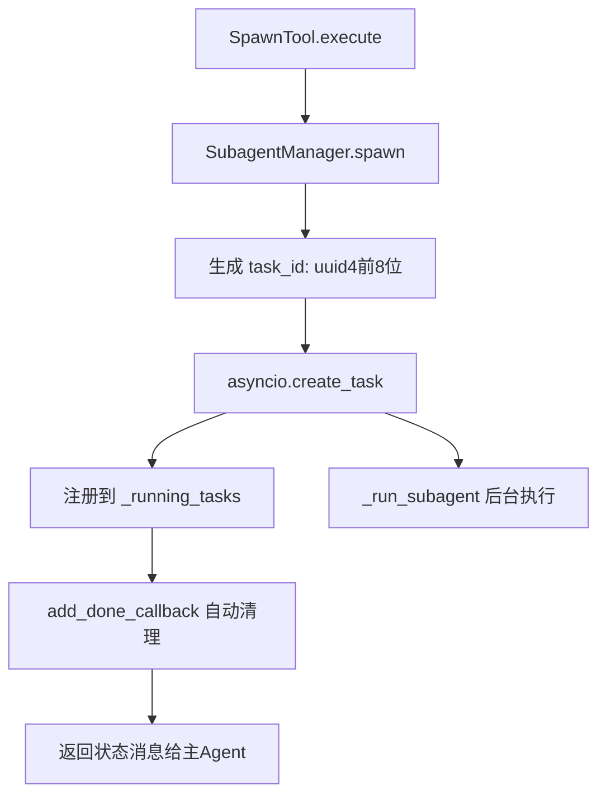
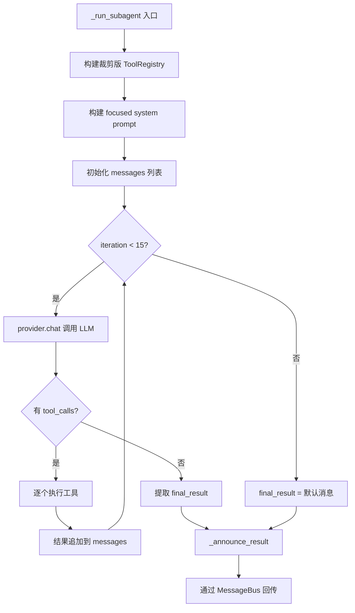

# PD-98.01 DeepCode — SubagentManager 后台子Agent委托

> 文档编号：PD-98.01
> 来源：DeepCode (nanobot) `nanobot/nanobot/agent/subagent.py`
> GitHub：https://github.com/HKUDS/DeepCode.git
> 问题域：PD-98 子Agent委托 Subagent Delegation
> 状态：可复用方案

---

## 第 1 章 问题与动机

### 1.1 核心问题

在 Agent 系统中，主 Agent 经常需要将耗时或独立的子任务委托给后台执行，而不阻塞当前对话流。核心挑战包括：

1. **上下文污染**：子任务的中间推理步骤不应混入主对话历史，否则会消耗 context window 并干扰主线对话质量
2. **资源复用**：每个子任务都创建完整的 LLM 客户端实例会造成连接池浪费和 API key 管理复杂化
3. **结果路由**：子任务完成后需要将结果准确路由回发起请求的原始渠道（可能是 Telegram、Slack、CLI 等不同来源）
4. **工具权限隔离**：子 Agent 不应拥有与主 Agent 相同的全部能力（如不能再 spawn 子 Agent、不能直接发消息给用户）
5. **生命周期管理**：需要追踪运行中的子任务，处理超时和异常，避免僵尸任务

### 1.2 DeepCode 的解法概述

DeepCode 的 nanobot 框架通过 `SubagentManager` 类实现了一套轻量级后台子 Agent 委托方案：

1. **共享 LLM Provider 单例**：子 Agent 复用主 Agent 的 `LLMProvider` 实例，避免重复创建连接（`subagent.py:46`）
2. **asyncio.Task 原生并发**：每个子任务是一个 `asyncio.Task`，利用 Python 原生协程调度，无需额外的任务队列中间件（`subagent.py:83`）
3. **MessageBus 异步结果回传**：子 Agent 完成后通过 `MessageBus.publish_inbound()` 将结果注入为系统消息，触发主 Agent 重新处理并路由到原始渠道（`subagent.py:220`）
4. **工具集裁剪**：子 Agent 拥有独立的 `ToolRegistry`，注册了文件/Shell/Web 工具但**排除了 message 和 spawn 工具**，防止递归 spawn 和越权通信（`subagent.py:103-117`）
5. **focused system prompt**：每个子 Agent 获得任务专属的 system prompt，明确其职责边界和能力范围（`subagent.py:225-254`）

### 1.3 设计思想

| 设计原则 | 具体实现 | 理由 | 替代方案 |
|----------|----------|------|----------|
| 资源共享 | 子 Agent 复用主 Agent 的 `LLMProvider` 实例 | 避免重复创建 HTTP 连接池和 API key 管理 | 每个子 Agent 独立创建 Provider（浪费资源） |
| 最小权限 | 子 Agent 的 ToolRegistry 排除 message/spawn 工具 | 防止递归 spawn 和越权直接发消息给用户 | 全量工具 + 运行时权限检查（复杂且易出错） |
| 异步解耦 | 通过 MessageBus 回传结果而非直接回调 | 解耦子 Agent 与主 Agent 的执行流，支持多渠道路由 | 直接 callback（耦合度高，难以跨渠道路由） |
| 迭代限制 | 子 Agent 最多 15 轮迭代（主 Agent 20 轮） | 防止子任务无限循环消耗 token | 无限制（可能导致成本失控） |
| 来源追踪 | origin_channel + origin_chat_id 贯穿全流程 | 确保结果路由回正确的用户和渠道 | 全局广播（用户收到不相关的通知） |

---

## 第 2 章 源码实现分析

### 2.1 架构概览

DeepCode nanobot 的子 Agent 委托架构由四个核心组件构成：

```
┌─────────────────────────────────────────────────────────────┐
│                        AgentLoop                            │
│  ┌──────────┐  ┌──────────────┐  ┌───────────────────────┐  │
│  │ToolRegistry│  │ContextBuilder│  │  SubagentManager     │  │
│  │(full tools)│  │(main context)│  │  ┌─────────────────┐ │  │
│  └──────────┘  └──────────────┘  │  │ _running_tasks   │ │  │
│       │                           │  │ {id: asyncio.Task}│ │  │
│       │                           │  └─────────────────┘ │  │
│       │                           └──────────┬────────────┘  │
│       │                                      │               │
│  ┌────▼────┐                          ┌──────▼──────┐        │
│  │SpawnTool│─── spawn(task) ─────────→│ _run_subagent│        │
│  └─────────┘                          └──────┬──────┘        │
│                                              │               │
│                                   ┌──────────▼──────────┐    │
│                                   │  Subagent Instance   │    │
│                                   │  - ToolRegistry(裁剪) │    │
│                                   │  - focused prompt    │    │
│                                   │  - shared Provider   │    │
│                                   │  - 15轮迭代上限      │    │
│                                   └──────────┬──────────┘    │
│                                              │               │
│                                   ┌──────────▼──────────┐    │
│                                   │  _announce_result    │    │
│                                   │  → MessageBus        │    │
│                                   │  → InboundMessage    │    │
│                                   │    (channel="system") │    │
│                                   └─────────────────────┘    │
└─────────────────────────────────────────────────────────────┘
                          │
                    ┌─────▼─────┐
                    │ MessageBus │
                    │ (asyncio   │
                    │  Queue)    │
                    └─────┬─────┘
                          │
              ┌───────────▼───────────┐
              │ AgentLoop._process_   │
              │ system_message()      │
              │ → 路由回原始渠道       │
              └───────────────────────┘
```

关键数据流：用户消息 → AgentLoop → LLM 决定调用 spawn 工具 → SubagentManager.spawn() → asyncio.Task 后台运行 → 完成后 MessageBus 注入系统消息 → AgentLoop 处理系统消息 → 路由回原始渠道。

### 2.2 核心实现

#### 2.2.1 SubagentManager 初始化与 spawn



对应源码 `nanobot/nanobot/agent/subagent.py:55-90`：

```python
async def spawn(
    self,
    task: str,
    label: str | None = None,
    origin_channel: str = "cli",
    origin_chat_id: str = "direct",
) -> str:
    task_id = str(uuid.uuid4())[:8]
    display_label = label or task[:30] + ("..." if len(task) > 30 else "")

    origin = {
        "channel": origin_channel,
        "chat_id": origin_chat_id,
    }

    # Create background task
    bg_task = asyncio.create_task(self._run_subagent(task_id, task, display_label, origin))
    self._running_tasks[task_id] = bg_task

    # Cleanup when done
    bg_task.add_done_callback(lambda _: self._running_tasks.pop(task_id, None))

    logger.info(f"Spawned subagent [{task_id}]: {display_label}")
    return f"Subagent [{display_label}] started (id: {task_id}). I'll notify you when it completes."
```

关键设计点：
- `task_id` 使用 UUID 前 8 位，足够区分并发任务且对日志友好（`subagent.py:74`）
- `add_done_callback` 确保任务完成后自动从 `_running_tasks` 字典中移除，防止内存泄漏（`subagent.py:87`）
- `spawn()` 立即返回状态消息，主 Agent 可以继续处理其他请求（`subagent.py:90`）

#### 2.2.2 子 Agent 执行循环与工具裁剪



对应源码 `nanobot/nanobot/agent/subagent.py:92-189`：

```python
async def _run_subagent(
    self, task_id: str, task: str, label: str, origin: dict[str, str],
) -> None:
    try:
        # Build subagent tools (no message tool, no spawn tool)
        tools = ToolRegistry()
        allowed_dir = self.workspace if self.restrict_to_workspace else None
        tools.register(ReadFileTool(allowed_dir=allowed_dir))
        tools.register(WriteFileTool(allowed_dir=allowed_dir))
        tools.register(ListDirTool(allowed_dir=allowed_dir))
        tools.register(ExecTool(
            working_dir=str(self.workspace),
            timeout=self.exec_config.timeout,
            restrict_to_workspace=self.restrict_to_workspace,
        ))
        tools.register(WebSearchTool(api_key=self.brave_api_key))
        tools.register(WebFetchTool())

        # Build messages with subagent-specific prompt
        system_prompt = self._build_subagent_prompt(task)
        messages: list[dict[str, Any]] = [
            {"role": "system", "content": system_prompt},
            {"role": "user", "content": task},
        ]

        # Run agent loop (limited iterations)
        max_iterations = 15
        iteration = 0
        final_result: str | None = None

        while iteration < max_iterations:
            iteration += 1
            response = await self.provider.chat(
                messages=messages, tools=tools.get_definitions(), model=self.model,
            )
            if response.has_tool_calls:
                # ... execute tools and append results ...
                pass
            else:
                final_result = response.content
                break

        await self._announce_result(task_id, label, task, final_result or "...", origin, "ok")
    except Exception as e:
        await self._announce_result(task_id, label, task, f"Error: {e}", origin, "error")
```

工具裁剪的关键：子 Agent 的 `ToolRegistry` 只注册了 6 个工具（ReadFile、WriteFile、ListDir、Exec、WebSearch、WebFetch），**刻意排除了 `MessageTool` 和 `SpawnTool`**。这意味着：
- 子 Agent 无法直接向用户发消息（必须通过 `_announce_result` 间接回传）
- 子 Agent 无法再 spawn 子 Agent（防止递归爆炸）

### 2.3 实现细节

#### 结果回传：MessageBus 系统消息注入

子 Agent 完成后，通过 `_announce_result` 将结果包装为 `InboundMessage`（channel="system"），注入 MessageBus 的 inbound 队列（`subagent.py:191-223`）：

```python
async def _announce_result(self, task_id, label, task, result, origin, status):
    announce_content = f"""[Subagent '{label}' {status_text}]
Task: {task}
Result:
{result}
Summarize this naturally for the user. Keep it brief (1-2 sentences)."""

    msg = InboundMessage(
        channel="system",
        sender_id="subagent",
        chat_id=f"{origin['channel']}:{origin['chat_id']}",
        content=announce_content,
    )
    await self.bus.publish_inbound(msg)
```

主 Agent 的 `AgentLoop._process_system_message()` 接收到这条系统消息后（`loop.py:270-362`）：
1. 从 `chat_id` 字段解析出原始 `channel:chat_id`（格式 `"telegram:12345"`）
2. 加载原始会话的 session 历史
3. 让 LLM 基于子 Agent 结果生成用户友好的摘要
4. 通过 `OutboundMessage` 路由回原始渠道

#### SpawnTool：LLM 调用入口

`SpawnTool`（`tools/spawn.py:11-65`）是 LLM 可调用的工具接口，它持有 `SubagentManager` 引用并维护当前消息的来源上下文：

```python
class SpawnTool(Tool):
    def __init__(self, manager: "SubagentManager"):
        self._manager = manager
        self._origin_channel = "cli"
        self._origin_chat_id = "direct"

    def set_context(self, channel: str, chat_id: str) -> None:
        self._origin_channel = channel
        self._origin_chat_id = chat_id

    async def execute(self, task: str, label: str | None = None, **kwargs) -> str:
        return await self._manager.spawn(
            task=task, label=label,
            origin_channel=self._origin_channel,
            origin_chat_id=self._origin_chat_id,
        )
```

`AgentLoop._process_message()` 在每次处理消息前更新 SpawnTool 的上下文（`loop.py:187-189`），确保 spawn 的子 Agent 知道结果应该路由到哪个渠道。

#### MessageBus：异步双向队列

`MessageBus`（`bus/queue.py:11-82`）基于 `asyncio.Queue` 实现，提供 inbound/outbound 双向队列和订阅者分发机制：

- `publish_inbound()`：渠道 → Agent（子 Agent 结果也走这条路）
- `publish_outbound()`：Agent → 渠道
- `subscribe_outbound()`：各渠道注册回调，`dispatch_outbound()` 后台分发


---

## 第 3 章 迁移指南

### 3.1 迁移清单

**阶段 1：基础设施（消息总线）**
- [ ] 实现 `MessageBus` 类（双向 asyncio.Queue + 订阅者分发）
- [ ] 定义 `InboundMessage` / `OutboundMessage` 数据类
- [ ] 在主 Agent 启动时初始化 MessageBus 并启动 `dispatch_outbound` 后台任务

**阶段 2：子 Agent 管理器**
- [ ] 实现 `SubagentManager`，接收共享的 LLM Provider 和 MessageBus
- [ ] 实现 `spawn()` 方法：创建 asyncio.Task + 注册到 `_running_tasks`
- [ ] 实现 `_run_subagent()`：构建裁剪版工具集 + focused prompt + 迭代循环
- [ ] 实现 `_announce_result()`：通过 MessageBus 注入系统消息

**阶段 3：工具集成**
- [ ] 实现 `SpawnTool`（Tool 子类），暴露给 LLM 调用
- [ ] 在主 Agent 的 `_register_default_tools()` 中注册 SpawnTool
- [ ] 在消息处理前调用 `spawn_tool.set_context()` 更新来源信息

**阶段 4：系统消息处理**
- [ ] 在主 Agent 循环中识别 `channel="system"` 的消息
- [ ] 解析 `chat_id` 中的 `"原始channel:原始chat_id"` 格式
- [ ] 让 LLM 基于子 Agent 结果生成用户友好摘要并路由回原始渠道

### 3.2 适配代码模板

以下是一个可直接运行的最小化子 Agent 委托实现：

```python
"""Minimal subagent delegation template — adapted from DeepCode nanobot."""

import asyncio
import uuid
from dataclasses import dataclass, field
from datetime import datetime
from typing import Any, Callable, Awaitable
from abc import ABC, abstractmethod


# === 消息总线 ===

@dataclass
class InboundMessage:
    channel: str
    sender_id: str
    chat_id: str
    content: str
    timestamp: datetime = field(default_factory=datetime.now)

@dataclass
class OutboundMessage:
    channel: str
    chat_id: str
    content: str

class MessageBus:
    def __init__(self):
        self.inbound: asyncio.Queue[InboundMessage] = asyncio.Queue()
        self.outbound: asyncio.Queue[OutboundMessage] = asyncio.Queue()

    async def publish_inbound(self, msg: InboundMessage) -> None:
        await self.inbound.put(msg)

    async def consume_inbound(self) -> InboundMessage:
        return await self.inbound.get()

    async def publish_outbound(self, msg: OutboundMessage) -> None:
        await self.outbound.put(msg)


# === LLM Provider 接口 ===

@dataclass
class LLMResponse:
    content: str | None
    tool_calls: list[dict] = field(default_factory=list)

    @property
    def has_tool_calls(self) -> bool:
        return len(self.tool_calls) > 0

class LLMProvider(ABC):
    @abstractmethod
    async def chat(self, messages: list[dict], tools: list[dict] | None = None) -> LLMResponse:
        pass


# === 子 Agent 管理器 ===

class SubagentManager:
    def __init__(self, provider: LLMProvider, bus: MessageBus):
        self.provider = provider
        self.bus = bus
        self._running_tasks: dict[str, asyncio.Task] = {}

    async def spawn(
        self, task: str, label: str | None = None,
        origin_channel: str = "cli", origin_chat_id: str = "direct",
    ) -> str:
        task_id = str(uuid.uuid4())[:8]
        display_label = label or task[:30]
        origin = {"channel": origin_channel, "chat_id": origin_chat_id}

        bg_task = asyncio.create_task(
            self._run_subagent(task_id, task, display_label, origin)
        )
        self._running_tasks[task_id] = bg_task
        bg_task.add_done_callback(lambda _: self._running_tasks.pop(task_id, None))

        return f"Subagent [{display_label}] started (id: {task_id})"

    async def _run_subagent(
        self, task_id: str, task: str, label: str, origin: dict[str, str],
    ) -> None:
        try:
            messages = [
                {"role": "system", "content": f"You are a focused subagent. Task: {task}"},
                {"role": "user", "content": task},
            ]
            max_iterations = 15
            final_result = None

            for _ in range(max_iterations):
                response = await self.provider.chat(messages=messages)
                if response.has_tool_calls:
                    # Execute tools and append results to messages
                    # (implement your tool execution here)
                    pass
                else:
                    final_result = response.content
                    break

            await self._announce(task_id, label, task, final_result or "Done.", origin, "ok")
        except Exception as e:
            await self._announce(task_id, label, task, str(e), origin, "error")

    async def _announce(
        self, task_id: str, label: str, task: str,
        result: str, origin: dict[str, str], status: str,
    ) -> None:
        msg = InboundMessage(
            channel="system",
            sender_id="subagent",
            chat_id=f"{origin['channel']}:{origin['chat_id']}",
            content=f"[Subagent '{label}' {'completed' if status == 'ok' else 'failed'}]\n{result}",
        )
        await self.bus.publish_inbound(msg)

    @property
    def running_count(self) -> int:
        return len(self._running_tasks)
```

### 3.3 适用场景

| 场景 | 适用度 | 说明 |
|------|--------|------|
| 多渠道聊天机器人后台任务 | ⭐⭐⭐ | 完美匹配：MessageBus 天然支持多渠道路由 |
| 单用户 CLI Agent 并行任务 | ⭐⭐⭐ | asyncio.Task 轻量高效，无需额外基础设施 |
| 需要子任务递归嵌套的场景 | ⭐ | 当前设计刻意禁止递归 spawn，需要修改才能支持 |
| 需要跨进程/跨机器分布式执行 | ⭐ | asyncio.Task 限于单进程，需替换为 Celery/RQ 等 |
| 需要子任务间协作的场景 | ⭐⭐ | 子 Agent 之间无直接通信，需通过主 Agent 中转 |

---

## 第 4 章 测试用例

```python
"""Tests for SubagentManager — based on DeepCode nanobot patterns."""

import asyncio
import pytest
from unittest.mock import AsyncMock, MagicMock
from dataclasses import dataclass, field


# --- Minimal stubs matching DeepCode's interfaces ---

@dataclass
class MockLLMResponse:
    content: str | None = "Task completed successfully."
    tool_calls: list = field(default_factory=list)

    @property
    def has_tool_calls(self) -> bool:
        return len(self.tool_calls) > 0


class MockProvider:
    """Mock LLM provider that returns a fixed response."""
    def __init__(self, response: MockLLMResponse | None = None):
        self.response = response or MockLLMResponse()
        self.call_count = 0

    async def chat(self, messages, tools=None, model=None):
        self.call_count += 1
        return self.response

    def get_default_model(self):
        return "mock-model"


class MockBus:
    """Mock MessageBus capturing published messages."""
    def __init__(self):
        self.inbound_messages = []

    async def publish_inbound(self, msg):
        self.inbound_messages.append(msg)


# --- Tests ---

class TestSubagentSpawn:
    """Test spawn lifecycle."""

    @pytest.mark.asyncio
    async def test_spawn_returns_status_immediately(self):
        """spawn() should return a status message without waiting for completion."""
        provider = MockProvider()
        bus = MockBus()
        manager = SubagentManager(provider=provider, bus=bus)

        result = await manager.spawn(task="Analyze README.md", label="readme-check")
        assert "readme-check" in result
        assert "started" in result

    @pytest.mark.asyncio
    async def test_spawn_registers_running_task(self):
        """Spawned task should appear in _running_tasks."""
        provider = MockProvider()
        bus = MockBus()
        manager = SubagentManager(provider=provider, bus=bus)

        await manager.spawn(task="Long task")
        # Task is registered (may complete quickly with mock)
        # Give event loop a chance to start the task
        await asyncio.sleep(0.01)
        # After completion, callback removes it
        await asyncio.sleep(0.1)
        assert manager.running_count == 0

    @pytest.mark.asyncio
    async def test_result_announced_via_bus(self):
        """Completed subagent should publish result to MessageBus."""
        provider = MockProvider(MockLLMResponse(content="Found 3 issues."))
        bus = MockBus()
        manager = SubagentManager(provider=provider, bus=bus)

        await manager.spawn(
            task="Check code", origin_channel="telegram", origin_chat_id="user123"
        )
        await asyncio.sleep(0.2)  # Wait for background task

        assert len(bus.inbound_messages) == 1
        msg = bus.inbound_messages[0]
        assert msg.channel == "system"
        assert msg.sender_id == "subagent"
        assert "telegram:user123" in msg.chat_id
        assert "Found 3 issues" in msg.content


class TestSubagentIsolation:
    """Test context and tool isolation."""

    @pytest.mark.asyncio
    async def test_subagent_uses_fresh_context(self):
        """Each subagent should start with clean messages (system + user only)."""
        provider = MockProvider()
        bus = MockBus()
        manager = SubagentManager(provider=provider, bus=bus)

        await manager.spawn(task="Task A")
        await manager.spawn(task="Task B")
        await asyncio.sleep(0.2)

        # Provider should have been called with independent message lists
        assert provider.call_count == 2  # One call per subagent


class TestSubagentErrorHandling:
    """Test error scenarios."""

    @pytest.mark.asyncio
    async def test_provider_error_announces_failure(self):
        """If LLM provider raises, subagent should announce error."""
        provider = MockProvider()
        provider.chat = AsyncMock(side_effect=RuntimeError("API timeout"))
        bus = MockBus()
        manager = SubagentManager(provider=provider, bus=bus)

        await manager.spawn(task="Failing task")
        await asyncio.sleep(0.2)

        assert len(bus.inbound_messages) == 1
        assert "failed" in bus.inbound_messages[0].content.lower()
        assert "API timeout" in bus.inbound_messages[0].content
```

注意：上述测试中的 `SubagentManager` 需要替换为实际的导入路径。测试覆盖了正常完成、并发隔离、错误处理三个核心路径。


---

## 第 5 章 跨域关联

| 关联域 | 关系类型 | 说明 |
|--------|----------|------|
| PD-01 上下文管理 | 协同 | 子 Agent 拥有独立 context（仅 system + user），不污染主 Agent 的对话历史。主 Agent 的 ContextBuilder 负责构建完整上下文，子 Agent 绕过它使用精简 prompt |
| PD-02 多 Agent 编排 | 依赖 | SubagentManager 是一种轻量级编排模式（主-从委托），与 LangGraph DAG 编排互补。适合"fire-and-forget"场景，不适合需要子 Agent 间协作的复杂 DAG |
| PD-03 容错与重试 | 协同 | `_run_subagent` 的 try/except 捕获所有异常并通过 `_announce_result(status="error")` 回传，确保子 Agent 失败不会导致主 Agent 崩溃。但缺少重试机制 |
| PD-04 工具系统 | 依赖 | 子 Agent 依赖 `ToolRegistry` 进行工具注册和执行。工具裁剪（排除 message/spawn）是安全隔离的关键手段 |
| PD-09 Human-in-the-Loop | 互斥 | 子 Agent 无法直接与用户交互（无 MessageTool），所有结果必须经主 Agent 中转。如需子 Agent 向用户确认，需扩展 MessageBus 协议 |
| PD-10 中间件管道 | 协同 | MessageBus 的 inbound/outbound 双向队列可视为一种简化的中间件管道，子 Agent 结果注入 inbound 队列后经过与普通消息相同的处理流程 |

---

## 第 6 章 来源文件索引

| 文件 | 行范围 | 关键实现 |
|------|--------|----------|
| `nanobot/nanobot/agent/subagent.py` | L1-L259 | SubagentManager 完整实现：spawn、_run_subagent、_announce_result、_build_subagent_prompt |
| `nanobot/nanobot/agent/loop.py` | L32-L80 | AgentLoop.__init__：初始化 SubagentManager 并注入共享 Provider |
| `nanobot/nanobot/agent/loop.py` | L111-L113 | SpawnTool 注册到主 Agent 工具集 |
| `nanobot/nanobot/agent/loop.py` | L187-L189 | 消息处理前更新 SpawnTool 的来源上下文 |
| `nanobot/nanobot/agent/loop.py` | L270-L362 | _process_system_message：处理子 Agent 回传的系统消息并路由回原始渠道 |
| `nanobot/nanobot/agent/tools/spawn.py` | L1-L66 | SpawnTool：LLM 可调用的 spawn 工具定义 |
| `nanobot/nanobot/bus/queue.py` | L1-L82 | MessageBus：asyncio.Queue 双向消息总线 |
| `nanobot/nanobot/bus/events.py` | L1-L36 | InboundMessage / OutboundMessage 数据类定义 |
| `nanobot/nanobot/agent/tools/base.py` | L1-L105 | Tool 抽象基类：定义工具接口规范 |
| `nanobot/nanobot/agent/tools/registry.py` | L1-L74 | ToolRegistry：动态工具注册与执行 |
| `nanobot/nanobot/providers/base.py` | L1-L73 | LLMProvider 抽象基类 + LLMResponse 数据类 |
| `nanobot/nanobot/agent/context.py` | L1-L230 | ContextBuilder：主 Agent 上下文构建（子 Agent 不使用） |

---

## 第 7 章 横向对比维度

```json comparison_data
{
  "project": "DeepCode",
  "dimensions": {
    "委托模式": "asyncio.Task 单进程后台委托，fire-and-forget",
    "上下文隔离": "独立 ToolRegistry + focused system prompt，不共享主 Agent 对话历史",
    "结果回传": "MessageBus 系统消息注入，主 Agent 二次处理后路由回原始渠道",
    "并发控制": "无并发上限，_running_tasks 字典追踪，done_callback 自动清理",
    "工具隔离": "裁剪版工具集：排除 message/spawn，保留 file/shell/web 共 6 个工具",
    "递归防护": "子 Agent 无 SpawnTool，硬性禁止递归 spawn"
  }
}
```

### 域元数据补充

```json domain_metadata
{
  "solution_summary": "DeepCode nanobot 通过 SubagentManager + asyncio.Task 实现后台子Agent委托，共享 LLMProvider 但裁剪 ToolRegistry（排除 message/spawn），经 MessageBus 系统消息注入回传结果并路由回原始渠道",
  "description": "子Agent工具权限裁剪与递归防护是委托安全性的关键设计维度",
  "sub_problems": [
    "工具权限裁剪与递归spawn防护",
    "多渠道结果路由（子Agent结果需路由回正确的原始渠道）"
  ],
  "best_practices": [
    "子Agent排除spawn工具硬性防止递归爆炸",
    "done_callback自动清理防止_running_tasks内存泄漏",
    "origin_channel/chat_id贯穿全流程确保结果路由准确"
  ]
}
```
