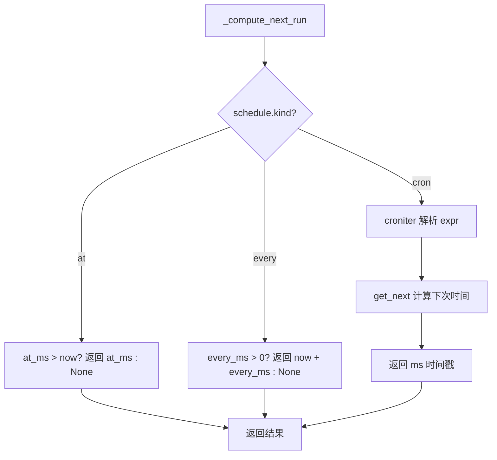
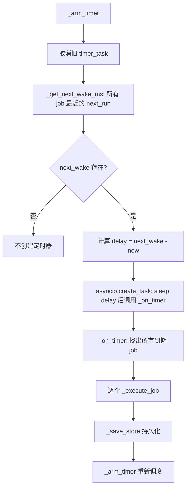

# PD-99.01 DeepCode — CronService 三模式定时任务调度

> 文档编号：PD-99.01
> 来源：DeepCode `nanobot/nanobot/cron/service.py`
> GitHub：https://github.com/HKUDS/DeepCode.git
> 问题域：PD-99 定时任务调度 Task Scheduling
> 状态：可复用方案

---

## 第 1 章 问题与动机

### 1.1 核心问题

Agent 系统需要在无人值守的情况下执行周期性任务——定时检查 GitHub stars、每日发送摘要报告、在指定时间提醒用户。传统 cron 系统（如 Linux crontab、APScheduler）面向运维人员，Agent 无法自主创建和管理调度任务。核心挑战在于：

1. **Agent 自主性**：Agent 需要在对话中动态创建定时任务，而非依赖人工配置
2. **多模式调度**：一次性提醒（at）、固定间隔（every）、复杂时间表达式（cron）三种场景都需要覆盖
3. **任务持久化**：进程重启后已注册的任务不能丢失
4. **执行闭环**：定时触发后需要回到 Agent 循环执行任务，而非简单发送消息

### 1.2 DeepCode 的解法概述

DeepCode 的 nanobot 实现了一个轻量级但完整的 CronService 调度系统：

1. **三模式调度引擎**：`CronSchedule` 数据类支持 `at`（一次性时间戳）、`every`（毫秒间隔）、`cron`（标准 cron 表达式）三种 kind，统一在 `_compute_next_run()` 中计算下次执行时间 (`service.py:19-40`)
2. **asyncio 单定时器架构**：不为每个 job 创建独立定时器，而是维护一个全局最近唤醒时间，用单个 `asyncio.Task` 实现 sleep-then-tick 循环 (`service.py:186-203`)
3. **JSON 文件持久化**：所有 job 序列化为 JSON 存储到磁盘，启动时加载、变更时保存 (`service.py:57-148`)
4. **Tool 暴露给 Agent**：`CronTool` 继承 `Tool` 基类，以 `add/list/remove` 三个 action 暴露给 LLM，Agent 可在对话中自主调度 (`cron.py:10-108`)
5. **Agent 回调执行**：定时触发后通过 `on_job` 回调调用 `agent.process_direct()`，让 Agent 完整执行任务而非简单转发消息 (`commands.py:369-387`)

### 1.3 设计思想

| 设计原则 | 具体实现 | 理由 | 替代方案 |
|----------|----------|------|----------|
| 单定时器轮询 | `_arm_timer()` 只创建一个 asyncio.Task，sleep 到最近 job 的 next_run 时间 | 避免 N 个 job 创建 N 个定时器的资源浪费 | APScheduler 的 per-job trigger |
| 数据类驱动 | `CronSchedule`/`CronJob`/`CronPayload` 用 dataclass 定义，JSON 序列化 | 轻量、无 ORM 依赖、易于持久化 | SQLite / Redis |
| Tool 即接口 | `CronTool` 继承 `Tool` ABC，暴露 JSON Schema 参数 | Agent 通过 function calling 自主操作 | REST API / CLI 命令 |
| 回调式执行 | `on_job: Callable[[CronJob], Coroutine]` 注入 Agent 处理逻辑 | 解耦调度与执行，CronService 不依赖 AgentLoop | 直接在 service 中 import agent |
| 一次性任务自清理 | `at` 类型执行后自动 disable 或 delete（`delete_after_run` 标志） | 防止过期任务堆积 | 手动清理 |

---

## 第 2 章 源码实现分析

### 2.1 架构概览

DeepCode 的定时任务系统由三层组成：类型定义层、服务层、工具层，通过回调与 Agent 循环集成。

```
┌─────────────────────────────────────────────────────────┐
│                    CLI / Gateway                         │
│  commands.py: gateway() 创建 CronService + 注入回调      │
└──────────────┬──────────────────────────────┬───────────┘
               │ on_job callback              │ register
               ▼                              ▼
┌──────────────────────┐    ┌──────────────────────────────┐
│     CronService      │    │        AgentLoop             │
│  service.py          │    │  loop.py                     │
│                      │    │                              │
│  _arm_timer()        │    │  _register_default_tools()   │
│  _on_timer()         │◄───│    → CronTool(cron_service)  │
│  _execute_job()      │    │                              │
│  add_job()           │    │  _process_message()          │
│  remove_job()        │    │    → cron_tool.set_context()  │
│  list_jobs()         │    │                              │
└──────┬───────────────┘    └──────────────────────────────┘
       │ load/save                    ▲
       ▼                              │ execute()
┌──────────────────┐    ┌─────────────────────────┐
│  jobs.json       │    │      CronTool           │
│  (磁盘持久化)     │    │  cron.py                │
│                  │    │  action: add/list/remove │
└──────────────────┘    └─────────────────────────┘
```

### 2.2 核心实现

#### 2.2.1 三模式调度计算



对应源码 `nanobot/nanobot/cron/service.py:19-40`：

```python
def _compute_next_run(schedule: CronSchedule, now_ms: int) -> int | None:
    """Compute next run time in ms."""
    if schedule.kind == "at":
        return schedule.at_ms if schedule.at_ms and schedule.at_ms > now_ms else None

    if schedule.kind == "every":
        if not schedule.every_ms or schedule.every_ms <= 0:
            return None
        # Next interval from now
        return now_ms + schedule.every_ms

    if schedule.kind == "cron" and schedule.expr:
        try:
            from croniter import croniter
            cron = croniter(schedule.expr, time.time())
            next_time = cron.get_next()
            return int(next_time * 1000)
        except Exception:
            return None

    return None
```

关键设计点：
- 统一返回毫秒时间戳，三种模式在调用侧无差异
- `croniter` 延迟导入（lazy import），仅在使用 cron 表达式时才需要该依赖
- `at` 模式过期后返回 `None`，由调用方决定 disable 还是 delete

#### 2.2.2 单定时器 sleep-tick 循环



对应源码 `nanobot/nanobot/cron/service.py:186-221`：

```python
def _arm_timer(self) -> None:
    """Schedule the next timer tick."""
    if self._timer_task:
        self._timer_task.cancel()

    next_wake = self._get_next_wake_ms()
    if not next_wake or not self._running:
        return

    delay_ms = max(0, next_wake - _now_ms())
    delay_s = delay_ms / 1000

    async def tick():
        await asyncio.sleep(delay_s)
        if self._running:
            await self._on_timer()

    self._timer_task = asyncio.create_task(tick())

async def _on_timer(self) -> None:
    """Handle timer tick - run due jobs."""
    if not self._store:
        return
    now = _now_ms()
    due_jobs = [
        j for j in self._store.jobs
        if j.enabled and j.state.next_run_at_ms and now >= j.state.next_run_at_ms
    ]
    for job in due_jobs:
        await self._execute_job(job)
    self._save_store()
    self._arm_timer()
```

这是整个调度系统最精巧的部分：不使用轮询（polling），而是精确 sleep 到下一个 job 的执行时间。每次 tick 后重新计算下次唤醒，形成自驱动循环。

#### 2.2.3 Job 执行与生命周期管理

对应源码 `nanobot/nanobot/cron/service.py:223-253`：

```python
async def _execute_job(self, job: CronJob) -> None:
    """Execute a single job."""
    start_ms = _now_ms()
    try:
        if self.on_job:
            await self.on_job(job)
        job.state.last_status = "ok"
        job.state.last_error = None
    except Exception as e:
        job.state.last_status = "error"
        job.state.last_error = str(e)

    job.state.last_run_at_ms = start_ms
    job.updated_at_ms = _now_ms()

    # Handle one-shot jobs
    if job.schedule.kind == "at":
        if job.delete_after_run:
            self._store.jobs = [j for j in self._store.jobs if j.id != job.id]
        else:
            job.enabled = False
            job.state.next_run_at_ms = None
    else:
        job.state.next_run_at_ms = _compute_next_run(job.schedule, _now_ms())
```

### 2.3 实现细节

#### 数据模型层（types.py）

`nanobot/nanobot/cron/types.py:7-64` 定义了 5 个 dataclass：

- `CronSchedule`：调度定义，`kind` 字段区分三种模式，各模式参数互斥（at_ms / every_ms / expr）
- `CronPayload`：执行载荷，`kind` 区分 `system_event` 和 `agent_turn`，后者会触发完整 Agent 循环
- `CronJobState`：运行时状态，记录 next/last 执行时间和状态（ok/error/skipped）
- `CronJob`：完整 job 定义，包含 schedule + payload + state + 元数据
- `CronStore`：持久化容器，带版本号

#### Agent 回调闭环（commands.py:369-387）

Gateway 启动时注入回调，将 cron 触发转化为 Agent 对话：

```python
async def on_cron_job(job: CronJob) -> str | None:
    response = await agent.process_direct(
        job.payload.message,
        session_key=f"cron:{job.id}",
        channel=job.payload.channel or "cli",
        chat_id=job.payload.to or "direct",
    )
    if job.payload.deliver and job.payload.to:
        await bus.publish_outbound(OutboundMessage(
            channel=job.payload.channel or "cli",
            chat_id=job.payload.to,
            content=response or "",
        ))
    return response
```

每个 cron job 有独立的 `session_key`（`cron:{job.id}`），保证定时任务的对话历史隔离。

---

## 第 3 章 迁移指南

### 3.1 迁移清单

**阶段 1：核心调度引擎（最小可用）**

- [ ] 创建 `cron/types.py`：定义 `CronSchedule`、`CronJob`、`CronJobState`、`CronPayload`、`CronStore` 五个 dataclass
- [ ] 创建 `cron/service.py`：实现 `CronService` 类，包含 `_compute_next_run()`、`_arm_timer()`、`_on_timer()`、`_execute_job()` 核心方法
- [ ] 实现 JSON 文件持久化：`_load_store()` / `_save_store()`
- [ ] 安装 `croniter` 依赖（仅在需要 cron 表达式时）

**阶段 2：Agent 工具集成**

- [ ] 创建 `tools/cron.py`：继承你的 Tool 基类，实现 `add/list/remove` 三个 action
- [ ] 在 Agent 初始化时注册 CronTool，注入 CronService 实例
- [ ] 在消息处理循环中调用 `cron_tool.set_context(channel, chat_id)` 设置投递上下文

**阶段 3：执行回调与投递**

- [ ] 在应用启动时创建 CronService，设置 `on_job` 回调指向 Agent 的 `process_direct()` 方法
- [ ] 实现消息投递逻辑：根据 `payload.deliver` 和 `payload.channel` 将结果推送到对应渠道

### 3.2 适配代码模板

以下是一个可直接运行的最小调度引擎实现：

```python
"""Minimal cron service - 可直接复用的调度引擎模板。"""

import asyncio
import json
import time
import uuid
from dataclasses import dataclass, field
from pathlib import Path
from typing import Any, Callable, Coroutine, Literal


@dataclass
class Schedule:
    kind: Literal["at", "every", "cron"]
    at_ms: int | None = None
    every_ms: int | None = None
    expr: str | None = None


@dataclass
class JobState:
    next_run_at_ms: int | None = None
    last_run_at_ms: int | None = None
    last_status: str | None = None


@dataclass
class Job:
    id: str
    name: str
    schedule: Schedule
    message: str
    enabled: bool = True
    state: JobState = field(default_factory=JobState)
    delete_after_run: bool = False


def compute_next_run(schedule: Schedule, now_ms: int) -> int | None:
    if schedule.kind == "at":
        return schedule.at_ms if schedule.at_ms and schedule.at_ms > now_ms else None
    if schedule.kind == "every" and schedule.every_ms and schedule.every_ms > 0:
        return now_ms + schedule.every_ms
    if schedule.kind == "cron" and schedule.expr:
        from croniter import croniter
        return int(croniter(schedule.expr, time.time()).get_next() * 1000)
    return None


class MiniCronService:
    def __init__(
        self,
        store_path: Path,
        on_job: Callable[[Job], Coroutine[Any, Any, None]] | None = None,
    ):
        self.store_path = store_path
        self.on_job = on_job
        self._jobs: list[Job] = []
        self._timer: asyncio.Task | None = None
        self._running = False

    async def start(self) -> None:
        self._running = True
        self._load()
        self._recompute()
        self._save()
        self._arm()

    def stop(self) -> None:
        self._running = False
        if self._timer:
            self._timer.cancel()

    def add_job(self, name: str, schedule: Schedule, message: str) -> Job:
        now = int(time.time() * 1000)
        job = Job(
            id=str(uuid.uuid4())[:8],
            name=name,
            schedule=schedule,
            message=message,
            state=JobState(next_run_at_ms=compute_next_run(schedule, now)),
        )
        self._jobs.append(job)
        self._save()
        self._arm()
        return job

    def remove_job(self, job_id: str) -> bool:
        before = len(self._jobs)
        self._jobs = [j for j in self._jobs if j.id != job_id]
        if len(self._jobs) < before:
            self._save()
            self._arm()
            return True
        return False

    def list_jobs(self) -> list[Job]:
        return [j for j in self._jobs if j.enabled]

    # --- 内部方法 ---

    def _arm(self) -> None:
        if self._timer:
            self._timer.cancel()
        times = [j.state.next_run_at_ms for j in self._jobs
                 if j.enabled and j.state.next_run_at_ms]
        if not times or not self._running:
            return
        delay = max(0, min(times) - int(time.time() * 1000)) / 1000

        async def tick():
            await asyncio.sleep(delay)
            if self._running:
                await self._tick()

        self._timer = asyncio.create_task(tick())

    async def _tick(self) -> None:
        now = int(time.time() * 1000)
        for job in [j for j in self._jobs
                    if j.enabled and j.state.next_run_at_ms
                    and now >= j.state.next_run_at_ms]:
            try:
                if self.on_job:
                    await self.on_job(job)
                job.state.last_status = "ok"
            except Exception:
                job.state.last_status = "error"
            job.state.last_run_at_ms = now
            if job.schedule.kind == "at":
                job.enabled = False
            else:
                job.state.next_run_at_ms = compute_next_run(job.schedule, now)
        self._save()
        self._arm()

    def _recompute(self) -> None:
        now = int(time.time() * 1000)
        for j in self._jobs:
            if j.enabled:
                j.state.next_run_at_ms = compute_next_run(j.schedule, now)

    def _load(self) -> None:
        if self.store_path.exists():
            data = json.loads(self.store_path.read_text())
            self._jobs = [
                Job(id=j["id"], name=j["name"],
                    schedule=Schedule(**j["schedule"]),
                    message=j["message"], enabled=j.get("enabled", True),
                    state=JobState(**j.get("state", {})))
                for j in data.get("jobs", [])
            ]

    def _save(self) -> None:
        self.store_path.parent.mkdir(parents=True, exist_ok=True)
        data = {"jobs": [
            {"id": j.id, "name": j.name, "message": j.message,
             "enabled": j.enabled,
             "schedule": {"kind": j.schedule.kind, "at_ms": j.schedule.at_ms,
                          "every_ms": j.schedule.every_ms, "expr": j.schedule.expr},
             "state": {"next_run_at_ms": j.state.next_run_at_ms,
                       "last_run_at_ms": j.state.last_run_at_ms,
                       "last_status": j.state.last_status}}
            for j in self._jobs
        ]}
        self.store_path.write_text(json.dumps(data, indent=2))
```

### 3.3 适用场景

| 场景 | 适用度 | 说明 |
|------|--------|------|
| Agent 自主创建定时提醒 | ⭐⭐⭐ | 核心场景，CronTool 直接暴露给 LLM |
| 周期性数据采集/监控 | ⭐⭐⭐ | every 模式 + Agent 回调执行采集逻辑 |
| 复杂时间表达式调度 | ⭐⭐⭐ | cron 表达式覆盖工作日、特定时间等 |
| 高精度调度（<1s） | ⭐ | asyncio.sleep 精度有限，不适合亚秒级 |
| 大规模任务（>1000 job） | ⭐ | 单 JSON 文件 + 内存全量加载，不适合大规模 |
| 分布式多节点调度 | ⭐ | 单进程单文件设计，无分布式锁 |

---

## 第 4 章 测试用例

```python
"""Tests for CronService - 基于 DeepCode 真实函数签名。"""

import asyncio
import json
import time
from pathlib import Path
from unittest.mock import AsyncMock

import pytest


# --- 复用 types 定义 ---
from dataclasses import dataclass, field
from typing import Literal


@dataclass
class CronSchedule:
    kind: Literal["at", "every", "cron"]
    at_ms: int | None = None
    every_ms: int | None = None
    expr: str | None = None
    tz: str | None = None


@dataclass
class CronJobState:
    next_run_at_ms: int | None = None
    last_run_at_ms: int | None = None
    last_status: str | None = None
    last_error: str | None = None


@dataclass
class CronPayload:
    kind: Literal["system_event", "agent_turn"] = "agent_turn"
    message: str = ""
    deliver: bool = False
    channel: str | None = None
    to: str | None = None


@dataclass
class CronJob:
    id: str
    name: str
    enabled: bool = True
    schedule: CronSchedule = field(default_factory=lambda: CronSchedule(kind="every"))
    payload: CronPayload = field(default_factory=CronPayload)
    state: CronJobState = field(default_factory=CronJobState)
    created_at_ms: int = 0
    updated_at_ms: int = 0
    delete_after_run: bool = False


class TestComputeNextRun:
    """测试 _compute_next_run 三模式计算。"""

    def _now_ms(self):
        return int(time.time() * 1000)

    def test_at_future(self):
        """at 模式：未来时间戳应返回该时间戳。"""
        now = self._now_ms()
        schedule = CronSchedule(kind="at", at_ms=now + 60000)
        # 模拟 _compute_next_run 逻辑
        result = schedule.at_ms if schedule.at_ms and schedule.at_ms > now else None
        assert result == now + 60000

    def test_at_past(self):
        """at 模式：过去时间戳应返回 None。"""
        now = self._now_ms()
        schedule = CronSchedule(kind="at", at_ms=now - 1000)
        result = schedule.at_ms if schedule.at_ms and schedule.at_ms > now else None
        assert result is None

    def test_every_positive(self):
        """every 模式：正间隔应返回 now + interval。"""
        now = self._now_ms()
        schedule = CronSchedule(kind="every", every_ms=5000)
        result = now + schedule.every_ms if schedule.every_ms and schedule.every_ms > 0 else None
        assert result == now + 5000

    def test_every_zero(self):
        """every 模式：零间隔应返回 None。"""
        schedule = CronSchedule(kind="every", every_ms=0)
        result = None if not schedule.every_ms or schedule.every_ms <= 0 else 1
        assert result is None


class TestCronServicePersistence:
    """测试 JSON 持久化。"""

    def test_save_and_load(self, tmp_path: Path):
        """保存后重新加载应恢复所有 job。"""
        store_path = tmp_path / "cron" / "jobs.json"
        store_path.parent.mkdir(parents=True)

        # 写入测试数据
        data = {
            "version": 1,
            "jobs": [{
                "id": "test-001",
                "name": "Test Job",
                "enabled": True,
                "schedule": {"kind": "every", "everyMs": 5000},
                "payload": {"kind": "agent_turn", "message": "hello"},
                "state": {"nextRunAtMs": None},
                "createdAtMs": 1000,
                "updatedAtMs": 1000,
                "deleteAfterRun": False,
            }]
        }
        store_path.write_text(json.dumps(data))

        # 验证文件可读
        loaded = json.loads(store_path.read_text())
        assert len(loaded["jobs"]) == 1
        assert loaded["jobs"][0]["id"] == "test-001"
        assert loaded["jobs"][0]["schedule"]["kind"] == "every"

    def test_empty_store(self, tmp_path: Path):
        """不存在的 store 文件应初始化为空。"""
        store_path = tmp_path / "nonexistent" / "jobs.json"
        assert not store_path.exists()


class TestCronToolActions:
    """测试 CronTool 的 add/list/remove 操作。"""

    def test_add_requires_message(self):
        """add 操作缺少 message 应返回错误。"""
        # 模拟 CronTool._add_job 逻辑
        message = ""
        result = "Error: message is required for add" if not message else "ok"
        assert "Error" in result

    def test_add_requires_schedule(self):
        """add 操作缺少 every_seconds 和 cron_expr 应返回错误。"""
        every_seconds = None
        cron_expr = None
        if not every_seconds and not cron_expr:
            result = "Error: either every_seconds or cron_expr is required"
        else:
            result = "ok"
        assert "Error" in result

    def test_remove_requires_job_id(self):
        """remove 操作缺少 job_id 应返回错误。"""
        job_id = None
        result = "Error: job_id is required for remove" if not job_id else "ok"
        assert "Error" in result


class TestJobLifecycle:
    """测试 job 生命周期管理。"""

    def test_at_job_disables_after_run(self):
        """at 类型 job 执行后应被 disable。"""
        job = CronJob(
            id="once-001", name="One-shot",
            schedule=CronSchedule(kind="at", at_ms=int(time.time() * 1000)),
        )
        # 模拟 _execute_job 中的 at 处理逻辑
        if job.schedule.kind == "at":
            if job.delete_after_run:
                pass  # would be removed from list
            else:
                job.enabled = False
                job.state.next_run_at_ms = None

        assert job.enabled is False
        assert job.state.next_run_at_ms is None

    def test_at_job_deletes_when_flagged(self):
        """delete_after_run=True 的 at job 执行后应从列表移除。"""
        jobs = [
            CronJob(id="del-001", name="Delete me",
                    schedule=CronSchedule(kind="at"),
                    delete_after_run=True),
            CronJob(id="keep-001", name="Keep me",
                    schedule=CronSchedule(kind="every", every_ms=5000)),
        ]
        # 模拟删除逻辑
        target = jobs[0]
        if target.schedule.kind == "at" and target.delete_after_run:
            jobs = [j for j in jobs if j.id != target.id]

        assert len(jobs) == 1
        assert jobs[0].id == "keep-001"
```

---

## 第 5 章 跨域关联

| 关联域 | 关系类型 | 说明 |
|--------|----------|------|
| PD-04 工具系统 | 依赖 | CronTool 继承 Tool ABC，通过 ToolRegistry 注册，依赖工具系统的 JSON Schema 参数定义和 execute 接口 |
| PD-06 记忆持久化 | 协同 | CronService 的 JSON 文件持久化与记忆系统的持久化策略类似，都是磁盘 JSON + 启动加载模式 |
| PD-02 多 Agent 编排 | 协同 | cron job 触发后通过 `process_direct()` 进入 Agent 循环，可能触发子代理编排 |
| PD-03 容错与重试 | 协同 | `_execute_job` 捕获异常记录 `last_error`，但未实现重试机制，可与 PD-03 的重试策略结合 |
| PD-09 Human-in-the-Loop | 互补 | cron 是自动化调度（无人值守），与 HITL 的人工审批形成互补——某些定时任务可能需要人工确认后才执行 |
| PD-11 可观测性 | 协同 | CronService 使用 loguru 记录 job 执行日志，可接入 PD-11 的追踪系统实现调度可观测性 |

---

## 第 6 章 来源文件索引

| 文件 | 行范围 | 关键实现 |
|------|--------|----------|
| `nanobot/nanobot/cron/types.py` | L1-L65 | 5 个 dataclass 定义：CronSchedule、CronPayload、CronJobState、CronJob、CronStore |
| `nanobot/nanobot/cron/service.py` | L15-L18 | `_now_ms()` 毫秒时间戳工具函数 |
| `nanobot/nanobot/cron/service.py` | L19-L40 | `_compute_next_run()` 三模式调度计算核心 |
| `nanobot/nanobot/cron/service.py` | L43-L104 | `CronService.__init__` + `_load_store()` 初始化与持久化加载 |
| `nanobot/nanobot/cron/service.py` | L106-L148 | `_save_store()` JSON 序列化与磁盘写入 |
| `nanobot/nanobot/cron/service.py` | L150-L159 | `start()` / `stop()` 服务生命周期 |
| `nanobot/nanobot/cron/service.py` | L168-L203 | `_recompute_next_runs()` + `_arm_timer()` 单定时器调度核心 |
| `nanobot/nanobot/cron/service.py` | L205-L253 | `_on_timer()` + `_execute_job()` 任务执行与生命周期管理 |
| `nanobot/nanobot/cron/service.py` | L257-L300 | `list_jobs()` / `add_job()` 公共 API |
| `nanobot/nanobot/cron/service.py` | L302-L352 | `remove_job()` / `enable_job()` / `run_job()` / `status()` |
| `nanobot/nanobot/agent/tools/cron.py` | L10-L108 | CronTool 完整实现：Tool 继承、参数 Schema、add/list/remove 三个 action |
| `nanobot/nanobot/agent/tools/base.py` | L7-L104 | Tool ABC 基类：name/description/parameters/execute 抽象接口 + validate_params |
| `nanobot/nanobot/agent/loop.py` | L115-L117 | AgentLoop 中注册 CronTool |
| `nanobot/nanobot/agent/loop.py` | L191-L193 | 消息处理时设置 CronTool 的 channel/chat_id 上下文 |
| `nanobot/nanobot/cli/commands.py` | L350-L352 | Gateway 创建 CronService，store_path 指向 data_dir/cron/jobs.json |
| `nanobot/nanobot/cli/commands.py` | L369-L389 | on_cron_job 回调：将 cron 触发转化为 Agent process_direct 调用 |
| `nanobot/nanobot/cli/commands.py` | L419-L429 | Gateway 启动/关闭时 cron.start() / cron.stop() |
| `nanobot/nanobot/cli/commands.py` | L663-L819 | CLI cron 子命令：list/add/remove/enable/run |
| `nanobot/nanobot/skills/cron/SKILL.md` | L1-L41 | Cron skill 文档：两种模式（Reminder/Task）+ 时间表达式示例 |

---

## 第 7 章 横向对比维度

```json comparison_data
{
  "project": "DeepCode",
  "dimensions": {
    "调度模式": "at（一次性）+ every（间隔）+ cron 表达式，三模式统一接口",
    "定时器架构": "单 asyncio.Task sleep-tick，全局最近唤醒时间驱动",
    "持久化方式": "单 JSON 文件，启动加载 + 变更即存",
    "Agent集成": "CronTool 继承 Tool ABC，LLM function calling 自主操作",
    "执行模型": "on_job 回调注入 agent.process_direct()，完整 Agent 循环",
    "任务生命周期": "at 自动 disable/delete，every/cron 自动重算 next_run",
    "CLI管理": "typer 子命令 cron list/add/remove/enable/run"
  }
}
```

### 域元数据补充

```json domain_metadata
{
  "solution_summary": "DeepCode nanobot 用 asyncio 单定时器 + CronTool function calling 实现 Agent 自主创建三模式（at/every/cron）定时任务，JSON 文件持久化，on_job 回调闭环执行",
  "description": "定时任务与 Agent 工具系统深度集成，实现 Agent 自主调度的完整闭环",
  "sub_problems": [
    "定时任务触发后的 Agent 回调执行闭环",
    "多渠道消息投递（Telegram/WhatsApp/Slack）",
    "CLI 与 Agent 双入口任务管理"
  ],
  "best_practices": [
    "单定时器架构避免 N 个 job 创建 N 个 timer 的资源浪费",
    "on_job 回调解耦调度与执行，CronService 不依赖 AgentLoop",
    "每个 cron job 独立 session_key 保证对话历史隔离"
  ]
}
```
